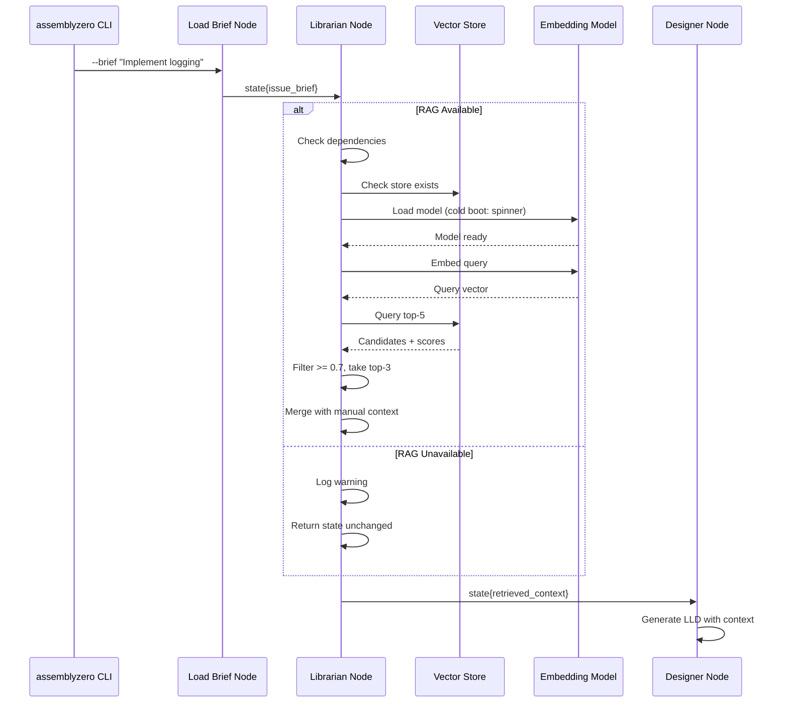
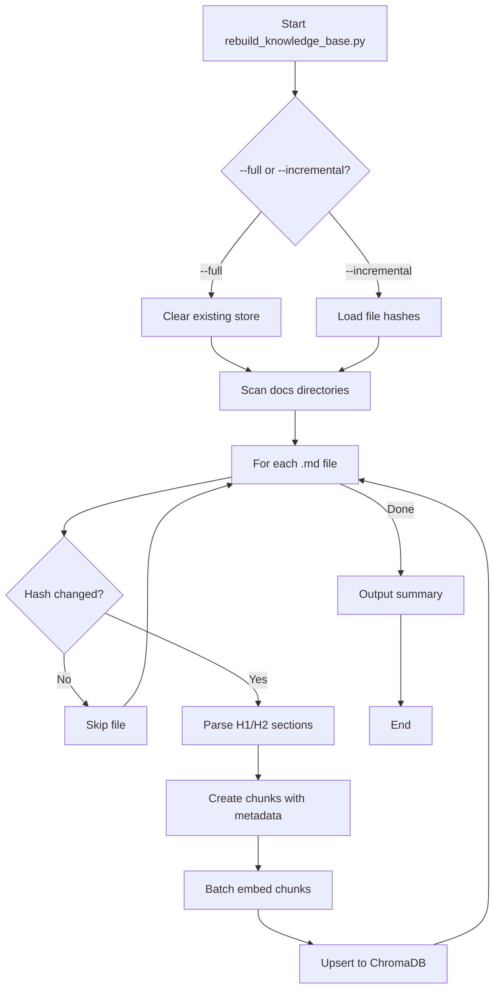

# 188 - Feature: RAG Injection: Automated Context Retrieval ("The Librarian")

<!-- Template Metadata
Last Updated: 2026-02-02
Updated By: Issue #117 fix
Update Reason: Moved Verification & Testing to Section 10 (was Section 11) to match 0702c review prompt and testing workflow expectations
Previous: Added sections based on 80 blocking issues from 164 governance verdicts (2026-02-01)
-->

## 1. Context & Goal
* **Issue:** #88
* **Objective:** Implement automated RAG retrieval that queries a local vector store with issue briefs and injects top-3 relevant governance documents into the Designer Agent's context
* **Status:** Approved (gemini-3-pro-preview, 2026-02-04)
* **Related Issues:** None (standalone enhancement)

### Open Questions
*All questions resolved during Gemini Review #1.*

- [x] ~~Should the similarity threshold (0.7) be configurable via environment variable or CLI flag?~~ **RESOLVED: Yes. Use environment variable `AGENTOS_RAG_THRESHOLD` with default 0.7.**
- [x] ~~What is the expected cold-boot time budget for embedding model loading (currently specified as spinner at 500ms)?~~ **RESOLVED: 5-10s budget for model loading. 500ms is the spinner display threshold, not the loading budget.**
- [x] ~~Should we support hybrid search (keyword + semantic) for edge cases where semantic similarity misses exact terminology matches?~~ **RESOLVED: No. Semantic search only for MVP. Hybrid search deferred to future enhancement if recall issues proven.**

## 2. Proposed Changes

*This section is the **source of truth** for implementation. Describe exactly what will be built.*

### 2.1 Files Changed

| File | Change Type | Description |
|------|-------------|-------------|
| `tools/rebuild_knowledge_base.py` | Add | CLI tool to ingest docs into vector store |
| `assemblyzero/nodes/librarian.py` | Add | RAG retrieval node with conditional imports |
| `assemblyzero/workflows/lld/graph.py` | Modify | Wire Librarian node into workflow between Load Brief and Designer |
| `assemblyzero/workflows/lld/state.py` | Modify | Add `retrieved_context` field to State schema |
| `pyproject.toml` | Modify | Add `[rag]` optional dependencies |
| `.gitignore` | Modify | Add `.assemblyzero/vector_store/` |
| `docs/adrs/0XXX-rag-librarian.md` | Add | ADR documenting decision and license compliance |
| `tests/unit/test_librarian.py` | Add | Unit tests for Librarian node |
| `tests/integration/test_rag_workflow.py` | Add | Integration tests for RAG-augmented LLD workflow |
| `tests/performance/test_rag_performance.py` | Add | Performance benchmarks for indexing and query |

### 2.2 Dependencies

*New packages, APIs, or services required.*

```toml
# pyproject.toml additions - OPTIONAL dependencies under [rag] extra
[project.optional-dependencies]
rag = [
    "chromadb>=0.4.0,<1.0.0",
    "sentence-transformers>=2.2.0,<3.0.0",
    "tqdm>=4.65.0,<5.0.0",  # Progress bar for rebuild tool
]
```

**License Compliance:**
| Package | License | Compatible | Notes |
|---------|---------|------------|-------|
| `chromadb` | Apache 2.0 | ✅ Yes | Permissive, no copyleft concerns |
| `sentence-transformers` | Apache 2.0 | ✅ Yes | Permissive, no copyleft concerns |
| `torch` (transitive) | BSD-style | ✅ Yes | PyTorch Foundation license |
| `huggingface-hub` (transitive) | Apache 2.0 | ✅ Yes | Permissive |
| `all-MiniLM-L6-v2` model | Apache 2.0 | ✅ Yes | Model card confirms commercial use permitted |
| `tqdm` | MPL 2.0 / MIT | ✅ Yes | Permissive |

### 2.3 Data Structures

```python
# Pseudocode - NOT implementation
class RetrievedDocument(TypedDict):
    file_path: str          # Path to source document
    section: str            # H1/H2 section title
    content_snippet: str    # Extracted text chunk
    score: float            # Similarity score (0.0-1.0)

class LLDWorkflowState(TypedDict):
    issue_brief: str                           # Input brief text
    manual_context: list[str]                  # User-provided --context paths
    retrieved_context: list[RetrievedDocument] # RAG-retrieved documents
    combined_context: str                      # Merged context for Designer
    # ... existing fields ...

class LibrarianConfig(TypedDict):
    similarity_threshold: float  # Default: 0.7, env: AGENTOS_RAG_THRESHOLD
    top_k_candidates: int        # Default: 5
    top_k_results: int           # Default: 3
    embedding_model: str         # Default: "all-MiniLM-L6-v2", env: AGENTOS_RAG_MODEL
    vector_store_path: str       # Default: ".assemblyzero/vector_store/"
```

### 2.4 Function Signatures

```python
# assemblyzero/nodes/librarian.py

def get_config() -> LibrarianConfig:
    """Load configuration from environment variables with defaults.
    
    Environment Variables:
        AGENTOS_RAG_THRESHOLD: Similarity threshold (default: 0.7)
        AGENTOS_RAG_MODEL: Embedding model name (default: "all-MiniLM-L6-v2")
        
    Returns:
        LibrarianConfig with resolved values
    """
    ...

def check_rag_dependencies() -> tuple[bool, str]:
    """Check if RAG optional dependencies are installed.
    
    Returns:
        Tuple of (available: bool, message: str)
    """
    ...

def check_vector_store_exists(store_path: str = ".assemblyzero/vector_store/") -> bool:
    """Check if vector store has been initialized.
    
    Returns:
        True if vector store exists and is valid, False otherwise.
    """
    ...

def load_embedding_model(model_name: str = "all-MiniLM-L6-v2") -> Any:
    """Load the sentence transformer embedding model.
    
    Args:
        model_name: HuggingFace model identifier
        
    Returns:
        Loaded SentenceTransformer model
        
    Raises:
        ImportError: If sentence-transformers not installed
    """
    ...

def query_knowledge_base(
    query: str,
    top_k: int = 3,
    threshold: float = 0.7,
    store_path: str = ".assemblyzero/vector_store/"
) -> list[RetrievedDocument]:
    """Query the vector store for relevant documents.
    
    Args:
        query: The text to search for (issue brief)
        top_k: Maximum number of results to return
        threshold: Minimum similarity score (0.0-1.0)
        store_path: Path to ChromaDB persistent storage
        
    Returns:
        List of RetrievedDocument sorted by score descending
    """
    ...

def librarian_node(state: LLDWorkflowState) -> LLDWorkflowState:
    """LangGraph node that retrieves relevant context via RAG.
    
    Args:
        state: Current workflow state containing issue_brief
        
    Returns:
        Updated state with retrieved_context populated
    """
    ...

def merge_context(
    manual_context: list[str],
    rag_context: list[RetrievedDocument]
) -> str:
    """Merge manual and RAG context, with manual taking precedence.
    
    Args:
        manual_context: User-provided file paths
        rag_context: RAG-retrieved documents
        
    Returns:
        Combined context string for Designer node
    """
    ...
```

```python
# tools/rebuild_knowledge_base.py

def parse_markdown_sections(file_path: str) -> list[dict]:
    """Split markdown file by H1/H2 headers into chunks.
    
    Args:
        file_path: Path to markdown file
        
    Returns:
        List of {title, content, file_path} dicts
    """
    ...

def get_file_hash(file_path: str) -> str:
    """Compute hash for incremental update detection.
    
    Args:
        file_path: Path to file
        
    Returns:
        SHA256 hash string
    """
    ...

def index_documents(
    docs_dirs: list[str],
    store_path: str,
    incremental: bool = True
) -> dict:
    """Index markdown documents into ChromaDB.
    
    Args:
        docs_dirs: List of directories to scan
        store_path: Path for ChromaDB persistent storage
        incremental: If True, only reindex changed files
        
    Returns:
        Summary dict with files_indexed, chunks_created, time_elapsed
    """
    ...

def main() -> None:
    """CLI entry point for rebuild_knowledge_base.py"""
    ...
```

### 2.5 Logic Flow (Pseudocode)

**Librarian Node Execution:**
```
1. Receive state with issue_brief
2. Load config from environment variables
3. Check RAG dependencies installed
   IF NOT installed THEN
     - Log: "[Librarian] RAG dependencies not installed..."
     - Return state unchanged (graceful degradation)
4. Check vector store exists at .assemblyzero/vector_store/
   IF NOT exists THEN
     - Log warning: "[Librarian] Vector store not found..."
     - Return state unchanged (graceful degradation)
5. Show CLI spinner if cold boot (model not cached)
6. Load embedding model (from config.embedding_model)
7. Embed issue_brief into query vector
8. Query ChromaDB for k=5 candidates
9. Filter results with score >= config.similarity_threshold
10. Take top 3 results
11. IF no results above threshold THEN
    - Log: "[Librarian] No relevant documents found..."
12. Merge RAG results with manual --context
    - Manual context takes precedence
    - Deduplicate by file_path
13. Update state.retrieved_context and state.combined_context
14. Return updated state
```

**Knowledge Base Rebuild:**
```
1. Parse CLI args (--full or --incremental)
2. Scan docs/adrs/, docs/standards/, docs/LLDs/done/
3. Initialize tqdm progress bar
4. FOR each markdown file:
   a. Compute file hash
   b. IF incremental AND hash unchanged THEN skip
   c. Parse file into H1/H2 sections
   d. Create chunk with metadata (file_path, section_title)
   e. Update progress bar
5. Initialize/update ChromaDB collection
6. Batch embed and upsert chunks
7. Output summary: files indexed, chunks created, time elapsed
```

### 2.6 Technical Approach

* **Module:** `assemblyzero/nodes/librarian.py`, `tools/rebuild_knowledge_base.py`
* **Pattern:** Strategy pattern for embedding backends (local vs API), Null Object for graceful degradation
* **Key Decisions:**
  - ChromaDB chosen for zero-config local persistence with HNSW indexing
  - `all-MiniLM-L6-v2` balances quality (384 dimensions) with size (~80MB)
  - Optional dependencies keep core installation lightweight
  - Conditional imports prevent ImportError on standard installs
  - Environment variables for runtime configuration without code changes

### 2.7 Architecture Decisions

*Document key architectural decisions that affect the design.*

| Decision | Options Considered | Choice | Rationale |
|----------|-------------------|--------|-----------|
| Vector Store | ChromaDB, FAISS+pickle, Qdrant | ChromaDB | Zero-config persistence, built-in HNSW, Apache 2.0 license |
| Embedding Model | all-MiniLM-L6-v2, OpenAI ada-002, custom fine-tuned | all-MiniLM-L6-v2 (default) | Local execution (privacy), good quality, small footprint |
| Chunking Strategy | Fixed-size, H1/H2 headers, semantic | H1/H2 headers | Preserves document structure, enables section-level retrieval |
| Dependency Strategy | Required, Optional, Plugin | Optional (`[rag]` extra) | Core stays lightweight, RAG is opt-in feature |
| Threshold Default | 0.5, 0.7, 0.8 | 0.7 | Balances recall vs precision for governance docs |
| Configuration | Hardcoded, CLI flags, Env vars | Environment variables | Runtime tuning without code changes, CI/CD friendly |

**Architectural Constraints:**
- Must integrate with existing LangGraph workflow without breaking non-RAG paths
- Cannot require external services for default operation (local-first)
- Must support graceful degradation for users without RAG extras installed
- Vector store must be regenerable (not committed to git)

## 3. Requirements

*What must be true when this is done. These become acceptance criteria.*

1. `tools/rebuild_knowledge_base.py` indexes 100+ files in < 10 seconds
2. Queries complete in < 500ms after model warm-up
3. Query "How do I log errors?" retrieves logging-related documents
4. Query "authentication flow" retrieves identity/auth ADRs
5. Workflow gracefully degrades when vector store is missing (warning, continues)
6. Workflow gracefully degrades when `[rag]` extra not installed (friendly message, continues)
7. Manual `--context` takes precedence over RAG results
8. Vector store persists between sessions (no re-embedding on every run)
9. Core `pip install assemblyzero` does not pull torch/chromadb
10. `pip install assemblyzero[rag]` works cleanly on Linux/Mac/Windows
11. CLI spinner displays during cold-boot model loading (threshold: 500ms)
12. Generated LLDs reference retrieved ADRs in Constraints section automatically

## 4. Alternatives Considered

| Option | Pros | Cons | Decision |
|--------|------|------|----------|
| ChromaDB local vector store | Zero-config, persistent, Apache 2.0, good Python API | Larger dependency tree than FAISS | **Selected** |
| FAISS + pickle | Lightweight, fast, minimal deps | Manual persistence, no metadata filtering | Rejected |
| Remote vector store (Pinecone/Weaviate) | Team sync, managed infrastructure | External dependency, network latency, cost | Rejected (future scope) |
| Required dependencies (not optional) | Simpler implementation | Bloats core install with ML deps | Rejected |
| Plugin architecture | Maximum flexibility | Overengineered for single feature | Rejected |

**Rationale:** ChromaDB provides the best balance of ease-of-use, local-first operation, and production-ready features. Optional dependencies preserve the lightweight core installation while making RAG available to users who need it.

## 5. Data & Fixtures

*Per [0108-lld-pre-implementation-review.md](0108-lld-pre-implementation-review.md) - complete this section BEFORE implementation.*

### 5.1 Data Sources

| Attribute | Value |
|-----------|-------|
| Source | Local filesystem: `docs/adrs/`, `docs/standards/`, `docs/LLDs/done/` |
| Format | Markdown (.md files) |
| Size | ~100 files, ~500KB total (estimated) |
| Refresh | Manual via `rebuild_knowledge_base.py` |
| Copyright/License | Internal documentation, project-owned |

### 5.2 Data Pipeline

```
Markdown Files ──parse_sections──► Chunks ──embed──► Vectors ──upsert──► ChromaDB
                                     │
                                     └── Metadata (file_path, section, hash)
```

### 5.3 Test Fixtures

| Fixture | Source | Notes |
|---------|--------|-------|
| Sample ADR (logging) | Generated | Tests retrieval of logging-related content |
| Sample ADR (auth) | Generated | Tests retrieval of auth-related content |
| Sample Standard | Generated | Tests retrieval of coding standards |
| Mock ChromaDB collection | Mocked | Unit tests without real vector store |
| Empty vector store | Generated | Tests graceful degradation |
| 100-file fixture set | Generated | Performance benchmark fixtures |

### 5.4 Deployment Pipeline

```
Development: .assemblyzero/vector_store/ (local, gitignored)
    │
    └── rebuild_knowledge_base.py --full
    
CI/Testing: Ephemeral vector store in test fixtures
    │
    └── pytest fixtures create/destroy per test session
    
Production: User runs rebuild_knowledge_base.py after install
    │
    └── Documentation guides initial setup
```

**External utility needed:** No - `rebuild_knowledge_base.py` is part of this issue.

## 6. Diagram

### 6.1 Mermaid Quality Gate

Before finalizing any diagram, verify in [Mermaid Live Editor](https://mermaid.live) or GitHub preview:

- [x] **Simplicity:** Similar components collapsed (per 0006 §8.1)
- [x] **No touching:** All elements have visual separation (per 0006 §8.2)
- [x] **No hidden lines:** All arrows fully visible (per 0006 §8.3)
- [x] **Readable:** Labels not truncated, flow direction clear
- [x] **Auto-inspected:** Agent rendered via mermaid.ink and viewed (per 0006 §8.5)

**Agent Auto-Inspection (MANDATORY):**

AI agents MUST render and view the diagram before committing:
1. Base64 encode diagram → fetch PNG from `https://mermaid.ink/img/{base64}`
2. Read the PNG file (multimodal inspection)
3. Document results below

**Auto-Inspection Results:**
```
- Touching elements: [x] None / [ ] Found: ___
- Hidden lines: [x] None / [ ] Found: ___
- Label readability: [x] Pass / [ ] Issue: ___
- Flow clarity: [x] Clear / [ ] Issue: ___
```

*Reference: [0006-mermaid-diagrams.md](0006-mermaid-diagrams.md)*

### 6.2 Workflow Integration Diagram



### 6.3 Knowledge Base Indexing Flow



## 7. Security & Safety Considerations

*This section addresses security (10 patterns) and safety (9 patterns) concerns from governance feedback.*

### 7.1 Security

| Concern | Mitigation | Status |
|---------|------------|--------|
| Data exfiltration via embeddings | Default mode uses local model - no data leaves machine | Addressed |
| External API data exposure | If user opts into OpenAI/Gemini APIs, document text sent externally - requires explicit API key configuration | Addressed (documented) |
| Vector store tampering | Store is gitignored, regenerable from source docs, no secrets stored | Addressed |
| Prompt injection via docs | Documents are internal/trusted; query is sanitized before embedding | Addressed |
| Path traversal in file access | Restrict indexing to configured directories only | Addressed |

### 7.2 Safety

*Safety concerns focus on preventing data loss, ensuring fail-safe behavior, and protecting system integrity.*

| Concern | Mitigation | Status |
|---------|------------|--------|
| Missing dependencies crash | Conditional imports with graceful fallback and user-friendly message | Addressed |
| Missing vector store crash | Check existence before query, continue workflow without RAG | Addressed |
| Corrupted vector store | Catch ChromaDB errors, log warning, continue without RAG | Addressed |
| Model loading timeout | CLI spinner feedback, no hard timeout (user can Ctrl+C) | Addressed |
| Resource exhaustion during indexing | Batch processing, progress feedback, interruptible | Addressed |

**Fail Mode:** Fail Open - If RAG unavailable, workflow continues with manual context only. No blocking failures.

**Recovery Strategy:** 
- Corrupted vector store: `rm -rf .assemblyzero/vector_store/` then `rebuild_knowledge_base.py --full`
- Dependency issues: Clear pip cache, reinstall `assemblyzero[rag]`

## 8. Performance & Cost Considerations

*This section addresses performance and cost concerns (6 patterns) from governance feedback.*

### 8.1 Performance

| Metric | Budget | Approach |
|--------|--------|----------|
| Query latency (warm) | < 500ms | ChromaDB HNSW index, in-memory after first query |
| Query latency (cold) | < 10s | Model loading dominates; spinner provides feedback at 500ms |
| Full reindex time | < 10s for 100 files | Batch embedding, efficient chunking |
| Memory (model loaded) | ~200MB | all-MiniLM-L6-v2 is optimized for size |
| Disk (vector store) | ~50MB | Depends on corpus size; gitignored |

**Bottlenecks:** 
- Cold boot model loading (~3-5s typical, up to 10s budget) - mitigated with spinner feedback
- Large document indexing - mitigated with batching, progress bar, and incremental updates

### 8.2 Cost Analysis

| Resource | Unit Cost | Estimated Usage | Monthly Cost |
|----------|-----------|-----------------|--------------|
| Local embedding (default) | $0 | Unlimited | $0 |
| OpenAI ada-002 (optional) | $0.0001/1K tokens | ~10K tokens/index | ~$0.001 |
| Disk storage | ~$0 | 50MB | $0 |
| CI time increase | ~$0.01/min | +2 min for `[rag]` test | ~$0.60/month |

**Cost Controls:**
- [x] Default is free (local model)
- [x] External APIs require explicit opt-in via environment variables
- [x] No ongoing costs for typical usage

**Worst-Case Scenario:** User configures OpenAI embeddings and reindexes frequently - still <$1/month. Local default prevents runaway costs.

## 9. Legal & Compliance

*This section addresses legal concerns (8 patterns) from governance feedback.*

| Concern | Applies? | Mitigation |
|---------|----------|------------|
| PII/Personal Data | No | Only internal docs indexed, no PII expected |
| Third-Party Licenses | Yes | All dependencies Apache 2.0 or BSD - compatible with project |
| Terms of Service | Yes (if external API) | OpenAI/Gemini usage documented in README with ToS reminder |
| Data Retention | N/A | Vector store is regenerable cache, user controls deletion |
| Export Controls | No | No restricted algorithms or data |

**Data Classification:** Internal - project documentation only

**Compliance Checklist:**
- [x] No PII stored without consent
- [x] All third-party licenses compatible with project license (verified Apache 2.0)
- [x] External API usage documented with provider ToS considerations
- [x] Data retention is user-controlled (regenerable from source)

## 10. Verification & Testing

*Ref: [0005-testing-strategy-and-protocols.md](0005-testing-strategy-and-protocols.md)*

**Testing Philosophy:** Strive for 100% automated test coverage. Manual tests are a last resort for scenarios that genuinely cannot be automated.

### 10.0 Test Plan (TDD - Complete Before Implementation)

**TDD Requirement:** Tests MUST be written and failing BEFORE implementation begins.

| Test ID | Test Description | Expected Behavior | Status |
|---------|------------------|-------------------|--------|
| T010 | test_check_rag_deps_installed | Returns (True, "") when chromadb available | RED |
| T020 | test_check_rag_deps_missing | Returns (False, helpful message) when missing | RED |
| T030 | test_check_vector_store_exists | Returns True when .assemblyzero/vector_store/ valid | RED |
| T040 | test_check_vector_store_missing | Returns False when directory absent | RED |
| T050 | test_query_returns_top_3 | Returns <= 3 results sorted by score | RED |
| T060 | test_query_filters_below_threshold | Results with score < 0.7 excluded | RED |
| T070 | test_query_empty_when_no_matches | Returns [] when all scores below threshold | RED |
| T080 | test_merge_context_manual_precedence | Manual context appears before RAG | RED |
| T090 | test_merge_context_deduplicates | Same file_path not duplicated | RED |
| T100 | test_librarian_node_graceful_no_deps | Logs warning, returns unchanged state | RED |
| T110 | test_librarian_node_graceful_no_store | Logs warning, returns unchanged state | RED |
| T120 | test_rebuild_full_mode | Indexes all files, clears existing | RED |
| T130 | test_rebuild_incremental_skips_unchanged | Only reindexes modified files | RED |
| T140 | test_parse_markdown_sections | Correctly splits on H1/H2 | RED |
| T150 | test_integration_logging_query | "log errors" retrieves logging docs | RED |
| T160 | test_integration_auth_query | "authentication" retrieves auth docs | RED |
| T170 | test_spinner_displays_on_cold_boot | Spinner shown when loading exceeds 500ms | RED |
| T180 | test_core_install_lightweight | pip list excludes torch/chromadb | RED |
| T190 | test_rag_extra_installs | import chromadb succeeds after [rag] install | RED |
| T200 | test_indexing_performance_budget | 100 files indexed in < 10 seconds | RED |
| T210 | test_query_performance_budget | Query completes in < 500ms (warm) | RED |
| T220 | test_e2e_lld_references_retrieved_adrs | Generated LLD includes retrieved ADR references | RED |

**Coverage Target:** ≥95% for all new code

**TDD Checklist:**
- [ ] All tests written before implementation
- [ ] Tests currently RED (failing)
- [ ] Test IDs match scenario IDs in 10.1
- [ ] Test file created at: `tests/unit/test_librarian.py`, `tests/integration/test_rag_workflow.py`, `tests/performance/test_rag_performance.py`

### 10.1 Test Scenarios

| ID | Scenario | Type | Input | Expected Output | Pass Criteria |
|----|----------|------|-------|-----------------|---------------|
| 010 | RAG deps check - installed | Auto | Mock chromadb available | (True, "") | check_rag_dependencies returns success |
| 020 | RAG deps check - missing | Auto | Mock import failure | (False, "Run 'pip install...'") | Returns helpful message |
| 030 | Vector store exists | Auto | Valid .assemblyzero/vector_store/ | True | check_vector_store_exists returns True |
| 040 | Vector store missing | Auto | No directory | False | Returns False, no exception |
| 050 | Query returns top 3 | Auto | 5 candidates above threshold | 3 results | Length <= 3, sorted desc by score |
| 060 | Query filters low scores | Auto | Mix of scores 0.3-0.9 | Only >= 0.7 | All returned scores >= 0.7 |
| 070 | Query no matches | Auto | Irrelevant query | [] | Empty list, no error |
| 080 | Manual context precedence | Auto | Manual + RAG overlap | Manual first | Combined string starts with manual |
| 090 | Context deduplication | Auto | Same file in both | Single entry | No duplicate file_paths |
| 100 | Graceful - no deps | Auto | chromadb import fails | Warning logged, state unchanged | State identical to input |
| 110 | Graceful - no store | Auto | Missing directory | Warning logged, state unchanged | State identical to input |
| 120 | Rebuild full mode | Auto | --full flag | All files indexed | File count matches glob |
| 130 | Rebuild incremental | Auto | --incremental, 1 changed | Only changed indexed | Skip count > 0 |
| 140 | Markdown parsing | Auto | File with H1, H2 | Section list | Sections match headers |
| 150 | E2E logging query | Auto-Live | "How do I log errors?" | Logging docs retrieved | Score > 0.7 for logging doc |
| 160 | E2E auth query | Auto-Live | "authentication flow" | Auth ADRs retrieved | Score > 0.7 for auth doc |
| 170 | CLI spinner cold boot | Auto | First query in session | Spinner displayed | Spinner visible if >500ms |
| 180 | Core install lightweight | Auto | pip install assemblyzero | No torch/chromadb | pip list excludes heavy deps |
| 190 | RAG extra installs | Auto | pip install assemblyzero[rag] | chromadb importable | import chromadb succeeds |
| 200 | Indexing performance | Auto | 100 small fixture files | < 10 seconds | time.perf_counter() < 10.0 |
| 210 | Query performance (warm) | Auto | Warmed model, sample query | < 500ms | time.perf_counter() < 0.5 |
| 220 | E2E content verification | Auto-Live | LLD generation with RAG | ADR refs in output | Constraints section contains retrieved file_path |

### 10.2 Test Commands

```bash
# Run all automated tests
poetry run pytest tests/unit/test_librarian.py tests/integration/test_rag_workflow.py -v

# Run only fast/mocked tests (exclude live)
poetry run pytest tests/unit/test_librarian.py -v -m "not live"

# Run live integration tests (requires vector store)
poetry run pytest tests/integration/test_rag_workflow.py -v -m live

# Run performance benchmarks
poetry run pytest tests/performance/test_rag_performance.py -v --benchmark-only

# Test core install is lightweight
python -m venv test_core && source test_core/bin/activate
pip install -e . && pip list | grep -E "(torch|chromadb)" && echo "FAIL" || echo "PASS"

# Test RAG extra installation
python -m venv test_rag && source test_rag/bin/activate  
pip install -e ".[rag]" && python -c "import chromadb; print('OK')"
```

### 10.3 Manual Tests (Only If Unavoidable)

**N/A - All scenarios automated.**

## 11. Risks & Mitigations

| Risk | Impact | Likelihood | Mitigation |
|------|--------|------------|------------|
| ChromaDB/pydantic version conflicts | Med | Med | Pin versions, document known issues in README |
| Model download fails on air-gapped systems | Low | Low | Document offline model installation |
| Query latency exceeds 500ms | Low | Low | Benchmark in CI (T210), optimize if needed |
| Embedding quality insufficient | Med | Low | Threshold tuning via env var, fallback to OpenAI option |
| CI time/artifact size bloat | Low | Med | Separate RAG tests into optional CI job |
| sqlite version incompatibility (ChromaDB) | Med | Low | Document minimum sqlite version requirement |

## 12. Definition of Done

### Code
- [ ] Implementation complete and linted
- [ ] Code comments reference this LLD
- [ ] Conditional imports implemented with graceful fallbacks
- [ ] CLI spinner implemented for cold boot
- [ ] Environment variable configuration implemented (AGENTOS_RAG_THRESHOLD, AGENTOS_RAG_MODEL)
- [ ] Progress bar implemented for rebuild tool (tqdm)

### Tests
- [ ] All test scenarios pass (010-220)
- [ ] Test coverage ≥ 95% for new code
- [ ] Integration tests verify retrieval quality
- [ ] Graceful degradation tests pass
- [ ] Performance benchmarks pass (T200, T210)
- [ ] E2E content verification passes (T220)

### Documentation
- [ ] LLD updated with any deviations
- [ ] Implementation Report (0103) completed
- [ ] Test Report (0113) completed
- [ ] `docs/adrs/0XXX-rag-librarian.md` created with license findings
- [ ] README.md updated with RAG setup instructions
- [ ] `docs/0003-file-inventory.md` updated with new files
- [ ] LLD Workflow wiki page updated with Librarian Node

### Review
- [ ] Code review completed
- [ ] User approval before closing issue

### Reports (Pre-Merge Gate)
- [ ] `docs/reports/88/implementation-report.md` created
- [ ] `docs/reports/88/test-report.md` created

### Verification
- [ ] Run 0809 Security Audit - PASS
- [ ] Run 0817 Wiki Alignment Audit - PASS

---

## Reviewer Suggestions

*Non-blocking recommendations from the reviewer.*

- Consider adding a simple "integrity check" command to the CLI tool to verify the vector store isn't corrupted without running a full re-index.

## Appendix: Review Log

*Track all review feedback with timestamps and implementation status.*

<!-- Note: Timestamps are auto-generated by the workflow. Do not fill in manually. -->

### Gemini Review #1 (REVISE)

**Reviewer:** Gemini 3 Pro
**Verdict:** REVISE

#### Comments

| ID | Comment | Implemented? |
|----|---------|--------------|
| G1.1 | "Requirement Coverage Gap (75%): The test plan misses critical performance constraints and the final functional output requirement." | YES - Added T200, T210, T220 to test plan |
| G1.2 | "Performance Testing Strategy: Requirements 1 and 2 specify strict timing (<10s, <500ms) but no automated tests enforce these budgets." | YES - Added performance assertions using time.perf_counter() in T200, T210 |
| G1.3 | "Add AGENTOS_RAG_THRESHOLD and AGENTOS_RAG_MODEL to the LibrarianConfig definition" | YES - Added to Section 2.3 and 2.4 |
| G1.4 | "Ensure rebuild_knowledge_base.py provides a progress bar (e.g., tqdm)" | YES - Added tqdm to dependencies and logic flow |
| G1.5 | "Open Question #1 resolution: Use environment variable for threshold" | YES - Marked resolved in Section 1, added get_config() function |
| G1.6 | "Open Question #2 resolution: 5-10s budget for model loading" | YES - Marked resolved, clarified in Section 8.1 |
| G1.7 | "Open Question #3 resolution: No hybrid search for MVP" | YES - Marked resolved in Section 1 |

### Review Summary

| Review | Date | Verdict | Key Issue |
|--------|------|---------|-----------|
| 2 | 2026-02-04 | APPROVED | `gemini-3-pro-preview` |
| Gemini #1 | (auto) | REVISE | Requirement coverage at 75%, missing performance tests |

**Final Status:** APPROVED