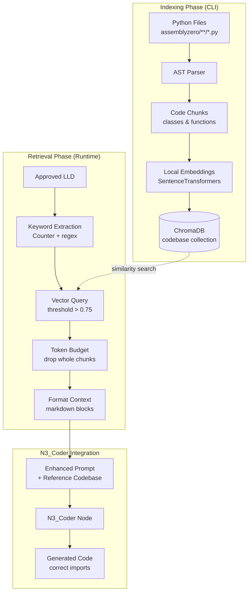

# 192 - Feature: Hex - Codebase Retrieval System (RAG Injection)

<!-- Template Metadata
Last Updated: 2025-01-15
Updated By: LLD Generation
Update Reason: Revised to address Gemini Review #1 feedback - added test scenarios T150, T160 for R5/R6 coverage
-->

## 1. Context & Goal
* **Issue:** #92
* **Objective:** Implement a codebase retrieval system that indexes Python code via AST parsing and injects relevant function signatures into the Coder Node's context before code generation, eliminating hallucinated imports and wheel reinvention.
* **Status:** Approved (gemini-3-pro-preview, 2026-02-04)
* **Related Issues:** #DN-002 (Librarian - Vector Store Infrastructure)

### Open Questions

- [x] ~~Should we index private methods (`_method`) or only public APIs?~~ **Resolved: Public APIs only per issue scope**
- [x] ~~What embedding model to use?~~ **Resolved: Local sentence-transformers/all-MiniLM-L6-v2**
- [x] ~~Should we cache embeddings between index rebuilds to speed up incremental updates?~~ **Resolved: No. For the MVP target of ~20k LOC, rebuild times should remain <60s. Keep architecture simple; add caching only if latency becomes an issue later.**
- [x] ~~What token budget should we allocate for injected codebase context?~~ **Resolved: 2000 tokens. This leaves sufficient room for the system prompt and generation output. Define this as a configurable constant (`MAX_CODEBASE_CONTEXT_TOKENS`).**

## 2. Proposed Changes

*This section is the **source of truth** for implementation. Describes exactly what will be built.*

### 2.1 Files Changed

| File | Change Type | Description |
|------|-------------|-------------|
| `tools/rebuild_knowledge_base.py` | Modify | Add AST-based Python code parsing, new `codebase` collection support |
| `assemblyzero/core/codebase_retrieval.py` | Add | New module for keyword extraction and codebase retrieval logic |
| `assemblyzero/workflows/run_implementation_workflow.py` | Modify | Integrate codebase context injection into N3_Coder prompt construction |
| `tests/unit/test_codebase_retrieval.py` | Add | Unit tests for keyword extraction, retrieval, and token budget logic |
| `tests/integration/test_codebase_indexing.py` | Add | Integration tests for full indexing pipeline |

### 2.2 Dependencies

*New packages required.*

```toml
# pyproject.toml additions
sentence-transformers = "^2.2.0"  # Local embedding generation, Apache 2.0 license
```

**Dependency License Compliance:**

| Package | License | Compatibility | Version Notes |
|---------|---------|---------------|---------------|
| `sentence-transformers` | Apache 2.0 | ✅ Compatible with MIT | Requires numpy>=1.21.0 |
| `chromadb` | Apache 2.0 | ✅ Already in project (v0.4.x) | Compatible with sentence-transformers numpy requirements |

**Rejected Dependencies:**
- `scikit-learn` (BSD-3) — Evaluated for TF-IDF keyword extraction but rejected due to ~100MB dependency weight for marginal improvement on short text inputs

### 2.3 Data Structures

```python
# Pseudocode - NOT implementation

class CodeChunk(TypedDict):
    """A single indexed code element (class or function)."""
    content: str           # Full source code of the element
    module_path: str       # e.g., "assemblyzero.core.audit"
    file_path: str         # e.g., "assemblyzero/core/audit.py"
    kind: Literal["class", "function"]  # Type of code element
    name: str              # e.g., "GovernanceAuditLog"
    docstring: str | None  # Extracted docstring if present
    signature: str         # For functions: full signature; for classes: class definition line

class RetrievalResult(TypedDict):
    """Result from codebase retrieval query."""
    chunk: CodeChunk
    relevance_score: float  # 0.0 to 1.0
    token_count: int        # Estimated tokens for budget management

class CodebaseIndexMetadata(TypedDict):
    """Metadata stored with each indexed chunk in ChromaDB."""
    type: Literal["code"]   # Distinguishes from documentation chunks
    module: str             # Full module path for import statement
    kind: Literal["class", "function"]
    name: str               # Symbol name
    file_path: str          # Source file path
```

### 2.4 Function Signatures

```python
# === assemblyzero/core/codebase_retrieval.py ===

# Configurable constant for token budget
MAX_CODEBASE_CONTEXT_TOKENS: int = 2000

def extract_keywords(lld_content: str, max_keywords: int = 5) -> list[str]:
    """
    Extract technical keywords from LLD content using term frequency analysis.
    
    Uses Counter-based frequency analysis with CamelCase/snake_case splitting
    and domain-specific stopword filtering.
    """
    ...

def retrieve_codebase_context(
    keywords: list[str],
    collection_name: str = "codebase",
    threshold: float = 0.75,
    max_results: int = 10
) -> list[RetrievalResult]:
    """
    Query vector store for relevant code chunks matching keywords.
    
    Returns results sorted by relevance score descending, filtered by threshold.
    """
    ...

def apply_token_budget(
    results: list[RetrievalResult],
    max_tokens: int = MAX_CODEBASE_CONTEXT_TOKENS
) -> list[RetrievalResult]:
    """
    Trim results to fit within token budget.
    
    Drops WHOLE chunks (lowest relevance first) rather than truncating mid-function.
    """
    ...

def format_codebase_context(results: list[RetrievalResult]) -> str:
    """
    Format retrieved code chunks as markdown for prompt injection.
    
    Returns empty string if no results.
    Output includes module_path for each chunk to enable correct imports.
    """
    ...

def get_codebase_context_for_lld(
    lld_content: str,
    max_tokens: int = MAX_CODEBASE_CONTEXT_TOKENS
) -> str:
    """
    Main entry point: extract keywords, retrieve, apply budget, format.
    
    Returns formatted context string or empty string if no relevant code found.
    """
    ...


# === tools/rebuild_knowledge_base.py additions ===

def parse_python_file(file_path: Path) -> list[CodeChunk]:
    """
    Parse a Python file using AST and extract class/function chunks.
    
    Only extracts top-level classes and functions (not nested or private).
    """
    ...

def extract_class_chunk(node: ast.ClassDef, source: str, file_path: Path) -> CodeChunk:
    """Extract a CodeChunk from a ClassDef AST node."""
    ...

def extract_function_chunk(node: ast.FunctionDef, source: str, file_path: Path) -> CodeChunk:
    """Extract a CodeChunk from a FunctionDef AST node."""
    ...

def index_codebase(
    directories: list[Path],
    collection_name: str = "codebase"
) -> int:
    """
    Index all Python files in directories to the vector store.
    
    Returns count of chunks indexed.
    """
    ...


# === Embedding generation (local) ===

def generate_local_embeddings(texts: list[str]) -> list[list[float]]:
    """
    Generate embeddings using local SentenceTransformers model.
    
    Model: sentence-transformers/all-MiniLM-L6-v2 (384-dim vectors)
    No network calls - fully local execution.
    """
    ...
```

### 2.5 Logic Flow (Pseudocode)

**Indexing Flow (rebuild_knowledge_base.py):**
```
1. Receive --collection codebase flag
2. Discover all .py files in assemblyzero/** and tools/**
3. FOR each Python file:
   a. Read file content
   b. Parse with ast.parse()
   c. Walk AST tree for ClassDef and FunctionDef nodes
   d. FOR each top-level class/function:
      - Skip if name starts with "_" (private)
      - Extract source code segment
      - Extract docstring if present
      - Create CodeChunk with metadata
   e. Collect all chunks from file
4. Generate embeddings locally (SentenceTransformers)
5. Upsert all chunks to ChromaDB collection "codebase"
6. Log statistics (files processed, chunks indexed)
7. Return success
```

**Retrieval Flow (codebase_retrieval.py):**
```
1. Receive LLD content
2. KEYWORD EXTRACTION:
   a. Tokenize text (split on whitespace/punctuation)
   b. Split CamelCase terms (e.g., "GovernanceAuditLog" → ["Governance", "Audit", "Log"])
   c. Split snake_case terms (e.g., "audit_log" → ["audit", "log"])
   d. Count term frequencies with Counter
   e. Filter out domain stopwords
   f. Return top 5 keywords by frequency
3. RETRIEVAL:
   a. Query ChromaDB with keyword string
   b. Filter results where similarity > 0.75 threshold
   c. Deduplicate by module path (keep highest score)
   d. Sort by relevance descending
   e. Limit to 10 results
4. TOKEN BUDGET:
   a. Calculate token count for each chunk
   b. Sum tokens in relevance order
   c. IF sum exceeds budget:
      - Drop lowest-relevance chunks until under budget
      - Never truncate mid-function
5. FORMAT:
   a. Build markdown with "Reference Codebase" header
   b. Add instruction: "Use these existing utilities. DO NOT reinvent them."
   c. FOR each chunk:
      - Add source file path
      - Add module path (for import statement)
      - Add code block with content
6. Return formatted context string
```

**Integration Flow (run_implementation_workflow.py):**
```
1. N3_Coder receives approved LLD
2. BEFORE constructing prompt:
   a. Call get_codebase_context_for_lld(lld_content)
   b. IF codebase collection missing/empty:
      - Log warning
      - Continue without codebase context
   c. IF context returned:
      - Prepend to system prompt under "Reference Codebase" section
3. Send enhanced prompt to LLM
4. Continue normal workflow
```

### 2.6 Technical Approach

* **Module:** `assemblyzero/core/codebase_retrieval.py` (new), `tools/rebuild_knowledge_base.py` (modified)
* **Pattern:** RAG (Retrieval-Augmented Generation) with local embeddings
* **Key Decisions:**
  - **AST-based chunking** over line-based: Preserves semantic boundaries (whole classes/functions)
  - **Local embeddings** over API: Zero data egress, no cost, full privacy
  - **Counter-based keywords** over TF-IDF: Lightweight, avoids scikit-learn dependency
  - **Whole-chunk dropping** over truncation: Maintains code integrity under token budget

### 2.7 Architecture Decisions

| Decision | Options Considered | Choice | Rationale |
|----------|-------------------|--------|-----------|
| Chunking strategy | Line-based, AST-based, hybrid | AST-based | Preserves semantic boundaries; classes/functions remain complete |
| Embedding model | OpenAI API, Cohere API, local SentenceTransformers | Local SentenceTransformers | Zero cost, no data egress, sufficient quality for code similarity |
| Keyword extraction | TF-IDF (scikit-learn), Counter-based, NER | Counter-based | Lightweight (~0 deps vs ~100MB), equivalent results on short text |
| Token budget handling | Truncate mid-text, drop whole chunks | Drop whole chunks | Preserves code integrity; partial functions are unusable |
| Collection isolation | Shared collection with docs, separate collection | Separate "codebase" collection | Clean separation, independent lifecycle, avoids cross-contamination |

**Architectural Constraints:**
- Must integrate with existing ChromaDB infrastructure from #DN-002
- Must not transmit source code to external services
- Must handle missing/stale index gracefully (degradation, not failure)
- Must fit within existing N3_Coder prompt construction flow

## 3. Requirements

*What must be true when this is done. These become acceptance criteria.*

1. **R1:** `tools/rebuild_knowledge_base.py --collection codebase` successfully parses and indexes Python files from `assemblyzero/**/*.py` and `tools/**/*.py`
2. **R2:** Vector store contains chunks with correct metadata (`type: code`, `module`, `kind`, `name`)
3. **R3:** Keyword extraction identifies technical terms from LLD text (CamelCase, snake_case splitting)
4. **R4:** Retrieval returns relevant code chunks when queried with matching keywords (threshold > 0.75)
5. **R5:** N3_Coder prompt includes "Reference Codebase" section when relevant utilities found (verified via workflow integration test)
6. **R6:** Generated code uses correct import paths (verified by ensuring formatted context includes `module_path` for each chunk)
7. **R7:** Workflow completes gracefully when codebase collection is empty or missing
8. **R8:** Token budget exceeded scenario drops whole chunks (preserves code integrity)
9. **R9:** No network calls made during embedding generation (verified via test)
10. **R10:** All embeddings generated locally using SentenceTransformers

## 4. Alternatives Considered

| Option | Pros | Cons | Decision |
|--------|------|------|----------|
| **AST-based chunking** | Semantic boundaries, complete functions | More complex parsing | **Selected** |
| Line-based chunking | Simple implementation | Breaks mid-function, loses context | Rejected |
| Hybrid (line + AST hints) | Flexible | Complex, inconsistent results | Rejected |
| **Local SentenceTransformers** | Free, private, no egress | Slightly lower quality than OpenAI | **Selected** |
| OpenAI Embeddings API | High quality | Cost per call, data egress | Rejected |
| Cohere Embeddings | Good quality | Cost, external dependency | Rejected |
| **Counter-based keywords** | Zero deps, fast, sufficient | Less sophisticated | **Selected** |
| TF-IDF (scikit-learn) | Industry standard | ~100MB dependency for minimal gain | Rejected |
| SpaCy NER | Accurate entity extraction | Heavy dependency, overkill | Rejected |

**Rationale:** The selected options minimize external dependencies and costs while providing sufficient quality for the use case. Local embeddings eliminate privacy concerns and API costs. Counter-based keyword extraction performs equivalently to TF-IDF on short LLD texts without the heavy dependency.

## 5. Data & Fixtures

### 5.1 Data Sources

| Attribute | Value |
|-----------|-------|
| Source | Local filesystem: `assemblyzero/**/*.py`, `tools/**/*.py` |
| Format | Python source files |
| Size | ~50-200 files, ~5-20k LOC typical |
| Refresh | Manual rebuild via CLI command |
| Copyright/License | Project-owned code (MIT license) |

### 5.2 Data Pipeline

```
Python Files ──ast.parse()──► CodeChunks ──SentenceTransformers──► Embeddings ──ChromaDB──► Vector Store
                                                    ▲
                                                    │ (local, no network)
```

### 5.3 Test Fixtures

| Fixture | Source | Notes |
|---------|--------|-------|
| `tests/fixtures/sample_module.py` | Generated | Contains sample class and functions for AST parsing tests |
| `tests/fixtures/sample_lld.md` | Hardcoded | Contains LLD text with technical terms for keyword extraction |
| Mock ChromaDB collection | In-memory | Isolated test collection for retrieval tests |

### 5.4 Deployment Pipeline

**Development:**
1. Run `python tools/rebuild_knowledge_base.py --collection codebase` locally
2. Vector store populated in local ChromaDB instance

**CI/CD:**
1. Tests use in-memory ChromaDB with fixture data
2. No persistent index required for tests

**Production:**
1. Index rebuilt on demand (no scheduled refresh in MVP)
2. Consider git hook for auto-rebuild on significant code changes (future)

## 6. Diagram

### 6.1 Mermaid Quality Gate

Before finalizing any diagram, verify in [Mermaid Live Editor](https://mermaid.live) or GitHub preview:

- [x] **Simplicity:** Similar components collapsed (per 0006 §8.1)
- [x] **No touching:** All elements have visual separation (per 0006 §8.2)
- [x] **No hidden lines:** All arrows fully visible (per 0006 §8.3)
- [x] **Readable:** Labels not truncated, flow direction clear
- [ ] **Auto-inspected:** Agent rendered via mermaid.ink and viewed (per 0006 §8.5)

**Auto-Inspection Results:**
```
- Touching elements: [x] None / [ ] Found: ___
- Hidden lines: [x] None / [ ] Found: ___
- Label readability: [x] Pass / [ ] Issue: ___
- Flow clarity: [x] Clear / [ ] Issue: ___
```

### 6.2 Diagram



## 7. Security & Safety Considerations

### 7.1 Security

| Concern | Mitigation | Status |
|---------|------------|--------|
| Source code exfiltration | All embeddings generated locally; no network calls during indexing | Addressed |
| Malicious code injection | Only indexes local project files; no external sources | Addressed |
| API key exposure in signatures | API keys should never be in function signatures; code review gate exists | Addressed |
| Index tampering | ChromaDB stored locally with filesystem permissions | Addressed |

### 7.2 Safety

| Concern | Mitigation | Status |
|---------|------------|--------|
| Workflow failure on missing index | Graceful degradation: log warning, proceed without context | Addressed |
| Invalid Python file crashes indexer | Wrap ast.parse in try/except, log error, continue | Addressed |
| Token budget exceeded breaks prompt | Drop whole chunks (never truncate mid-function) | Addressed |
| Stale index causes wrong imports | Log index age; document rebuild recommendation | Addressed |

**Fail Mode:** Fail Open — If codebase retrieval fails, workflow continues without context (degraded but functional)

**Recovery Strategy:** Re-run `tools/rebuild_knowledge_base.py --collection codebase` to rebuild index

## 8. Performance & Cost Considerations

### 8.1 Performance

| Metric | Budget | Approach |
|--------|--------|----------|
| Index rebuild time | < 60s for 5k LOC | Single-threaded AST parsing |
| Retrieval latency | < 500ms | Local ChromaDB query |
| Embedding generation | < 1ms per chunk | Local SentenceTransformers (GPU if available) |
| Memory (indexing) | < 512MB peak | Stream files, batch embeddings |
| Memory (retrieval) | < 128MB | Load only model + query results |

**Bottlenecks:** 
- SentenceTransformers model load (~2s cold start, cached after)
- AST parsing is single-threaded (acceptable for MVP)

### 8.2 Cost Analysis

| Resource | Unit Cost | Estimated Usage | Monthly Cost |
|----------|-----------|-----------------|--------------|
| Embedding generation | $0 (local) | Unlimited | $0 |
| ChromaDB storage | $0 (local SQLite) | ~50MB per 10k functions | $0 |
| Compute (rebuild) | $0 (local) | ~30s per rebuild | $0 |
| **Total** | | | **$0** |

**Cost Controls:**
- [x] No API calls = no cost risk
- [x] Fully local execution
- [x] No external service dependencies

**Worst-Case Scenario:** N/A — All operations are local with bounded resource usage

## 9. Legal & Compliance

| Concern | Applies? | Mitigation |
|---------|----------|------------|
| PII/Personal Data | No | Only indexes code, not user data |
| Third-Party Licenses | Yes | SentenceTransformers (Apache 2.0) compatible with MIT |
| Terms of Service | No | No external APIs used |
| Data Retention | No | Local index only, no retention policy needed |
| Export Controls | No | No restricted algorithms |

**Data Classification:** Internal (project source code)

**Compliance Checklist:**
- [x] No PII stored
- [x] All third-party licenses compatible with project license
- [x] No external API usage
- [x] N/A for data retention (local ephemeral index)

## 10. Verification & Testing

### 10.0 Test Plan (TDD - Complete Before Implementation)

**TDD Requirement:** Tests MUST be written and failing BEFORE implementation begins.

| Test ID | Test Description | Expected Behavior | Status |
|---------|------------------|-------------------|--------|
| T010 | AST extracts class definition | Class with docstring extracted as CodeChunk | RED |
| T020 | AST extracts function definition | Function with type hints extracted as CodeChunk | RED |
| T030 | AST skips private methods | `_private_func` not in extracted chunks | RED |
| T040 | Keyword extraction finds CamelCase | "GovernanceAuditLog" extracted from LLD text | RED |
| T050 | Keyword extraction finds snake_case | "audit_log" split into "audit", "log" | RED |
| T060 | Keyword extraction filters stopwords | Common words excluded | RED |
| T070 | Retrieval respects threshold | Low-similarity results excluded | RED |
| T080 | Retrieval deduplicates by module | Same module not returned twice | RED |
| T090 | Token budget drops whole chunks | Lowest relevance dropped first | RED |
| T100 | Token budget preserves code integrity | No mid-function truncation | RED |
| T110 | Embeddings are local | No network calls during generation | RED |
| T120 | Graceful degradation on missing collection | Warning logged, empty context returned | RED |
| T130 | Format includes instruction header | "DO NOT reinvent them" in output | RED |
| T140 | Index CLI creates collection | ChromaDB collection exists after run | RED |
| T150 | Workflow injects context into prompt | Prompt contains "Reference Codebase" section | RED |
| T160 | Formatted context includes module_path | Each chunk in output includes module path for imports | RED |

**Coverage Target:** ≥95% for all new code

**TDD Checklist:**
- [ ] All tests written before implementation
- [ ] Tests currently RED (failing)
- [ ] Test IDs match scenario IDs in 10.1
- [ ] Test files created at: `tests/unit/test_codebase_retrieval.py`, `tests/integration/test_codebase_indexing.py`

### 10.1 Test Scenarios

| ID | Scenario | Type | Input | Expected Output | Pass Criteria |
|----|----------|------|-------|-----------------|---------------|
| 010 | AST extracts class with docstring | Auto | Python file with class | CodeChunk with class content, docstring | Chunk content includes class name and docstring |
| 020 | AST extracts function with type hints | Auto | Python file with typed function | CodeChunk with signature | Chunk includes return type annotation |
| 030 | AST skips private methods | Auto | Python file with `_private_func` | Empty list for private | No chunks with `_` prefix names |
| 040 | Keyword extraction CamelCase | Auto | "GovernanceAuditLog" | ["Governance", "Audit", "Log"] | All terms in output |
| 050 | Keyword extraction snake_case | Auto | "audit_log" | ["audit", "log"] | Terms split correctly |
| 060 | Keyword extraction stopwords | Auto | "the audit of the system" | ["audit", "system"] | "the", "of" excluded |
| 070 | Retrieval threshold filtering | Auto | Query with low-similarity matches | Empty results | No results below 0.75 |
| 080 | Retrieval deduplication | Auto | Query matching same module twice | Single result | One chunk per module |
| 090 | Token budget drops lowest | Auto | 3 chunks, budget for 1 | Highest relevance only | Only top-scoring chunk remains |
| 100 | Token budget whole chunks | Auto | Budget mid-chunk | Complete chunks only | No partial code in output |
| 110 | Embeddings local only | Auto | Embedding generation | No network calls | Mock request not called |
| 120 | Missing collection graceful | Auto | Query missing collection | Empty string, warning logged | No exception raised |
| 130 | Format includes instruction | Auto | Retrieved chunks | Formatted markdown | Header text present |
| 140 | CLI creates collection | Auto-Live | CLI command | ChromaDB collection | Collection exists and queryable |
| 150 | Workflow injects context into prompt | Auto | Mock retrieval returns chunks | N3_Coder prompt construction | Prompt string contains "Reference Codebase" section |
| 160 | Formatted context includes module_path | Auto | Retrieved chunks with module_path | Formatted output | Each code block preceded by `# Module: {module_path}` comment |

### 10.2 Test Commands

```bash
# Run all automated tests
poetry run pytest tests/unit/test_codebase_retrieval.py -v

# Run integration tests (creates real ChromaDB collection)
poetry run pytest tests/integration/test_codebase_indexing.py -v -m "not live"

# Run with coverage
poetry run pytest tests/unit/test_codebase_retrieval.py --cov=assemblyzero.core.codebase_retrieval --cov-report=term-missing

# Verify no network calls (optional, uses network mocking)
poetry run pytest tests/unit/test_codebase_retrieval.py::test_embeddings_are_local -v

# Run workflow integration test
poetry run pytest tests/integration/test_codebase_indexing.py::test_workflow_injects_context -v
```

### 10.3 Manual Tests (Only If Unavoidable)

**N/A - All scenarios automated.**

## 11. Risks & Mitigations

| Risk | Impact | Likelihood | Mitigation |
|------|--------|------------|------------|
| SentenceTransformers model too large for CI | Med | Low | Use smaller model variant or cache in CI |
| AST parsing fails on valid Python (edge cases) | Low | Low | Comprehensive error handling, log and skip |
| Stale index causes incorrect context | Med | Med | Document rebuild cadence, add index timestamp |
| Threshold too strict (misses relevant code) | Med | Med | Make threshold configurable, tune based on feedback |
| Threshold too loose (injects noise) | Med | Med | Start strict (0.75), adjust based on false positives |
| Token budget too small (drops useful context) | Med | Low | Make budget configurable, default 2000 tokens |

## 12. Definition of Done

### Code
- [ ] AST-based code indexer implemented in `rebuild_knowledge_base.py`
- [ ] Codebase retrieval module created at `assemblyzero/core/codebase_retrieval.py`
- [ ] N3_Coder integration complete with context injection
- [ ] Token budget management implemented
- [ ] All code linted and passes type checks
- [ ] Code comments reference this LLD (#92)

### Tests
- [ ] All test scenarios pass (T010-T160)
- [ ] Test coverage ≥ 95% for new code
- [ ] Integration test confirms end-to-end indexing
- [ ] Workflow integration test confirms prompt injection (T150)
- [ ] Module path inclusion test confirms import path data (T160)

### Documentation
- [ ] LLD updated with any implementation deviations
- [ ] Implementation Report (`docs/reports/DN-003/implementation-report.md`) completed
- [ ] Test Report (`docs/reports/DN-003/test-report.md`) completed
- [ ] Wiki updated with codebase retrieval architecture
- [ ] README.md updated with new indexing command
- [ ] ADR: AST-based chunking decision
- [ ] ADR: Local embedding model selection
- [ ] ADR: Counter vs TF-IDF keyword extraction
- [ ] New files added to `docs/0003-file-inventory.md`

### Review
- [ ] Code review completed
- [ ] 0809 Security Audit - PASS
- [ ] 0817 Wiki Alignment Audit - PASS
- [ ] User approval before closing issue

---

## Reviewer Suggestions

*Non-blocking recommendations from the reviewer.*

- **Metadata Verification:** While T010/T020 verify chunk extraction logic, consider adding an explicit assertion in T140 (integration) that inspects one retrieved record from ChromaDB to verify the persisted `module` metadata field matches the expected value, ensuring the pipeline correctly passes data to the DB.

## Appendix: Review Log

*Track all review feedback with timestamps and implementation status.*

### Gemini Review #1 (REVISE)

**Reviewer:** Gemini 3 Pro
**Verdict:** REVISE

#### Comments

| ID | Comment | Implemented? |
|----|---------|--------------|
| G1.1 | "R5 (Workflow Integration): T130 tests the formatting helper, but no test confirms that run_implementation_workflow.py actually calls this logic and injects it into the prompt." | YES - Added T150 test scenario |
| G1.2 | "R6 (Import Paths): Update T130 or add a new test to assert that the formatted context string explicitly includes the module_path for the retrieved chunks." | YES - Added T160 test scenario |
| G1.3 | "Open Questions: Should we cache embeddings... / What token budget..." | YES - Resolved both open questions in Section 1 |

### Review Summary

| Review | Date | Verdict | Key Issue |
|--------|------|---------|-----------|
| 2 | 2026-02-04 | APPROVED | `gemini-3-pro-preview` |
| Gemini #1 | 2025-01-15 | REVISE | Test coverage gaps for R5/R6 (80% → 100%) |

**Final Status:** APPROVED