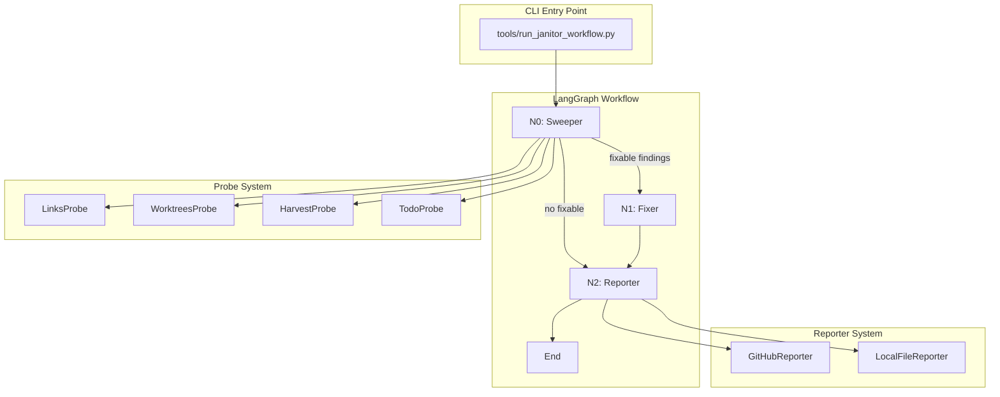
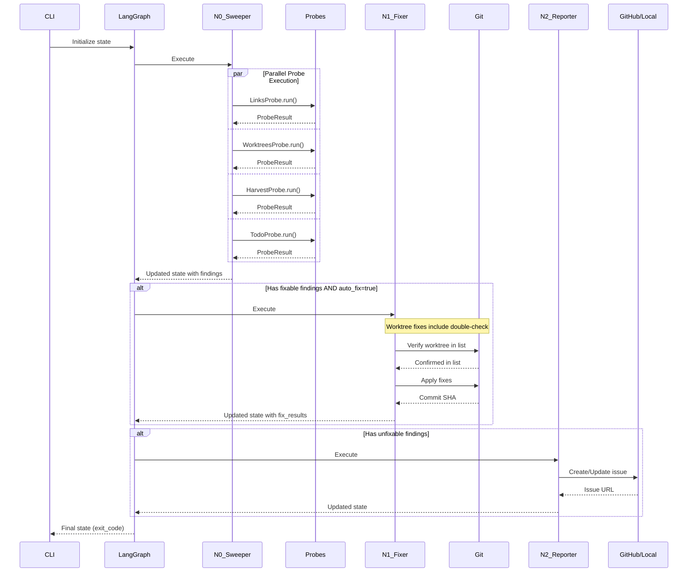

# 194 - Feature: Lu-Tze: The Janitor - Automated Repository Hygiene Workflow

<!-- Template Metadata
Last Updated: 2025-01-XX
Updated By: Initial LLD creation + Gemini Review #1 revisions
Update Reason: Address Tier 1 safety concerns and Tier 2 architecture/quality issues
-->

## 1. Context & Goal
* **Issue:** #94
* **Objective:** Create an automated LangGraph-based maintenance workflow that monitors and fixes repository hygiene issues (broken links, stale worktrees, cross-project drift, stale TODOs), replacing manual audit checklists with automated enforcement.
* **Status:** Approved (gemini-3-pro-preview, 2026-02-04)
* **Related Issues:** N/A

### Open Questions

- [x] Should worktree staleness threshold (14 days) be configurable via CLI or config file? **RESOLVED: Yes, add `--worktree-days` CLI argument (default: 14) to allow adjustment without code changes.**
- [x] For the harvest probe, should we create a new issue or integrate with existing AssemblyZero issue tracking? **RESOLVED: Integrate findings into the single "Janitor Report" issue to maintain the workflow's aggregation pattern and reduce notification noise.**
- [x] What is the exact format expected from `assemblyzero-harvest.py` for the harvest probe integration? **RESOLVED: Define strict contract: `{"drift_detected": bool, "files": list[str], "summary": str}`. Fail gracefully if output differs.**
- [x] Should `--create-pr` require a specific branch naming convention? **RESOLVED: Yes, enforce `janitor/fix-{timestamp}` to ensure uniqueness and allow programmatic identification of Janitor-created branches.**

## 2. Proposed Changes

*This section is the **source of truth** for implementation. Describe exactly what will be built.*

### 2.1 Files Changed

| File | Change Type | Description |
|------|-------------|-------------|
| `tools/run_janitor_workflow.py` | Add | CLI entry point with argparse interface |
| `assemblyzero/workflows/janitor/__init__.py` | Add | Package initialization, exports graph and state |
| `assemblyzero/workflows/janitor/graph.py` | Add | LangGraph state graph with Sweeper → Fixer → Reporter nodes |
| `assemblyzero/workflows/janitor/state.py` | Add | JanitorState TypedDict, ProbeResult dataclass, and HarvestOutput schema |
| `assemblyzero/workflows/janitor/probes/__init__.py` | Add | Probe registry and base interface |
| `assemblyzero/workflows/janitor/probes/base.py` | Add | BaseProbe abstract class definition |
| `assemblyzero/workflows/janitor/probes/links.py` | Add | Broken markdown link detection probe |
| `assemblyzero/workflows/janitor/probes/worktrees.py` | Add | Stale git worktree detection probe |
| `assemblyzero/workflows/janitor/probes/harvest.py` | Add | Cross-project drift detection via assemblyzero-harvest.py |
| `assemblyzero/workflows/janitor/probes/todo.py` | Add | Stale TODO comment scanner (30+ days) |
| `assemblyzero/workflows/janitor/fixers.py` | Add | Auto-fix implementations for links and worktrees |
| `assemblyzero/workflows/janitor/reporter.py` | Add | ReporterInterface, GitHubReporter, LocalFileReporter |
| `docs/audits/083x/0834-*.md` | Modify | Archive with pointer to Janitor workflow |
| `docs/audits/083x/0838-*.md` | Modify | Archive with pointer to Janitor workflow |
| `docs/audits/083x/0840-*.md` | Modify | Archive with pointer to Janitor workflow |
| `docs/0003-file-inventory.md` | Modify | Add new Janitor workflow files |
| `tests/unit/test_janitor_probes.py` | Add | Unit tests for all probe implementations |
| `tests/unit/test_janitor_fixers.py` | Add | Unit tests for fixer implementations |
| `tests/unit/test_janitor_reporter.py` | Add | Unit tests for reporter implementations |
| `tests/integration/test_janitor_workflow.py` | Add | Integration tests for full workflow |

### 2.2 Dependencies

```toml
# pyproject.toml additions
langgraph = "^0.2.0"  # State graph orchestration
```

*Note: `gh` CLI is a runtime dependency (not Python package) - must be installed and authenticated.*

### 2.3 Data Structures

```python
# Pseudocode - NOT implementation

from typing import TypedDict, Literal
from dataclasses import dataclass
from enum import Enum

class Severity(Enum):
    INFO = "info"
    WARNING = "warning"
    CRITICAL = "critical"

@dataclass
class Finding:
    probe_name: str           # Which probe found this
    file_path: str            # Affected file
    line_number: int | None   # Line if applicable
    description: str          # Human-readable description
    fixable: bool             # Can be auto-fixed
    severity: Severity        # info/warning/critical
    fix_data: dict | None     # Data needed for auto-fix (e.g., old_link, new_link)

@dataclass
class ProbeResult:
    probe_name: str
    status: Literal["success", "error"]
    findings: list[Finding]
    error_message: str | None  # If status == "error"
    duration_ms: int

@dataclass
class FixResult:
    finding: Finding
    success: bool
    commit_sha: str | None
    error_message: str | None

# Harvest probe contract schema (RESOLVED from Open Questions)
@dataclass
class HarvestOutput:
    """Strict contract for assemblyzero-harvest.py output."""
    drift_detected: bool
    files: list[str]
    summary: str
    
    @classmethod
    def from_json(cls, data: dict) -> "HarvestOutput | None":
        """Parse and validate JSON. Returns None if schema doesn't match."""
        try:
            return cls(
                drift_detected=bool(data["drift_detected"]),
                files=list(data["files"]),
                summary=str(data["summary"])
            )
        except (KeyError, TypeError, ValueError):
            return None

class JanitorState(TypedDict):
    # Input configuration
    scope: list[str]           # Probes to run: ["links", "worktrees", "harvest", "todo"]
    auto_fix: bool             # Enable automatic fixing
    dry_run: bool              # Preview mode, no changes
    silent: bool               # Suppress output
    create_pr: bool            # Create PR instead of direct commit
    reporter_type: str         # "github" or "local"
    worktree_days: int         # Staleness threshold (default: 14)
    
    # Sweeper output
    probe_results: list[ProbeResult]
    all_findings: list[Finding]
    
    # Fixer output
    fix_results: list[FixResult]
    fixable_findings: list[Finding]
    unfixable_findings: list[Finding]
    
    # Reporter output
    issue_url: str | None      # GitHub issue URL if created/updated
    report_path: str | None    # Local report path if using LocalFileReporter
    
    # Workflow metadata
    start_time: str
    end_time: str | None
    exit_code: int             # 0 = clean, 1 = unfixable issues remain
```

### 2.4 Function Signatures

```python
# === Entry Point ===
# tools/run_janitor_workflow.py

def main() -> int:
    """CLI entry point. Returns exit code (0=clean, 1=issues remain)."""
    ...

def parse_args() -> argparse.Namespace:
    """Parse CLI arguments including --worktree-days (default: 14)."""
    ...

# === Graph Definition ===
# assemblyzero/workflows/janitor/graph.py

def create_janitor_graph() -> StateGraph:
    """Create and return the LangGraph state graph."""
    ...

def sweeper_node(state: JanitorState) -> JanitorState:
    """N0: Run all probes in parallel, collect findings."""
    ...

def fixer_node(state: JanitorState) -> JanitorState:
    """N1: Apply auto-fixes to fixable findings."""
    ...

def reporter_node(state: JanitorState) -> JanitorState:
    """N2: Report unfixable findings to GitHub or local file."""
    ...

def should_fix(state: JanitorState) -> Literal["fix", "report"]:
    """Conditional edge: skip fixer if no fixable findings or dry_run."""
    ...

def should_report(state: JanitorState) -> Literal["report", "end"]:
    """Conditional edge: skip reporter if no unfixable findings."""
    ...

# === Probe Base & Registry ===
# assemblyzero/workflows/janitor/probes/base.py

class BaseProbe(ABC):
    """Abstract base class for all probes."""
    
    @property
    @abstractmethod
    def name(self) -> str:
        """Unique probe identifier."""
        ...
    
    @abstractmethod
    def run(self, repo_root: Path) -> ProbeResult:
        """Execute probe and return results."""
        ...

# assemblyzero/workflows/janitor/probes/__init__.py

def get_probe_registry() -> dict[str, type[BaseProbe]]:
    """Return mapping of probe names to probe classes."""
    ...

def run_probes_parallel(
    probe_names: list[str], 
    repo_root: Path,
    config: dict  # Contains worktree_days, etc.
) -> list[ProbeResult]:
    """Run specified probes in parallel, isolating failures."""
    ...

# === Individual Probes ===
# assemblyzero/workflows/janitor/probes/links.py

class LinksProbe(BaseProbe):
    """Detect broken internal markdown links."""
    
    def run(self, repo_root: Path) -> ProbeResult:
        ...
    
    def _scan_markdown_files(self, repo_root: Path) -> list[Path]:
        ...
    
    def _extract_links(self, file_path: Path) -> list[tuple[str, int]]:
        """Extract (link_target, line_number) tuples."""
        ...
    
    def _check_link(self, source: Path, target: str, repo_root: Path) -> bool:
        """Return True if link resolves correctly."""
        ...

# assemblyzero/workflows/janitor/probes/worktrees.py

class WorktreesProbe(BaseProbe):
    """Detect stale/detached git worktrees."""
    
    def __init__(self, stale_days_threshold: int = 14):
        """Initialize with configurable threshold."""
        self.stale_days_threshold = stale_days_threshold
    
    def run(self, repo_root: Path) -> ProbeResult:
        ...
    
    def _list_worktrees(self) -> list[dict]:
        """Parse `git worktree list --porcelain` output."""
        ...
    
    def _is_stale(self, worktree: dict) -> bool:
        """Check if worktree is stale (no commits in threshold+ days, branch merged/deleted).
        
        Handles detached HEAD state gracefully by checking:
        1. If HEAD is detached, consider stale if no recent commits
        2. If branch exists, check if merged AND inactive
        """
        ...
    
    def _get_worktree_branch_state(self, worktree: dict) -> Literal["detached", "active", "merged", "deleted"]:
        """Determine branch state for a worktree, handling detached HEAD."""
        ...

# assemblyzero/workflows/janitor/probes/harvest.py

class HarvestProbe(BaseProbe):
    """Detect cross-project drift via assemblyzero-harvest.py."""
    
    def run(self, repo_root: Path) -> ProbeResult:
        ...
    
    def _run_harvest_script(self, repo_root: Path) -> HarvestOutput | None:
        """Execute assemblyzero-harvest.py and parse JSON output.
        
        Returns None if:
        - Script not found
        - Script returns non-JSON output
        - Output doesn't match HarvestOutput schema
        """
        ...
    
    def _validate_harvest_output(self, raw_output: str) -> HarvestOutput | None:
        """Parse and validate against HarvestOutput schema. Fails gracefully."""
        ...

# assemblyzero/workflows/janitor/probes/todo.py

class TodoProbe(BaseProbe):
    """Scan for TODO comments older than 30 days."""
    
    STALE_DAYS_THRESHOLD: int = 30
    MAX_FILE_SIZE_BYTES: int = 1_000_000  # 1MB limit for git blame
    MAX_LINES_FOR_BLAME: int = 10_000     # Skip blame on very large files
    
    def run(self, repo_root: Path) -> ProbeResult:
        ...
    
    def _find_todos(self, repo_root: Path) -> list[dict]:
        """Find all TODO/FIXME/HACK comments with git blame dates."""
        ...
    
    def _get_blame_date(self, file_path: Path, line_number: int) -> datetime | None:
        """Get the last modification date for a specific line.
        
        Returns None if file exceeds size/line limits (skip blame for performance).
        """
        ...
    
    def _should_skip_blame(self, file_path: Path) -> bool:
        """Check if file exceeds size or line count limits."""
        ...

# === Fixers ===
# assemblyzero/workflows/janitor/fixers.py

class Fixer:
    """Applies fixes to findings."""
    
    def __init__(self, repo_root: Path, dry_run: bool, create_pr: bool):
        ...
    
    def fix_all(self, findings: list[Finding]) -> list[FixResult]:
        """Apply fixes to all fixable findings, grouped by type."""
        ...
    
    def fix_broken_link(self, finding: Finding) -> FixResult:
        """Fix a single broken link."""
        ...
    
    def fix_stale_worktree(self, finding: Finding) -> FixResult:
        """Prune a stale worktree.
        
        SAFETY: Before pruning, re-verifies that the target path is currently
        listed in `git worktree list --porcelain`. This double-check prevents
        accidental deletion if state has drifted since probe execution.
        """
        ...
    
    def _verify_worktree_still_exists(self, worktree_path: str) -> bool:
        """Double-check that path is in current `git worktree list` output.
        
        CRITICAL SAFETY CHECK: Prevents deleting non-worktree directories
        if worktree state has changed since probe ran.
        """
        ...
    
    def _create_commit(self, message: str, files: list[Path]) -> str:
        """Create atomic commit, return SHA."""
        ...
    
    def _generate_commit_message(self, fix_type: str, count: int) -> str:
        """Generate deterministic commit message from template."""
        ...
    
    def _generate_branch_name(self) -> str:
        """Generate branch name: janitor/fix-{timestamp}."""
        ...

COMMIT_TEMPLATES: dict[str, str] = {
    "links": "fix(docs): update {count} broken markdown link(s)\n\nAuto-fixed by Janitor workflow",
    "worktrees": "chore: prune {count} stale worktree(s)\n\nAuto-fixed by Janitor workflow",
}

# === Reporters ===
# assemblyzero/workflows/janitor/reporter.py

class ReporterInterface(ABC):
    """Abstract base for issue reporting."""
    
    @abstractmethod
    def report(self, findings: list[Finding]) -> str | None:
        """Report findings. Returns issue URL or file path."""
        ...
    
    @abstractmethod
    def find_existing_report(self) -> str | None:
        """Find existing Janitor Report. Returns issue number or file path."""
        ...

class GitHubReporter(ReporterInterface):
    """Reports findings as GitHub issues using `gh` CLI."""
    
    ISSUE_TITLE: str = "🧹 Janitor Report: Repository Hygiene Findings"
    
    def report(self, findings: list[Finding]) -> str | None:
        ...
    
    def find_existing_report(self) -> str | None:
        """Search for existing open issue with Janitor Report title."""
        ...
    
    def _create_issue(self, body: str) -> str:
        """Create new GitHub issue, return URL."""
        ...
    
    def _update_issue(self, issue_number: str, body: str) -> str:
        """Update existing issue, return URL."""
        ...
    
    def _format_issue_body(self, findings: list[Finding]) -> str:
        """Format findings into categorized markdown."""
        ...
    
    def _check_gh_auth(self) -> bool:
        """Verify gh CLI is authenticated.
        
        Checks in order:
        1. GITHUB_TOKEN environment variable (for CI/headless)
        2. gh auth status (for interactive sessions)
        
        Returns True if either authentication method is available.
        """
        ...
    
    def _get_auth_method(self) -> Literal["token", "cli", "none"]:
        """Determine which auth method is available."""
        ...

class LocalFileReporter(ReporterInterface):
    """Reports findings to local files (for testing)."""
    
    OUTPUT_DIR: str = "./janitor-reports"
    
    def report(self, findings: list[Finding]) -> str | None:
        ...
    
    def find_existing_report(self) -> str | None:
        ...
```

### 2.5 Logic Flow (Pseudocode)

```
MAIN WORKFLOW:
1. Parse CLI arguments (including --worktree-days)
2. Initialize JanitorState with config
3. Build LangGraph: Sweeper → Fixer → Reporter
4. Execute graph
5. Return exit_code from final state

SWEEPER NODE (N0):
1. Get probe registry
2. Filter probes by scope argument
3. FOR EACH probe IN parallel:
   TRY:
     - Pass config (e.g., worktree_days) to probe
     - result = probe.run(repo_root)
     - Append result to probe_results
   EXCEPT Exception as e:
     - Log error, append error ProbeResult
     - Continue (isolated failure)
4. Flatten all findings from probe_results
5. Return updated state

FIXER NODE (N1):
1. IF dry_run THEN
   - Log what would be fixed
   - Skip actual fixes
   - Return state unchanged
2. IF NOT auto_fix THEN
   - Skip all fixes (headless safety)
   - Return state unchanged
3. Separate findings into fixable/unfixable
4. Group fixable findings by type (links, worktrees)
5. FOR EACH group:
   - IF worktree fix:
     - FOR EACH worktree finding:
       - DOUBLE-CHECK: Verify path still in `git worktree list`
       - IF not found: Skip with warning (state drift)
       - IF found: Proceed with prune
   - Apply fixes
   - Create atomic commit with template message
   - IF create_pr THEN
     - Create branch: janitor/fix-{timestamp}
     - Create PR instead of direct commit
6. Return state with fix_results

REPORTER NODE (N2):
1. IF no unfixable_findings THEN return (nothing to report)
2. Get reporter based on reporter_type
3. Search for existing Janitor Report
4. IF existing report found:
   - Update existing issue/file
5. ELSE:
   - Create new issue/file
6. Set exit_code = 1 (unfixable issues remain)
7. Return state with issue_url or report_path

CONDITIONAL ROUTING:
- should_fix: IF auto_fix AND fixable_findings exist AND NOT dry_run → "fix" ELSE → "report"
- should_report: IF unfixable_findings exist → "report" ELSE → "end"
```

### 2.6 Technical Approach

* **Module:** `assemblyzero/workflows/janitor/`
* **Pattern:** State Machine (LangGraph), Strategy Pattern (Reporters), Template Method (Probes)
* **Key Decisions:**
  - LangGraph for state management and conditional routing (not LLM orchestration)
  - Parallel probe execution with isolated failure handling
  - Deterministic commit messages via templates (no LLM)
  - Reporter abstraction enables testing without GitHub API calls
  - **Worktree safety**: Double-check mechanism before any destructive operation
  - **Harvest schema**: Strict validation with graceful degradation

### 2.7 Architecture Decisions

| Decision | Options Considered | Choice | Rationale |
|----------|-------------------|--------|-----------|
| Workflow orchestration | Plain Python, Prefect, LangGraph | LangGraph | Native state management, conditional routing, matches existing patterns |
| Probe execution | Sequential, Parallel | Parallel with isolation | Faster execution, probe crashes don't block others |
| Commit message generation | LLM-generated, Templates | Templates | Deterministic, no external API calls, faster |
| Issue reporting | Direct API, gh CLI | gh CLI | Leverages existing auth, simpler implementation |
| Testing strategy | Mock GitHub API, Local reporter | Local reporter abstraction | Clean separation, no API mocking complexity |
| Worktree deletion safety | Single check, Double check | Double check | Prevents state drift bugs from causing data loss |
| Harvest probe contract | Loose parsing, Strict schema | Strict schema with graceful fallback | Ensures reliable integration, fails safely |
| Worktree threshold | Hardcoded, Configurable | Configurable via `--worktree-days` | Allows tuning without code changes |
| PR branch naming | Random, Timestamped pattern | `janitor/fix-{timestamp}` | Uniqueness + programmatic identification |

**Architectural Constraints:**
- Must not introduce LLM dependencies (purely deterministic workflow)
- Must work in headless CI environments with `GITHUB_TOKEN`
- Must be reversible (all changes via git commits)
- Must integrate with existing `assemblyzero-harvest.py` script
- **Worktree operations must verify target is in current `git worktree list` immediately before deletion**

## 3. Requirements

*What must be true when this is done. These become acceptance criteria.*

1. Running `python tools/run_janitor_workflow.py` executes all probes and reports findings
2. `--dry-run` flag shows pending fixes without modifying any files
3. Broken markdown links are automatically fixed when `--auto-fix true`
4. Stale worktrees (configurable via `--worktree-days`, default 14 days inactive, branch merged/deleted) are automatically pruned
5. Unfixable issues create or update a single "Janitor Report" GitHub issue
6. Existing Janitor Report issue is updated (not duplicated) on subsequent runs
7. `--silent` mode produces no stdout on success, exits cleanly
8. Exit code 0 when all issues fixed, exit code 1 when unfixable issues remain
9. `--reporter local` writes reports to local files without GitHub API calls
10. CI execution with `GITHUB_TOKEN` environment variable authenticates successfully
11. Probe crashes are isolated and do not block other probes from running

## 4. Alternatives Considered

| Option | Pros | Cons | Decision |
|--------|------|------|----------|
| LangGraph workflow | State management, conditional routing, parallel execution | Learning curve, dependency | **Selected** |
| Plain Python script | Simple, no dependencies | Manual state management, no parallelism | Rejected |
| Prefect/Airflow | Mature, scheduling built-in | Heavy dependency, overkill for scope | Rejected |
| GitHub Actions only | Native CI integration | Limited local execution, no interactive mode | Rejected |

**Rationale:** LangGraph provides the right balance of state management capabilities without requiring external services. It matches existing patterns in the codebase and supports the parallel execution model needed for probes.

## 5. Data & Fixtures

### 5.1 Data Sources

| Attribute | Value |
|-----------|-------|
| Source | Local repository files, git history |
| Format | Markdown files, git porcelain output, JSON (harvest) |
| Size | Variable (depends on repo size) |
| Refresh | On-demand per workflow run |
| Copyright/License | N/A - operates on user's own repository |

### 5.2 Data Pipeline

```
Repository Files ──scan──► Probes ──findings──► Fixer ──commits──► Git
                                      │
                                      └──unfixable──► Reporter ──issue──► GitHub/Local
```

### 5.3 Test Fixtures

| Fixture | Source | Notes |
|---------|--------|-------|
| Test markdown with broken links | Generated | Created in test setup |
| Test git worktree (stale) | Generated | Created in test setup, cleaned in teardown |
| Mock harvest output | Hardcoded | JSON fixture matching HarvestOutput schema |
| Invalid harvest output | Hardcoded | JSON fixture with wrong schema for graceful failure test |
| Source files with old TODOs | Generated | Files with blamed TODO comments |

### 5.4 Deployment Pipeline

- **Development:** Run locally with `--reporter local`
- **Testing:** Automated tests use `LocalFileReporter`, no external calls
- **CI:** GitHub Actions with `GITHUB_TOKEN`, `--silent` mode
- **Production:** Cron job or Task Scheduler, full `gh` CLI auth

**External utilities:** Depends on existing `assemblyzero-harvest.py` for harvest probe. No new utility needed.

## 6. Diagram

### 6.1 Mermaid Quality Gate

Before finalizing any diagram, verify in [Mermaid Live Editor](https://mermaid.live) or GitHub preview:

- [x] **Simplicity:** Similar components collapsed (per 0006 §8.1)
- [x] **No touching:** All elements have visual separation (per 0006 §8.2)
- [x] **No hidden lines:** All arrows fully visible (per 0006 §8.3)
- [x] **Readable:** Labels not truncated, flow direction clear
- [ ] **Auto-inspected:** Agent rendered via mermaid.ink and viewed (per 0006 §8.5)

**Auto-Inspection Results:**
```
- Touching elements: [ ] None / [ ] Found: ___
- Hidden lines: [ ] None / [ ] Found: ___
- Label readability: [ ] Pass / [ ] Issue: ___
- Flow clarity: [ ] Clear / [ ] Issue: ___
```

*Note: Auto-inspection to be completed during implementation phase.*

### 6.2 Diagram





## 7. Security & Safety Considerations

### 7.1 Security

| Concern | Mitigation | Status |
|---------|------------|--------|
| Arbitrary file modification | Only modifies files within repo root, validates paths | Addressed |
| GitHub token exposure | Uses `gh` CLI auth or `GITHUB_TOKEN` env var, no token in logs | Addressed |
| Code injection via findings | All commit messages use templates, no user input interpolation | Addressed |
| External data transmission | No code/content sent externally, all processing local | Addressed |
| Unauthorized commits | Commits use existing git identity, respects branch protections | Addressed |

### 7.2 Safety

| Concern | Mitigation | Status |
|---------|------------|--------|
| Accidental data loss | All changes via git commits (fully reversible) | Addressed |
| Active worktree deletion | Only prunes detached/stale trees, never active work | Addressed |
| **Worktree state drift** | **Double-check: verify path in `git worktree list` immediately before `git worktree remove`** | Addressed |
| **Non-worktree directory deletion** | **Explicit verification prevents deleting paths not currently registered as worktrees** | Addressed |
| Runaway fixing | Atomic commits per category, can revert individually | Addressed |
| Probe crash cascade | Isolated probe execution, failures don't stop workflow | Addressed |
| Incorrect link fixes | Dry-run mode for preview, conservative matching | Addressed |
| **Headless destructive operations** | **`--auto-fix` must be explicitly true; if false, fixer SKIPS all operations (no prompts)** | Addressed |

**Fail Mode:** Fail Closed - If authentication fails or critical error occurs, workflow exits with error code without making changes.

**Recovery Strategy:** 
- All fixes are git commits: `git revert <sha>` to undo
- Worktree prune is non-destructive (worktree data preserved if branch exists)
- GitHub issues can be manually closed/edited

## 8. Performance & Cost Considerations

### 8.1 Performance

| Metric | Budget | Approach |
|--------|--------|----------|
| Total runtime | < 60s for typical repo | Parallel probe execution |
| Memory | < 256MB | Stream large files, don't load all into memory |
| Git operations | Minimize by batching | Single commit per fix category |

**Bottlenecks:**
- `git blame` for TODO dating can be slow on large files - **Mitigated: 1MB/10K line limits**
- Link checking scales with number of markdown files
- Harvest probe depends on external script performance

### 8.2 Cost Analysis

| Resource | Unit Cost | Estimated Usage | Monthly Cost |
|----------|-----------|-----------------|--------------|
| GitHub API (via gh) | Free (rate limited) | ~10 calls/run | $0 |
| Compute (local) | N/A | Developer machine | $0 |
| CI minutes | Varies by plan | ~1 min/run | Minimal |

**Cost Controls:**
- [x] No paid API dependencies
- [x] Local execution is free
- [x] CI runs are brief (~1 minute)

**Worst-Case Scenario:** Large repos may take several minutes for full scan. Solution: `--scope` flag to run specific probes only.

## 9. Legal & Compliance

| Concern | Applies? | Mitigation |
|---------|----------|------------|
| PII/Personal Data | No | Only processes code/docs, no personal data |
| Third-Party Licenses | No | No third-party content processed |
| Terms of Service | N/A | Uses official gh CLI per GitHub ToS |
| Data Retention | No | No data stored externally |
| Export Controls | No | No restricted algorithms |

**Data Classification:** Internal (operates on developer's own repository)

**Compliance Checklist:**
- [x] No PII stored without consent - N/A
- [x] All third-party licenses compatible with project license
- [x] External API usage compliant with provider ToS
- [x] Data retention policy documented - N/A (no external storage)

## 10. Verification & Testing

*Ref: [0005-testing-strategy-and-protocols.md](0005-testing-strategy-and-protocols.md)*

**Testing Philosophy:** Strive for 100% automated test coverage. Manual tests are a last resort for scenarios that genuinely cannot be automated.

### 10.0 Test Plan (TDD - Complete Before Implementation)

**TDD Requirement:** Tests MUST be written and failing BEFORE implementation begins.

| Test ID | Test Description | Expected Behavior | Status |
|---------|------------------|-------------------|--------|
| T010 | LinksProbe detects broken links | Returns findings for invalid link targets | RED |
| T020 | LinksProbe ignores valid links | No findings for working links | RED |
| T030 | WorktreesProbe detects stale worktrees | Returns findings for 14+ day inactive trees | RED |
| T040 | WorktreesProbe ignores active worktrees | No findings for recent activity | RED |
| T045 | WorktreesProbe handles detached HEAD | Correctly evaluates staleness for detached worktrees | RED |
| T050 | TodoProbe finds old TODOs | Returns findings for 30+ day TODOs | RED |
| T055 | TodoProbe skips large files | Files over 1MB/10K lines skipped for blame | RED |
| T060 | TodoProbe ignores recent TODOs | No findings for recent TODOs | RED |
| T070 | Fixer repairs broken links | File updated with correct link | RED |
| T080 | Fixer prunes stale worktrees | Worktree removed from list | RED |
| T085 | Fixer double-checks worktree exists | Skips prune if worktree no longer in list | RED |
| T090 | Fixer respects dry_run | No changes made when dry_run=True | RED |
| T095 | Fixer skips when auto_fix=False | No changes made when auto_fix=False (headless safety) | RED |
| T100 | GitHubReporter creates issue | Issue created with findings | RED |
| T105 | GitHubReporter reads GITHUB_TOKEN | Auth succeeds with env var (mocked) | RED |
| T110 | GitHubReporter updates existing | Existing issue updated, not duplicated | RED |
| T120 | LocalFileReporter writes file | Report written to local directory | RED |
| T130 | Graph routes correctly | Conditional edges fire appropriately | RED |
| T140 | Probe crash isolation | Other probes continue after one fails | RED |
| T145 | HarvestProbe validates schema | Returns error ProbeResult on invalid JSON | RED |
| T150 | CLI argument parsing | All flags parsed correctly including --worktree-days | RED |
| T160 | Exit code 0 on clean | Returns 0 when no unfixable issues | RED |
| T170 | Exit code 1 on issues | Returns 1 when unfixable issues remain | RED |
| T175 | PR branch naming | Creates branch as janitor/fix-{timestamp} | RED |

**Coverage Target:** ≥95% for all new code

**TDD Checklist:**
- [ ] All tests written before implementation
- [ ] Tests currently RED (failing)
- [ ] Test IDs match scenario IDs in 10.1
- [ ] Test file created at: `tests/unit/test_janitor_*.py`

### 10.1 Test Scenarios

| ID | Scenario | Type | Input | Expected Output | Pass Criteria |
|----|----------|------|-------|-----------------|---------------|
| 010 | LinksProbe detects broken links | Auto | Markdown with invalid link | Finding with file/line | finding.fixable == True |
| 020 | LinksProbe ignores valid links | Auto | Markdown with valid links | Empty findings | len(findings) == 0 |
| 030 | WorktreesProbe detects stale | Auto | Worktree with no recent commits | Finding for worktree | finding.description contains path |
| 040 | WorktreesProbe ignores active | Auto | Worktree with recent activity | Empty findings | len(findings) == 0 |
| 045 | WorktreesProbe detached HEAD | Auto | Worktree with detached HEAD, stale | Finding for worktree | finding.severity == WARNING |
| 050 | TodoProbe finds old TODOs | Auto | File with 30+ day TODO | Finding with line number | finding.severity == WARNING |
| 055 | TodoProbe skips large file blame | Auto | File > 1MB with TODO | Finding without blame date | finding.fix_data["blame_skipped"] == True |
| 060 | TodoProbe ignores recent | Auto | File with fresh TODO | Empty findings | len(findings) == 0 |
| 070 | Fixer repairs broken links | Auto | Finding with fix_data | Updated file content | new link in file |
| 080 | Fixer prunes stale worktrees | Auto | Stale worktree finding | Worktree removed | git worktree list shorter |
| 085 | Fixer worktree double-check | Auto | Finding for already-removed worktree | Fix skipped, warning logged | fix_result.success == False, "state drift" in error |
| 090 | Fixer dry_run mode | Auto | findings, dry_run=True | No file changes | git status clean |
| 095 | Fixer auto_fix=False | Auto | findings, auto_fix=False | No file changes | len(fix_results) == 0 |
| 100 | GitHubReporter creates issue | Auto-Live | Unfixable findings | Issue URL returned | URL matches pattern |
| 105 | GitHubReporter GITHUB_TOKEN auth | Auto | Mock os.environ with GITHUB_TOKEN | Auth method == "token" | _get_auth_method() == "token" |
| 110 | GitHubReporter updates existing | Auto-Live | Existing issue, new findings | Same issue number | issue_number unchanged |
| 120 | LocalFileReporter writes file | Auto | Findings | File in ./janitor-reports/ | file exists |
| 130 | Graph conditional routing | Auto | State with fixable findings | Fixer node executed | fix_results populated |
| 140 | Probe crash isolation | Auto | One probe raises exception | Other results present | len(probe_results) == expected |
| 145 | HarvestProbe schema validation | Auto | Invalid JSON from harvest | Error ProbeResult | status == "error", "schema" in error_message |
| 150 | CLI --scope links | Auto | --scope links | Only links probe runs | len(probe_results) == 1 |
| 155 | CLI --worktree-days | Auto | --worktree-days 7 | Threshold set to 7 | state.worktree_days == 7 |
| 160 | CLI --silent no output | Auto | --silent flag | Empty stdout | stdout == "" |
| 170 | Exit code 1 unfixable | Auto | Unfixable findings | exit_code == 1 | return value is 1 |
| 175 | PR branch naming | Auto | --create-pr flag | Branch created | branch name matches "janitor/fix-*" |
| 180 | Exit code 0 clean | Auto | All issues fixed | exit_code == 0 | return value is 0 |

### 10.2 Test Commands

```bash
# Run all automated tests
poetry run pytest tests/unit/test_janitor*.py tests/integration/test_janitor*.py -v

# Run only fast/mocked tests (exclude live)
poetry run pytest tests/unit/test_janitor*.py -v -m "not live"

# Run live integration tests (requires gh auth)
poetry run pytest tests/integration/test_janitor*.py -v -m live

# Run with coverage
poetry run pytest tests/unit/test_janitor*.py --cov=assemblyzero/workflows/janitor --cov-report=term-missing
```

### 10.3 Manual Tests (Only If Unavoidable)

**If no manual tests required:** N/A - All scenarios automated.

## 11. Risks & Mitigations

| Risk | Impact | Likelihood | Mitigation |
|------|--------|------------|------------|
| `assemblyzero-harvest.py` format changes | Med | Low | Version check, graceful degradation, strict schema validation |
| gh CLI not installed | Med | Low | Clear error message with install instructions |
| Large repo performance | Low | Med | `--scope` flag for targeted runs, file size limits for blame |
| False positive link detection | Med | Med | Conservative matching, dry-run preview |
| GitHub API rate limiting | Low | Low | Batch operations, respect limits |
| Branch protection blocks commits | Med | Low | `--create-pr` option for protected branches |
| Worktree state drift during execution | Med | Low | Double-check verification before deletion |

## 12. Definition of Done

### Code
- [ ] Implementation complete and linted
- [ ] Code comments reference this LLD (Issue #94)
- [ ] All probe implementations complete
- [ ] Fixer implementations for links and worktrees with double-check safety
- [ ] Both reporter implementations complete
- [ ] HarvestOutput schema validation implemented

### Tests
- [ ] All test scenarios pass (≥95% coverage)
- [ ] Unit tests use LocalFileReporter (no live API calls)
- [ ] Unit test for GITHUB_TOKEN auth (T105)
- [ ] Integration tests validate full workflow

### Documentation
- [ ] LLD updated with any deviations
- [ ] Implementation Report (0103) completed
- [ ] Test Report (0113) completed
- [ ] Wiki updated with Janitor workflow documentation
- [ ] Superseded audit docs archived (0834, 0838, 0840)
- [ ] Files added to `docs/0003-file-inventory.md`
- [ ] Example cron configuration provided
- [ ] CI example with `GITHUB_TOKEN` documented

### Review
- [ ] Code review completed
- [ ] User approval before closing issue

---

## Reviewer Suggestions

*Non-blocking recommendations from the reviewer.*

- **Documentation:** Ensure the "Janitor Report" issue template is clearly defined in the Wiki or documentation so users know what to expect.
- **Harvest Probe:** Consider adding a timeout to the `subprocess.run` call for `assemblyzero-harvest.py` to prevent hanging if the external script stalls.

## Appendix: Review Log

*Track all review feedback with timestamps and implementation status.*

### Gemini Review #1 (REVISE)

**Reviewer:** Gemini 3 Pro
**Verdict:** REVISE

#### Comments

| ID | Comment | Implemented? |
|----|---------|--------------|
| G1.1 | "Worktree Scope Violation (CRITICAL): implement double-check mechanism before `git worktree remove`" | YES - Added `_verify_worktree_still_exists()` method and double-check logic in 2.4, 2.5, 7.2 |
| G1.2 | "Destructive Act Confirmation: ensure --auto-fix explicitly required for worktree operations" | YES - Added T095 test, clarified in 2.5 that auto_fix=false SKIPS operations |
| G1.3 | "Undefined Dependency Interface: formalize HarvestOutput schema" | YES - Added HarvestOutput dataclass in 2.3, validation logic in 2.4 |
| G1.4 | "Git Worktree Logic: handle detached head state" | YES - Added `_get_worktree_branch_state()` method and T045 test |
| G1.5 | "Gap in Unit Testing for Auth: add unit test for GITHUB_TOKEN" | YES - Added T105 test scenario |
| G1.6 | "Performance: git blame can be slow, consider limits" | YES - Added MAX_FILE_SIZE_BYTES and MAX_LINES_FOR_BLAME constants, T055 test |

### Review Summary

| Review | Date | Verdict | Key Issue |
|--------|------|---------|-----------|
| 2 | 2026-02-04 | APPROVED | `gemini-3-pro-preview` |
| Gemini #1 | (auto) | REVISE | Worktree safety, Harvest schema |

**Final Status:** APPROVED