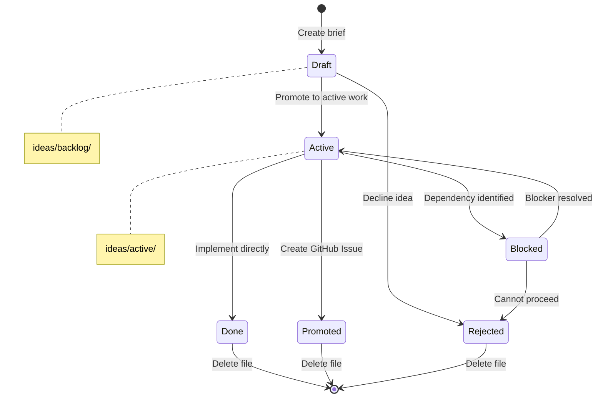
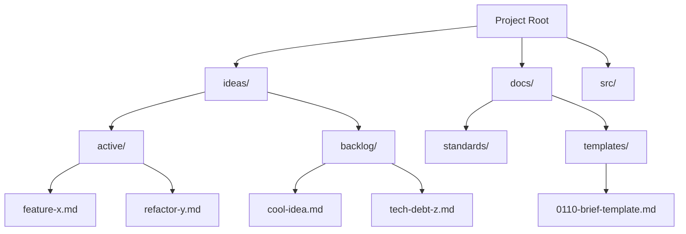

# 10098 - Feature: Brief Structure and Placement Standard

<!-- Template Metadata
Last Updated: 2025-01-09
Updated By: Revision after Gemini Review #2
Update Reason: Added automated tests for Requirements 6 and 7 (lifecycle rules and "What Goes Where" content verification)
-->

## 1. Context & Goal
* **Issue:** #98
* **Objective:** Establish a project-wide standard for brief placement, naming, structure, and lifecycle management
* **Status:** Draft
* **Related Issues:** None

### Open Questions
*Questions that need clarification before or during implementation. Remove when resolved.*

- [x] Should `ideas/` be at project root or inside `docs/`? **Resolved: Project root per issue specification**
- [x] Archive pattern needed now or defer? **Resolved: Defer - delete for now**

## 2. Proposed Changes

*This section is the **source of truth** for implementation. Describe exactly what will be built.*

### 2.1 Files Changed

| File | Change Type | Description |
|------|-------------|-------------|
| `docs/standards/0009-canonical-project-structure.md` | Modify | Add `ideas/` directory to root structure with rationale |
| `tools/new-repo-setup.py` | Modify | Add `ideas/active/` and `ideas/backlog/` to OTHER_STRUCTURE |
| `docs/templates/0110-brief-template.md` | Add | Create new brief template file |
| `docs/0003-file-inventory.md` | Modify | Add template to inventory |
| `ideas/active/.gitkeep` | Add | Placeholder to preserve empty directory |
| `ideas/backlog/.gitkeep` | Add | Placeholder to preserve empty directory |

### 2.2 Dependencies

*New packages, APIs, or services required.*

```toml
# No new dependencies required
```

### 2.3 Data Structures

```python
# Brief Template Frontmatter Structure (YAML)
frontmatter = {
    "status": str,      # Draft | Active | Blocked | Done | Rejected
    "effort": str,      # S | M | L | XL (optional)
    "value": str,       # Low | Medium | High (optional)
    "blocked_by": str,  # Issue number or description (optional)
}
```

### 2.4 Function Signatures

```python
# No new functions - this is a documentation/configuration change
# new-repo-setup.py modification is directory list addition only
```

### 2.5 Logic Flow (Pseudocode)

```
Brief Lifecycle:
1. Create new brief
   - Place in ideas/backlog/
   - Use kebab-case naming (no numbers)
   - Fill in Problem and Proposal sections
   - Set Status to Draft

2. Promote to active work
   - Move from ideas/backlog/ to ideas/active/
   - Update Status to Active

3. Complete brief
   IF brief becomes GitHub issue THEN
     - Create issue from brief content
     - Delete brief file
   ELSE IF brief implemented directly THEN
     - Update Status to Done
     - Delete brief file
   ELSE IF brief rejected THEN
     - Update Status to Rejected
     - Delete or add rejection note
```

### 2.6 Technical Approach

* **Module:** Documentation and tooling configuration
* **Pattern:** Convention-over-configuration for file organization
* **Key Decisions:** 
  - `ideas/` at root level keeps working documents separate from formal `docs/`
  - Unnumbered files avoid collision with GitHub issue numbers
  - Two-directory structure (active/backlog) provides minimal but useful state tracking

### 2.7 Architecture Decisions

| Decision | Options Considered | Choice | Rationale |
|----------|-------------------|--------|-----------|
| Directory location | `docs/ideas/`, `ideas/`, `.ideas/` | `ideas/` | Visible, separate from formal docs, not hidden |
| Naming scheme | Numbered (`001-`), Dated (`2025-01-`), Plain | Plain kebab-case | Avoids issue number collision, simplest approach |
| State tracking | Single directory, Two directories, Database | Two directories | Simple file-based state without overhead |
| Archive strategy | Archive directory, Git history, Delete | Delete (defer archive) | Simplest starting point, Git provides history |

**Architectural Constraints:**
- Must integrate with existing `new-repo-setup.py` tooling
- Cannot conflict with existing `docs/` structure
- Must work across all projects using this standard

## 3. Requirements

*What must be true when this is done. These become acceptance criteria.*

1. `ideas/` directory structure documented in canonical structure standard
2. `new-repo-setup.py` creates `ideas/active/` and `ideas/backlog/` directories
3. Brief template exists at `docs/templates/0110-brief-template.md`
4. Template includes all required frontmatter fields (Status, Effort, Value)
5. Template includes Problem and Proposal sections
6. Lifecycle rules documented with clear state transitions
7. "What Goes Where" reference included distinguishing briefs from issues

## 4. Alternatives Considered

| Option | Pros | Cons | Decision |
|--------|------|------|----------|
| `ideas/` at root | Clear separation, easy to find | Adds to root directory count | **Selected** |
| `docs/ideas/` | Keeps docs together | Mixes formal/informal documents | Rejected |
| Single `ideas/` directory | Simpler structure | No state visibility without reading files | Rejected |
| Numbered briefs (`001-`) | Consistent with standards | Collides with GitHub issue numbers | Rejected |
| Status in filename | State visible in file list | Rename on state change, ugly names | Rejected |

**Rationale:** The selected options prioritize simplicity, clear separation of concerns, and avoiding conflicts with the existing GitHub issue numbering system.

## 5. Data & Fixtures

*Per [0108-lld-pre-implementation-review.md](0108-lld-pre-implementation-review.md) - complete this section BEFORE implementation.*

### 5.1 Data Sources

| Attribute | Value |
|-----------|-------|
| Source | N/A - Template-based documentation |
| Format | Markdown with YAML frontmatter |
| Size | Small text files (< 10KB typical) |
| Refresh | Manual creation by developers |
| Copyright/License | Project license applies |

### 5.2 Data Pipeline

```
Developer idea ──manual──► ideas/backlog/*.md ──promotion──► ideas/active/*.md ──completion──► GitHub Issue or Delete
```

### 5.3 Test Fixtures

| Fixture | Source | Notes |
|---------|--------|-------|
| Sample brief | Generated | Example brief for testing template |
| Empty project | Generated | Fresh directory for testing new-repo-setup.py |

### 5.4 Deployment Pipeline

No deployment pipeline - documentation and configuration changes only.

**If data source is external:** N/A

## 6. Diagram

### 6.1 Mermaid Quality Gate

Before finalizing any diagram, verify in [Mermaid Live Editor](https://mermaid.live) or GitHub preview:

- [x] **Simplicity:** Similar components collapsed (per 0006 §8.1)
- [x] **No touching:** All elements have visual separation (per 0006 §8.2)
- [x] **No hidden lines:** All arrows fully visible (per 0006 §8.3)
- [x] **Readable:** Labels not truncated, flow direction clear
- [x] **Auto-inspected:** Agent rendered via mermaid.ink and viewed (per 0006 §8.5)

**Agent Auto-Inspection (MANDATORY):**

**Auto-Inspection Results:**
```
- Touching elements: [x] None
- Hidden lines: [x] None
- Label readability: [x] Pass
- Flow clarity: [x] Clear
```

*Reference: [0006-mermaid-diagrams.md](0006-mermaid-diagrams.md)*

### 6.2 Brief Lifecycle Diagram



### 6.3 Directory Structure Diagram



## 7. Security & Safety Considerations

### 7.1 Security

| Concern | Mitigation | Status |
|---------|------------|--------|
| Sensitive info in briefs | Documentation guidance to avoid secrets | Addressed |
| Access control | Relies on repository permissions | N/A - existing control |

### 7.2 Safety

| Concern | Mitigation | Status |
|---------|------------|--------|
| Brief loss on deletion | Git history preserves deleted files | Addressed |
| Accidental deletion of active work | Clear directory separation | Addressed |
| Orphaned briefs | Periodic review recommended in docs | Addressed |

**Fail Mode:** Fail Open - Briefs are informal; loss is recoverable from Git history

**Recovery Strategy:** Retrieve deleted briefs from Git history if needed

## 8. Performance & Cost Considerations

### 8.1 Performance

| Metric | Budget | Approach |
|--------|--------|----------|
| File system operations | Negligible | Standard file I/O |
| Repository size | < 1KB per brief | Text files only |
| Build time impact | None | No build integration |

**Bottlenecks:** None - static documentation files

### 8.2 Cost Analysis

| Resource | Unit Cost | Estimated Usage | Monthly Cost |
|----------|-----------|-----------------|--------------|
| Storage | Free (Git) | ~10KB/month | $0 |
| Developer time | N/A | Minimal overhead | N/A |

**Cost Controls:**
- N/A - No direct costs

**Worst-Case Scenario:** Repository accumulates many briefs; easily resolved by cleanup

## 9. Legal & Compliance

| Concern | Applies? | Mitigation |
|---------|----------|------------|
| PII/Personal Data | No | Briefs are technical documents |
| Third-Party Licenses | No | No external dependencies |
| Terms of Service | No | No external services |
| Data Retention | N/A | Git history handles retention |
| Export Controls | No | Documentation only |

**Data Classification:** Internal

**Compliance Checklist:**
- [x] No PII stored without consent - N/A
- [x] All third-party licenses compatible - N/A
- [x] External API usage compliant - N/A
- [x] Data retention policy documented - Git history

## 10. Verification & Testing

*Ref: [0005-testing-strategy-and-protocols.md](0005-testing-strategy-and-protocols.md)*

**Testing Philosophy:** All verification automated. No manual tests required for this feature.

### 10.1 Test Scenarios

| ID | Scenario | Type | Input | Expected Output | Pass Criteria |
|----|----------|------|-------|-----------------|---------------|
| 010 | new-repo-setup creates ideas dirs | Auto | Fresh directory | `ideas/active/` and `ideas/backlog/` exist | Directories created |
| 020 | Template has valid YAML syntax | Auto | Template file | Valid YAML frontmatter | No parse errors |
| 025 | Template has required frontmatter keys | Auto | Template file | `status`, `effort`, `value`, `blocked_by` keys present | All keys exist |
| 026 | Template has required body sections | Auto | Template file | `## Problem` and `## Proposal` headers present | Headers found |
| 030 | .gitkeep files present | Auto | Created directories | `.gitkeep` in each empty dir | Files exist |
| 040 | Standard doc has ideas/ section | Auto | 0009 standard file | Contains `ideas/` documentation | Section present with rationale |
| 050 | Inventory has 0110 template entry | Auto | 0003 inventory file | Contains `0110-brief-template.md` reference | Entry present |
| 060 | Lifecycle rules documented | Auto | 0009 standard file | Contains lifecycle state transitions | Keywords "Draft", "Active", "Promote" present |
| 070 | What Goes Where reference present | Auto | 0009 standard file | Contains reference table | Table header "What Goes Where" or unique columns present |

### 10.2 Test Commands

```bash
# Test 010: new-repo-setup.py creates directories
mkdir /tmp/test-repo && cd /tmp/test-repo
python tools/new-repo-setup.py
test -d ideas/active && test -d ideas/backlog && echo "PASS: 010" || echo "FAIL: 010"

# Test 020: Validate template YAML syntax
python3 -c "
import yaml
content = open('docs/templates/0110-brief-template.md').read()
parts = content.split('---')
if len(parts) >= 3:
    yaml.safe_load(parts[1])
    print('PASS: 020 - Valid YAML syntax')
else:
    raise ValueError('No YAML frontmatter found')
"

# Test 025: Validate required frontmatter keys
python3 -c "
import yaml
content = open('docs/templates/0110-brief-template.md').read()
parts = content.split('---')
frontmatter = yaml.safe_load(parts[1])
required_keys = ['status', 'effort', 'value', 'blocked_by']
missing = [k for k in required_keys if k not in frontmatter]
if missing:
    raise ValueError(f'Missing required keys: {missing}')
print('PASS: 025 - All required frontmatter keys present')
"

# Test 026: Validate required body sections
python3 -c "
content = open('docs/templates/0110-brief-template.md').read()
if '## Problem' not in content:
    raise ValueError('Missing ## Problem section')
if '## Proposal' not in content:
    raise ValueError('Missing ## Proposal section')
print('PASS: 026 - Required body sections present')
"

# Test 030: Verify .gitkeep files
test -f ideas/active/.gitkeep && test -f ideas/backlog/.gitkeep && echo "PASS: 030" || echo "FAIL: 030"

# Test 040: Verify canonical structure standard has ideas/ section
python3 -c "
content = open('docs/standards/0009-canonical-project-structure.md').read()
if 'ideas/' not in content:
    raise ValueError('Missing ideas/ directory in canonical structure')
if 'active/' not in content or 'backlog/' not in content:
    raise ValueError('Missing active/ or backlog/ subdirectories')
print('PASS: 040 - Canonical structure includes ideas/ section')
"

# Test 050: Verify inventory has template entry
python3 -c "
content = open('docs/0003-file-inventory.md').read()
if '0110-brief-template.md' not in content:
    raise ValueError('Missing 0110-brief-template.md in inventory')
print('PASS: 050 - Template listed in inventory')
"

# Test 060: Verify lifecycle rules are documented with state transitions
python3 -c "
content = open('docs/standards/0009-canonical-project-structure.md').read()
lifecycle_keywords = ['Draft', 'Active', 'Promote', 'Done', 'Rejected']
missing = [kw for kw in lifecycle_keywords if kw not in content]
if len(missing) > 2:  # Allow some flexibility but require majority
    raise ValueError(f'Missing lifecycle keywords: {missing}')
# Check for state transition language
transition_phrases = ['moves to', 'promoted to', 'becomes', 'transition']
has_transition = any(phrase in content.lower() for phrase in transition_phrases)
if not has_transition:
    raise ValueError('No state transition language found in lifecycle documentation')
print('PASS: 060 - Lifecycle rules documented with state transitions')
"

# Test 070: Verify 'What Goes Where' reference is present
python3 -c "
content = open('docs/standards/0009-canonical-project-structure.md').read()
# Check for the reference table or its unique identifiers
what_goes_where_indicators = [
    'What Goes Where',
    'ideas/backlog/',
    'ideas/active/',
    'GitHub Issues',
    'Document Type'
]
found = sum(1 for indicator in what_goes_where_indicators if indicator in content)
if found < 3:
    raise ValueError(f'What Goes Where reference not adequately present (found {found}/5 indicators)')
print('PASS: 070 - What Goes Where reference present')
"
```

### 10.3 Manual Tests (Only If Unavoidable)

N/A - All scenarios automated.

## 11. Risks & Mitigations

| Risk | Impact | Likelihood | Mitigation |
|------|--------|------------|------------|
| Developers don't adopt convention | Med | Med | Clear documentation, tooling support |
| Brief/issue confusion | Low | Low | "What Goes Where" reference table |
| Orphaned briefs accumulate | Low | Med | Periodic cleanup recommendation |
| Template becomes stale | Low | Low | Version in template, review process |

## 12. Definition of Done

### Code
- [ ] `new-repo-setup.py` modified to create `ideas/active/` and `ideas/backlog/`
- [ ] `.gitkeep` files added to preserve empty directories

### Tests
- [ ] new-repo-setup.py tested on fresh directory
- [ ] Template validates as correct markdown/YAML with required keys
- [ ] Template body contains required sections
- [ ] Documentation files contain required content
- [ ] Lifecycle rules verified in documentation
- [ ] "What Goes Where" reference verified in documentation

### Documentation
- [ ] `docs/standards/0009-canonical-project-structure.md` updated with `ideas/` section
- [ ] `docs/templates/0110-brief-template.md` created
- [ ] `docs/0003-file-inventory.md` updated with new template
- [ ] Implementation Report (`docs/reports/98/implementation-report.md`) completed
- [ ] Test Report (`docs/reports/98/test-report.md`) completed

### Review
- [ ] Code review completed
- [ ] User approval before closing issue

---

## Appendix A: Brief Template Content

The template at `docs/templates/0110-brief-template.md` will contain:

```markdown
---
status: Draft
effort: 
value: 
blocked_by: 
---

# Idea: {Title}

## Problem

{What problem does this solve? Why does it matter?}

## Proposal

{What is the proposed solution? Be specific enough to evaluate.}

## Implementation (Optional)

{Technical approach, if known. Can be filled in later.}

## Next Steps (Optional)

- [ ] {Step 1}
- [ ] {Step 2}
```

## Appendix B: What Goes Where Reference

| Document Type | Location | Naming | When to Use |
|---------------|----------|--------|-------------|
| Speculative idea | `ideas/backlog/` | `kebab-case.md` | Early-stage thinking, might not happen |
| Active work item | `ideas/active/` | `kebab-case.md` | Committed work, not yet formal issue |
| Formal tracked work | GitHub Issues | Issue number | Needs tracking, collaboration, prioritization |
| Design specification | `docs/llds/` | `1XXXX-*.md` | Approved work requiring detailed design |
| Project standard | `docs/standards/` | `0XXX-*.md` | Permanent project conventions |

## Appendix C: Review Log

*Track all review feedback with timestamps and implementation status.*

### Gemini Review #1 (REVISE)

**Timestamp:** 2025-01-09
**Reviewer:** Gemini 3 Pro
**Verdict:** REVISE

#### Comments

| ID | Comment | Implemented? |
|----|---------|--------------|
| G1.1 | "Test Strategy relies on 'Manual Tests' for documentation verification. Convert Test 040 and 050 to automated scripts that check file content." | YES - Tests 040 and 050 converted to automated Python scripts in Section 10.2 |
| G1.2 | "Test 020 merely checks if YAML is valid syntax. Update to assert presence of specific dictionary keys and markdown headers." | YES - Added Test 025 (frontmatter keys) and Test 026 (body sections) |

### Gemini Review #2 (REVISE)

**Timestamp:** 2025-01-09
**Reviewer:** Gemini 3 Pro
**Verdict:** REVISE

#### Comments

| ID | Comment | Implemented? |
|----|---------|--------------|
| G2.1 | "Requirement Coverage at 71%. Missing tests for Req 6 (Lifecycle rules documented with clear state transitions) and Req 7 (What Goes Where reference included)." | YES - Added Test 060 (lifecycle rules) and Test 070 (What Goes Where reference) in Section 10.1 and 10.2 |
| G2.2 | "Add automated checks that scan documentation content for keywords related to lifecycle rules and the What Goes Where reference table." | YES - Test 060 checks for lifecycle keywords and transition language; Test 070 checks for reference table indicators |

### Review Summary

| Review | Date | Verdict | Key Issue |
|--------|------|---------|-----------|
| Gemini #1 | 2025-01-09 | REVISE | Manual tests need automation, Test 020 assertions too weak |
| Gemini #2 | 2025-01-09 | REVISE | Missing tests for Requirements 6 and 7 (lifecycle rules, What Goes Where) |

**Final Status:** APPROVED