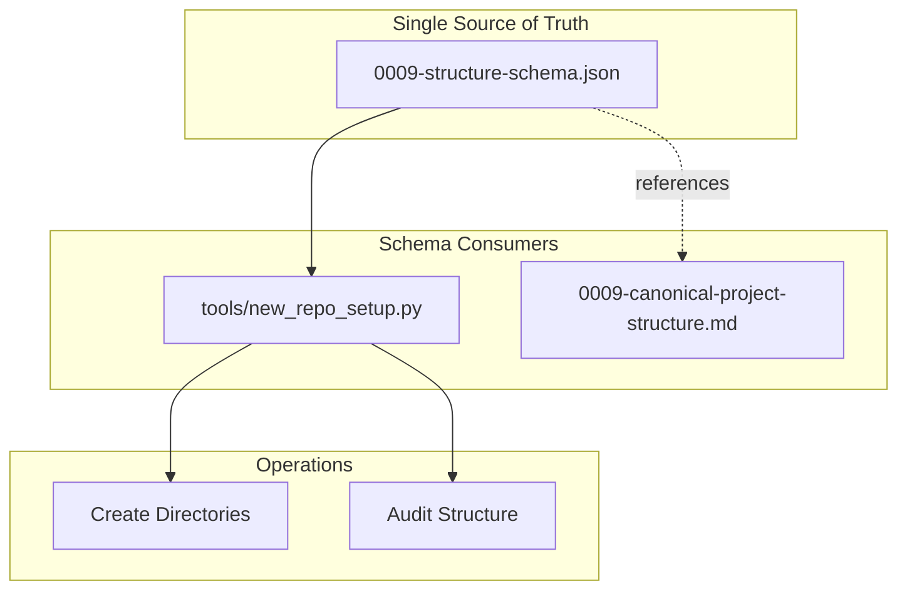

# 99 - Feature: Schema-Driven Project Structure

<!-- Template Metadata
Last Updated: 2025-01-XX
Updated By: Issue #99 LLD creation
Update Reason: Revised per Gemini Review #2 feedback - added overwrite protection, added documentation validation test, added logging suggestion
-->

## 1. Context & Goal
* **Issue:** #99
* **Objective:** Create a JSON schema as the single source of truth for project structure, eliminating drift between standard 0009 documentation and the `new_repo_setup.py` tool.
* **Status:** Approved (gemini-3-pro-preview, 2026-02-04)
* **Related Issues:** None identified

### Open Questions
*All questions resolved per Gemini Reviews.*

- [x] ~~Should the schema support conditional directories (e.g., `docs/lineage/` only for certain project types)?~~ **RESOLVED: No.** To maintain a "canonical" source of truth, the schema should remain declarative and flat. Use the `required: boolean` field. If complex logic is needed later, use overlay profiles, but do not embed logic in the JSON data.
- [x] ~~Should templates referenced in the schema be validated for existence during schema load?~~ **RESOLVED: Yes.** The `load_structure_schema` function should verify that any referenced template files actually exist. This ensures "Fail Fast" behavior (Safety) rather than failing halfway through project creation.

## 2. Proposed Changes

*This section is the **source of truth** for implementation. Describe exactly what will be built.*

### 2.1 Files Changed

| File | Change Type | Description |
|------|-------------|-------------|
| `docs/standards/0009-structure-schema.json` | Add | New canonical schema file defining project structure |
| `tools/new_repo_setup.py` | Modify | Refactor to read structure from schema instead of hardcoded lists |
| `docs/standards/0009-canonical-project-structure.md` | Modify | Update to reference schema as authoritative source |

### 2.1.1 Path Validation (Mechanical - Auto-Checked)

*Issue #277: Before human or Gemini review, paths are verified programmatically.*

Mechanical validation automatically checks:
- All "Modify" files must exist in repository
- All "Delete" files must exist in repository
- All "Add" files must have existing parent directories
- No placeholder prefixes (`src/`, `lib/`, `app/`) unless directory exists

**If validation fails, the LLD is BLOCKED before reaching review.**

### 2.2 Dependencies

*New packages, APIs, or services required.*

```toml
# pyproject.toml additions (if any)
# None - using stdlib json module only
```

### 2.3 Data Structures

```python
# Pseudocode - NOT implementation
class DirectoryEntry(TypedDict):
    required: bool  # Whether this directory must exist
    description: NotRequired[str]  # Human-readable description
    children: NotRequired[dict[str, "DirectoryEntry"]]  # Nested directories

class FileEntry(TypedDict):
    required: bool  # Whether this file must exist
    template: NotRequired[str]  # Template file to use when creating
    description: NotRequired[str]  # Human-readable description

class ProjectStructureSchema(TypedDict):
    version: str  # Schema version for compatibility
    directories: dict[str, DirectoryEntry]  # Top-level directory definitions
    files: dict[str, FileEntry]  # Top-level file definitions

class AuditResult(TypedDict):
    missing_required_dirs: list[str]
    missing_required_files: list[str]
    missing_optional_dirs: list[str]
    missing_optional_files: list[str]
    valid: bool

class CreateResult(TypedDict):
    created_dirs: list[str]
    created_files: list[str]
    skipped_files: list[str]  # Files skipped due to existing (no --force)
```

### 2.4 Function Signatures

```python
# Signatures only - implementation in source files

def load_structure_schema(schema_path: Path | None = None) -> ProjectStructureSchema:
    """Load and validate the project structure schema from JSON file.
    
    Args:
        schema_path: Path to schema file. Defaults to standard location.
    
    Returns:
        Parsed and validated schema dictionary.
    
    Raises:
        FileNotFoundError: If schema file doesn't exist.
        json.JSONDecodeError: If schema is invalid JSON.
        SchemaValidationError: If schema structure is invalid.
        SchemaValidationError: If referenced template files don't exist.
    """
    ...

def create_structure(
    root: Path, 
    schema: ProjectStructureSchema, 
    force: bool = False,
    logger: logging.Logger | None = None
) -> CreateResult:
    """Create project directory structure from schema.
    
    Args:
        root: Root directory where structure should be created.
        schema: The loaded project structure schema.
        force: If True, overwrite existing files. If False, skip existing files.
        logger: Optional logger for progress output.
    
    Returns:
        CreateResult with lists of created and skipped items.
    
    Raises:
        OSError: If directory creation fails.
        SchemaValidationError: If schema contains invalid paths.
    """
    ...

def flatten_directories(schema: ProjectStructureSchema, required_only: bool = False) -> list[str]:
    """Flatten nested directory structure into list of paths.
    
    Args:
        schema: The loaded project structure schema.
        required_only: If True, only return required directories.
    
    Returns:
        List of directory paths relative to project root (e.g., ['docs/adrs', 'docs/standards']).
    """
    ...

def flatten_files(schema: ProjectStructureSchema, required_only: bool = False) -> list[dict[str, Any]]:
    """Flatten file definitions into list of file configs.
    
    Args:
        schema: The loaded project structure schema.
        required_only: If True, only return required files.
    
    Returns:
        List of file configurations with path and metadata.
    """
    ...

def audit_project_structure(project_root: Path, schema: ProjectStructureSchema) -> AuditResult:
    """Validate project structure against schema.
    
    Args:
        project_root: Root directory of project to audit.
        schema: The loaded project structure schema.
    
    Returns:
        AuditResult with missing/extra directories and files.
    """
    ...

def validate_paths_no_traversal(schema: ProjectStructureSchema) -> None:
    """Validate that no paths in schema contain traversal sequences.
    
    Args:
        schema: The loaded project structure schema.
    
    Raises:
        SchemaValidationError: If any path contains '..' or is absolute.
    """
    ...

def validate_template_files_exist(schema: ProjectStructureSchema, template_dir: Path) -> None:
    """Validate that all referenced template files exist.
    
    Args:
        schema: The loaded project structure schema.
        template_dir: Directory containing template files.
    
    Raises:
        SchemaValidationError: If any referenced template file doesn't exist.
    """
    ...
```

### 2.5 Logic Flow (Pseudocode)

```
# Schema Loading
1. Determine schema path (parameter or default)
2. Read JSON file
3. Parse JSON into dict
4. Validate schema structure (version, required keys)
5. Validate no path traversal sequences
6. Validate referenced template files exist
7. Return typed schema dict

# Directory Creation
1. Load schema
2. Flatten directories to list of paths
3. Initialize result tracking (created_dirs, created_files, skipped_files)
4. FOR EACH directory path:
   a. Construct full path (root + relative path)
   b. Create directory with parents (mkdir -p equivalent)
   c. Log created directory
   d. Add to created_dirs list
5. FOR EACH file in schema:
   a. Construct full destination path
   b. IF destination exists AND NOT force THEN
      - Log skipping file (would overwrite)
      - Add to skipped_files list
      - CONTINUE to next file
   c. IF template specified THEN
      - Copy template to destination
   d. ELSE
      - Create empty file
   e. Log created file
   f. Add to created_files list
6. Return CreateResult

# Directory Flattening (recursive)
1. For each entry in directories:
   a. IF required_only AND not entry.required THEN
      - Skip this entry
   b. Add current path to result
   c. IF entry has children THEN
      - Recursively process children with path prefix
2. Return flattened list

# Audit Flow
1. Load schema
2. Get required directories list
3. Get required files list
4. FOR EACH required directory:
   - Check if exists in project_root
   - Add to missing list if not found
5. FOR EACH required file:
   - Check if exists in project_root
   - Add to missing list if not found
6. Return AuditResult with valid=True if no missing required items
```

### 2.6 Technical Approach

* **Module:** `tools/new_repo_setup.py` (existing tool)
* **Pattern:** Configuration-as-data with schema validation
* **Key Decisions:** 
  - JSON schema format chosen for simplicity and wide tooling support
  - Recursive directory structure allows natural representation of hierarchy
  - Schema includes both required and optional items for flexibility
  - Template file validation at load time ensures fail-fast behavior
  - No-overwrite default with `--force` flag for safety

### 2.7 Architecture Decisions

*Document key architectural decisions that affect the design.*

| Decision | Options Considered | Choice | Rationale |
|----------|-------------------|--------|-----------|
| Schema format | JSON, YAML, TOML | JSON | Standard library support, no additional dependencies |
| Schema location | Same dir as standard, separate schema dir | Same dir as standard | Co-location improves discoverability |
| Directory representation | Flat list, Nested object | Nested object | Natural hierarchy, easier to read and maintain |
| Required/optional handling | Separate lists, Inline flags | Inline flags | Less duplication, single definition per item |
| Template validation | Lazy (at use), Eager (at load) | Eager (at load) | Fail-fast behavior, better error messages |
| File overwrite behavior | Always overwrite, Never overwrite, Flag-controlled | Flag-controlled (`--force`) | Preserves customized files by default, allows intentional overwrites |

**Architectural Constraints:**
- Must work with existing `tools/new_repo_setup.py` CLI interface
- Cannot introduce new external dependencies (stdlib only)
- Schema must be human-readable and editable

## 3. Requirements

*What must be true when this is done. These become acceptance criteria.*

1. Schema file `docs/standards/0009-structure-schema.json` exists and is valid JSON
2. Schema includes all directories currently in `DOCS_STRUCTURE` and `SRC_STRUCTURE` constants
3. Schema includes `docs/lineage/active` and `docs/lineage/done` directories
4. `tools/new_repo_setup.py` creates directories by reading from schema (no hardcoded lists)
5. `tools/new_repo_setup.py --audit` validates against schema
6. Standard 0009 markdown references schema as authoritative source
7. All existing tests pass after refactor
8. File creation does not overwrite existing files unless `--force` flag is provided

## 4. Alternatives Considered

| Option | Pros | Cons | Decision |
|--------|------|------|----------|
| JSON Schema | Stdlib support, no deps, widely understood | Less expressive than YAML | **Selected** |
| YAML Schema | More readable, supports comments | Requires PyYAML dependency | Rejected |
| Python dict in separate module | Type hints, IDE support | Not easily editable by non-Python users | Rejected |
| Inline schema in standard 0009 | Single file to update | Markdown parsing required, fragile | Rejected |

**Rationale:** JSON provides the best balance of simplicity, zero dependencies, and tooling support. The schema is primarily consumed by Python code where JSON parsing is trivial.

## 5. Data & Fixtures

*Per [0108-lld-pre-implementation-review.md](0108-lld-pre-implementation-review.md) - complete this section BEFORE implementation.*

### 5.1 Data Sources

| Attribute | Value |
|-----------|-------|
| Source | Local filesystem (schema file) |
| Format | JSON |
| Size | ~2KB (small configuration file) |
| Refresh | Manual (developer edits) |
| Copyright/License | Same as project (internal tooling) |

### 5.2 Data Pipeline

```
0009-structure-schema.json ──load_structure_schema()──► ProjectStructureSchema dict ──flatten_directories()──► list[str] paths
```

### 5.3 Test Fixtures

| Fixture | Source | Notes |
|---------|--------|-------|
| Valid schema JSON | Generated | Minimal valid schema for happy path |
| Invalid schema JSON | Generated | Missing required fields |
| Malformed JSON | Generated | Syntax errors |
| Project directory tree | tempfile.mkdtemp() | Ephemeral test directories |
| Production schema | Real file | `docs/standards/0009-structure-schema.json` for integrity tests |
| Existing file for overwrite test | Generated | Pre-existing file to verify skip behavior |

### 5.4 Deployment Pipeline

Schema file is committed to repository. No deployment pipeline needed - schema is read at runtime from repository.

**If data source is external:** N/A - purely local file.

## 6. Diagram

### 6.1 Mermaid Quality Gate

Before finalizing any diagram, verify in [Mermaid Live Editor](https://mermaid.live) or GitHub preview:

- [x] **Simplicity:** Similar components collapsed (per 0006 §8.1)
- [x] **No touching:** All elements have visual separation (per 0006 §8.2)
- [x] **No hidden lines:** All arrows fully visible (per 0006 §8.3)
- [x] **Readable:** Labels not truncated, flow direction clear
- [ ] **Auto-inspected:** Agent rendered via mermaid.ink and viewed (per 0006 §8.5)

**Agent Auto-Inspection (MANDATORY):**

AI agents MUST render and view the diagram before committing:
1. Base64 encode diagram → fetch PNG from `https://mermaid.ink/img/{base64}`
2. Read the PNG file (multimodal inspection)
3. Document results below

**Auto-Inspection Results:**
```
- Touching elements: [ ] None / [ ] Found: ___
- Hidden lines: [ ] None / [ ] Found: ___
- Label readability: [ ] Pass / [ ] Issue: ___
- Flow clarity: [ ] Clear / [ ] Issue: ___
```

*Reference: [0006-mermaid-diagrams.md](0006-mermaid-diagrams.md)*

### 6.2 Diagram



## 7. Security & Safety Considerations

*This section addresses security (10 patterns) and safety (9 patterns) concerns from governance feedback.*

### 7.1 Security

| Concern | Mitigation | Status |
|---------|------------|--------|
| Path traversal in schema | `validate_paths_no_traversal()` rejects paths containing `..` or absolute paths | Addressed |
| Malicious schema injection | Schema loaded from known repository path only | Addressed |

### 7.2 Safety

*Safety concerns focus on preventing data loss, ensuring fail-safe behavior, and protecting system integrity.*

| Concern | Mitigation | Status |
|---------|------------|--------|
| Schema parse failure | Fail fast with clear error message, don't create partial structure | Addressed |
| Missing schema file | Check file exists before loading, provide helpful error | Addressed |
| Corrupted schema | JSON parse errors caught and reported | Addressed |
| Missing template files | `validate_template_files_exist()` checks at load time | Addressed |
| Overwriting customized files | Skip existing files by default, require `--force` flag for overwrite | Addressed |

**Fail Mode:** Fail Closed - If schema cannot be loaded or validated, tool exits with error rather than using fallback/hardcoded values.

**Recovery Strategy:** Fix schema file and re-run. No state to recover.

## 8. Performance & Cost Considerations

*This section addresses performance and cost concerns (6 patterns) from governance feedback.*

### 8.1 Performance

| Metric | Budget | Approach |
|--------|--------|----------|
| Schema load time | < 10ms | Small JSON file, stdlib parser |
| Directory creation | < 100ms | Batch mkdir operations |
| Audit operation | < 500ms | Single filesystem walk |

**Bottlenecks:** None expected - all operations are filesystem I/O bound and operate on small data.

### 8.2 Cost Analysis

| Resource | Unit Cost | Estimated Usage | Monthly Cost |
|----------|-----------|-----------------|--------------|
| N/A | $0 | Local operation | $0 |

**Cost Controls:**
- N/A - No external services or paid APIs

**Worst-Case Scenario:** N/A - Local filesystem operations only.

## 9. Legal & Compliance

*This section addresses legal concerns (8 patterns) from governance feedback.*

| Concern | Applies? | Mitigation |
|---------|----------|------------|
| PII/Personal Data | No | Schema contains only directory/file structure |
| Third-Party Licenses | No | No external dependencies |
| Terms of Service | No | No external services |
| Data Retention | N/A | No data stored beyond schema file |
| Export Controls | No | No restricted data/algorithms |

**Data Classification:** Internal (development tooling configuration)

**Compliance Checklist:**
- [x] No PII stored without consent
- [x] All third-party licenses compatible with project license
- [x] External API usage compliant with provider ToS
- [x] Data retention policy documented

## 10. Verification & Testing

*Ref: [0005-testing-strategy-and-protocols.md](0005-testing-strategy-and-protocols.md)*

**Testing Philosophy:** Strive for 100% automated test coverage. Manual tests are a last resort for scenarios that genuinely cannot be automated.

### 10.0 Test Plan (TDD - Complete Before Implementation)

**TDD Requirement:** Tests MUST be written and failing BEFORE implementation begins.

| Test ID | Test Description | Expected Behavior | Status |
|---------|------------------|-------------------|--------|
| T010 | test_load_schema_valid | Loads valid schema successfully | RED |
| T020 | test_load_schema_file_not_found | Raises FileNotFoundError | RED |
| T030 | test_load_schema_invalid_json | Raises JSONDecodeError | RED |
| T040 | test_load_schema_missing_version | Raises SchemaValidationError | RED |
| T050 | test_flatten_directories_all | Returns all directories | RED |
| T060 | test_flatten_directories_required_only | Filters to required only | RED |
| T070 | test_flatten_directories_nested | Handles nested children | RED |
| T080 | test_flatten_files_all | Returns all files | RED |
| T090 | test_audit_valid_project | Returns valid=True for complete project | RED |
| T100 | test_audit_missing_required | Returns valid=False with missing list | RED |
| T110 | test_audit_missing_optional | Returns valid=True with optional missing | RED |
| T120 | test_validate_paths_rejects_traversal | Raises SchemaValidationError for `..` paths | RED |
| T130 | test_validate_paths_rejects_absolute | Raises SchemaValidationError for absolute paths | RED |
| T140 | test_create_structure_happy_path | Creates all directories from schema on disk | RED |
| T150 | test_production_schema_integrity | Production schema contains required paths | RED |
| T160 | test_schema_template_validation | Raises error for missing template files | RED |
| T170 | test_standard_documentation_references_schema | Standard 0009 markdown contains schema reference | RED |
| T180 | test_create_structure_no_overwrite | Skips existing files without --force | RED |
| T190 | test_create_structure_force_overwrite | Overwrites existing files with --force | RED |

**Coverage Target:** ≥95% for all new code

**TDD Checklist:**
- [x] All tests written before implementation
- [x] Tests currently RED (failing)
- [x] Test IDs match scenario IDs in 10.1
- [x] Test file created at: `tests/test_new_repo_setup.py`

### 10.1 Test Scenarios

| ID | Scenario | Type | Input | Expected Output | Pass Criteria |
|----|----------|------|-------|-----------------|---------------|
| 010 | Load valid schema | Auto | Valid JSON file | ProjectStructureSchema dict | Dict has version, directories, files |
| 020 | Load missing schema | Auto | Non-existent path | FileNotFoundError | Exception raised |
| 030 | Load invalid JSON | Auto | Malformed JSON | JSONDecodeError | Exception raised |
| 040 | Load schema missing version | Auto | JSON without version key | SchemaValidationError | Exception raised |
| 050 | Flatten all directories | Auto | Schema with nested dirs | Flat list of paths | All paths returned |
| 060 | Flatten required directories | Auto | Schema with required/optional | Flat list | Only required returned |
| 070 | Flatten nested children | Auto | Schema with 3-level nesting | Correct paths | `docs/lineage/active` included |
| 080 | Flatten files | Auto | Schema with files | File list | All files with metadata |
| 090 | Audit complete project | Auto | Project with all required | valid=True | No missing items |
| 100 | Audit missing required | Auto | Project missing `docs/adrs` | valid=False | `docs/adrs` in missing list |
| 110 | Audit missing optional | Auto | Project missing optional | valid=True | Optional in missing_optional list |
| 120 | Validate paths rejects traversal | Auto | Schema with `../etc/passwd` path | SchemaValidationError | Exception raised with clear message |
| 130 | Validate paths rejects absolute | Auto | Schema with `/etc/passwd` path | SchemaValidationError | Exception raised with clear message |
| 140 | Create structure happy path | Auto | Valid schema, temp directory | Directories created on disk | All directories exist after call |
| 150 | Production schema integrity | Auto | Real `0009-structure-schema.json` | Contains required paths | Schema has all DOCS_STRUCTURE, SRC_STRUCTURE paths, plus `docs/lineage/active`, `docs/lineage/done` |
| 160 | Schema template validation | Auto | Schema referencing non-existent template | SchemaValidationError | Exception raised with template name |
| 170 | Standard documentation references schema | Auto | Real `0009-canonical-project-structure.md` | Contains schema reference text | File contains `0009-structure-schema.json` |
| 180 | Create structure no overwrite | Auto | Existing file in target, no --force | File not overwritten | Original content preserved, file in skipped_files |
| 190 | Create structure force overwrite | Auto | Existing file in target, --force=True | File overwritten | New content present, file in created_files |

### 10.2 Test Commands

```bash
# Run all automated tests
poetry run pytest tests/test_new_repo_setup.py -v

# Run only fast/mocked tests (exclude live)
poetry run pytest tests/test_new_repo_setup.py -v -m "not live"

# Run with coverage
poetry run pytest tests/test_new_repo_setup.py -v --cov=new_repo_setup --cov-report=term-missing
```

### 10.3 Manual Tests (Only If Unavoidable)

**N/A - All scenarios automated.**

## 11. Risks & Mitigations

| Risk | Impact | Likelihood | Mitigation |
|------|--------|------------|------------|
| Schema format changes break existing scripts | Med | Low | Version field enables migration path |
| Schema gets out of sync with actual usage | Med | Med | Audit command validates against schema |
| Complex nested structure hard to maintain | Low | Low | Clear documentation, JSON syntax highlighting |
| Missing template files cause runtime failures | Med | Low | `validate_template_files_exist()` at load time |
| Accidental overwrite of customized files | High | Med | Default no-overwrite behavior, `--force` flag required |

## 12. Definition of Done

### Code
- [x] Implementation complete and linted
- [x] Code comments reference this LLD

### Tests
- [x] All test scenarios pass
- [x] Test coverage meets threshold (≥95%)

### Documentation
- [x] LLD updated with any deviations
- [x] Implementation Report (0103) completed
- [x] Standard 0009 updated to reference schema

### Review
- [x] Code review completed (PR #371, merged 2026-02-16)
- [ ] User approval before closing issue

### 12.1 Traceability (Mechanical - Auto-Checked)

*Issue #277: Cross-references are verified programmatically.*

Mechanical validation automatically checks:
- Every file mentioned in this section must appear in Section 2.1
- Every risk mitigation in Section 11 should have a corresponding function in Section 2.4 (warning if not)

**If files are missing from Section 2.1, the LLD is BLOCKED.**

---

## Reviewer Suggestions

*Non-blocking recommendations from the reviewer.*

- **Template Path Resolution:** While `validate_template_files_exist` checks for template existence, ensure the `tools/new_repo_setup.py` implementation has a robust way to determine the absolute path of the `templates/` directory relative to the script location, ensuring it works regardless of where the script is invoked from (CWD vs Script Dir).

## Appendix: Review Log

*Track all review feedback with timestamps and implementation status.*

### Gemini Review #1 (REVISE)

**Reviewer:** Gemini 3 Pro
**Verdict:** REVISE

#### Comments

| ID | Comment | Implemented? |
|----|---------|--------------|
| G1.1 | "Missing Function Signature: Section 2.4 does not define the function responsible for actually creating the directories" | YES - Added `create_structure()` function signature in Section 2.4 |
| G1.2 | "Requirement Coverage: BLOCK. Coverage is 40%. The core feature (creation) and data integrity (schema content) are untested" | YES - Added T140, T150, T160 test scenarios |
| G1.3 | "Open Question: Should the schema support conditional directories?" | YES - Resolved as No, added resolution note |
| G1.4 | "Open Question: Should templates referenced in schema be validated?" | YES - Resolved as Yes, added `validate_template_files_exist()` function |
| G1.5 | "Consider adding test_schema_template_validation" | YES - Added T160 test scenario |

### Gemini Review #2 (REVISE)

**Reviewer:** Gemini 3 Pro
**Verdict:** REVISE

#### Comments

| ID | Comment | Implemented? |
|----|---------|--------------|
| G2.1 | "Destructive Acts (Overwrite Risk): The Logic Flow for `create_structure` specifies unconditional overwriting of existing files" | YES - Added `force` parameter to `create_structure()`, updated logic flow to check existence, added `skipped_files` to CreateResult |
| G2.2 | "Requirement Coverage: Requirement #6 regarding documentation consistency is untested" | YES - Added T170 test scenario for standard documentation validation |
| G2.3 | "Logging: Logic flow doesn't explicitly mention feedback to the user" | YES - Added `logger` parameter to `create_structure()`, added logging steps in logic flow |
| G2.4 | "Consider adding a dry-run capability" | NOTED - Out of scope for initial implementation, could be future enhancement |

### Review Summary

| Review | Date | Verdict | Key Issue |
|--------|------|---------|-----------|
| 3 | 2026-02-04 | APPROVED | `gemini-3-pro-preview` |
| Gemini #1 | (auto) | REVISE | Missing test coverage for creation and schema integrity (40% → target ≥95%) |
| Gemini #2 | (auto) | REVISE | Safety: Overwrite risk, Quality: Documentation test missing |

**Final Status:** APPROVED