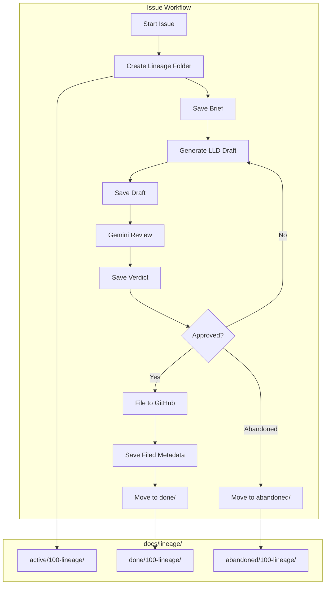

# 1100 - Feature: Lineage Workflow Integration

<!-- Template Metadata
Last Updated: 2025-01-10
Updated By: Gemini Review #1 revisions
Update Reason: Address requirement coverage gaps, add abandoned folder, define JSON schema
-->

## 1. Context & Goal
* **Issue:** #100
* **Objective:** Standardize design review artifact storage by integrating `docs/lineage/` folder structure into issue and LLD workflows
* **Status:** Approved (gemini-3-pro-preview, 2026-02-04)
* **Related Issues:** Standard 0009 (updated), RCA-PDF lineage rename (done)

### Open Questions
*All questions resolved per Gemini Review #1.*

~~- [x] Should we support resuming a partially-completed lineage folder (e.g., if workflow crashed after brief but before filing)?~~
**RESOLVED:** Yes. Resumability is critical for workflow robustness and preventing orphaned folders.

~~- [x] What happens if an issue is closed without filing (cancelled/abandoned)? Move to `done/` with special status or `abandoned/`?~~
**RESOLVED:** Move to `docs/lineage/abandoned/` to distinguish them from shipped features.

## 2. Proposed Changes

*This section is the **source of truth** for implementation. Describe exactly what will be built.*

### 2.1 Files Changed

| File | Change Type | Description |
|------|-------------|-------------|
| `tools/issue-workflow.py` | Modify | Add lineage folder management throughout workflow lifecycle |
| `tools/lld-workflow.py` | Modify | Add `--lineage-folder` flag for integration with issue workflow |
| `tools/new_repo_setup.py` | Modify | Create `docs/lineage/active/`, `docs/lineage/done/`, and `docs/lineage/abandoned/` directories |
| `tools/lineage.py` | Add | New module with shared lineage folder utilities |

### 2.2 Dependencies

*New packages, APIs, or services required.*

```toml
# pyproject.toml additions (if any)
# None - uses standard library only
```

### 2.3 Data Structures

```python
# Pseudocode - NOT implementation
class LineageState(TypedDict):
    issue_id: str           # Issue number (e.g., "100")
    short_description: str  # Slug for folder name (e.g., "lineage-workflow")
    folder_path: Path       # Full path to lineage folder
    artifact_counter: int   # Current artifact number (starts at 1)
    status: Literal["active", "done", "abandoned"]  # Folder location

class LineageArtifact(TypedDict):
    sequence_number: int    # 001, 002, etc.
    artifact_type: Literal["brief", "draft", "verdict", "filed"]
    filename: str           # e.g., "003-verdict.md"
    created_at: str         # ISO timestamp

class FilingMetadata(TypedDict):
    """JSON schema for {NNN}-filed.json files."""
    issue_id: str           # Issue number (e.g., "100")
    issue_url: str          # Full GitHub issue URL
    filed_at: str           # ISO timestamp of filing
    title: str              # Issue title
    lineage_folder: str     # Relative path to lineage folder
    artifact_count: int     # Total artifacts in folder
    final_draft: str        # Filename of approved draft
    final_verdict: str      # Filename of approving verdict
```

### 2.4 Function Signatures

```python
# tools/lineage.py - new module

def create_lineage_folder(issue_id: str, short_description: str) -> Path:
    """Create and return path to docs/lineage/active/{issue_id}-{short_description}/."""
    ...

def get_next_artifact_number(folder_path: Path) -> int:
    """Scan folder and return next available sequence number."""
    ...

def save_artifact(folder_path: Path, artifact_type: str, content: str) -> Path:
    """Save artifact with auto-incrementing sequence number. Returns path to saved file.
    
    Supports all artifact types including 'filed' which saves as JSON.
    """
    ...

def move_to_done(folder_path: Path) -> Path:
    """Move lineage folder from active/ to done/. Returns new path."""
    ...

def move_to_abandoned(folder_path: Path) -> Path:
    """Move lineage folder from active/ to abandoned/. Returns new path."""
    ...

def find_active_lineage(issue_id: str) -> Optional[Path]:
    """Find existing active lineage folder for an issue, if any."""
    ...

def slugify(text: str, max_length: int = 30) -> str:
    """Convert text to URL-safe slug for folder naming."""
    ...


# tools/lld-workflow.py - additions

def parse_args() -> argparse.Namespace:
    """Parse command line arguments including --lineage-folder flag."""
    ...
```

### 2.5 Logic Flow (Pseudocode)

```
# Issue Workflow - Start
1. Parse issue number and title from input
2. Generate short_description slug from title
3. Check if lineage folder already exists (resumption support)
   IF exists THEN
     - Load existing state
     - Resume from last artifact
   ELSE
     - Create docs/lineage/active/{issue_id}-{slug}/
4. Save brief as {NNN}-brief.md (usually 001)

# Issue Workflow - LLD Iteration Loop
5. FOR each draft iteration:
   a. Generate/revise LLD draft
   b. Save as {NNN}-draft.md
   c. Submit to Gemini review
   d. Save verdict as {NNN}-verdict.md
   e. IF approved THEN break
   ELSE continue with revisions

# Issue Workflow - Filing
6. File issue to GitHub
7. Save filing metadata as {NNN}-filed.json (see FilingMetadata schema)
8. Move folder from active/ to done/

# Issue Workflow - Abandonment
6a. IF workflow cancelled/abandoned THEN
    - Move folder from active/ to abandoned/
    - Do NOT save filed.json

# LLD Workflow - Standalone Mode
1. IF called with --lineage-folder flag THEN
   - Use provided lineage folder
   - Validate folder exists
   ELSE IF running standalone THEN
   - Create new lineage folder
   - Manage artifacts internally
2. Save drafts/verdicts with proper sequencing

# new_repo_setup.py - Directory Creation
1. Create docs/lineage/active/ if not exists
2. Create docs/lineage/done/ if not exists
3. Create docs/lineage/abandoned/ if not exists
```

### 2.6 Technical Approach

* **Module:** `tools/lineage.py` (new shared utilities)
* **Pattern:** Filesystem-based state management with sequential numbering
* **Key Decisions:** 
  - Use 3-digit zero-padded numbers for natural sorting (001, 002, ...)
  - Folder names include issue ID prefix for uniqueness
  - Single source of truth for artifact sequencing via filesystem scan

### 2.7 Architecture Decisions

| Decision | Options Considered | Choice | Rationale |
|----------|-------------------|--------|-----------|
| State storage | JSON state file vs. filesystem scan | Filesystem scan | Simpler, self-healing if files manually added/removed |
| Artifact numbering | Per-type (draft-001) vs. global sequence | Global sequence | Shows chronological order of all artifacts |
| Folder naming | `{id}/` vs. `{id}-{slug}/` | `{id}-{slug}/` | Human-readable when browsing filesystem |
| Slug generation | Title-based vs. manual input | Title-based auto-generated | Reduces friction, consistent naming |
| Abandoned handling | `done/` with status vs. `abandoned/` | `abandoned/` folder | Clear separation, no ambiguity in done/ |

**Architectural Constraints:**
- Must work with existing issue-workflow.py and lld-workflow.py interfaces
- Cannot require external dependencies beyond standard library
- Must be resilient to partial workflow failures (resumable)

## 3. Requirements

*What must be true when this is done. These become acceptance criteria.*

1. Issue workflow creates `docs/lineage/active/{id}-{slug}/` at workflow start
2. All briefs saved as `001-brief.md` in lineage folder
3. All drafts saved as `{NNN}-draft.md` with auto-incrementing numbers
4. All verdicts saved as `{NNN}-verdict.md` with auto-incrementing numbers
5. Filing metadata saved as final `{NNN}-filed.json` with issue URL, timestamps, and schema per Section 2.3
6. Folder moves to `docs/lineage/done/` on successful filing
7. LLD workflow accepts `--lineage-folder` flag for integration
8. `new_repo_setup.py` creates `active/`, `done/`, and `abandoned/` directories
9. Workflow can resume from existing active lineage folder

## 4. Alternatives Considered

| Option | Pros | Cons | Decision |
|--------|------|------|----------|
| Filesystem-based sequencing | Simple, no separate state file, self-healing | Requires folder scan on each save | **Selected** |
| JSON state file tracking | Fast lookups, can store metadata | Can get out of sync, extra file to manage | Rejected |
| Database tracking | Query capabilities, cross-project views | Overkill, external dependency | Rejected |
| Per-type numbering (draft-001) | Clear artifact types | Loses chronological order | Rejected |

**Rationale:** Filesystem-based approach is simplest and most resilient. The folder scan is O(n) but n is small (typically < 20 artifacts per issue). Self-healing nature means manual file additions/deletions don't break state.

## 5. Data & Fixtures

### 5.1 Data Sources

| Attribute | Value |
|-----------|-------|
| Source | Issue workflow generates briefs, LLD workflow generates drafts, Gemini API returns verdicts |
| Format | Markdown (.md) and JSON (.json) |
| Size | < 100KB per artifact, typically 5-20 artifacts per issue |
| Refresh | Generated during workflow execution |
| Copyright/License | Project-owned content |

### 5.2 Data Pipeline

```
Issue Input ──parse──► Brief ──save──► 001-brief.md
                            │
LLD Generation ◄────────────┘
      │
      └──save──► 002-draft.md ──submit──► Gemini API
                                              │
                 003-verdict.md ◄────────────┘
                       │
                 [iterate until approved]
                       │
GitHub Filing ──save──► {NNN}-filed.json
      │
      └──move──► docs/lineage/done/{folder}/
```

### 5.3 Test Fixtures

| Fixture | Source | Notes |
|---------|--------|-------|
| Sample brief content | Hardcoded | Representative markdown brief |
| Sample draft content | Hardcoded | Minimal LLD structure |
| Sample verdict JSON | Hardcoded | Mock Gemini response structure |
| Sample filing metadata | Hardcoded | Valid FilingMetadata dict |
| Temp directory setup | pytest fixture | Clean filesystem per test |

### 5.4 Deployment Pipeline

No special deployment - changes are to Python tool scripts that run locally.

**If data source is external:** N/A - all data is generated locally.

## 6. Diagram

### 6.1 Mermaid Quality Gate

Before finalizing any diagram, verify in [Mermaid Live Editor](https://mermaid.live) or GitHub preview:

- [x] **Simplicity:** Similar components collapsed (per 0006 §8.1)
- [x] **No touching:** All elements have visual separation (per 0006 §8.2)
- [x] **No hidden lines:** All arrows fully visible (per 0006 §8.3)
- [x] **Readable:** Labels not truncated, flow direction clear
- [ ] **Auto-inspected:** Agent rendered via mermaid.ink and viewed (per 0006 §8.5)

**Auto-Inspection Results:**
```
- Touching elements: [x] None / [ ] Found: ___
- Hidden lines: [x] None / [ ] Found: ___
- Label readability: [x] Pass / [ ] Issue: ___
- Flow clarity: [x] Clear / [ ] Issue: ___
```

### 6.2 Diagram



## 7. Security & Safety Considerations

### 7.1 Security

| Concern | Mitigation | Status |
|---------|------------|--------|
| Path traversal in slug | Sanitize slug to alphanumeric and hyphens only | Addressed |
| File overwrite attacks | Use append-only sequencing, never overwrite | Addressed |

### 7.2 Safety

| Concern | Mitigation | Status |
|---------|------------|--------|
| Data loss on crash | Artifacts saved immediately, workflow resumable | Addressed |
| Partial move failure | Verify destination exists before deleting source | Addressed |
| Folder name collision | Include issue ID prefix, check for existing | Addressed |

**Fail Mode:** Fail Closed - If folder creation fails, workflow stops with clear error

**Recovery Strategy:** Workflows can resume from existing `active/` folder. Manual intervention only needed if both active and done have same issue (shouldn't happen).

## 8. Performance & Cost Considerations

### 8.1 Performance

| Metric | Budget | Approach |
|--------|--------|----------|
| Folder scan time | < 10ms | Small artifact count (< 50) |
| File save time | < 50ms | Small file sizes (< 100KB) |
| Memory | < 10MB | Stream files, don't load all into memory |

**Bottlenecks:** None expected - purely local filesystem operations

### 8.2 Cost Analysis

| Resource | Unit Cost | Estimated Usage | Monthly Cost |
|----------|-----------|-----------------|--------------|
| Disk storage | ~$0 | < 1MB per issue | Negligible |
| No external APIs | N/A | N/A | $0 |

**Cost Controls:**
- [x] No external API calls from lineage module
- [x] No network operations
- [x] Local filesystem only

**Worst-Case Scenario:** 1000 issues with 50 artifacts each = ~50MB storage. Still negligible.

## 9. Legal & Compliance

| Concern | Applies? | Mitigation |
|---------|----------|------------|
| PII/Personal Data | No | Design artifacts don't contain PII |
| Third-Party Licenses | No | No external code used |
| Terms of Service | N/A | No external services |
| Data Retention | N/A | User controls their own files |
| Export Controls | No | No restricted algorithms |

**Data Classification:** Internal (project documentation)

**Compliance Checklist:**
- [x] No PII stored without consent
- [x] All third-party licenses compatible with project license
- [x] External API usage compliant with provider ToS
- [x] Data retention policy documented

## 10. Verification & Testing

### 10.0 Test Plan (TDD - Complete Before Implementation)

**TDD Requirement:** Tests MUST be written and failing BEFORE implementation begins.

| Test ID | Test Description | Expected Behavior | Status |
|---------|------------------|-------------------|--------|
| T010 | test_create_lineage_folder | Creates folder in active/ with correct name | RED |
| T020 | test_slugify_special_chars | Converts title to safe slug | RED |
| T030 | test_get_next_artifact_number_empty | Returns 1 for empty folder | RED |
| T040 | test_get_next_artifact_number_existing | Returns correct next number | RED |
| T050 | test_save_artifact_brief | Saves as NNN-brief.md | RED |
| T060 | test_save_artifact_draft | Saves as NNN-draft.md | RED |
| T070 | test_save_artifact_verdict | Saves as NNN-verdict.md | RED |
| T075 | test_save_artifact_filed_json | Saves as NNN-filed.json with correct schema | RED |
| T080 | test_move_to_done | Moves folder correctly | RED |
| T085 | test_move_to_abandoned | Moves folder to abandoned/ correctly | RED |
| T090 | test_find_active_lineage_exists | Finds existing folder | RED |
| T100 | test_find_active_lineage_missing | Returns None | RED |
| T110 | test_resume_workflow | Continues from existing artifacts | RED |
| T200 | test_lld_workflow_lineage_folder_flag | Accepts and processes --lineage-folder | RED |
| T210 | test_lld_workflow_lineage_folder_validation | Validates folder exists | RED |
| T300 | test_new_repo_setup_creates_active | Creates active/ directory | RED |
| T310 | test_new_repo_setup_creates_done | Creates done/ directory | RED |
| T320 | test_new_repo_setup_creates_abandoned | Creates abandoned/ directory | RED |

**Coverage Target:** ≥95% for all new code

**TDD Checklist:**
- [ ] All tests written before implementation
- [ ] Tests currently RED (failing)
- [ ] Test IDs match scenario IDs in 10.1
- [ ] Test file created at: `tests/unit/test_lineage.py`
- [ ] Test file created at: `tests/unit/test_lld_workflow_args.py`
- [ ] Test file created at: `tests/unit/test_new_repo_setup.py`

### 10.1 Test Scenarios

| ID | Scenario | Type | Input | Expected Output | Pass Criteria |
|----|----------|------|-------|-----------------|---------------|
| 010 | Create new lineage folder | Auto | issue_id="100", desc="lineage workflow" | Path to active/100-lineage-workflow/ | Folder exists |
| 020 | Slugify with special chars | Auto | "Foo: Bar & Baz!" | "foo-bar-baz" | Clean slug |
| 030 | Next number on empty folder | Auto | Empty folder | 1 | Returns 1 |
| 040 | Next number with existing | Auto | Folder with 001, 002, 003 | 4 | Returns 4 |
| 050 | Save brief artifact | Auto | type="brief", content="..." | 001-brief.md created | File exists with content |
| 060 | Save draft artifact | Auto | type="draft", after brief | 002-draft.md created | Sequence increments |
| 070 | Save verdict artifact | Auto | type="verdict", after draft | 003-verdict.md created | Sequence increments |
| 075 | Save filed metadata | Auto | type="filed", content=FilingMetadata | NNN-filed.json created | Valid JSON with schema |
| 080 | Move to done | Auto | Active folder path | Folder in done/, not in active/ | Moved correctly |
| 085 | Move to abandoned | Auto | Active folder path | Folder in abandoned/, not in active/ | Moved correctly |
| 090 | Find existing lineage | Auto | issue_id="100" with existing folder | Path to folder | Returns correct path |
| 100 | Find missing lineage | Auto | issue_id="999" with no folder | None | Returns None |
| 110 | Resume workflow | Auto | Existing folder with 001-003 | Next artifact is 004 | Continues correctly |
| 120 | Concurrent safety | Auto | Two saves in sequence | Both saved, no overwrites | No data loss |
| 200 | LLD workflow --lineage-folder flag | Auto | --lineage-folder /path/to/folder | Flag parsed correctly | Argparse accepts flag |
| 210 | LLD workflow folder validation | Auto | --lineage-folder /nonexistent | Error raised | Validation fails |
| 300 | new-repo-setup creates active/ | Auto | Run setup on temp dir | docs/lineage/active/ exists | Directory created |
| 310 | new-repo-setup creates done/ | Auto | Run setup on temp dir | docs/lineage/done/ exists | Directory created |
| 320 | new-repo-setup creates abandoned/ | Auto | Run setup on temp dir | docs/lineage/abandoned/ exists | Directory created |

*Note: Use 3-digit IDs with gaps of 10 (010, 020, 030...) to allow insertions.*

### 10.2 Test Commands

```bash
# Run all automated tests for lineage module
poetry run pytest tests/unit/test_lineage.py -v

# Run LLD workflow argument tests
poetry run pytest tests/unit/test_lld_workflow_args.py -v

# Run new-repo-setup tests
poetry run pytest tests/unit/test_new_repo_setup.py -v

# Run all lineage-related tests with coverage
poetry run pytest tests/unit/test_lineage.py tests/unit/test_lld_workflow_args.py tests/unit/test_new_repo_setup.py -v --cov=tools/lineage --cov=tools/lld_workflow --cov=tools/new_repo_setup

# Run specific test
poetry run pytest tests/unit/test_lineage.py::test_create_lineage_folder -v
```

### 10.3 Manual Tests (Only If Unavoidable)

N/A - All scenarios automated.

## 11. Risks & Mitigations

| Risk | Impact | Likelihood | Mitigation |
|------|--------|------------|------------|
| Existing workflows break | High | Low | Incremental changes with backward compatibility |
| Folder naming collision | Med | Low | Include issue ID prefix, check before create |
| Partial workflow state | Med | Med | Resumption support from any point |
| Cross-platform path issues | Low | Low | Use pathlib throughout |

## 12. Definition of Done

### Code
- [ ] Implementation complete and linted
- [ ] Code comments reference this LLD
- [ ] `tools/lineage.py` module created
- [ ] `tools/issue-workflow.py` updated
- [ ] `tools/lld-workflow.py` updated with `--lineage-folder` flag
- [ ] `tools/new_repo_setup.py` updated with `abandoned/` directory

### Tests
- [ ] All test scenarios pass
- [ ] Test coverage ≥95% for lineage.py
- [ ] Tests for lld-workflow.py argument parsing pass
- [ ] Tests for new_repo_setup.py directory creation pass

### Documentation
- [ ] LLD updated with any deviations
- [ ] Implementation Report (0103) completed

### Review
- [ ] Code review completed
- [ ] User approval before closing issue

---

## Reviewer Suggestions

*Non-blocking recommendations from the reviewer.*

- **Edge Case Testing:** Consider adding a test case for folder collision during moves (e.g., if `done/100-foo` already exists when moving from `active/`). The design mentions manual intervention, but the code should handle the error gracefully.
- **Explicit Abandon Trigger:** While `move_to_abandoned` is defined and tested, the LLD doesn't explicitly specify the user interface/command trigger for abandonment in `issue-workflow.py` (e.g., an `--abandon` flag or interactive menu option). Ensure this is captured in implementation.

## Appendix: Review Log

*Track all review feedback with timestamps and implementation status.*

### Gemini Review #1 (REVISE)

**Reviewer:** Gemini 3 Pro
**Verdict:** REVISE

#### Comments

| ID | Comment | Implemented? |
|----|---------|--------------|
| G1.1 | "Requirement Coverage Failure: Coverage is 66.6%, below the 95% threshold" | YES - Added tests T075, T200, T210, T300, T310, T320 |
| G1.2 | "Missing test for Req 5: Verify save_artifact handles JSON for filing metadata" | YES - Added T075 and Scenario 075 |
| G1.3 | "Missing test for Req 7: Integration test for --lineage-folder flag" | YES - Added T200, T210 and Scenarios 200, 210 |
| G1.4 | "Missing test for Req 8: Test for new_repo_setup.py directory creation" | YES - Added T300, T310, T320 and Scenarios 300, 310, 320 |
| G1.5 | "Explicitly define the JSON schema for {NNN}-filed.json" | YES - Added FilingMetadata TypedDict in Section 2.3 |
| G1.6 | "Update Section 2.1 and 2.5 to reflect abandoned/ folder decision" | YES - Updated Files Changed and Logic Flow |

### Review Summary

| Review | Date | Verdict | Key Issue |
|--------|------|---------|-----------|
| 2 | 2026-02-04 | APPROVED | `gemini-3-pro-preview` |
| Gemini #1 | 2025-01-10 | REVISE | Requirement coverage 66% < 95% threshold |

**Final Status:** APPROVED