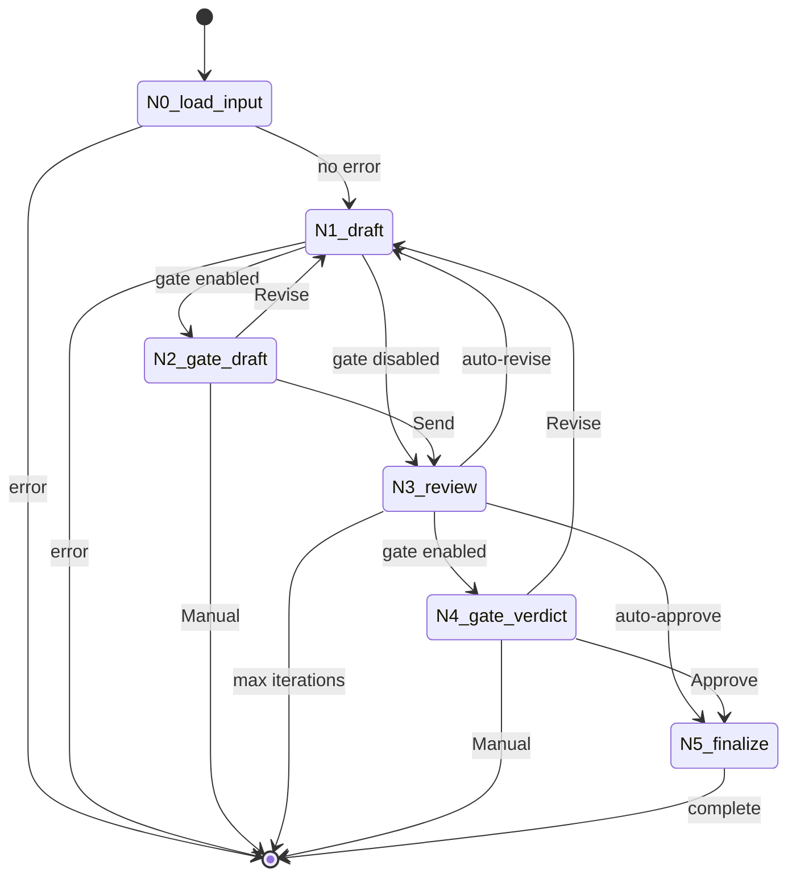
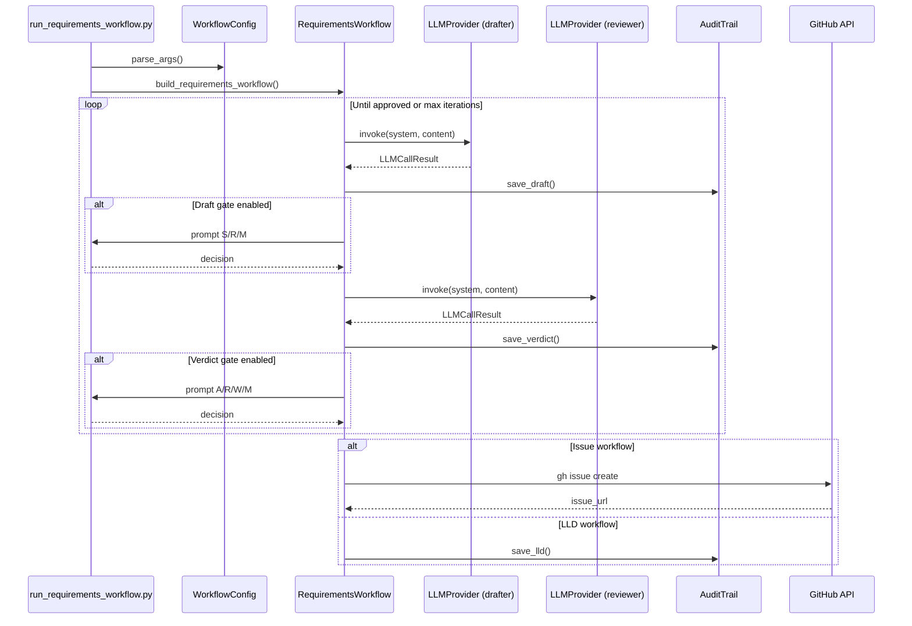

# LLD-101: Unified Requirements Workflow

* **Issue:** #101 (pending)
* **Objective:** Unify Issue and LLD creation workflows with pluggable LLM providers
* **Status:** Draft

---

## 1. Context & Goal

### 1.1 Problem Statement

AgentOS currently has two separate workflow implementations:

1. **`run_issue_workflow.py`** (~3150 lines) - Creates GitHub issues from brief files
   - Uses Claude CLI for drafting
   - Uses Gemini for review
   - Has 7 nodes, 2 human gates
   - **Works correctly**

2. **`run_lld_workflow.py`** (~2360 lines) - Creates LLDs from GitHub issues
   - Uses Gemini for drafting (via `designer.py`)
   - Uses Gemini for review (via `governance.py`)
   - Has 5 nodes, 1 human gate
   - **Broken - Opus 4.5 thrashed and destroyed it**

### 1.2 Core Issues

1. **Code duplication**: ~70% structural similarity between workflows
2. **LLM coupling**: Drafter and reviewer are hardcoded, not pluggable
3. **Inconsistent architecture**: Issue uses custom nodes, LLD delegates to external nodes
4. **No model flexibility**: Can't swap Claude/Gemini or use local models

### 1.3 Goal

Create `run_requirements_workflow.py` that:
- Handles both Issue and LLD creation with a single codebase
- Supports pluggable LLM providers (Claude, Gemini, future: OpenAI, Ollama)
- Preserves `run_issue_workflow.py` (no modifications)
- Fixes the broken LLD workflow behavior

---

## 2. Proposed Solution

### 2.1 Architecture Overview

```
┌─────────────────────────────────────────────────────────────────┐
│                     run_requirements_workflow.py                   │
│  --type issue|lld  --drafter X  --reviewer Y  --gates Z         │
└───────────────────────────────┬─────────────────────────────────┘
                                │
                                ▼
┌─────────────────────────────────────────────────────────────────┐
│                        WorkflowConfig                            │
│  workflow_type, drafter_spec, reviewer_spec, gates, templates   │
└───────────────────────────────┬─────────────────────────────────┘
                                │
        ┌───────────────────────┼───────────────────────┐
        ▼                       ▼                       ▼
┌───────────────┐       ┌───────────────┐       ┌───────────────┐
│ ClaudeProvider│       │GeminiProvider │       │ (Future)      │
│ claude -p CLI │       │ GeminiClient  │       │ OpenAI/Ollama │
└───────────────┘       └───────────────┘       └───────────────┘
                                │
                                ▼
┌─────────────────────────────────────────────────────────────────┐
│                    RequirementsWorkflow Graph                      │
│                                                                  │
│   N0:load_input ─▶ N1:generate_draft ─▶ N2:human_gate_draft     │
│                          ▲                      │                │
│                          │                      ▼                │
│                          │              N3:review                │
│                          │                      │                │
│                          │                      ▼                │
│                          └────────── N4:human_gate_verdict       │
│                                             │                    │
│                                             ▼                    │
│                                      N5:finalize                 │
└─────────────────────────────────────────────────────────────────┘
```

### 2.2 Component Design

#### 2.2.1 LLM Provider Abstraction

**File:** `agentos/core/llm_provider.py`

```python
from abc import ABC, abstractmethod
from dataclasses import dataclass, field
from enum import Enum
from typing import Optional
import time

class LLMErrorType(Enum):
    """Provider-agnostic error classification."""
    QUOTA_EXHAUSTED = "quota"
    CAPACITY_EXHAUSTED = "capacity"
    AUTH_ERROR = "auth"
    TIMEOUT = "timeout"
    PARSE_ERROR = "parse"
    MODEL_MISMATCH = "model"
    UNKNOWN = "unknown"

@dataclass
class LLMCallResult:
    """Unified result from any LLM provider.

    Provides common observability fields for audit logging.
    """
    success: bool
    response: Optional[str] = None
    raw_response: Optional[str] = None
    error_type: Optional[LLMErrorType] = None
    error_message: Optional[str] = None

    # Provider identification
    provider: str = ""           # "claude", "gemini"
    model_requested: str = ""    # What was requested
    model_used: str = ""         # What was actually used

    # Observability (for audit logging)
    credential_used: str = ""    # Which credential/session
    rotation_occurred: bool = False
    attempts: int = 1
    duration_ms: int = 0

    # Extensibility
    metadata: dict = field(default_factory=dict)

class LLMProvider(ABC):
    """Abstract base for LLM providers.

    All providers must implement invoke() with consistent semantics:
    - Returns LLMCallResult with observability data
    - Handles retries internally
    - Credential rotation (where applicable)
    """

    @property
    @abstractmethod
    def provider_name(self) -> str:
        """Return provider identifier (e.g., 'claude', 'gemini')."""
        pass

    @abstractmethod
    def invoke(
        self,
        system_prompt: str,
        content: str,
    ) -> LLMCallResult:
        """
        Invoke the LLM.

        Args:
            system_prompt: System-level instructions
            content: User content/prompt

        Returns:
            LLMCallResult with response and observability data
        """
        pass

class ClaudeCLIProvider(LLMProvider):
    """Claude provider using claude -p (headless mode).

    Uses the user's logged-in Claude Code session.
    Works with Max subscription (no API credits).

    Attributes:
        model: Model specification (e.g., "opus-4.5", "sonnet")
        timeout_seconds: Maximum time for response (default: 300)
    """

    def __init__(self, model: str = "opus-4.5", timeout_seconds: int = 300):
        self.model = model
        self.timeout_seconds = timeout_seconds

    @property
    def provider_name(self) -> str:
        return "claude"

    def invoke(self, system_prompt: str, content: str) -> LLMCallResult:
        """Invoke Claude via CLI subprocess."""
        import subprocess
        import json

        start_time = time.time()

        # Find claude executable
        claude_path = self._find_claude_cli()
        if not claude_path:
            return LLMCallResult(
                success=False,
                error_type=LLMErrorType.AUTH_ERROR,
                error_message="claude CLI not found",
                provider=self.provider_name,
                model_requested=self.model,
            )

        # Build command
        cmd = [
            claude_path,
            "-p",
            "--output-format", "json",
            "--setting-sources", "user",
            "--tools", "",
        ]
        if system_prompt:
            cmd.extend(["--system-prompt", system_prompt])

        try:
            result = subprocess.run(
                cmd,
                input=content,
                capture_output=True,
                text=True,
                encoding="utf-8",
                timeout=self.timeout_seconds,
            )

            duration_ms = int((time.time() - start_time) * 1000)

            if result.returncode != 0:
                return LLMCallResult(
                    success=False,
                    error_type=LLMErrorType.UNKNOWN,
                    error_message=result.stderr or result.stdout,
                    provider=self.provider_name,
                    model_requested=self.model,
                    duration_ms=duration_ms,
                )

            # Parse JSON response
            try:
                data = json.loads(result.stdout)
                response = data.get("result", "")
            except json.JSONDecodeError:
                response = result.stdout.strip()

            return LLMCallResult(
                success=True,
                response=response,
                raw_response=result.stdout,
                provider=self.provider_name,
                model_requested=self.model,
                model_used=self.model,  # Claude CLI doesn't report actual model
                duration_ms=duration_ms,
            )

        except subprocess.TimeoutExpired:
            return LLMCallResult(
                success=False,
                error_type=LLMErrorType.TIMEOUT,
                error_message=f"Timeout after {self.timeout_seconds}s",
                provider=self.provider_name,
                model_requested=self.model,
                duration_ms=self.timeout_seconds * 1000,
            )

    def _find_claude_cli(self) -> Optional[str]:
        """Find claude CLI executable."""
        import shutil
        from pathlib import Path

        # Check PATH
        if path := shutil.which("claude"):
            return path

        # Check common locations
        home = Path.home()
        locations = [
            home / "AppData" / "Roaming" / "npm" / "claude.cmd",
            home / "AppData" / "Roaming" / "npm" / "claude",
            home / ".npm-global" / "bin" / "claude",
            Path("/usr/local/bin/claude"),
            home / ".local" / "bin" / "claude",
        ]

        for loc in locations:
            if loc.exists():
                return str(loc)

        return None

class GeminiProvider(LLMProvider):
    """Gemini provider wrapping existing GeminiClient.

    Inherits credential rotation and error handling from GeminiClient.

    Attributes:
        model: Gemini model (e.g., "2.5-pro", "2.5-flash")
    """

    def __init__(self, model: str = "2.5-pro"):
        self.model = model
        self._client = None

    @property
    def provider_name(self) -> str:
        return "gemini"

    def _get_client(self):
        """Lazy-load GeminiClient."""
        if self._client is None:
            from agentos.core.gemini_client import GeminiClient
            model_name = f"gemini-{self.model}" if not self.model.startswith("gemini-") else self.model
            self._client = GeminiClient(model=model_name)
        return self._client

    def invoke(self, system_prompt: str, content: str) -> LLMCallResult:
        """Invoke Gemini via GeminiClient."""
        client = self._get_client()
        result = client.invoke(
            system_instruction=system_prompt,
            content=content,
        )

        if result.success:
            return LLMCallResult(
                success=True,
                response=result.response,
                raw_response=result.raw_response,
                provider=self.provider_name,
                model_requested=self.model,
                model_used=result.model_verified,
                credential_used=result.credential_used,
                rotation_occurred=result.rotation_occurred,
                attempts=result.attempts,
                duration_ms=result.duration_ms,
            )
        else:
            # Map Gemini error types
            error_type = LLMErrorType.UNKNOWN
            if result.error_type:
                error_map = {
                    "QUOTA_EXHAUSTED": LLMErrorType.QUOTA_EXHAUSTED,
                    "CAPACITY_EXHAUSTED": LLMErrorType.CAPACITY_EXHAUSTED,
                    "AUTH_ERROR": LLMErrorType.AUTH_ERROR,
                    "PARSE_ERROR": LLMErrorType.PARSE_ERROR,
                    "MODEL_MISMATCH": LLMErrorType.MODEL_MISMATCH,
                }
                error_type = error_map.get(result.error_type.name, LLMErrorType.UNKNOWN)

            return LLMCallResult(
                success=False,
                error_type=error_type,
                error_message=result.error_message,
                provider=self.provider_name,
                model_requested=self.model,
                credential_used=result.credential_used,
                rotation_occurred=result.rotation_occurred,
                attempts=result.attempts,
                duration_ms=result.duration_ms,
            )

def get_provider(spec: str) -> LLMProvider:
    """Factory function to create provider from spec string.

    Args:
        spec: Provider specification in format "provider:model"
              Examples: "claude:opus-4.5", "gemini:2.5-pro"

    Returns:
        Configured LLMProvider instance

    Raises:
        ValueError: If provider is unknown
    """
    if ":" not in spec:
        raise ValueError(f"Invalid provider spec '{spec}'. Use 'provider:model' format.")

    provider, model = spec.split(":", 1)

    if provider == "claude":
        return ClaudeCLIProvider(model=model)
    elif provider == "gemini":
        return GeminiProvider(model=model)
    else:
        raise ValueError(f"Unknown provider '{provider}'. Supported: claude, gemini")
```

#### 2.2.2 Workflow Configuration

**File:** `agentos/workflows/requirements/config.py`

```python
from dataclasses import dataclass, field
from pathlib import Path
from typing import Literal, Set

@dataclass
class WorkflowConfig:
    """Configuration for unified governance workflow.

    Attributes:
        workflow_type: "issue" or "lld"
        drafter_spec: LLM for drafting (e.g., "claude:opus-4.5")
        reviewer_spec: LLM for reviewing (e.g., "gemini:2.5-pro")
        gates: Set of enabled human gates ("draft", "verdict")
        max_iterations: Maximum revision cycles
        mock_mode: Use mock implementations (no API calls)
        agentos_root: Path to AgentOS installation (for templates)
        target_repo: Path to target repository (for outputs)
    """
    workflow_type: Literal["issue", "lld"]
    agentos_root: Path  # REQUIRED - where templates live
    target_repo: Path   # REQUIRED - where outputs go
    drafter_spec: str = "claude:opus-4.5"
    reviewer_spec: str = "gemini:2.5-pro"
    gates: Set[str] = field(default_factory=lambda: {"draft", "verdict"})
    max_iterations: int = 20
    mock_mode: bool = False
    context_files: list[str] = field(default_factory=list)

    @property
    def draft_template_path(self) -> Path:
        """Get template path based on workflow type."""
        if self.workflow_type == "issue":
            return Path("docs/templates/0101-issue-template.md")
        else:
            return Path("docs/templates/0102-feature-lld-template.md")

    @property
    def review_prompt_path(self) -> Path:
        """Get review prompt path based on workflow type."""
        if self.workflow_type == "issue":
            return Path("docs/skills/0701c-Issue-Review-Prompt.md")
        else:
            return Path("docs/skills/0702c-LLD-Review-Prompt.md")

    @property
    def has_draft_gate(self) -> bool:
        return "draft" in self.gates

    @property
    def has_verdict_gate(self) -> bool:
        return "verdict" in self.gates

def parse_gates(gates_str: str) -> Set[str]:
    """Parse gates string into set.

    Args:
        gates_str: Comma-separated gates or "none"

    Returns:
        Set of gate names

    Examples:
        "draft,verdict" -> {"draft", "verdict"}
        "draft" -> {"draft"}
        "none" -> set()
    """
    if gates_str.lower() == "none":
        return set()

    gates = {g.strip().lower() for g in gates_str.split(",")}
    valid = {"draft", "verdict"}
    invalid = gates - valid

    if invalid:
        raise ValueError(f"Invalid gates: {invalid}. Valid: draft, verdict, none")

    return gates
```

#### 2.2.3 Unified State

**File:** `agentos/workflows/requirements/state.py`

```python
from enum import Enum
from typing import TypedDict, Literal

class HumanDecision(str, Enum):
    """User choices at human gates."""
    SEND = "S"      # Send to review (draft gate)
    APPROVE = "A"   # Approve and finalize (verdict gate)
    REVISE = "R"    # Revise with feedback
    MANUAL = "M"    # Exit for manual handling

class RequirementsWorkflowState(TypedDict, total=False):
    """Unified state for governance workflows.

    Supports both Issue and LLD workflow types with common fields.
    """
    # Configuration (set at start, immutable)
    workflow_type: Literal["issue", "lld"]
    drafter_spec: str
    reviewer_spec: str
    gates: list[str]  # ["draft", "verdict"] or subset
    max_iterations: int
    mock_mode: bool

    # Path roots (REQUIRED - see Section 8 for cross-repo design)
    agentos_root: str   # Where templates/skills live - NEVER empty
    target_repo: str    # Where outputs go - NEVER empty

    # Input (type-specific)
    brief_file: str       # Issue workflow: path to brief
    issue_number: int     # LLD workflow: GitHub issue number
    context_files: list[str]  # LLD workflow: additional context

    # Derived from input
    slug: str             # Issue: from filename, LLD: "{issue#}-lld"
    input_title: str      # Brief title or issue title
    input_content: str    # Brief content or issue body
    source_idea: str      # Original idea path (for cleanup)

    # Audit trail
    audit_dir: str
    file_counter: int

    # Current artifacts
    current_draft_path: str
    current_draft: str
    current_verdict_path: str
    current_verdict: str
    verdict_history: list[str]  # Cumulative for revision context
    user_feedback: str

    # Tracking
    iteration_count: int
    draft_count: int
    verdict_count: int

    # Output (type-specific)
    issue_url: str        # Issue workflow: GitHub URL
    lld_path: str         # LLD workflow: final LLD path
    output_url: str       # Generic output reference

    # Control flow
    next_node: str
    error_message: str
```

#### 2.2.4 Graph Definition

**File:** `agentos/workflows/requirements/graph.py`

```python
from typing import Literal
from langgraph.graph import END, StateGraph

from .state import RequirementsWorkflowState
from .nodes import (
    load_input,
    generate_draft,
    human_gate_draft,
    review,
    human_gate_verdict,
    finalize,
)

def route_after_load(state: RequirementsWorkflowState) -> Literal["N1_draft", "end"]:
    """Route after input loading."""
    if state.get("error_message"):
        return "end"
    return "N1_draft"

def route_after_draft(state: RequirementsWorkflowState) -> Literal["N2_gate_draft", "N3_review", "end"]:
    """Route after draft generation."""
    if state.get("error_message"):
        return "end"

    # Check if draft gate is enabled
    gates = state.get("gates", ["draft", "verdict"])
    if "draft" in gates:
        return "N2_gate_draft"
    else:
        return "N3_review"

def route_after_draft_gate(state: RequirementsWorkflowState) -> Literal["N3_review", "N1_draft", "end"]:
    """Route based on human decision at draft gate."""
    next_node = state.get("next_node", "")
    error = state.get("error_message", "")

    if error and "MANUAL" in error:
        return "end"

    if next_node == "N3_review":
        return "N3_review"
    elif next_node == "N1_draft":
        return "N1_draft"
    else:
        return "end"

def route_after_review(state: RequirementsWorkflowState) -> Literal["N4_gate_verdict", "N5_finalize", "N1_draft", "end"]:
    """Route after review."""
    if state.get("error_message"):
        return "end"

    # Check iteration limit
    iteration = state.get("iteration_count", 0)
    max_iter = state.get("max_iterations", 20)
    if iteration >= max_iter:
        return "end"

    # Check if verdict gate is enabled
    gates = state.get("gates", ["draft", "verdict"])
    if "verdict" in gates:
        return "N4_gate_verdict"
    else:
        # Auto-route based on verdict
        verdict = state.get("current_verdict", "")
        if "[x] **APPROVED**" in verdict and "[x] **REVISE**" not in verdict:
            return "N5_finalize"
        else:
            return "N1_draft"

def route_after_verdict_gate(state: RequirementsWorkflowState) -> Literal["N5_finalize", "N1_draft", "end"]:
    """Route based on human decision at verdict gate."""
    next_node = state.get("next_node", "")
    error = state.get("error_message", "")

    if error and "MANUAL" in error:
        return "end"

    if next_node == "N5_finalize":
        return "N5_finalize"
    elif next_node == "N1_draft":
        return "N1_draft"
    else:
        return "end"

def build_requirements_workflow() -> StateGraph:
    """Build the unified governance workflow.

    Graph structure:
        N0_load_input
              │
              ▼
        N1_generate_draft ◄──────────────┐
              │                          │
              ▼                          │
        N2_human_gate_draft (optional)   │
              │                          │
              ▼                          │
        N3_review                        │
              │                          │
              ▼                          │
        N4_human_gate_verdict (optional) │
              │                          │
              ├──────────────────────────┘ (revision)
              │
              ▼
        N5_finalize
              │
              ▼
            END
    """
    workflow = StateGraph(RequirementsWorkflowState)

    # Add nodes
    workflow.add_node("N0_load_input", load_input)
    workflow.add_node("N1_draft", generate_draft)
    workflow.add_node("N2_gate_draft", human_gate_draft)
    workflow.add_node("N3_review", review)
    workflow.add_node("N4_gate_verdict", human_gate_verdict)
    workflow.add_node("N5_finalize", finalize)

    # Set entry point
    workflow.set_entry_point("N0_load_input")

    # Add edges
    workflow.add_conditional_edges("N0_load_input", route_after_load, {
        "N1_draft": "N1_draft",
        "end": END,
    })

    workflow.add_conditional_edges("N1_draft", route_after_draft, {
        "N2_gate_draft": "N2_gate_draft",
        "N3_review": "N3_review",
        "end": END,
    })

    workflow.add_conditional_edges("N2_gate_draft", route_after_draft_gate, {
        "N3_review": "N3_review",
        "N1_draft": "N1_draft",
        "end": END,
    })

    workflow.add_conditional_edges("N3_review", route_after_review, {
        "N4_gate_verdict": "N4_gate_verdict",
        "N5_finalize": "N5_finalize",
        "N1_draft": "N1_draft",
        "end": END,
    })

    workflow.add_conditional_edges("N4_gate_verdict", route_after_verdict_gate, {
        "N5_finalize": "N5_finalize",
        "N1_draft": "N1_draft",
        "end": END,
    })

    workflow.add_edge("N5_finalize", END)

    return workflow
```

---

## 3. Node Specifications

### 3.1 N0: load_input

**Purpose:** Load input based on workflow type

**Issue Workflow:**
1. Read brief file from disk
2. Generate slug from filename
3. Check for slug collision
4. Create audit directory
5. Save `001-brief.md`

**LLD Workflow:**
1. Fetch issue via `gh issue view`
2. Generate slug as `{issue#}-lld`
3. Assemble context from `--context` files
4. Create audit directory
5. Save `001-issue.md`

**Outputs:**
- `input_title`, `input_content`
- `slug`, `audit_dir`, `file_counter`
- `error_message` on failure

### 3.2 N1: generate_draft

**Purpose:** Generate draft using configured drafter

**Process:**
1. Get drafter provider from config
2. Load appropriate template
3. Build prompt:
   - Include input content
   - Include template
   - If revision: include cumulative verdict history + user feedback
4. Call drafter.invoke()
5. Save to `NNN-draft.md`
6. Open in VS Code (if not auto mode)

**Revision Mode:**
```python
if verdict_history:
    prompt += "## ALL Review Feedback (CUMULATIVE)\n\n"
    for i, verdict in enumerate(verdict_history, 1):
        prompt += f"### Review #{i}\n\n{verdict}\n\n"

if user_feedback:
    prompt += f"## Additional Human Feedback\n{user_feedback}\n"
```

**Outputs:**
- `current_draft`, `current_draft_path`
- `draft_count` incremented
- `user_feedback` cleared

### 3.3 N2: human_gate_draft

**Purpose:** Human review gate after draft generation

**UX:**
```
>>> Iteration 1 | Draft #1
>>> Opening: docs/lineage/active/my-idea/002-draft.md

[S] Send to review
[R] Revise (enter feedback)
[M] Manual exit

Your choice [S/R/M]:
```

**Behavior:**
- Skipped if `"draft" not in gates`
- Opens VS Code with `--wait`
- Reads edited content from disk
- If R: save feedback to `NNN-feedback.txt`

**Outputs:**
- `current_draft` (re-read from disk)
- `next_node`: "N3_review" | "N1_draft" | "END"
- `user_feedback` if revising

### 3.4 N3: review

**Purpose:** LLM review using configured reviewer

**Process:**
1. Get reviewer provider from config
2. Load appropriate review prompt
3. Call reviewer.invoke()
4. Save to `NNN-verdict.md`
5. Append to `verdict_history`

**Outputs:**
- `current_verdict`, `current_verdict_path`
- `verdict_history` extended
- `verdict_count` incremented

### 3.5 N4: human_gate_verdict

**Purpose:** Human review gate after verdict

**UX (if verdict clean):**
```
>>> VERDICT PASSED
>>> Auto-filing to GitHub...
```

**UX (if verdict has feedback):**
```
>>> VERDICT HAS FEEDBACK

[A] Approve anyway
[R] Revise (re-read verdict, send to drafter)
[W] Write feedback (add comments, send to drafter)
[M] Manual exit

Your choice [A/R/W/M]:
```

**Behavior:**
- Skipped if `"verdict" not in gates`
- Auto-routes if verdict is clean
- Opens VS Code non-blocking for inspection

**Outputs:**
- `next_node`: "N5_finalize" | "N1_draft" | "END"
- `user_feedback` if W selected

### 3.6 N5: finalize

**Purpose:** Finalize based on workflow type

**Issue Workflow:**
1. Parse labels from draft
2. Parse title from draft
3. Ensure labels exist in repo
4. Call `gh issue create`
5. Save `NNN-filed.json`
6. Move to `docs/lineage/done/{issue#}-{slug}/`
7. Move idea to `ideas/done/`
8. Git commit

**LLD Workflow:**
1. Embed review evidence in LLD content
2. Save to `docs/lld/active/LLD-{issue#}.md`
3. Update `lld-status.json`
4. Save `NNN-approved.json`

**Outputs:**
- `issue_url` (Issue) or `lld_path` (LLD)
- `output_url` (generic)

---

## 4. CLI Interface

```bash
python tools/run_requirements_workflow.py [options]

Required:
  --type {issue,lld}        Workflow type

Input (one required):
  --brief PATH              Brief file (for --type issue)
  --issue NUMBER            GitHub issue number (for --type lld)
  --select                  Interactive picker

LLM Configuration:
  --drafter SPEC            Drafter provider:model (default: claude:opus-4.5)
  --reviewer SPEC           Reviewer provider:model (default: gemini:2.5-pro)

Human Gates:
  --gates GATES             draft,verdict | draft | verdict | none
                            (default: draft,verdict)

Behavior:
  --mock                    Use mock implementations (no API calls)
  --resume                  Resume from checkpoint
  --max-iterations N        Maximum revision cycles (default: 20)

Target:
  --repo PATH               Target repository (default: auto-detect)
  --context PATH            Context files (LLD only, repeatable)

Debug & Observability:
  --debug                   Verbose logging, state dumps, timing
  --perf-log                Print performance summary table
  --dry-run                 Simulate execution without API calls or file writes
  --verify-paths            Validate all paths before and after operations
```

---

## 5. File Inventory

| File | Lines | Description |
|------|-------|-------------|
| `agentos/core/llm_provider.py` | ~250 | LLM provider abstraction |
| `agentos/workflows/requirements/__init__.py` | ~10 | Package init |
| `agentos/workflows/requirements/config.py` | ~80 | Workflow configuration |
| `agentos/workflows/requirements/state.py` | ~100 | Unified state |
| `agentos/workflows/requirements/graph.py` | ~150 | Parameterized StateGraph |
| `agentos/workflows/requirements/audit.py` | ~400 | Unified audit utilities |
| `agentos/workflows/requirements/nodes/__init__.py` | ~20 | Node exports |
| `agentos/workflows/requirements/nodes/load_input.py` | ~150 | Input loading |
| `agentos/workflows/requirements/nodes/generate_draft.py` | ~180 | Draft generation |
| `agentos/workflows/requirements/nodes/human_gate.py` | ~200 | Human gates |
| `agentos/workflows/requirements/nodes/review.py` | ~100 | LLM review |
| `agentos/workflows/requirements/nodes/finalize.py` | ~200 | Finalization |
| `tools/run_requirements_workflow.py` | ~400 | CLI runner |
| **Total** | **~2240** | |

---

## 6. Verification Plan

### 6.1 Unit Tests

```bash
# Test LLM provider abstraction
pytest tests/unit/test_llm_provider.py -v

# Test workflow configuration
pytest tests/unit/test_requirements_config.py -v

# Test state transitions
pytest tests/unit/test_requirements_state.py -v
```

### 6.2 Integration Tests (Mock Mode)

```bash
# Issue workflow with mocks
python tools/run_requirements_workflow.py \
    --type issue --brief tests/fixtures/sample-brief.md --mock

# LLD workflow with mocks
python tools/run_requirements_workflow.py \
    --type lld --issue 42 --mock

# Different gate configurations
python tools/run_requirements_workflow.py \
    --type lld --issue 42 --gates draft --mock

python tools/run_requirements_workflow.py \
    --type lld --issue 42 --gates none --mock
```

### 6.3 End-to-End Tests

```bash
# Compare Issue workflow output to existing run_issue_workflow.py
python tools/run_requirements_workflow.py --type issue --select
# Should produce identical results to:
python tools/run_issue_workflow.py --select

# LLD workflow with Claude drafter (the fix)
python tools/run_requirements_workflow.py --type lld --issue 42

# Model swap test
python tools/run_requirements_workflow.py \
    --type lld --issue 42 \
    --drafter gemini:2.5-flash --reviewer claude:sonnet
```

---

## 7. Migration Path

1. **Phase 1:** Implement and test with mock mode
2. **Phase 2:** Test Issue workflow parity with existing `run_issue_workflow.py`
3. **Phase 3:** Test LLD workflow (should now work correctly)
4. **Phase 4:** Optionally deprecate `run_lld_workflow.py`
5. **Future:** Consider deprecating `run_issue_workflow.py` (after extensive testing)

---

## 8. Cross-Repo Path Resolution (CRITICAL)

**Root Cause of Previous LLD Workflow Failures:**

The existing LLD workflow often wrote files to AgentOS instead of the target repository because:

1. **Empty string fallback bug**: State had `repo_root: ""` (empty string), and `repo_root or get_repo_root()` treated it as falsy, falling back to auto-detect which returned AgentOS
2. **Missing parameter**: `assemble_context(context_files)` was called WITHOUT the `repo_root` parameter
3. **No semantic distinction**: No clear separation between "where templates live" vs "where outputs go"

### 8.1 Two Root Concepts

| Root | Purpose | Detection |
|------|---------|-----------|
| `agentos_root` | Where AgentOS is installed (templates, skills, prompts) | Package location or `AGENTOS_ROOT` env var |
| `target_repo` | Where the work happens (outputs, context files, gh commands) | `--repo` flag or auto-detect from cwd |

### 8.2 Path Resolution Rules

| Asset Type | Root | Example Path |
|------------|------|--------------|
| Templates | agentos_root | `docs/templates/0102-feature-lld-template.md` |
| Skills/Prompts | agentos_root | `docs/skills/0701c-Issue-Review-Prompt.md` |
| LLD generator prompt | agentos_root | `docs/skills/0705-lld-generator.md` |
| Ideas/Briefs | target_repo | `ideas/active/my-idea.md` |
| Context files | target_repo | `src/main.py`, `docs/spec.md` |
| Audit trail | target_repo | `docs/lineage/active/{slug}/` |
| LLD output | target_repo | `docs/lld/active/LLD-{issue}.md` |
| lld-status.json | target_repo | `docs/lld/lld-status.json` |
| gh issue commands | target_repo | `cwd=target_repo` |

### 8.3 Implementation Requirements

**State must have BOTH roots (never empty):**

```python
class RequirementsWorkflowState(TypedDict, total=False):
    agentos_root: str    # Always set, for templates - NEVER empty
    target_repo: str     # Always set, for outputs - NEVER empty
    # ... other fields
```

**CLI detects both roots at startup:**

```python
def resolve_roots(args) -> tuple[Path, Path]:
    """Resolve agentos_root and target_repo at CLI startup.

    Returns:
        (agentos_root, target_repo) - both guaranteed valid Paths
    """
    # agentos_root: from env var or package location
    env_root = os.environ.get("AGENTOS_ROOT")
    if env_root:
        agentos_root = Path(env_root)
    else:
        # Derive from this file's location: tools/ -> parent is AgentOS root
        agentos_root = Path(__file__).parent.parent.resolve()

    # Validate agentos_root has expected structure
    if not (agentos_root / "docs" / "templates").exists():
        raise RuntimeError(f"Invalid agentos_root: {agentos_root} missing docs/templates/")

    # target_repo: from --repo flag or git auto-detect
    if args.repo:
        target_repo = Path(args.repo).resolve()
        if not (target_repo / ".git").exists():
            raise ValueError(f"Not a git repository: {target_repo}")
    else:
        result = subprocess.run(
            ["git", "rev-parse", "--show-toplevel"],
            capture_output=True, text=True, timeout=10
        )
        if result.returncode != 0:
            raise RuntimeError(f"Not in a git repository: {result.stderr}")
        target_repo = Path(result.stdout.strip())

    return agentos_root, target_repo
```

**Never use empty string for paths:**

```python
# WRONG - empty string is falsy, triggers dangerous fallback:
repo_root = state.get("repo_root", "")
if repo_root:  # Empty string is falsy!
    root = Path(repo_root)
else:
    root = get_repo_root()  # Falls back to AgentOS!

# RIGHT - paths are always set, no fallback:
target_repo = Path(state["target_repo"])  # KeyError if missing = bug
agentos_root = Path(state["agentos_root"])  # Always available
```

**All functions receive explicit paths (no auto-detect fallback):**

```python
# WRONG - hidden fallback can use wrong repo:
def save_lld(content, repo_root=None):
    root = repo_root or get_repo_root()  # Dangerous!

# RIGHT - explicit path required, no fallback:
def save_lld(content: str, target_repo: Path) -> Path:
    """Save LLD to target repository.

    Args:
        content: LLD content
        target_repo: Path to target repository (required)

    Returns:
        Path to saved LLD file
    """
    lld_dir = target_repo / "docs" / "lld" / "active"
    # ...
```

**Template loading uses agentos_root explicitly:**

```python
def load_template(template_name: str, agentos_root: Path) -> str:
    """Load template from AgentOS.

    Args:
        template_name: e.g., "0102-feature-lld-template.md"
        agentos_root: Path to AgentOS installation

    Returns:
        Template content
    """
    path = agentos_root / "docs" / "templates" / template_name
    if not path.exists():
        raise FileNotFoundError(f"Template not found: {path}")
    return path.read_text(encoding="utf-8")
```

---

## 9. Risks & Mitigations

| Risk | Mitigation |
|------|------------|
| Breaking existing Issue workflow | `run_issue_workflow.py` is preserved, untouched |
| Claude CLI not available | Graceful error with installation instructions |
| Gemini quota exhaustion | Existing credential rotation in GeminiClient |
| Model mismatch | Validate model spec at startup |
| Graph infinite loop | Max iterations with user extension option |
| **Cross-repo file writes** | **Explicit dual-root design (agentos_root + target_repo)** |
| **Path auto-detect fallback** | **No fallbacks - paths always explicit, KeyError if missing** |

---

## 10. Test-Driven Development (TDD) - MANDATORY

### 10.1 Process

1. Write test file FIRST (tests will fail - this is expected)
2. Run test to confirm it fails (red)
3. Implement the function
4. Run test to confirm it passes (green)
5. Refactor if needed
6. Move to next function

### 10.2 Test Coverage Requirement: 90% MINIMUM - NO OVERRIDE

```bash
# Coverage check - MUST pass before implementation is considered done
pytest tests/ --cov=agentos/workflows/governance --cov=agentos/core/llm_provider \
    --cov-report=term-missing --cov-fail-under=90

# If coverage < 90%, implementation is NOT complete
```

### 10.3 Test Structure

```
tests/
├── unit/
│   ├── test_llm_provider.py           # LLM provider abstraction
│   ├── test_requirements_config.py      # Workflow configuration
│   ├── test_requirements_state.py       # State validation
│   ├── test_requirements_audit.py       # Audit trail functions
│   └── test_path_resolution.py        # Cross-repo path logic
├── integration/
│   ├── test_graph_transitions.py      # All graph edge transitions
│   ├── test_option_combinations.py    # All CLI flag combinations
│   ├── test_resume_points.py          # Stop/resume at each node
│   └── test_file_placement.py         # Verify file locations
└── e2e/
    ├── test_issue_workflow_e2e.py     # Full issue workflow
    ├── test_lld_workflow_e2e.py       # Full LLD workflow
    └── test_cross_repo_e2e.py         # Cross-repo scenarios
```

---

## 11. Debug & Observability Modes

### 11.1 Debug Mode (`--debug`)

```bash
python tools/run_requirements_workflow.py --type lld --issue 42 --debug
```

**Behavior:**
- Verbose logging of every function call
- Print state before/after each node
- Print all file paths being accessed
- Print all LLM prompts and responses (truncated)
- Print timing for each operation
- Pause between nodes for inspection

**Implementation:**
```python
import logging

def setup_debug_logging(debug: bool) -> None:
    level = logging.DEBUG if debug else logging.INFO
    logging.basicConfig(
        level=level,
        format="%(asctime)s [%(levelname)s] %(name)s: %(message)s",
        datefmt="%Y-%m-%d %H:%M:%S",
    )

# In each node:
logger = logging.getLogger(__name__)
logger.debug(f"Entering node {node_name} with state: {state}")
```

### 11.2 Performance Logging (`--perf-log`)

```bash
python tools/run_requirements_workflow.py --type lld --issue 42 --perf-log
```

**Output:**
```
┌────────────────────────────────────────────────────────────────┐
│ Performance Log                                                 │
├───────────────┬──────────┬──────────────────────────────────────┤
│ Operation     │ Duration │ Details                              │
├───────────────┼──────────┼──────────────────────────────────────┤
│ N0_load_input │ 1.2s     │ gh issue view #42                    │
│ N1_draft      │ 45.3s    │ claude:opus-4.5, 2847 tokens         │
│ N2_gate_draft │ 0.0s     │ skipped (auto mode)                  │
│ N3_review     │ 12.7s    │ gemini:2.5-pro, attempt 1            │
│ N5_finalize   │ 0.8s     │ wrote docs/lld/active/LLD-042.md     │
├───────────────┼──────────┼──────────────────────────────────────┤
│ TOTAL         │ 60.0s    │                                      │
└───────────────┴──────────┴──────────────────────────────────────┘
```

### 11.3 Dry Run Mode (`--dry-run`)

```bash
python tools/run_requirements_workflow.py --type lld --issue 42 --dry-run
```

**Behavior:**
- Fetches real data (issue content, context files)
- Does NOT call LLM APIs
- Does NOT write files to disk
- Prints what WOULD happen at each step
- Validates all paths before execution

**Output:**
```
DRY RUN: Simulating workflow execution
----------------------------------------
[N0] Would fetch issue #42 from target_repo
     Title: "Add user authentication"
     Context files: ['src/auth.py', 'docs/security.md']

[N1] Would call drafter: claude:opus-4.5
     Template: docs/templates/0102-feature-lld-template.md
     Would write: target_repo/docs/lld/active/LLD-042.md

[N2] Would pause for human gate (draft)

[N3] Would call reviewer: gemini:2.5-pro
     Prompt: docs/skills/0702c-LLD-Review-Prompt.md

[N5] Would save final LLD to:
     Path: target_repo/docs/lld/active/LLD-042.md
     Would update: target_repo/docs/lld/lld-status.json

DRY RUN COMPLETE - No files modified, no API calls made
```

### 11.4 Path Verification (`--verify-paths`)

```bash
python tools/run_requirements_workflow.py --type lld --issue 42 --verify-paths
```

**Behavior:**
- Before any action, verify all paths are correct
- After any write, verify file exists in expected location
- Print path resolution decisions

**Output:**
```
PATH VERIFICATION
=================
agentos_root:  /c/Users/mcwiz/Projects/AgentOS  [EXISTS]
target_repo:   /c/Users/mcwiz/Projects/dispatch  [EXISTS]

Templates (from agentos_root):
  ✓ docs/templates/0102-feature-lld-template.md
  ✓ docs/skills/0702c-LLD-Review-Prompt.md

Outputs (to target_repo):
  → docs/lld/active/LLD-042.md (will create)
  → docs/lineage/active/42-lld/001-issue.md (will create)
  → docs/lld/lld-status.json (will update)
```

---

## 12. Test Scenarios (ALL MUST PASS)

### 12.1 CLI Option Combinations

| # | Type | Input | Drafter | Reviewer | Gates | Mock | Resume | Expected |
|---|------|-------|---------|----------|-------|------|--------|----------|
| 1 | issue | --brief | claude:opus | gemini:2.5-pro | draft,verdict | N | N | Success |
| 2 | issue | --select | claude:opus | gemini:2.5-pro | draft | N | N | Success |
| 3 | lld | --issue 42 | claude:opus | gemini:2.5-pro | none | N | N | Success |
| 4 | lld | --select | gemini:flash | claude:sonnet | verdict | N | N | Success |
| 5 | lld | --issue 42 | claude:opus | gemini:2.5-pro | draft,verdict | Y | N | Mock pass |
| 6 | lld | --issue 42 | claude:opus | gemini:2.5-pro | draft | N | Y | Resume OK |

### 12.2 Graph Transition Tests

Every edge in the graph must be tested:
- N0 → N1 (success)
- N0 → END (error)
- N1 → N2 (gate enabled)
- N1 → N3 (gate disabled)
- N2 → N3 (send)
- N2 → N1 (revise)
- N2 → END (manual)
- N3 → N4 (gate enabled)
- N3 → N5 (auto-approve)
- N3 → N1 (auto-revise)
- N4 → N5 (approve)
- N4 → N1 (revise)
- N4 → END (manual)
- N5 → END (complete)

### 12.3 Resume Point Tests

For each node, test:
1. Run workflow until node completes
2. Simulate interruption (Ctrl+C)
3. Resume with `--resume`
4. Verify state preserved correctly
5. Verify workflow continues from correct point

### 12.4 Exit Verification Tests

Every exit path must be intentional:
- `error_message: "..."` → exits with error logged
- User chooses `M` (Manual) → exits cleanly with message
- Max iterations reached → prompts for extension or save
- Keyboard interrupt → saves checkpoint, exits 130
- Success → exits 0 with output path

**Test assertion:** No silent exits (exit without logging)

### 12.5 File Placement Tests

```python
def test_lld_saved_to_target_repo(cross_repo_fixture):
    """Verify LLD is saved to target repo, not AgentOS."""
    agentos_root, target_repo = cross_repo_fixture

    # Run workflow
    result = run_governance_workflow(
        type="lld",
        issue=42,
        target_repo=target_repo,
        agentos_root=agentos_root,
    )

    # Verify file location
    assert (target_repo / "docs/lld/active/LLD-042.md").exists()
    assert not (agentos_root / "docs/lld/active/LLD-042.md").exists()
```

---

## 13. End-to-End Validation (REQUIRED BEFORE DONE)

**Cannot mark implementation complete until:**

### 13.1 Issue Workflow E2E

```bash
# Must run successfully with real API calls
python tools/run_requirements_workflow.py --type issue --select
# Expected: Creates real GitHub issue, audit trail in target repo
```

### 13.2 LLD Workflow E2E

```bash
# Must run successfully with real API calls
python tools/run_requirements_workflow.py --type lld --issue {real_issue_number}
# Expected: Creates LLD in target repo, updates lld-status.json
```

### 13.3 Cross-Repo E2E

```bash
# Run from AgentOS, target different repo
cd /c/Users/mcwiz/Projects/AgentOS
python tools/run_requirements_workflow.py --type lld --issue 42 \
    --repo /c/Users/mcwiz/Projects/dispatch
# Expected: LLD saved to dispatch, not AgentOS
```

---

## 14. Gemini Credential Rotation

**Existing implementation:** `agentos/core/gemini_client.py`

The `GeminiProvider` in the LLM abstraction wraps `GeminiClient`, inheriting:
- Automatic credential rotation on 429 (quota exhausted)
- Exponential backoff on 529 (capacity exhausted)
- Auth error detection (invalid keys skipped)
- Model verification (fail if wrong model used)

**Integration in governance workflow:**
```python
class GeminiProvider(LLMProvider):
    def invoke(self, system_prompt: str, content: str) -> LLMCallResult:
        client = self._get_client()  # Uses GeminiClient with rotation
        result = client.invoke(system_instruction=system_prompt, content=content)

        # Result includes rotation observability
        return LLMCallResult(
            success=result.success,
            response=result.response,
            credential_used=result.credential_used,      # Which key was used
            rotation_occurred=result.rotation_occurred,  # Did we rotate?
            attempts=result.attempts,                    # How many tries?
            # ...
        )
```

---

## Appendix A: Mermaid Diagrams

### State Machine



### Component Interaction



---

**Final Status:** PENDING (awaiting review)
