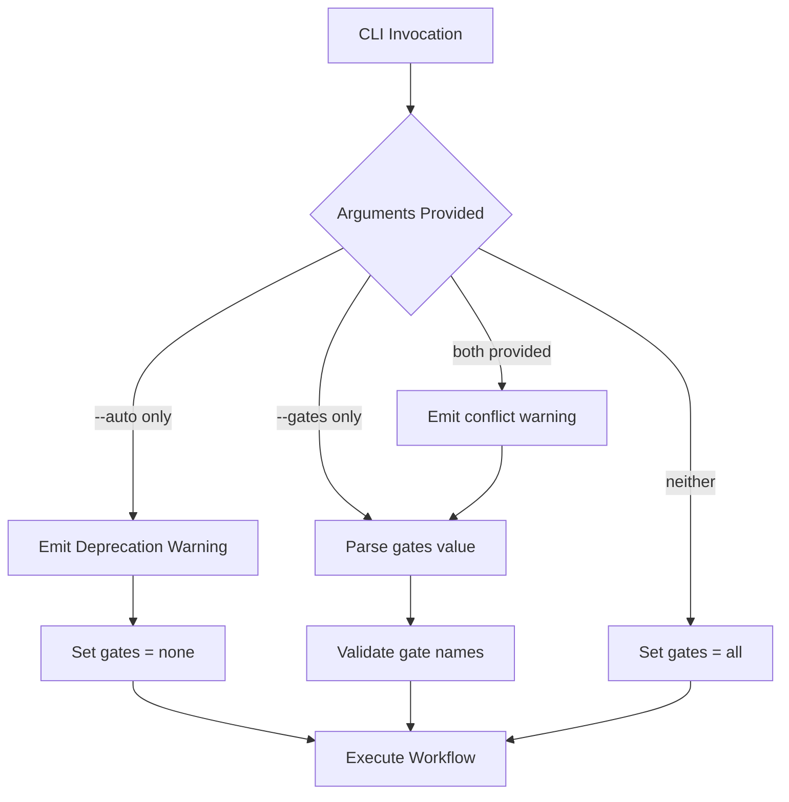

# 1122 - Fix: Reconcile --auto vs --gates none Syntax Across Workflows

<!-- Template Metadata
Last Updated: 2025-01-XX
Updated By: Issue #122 implementation
Update Reason: Initial LLD creation
Previous: N/A
-->

## 1. Context & Goal
* **Issue:** #122
* **Objective:** Standardize CLI syntax for skipping gates across all workflow tools to eliminate confusion and ensure consistent user experience.
* **Status:** Draft
* **Related Issues:** None

### Open Questions
*Questions that need clarification before or during implementation. Remove when resolved.*

- [x] Which syntax should be the standard? → `--gates` with deprecation of `--auto`
- [x] Should backwards compatibility be maintained? → Yes, with deprecation warnings

## 2. Proposed Changes

*This section is the **source of truth** for implementation. Describe exactly what will be built.*

### 2.1 Files Changed

| File | Change Type | Description |
|------|-------------|-------------|
| `tools/run_requirements_workflow.py` | Modify | Already uses `--gates`, add `--auto` as deprecated alias |
| `tools/run_implement_from_lld.py` | Modify | Add `--gates` argument, deprecate `--auto` |
| `docs/runbooks/0907-unified-requirements-workflow.md` | Modify | Update CLI examples to show `--gates` as primary |
| `docs/runbooks/0909-tdd-implementation-workflow.md` | Modify | Update CLI examples to use `--gates none` |

### 2.2 Dependencies

*New packages, APIs, or services required.*

```toml
# pyproject.toml additions (if any)
# No new dependencies required - uses standard library warnings module
```

### 2.3 Data Structures

```python
# Pseudocode - NOT implementation
from typing import Literal

GateOption = Literal["none", "review", "human", "all"]
```

### 2.4 Function Signatures

```python
# Signatures only - implementation in source files

def parse_gates_argument(gates: str | None, auto: bool) -> set[str]:
    """
    Parse --gates argument and handle --auto backwards compatibility.
    
    Args:
        gates: Value of --gates argument (e.g., "none", "review,human")
        auto: Value of deprecated --auto flag
        
    Returns:
        Set of gate names to skip
    """
    ...

def emit_deprecation_warning(old_syntax: str, new_syntax: str) -> None:
    """Emit a deprecation warning for CLI syntax changes."""
    ...
```

### 2.5 Logic Flow (Pseudocode)

```
1. Parse CLI arguments (both --gates and --auto)
2. IF --auto is provided THEN
   - Emit deprecation warning: "--auto is deprecated, use --gates none"
   - Set gates_to_skip = {"all"}
3. IF --gates is provided THEN
   - Parse comma-separated values
   - Validate each gate name
   - Set gates_to_skip = parsed_gates
4. IF both --auto and --gates are provided THEN
   - Emit warning: "Both --auto and --gates provided, using --gates"
   - Use --gates value only
5. Return gates_to_skip for workflow execution
```

### 2.6 Technical Approach

* **Module:** `tools/` CLI scripts
* **Pattern:** Backwards-compatible deprecation with warning
* **Key Decisions:** 
  - Use `--gates` as the canonical syntax (more expressive, allows granular control)
  - Support `--auto` as alias for `--gates none` with deprecation warning
  - Use Python's `warnings` module for deprecation notices

### 2.7 Architecture Decisions

| Decision | Options Considered | Choice | Rationale |
|----------|-------------------|--------|-----------|
| Standard syntax | `--auto`, `--gates`, both | `--gates` with `--auto` deprecated | `--gates` is more expressive and allows granular control |
| Backwards compatibility | Break immediately, deprecation period | Deprecation period | Avoid breaking existing scripts and user workflows |
| Deprecation mechanism | Silent removal, warning, error | Warning | Gives users time to migrate without breaking their workflows |

**Architectural Constraints:**
- Must maintain backwards compatibility for at least one release cycle
- Must produce clear, actionable deprecation messages

## 3. Requirements

*What must be true when this is done. These become acceptance criteria.*

1. All workflow CLIs support `--gates {none|review|human|all}` syntax
2. `--auto` flag produces deprecation warning and behaves as `--gates none`
3. Runbooks document `--gates` as the primary syntax
4. Both workflows behave identically when given equivalent arguments
5. Clear error messages for invalid gate names

## 4. Alternatives Considered

| Option | Pros | Cons | Decision |
|--------|------|------|----------|
| Option A: `--gates` everywhere | Expressive, allows granular control | Requires deprecation of `--auto` | **Selected** |
| Option B: `--auto` everywhere | Simpler, boolean flag | Less flexible, can't skip specific gates | Rejected |
| Option C: Support both permanently | No deprecation needed | Maintains inconsistency, confuses users | Rejected |

**Rationale:** `--gates` provides more flexibility for future use cases (skipping only review gate, only human gate, etc.) while `--auto` is a simple boolean. The `--gates` syntax is already in use in the requirements workflow, making it the natural choice for standardization.

## 5. Data & Fixtures

*Per [0108-lld-pre-implementation-review.md](0108-lld-pre-implementation-review.md) - complete this section BEFORE implementation.*

### 5.1 Data Sources

| Attribute | Value |
|-----------|-------|
| Source | CLI arguments (user input) |
| Format | String flags and values |
| Size | N/A - CLI arguments |
| Refresh | N/A - per-invocation |
| Copyright/License | N/A |

### 5.2 Data Pipeline

```
CLI Args ──argparse──► Argument Parser ──validation──► Workflow Executor
```

### 5.3 Test Fixtures

| Fixture | Source | Notes |
|---------|--------|-------|
| Mock CLI invocations | Generated | Test various argument combinations |

### 5.4 Deployment Pipeline

N/A - CLI tools run locally, no deployment pipeline required.

## 6. Diagram

### 6.1 Mermaid Quality Gate

Before finalizing any diagram, verify in [Mermaid Live Editor](https://mermaid.live) or GitHub preview:

- [x] **Simplicity:** Similar components collapsed (per 0006 §8.1)
- [x] **No touching:** All elements have visual separation (per 0006 §8.2)
- [x] **No hidden lines:** All arrows fully visible (per 0006 §8.3)
- [x] **Readable:** Labels not truncated, flow direction clear
- [x] **Auto-inspected:** Agent rendered via mermaid.ink and viewed (per 0006 §8.5)

**Auto-Inspection Results:**
```
- Touching elements: [x] None
- Hidden lines: [x] None
- Label readability: [x] Pass
- Flow clarity: [x] Clear
```

*Reference: [0006-mermaid-diagrams.md](0006-mermaid-diagrams.md)*

### 6.2 Diagram



## 7. Security & Safety Considerations

### 7.1 Security

| Concern | Mitigation | Status |
|---------|------------|--------|
| Command injection via gate names | Validate against allowed list | Addressed |

### 7.2 Safety

| Concern | Mitigation | Status |
|---------|------------|--------|
| Silent behavior change | Deprecation warnings ensure users are aware | Addressed |
| Breaking existing scripts | Backwards compatibility maintained | Addressed |

**Fail Mode:** Fail Closed - Invalid gate names raise error, workflow does not proceed

**Recovery Strategy:** User corrects CLI arguments and re-runs

## 8. Performance & Cost Considerations

### 8.1 Performance

| Metric | Budget | Approach |
|--------|--------|----------|
| Latency | N/A - argument parsing | Negligible overhead |
| Memory | N/A | No additional memory |
| API Calls | N/A | No API calls |

**Bottlenecks:** None - this is simple argument parsing

### 8.2 Cost Analysis

| Resource | Unit Cost | Estimated Usage | Monthly Cost |
|----------|-----------|-----------------|--------------|
| N/A | N/A | N/A | $0 |

**Cost Controls:** N/A - no external resources used

**Worst-Case Scenario:** N/A - local CLI tool

## 9. Legal & Compliance

| Concern | Applies? | Mitigation |
|---------|----------|------------|
| PII/Personal Data | No | N/A |
| Third-Party Licenses | No | N/A |
| Terms of Service | No | N/A |
| Data Retention | No | N/A |
| Export Controls | No | N/A |

**Data Classification:** N/A - CLI arguments only

**Compliance Checklist:**
- [x] No PII stored without consent
- [x] All third-party licenses compatible with project license
- [x] External API usage compliant with provider ToS
- [x] Data retention policy documented

## 10. Verification & Testing

*Ref: [0005-testing-strategy-and-protocols.md](0005-testing-strategy-and-protocols.md)*

**Testing Philosophy:** All scenarios can be automated via CLI argument testing.

### 10.1 Test Scenarios

| ID | Scenario | Type | Input | Expected Output | Pass Criteria |
|----|----------|------|-------|-----------------|---------------|
| 010 | --gates none skips all gates | Auto | `--gates none` | gates_to_skip = {"all"} | Set contains "all" |
| 020 | --gates review skips review only | Auto | `--gates review` | gates_to_skip = {"review"} | Set contains only "review" |
| 030 | --gates human skips human only | Auto | `--gates human` | gates_to_skip = {"human"} | Set contains only "human" |
| 040 | --auto emits deprecation warning | Auto | `--auto` | DeprecationWarning emitted | Warning captured in stderr |
| 050 | --auto behaves as --gates none | Auto | `--auto` | gates_to_skip = {"all"} | Set contains "all" |
| 060 | Both flags uses --gates, warns | Auto | `--auto --gates review` | Warning + gates_to_skip = {"review"} | Warning emitted, review in set |
| 070 | Invalid gate name raises error | Auto | `--gates invalid` | ValueError raised | Exception with helpful message |
| 080 | Multiple gates comma-separated | Auto | `--gates review,human` | gates_to_skip = {"review", "human"} | Set contains both |
| 090 | No flags uses default (all gates) | Auto | (no flags) | gates_to_skip = {} | Empty set (no gates skipped) |

### 10.2 Test Commands

```bash
# Run all automated tests for CLI argument handling
poetry run pytest tests/tools/test_cli_gates.py -v

# Run tests for specific workflow
poetry run pytest tests/tools/test_run_requirements_workflow.py -v
poetry run pytest tests/tools/test_run_implement_from_lld.py -v
```

### 10.3 Manual Tests (Only If Unavoidable)

N/A - All scenarios automated.

## 11. Risks & Mitigations

| Risk | Impact | Likelihood | Mitigation |
|------|--------|------------|------------|
| Users ignore deprecation warnings | Med | Med | Clear warning message with migration instructions |
| Existing scripts break | High | Low | Backwards compatibility maintained |
| Runbook examples become stale | Low | Low | Update runbooks as part of this PR |

## 12. Definition of Done

### Code
- [ ] Implementation complete and linted
- [ ] Code comments reference this LLD (Issue #122)

### Tests
- [ ] All test scenarios pass
- [ ] Test coverage meets threshold

### Documentation
- [ ] LLD updated with any deviations
- [ ] Implementation Report (0103) completed
- [ ] Runbooks 0907 and 0909 updated

### Review
- [ ] Code review completed
- [ ] User approval before closing issue

---

## Appendix: Review Log

*Track all review feedback with timestamps and implementation status.*

### Review Summary

| Review | Date | Verdict | Key Issue |
|--------|------|---------|-----------|
| (pending) | - | - | - |

**Final Status:** APPROVED
<!-- Note: This field is auto-updated to APPROVED by the workflow when finalized -->