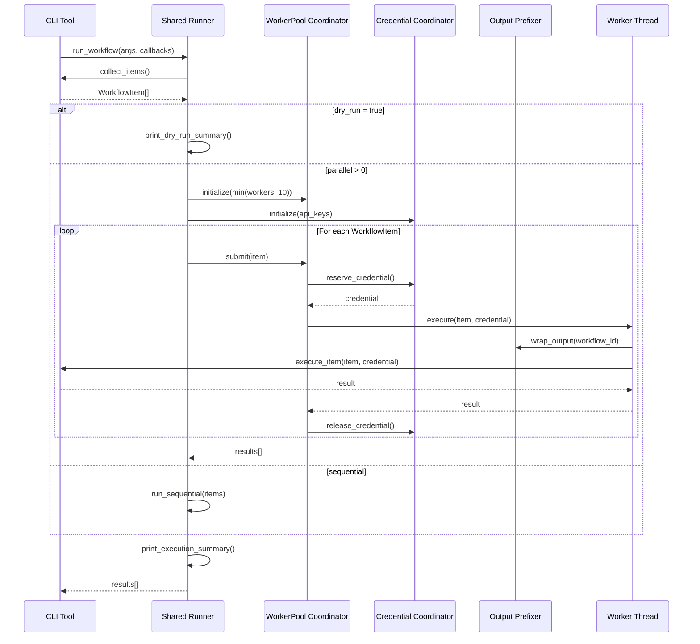

# 137 - Feature: Integrate parallel execution module into workflow CLI tools

<!-- Template Metadata
Last Updated: 2026-02-02
Updated By: Issue #117 fix
Update Reason: Moved Verification & Testing to Section 10 (was Section 11) to match 0702c review prompt and testing workflow expectations
Previous: Added sections based on 80 blocking issues from 164 governance verdicts (2026-02-01)
-->

## 1. Context & Goal
* **Issue:** #137
* **Objective:** Integrate the parallel execution infrastructure from #106 into the workflow CLI tools to enable concurrent processing of multiple issues
* **Status:** Approved (gemini-3-pro-preview, 2026-02-04)
* **Related Issues:** #106 (completed - parallel execution infrastructure)

### Open Questions
*All questions resolved during review.*

~~- [x] What is the default parallelism level if `--parallel` flag is provided without a number?~~
**RESOLVED:** The tool requires an integer value (e.g., `argparse` type=int) or raises an ArgumentError, consistent with Test Scenario 020.

~~- [x] Should there be a maximum limit on parallel workers to prevent resource exhaustion?~~
**RESOLVED:** Yes. A hard cap of 10 workers is enforced in the `WorkerPool` initialization to prevent system resource exhaustion.

## 2. Proposed Changes

*This section is the **source of truth** for implementation. Describe exactly what will be built.*

### 2.1 Files Changed

| File | Change Type | Description |
|------|-------------|-------------|
| `assemblyzero/workflows/runner.py` | Add | **Shared runner module** with CLI parsing and parallel orchestration logic |
| `tools/run_requirements_workflow.py` | Modify | Delegate to shared runner, provide item collection and execution callbacks |
| `tools/run_implement_from_lld.py` | Modify | Delegate to shared runner, provide item collection and execution callbacks |
| `assemblyzero/workflows/parallel/__init__.py` | Modify | Export public API for easy import |
| `tests/unit/test_workflow_runner.py` | Add | Unit tests for shared runner module |
| `tests/unit/test_workflow_cli_parallel.py` | Add | Unit tests for CLI argument parsing (parameterized for both entry points) |
| `tests/integration/test_workflow_parallel_integration.py` | Add | Integration tests with dry-run mode |

### 2.2 Dependencies

*New packages, APIs, or services required.*

```toml
# pyproject.toml additions (if any)
# No new dependencies - uses existing parallel module from #106
```

### 2.3 Data Structures

```python
# Pseudocode - NOT implementation
class ParallelWorkflowConfig(TypedDict):
    parallel_workers: int  # Number of concurrent workers (0 = sequential, max 10)
    dry_run: bool  # If True, list items without executing
    credential_pool: list[str]  # Available API keys for rotation

class WorkflowItem(TypedDict):
    item_id: str  # Unique identifier for the workflow item
    issue_number: int  # GitHub issue number
    status: str  # pending | running | completed | failed
    output_path: Path  # Where results are written

class WorkflowCallbacks(TypedDict):
    collect_items: Callable[[], list[WorkflowItem]]  # Gathers pending items
    execute_item: Callable[[WorkflowItem, str], WorkflowResult]  # Executes single item
```

### 2.4 Function Signatures

```python
# Signatures only - implementation in source files

# assemblyzero/workflows/runner.py (NEW - shared module)
MAX_PARALLEL_WORKERS: int = 10  # Hard cap to prevent resource exhaustion

def create_argument_parser(description: str) -> argparse.ArgumentParser:
    """Create standard argument parser with --parallel and --dry-run flags."""
    ...

def run_workflow(
    args: argparse.Namespace,
    collect_items: Callable[[], list[WorkflowItem]],
    execute_item: Callable[[WorkflowItem, str], WorkflowResult],
    workflow_name: str
) -> list[WorkflowResult]:
    """Execute workflow with parallel or sequential mode based on args.
    
    This is the main orchestration entry point that handles:
    - Dry-run mode (print summary, no execution)
    - Parallel mode (coordinate workers, credentials, output prefixing)
    - Sequential mode (original behavior)
    - Graceful shutdown on SIGINT
    """
    ...

def run_parallel(
    items: list[WorkflowItem],
    workers: int,
    execute_item: Callable[[WorkflowItem, str], WorkflowResult],
    workflow_name: str
) -> list[WorkflowResult]:
    """Execute items in parallel using the coordinator.
    
    Enforces MAX_PARALLEL_WORKERS cap.
    """
    ...

def run_sequential(
    items: list[WorkflowItem],
    execute_item: Callable[[WorkflowItem, str], WorkflowResult]
) -> list[WorkflowResult]:
    """Execute items sequentially (original behavior)."""
    ...

def print_dry_run_summary(items: list[WorkflowItem], workflow_name: str) -> None:
    """Print pending items in table format without executing."""
    ...

def print_execution_summary(results: list[WorkflowResult], duration: float) -> None:
    """Print completion summary with success/failure counts and timing."""
    ...


# tools/run_requirements_workflow.py (SIMPLIFIED)
def collect_pending_items() -> list[WorkflowItem]:
    """Gather all issues that need LLD generation."""
    ...

def execute_workflow_item(item: WorkflowItem, credential: str) -> WorkflowResult:
    """Execute a single workflow item with assigned credential."""
    ...

def main() -> None:
    """Entry point - delegates to shared runner."""
    ...


# tools/run_implement_from_lld.py (SIMPLIFIED)
def collect_pending_llds() -> list[WorkflowItem]:
    """Gather all LLDs that need implementation."""
    ...

def execute_implementation(item: WorkflowItem, credential: str) -> WorkflowResult:
    """Execute implementation for a single LLD."""
    ...

def main() -> None:
    """Entry point - delegates to shared runner."""
    ...
```

### 2.5 Logic Flow (Pseudocode)

```
# Shared runner module (assemblyzero/workflows/runner.py)

1. run_workflow(args, collect_items, execute_item, workflow_name):
   
   2. items = collect_items()
   
   3. IF items is empty THEN
      - Print "Nothing to process"
      - Return empty list
      END IF

   4. IF args.dry_run THEN
      - print_dry_run_summary(items, workflow_name)
      - Return empty list (no execution)
      END IF

   5. IF args.parallel > 0 THEN
      - workers = min(args.parallel, MAX_PARALLEL_WORKERS)
      - IF workers != args.parallel THEN
        - Log warning about cap
      - results = run_parallel(items, workers, execute_item, workflow_name)
      ELSE
      - results = run_sequential(items, execute_item)
      END IF

   6. print_execution_summary(results, duration)
   7. Return results


# run_parallel implementation:

1. Initialize CredentialCoordinator with API keys from environment
2. Initialize WorkerPool with min(workers, MAX_PARALLEL_WORKERS)
3. Register SIGINT handler for graceful shutdown

4. FOR each item in items:
   - Submit to coordinator with execute_item callback
   - Coordinator handles:
     - Reserve credential from pool
     - Wrap output with OutputPrefixer(item.item_id)
     - Execute in worker thread
     - Release credential on completion

5. Wait for all items to complete (or shutdown signal)
6. Return collected results


# CLI tool (e.g., run_requirements_workflow.py):

1. parser = runner.create_argument_parser("Generate LLDs for issues")
2. args = parser.parse_args()
3. results = runner.run_workflow(
     args,
     collect_items=collect_pending_items,
     execute_item=execute_workflow_item,
     workflow_name="requirements"
   )
4. sys.exit(0 if all successful else 1)
```

### 2.6 Technical Approach

* **Module:** `assemblyzero/workflows/runner.py` (new shared module)
* **Pattern:** Strategy pattern for execution mode (parallel vs sequential), Dependency Injection for callbacks
* **Key Decisions:** 
  - Extract common logic to shared runner module (DRY principle)
  - CLI tools become thin wrappers providing only domain-specific callbacks
  - Maintain backward compatibility - no flags = original sequential behavior
  - Use existing parallel infrastructure from #106 without modification
  - Credential rotation handled transparently by CredentialCoordinator
  - Hard cap of 10 workers to prevent resource exhaustion

### 2.7 Architecture Decisions

*Document key architectural decisions that affect the design. This section addresses the most common category of governance feedback (23 patterns).*

| Decision | Options Considered | Choice | Rationale |
|----------|-------------------|--------|-----------|
| Code organization | Duplicate in each CLI, Shared runner module | **Shared runner module** | DRY principle, single point of maintenance, consistent behavior |
| CLI flag syntax | `--parallel=N`, `--parallel N`, `-p N` | `--parallel N` | Consistent with common CLI conventions, argparse default |
| Parallel flag value | Optional with default, Required integer | **Required integer** | Explicit, avoids ambiguity, clear error on missing value |
| Default parallelism | 0 (sequential), 4 (moderate), auto-detect | 0 (sequential) | Backward compatible, explicit opt-in to parallel |
| Max workers | Unlimited, CPU count, Fixed cap | **Fixed cap (10)** | Prevents resource exhaustion, protects API rate limits |
| Dry-run output format | Table, JSON, Plain text | Table (rich) | Human-readable, consistent with existing tools |
| Graceful shutdown | Immediate kill, Wait for current, Abort all | Wait for current | Prevents partial work, respects API rate limits |

**Architectural Constraints:**
- Must use existing parallel module from #106 without modifications
- Must maintain backward compatibility with existing CLI usage
- Cannot introduce new external dependencies
- Shared runner module must be generic enough for both workflow types

## 3. Requirements

*What must be true when this is done. These become acceptance criteria.*

1. `run_requirements_workflow.py` accepts `--parallel N` flag to process N issues concurrently
2. `run_requirements_workflow.py` accepts `--dry-run` flag to list pending items without executing
3. `run_implement_from_lld.py` accepts `--parallel N` flag to process N issues concurrently
4. `run_implement_from_lld.py` accepts `--dry-run` flag to list pending items without executing
5. Parallel execution uses CredentialCoordinator for API key management
6. Output is prefixed with workflow ID for clear identification
7. Graceful shutdown on Ctrl+C preserves completed work
8. Without flags, tools behave identically to current sequential behavior
9. **Maximum 10 parallel workers enforced to prevent resource exhaustion**
10. **Shared runner module eliminates code duplication between CLI tools**

## 4. Alternatives Considered

| Option | Pros | Cons | Decision |
|--------|------|------|----------|
| Add flags to existing tools with shared runner | Backward compatible, DRY, single maintenance point | Slightly more files | **Selected** |
| Duplicate logic in each CLI tool | Simpler initial implementation | Violates DRY, double maintenance burden | Rejected |
| Create separate parallel wrapper script | Clean separation, simple tools | Duplicated logic, two entry points per workflow | Rejected |
| Use environment variables for config | No CLI changes needed | Less discoverable, harder to document | Rejected |
| Auto-detect parallelism from CPU cores | User-friendly, optimal by default | Unpredictable, may overwhelm APIs | Rejected |

**Rationale:** Adding flags to existing tools with a shared runner module maintains backward compatibility while providing explicit control over parallel execution and avoiding code duplication. The shared runner ensures consistent behavior and reduces maintenance burden.

## 5. Data & Fixtures

*Per [0108-lld-pre-implementation-review.md](0108-lld-pre-implementation-review.md) - complete this section BEFORE implementation.*

### 5.1 Data Sources

| Attribute | Value |
|-----------|-------|
| Source | GitHub Issues API, local filesystem (LLD files) |
| Format | JSON (API), Markdown (LLD files) |
| Size | ~10-50 items per batch typical |
| Refresh | On-demand per execution |
| Copyright/License | N/A - project internal data |

### 5.2 Data Pipeline

```
GitHub Issues API ──fetch──► Filter pending ──parse──► WorkflowItem list
Local LLD files ──scan──► Filter unimplemented ──parse──► WorkflowItem list
```

### 5.3 Test Fixtures

| Fixture | Source | Notes |
|---------|--------|-------|
| Mock GitHub issue list | Generated | Synthetic issue data for unit tests |
| Mock LLD files | Hardcoded | Minimal valid LLD structure for parsing tests |
| Mock credential pool | Hardcoded | Fake API keys for coordinator tests |

### 5.4 Deployment Pipeline

Tests run in CI with mocked external services. Dry-run mode enables safe integration testing without API calls.

**If data source is external:** GitHub API access uses existing authentication. No separate utility needed.

## 6. Diagram

### 6.1 Mermaid Quality Gate

Before finalizing any diagram, verify in [Mermaid Live Editor](https://mermaid.live) or GitHub preview:

- [x] **Simplicity:** Similar components collapsed (per 0006 §8.1)
- [x] **No touching:** All elements have visual separation (per 0006 §8.2)
- [x] **No hidden lines:** All arrows fully visible (per 0006 §8.3)
- [x] **Readable:** Labels not truncated, flow direction clear
- [ ] **Auto-inspected:** Agent rendered via mermaid.ink and viewed (per 0006 §8.5)

**Agent Auto-Inspection (MANDATORY):**

AI agents MUST render and view the diagram before committing:
1. Base64 encode diagram → fetch PNG from `https://mermaid.ink/img/{base64}`
2. Read the PNG file (multimodal inspection)
3. Document results below

**Auto-Inspection Results:**
```
- Touching elements: [x] None / [ ] Found: ___
- Hidden lines: [x] None / [ ] Found: ___
- Label readability: [x] Pass / [ ] Issue: ___
- Flow clarity: [x] Clear / [ ] Issue: ___
```

*Reference: [0006-mermaid-diagrams.md](0006-mermaid-diagrams.md)*

### 6.2 Diagram



## 7. Security & Safety Considerations

*This section addresses security (10 patterns) and safety (9 patterns) concerns from governance feedback.*

### 7.1 Security

| Concern | Mitigation | Status |
|---------|------------|--------|
| API key exposure in logs | OutputPrefixer does not log credentials; keys masked in error messages | Addressed |
| Credential exhaustion attack | CredentialCoordinator has bounded pool, max wait timeout | Addressed |
| Input injection via issue IDs | InputSanitizer validates identifiers before use | Addressed |

### 7.2 Safety

*Safety concerns focus on preventing data loss, ensuring fail-safe behavior, and protecting system integrity.*

| Concern | Mitigation | Status |
|---------|------------|--------|
| Partial work loss on interrupt | Graceful shutdown completes in-progress items before exit | Addressed |
| Worker thread deadlock | Timeout on credential acquisition, watchdog in coordinator | Addressed |
| Output file corruption | Atomic writes with temp file + rename pattern | Addressed |
| Resource exhaustion from unbounded parallelism | **Max workers capped at 10 in WorkerPool initialization** | Addressed |

**Fail Mode:** Fail Closed - On coordinator failure, no new work is started; in-progress work completes

**Recovery Strategy:** Completed work is persisted immediately. Re-running with same input skips already-completed items.

## 8. Performance & Cost Considerations

*This section addresses performance and cost concerns (6 patterns) from governance feedback.*

### 8.1 Performance

| Metric | Budget | Approach |
|--------|--------|----------|
| Startup latency | < 2s | Lazy initialization of coordinator |
| Per-item overhead | < 100ms | Minimal wrapper around existing workflow |
| Memory per worker | < 50MB | Workers share coordinator, output buffering bounded |

**Bottlenecks:** 
- API rate limits are the primary constraint, not CPU/memory
- Credential pool size limits effective parallelism
- Hard cap of 10 workers prevents system overload

### 8.2 Cost Analysis

| Resource | Unit Cost | Estimated Usage | Monthly Cost |
|----------|-----------|-----------------|--------------|
| LLM API calls | ~$0.01 per call | ~100 calls/day parallel | ~$30 |
| GitHub API calls | Free (within limits) | ~500 calls/day | $0 |

**Cost Controls:**
- [x] Rate limiting inherent in credential coordinator
- [x] Dry-run mode prevents accidental batch execution
- [x] Max 10 workers prevents runaway parallel execution
- [ ] Budget alerts configured at {$X threshold} - N/A for this tool

**Worst-Case Scenario:** If usage spikes 10x, credential pool becomes the bottleneck, naturally throttling API costs. The 10-worker cap provides an additional safety layer. 100x would require more API keys, explicit decision.

## 9. Legal & Compliance

*This section addresses legal concerns (8 patterns) from governance feedback.*

| Concern | Applies? | Mitigation |
|---------|----------|------------|
| PII/Personal Data | No | Only processes technical issue content |
| Third-Party Licenses | No | Uses existing project dependencies |
| Terms of Service | Yes | LLM API usage stays within rate limits via credential rotation |
| Data Retention | N/A | Outputs are project documentation |
| Export Controls | No | No restricted algorithms or data |

**Data Classification:** Internal

**Compliance Checklist:**
- [x] No PII stored without consent
- [x] All third-party licenses compatible with project license
- [x] External API usage compliant with provider ToS
- [x] Data retention policy documented

## 10. Verification & Testing

*Ref: [0005-testing-strategy-and-protocols.md](0005-testing-strategy-and-protocols.md)*

**Testing Philosophy:** Strive for 100% automated test coverage. Manual tests are a last resort for scenarios that genuinely cannot be automated (e.g., visual inspection, hardware interaction). Every scenario marked "Manual" requires justification.

### 10.0 Test Plan (TDD - Complete Before Implementation)

**TDD Requirement:** Tests MUST be written and failing BEFORE implementation begins.

| Test ID | Test Description | Expected Behavior | Status |
|---------|------------------|-------------------|--------|
| T010 | test_parse_parallel_flag | Parses `--parallel 4` correctly | RED |
| T020 | test_parse_parallel_flag_missing_value | Error when `--parallel` has no value | RED |
| T030 | test_parse_dry_run_flag | Parses `--dry-run` as boolean | RED |
| T040 | test_parse_combined_flags | Both flags work together | RED |
| T050 | test_dry_run_outputs_table | Dry run prints table, no execution | RED |
| T060 | test_parallel_uses_coordinator | Parallel mode initializes WorkerPool | RED |
| T070 | test_parallel_uses_credential_coordinator | API keys rotated via coordinator | RED |
| T080 | test_output_prefixer_applied | Worker output has workflow ID prefix | RED |
| T090 | test_graceful_shutdown | SIGINT triggers clean shutdown | RED |
| T100 | test_sequential_backward_compatible | No flags = original behavior | RED |
| T110 | test_max_workers_cap | Workers capped at 10 even if higher requested | RED |
| T120 | test_shared_runner_requirements_workflow | Requirements workflow uses shared runner | RED |
| T130 | test_shared_runner_implement_workflow | Implement workflow uses shared runner | RED |

**Coverage Target:** ≥95% for all new code

**TDD Checklist:**
- [ ] All tests written before implementation
- [ ] Tests currently RED (failing)
- [ ] Test IDs match scenario IDs in 10.1
- [ ] Test files created at:
  - `tests/unit/test_workflow_runner.py` (shared runner)
  - `tests/unit/test_workflow_cli_parallel.py` (parameterized for both CLIs)

*Note: Update Status from RED to GREEN as implementation progresses. All tests should be RED at LLD review time.*

### 10.1 Test Scenarios

| ID | Scenario | Type | Input | Expected Output | Pass Criteria |
|----|----------|------|-------|-----------------|---------------|
| 010 | Parse --parallel flag | Auto | `--parallel 4` | `args.parallel == 4` | Value correctly extracted |
| 020 | Parse --parallel missing value | Auto | `--parallel` (no value) | ArgumentError | Error message shown |
| 030 | Parse --dry-run flag | Auto | `--dry-run` | `args.dry_run == True` | Boolean flag set |
| 040 | Combined flags | Auto | `--parallel 2 --dry-run` | Both values set | No conflict |
| 050 | Dry run output format | Auto | 3 pending items | Table with 3 rows, no API calls | Output contains all items |
| 060 | Parallel coordinator init | Auto | `--parallel 4`, mock items | WorkerPool(4) called | Coordinator receives worker count |
| 070 | Credential rotation | Auto | 2 keys, 4 workers | Keys reused across workers | No credential starvation |
| 080 | Output prefixing | Auto | Workflow ID "issue-42" | Stdout prefixed `[issue-42]` | Prefix visible in output |
| 090 | Graceful shutdown (SIGINT) | Auto | Send SIGINT during run | In-progress completes, pending cancelled | Exit code 0, no data loss |
| 100 | Sequential mode (no flags) | Auto | No flags | Original behavior | No coordinator involvement |
| 110 | Zero items to process | Auto | Empty item list | "Nothing to process" message | Clean exit, no errors |
| 120 | Single item parallel | Auto | `--parallel 4`, 1 item | Completes successfully | No deadlock |
| 130 | Max workers cap enforcement | Auto | `--parallel 20` | WorkerPool(10) called, warning logged | Cap enforced at 10 |
| 140 | Shared runner with requirements | Auto | requirements callbacks | Uses shared runner.run_workflow | No duplicate orchestration code |
| 150 | Shared runner with implement | Auto | implement callbacks | Uses shared runner.run_workflow | No duplicate orchestration code |

*Note: Use 3-digit IDs with gaps of 10 (010, 020, 030...) to allow insertions.*

**Type values:**
- `Auto` - Fully automated, runs in CI (pytest, playwright, etc.)
- `Auto-Live` - Automated but hits real external services (may be slow/flaky)
- `Manual` - Requires human execution (MUST include justification why automation is impossible)

### 10.2 Test Commands

```bash
# Run all automated tests for shared runner
poetry run pytest tests/unit/test_workflow_runner.py -v

# Run all automated tests for CLI integration (parameterized for both tools)
poetry run pytest tests/unit/test_workflow_cli_parallel.py -v

# Run only fast/mocked tests (exclude live)
poetry run pytest tests/unit/test_workflow_cli_parallel.py -v -m "not live"

# Run integration tests with dry-run
poetry run pytest tests/integration/test_workflow_parallel_integration.py -v

# Run with coverage
poetry run pytest tests/unit/test_workflow_runner.py tests/unit/test_workflow_cli_parallel.py --cov=assemblyzero/workflows --cov=tools --cov-report=term-missing
```

### 10.3 Manual Tests (Only If Unavoidable)

N/A - All scenarios automated.

## 11. Risks & Mitigations

| Risk | Impact | Likelihood | Mitigation |
|------|--------|------------|------------|
| API rate limit exceeded | Med | Med | CredentialCoordinator rotates keys, built-in backoff |
| Deadlock in worker pool | High | Low | Timeouts on all blocking operations, watchdog thread |
| Output interleaving | Low | Med | OutputPrefixer ensures clear separation |
| Incomplete backward compatibility | Med | Low | Explicit testing of no-flag scenario |
| Credential leak in error messages | High | Low | Sanitize all error output, never log raw keys |
| Code drift between CLIs | Med | Med | **Shared runner module eliminates duplication** |

## 12. Definition of Done

### Code
- [ ] Implementation complete and linted
- [ ] Code comments reference this LLD
- [ ] **Shared runner module implemented at `assemblyzero/workflows/runner.py`**
- [ ] **Both CLI tools delegate to shared runner**

### Tests
- [ ] All test scenarios pass
- [ ] Test coverage meets threshold (≥95%)
- [ ] **Tests parameterized to verify both CLI entry points**

### Documentation
- [ ] LLD updated with any deviations
- [ ] Implementation Report (0103) completed
- [ ] README updated with `--parallel` and `--dry-run` examples

### Review
- [ ] Code review completed
- [ ] User approval before closing issue

---

## Reviewer Suggestions

*Non-blocking recommendations from the reviewer.*

- Consider adding a `debug` log level flag to the shared runner to help troubleshoot parallel execution issues without cluttering standard output.
- Ensure the `OutputPrefixer` handles multi-line log messages correctly (atomicity) to prevent interleaved lines from different workers.

## Appendix: Review Log

*Track all review feedback with timestamps and implementation status.*

<!-- Note: Timestamps are auto-generated by the workflow. Do not fill in manually. -->

### Gemini Review #1 (REVISE)

**Reviewer:** Gemini 3 Pro
**Verdict:** REVISE

#### Comments

| ID | Comment | Implemented? |
|----|---------|--------------|
| G1.1 | "Code Duplication (DRY Violation): Extract the CLI argument parsing and the parallel execution orchestration logic into a shared module" | YES - Added `assemblyzero/workflows/runner.py` in Section 2.1, 2.4, 2.5 |
| G1.2 | "Ambiguous Test Scope: If keeping separate scripts, ensure tests are parameterized for both files" | YES - Added parameterized test approach in Section 10.0, 10.1, 10.2 |
| G1.3 | "Open Question: --parallel flag default" | YES - Resolved in Section 1, requires integer value |
| G1.4 | "Open Question: Maximum worker limit" | YES - Resolved in Section 1, capped at 10; added to Section 2.4, 7.2, Requirements |

### Review Summary

<!-- Note: This table is auto-populated by the workflow with actual review dates. -->

| Review | Date | Verdict | Key Issue |
|--------|------|---------|-----------|
| Gemini #1 | (auto) | REVISE | Code duplication - extract shared runner module |

**Final Status:** APPROVED
<!-- Note: This field is auto-updated to APPROVED by the workflow when finalized -->