# 1140 - Chore: Inhume Deprecated issue/ and lld/ Workflows

<!-- Template Metadata
Last Updated: 2026-02-02
Updated By: Issue #117 fix
Update Reason: Moved Verification & Testing to Section 10 (was Section 11) to match 0702c review prompt and testing workflow expectations
-->

## 1. Context & Goal
* **Issue:** #140
* **Objective:** Inhume the deprecated `workflows/issue/`, `workflows/lld/`, and `workflows/governance/` directories now that the Unified Requirements Workflow has superseded them
* **Status:** Draft
* **Related Issues:** None

### Open Questions
*Questions that need clarification before or during implementation. Remove when resolved.*

- [ ] Are there any external scripts or CI/CD pipelines referencing these deprecated paths?
- [ ] Should we add deprecation warnings first, or proceed directly to inhumation?

## 2. Proposed Changes

*This section is the **source of truth** for implementation. Describe exactly what will be built.*

### 2.1 Files Changed

| File | Change Type | Description |
|------|-------------|-------------|
| `agentos/workflows/issue/__init__.py` | Delete | Remove deprecated module |
| `agentos/workflows/issue/graph.py` | Delete | Remove deprecated graph definition |
| `agentos/workflows/issue/state.py` | Delete | Remove deprecated state definitions |
| `agentos/workflows/issue/audit.py` | Delete | Remove deprecated audit functionality |
| `agentos/workflows/issue/nodes/*.py` | Delete | Remove all node implementations |
| `agentos/workflows/lld/__init__.py` | Delete | Remove deprecated module |
| `agentos/workflows/lld/graph.py` | Delete | Remove deprecated graph definition |
| `agentos/workflows/lld/state.py` | Delete | Remove deprecated state definitions |
| `agentos/workflows/lld/audit.py` | Delete | Remove deprecated audit functionality |
| `agentos/workflows/lld/nodes.py` | Delete | Remove deprecated node implementations |
| `agentos/workflows/governance/` | Delete | Remove empty placeholder directory |
| `tests/workflows/test_issue_*.py` | Delete | Remove tests for deprecated issue workflow |
| `tests/workflows/test_lld_*.py` | Delete | Remove tests for deprecated lld workflow |
| Any files importing from deprecated paths | Modify | Update imports to `workflows.requirements` |

### 2.2 Dependencies

*No new dependencies required. This is a deletion-focused change.*

```toml
# No pyproject.toml additions
```

### 2.3 Data Structures

*No new data structures. Existing structures in `workflows/requirements/` already handle both use cases.*

```python
# No changes - using existing structures from workflows.requirements
# create_issue_config() and create_lld_config() provide parameterized configs
```

### 2.4 Function Signatures

*No new functions. This is purely an inhumation task.*

```python
# No new signatures - removal only
```

### 2.5 Logic Flow (Pseudocode)

```
1. Identify all imports referencing deprecated workflows
2. FOR each importing file:
   - Update import to use workflows.requirements
   - Update function calls to use create_issue_config() or create_lld_config()
3. Run full test suite to identify failing tests
4. FOR each failing test:
   - IF test is for deprecated code: Delete test
   - IF test uses deprecated imports: Update to new imports
5. Delete deprecated directories atomically
6. Run full test suite to verify stability
7. IF tests fail:
   - Rollback changes
   - Document blocking issues
8. Commit with Lord Downey-approved message
```

### 2.6 Technical Approach

* **Module:** `agentos/workflows/`
* **Pattern:** Atomic deletion with rollback capability
* **Key Decisions:** Delete all deprecated code in a single atomic commit to prevent partial states

### 2.7 Architecture Decisions

| Decision | Options Considered | Choice | Rationale |
|----------|-------------------|--------|-----------|
| Deletion strategy | Gradual deprecation, Immediate removal | Immediate removal | Unified workflow is operational; maintaining drift risk outweighs migration cost |
| Test handling | Keep tests with updated imports, Delete deprecated tests | Delete deprecated tests | Tests validate deprecated behavior; new behavior tested in requirements workflow |
| Import migration | Automated refactor, Manual update | Manual update | Limited scope; manual ensures accuracy |

**Architectural Constraints:**
- Must maintain zero regression in `workflows/requirements/` functionality
- Must not break any CI/CD pipelines
- All changes must be atomic (single commit preferred)

## 3. Requirements

*What must be true when this is done. These become acceptance criteria.*

1. `agentos/workflows/issue/` directory no longer exists
2. `agentos/workflows/lld/` directory no longer exists
3. `agentos/workflows/governance/` directory no longer exists
4. No Python files in the repository import from `workflows.issue`, `workflows.lld`, or `workflows.governance`
5. All tests pass after deletion
6. `workflows/requirements/` continues to function correctly for both issue and LLD creation

## 4. Alternatives Considered

| Option | Pros | Cons | Decision |
|--------|------|------|----------|
| Immediate atomic deletion | Clean, eliminates drift risk, single commit | Requires careful pre-flight checks | **Selected** |
| Gradual deprecation warnings | Gives downstream consumers time to migrate | Prolongs maintenance burden, no known consumers | Rejected |
| Move to `_deprecated/` | Preserves history, allows rollback | Still clutters codebase, git preserves history anyway | Rejected |

**Rationale:** The unified requirements workflow is already operational. No external consumers have been identified. Git history preserves the code if resurrection is ever needed. Clean deletion is the Guild-approved approach.

## 5. Data & Fixtures

### 5.1 Data Sources

| Attribute | Value |
|-----------|-------|
| Source | Local filesystem (agentos repository) |
| Format | Python source files, test files |
| Size | ~15-20 files, <2000 lines total |
| Refresh | One-time deletion |
| Copyright/License | Project license (internal) |

### 5.2 Data Pipeline

```
Deprecated Directories ──rm -rf──► /dev/null
                                      ↓
                              Git History (preserved)
```

### 5.3 Test Fixtures

| Fixture | Source | Notes |
|---------|--------|-------|
| Existing test fixtures in deprecated tests | Generated | Will be deleted with tests |
| `workflows/requirements/` fixtures | Existing | No changes needed |

### 5.4 Deployment Pipeline

*No deployment changes required. This is a code removal task.*

**If data source is external:** N/A - all sources are internal repository files.

## 6. Diagram

### 6.1 Mermaid Quality Gate

Before finalizing any diagram, verify in [Mermaid Live Editor](https://mermaid.live) or GitHub preview:

- [x] **Simplicity:** Similar components collapsed (per 0006 §8.1)
- [x] **No touching:** All elements have visual separation (per 0006 §8.2)
- [x] **No hidden lines:** All arrows fully visible (per 0006 §8.3)
- [x] **Readable:** Labels not truncated, flow direction clear
- [ ] **Auto-inspected:** Agent rendered via mermaid.ink and viewed (per 0006 §8.5)

**Agent Auto-Inspection (MANDATORY):**

*Pending - will complete during implementation phase.*

**Auto-Inspection Results:**
```
- Touching elements: [ ] None / [ ] Found: ___
- Hidden lines: [ ] None / [ ] Found: ___
- Label readability: [ ] Pass / [ ] Issue: ___
- Flow clarity: [ ] Clear / [ ] Issue: ___
```

*Reference: [0006-mermaid-diagrams.md](0006-mermaid-diagrams.md)*

### 6.2 Diagram

```mermaid
graph TB
    subgraph Before["Before Inhumation"]
        WI[workflows/issue/]
        WL[workflows/lld/]
        WG[workflows/governance/]
        WR[workflows/requirements/]
    end

    subgraph After["After Inhumation"]
        WR2[workflows/requirements/]
        IC[create_issue_config]
        LC[create_lld_config]
    end

    WI -->|"inhume"| X1[🪦]
    WL -->|"inhume"| X2[🪦]
    WG -->|"inhume"| X3[🪦]
    WR -->|"preserved"| WR2
    WR2 --> IC
    WR2 --> LC

    style X1 fill:#333,stroke:#666,color:#999
    style X2 fill:#333,stroke:#666,color:#999
    style X3 fill:#333,stroke:#666,color:#999
    style WR2 fill:#228B22,stroke:#006400,color:#fff
```



## 7. Security & Safety Considerations

### 7.1 Security

| Concern | Mitigation | Status |
|---------|------------|--------|
| Sensitive data in deleted files | Review files for secrets before deletion | TODO |
| Access control changes | No permission changes needed | Addressed |

### 7.2 Safety

| Concern | Mitigation | Status |
|---------|------------|--------|
| Accidental deletion of active code | Pre-flight import scan, test suite verification | TODO |
| Loss of functionality | Verify unified workflow handles all use cases | TODO |
| Git history preservation | Confirm git history retains deleted files | Addressed |

**Fail Mode:** Fail Closed - If any tests fail after deletion, rollback entire change.

**Recovery Strategy:** Git revert of the inhumation commit. All code preserved in git history.

## 8. Performance & Cost Considerations

### 8.1 Performance

| Metric | Budget | Approach |
|--------|--------|----------|
| Repository size | Reduced | Deleting ~2000 lines of code |
| Test suite duration | Reduced | Fewer tests to run |
| Cognitive load | Reduced | Developers only need to learn one workflow |

**Bottlenecks:** None. This change improves performance by reducing codebase complexity.

### 8.2 Cost Analysis

| Resource | Unit Cost | Estimated Usage | Monthly Cost |
|----------|-----------|-----------------|--------------|
| Developer time | Internal | 2-4 hours | N/A |
| CI/CD | Existing | Single pipeline run | $0 |

**Cost Controls:**
- [x] No additional infrastructure required
- [x] No ongoing maintenance cost (reduction in maintenance)

**Worst-Case Scenario:** Rollback required; 4-8 hours total developer time instead of 2-4.

## 9. Legal & Compliance

| Concern | Applies? | Mitigation |
|---------|----------|------------|
| PII/Personal Data | No | Code only, no PII |
| Third-Party Licenses | No | Deleting internal code only |
| Terms of Service | N/A | Internal repository operation |
| Data Retention | N/A | Git history preserves code |
| Export Controls | No | No controlled technology |

**Data Classification:** Internal

**Compliance Checklist:**
- [x] No PII stored without consent
- [x] All third-party licenses compatible with project license
- [x] External API usage compliant with provider ToS
- [x] Data retention policy documented (git history)

## 10. Verification & Testing

*Ref: [0005-testing-strategy-and-protocols.md](0005-testing-strategy-and-protocols.md)*

**Testing Philosophy:** This is a deletion task. Testing focuses on verifying nothing breaks, not on testing new functionality.

### 10.1 Test Scenarios

| ID | Scenario | Type | Input | Expected Output | Pass Criteria |
|----|----------|------|-------|-----------------|---------------|
| 010 | No imports from deprecated modules | Auto | Full codebase scan | Zero matches | `grep -r "from workflows.issue\|from workflows.lld\|from workflows.governance" --include="*.py"` returns empty |
| 020 | Test suite passes after deletion | Auto | `pytest` | All tests pass | Exit code 0 |
| 030 | Unified workflow creates issues | Auto | `create_issue_config()` | Valid config | Existing tests pass |
| 040 | Unified workflow creates LLDs | Auto | `create_lld_config()` | Valid config | Existing tests pass |
| 050 | Deprecated directories removed | Auto | `ls agentos/workflows/` | No issue/, lld/, governance/ | Directories absent |

### 10.2 Test Commands

```bash
# Pre-flight: Find all imports from deprecated modules
grep -r "from workflows.issue\|from workflows.lld\|from workflows.governance" --include="*.py" agentos/ tests/

# Pre-flight: Find all test files for deprecated modules
find tests/ -name "test_issue*.py" -o -name "test_lld*.py"

# Post-deletion: Run full test suite
poetry run pytest -v

# Post-deletion: Verify workflows.requirements still works
poetry run pytest tests/workflows/test_requirements*.py -v
```

### 10.3 Manual Tests (Only If Unavoidable)

**N/A - All scenarios automated.**

## 11. Risks & Mitigations

| Risk | Impact | Likelihood | Mitigation |
|------|--------|------------|------------|
| Undiscovered external dependency on deprecated paths | High | Low | Pre-flight grep scan of entire codebase |
| CI/CD pipeline references deprecated paths | Medium | Low | Review CI configuration files |
| Test coverage gap in unified workflow | High | Low | Run existing tests before/after, compare coverage |
| Rollback required | Low | Low | Git revert is trivial; all history preserved |

## 12. Definition of Done

### Code
- [ ] All files in `workflows/issue/` deleted
- [ ] All files in `workflows/lld/` deleted
- [ ] `workflows/governance/` directory deleted
- [ ] No remaining imports from deprecated modules

### Tests
- [ ] All deprecated tests removed
- [ ] Full test suite passes
- [ ] `workflows/requirements/` tests still pass

### Documentation
- [ ] LLD updated with any deviations
- [ ] Implementation Report (0103) completed
- [ ] Commit message follows Guild protocol ("Inhume" not "Delete")

### Review
- [ ] Code review completed
- [ ] User approval before closing issue

---

## Appendix: Review Log

*Track all review feedback with timestamps and implementation status.*

### Review Summary

| Review | Date | Verdict | Key Issue |
|--------|------|---------|-----------|
| Pending | - | - | Awaiting initial review |

**Final Status:** APPROVED
<!-- Note: This field is auto-updated to APPROVED by the workflow when finalized -->