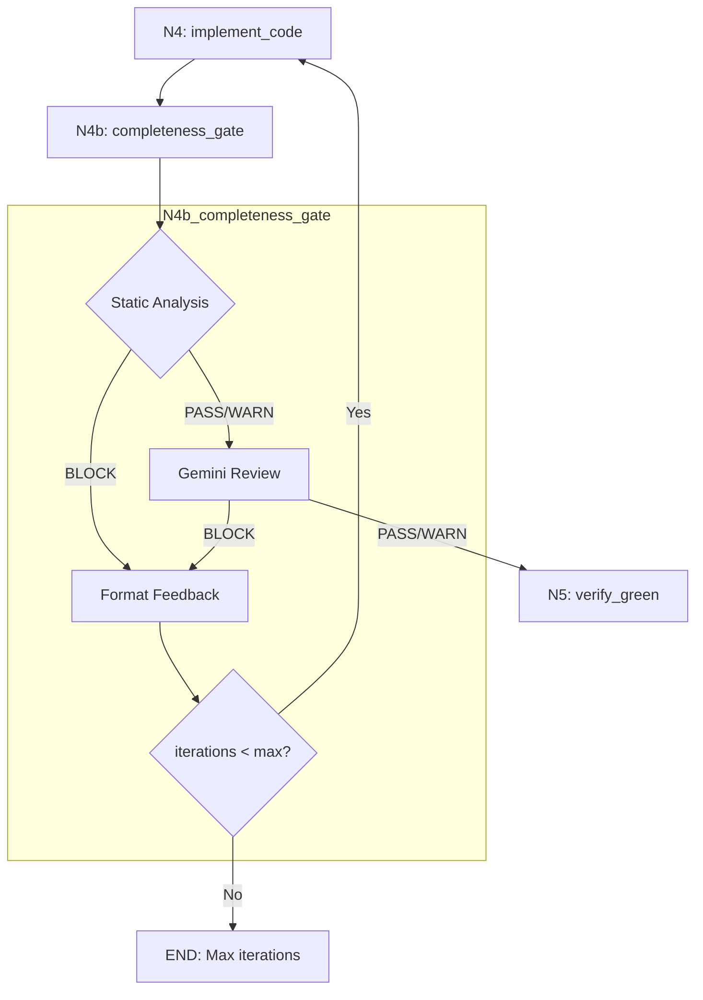
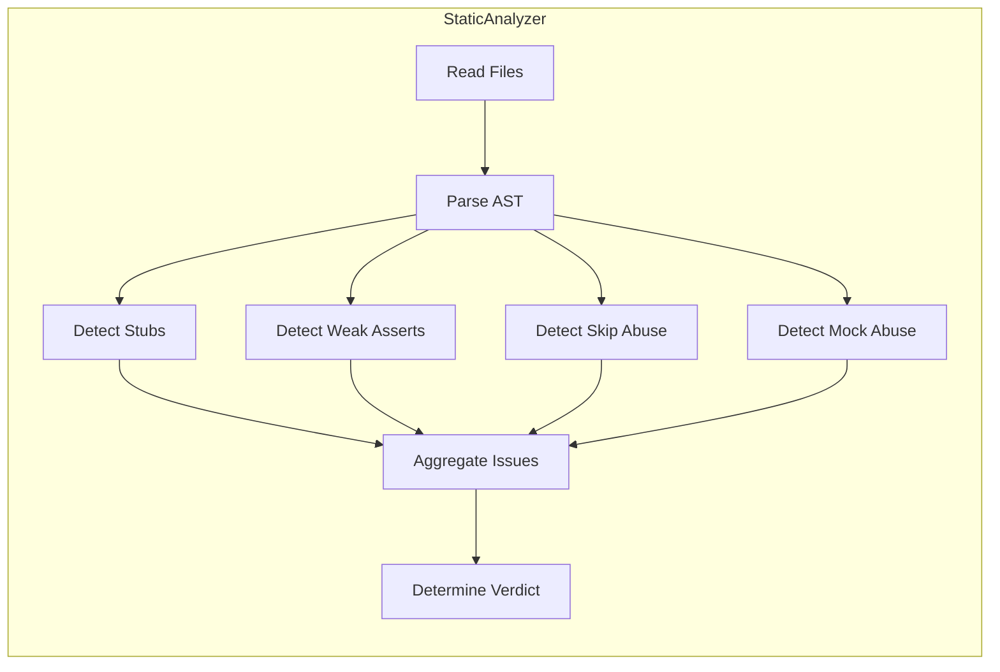

# 1147 - Feature: Implementation Completeness Gate (Anti-Stub Detection)

<!-- Template Metadata
Last Updated: 2025-01-15
Updated By: Issue #147 implementation
Update Reason: Revised per Gemini Review #1 - added T160, resolved open questions
-->

## 1. Context & Goal
* **Issue:** #147
* **Objective:** Create a two-layer completeness gate (N4b) that catches stub implementations and weak tests before they can pass through the testing workflow
* **Status:** Approved (gemini-3-pro-preview, 2026-02-03)
* **Related Issues:** #142, #143, #144, #145, #146

### Open Questions
*Questions that need clarification before or during implementation. Remove when resolved.*

- [x] ~~Should the maximum iteration count for completeness gate loops be configurable via workflow parameters?~~ **RESOLVED: Yes.** Add `max_completeness_iterations` to `TestingWorkflowConfig` with a default of 10.
- [x] ~~Should we track completeness gate statistics (block rate, patterns detected) for workflow analytics?~~ **RESOLVED: Yes, via structured logging.** Log an event `completeness_gate_result` with fields `verdict`, `static_issue_count`, `patterns_detected` to allow downstream dashboarding via LangSmith or existing log aggregators.

## 2. Proposed Changes

*This section is the **source of truth** for implementation. Describe exactly what will be built.*

### 2.1 Files Changed

| File | Change Type | Description |
|------|-------------|-------------|
| `assemblyzero/workflows/testing/completeness/__init__.py` | Add | Package init with exports |
| `assemblyzero/workflows/testing/completeness/static_analyzer.py` | Add | Regex + AST pattern detection module |
| `assemblyzero/workflows/testing/nodes/completeness_gate.py` | Add | N4b node combining static analysis + Gemini review |
| `docs/skills/0707c-Completeness-Review-Prompt.md` | Add | Gemini prompt for semantic completeness review |
| `assemblyzero/workflows/testing/graph.py` | Modify | Insert N4b node, add routing edges |
| `assemblyzero/workflows/testing/state.py` | Modify | Add completeness state fields |
| `assemblyzero/workflows/testing/nodes/__init__.py` | Modify | Export completeness_gate function |
| `docs/skills/0703c-Implementation-Review-Prompt.md` | Modify | Promote Test Integrity to Tier 1 BLOCKING |
| `tests/unit/test_completeness_static_analyzer.py` | Add | Unit tests for static analyzer |
| `tests/unit/test_completeness_gate.py` | Add | Unit tests for completeness gate node |
| `tests/integration/test_completeness_gate_workflow.py` | Add | Integration tests for workflow routing |

### 2.2 Dependencies

*New packages, APIs, or services required.*

```toml
# pyproject.toml additions (if any)
# No new dependencies - uses existing stdlib (ast, re) and Gemini integration
```

### 2.3 Data Structures

```python
# Pseudocode - NOT implementation
class StaticAnalysisIssue(TypedDict):
    file: str              # Path to file with issue
    line: int              # Line number
    pattern: str           # Pattern name (e.g., "stub_pass", "weak_assert")
    severity: Literal["BLOCK", "WARN"]  # Severity level
    message: str           # Human-readable description
    code_snippet: str      # Relevant code fragment

class StaticAnalysisResult(TypedDict):
    verdict: Literal["PASS", "WARN", "BLOCK"]  # Overall verdict
    issues: list[StaticAnalysisIssue]          # All detected issues
    files_analyzed: int                         # Count of files checked
    patterns_checked: int                       # Count of patterns applied

class CompletenessGateResult(TypedDict):
    completeness_verdict: Literal["PASS", "WARN", "BLOCK"]
    completeness_static_issues: list[StaticAnalysisIssue]
    completeness_feedback: str                  # Combined feedback for retry
    completeness_gemini_response: str | None    # Raw Gemini response if called

# State additions to TestingWorkflowState
class CompletenessStateFields(TypedDict):
    completeness_check_passed: bool
    completeness_static_issues: list[dict]
    completeness_verdict: Literal["PASS", "WARN", "BLOCK"]
    completeness_feedback: str
    completeness_iteration_count: int
```

### 2.4 Function Signatures

```python
# static_analyzer.py
def analyze_implementation(
    impl_files: list[Path],
    test_files: list[Path],
    config: StaticAnalyzerConfig | None = None
) -> StaticAnalysisResult:
    """Analyze implementation and test files for stub patterns."""
    ...

def detect_stub_bodies(file_path: Path) -> list[StaticAnalysisIssue]:
    """Detect pass, ..., NotImplementedError patterns in function bodies."""
    ...

def detect_weak_assertions(file_path: Path) -> list[StaticAnalysisIssue]:
    """Detect assert True, assert x is not None patterns in tests."""
    ...

def detect_skip_abuse(file_path: Path) -> list[StaticAnalysisIssue]:
    """Detect pytest.skip() without reason string."""
    ...

def detect_mock_abuse(file_path: Path) -> list[StaticAnalysisIssue]:
    """Detect functions that only return Mock() objects."""
    ...

def parse_ast_safe(file_path: Path) -> ast.Module | None:
    """Parse file to AST, return None on syntax errors."""
    ...

# completeness_gate.py
def completeness_gate(state: TestingWorkflowState) -> dict[str, Any]:
    """N4b: Verify implementation is complete and real."""
    ...

def call_gemini_completeness_review(
    state: TestingWorkflowState,
    static_result: StaticAnalysisResult
) -> Literal["PASS", "WARN", "BLOCK"]:
    """Call Gemini for semantic completeness review."""
    ...

def format_completeness_feedback(
    static_result: StaticAnalysisResult,
    gemini_feedback: str | None
) -> str:
    """Format feedback for N4 retry loop."""
    ...

# graph.py additions
def route_after_implement(state: TestingWorkflowState) -> str:
    """Route from N4 to N4b or end."""
    ...

def route_after_completeness_gate(
    state: TestingWorkflowState
) -> Literal["N5_verify_green", "N4_implement_code", "end"]:
    """Route from N4b based on verdict and iteration count."""
    ...
```

### 2.5 Logic Flow (Pseudocode)

```
=== N4b_completeness_gate ===

1. Extract impl_files and test_files from state
2. IF no files to analyze THEN
   - Return PASS (nothing to check)

3. Run static analysis:
   a. For each impl_file:
      - detect_stub_bodies()
      - detect_mock_abuse()
   b. For each test_file:
      - detect_weak_assertions()
      - detect_skip_abuse()
   c. Aggregate issues, determine verdict

4. IF static_verdict == "BLOCK" THEN
   - Format feedback with specific issues
   - Return BLOCK, skip Gemini call (save cost)

5. IF static_verdict in ["PASS", "WARN"] THEN
   - Call Gemini semantic review
   - Gemini checks:
     * Feature completeness vs LLD requirements
     * Mock-everything test patterns
     * Subtle stubs (functions that always return constant)
   - Combine static + Gemini verdicts

6. Format combined feedback
7. Log completeness_gate_result event with verdict, static_issue_count, patterns_detected
8. Return verdict + issues + feedback

=== route_after_completeness_gate ===

1. Get verdict from state
2. Get iteration_count from state
3. Get max_iterations from config (default 10)

4. IF verdict == "BLOCK" THEN
   IF iteration_count >= max_iterations THEN
     - Log "max iterations reached, giving up" with iteration_count
     - Return "end"
   ELSE
     - Increment iteration_count
     - Return "N4_implement_code"

5. IF verdict == "WARN" THEN
   - Log warnings but continue
   - Return "N5_verify_green"

6. IF verdict == "PASS" THEN
   - Return "N5_verify_green"
```

### 2.6 Technical Approach

* **Module:** `assemblyzero/workflows/testing/completeness/`
* **Pattern:** Two-layer validation (fast local → expensive remote)
* **Key Decisions:**
  - Static analysis runs first to catch obvious issues without API cost
  - AST parsing for accurate function body detection (regex too fragile)
  - Regex for simple pattern matching (assert True, pytest.skip)
  - Gemini only called if static passes (cost optimization)
  - Feedback formatted for Claude to fix issues on retry
  - `max_completeness_iterations` configurable via `TestingWorkflowConfig`
  - Structured logging for analytics without separate database

### 2.7 Architecture Decisions

*Document key architectural decisions that affect the design.*

| Decision | Options Considered | Choice | Rationale |
|----------|-------------------|--------|-----------|
| Analysis layering | Single Gemini pass, Static only, Two-layer | Two-layer | Balance cost/speed (static) with accuracy (Gemini) |
| Static analysis method | Regex only, AST only, Hybrid | Hybrid | AST for structure, regex for patterns |
| Verdict levels | Binary (PASS/FAIL), Three-tier | Three-tier (PASS/WARN/BLOCK) | WARN allows proceeding with known minor issues |
| Feedback destination | Separate feedback node, Direct to N4 | Direct to N4 | Simpler routing, feedback in state |
| Max iteration handling | Hard fail, Soft fail with report | Hard fail (end) | Prevent infinite loops |
| Max iterations config | Hardcoded, Configurable | Configurable | Add `max_completeness_iterations` to `TestingWorkflowConfig` with default 10 |
| Analytics tracking | Separate database, Structured logging | Structured logging | Use existing log infrastructure for dashboarding |

**Architectural Constraints:**
- Must integrate with existing TestingWorkflowState without breaking changes
- Cannot add new external dependencies (use stdlib ast/re)
- Must respect existing Gemini rate limits and error handling
- Node must be idempotent (same input → same output)

## 3. Requirements

*What must be true when this is done. These become acceptance criteria.*

1. **Static analyzer detects all BLOCKING patterns:** `pass`, `...`, `raise NotImplementedError`, `assert True`, `assert x is not None` (alone), `pytest.skip()` without reason
2. **Static analyzer detects WARN patterns:** Mock-only return functions
3. **Completeness gate blocks on any BLOCKING issue** and routes back to N4
4. **Completeness gate calls Gemini** only when static analysis passes
5. **Gemini prompt covers:** Feature completeness vs LLD, mock-everything tests, subtle stubs
6. **Workflow routing** correctly handles PASS → N5, BLOCK → N4, max iterations → end
7. **State fields** are properly updated with issues and feedback
8. **Existing tests** continue to pass (no regression)

## 4. Alternatives Considered

| Option | Pros | Cons | Decision |
|--------|------|------|----------|
| Gemini-only (no static) | Simpler code, catches everything | Expensive, slow, unnecessary for obvious patterns | **Rejected** |
| Static-only (no Gemini) | Fast, cheap, no API dependency | Misses semantic issues (feature completeness) | **Rejected** |
| Two-layer (static + Gemini) | Fast for obvious, thorough for subtle | More complex code | **Selected** |
| Separate static lint tool | Reusable outside workflow | Integration complexity, maintenance burden | **Rejected** |
| Add to N5 instead of new node | Fewer nodes | Conflates verification concerns, harder to disable | **Rejected** |

**Rationale:** Two-layer provides optimal cost/thoroughness tradeoff. Static catches 80% of issues instantly and free, Gemini catches the subtle 20%.

## 5. Data & Fixtures

*Per [0108-lld-pre-implementation-review.md](0108-lld-pre-implementation-review.md) - complete this section BEFORE implementation.*

### 5.1 Data Sources

| Attribute | Value |
|-----------|-------|
| Source | Implementation files from workflow state (impl_file_paths) |
| Format | Python source files (.py) |
| Size | Typically 1-10 files, <10KB each |
| Refresh | Per workflow run |
| Copyright/License | N/A (user's code) |

### 5.2 Data Pipeline

```
Workflow State (file paths) ──read──► File Contents ──parse──► AST/Patterns ──analyze──► Issues
```

### 5.3 Test Fixtures

| Fixture | Source | Notes |
|---------|--------|-------|
| `stub_implementation.py` | Generated | Contains pass, ..., NotImplementedError patterns |
| `weak_tests.py` | Generated | Contains assert True, assert x is not None |
| `skip_abuse_tests.py` | Generated | Contains pytest.skip() without reason |
| `mock_abuse_impl.py` | Generated | Functions returning only Mock() |
| `clean_implementation.py` | Generated | Valid implementation with no issues |
| `clean_tests.py` | Generated | Valid tests with real assertions |

### 5.4 Deployment Pipeline

N/A - No external data sources. All analysis operates on files already present in workflow state.

**If data source is external:** N/A

## 6. Diagram

### 6.1 Mermaid Quality Gate

Before finalizing any diagram, verify in [Mermaid Live Editor](https://mermaid.live) or GitHub preview:

- [x] **Simplicity:** Similar components collapsed (per 0006 §8.1)
- [x] **No touching:** All elements have visual separation (per 0006 §8.2)
- [x] **No hidden lines:** All arrows fully visible (per 0006 §8.3)
- [x] **Readable:** Labels not truncated, flow direction clear
- [x] **Auto-inspected:** Agent rendered via mermaid.ink and viewed (per 0006 §8.5)

**Agent Auto-Inspection (MANDATORY):**

**Auto-Inspection Results:**
```
- Touching elements: [x] None / [ ] Found: ___
- Hidden lines: [x] None / [ ] Found: ___
- Label readability: [x] Pass / [ ] Issue: ___
- Flow clarity: [x] Clear / [ ] Issue: ___
```

*Reference: [0006-mermaid-diagrams.md](0006-mermaid-diagrams.md)*

### 6.2 Diagram





## 7. Security & Safety Considerations

### 7.1 Security

| Concern | Mitigation | Status |
|---------|------------|--------|
| File path traversal | Only analyze files from validated state paths | Addressed |
| Code injection via AST | AST parsing is read-only, no eval/exec | Addressed |
| Gemini prompt injection | File contents are quoted, not interpolated as instructions | Addressed |

### 7.2 Safety

| Concern | Mitigation | Status |
|---------|------------|--------|
| Infinite retry loop | Max iteration limit (configurable, default 10) with hard stop | Addressed |
| AST parse failure | Safe parsing wrapper returns None, skips file with warning | Addressed |
| Missing files | FileNotFoundError caught, logged, continues with available files | Addressed |
| Gemini API failure | Timeout + retry with fallback to static-only verdict | Addressed |

**Fail Mode:** Fail Open - If analysis fails, proceed to N5 with WARN. Rationale: Better to risk a stub passing than to block all workflows on analyzer bugs.

**Recovery Strategy:** If completeness gate itself has bugs, it can be disabled by setting `skip_completeness_gate: true` in workflow config.

## 8. Performance & Cost Considerations

### 8.1 Performance

| Metric | Budget | Approach |
|--------|--------|----------|
| Static analysis latency | < 100ms per file | AST caching, compiled regex |
| Gemini call latency | < 5s | Single focused prompt |
| Memory | < 50MB additional | Stream file reading for large files |

**Bottlenecks:** Gemini API latency is the main bottleneck. Mitigated by only calling when static passes.

### 8.2 Cost Analysis

| Resource | Unit Cost | Estimated Usage | Monthly Cost |
|----------|-----------|-----------------|--------------|
| Gemini API calls | ~$0.001 per call | ~100 calls/day (when static passes) | ~$3 |
| Static analysis | $0 (local) | All workflow runs | $0 |

**Cost Controls:**
- [x] Static analysis filters out 80%+ of issues without API cost
- [x] Gemini prompt is minimal (focused questions, not full code review)
- [x] Max iterations prevent runaway retry loops

**Worst-Case Scenario:** If every run hit Gemini 10x (max iterations), cost would be ~$30/month. Acceptable.

## 9. Legal & Compliance

| Concern | Applies? | Mitigation |
|---------|----------|------------|
| PII/Personal Data | No | Analyzes code structure, not data content |
| Third-Party Licenses | No | Uses stdlib only (ast, re) |
| Terms of Service | Yes | Gemini usage within existing ToS compliance |
| Data Retention | No | No data stored, analysis is ephemeral |
| Export Controls | No | No restricted algorithms |

**Data Classification:** Internal (user's code analyzed but not stored)

**Compliance Checklist:**
- [x] No PII stored without consent
- [x] All third-party licenses compatible with project license
- [x] External API usage compliant with provider ToS
- [x] Data retention policy documented (none retained)

## 10. Verification & Testing

*Ref: [0005-testing-strategy-and-protocols.md](0005-testing-strategy-and-protocols.md)*

**Testing Philosophy:** Strive for 100% automated test coverage. All scenarios automated.

### 10.0 Test Plan (TDD - Complete Before Implementation)

**TDD Requirement:** Tests MUST be written and failing BEFORE implementation begins.

| Test ID | Test Description | Expected Behavior | Status |
|---------|------------------|-------------------|--------|
| T010 | test_detect_stub_pass | Detects `pass` as BLOCK | RED |
| T020 | test_detect_stub_ellipsis | Detects `...` as BLOCK | RED |
| T030 | test_detect_stub_not_implemented | Detects `raise NotImplementedError` as BLOCK | RED |
| T040 | test_detect_weak_assert_true | Detects `assert True` as BLOCK | RED |
| T050 | test_detect_weak_assert_not_none | Detects `assert x is not None` (alone) as BLOCK | RED |
| T060 | test_detect_skip_abuse | Detects `pytest.skip()` without reason as BLOCK | RED |
| T070 | test_detect_mock_abuse | Detects Mock-only returns as WARN | RED |
| T080 | test_clean_impl_passes | Clean implementation returns PASS | RED |
| T090 | test_clean_tests_passes | Clean tests return PASS | RED |
| T100 | test_completeness_gate_blocks_on_stub | Gate returns BLOCK verdict for stubs | RED |
| T110 | test_completeness_gate_routes_to_n4 | BLOCK routes back to N4 | RED |
| T120 | test_completeness_gate_routes_to_n5 | PASS routes to N5 | RED |
| T130 | test_max_iterations_ends | Max iterations routes to end | RED |
| T140 | test_gemini_called_on_static_pass | Gemini called only when static passes | RED |
| T150 | test_feedback_formatted | Feedback includes issue details | RED |
| T160 | test_prompt_template_integrity | Prompt file 0707c exists and contains required keywords | RED |

**Coverage Target:** ≥95% for all new code

**TDD Checklist:**
- [ ] All tests written before implementation
- [ ] Tests currently RED (failing)
- [ ] Test IDs match scenario IDs in 10.1
- [ ] Test file created at: `tests/unit/test_completeness_static_analyzer.py`, `tests/unit/test_completeness_gate.py`

### 10.1 Test Scenarios

| ID | Scenario | Type | Input | Expected Output | Pass Criteria |
|----|----------|------|-------|-----------------|---------------|
| 010 | Detect pass stub | Auto | `def f(): pass` | BLOCK issue | Issue found with line number |
| 020 | Detect ellipsis stub | Auto | `def f(): ...` | BLOCK issue | Issue found with line number |
| 030 | Detect NotImplementedError | Auto | `def f(): raise NotImplementedError()` | BLOCK issue | Issue found |
| 040 | Detect assert True | Auto | `assert True` | BLOCK issue | Issue found in test file |
| 050 | Detect assert not None alone | Auto | `assert x is not None` (only assertion) | BLOCK issue | Issue found |
| 060 | Detect skip abuse | Auto | `pytest.skip()` | BLOCK issue | Issue found |
| 070 | Detect mock abuse | Auto | `def f(): return Mock()` | WARN issue | Warning issued |
| 080 | Clean implementation | Auto | Valid impl | PASS | No issues |
| 090 | Clean tests | Auto | Valid tests | PASS | No issues |
| 100 | Gate blocks stub | Auto | State with stub file | verdict=BLOCK | completeness_verdict is BLOCK |
| 110 | BLOCK routes to N4 | Auto | verdict=BLOCK, iter<max | route=N4_implement_code | Correct route returned |
| 120 | PASS routes to N5 | Auto | verdict=PASS | route=N5_verify_green | Correct route returned |
| 130 | Max iterations ends | Auto | verdict=BLOCK, iter=max | route=end | Workflow terminates |
| 140 | Gemini called conditionally | Auto | Static PASS | Gemini called | Mock Gemini receives call |
| 150 | Feedback format | Auto | 2 issues | Formatted string | Contains file, line, pattern |
| 160 | Prompt template integrity | Auto | Prompt file path | File exists, contains keywords | File contains "completeness", "LLD", "mock", "stub" |

### 10.2 Test Commands

```bash
# Run all automated tests
poetry run pytest tests/unit/test_completeness_static_analyzer.py tests/unit/test_completeness_gate.py -v

# Run only fast/mocked tests (exclude live)
poetry run pytest tests/unit/test_completeness*.py -v -m "not live"

# Run live integration tests
poetry run pytest tests/integration/test_completeness_gate_workflow.py -v -m live

# Run with coverage
poetry run pytest tests/unit/test_completeness*.py -v --cov=assemblyzero/workflows/testing/completeness --cov-report=term-missing
```

### 10.3 Manual Tests (Only If Unavoidable)

N/A - All scenarios automated.

## 11. Risks & Mitigations

| Risk | Impact | Likelihood | Mitigation |
|------|--------|------------|------------|
| False positives (block valid code) | High | Medium | Careful pattern design, WARN tier for uncertain cases |
| False negatives (miss stubs) | Medium | Medium | Two-layer design catches subtle issues |
| Gemini API downtime | Medium | Low | Fallback to static-only with WARN |
| AST parsing edge cases | Low | Medium | Safe parsing with fallback to regex |
| Performance regression | Medium | Low | Static analysis is fast, Gemini is conditional |
| Infinite loop despite max iter | High | Very Low | Hard stop at max + 1 as safety margin |

## 12. Definition of Done

### Code
- [ ] `static_analyzer.py` complete with all pattern detectors
- [ ] `completeness_gate.py` complete with node logic
- [ ] `graph.py` updated with N4b node and routing
- [ ] `state.py` updated with completeness fields
- [ ] `nodes/__init__.py` exports completeness_gate
- [ ] `0707c-Completeness-Review-Prompt.md` created
- [ ] `0703c-Implementation-Review-Prompt.md` updated
- [ ] All code linted and type-checked

### Tests
- [ ] All 16 test scenarios pass
- [ ] Coverage ≥95% for new code
- [ ] Integration test passes in mock mode
- [ ] E2E test with intentional stub verified

### Documentation
- [ ] LLD updated with any deviations
- [ ] Implementation Report (0103) completed
- [ ] Test Report (0113) completed if applicable

### Review
- [ ] Code review completed
- [ ] Workflow tested manually with `--mock` flag
- [ ] User approval before closing issue

---

## Appendix: Review Log

*Track all review feedback with timestamps and implementation status.*

### Gemini Review #1 (REVISE)

**Reviewer:** Gemini 3 Pro
**Verdict:** REVISE

#### Comments

| ID | Comment | Implemented? |
|----|---------|--------------|
| G1.1 | "Resolve open question: max iteration count configurable" | YES - Added to Section 1 Open Questions, Section 2.5, Section 2.7 |
| G1.2 | "Resolve open question: track completeness gate statistics" | YES - Added to Section 1 Open Questions, Section 2.5 (logging event) |
| G1.3 | "Add T160: test_prompt_template_integrity to verify Requirement #5" | YES - Added to Section 10.0 and 10.1 |
| G1.4 | "Suggestion: Allow disabling specific patterns via config" | NOTED - Will consider during implementation |
| G1.5 | "Suggestion: Log iteration_count explicitly" | YES - Added to Section 2.5 pseudocode |

### Review Summary

| Review | Date | Verdict | Key Issue |
|--------|------|---------|-----------|
| 2 | 2026-02-03 | APPROVED | `gemini-3-pro-preview` |
| Gemini #1 | 2025-01-15 | REVISE | Missing T160 for prompt template verification |

**Final Status:** APPROVED