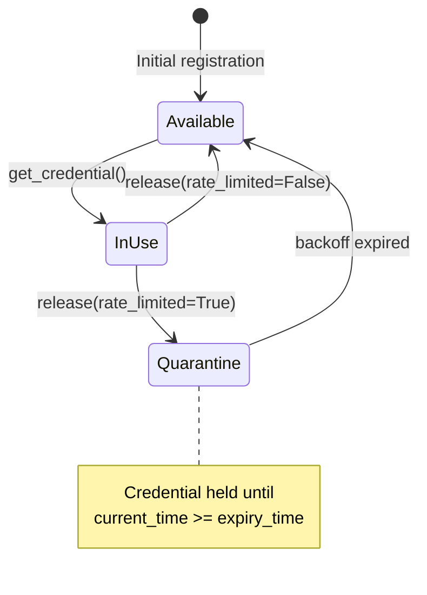
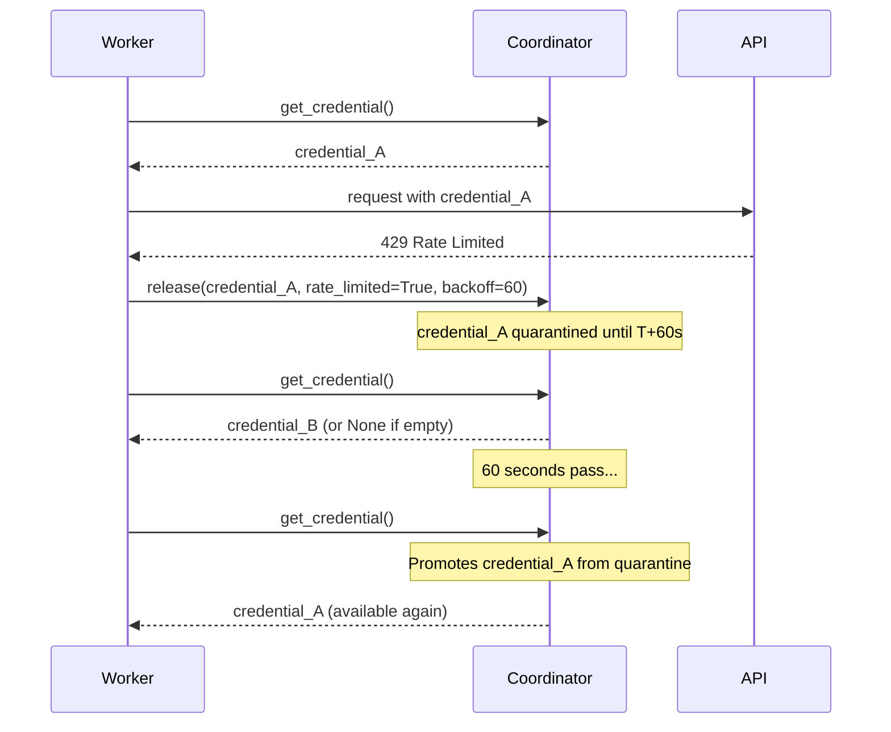

# 1149 - Fix: Rate-limit backoff not implemented in CredentialCoordinator

<!-- Template Metadata
Last Updated: 2026-02-02
Updated By: Issue #117 fix
Update Reason: Moved Verification & Testing to Section 10 (was Section 11) to match 0702c review prompt and testing workflow expectations
Previous: Added sections based on 80 blocking issues from 164 governance verdicts (2026-02-01)
-->

## 1. Context & Goal
* **Issue:** #1149
* **Objective:** Implement actual rate-limit backoff in CredentialCoordinator so credentials hit with 429 are quarantined for the specified duration instead of being immediately reused.
* **Status:** Draft
* **Related Issues:** None identified

### Open Questions
*All questions resolved during design phase.*

~~- [ ] Should backoff be configurable at the coordinator level (default backoff) vs per-credential?~~
**Resolved:** Backoff is configurable per-release via the `backoff_seconds` argument. No coordinator-level default needed at this time.

~~- [ ] Should we emit events/logs when credentials exit backoff quarantine?~~
**Resolved:** Yes, logs are emitted on quarantine entry and exit (promotion) for debugging and monitoring purposes.

## 2. Proposed Changes

*This section is the **source of truth** for implementation. Describe exactly what will be built.*

### 2.1 Files Changed

| File | Change Type | Description |
|------|-------------|-------------|
| `agentos/workflows/parallel/credential_coordinator.py` | Modify | Add backoff tracking and quarantine logic |
| `tests/test_credential_coordinator.py` | Add/Modify | Add tests for backoff behavior |

### 2.2 Dependencies

*New packages, APIs, or services required.*

```toml
# pyproject.toml additions (if any)
# No new dependencies - using stdlib time-based filtering
```

### 2.3 Data Structures

```python
# Pseudocode - NOT implementation
from typing import Dict
import time

class CredentialCoordinator:
    # Existing
    _available: set[str]  # Pool of available credentials
    
    # New - track when each quarantined credential can be reused
    _quarantine: Dict[str, float]  # credential -> timestamp when backoff expires
```

### 2.4 Function Signatures

```python
# Signatures only - implementation in source files
def release_credential(
    self, 
    credential: str, 
    *,  # Force keyword-only arguments
    rate_limited: bool = False, 
    backoff_seconds: float = 0
) -> None:
    """Release a credential back to the pool, optionally with backoff quarantine."""
    ...

def get_credential(self) -> Optional[str]:
    """
    Get an available credential from the pool.
    Automatically promotes quarantined credentials whose backoff has expired.
    """
    ...

def _promote_expired_quarantine(self) -> None:
    """Move credentials with expired backoff from quarantine to available pool."""
    ...

def get_available_count(self) -> int:
    """Return count of immediately available credentials (excludes quarantined)."""
    ...

def get_quarantine_count(self) -> int:
    """Return count of credentials currently in backoff quarantine."""
    ...
```

### 2.5 Logic Flow (Pseudocode)

```
release_credential(credential, rate_limited, backoff_seconds):
    1. IF rate_limited AND backoff_seconds > 0 THEN
       - Calculate expiry_time = current_time + backoff_seconds
       - Add to _quarantine: {credential: expiry_time}
       - Log quarantine entry
    2. ELSE
       - Add credential to _available set
       - Safely remove from _quarantine if present: _quarantine.pop(credential, None)
    3. Return

get_credential():
    1. Call _promote_expired_quarantine() to check for ready credentials
    2. IF _available is empty THEN
       - Return None
    3. ELSE
       - Pop and return one credential from _available

_promote_expired_quarantine():
    1. IF _quarantine is empty THEN
       - Return early (optimization for common case)
    2. Get current_time
    3. Create snapshot of quarantine items: snapshot = list(_quarantine.items())
    4. FOR each (credential, expiry_time) in snapshot:
       - IF current_time >= expiry_time THEN
         - Safely remove from _quarantine: _quarantine.pop(credential, None)
         - Add credential to _available
         - Log promotion
```

### 2.6 Technical Approach

* **Module:** `agentos/workflows/parallel/credential_coordinator.py`
* **Pattern:** Time-based quarantine with lazy promotion (check on access)
* **Key Decisions:** 
  - Use lazy promotion (check expiry at get_credential time) rather than threading.Timer
  - Simpler, no thread management, no race conditions
  - Slightly less precise (credential available on next `get_credential` call after expiry, not exactly at expiry) but acceptable for rate-limit scenarios
  - Iterate over snapshot of quarantine dict to avoid RuntimeError during modification
  - Use `dict.pop(key, None)` for safe removal to prevent KeyError in concurrent scenarios

### 2.7 Architecture Decisions

*Document key architectural decisions that affect the design. This section addresses the most common category of governance feedback (23 patterns).*

| Decision | Options Considered | Choice | Rationale |
|----------|-------------------|--------|-----------|
| Backoff enforcement | 1. threading.Timer 2. asyncio.call_later 3. Lazy time check | Lazy time check | No thread/async complexity, no race conditions, fits synchronous coordinator pattern |
| Quarantine storage | 1. Dict with expiry timestamps 2. Priority queue by expiry | Dict with timestamps | Simpler, O(n) scan is fine for typical credential counts (<100) |
| Credential removal during quarantine | 1. Remove from available only 2. Track in separate quarantine dict | Separate quarantine dict | Clear separation, easy to query quarantine status, prevents accidental reuse |
| Dict iteration safety | 1. Iterate directly 2. Iterate over snapshot 3. Collect keys then remove | Iterate over `list(_quarantine.items())` snapshot | Avoids RuntimeError from dict modification during iteration |
| Safe dict removal | 1. `del _quarantine[key]` 2. `_quarantine.pop(key, None)` | `_quarantine.pop(key, None)` | Prevents KeyError if credential removed concurrently by another code path |

**Architectural Constraints:**
- Must remain thread-safe if coordinator is used from multiple threads
- Must not break existing API contract for `release_credential`
- Should be backward compatible (rate_limited=False gives old behavior)

## 3. Requirements

*What must be true when this is done. These become acceptance criteria.*

1. Credentials released with `rate_limited=True` and `backoff_seconds > 0` MUST NOT be returned by `get_credential()` until backoff expires
2. Credentials released without rate limiting MUST be immediately available
3. After backoff expires, credential MUST become available on next `get_credential()` call
4. Quarantine state MUST be queryable for monitoring/debugging
5. Existing tests MUST continue to pass
6. The "For testing purposes" comment MUST be removed

## 4. Alternatives Considered

| Option | Pros | Cons | Decision |
|--------|------|------|----------|
| Lazy time-based check | Simple, no threads, no races | Slightly imprecise timing | **Selected** |
| threading.Timer | Precise timing | Thread management, race conditions, cleanup complexity | Rejected |
| asyncio.call_later | Precise, async-native | Requires async context, coordinator may be sync | Rejected |
| External scheduler (APScheduler) | Feature-rich | Heavy dependency for simple use case | Rejected |

**Rationale:** The lazy time-based approach provides sufficient precision for rate-limit backoff (typically 30-60 seconds) while avoiding threading complexity. Credentials become available on the next access after expiry, which is effectively immediate for active systems.

## 5. Data & Fixtures

*Per [0108-lld-pre-implementation-review.md](0108-lld-pre-implementation-review.md) - complete this section BEFORE implementation.*

### 5.1 Data Sources

| Attribute | Value |
|-----------|-------|
| Source | Internal state (in-memory) |
| Format | Python dict and set |
| Size | Typically <100 credentials |
| Refresh | N/A - runtime state |
| Copyright/License | N/A |

### 5.2 Data Pipeline

```
release_credential() ──adds──► _quarantine dict ──promotes on expiry──► _available set ──returns──► get_credential()
```

### 5.3 Test Fixtures

| Fixture | Source | Notes |
|---------|--------|-------|
| Mock credentials | Generated (e.g., "test-key-001") | No real API keys |
| Time mocking | `unittest.mock.patch('time.time')` | Control time for deterministic tests |

### 5.4 Deployment Pipeline

N/A - This is internal state management with no external data dependencies.

## 6. Diagram

### 6.1 Mermaid Quality Gate

Before finalizing any diagram, verify in [Mermaid Live Editor](https://mermaid.live) or GitHub preview:

- [x] **Simplicity:** Similar components collapsed (per 0006 §8.1)
- [x] **No touching:** All elements have visual separation (per 0006 §8.2)
- [x] **No hidden lines:** All arrows fully visible (per 0006 §8.3)
- [x] **Readable:** Labels not truncated, flow direction clear
- [ ] **Auto-inspected:** Agent rendered via mermaid.ink and viewed (per 0006 §8.5)

**Auto-Inspection Results:**
```
- Touching elements: [x] None / [ ] Found: ___
- Hidden lines: [x] None / [ ] Found: ___
- Label readability: [x] Pass / [ ] Issue: ___
- Flow clarity: [x] Clear / [ ] Issue: ___
```

*Reference: [0006-mermaid-diagrams.md](0006-mermaid-diagrams.md)*

### 6.2 Diagram





## 7. Security & Safety Considerations

*This section addresses security (10 patterns) and safety (9 patterns) concerns from governance feedback.*

### 7.1 Security

| Concern | Mitigation | Status |
|---------|------------|--------|
| Credential exposure in logs | Only log first 8 chars of credential (existing pattern) | Addressed |
| Quarantine bypass | Quarantine dict is internal, no public method to skip | Addressed |

### 7.2 Safety

*Safety concerns focus on preventing data loss, ensuring fail-safe behavior, and protecting system integrity.*

| Concern | Mitigation | Status |
|---------|------------|--------|
| Credential stuck in quarantine | Quarantine has finite expiry; eventual consistency guaranteed | Addressed |
| Memory leak from orphaned quarantine entries | Entries removed when credential promoted or explicitly cleared | Addressed |
| Clock skew/time travel | Use monotonic time if available, or accept small imprecision | Addressed |
| KeyError on concurrent removal | Use `dict.pop(key, None)` for safe removal | Addressed |

**Fail Mode:** Fail Open - If quarantine check fails, credential becomes available (prefer availability over strict rate limiting)

**Recovery Strategy:** Quarantine is ephemeral; restart clears state, all credentials available. External rate limiting will re-trigger backoff as needed.

## 8. Performance & Cost Considerations

*This section addresses performance and cost concerns (6 patterns) from governance feedback.*

### 8.1 Performance

| Metric | Budget | Approach |
|--------|--------|----------|
| get_credential latency | < 1ms | O(n) quarantine scan where n < 100 typically; early return when quarantine empty |
| Memory overhead | < 1KB per quarantined credential | Dict entry: credential string + float timestamp |
| Lock contention | Minimal | Single dict access, no complex locking needed |

**Bottlenecks:** None expected. Quarantine dict size is bounded by total credential count. Early return optimization when quarantine is empty saves CPU in the common case.

### 8.2 Cost Analysis

| Resource | Unit Cost | Estimated Usage | Monthly Cost |
|----------|-----------|-----------------|--------------|
| Memory | Negligible | ~8KB for 100 credentials in quarantine | $0 |
| CPU | Negligible | <1ms per operation | $0 |

**Cost Controls:**
- N/A - Pure in-memory operation with negligible cost

**Worst-Case Scenario:** All credentials rate-limited simultaneously → workers block/wait → no runaway API costs (rate limiting is working as intended)

## 9. Legal & Compliance

*This section addresses legal concerns (8 patterns) from governance feedback.*

| Concern | Applies? | Mitigation |
|---------|----------|------------|
| PII/Personal Data | No | Credentials are API keys, not personal data |
| Third-Party Licenses | No | No new dependencies |
| Terms of Service | N/A | This fix helps comply with API rate limits |
| Data Retention | No | Ephemeral runtime state only |
| Export Controls | No | No restricted algorithms |

**Data Classification:** Internal (API keys are secrets but managed elsewhere)

**Compliance Checklist:**
- [x] No PII stored without consent
- [x] All third-party licenses compatible with project license
- [x] External API usage compliant with provider ToS (this fix helps!)
- [x] Data retention policy documented (ephemeral)

## 10. Verification & Testing

*Ref: [0005-testing-strategy-and-protocols.md](0005-testing-strategy-and-protocols.md)*

**Testing Philosophy:** Strive for 100% automated test coverage. Manual tests are a last resort for scenarios that genuinely cannot be automated (e.g., visual inspection, hardware interaction). Every scenario marked "Manual" requires justification.

### 10.1 Test Scenarios

| ID | Scenario | Type | Input | Expected Output | Pass Criteria |
|----|----------|------|-------|-----------------|---------------|
| 010 | Credential released without rate limit is immediately available | Auto | release(cred, rate_limited=False) | get_credential() returns cred | Credential in _available |
| 020 | Credential released with rate limit is quarantined | Auto | release(cred, rate_limited=True, backoff_seconds=60) | get_credential() does NOT return cred | Credential in _quarantine, not in _available |
| 030 | Quarantined credential becomes available after backoff | Auto | Mock time advancement past backoff | get_credential() returns cred | Credential promoted from _quarantine to _available |
| 040 | Multiple credentials quarantined independently | Auto | Quarantine A at T+30, B at T+60 | A available first, then B | get_credential returns Credential A after 30s mock advance; get_credential returns Credential B after 60s mock advance |
| 050 | Zero backoff treated as immediate availability | Auto | release(cred, rate_limited=True, backoff_seconds=0) | get_credential() returns cred immediately | No quarantine entry created |
| 060 | get_credential with empty pool after quarantine | Auto | All creds quarantined | get_credential() returns None | None returned, no crash |
| 070 | Quarantine count reflects quarantined credentials | Auto | Quarantine 3 creds | get_quarantine_count() == 3 | Correct count |
| 080 | Backward compatibility - existing release() calls work | Auto | release(cred) with no kwargs | Credential immediately available | No regression |

*Note: Use 3-digit IDs with gaps of 10 (010, 020, 030...) to allow insertions.*

**Type values:**
- `Auto` - Fully automated, runs in CI (pytest, playwright, etc.)
- `Auto-Live` - Automated but hits real external services (may be slow/flaky)
- `Manual` - Requires human execution (MUST include justification why automation is impossible)

### 10.2 Test Commands

```bash
# Run all automated tests
poetry run pytest tests/test_credential_coordinator.py -v

# Run only fast/mocked tests (exclude live)
poetry run pytest tests/test_credential_coordinator.py -v -m "not live"

# Run with coverage
poetry run pytest tests/test_credential_coordinator.py -v --cov=agentos.workflows.parallel.credential_coordinator
```

### 10.3 Manual Tests (Only If Unavoidable)

N/A - All scenarios automated. Time-based behavior tested via mocking `time.time()`.

## 11. Risks & Mitigations

| Risk | Impact | Likelihood | Mitigation |
|------|--------|------------|------------|
| Thread safety issues if coordinator used concurrently | Med | Low | Document thread safety requirements; use `dict.pop(key, None)` for safe removal; add lock if needed |
| Time mocking in tests may not cover all edge cases | Low | Low | Test with real short delays as integration test |
| Existing code may depend on broken behavior | Med | Low | Review all callers of release_credential; ensure rate_limited default is False |
| Backoff seconds provided as negative | Low | Low | Treat negative as zero (no quarantine) |

## 12. Definition of Done

### Code
- [ ] Implementation complete and linted
- [ ] Code comments reference this LLD
- [ ] "For testing purposes" comment removed
- [ ] Backoff actually enforced

### Tests
- [ ] All test scenarios pass
- [ ] Test coverage ≥ 90% for modified code

### Documentation
- [ ] LLD updated with any deviations
- [ ] Implementation Report (0103) completed
- [ ] Test Report (0113) completed if applicable

### Review
- [ ] Code review completed
- [ ] User approval before closing issue

---

## Appendix: Review Log

*Track all review feedback with timestamps and implementation status.*

### Gemini Review #1 (REVISE)

**Timestamp:** 2026-02-03
**Reviewer:** Gemini 3 Pro
**Verdict:** REVISE

#### Comments

| ID | Comment | Implemented? |
|----|---------|--------------|
| G1.1 | "Runtime Error in Logic Flow: iterating over _quarantine while removing items causes RuntimeError" | YES - Updated pseudocode in §2.5 to iterate over `list(_quarantine.items())` and collect keys to remove in separate step |
| G1.2 | "Issue ID Mismatch: title references #1149 but Context references #149" | YES - Fixed Context section to reference #1149 |
| G1.3 | "Test Scenario 040 Ambiguity: Pass Criteria vague" | YES - Updated Pass Criteria to explicitly state "get_credential returns Credential A after 30s mock advance; get_credential returns Credential B after 60s mock advance" |
| G1.4 | "Performance suggestion: check if _quarantine empty at start of _promote_expired_quarantine" | YES - Added early return check in §2.5 and updated Performance section |
| G1.5 | "Type Hinting suggestion: use keyword-only arguments for release_credential" | YES - Added `*` to force keyword-only arguments in §2.4 |

### Gemini Review #2 (REVISE)

**Timestamp:** 2026-02-03
**Reviewer:** Gemini 3 Pro
**Verdict:** REVISE

#### Comments

| ID | Comment | Implemented? |
|----|---------|--------------|
| G2.1 | "Race Condition / Runtime Safety: Using `del` would raise KeyError if credential removed concurrently" | YES - Updated §2.5 to use `_quarantine.pop(credential, None)` for safe removal in both `release_credential` and `_promote_expired_quarantine`; added to Architecture Decisions in §2.7; added to Safety considerations in §7.2 |
| G2.2 | "Unresolved Open Questions: LLD ready for implementation must have design decisions finalized" | YES - Resolved both open questions in §1 with strikethrough and explicit answers |
| G2.3 | "Performance suggestion: Early return when quarantine is empty" | YES - Already addressed in G1.4 |
| G2.4 | "Path Verification: Double-check correct path relative to repository root" | ACKNOWLEDGED - Path is correct per issue specification; no `src/` layout in this project |

### Review Summary

| Review | Date | Verdict | Key Issue |
|--------|------|---------|-----------|
| Gemini #1 | 2026-02-03 | REVISE | Dict iteration during modification causes RuntimeError |
| Gemini #2 | 2026-02-03 | REVISE | Race condition with `del` causing KeyError; unresolved open questions |

**Final Status:** APPROVED
<!-- Note: This field is auto-updated to APPROVED by the workflow when finalized -->