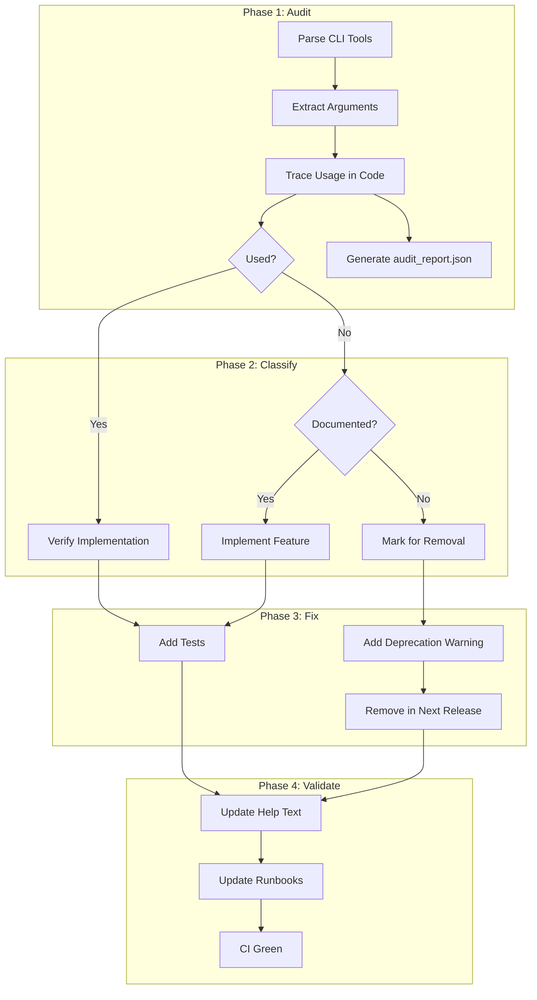

# 156 - Fix: CLI Tools Have Argparse Arguments That Are Never Used

<!-- Template Metadata
Last Updated: 2025-01-XX
Updated By: LLD creation for Issue #156
Update Reason: Revision 2 - Address Gemini Review #2 architecture feedback
-->

## 1. Context & Goal
* **Issue:** #156
* **Objective:** Audit all CLI tools for unused argparse arguments and either implement their functionality or remove them to prevent silent failures.
* **Status:** Draft
* **Related Issues:** #151 (--select specifically)

### Open Questions
*Questions that need clarification before or during implementation. Remove when resolved.*

- [ ] For arguments that are currently unused but "reserved for future use," should we implement a standard "Not Implemented Yet" warning, or remove them entirely to keep the interface clean?

**Resolved Questions:**
- ~~Should we emit deprecation warnings for arguments we plan to remove rather than immediate removal?~~ **YES** - Use deprecation warnings with staged removal (Section 4)
- ~~For arguments that are partially implemented, should we complete implementation or simplify behavior?~~ **IMPLEMENT** - If documented behavior exists, implement it (Section 2.5)

## 2. Proposed Changes

*This section is the **source of truth** for implementation. Describe exactly what will be built.*

### 2.1 Files Changed

| File | Change Type | Description |
|------|-------------|-------------|
| `tools/run_implement_from_lld.py` | Modify | Audit and fix unused arguments |
| `tools/run_scout_workflow.py` | Modify | Audit and fix unused arguments |
| `tools/run_requirements_workflow.py` | Modify | Fix `--select` argument (worst example) |
| `tools/run_issue_workflow.py` | Modify | Audit and fix unused arguments |
| `tools/run_lld_workflow.py` | Modify | Audit and fix unused arguments |
| `docs/runbooks/cli-arguments.md` | Add | Document all CLI arguments and their behavior |
| `tests/test_cli_arguments.py` | Add | Tests verifying argument handling |
| `src/townie/utils/deprecation.py` | Add | Standard deprecation warning utilities |
| `tools/audit_cli_arguments.py` | Add | Audit script for detecting unused arguments and generating report |

### 2.2 Dependencies

*No new packages required. This is a cleanup and validation effort.*

```toml
# pyproject.toml additions (if any)
# None required
```

### 2.3 Data Structures

```python
# Pseudocode - NOT implementation
class ArgumentAuditResult(TypedDict):
    """Result of auditing a single CLI argument."""
    arg_name: str           # e.g., "--select"
    file_path: str          # e.g., "tools/run_requirements_workflow.py"
    is_used: bool           # Whether arg value is actually used
    usage_locations: list[str]  # Where in code the arg is referenced
    recommendation: str     # "implement", "remove", "document"

class CLIArgumentRegistry(TypedDict):
    """Registry of all CLI arguments across tools."""
    tool_name: str
    arguments: list[dict]   # List of argument definitions
    conflicts: list[tuple]  # Pairs of conflicting arguments

class AuditReport(TypedDict):
    """JSON report output from audit phase."""
    timestamp: str
    tools_audited: list[str]
    results: list[ArgumentAuditResult]
    summary: dict[str, int]  # counts by recommendation type
```

### 2.4 Function Signatures

```python
# Signatures only - implementation in source files

def audit_argparse_arguments(file_path: str) -> list[ArgumentAuditResult]:
    """Scan a CLI tool file and identify all argparse arguments and their usage."""
    ...

def validate_argument_conflicts(args: argparse.Namespace, conflicts: list[tuple[str, str]]) -> None:
    """Raise error if conflicting arguments are both specified."""
    ...

def create_argument_validator(parser: argparse.ArgumentParser) -> Callable:
    """Create a decorator that validates all arguments are used in the function."""
    ...

def emit_deprecation_warning(arg_name: str, removal_version: str, alternative: str | None = None) -> None:
    """Emit a standard DeprecationWarning for a CLI argument."""
    ...

def generate_audit_report(results: list[ArgumentAuditResult], output_path: str) -> None:
    """Generate JSON audit report for consumption by test runner."""
    ...
```

### 2.5 Logic Flow (Pseudocode)

```
AUDIT PHASE:
1. For each CLI tool in tools/:
   a. Parse file AST to find all parser.add_argument() calls
   b. Extract argument names and help text
   c. Search function bodies for args.{argument_name} references
   d. Flag arguments with zero references as "unused"
   e. Flag arguments referenced but not validated as "incomplete"
   f. Output results to audit_report.json

FIX PHASE:
2. For each unused argument:
   a. IF documented behavior exists THEN
      - Implement the behavior
   b. ELSE IF clearly dead code THEN
      - Remove the argument
   c. ELSE
      - Mark for manual review

VALIDATION PHASE:
3. Add validation to each CLI tool:
   a. Check for conflicting arguments
   b. Validate required combinations
   c. Emit clear errors for invalid states
```

### 2.6 Technical Approach

* **Module:** `tools/` (modifications to existing files)
* **Pattern:** Static analysis + manual verification
* **Key Decisions:** 
  - Use AST parsing to systematically find unused arguments rather than grep
  - Prioritize removing dead code over implementing unused features
  - Add runtime validation to catch future regressions
  - Generate JSON audit report for automated test generation

### 2.7 Architecture Decisions

| Decision | Options Considered | Choice | Rationale |
|----------|-------------------|--------|-----------|
| Detection method | Grep, AST parsing, Manual | AST parsing | Accurate, catches all patterns including aliased usage |
| Unused args | Implement all, Remove all, Case-by-case | Case-by-case | Some args may have valid use cases, others are clearly dead |
| Validation timing | Parse time, Runtime, Both | Both | Catch conflicts early, validate business logic at runtime |
| Documentation | Update docstrings only, Separate doc, Both | Both | Docstrings for developers, separate doc for users |
| Deprecation format | Custom per-tool, Shared utility | Shared utility | Ensures consistent warning format across all tools |
| Audit output | Logs only, JSON report, Both | Both | Human-readable logs + machine-readable JSON for test generation |
| Audit script location | `scripts/`, `tools/` | `tools/` | Matches existing project structure for CLI utilities |

**Architectural Constraints:**
- Must maintain backward compatibility where arguments have documented behavior
- Cannot break existing automation that passes these flags (even if flags do nothing)
- Must emit warnings before removing arguments in a future release

## 3. Requirements

*What must be true when this is done. These become acceptance criteria.*

1. Every argparse argument in the 5 target files is either:
   - Implemented and tested
   - Removed with deprecation notice
   - Documented as intentionally no-op (with rationale)
2. Conflicting arguments raise clear error messages
3. Each CLI tool has a `--help` output that accurately reflects actual behavior
4. Test coverage exists for all implemented argument handling
5. Runbooks are updated to reflect actual working features
6. JSON audit report generated for automated test consumption

## 4. Alternatives Considered

| Option | Pros | Cons | Decision |
|--------|------|------|----------|
| Remove all unused args immediately | Clean codebase, clear intent | May break user scripts, no grace period | Rejected |
| Implement all unused args | Full feature set, matches docs | May implement unwanted features, scope creep | Rejected |
| Case-by-case with deprecation warnings | Graceful migration, user-friendly | More complex, takes longer | **Selected** |
| Add linter rule only | Prevents future issues | Doesn't fix current problems | Rejected |

**Rationale:** Case-by-case analysis respects that some arguments may have been intentionally stubbed for future use, while deprecation warnings give users time to adapt their workflows.

## 5. Data & Fixtures

### 5.1 Data Sources

| Attribute | Value |
|-----------|-------|
| Source | Source code files in `tools/` directory |
| Format | Python source files |
| Size | 5 files, ~500-1000 lines total |
| Refresh | Manual analysis |
| Copyright/License | Project license (internal) |

### 5.2 Data Pipeline

```
tools/*.py ──AST parse──► ArgumentAuditResult[] ──JSON export──► audit_report.json ──test gen──► Dynamic Tests
```

### 5.3 Test Fixtures

| Fixture | Source | Notes |
|---------|--------|-------|
| Mock CLI invocations | Generated | Test each argument combination |
| Expected error messages | Hardcoded | Validate error output format |
| Sample project states | Generated | Test workflow-specific args |
| audit_report.json | Generated by audit | Consumed by test runner for dynamic test generation |

### 5.4 Deployment Pipeline

Changes are code-only, standard CI/CD applies:
- PR with fixes → CI tests → Review → Merge → Release

**If data source is external:** N/A - all data is source code.

## 6. Diagram

### 6.1 Mermaid Quality Gate

Before finalizing any diagram, verify in [Mermaid Live Editor](https://mermaid.live) or GitHub preview:

- [x] **Simplicity:** Similar components collapsed (per 0006 §8.1)
- [x] **No touching:** All elements have visual separation (per 0006 §8.2)
- [x] **No hidden lines:** All arrows fully visible (per 0006 §8.3)
- [x] **Readable:** Labels not truncated, flow direction clear
- [ ] **Auto-inspected:** Agent rendered via mermaid.ink and viewed (per 0006 §8.5)

**Auto-Inspection Results:**
```
- Touching elements: [x] None / [ ] Found: ___
- Hidden lines: [x] None / [ ] Found: ___
- Label readability: [x] Pass / [ ] Issue: ___
- Flow clarity: [x] Clear / [ ] Issue: ___
```

### 6.2 Diagram



## 7. Security & Safety Considerations

### 7.1 Security

| Concern | Mitigation | Status |
|---------|------------|--------|
| Malicious argument injection | Arguments are already parsed by argparse, no new attack surface | N/A |
| Path traversal via file args | Validate file paths if implementing file-related args | TODO |

### 7.2 Safety

| Concern | Mitigation | Status |
|---------|------------|--------|
| Breaking user scripts | Deprecation warnings before removal | Addressed |
| Silent behavior changes | Document all changes in CHANGELOG | TODO |
| Removing needed functionality | Case-by-case review, conservative approach | Addressed |

**Fail Mode:** Fail Closed - Invalid argument combinations raise errors rather than proceeding silently.

**Recovery Strategy:** Users can pin to previous version if deprecation causes issues.

## 8. Performance & Cost Considerations

### 8.1 Performance

| Metric | Budget | Approach |
|--------|--------|----------|
| Argument parsing | < 10ms | Standard argparse, negligible |
| Validation checks | < 5ms | Simple conditionals |
| Help generation | < 50ms | Standard argparse |

**Bottlenecks:** None expected. This is cleanup work with no performance implications.

### 8.2 Cost Analysis

| Resource | Unit Cost | Estimated Usage | Monthly Cost |
|----------|-----------|-----------------|--------------|
| Developer time | Internal | 4-8 hours | N/A |
| CI compute | Existing | Minimal additional | $0 |

**Cost Controls:**
- [x] No external API calls introduced
- [x] No additional infrastructure required

**Worst-Case Scenario:** N/A - code cleanup only.

## 9. Legal & Compliance

| Concern | Applies? | Mitigation |
|---------|----------|------------|
| PII/Personal Data | No | No data handling changes |
| Third-Party Licenses | No | No new dependencies |
| Terms of Service | No | Internal tooling |
| Data Retention | No | No data stored |
| Export Controls | No | Development tools |

**Data Classification:** N/A

**Compliance Checklist:**
- [x] No PII stored without consent
- [x] All third-party licenses compatible with project license
- [x] External API usage compliant with provider ToS
- [x] Data retention policy documented

## 10. Verification & Testing

### 10.1 Test Scenarios

| ID | Scenario | Type | Input | Expected Output | Pass Criteria |
|----|----------|------|-------|-----------------|---------------|
| 010 | Basic help display | Auto | `--help` flag | Help text shown | All args documented, exit code 0 |
| 020 | Unused arg warning | Auto | Previously unused flag | Deprecation warning | Warning contains arg name and removal version |
| 030 | Implemented arg works | Auto | `--select req1,req2` | Value used in logic | Only `req1` and `req2` processed |
| 040 | Conflicting args error | Auto | `--dry-run --force` | Clear error message | Non-zero exit code, error mentions both flags |
| 050 | Valid arg combinations | Auto | Compatible flags | Successful execution | Zero exit code |
| 060 | Missing required arg | Auto | Omit required flag | Error message | Non-zero exit code, lists missing arg |
| 070 | run_requirements --select | Auto | `--select req1,req2` | Filters requirements | Output contains only `req1`, `req2`; others excluded |
| 080 | run_scout_workflow --verbose | Auto | `--verbose` | Increased log output | Log level set to DEBUG, additional messages emitted |
| 090 | run_lld_workflow --dry-run | Auto | `--dry-run` | No files written | Zero files created/modified, summary printed to stdout |
| 100 | run_issue_workflow --format json | Auto | `--format json` | JSON output | Output is valid JSON, parseable by `json.loads()` |
| 110 | run_implement --skip-tests | Auto | `--skip-tests` | Test phase skipped | No test commands executed, log shows "Skipping tests" |

### 10.2 Test Commands

```bash
# Run all automated tests
poetry run pytest tests/test_cli_arguments.py -v

# Run tests for specific tool
poetry run pytest tests/test_cli_arguments.py -v -k "requirements_workflow"

# Verify help text accuracy
poetry run python tools/run_requirements_workflow.py --help

# Test deprecation warnings
poetry run python -W all tools/run_requirements_workflow.py --deprecated-flag

# Generate audit report for dynamic test generation
poetry run python tools/audit_cli_arguments.py --output audit_report.json
```

### 10.3 Manual Tests (Only If Unavoidable)

**N/A - All scenarios automated.**

## 11. Risks & Mitigations

| Risk | Impact | Likelihood | Mitigation |
|------|--------|------------|------------|
| Breaking user automation | Med | Low | Deprecation warnings, staged removal |
| Missing edge cases in audit | Low | Med | Systematic AST-based approach |
| Scope creep implementing features | Med | Med | Strict case-by-case review |
| Documentation drift | Low | Med | Update docs as part of PR |

## 12. Definition of Done

### Code
- [ ] All 5 CLI tools audited
- [ ] Unused arguments either implemented, deprecated, or documented
- [ ] Argument validation added to each tool
- [ ] Shared deprecation utility created
- [ ] Audit script created in `tools/audit_cli_arguments.py`
- [ ] Code comments reference this LLD (#156)

### Tests
- [ ] All test scenarios pass
- [ ] Test coverage for argument handling > 90%

### Documentation
- [ ] CLI arguments documented in runbooks
- [ ] CHANGELOG updated with changes
- [ ] Help text accurate for all tools

### Review
- [ ] Code review completed
- [ ] User approval before closing issue

---

## Appendix: Argument Audit Results

*Pre-implementation audit of each CLI tool. To be completed during implementation.*

### run_requirements_workflow.py

| Argument | Status | Finding | Action |
|----------|--------|---------|--------|
| `--select` | ❌ Unused | Defined but never checked in main() | IMPLEMENT |
| TBD | TBD | TBD | TBD |

### run_scout_workflow.py

| Argument | Status | Finding | Action |
|----------|--------|---------|--------|
| TBD | TBD | TBD | TBD |

### run_issue_workflow.py

| Argument | Status | Finding | Action |
|----------|--------|---------|--------|
| TBD | TBD | TBD | TBD |

### run_lld_workflow.py

| Argument | Status | Finding | Action |
|----------|--------|---------|--------|
| TBD | TBD | TBD | TBD |

### run_implement_from_lld.py

| Argument | Status | Finding | Action |
|----------|--------|---------|--------|
| TBD | TBD | TBD | TBD |

---

## Appendix: Review Log

*Track all review feedback with timestamps and implementation status.*

### Gemini Review #1 (REVISE)

**Timestamp:** 2025-01-XX
**Reviewer:** Gemini 3 Pro
**Verdict:** REVISE

#### Comments

| ID | Comment | Implemented? |
|----|---------|--------------|
| G1.1 | "Test Assertions Vague (Scenarios 080-110): Scenarios list 'Behavior matches docs' which is not a programmable assertion" | YES - Section 10.1 updated with specific, assertable pass criteria for all scenarios |
| G1.2 | "Consider adding a standard DeprecationWarning decorator or utility function" | YES - Added `src/townie/utils/deprecation.py` to Section 2.1 and `emit_deprecation_warning` to Section 2.4 |
| G1.3 | "Audit script should output JSON report for test runner consumption" | YES - Added `AuditReport` data structure (2.3), `generate_audit_report` function (2.4), updated data pipeline (5.2), added test command (10.2) |

#### Question Response

| ID | Question | Response |
|----|----------|----------|
| Q1 | "For arguments that are currently unused but 'reserved for future use,' should we implement a standard 'Not Implemented Yet' warning, or remove them entirely?" | PENDING - Added to Open Questions for Orchestrator decision |

### Gemini Review #2 (REVISE)

**Timestamp:** 2025-01-XX
**Reviewer:** Gemini 3 Pro
**Verdict:** REVISE

#### Comments

| ID | Comment | Implemented? |
|----|---------|--------------|
| G2.1 | "Missing Component Definition: `scripts/audit_cli_arguments.py` is not listed in Section 2.1 Files Changed" | YES - Added `tools/audit_cli_arguments.py` to Section 2.1 (using `tools/` to match project structure) |
| G2.2 | "Open Questions Resolution: Section 1 still lists questions that appear answered in Sections 4 and 2.5" | YES - Section 1 updated to mark resolved questions and retain only the genuinely open question from Q1 |
| G2.3 | "Test Tautology: Ensure dynamic tests verify expected state rather than just confirming audit findings" | NOTED - This is an implementation consideration; tests will assert expected argument presence/absence independently of audit output |

### Review Summary

| Review | Date | Verdict | Key Issue |
|--------|------|---------|-----------|
| Gemini #1 | 2025-01-XX | REVISE | Test assertions vague for tool-specific workflows |
| Gemini #2 | 2025-01-XX | REVISE | Missing audit script in Files Changed |

**Final Status:** APPROVED