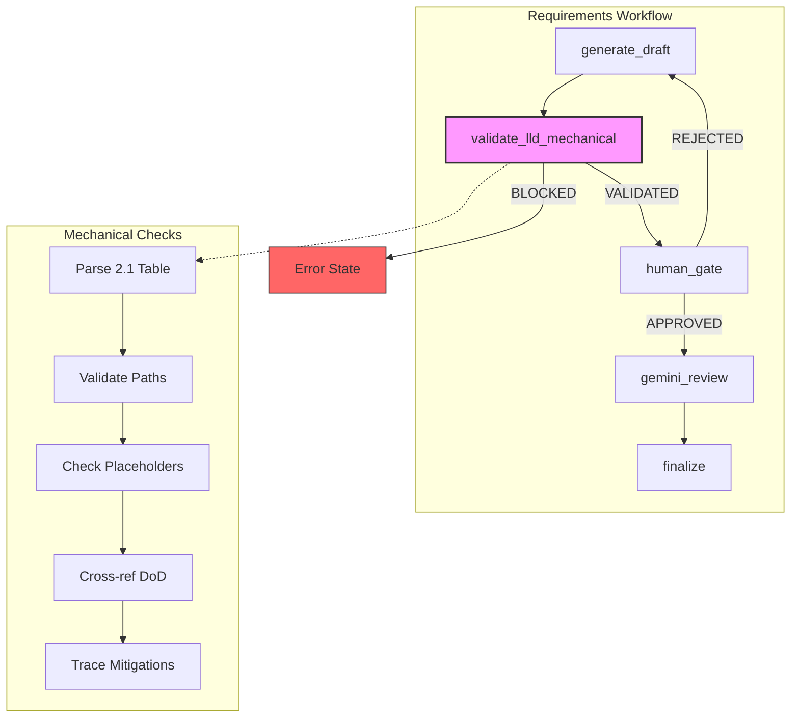

# 1277 - Feature: Mechanical LLD Validation Node

<!-- Template Metadata
Last Updated: 2025-01-XX
Updated By: Issue #277
Update Reason: Initial LLD creation for mechanical validation gate
-->

## 1. Context & Goal
* **Issue:** #277
* **Objective:** Add a mechanical validation node to the LangGraph requirements workflow that catches path/consistency errors before Gemini review
* **Status:** Approved (gemini-3-pro-preview, 2026-02-04)
* **Related Issues:** #272 (LLD that passed review with errors)

### Open Questions
*Questions that need clarification before or during implementation. Remove when resolved.*

- [ ] Should risk mitigation tracing be a warning or hard block initially?
- [ ] Should we validate import paths in pseudocode sections as well?

## 2. Proposed Changes

*This section is the **source of truth** for implementation. Describe exactly what will be built.*

### 2.1 Files Changed

| File | Change Type | Description |
|------|-------------|-------------|
| `agentos/workflows/requirements/nodes/validate_mechanical.py` | Add | New mechanical validation node |
| `agentos/workflows/requirements/graph.py` | Modify | Insert validation node before review |
| `agentos/workflows/requirements/state.py` | Modify | Add validation_errors field to state |
| `docs/templates/0102-feature-lld-template.md` | Modify | Add sections 2.1.1 and 12.1 |
| `docs/templates/0702c-gemini-review-prompt.md` | Modify | Update Gemini instructions |
| `tests/unit/test_validate_mechanical.py` | Add | Unit tests for validation node |

### 2.1.1 Path Validation (Mechanical - Auto-Checked)

Before Gemini review, paths are verified programmatically:
- All "Modify" files must exist in repository
- All "Add" files must have existing parent directories  
- All "Delete" files must exist in repository
- No placeholder prefixes (`src/`, `lib/`, `app/`) unless directory exists

If validation fails, the LLD is BLOCKED before reaching Gemini.

### 2.2 Dependencies

*No new packages required. Uses standard library pathlib and re modules.*

```toml
# pyproject.toml additions (if any)
# None - uses existing dependencies
```

### 2.3 Data Structures

```python
# Pseudocode - NOT implementation
class FileEntry(TypedDict):
    path: str           # File path from table
    change_type: str    # Add | Modify | Delete
    description: str    # Brief description from table

class ValidationResult(TypedDict):
    errors: list[str]          # Hard blockers
    warnings: list[str]        # Non-blocking issues
    files_validated: int       # Count of files checked
    cross_refs_validated: int  # Count of cross-references checked

# Addition to RequirementsWorkflowState
class RequirementsWorkflowState(TypedDict):
    # ... existing fields ...
    validation_errors: list[str]  # NEW: Mechanical validation errors
    validation_warnings: list[str]  # NEW: Mechanical validation warnings
```

### 2.4 Function Signatures

```python
# agentos/workflows/requirements/nodes/validate_mechanical.py

def validate_lld_mechanical(state: RequirementsWorkflowState) -> RequirementsWorkflowState:
    """
    Mechanical validation node - no LLM judgment. Fail hard on errors.
    
    Runs before Gemini review to catch:
    - Invalid file paths
    - Placeholder prefixes
    - Section cross-reference mismatches
    - Risk mitigations without implementation
    """
    ...

def parse_files_changed_table(lld_content: str) -> list[FileEntry]:
    """
    Parse Section 2.1 Files Changed table from LLD markdown.
    
    Returns list of FileEntry dicts with path, change_type, description.
    Raises ValueError if table format is invalid.
    """
    ...

def validate_file_paths(files: list[FileEntry], repo_root: Path) -> list[str]:
    """
    Validate file paths against filesystem.
    
    Returns list of error messages for:
    - Modify/Delete files that don't exist
    - Add files with non-existent parent directories
    """
    ...

def detect_placeholder_prefixes(files: list[FileEntry], repo_root: Path) -> list[str]:
    """
    Detect generic placeholder prefixes that don't match repo structure.
    
    Returns list of error messages for paths using src/, lib/, app/
    when those directories don't exist.
    """
    ...

def extract_files_from_section(lld_content: str, section_header: str) -> set[str]:
    """
    Extract file paths mentioned in a specific section.
    
    Looks for patterns like `path/to/file.py` in backticks or table cells.
    """
    ...

def validate_cross_references(lld_content: str) -> list[str]:
    """
    Validate that files in Definition of Done appear in Files Changed.
    
    Returns list of error messages for files mentioned in DoD but not in 2.1.
    """
    ...

def extract_mitigations_from_risks(lld_content: str) -> list[str]:
    """
    Extract mitigation text from Section 11 Risks & Mitigations table.
    """
    ...

def extract_function_names(lld_content: str) -> list[str]:
    """
    Extract function names from Section 2.4 Function Signatures.
    """
    ...

def trace_mitigations_to_functions(
    mitigations: list[str], 
    functions: list[str]
) -> list[str]:
    """
    Check that each risk mitigation has a corresponding function.
    
    Uses keyword extraction and fuzzy matching.
    Returns list of warning messages (non-blocking).
    """
    ...

def extract_keywords(text: str) -> list[str]:
    """
    Extract significant keywords from mitigation text.
    
    Filters stopwords, normalizes to lowercase.
    """
    ...
```

### 2.5 Logic Flow (Pseudocode)

```
1. Receive state with current_draft and repo_root
2. Initialize errors = [], warnings = []

3. PARSE FILES CHANGED TABLE
   - Extract all rows from Section 2.1
   - IF parsing fails THEN
     - Add error: "Failed to parse Section 2.1 Files Changed table"
     - GOTO step 9

4. VALIDATE FILE PATHS
   FOR each file in parsed_files:
     IF change_type == "Modify" OR change_type == "Delete":
       IF NOT (repo_root / path).exists():
         Add error: "'{path}' marked {change_type} but does not exist"
     ELIF change_type == "Add":
       IF NOT (repo_root / path).parent.exists():
         Add error: "Parent directory for '{path}' does not exist"

5. DETECT PLACEHOLDER PREFIXES
   FOR each file in parsed_files:
     prefix = first segment of path (src/, lib/, app/, etc.)
     IF prefix in KNOWN_PLACEHOLDERS:
       IF NOT (repo_root / prefix).exists():
         Add error: "'{path}' uses '{prefix}/' but that directory doesn't exist"

6. VALIDATE CROSS-REFERENCES
   - Extract files from Definition of Done (Section 12)
   - Extract files from Files Changed (Section 2.1)
   - missing = dod_files - fc_files
   - IF missing:
     Add error: "Section 12 references files not in Section 2.1: {missing}"

7. TRACE RISK MITIGATIONS (warnings only)
   - Extract mitigations from Section 11
   - Extract function names from Section 2.4
   FOR each mitigation:
     keywords = extract_keywords(mitigation)
     IF NOT any keyword matches any function name:
       Add warning: "Section 11 claims '{mitigation}' but no matching function"

8. COMPILE RESULTS
   state["validation_errors"] = errors
   state["validation_warnings"] = warnings

9. DETERMINE OUTCOME
   IF errors:
     state["lld_status"] = "BLOCKED"
     state["error"] = format_error_message(errors, warnings)
   ELSE:
     state["lld_status"] = "VALIDATED"
     IF warnings:
       Log warnings for informational purposes

10. Return state
```

### 2.6 Technical Approach

* **Module:** `agentos/workflows/requirements/nodes/`
* **Pattern:** Functional node pattern (pure function transforming state)
* **Key Decisions:** 
  - Regex-based parsing (no LLM) for deterministic results
  - Hard fail on path errors, soft warn on mitigation tracing
  - Validation runs synchronously before graph continues

### 2.7 Architecture Decisions

| Decision | Options Considered | Choice | Rationale |
|----------|-------------------|--------|-----------|
| Parsing method | LLM parsing, Regex parsing, AST parsing | Regex parsing | Deterministic, zero tokens, fast |
| Error handling | Collect all errors, Fail on first | Collect all errors | Better UX - shows all problems at once |
| Mitigation tracing | Hard block, Soft warning, Skip | Soft warning | Keyword matching is heuristic, may have false positives |
| Node placement | Before human gate, After human gate, Parallel with review | Before human gate | Catch errors before wasting human attention |

**Architectural Constraints:**
- Must integrate with existing LangGraph workflow structure
- Cannot introduce LLM calls (that defeats the purpose)
- Must not break existing workflow if validation passes

## 3. Requirements

*What must be true when this is done. These become acceptance criteria.*

1. Mechanical validation runs automatically before Gemini review in the workflow
2. Invalid paths (Modify/Delete file doesn't exist) produce BLOCKED status with clear error
3. Placeholder prefixes without matching directory produce BLOCKED status
4. Definition of Done / Files Changed mismatches produce BLOCKED status
5. Risk mitigation without implementation produces WARNING (non-blocking)
6. LLD-272's specific errors would be caught by this gate
7. Template updated with new sections 2.1.1 and 12.1
8. Gemini review prompt updated to clarify role division

## 4. Alternatives Considered

| Option | Pros | Cons | Decision |
|--------|------|------|----------|
| Add checks to Gemini prompt | No code changes, immediate | LLMs unreliable for filesystem checks | **Rejected** |
| Pre-commit hook | Runs locally, fast feedback | Doesn't integrate with workflow state | **Rejected** |
| LangGraph node (chosen) | Deterministic, integrated, trackable | Requires code changes | **Selected** |
| Separate CLI tool | Reusable outside workflow | Duplicates workflow logic, harder to maintain | **Rejected** |

**Rationale:** LangGraph node integrates seamlessly with existing workflow, maintains state properly, and can be tested in isolation. The deterministic nature guarantees consistent results.

## 5. Data & Fixtures

### 5.1 Data Sources

| Attribute | Value |
|-----------|-------|
| Source | LLD markdown content from workflow state |
| Format | Markdown with structured tables |
| Size | ~5-20KB per LLD |
| Refresh | Per workflow invocation |
| Copyright/License | N/A - internal documents |

### 5.2 Data Pipeline

```
Workflow State (current_draft) ──regex parse──► Extracted Structures ──validate──► Errors/Warnings ──update──► Workflow State
```

### 5.3 Test Fixtures

| Fixture | Source | Notes |
|---------|--------|-------|
| Valid LLD markdown | Handcrafted | Based on actual LLD-272 structure |
| LLD with bad paths | Handcrafted | src/nodes/... style errors |
| LLD with DoD mismatch | Handcrafted | Files in DoD not in 2.1 |
| LLD with orphan mitigations | Handcrafted | Risk mitigations with no functions |
| Mock repo structure | tempfile/pytest fixtures | Simulates actual directory layout |

### 5.4 Deployment Pipeline

Validation runs in-process as part of the LangGraph workflow. No separate deployment needed.

## 6. Diagram

### 6.1 Mermaid Quality Gate

Before finalizing any diagram, verify in [Mermaid Live Editor](https://mermaid.live) or GitHub preview:

- [x] **Simplicity:** Similar components collapsed (per 0006 §8.1)
- [x] **No touching:** All elements have visual separation (per 0006 §8.2)
- [x] **No hidden lines:** All arrows fully visible (per 0006 §8.3)
- [x] **Readable:** Labels not truncated, flow direction clear
- [ ] **Auto-inspected:** Agent rendered via mermaid.ink and viewed (per 0006 §8.5)

**Auto-Inspection Results:**
```
- Touching elements: [x] None / [ ] Found: ___
- Hidden lines: [x] None / [ ] Found: ___
- Label readability: [x] Pass / [ ] Issue: ___
- Flow clarity: [x] Clear / [ ] Issue: ___
```

### 6.2 Diagram



## 7. Security & Safety Considerations

### 7.1 Security

| Concern | Mitigation | Status |
|---------|------------|--------|
| Path traversal in file checks | Resolve paths relative to repo_root only | Addressed |
| Regex ReDoS | Use simple, bounded regex patterns | Addressed |
| Arbitrary file read | Only checks existence, never reads content | Addressed |

### 7.2 Safety

| Concern | Mitigation | Status |
|---------|------------|--------|
| False positives blocking valid LLDs | Extensive test coverage, clear error messages | Addressed |
| Silent failures | All parsing errors surfaced as validation errors | Addressed |
| Workflow breakage | Graceful degradation if parsing fails | Addressed |

**Fail Mode:** Fail Closed - If validation cannot complete (e.g., unparseable table), the LLD is BLOCKED with explanation.

**Recovery Strategy:** User can fix the LLD and resubmit. No persistent state affected.

## 8. Performance & Cost Considerations

### 8.1 Performance

| Metric | Budget | Approach |
|--------|--------|----------|
| Latency | < 100ms | Pure Python, no I/O except stat() |
| Memory | < 10MB | String processing only |
| API Calls | 0 | No external calls |

**Bottlenecks:** None expected. File existence checks are syscalls, not I/O.

### 8.2 Cost Analysis

| Resource | Unit Cost | Estimated Usage | Monthly Cost |
|----------|-----------|-----------------|--------------|
| Compute | Negligible | < 100ms per run | $0 |
| Gemini tokens saved | ~$0.001 per avoided review | Unknown | Positive ROI |

**Cost Controls:**
- [x] Zero external API calls
- [x] Runs in existing workflow infrastructure

**Worst-Case Scenario:** A pathological LLD with 1000 files would still validate in <1s.

## 9. Legal & Compliance

| Concern | Applies? | Mitigation |
|---------|----------|------------|
| PII/Personal Data | No | Validates structure, not content |
| Third-Party Licenses | No | Standard library only |
| Terms of Service | N/A | Internal tooling |
| Data Retention | N/A | No data persisted |
| Export Controls | N/A | No restricted algorithms |

**Data Classification:** Internal

**Compliance Checklist:**
- [x] No PII stored without consent
- [x] All third-party licenses compatible with project license
- [x] External API usage compliant with provider ToS
- [x] Data retention policy documented

## 10. Verification & Testing

### 10.0 Test Plan (TDD - Complete Before Implementation)

**TDD Requirement:** Tests MUST be written and failing BEFORE implementation begins.

| Test ID | Test Description | Expected Behavior | Status |
|---------|------------------|-------------------|--------|
| T010 | Parse valid files changed table | Returns list of FileEntry | RED |
| T020 | Parse malformed table | Raises ValueError | RED |
| T030 | Validate existing modify path | No error | RED |
| T040 | Validate non-existent modify path | Error message | RED |
| T050 | Validate add with existing parent | No error | RED |
| T060 | Validate add with missing parent | Error message | RED |
| T070 | Detect src/ placeholder | Error when src/ doesn't exist | RED |
| T080 | Allow src/ when exists | No error when src/ exists | RED |
| T090 | Cross-ref DoD matches 2.1 | No error | RED |
| T100 | Cross-ref DoD has extra file | Error message | RED |
| T110 | Mitigation with matching function | No warning | RED |
| T120 | Mitigation without function | Warning message | RED |
| T130 | Full validation pass | State has VALIDATED status | RED |
| T140 | Full validation fail | State has BLOCKED status | RED |

**Coverage Target:** ≥95% for all new code

**TDD Checklist:**
- [ ] All tests written before implementation
- [ ] Tests currently RED (failing)
- [ ] Test IDs match scenario IDs in 10.1
- [ ] Test file created at: `tests/unit/test_validate_mechanical.py`

### 10.1 Test Scenarios

| ID | Scenario | Type | Input | Expected Output | Pass Criteria |
|----|----------|------|-------|-----------------|---------------|
| 010 | Parse valid table | Auto | LLD with proper 2.1 table | list[FileEntry] | Correct file count and fields |
| 020 | Parse malformed table | Auto | LLD with broken markdown | ValueError | Clear error message |
| 030 | Modify file exists | Auto | FileEntry + real file | No error | errors list empty |
| 040 | Modify file missing | Auto | FileEntry + missing file | Error string | Contains path and "does not exist" |
| 050 | Add with valid parent | Auto | FileEntry + existing parent | No error | errors list empty |
| 060 | Add with missing parent | Auto | FileEntry + missing parent | Error string | Contains "Parent directory" |
| 070 | Placeholder detected | Auto | path "src/foo.py", no src/ | Error string | Contains "doesn't exist" |
| 080 | Placeholder allowed | Auto | path "src/foo.py", src/ exists | No error | errors list empty |
| 090 | DoD matches 2.1 | Auto | Consistent LLD | No error | errors list empty |
| 100 | DoD has orphan | Auto | DoD mentions file not in 2.1 | Error string | Contains file name |
| 110 | Mitigation traced | Auto | "token tracking" + track_tokens() | No warning | warnings list empty |
| 120 | Mitigation orphaned | Auto | "token tracking" + no function | Warning string | Contains mitigation text |
| 130 | E2E validation pass | Auto | Valid LLD + mock repo | VALIDATED status | No errors |
| 140 | E2E validation fail | Auto | LLD-272-style errors | BLOCKED status | All errors present |

### 10.2 Test Commands

```bash
# Run all automated tests
poetry run pytest tests/unit/test_validate_mechanical.py -v

# Run with coverage
poetry run pytest tests/unit/test_validate_mechanical.py -v --cov=agentos/workflows/requirements/nodes/validate_mechanical

# Run specific test
poetry run pytest tests/unit/test_validate_mechanical.py::test_parse_valid_table -v
```

### 10.3 Manual Tests (Only If Unavoidable)

N/A - All scenarios automated.

## 11. Risks & Mitigations

| Risk | Impact | Likelihood | Mitigation |
|------|--------|------------|------------|
| Regex doesn't handle all table formats | Med | Med | Test against diverse real LLDs, iterate patterns |
| False positives frustrate users | High | Low | Clear error messages, easy override path |
| Template changes break parsing | Med | Low | Template has version comment, parser checks version |
| Keyword matching misses valid mitigations | Low | Med | Make mitigation tracing a warning, not error |

## 12. Definition of Done

### 12.1 Traceability (Mechanical - Auto-Checked)

- Every file mentioned in this section must appear in Section 2.1
- Every risk mitigation in Section 11 must have corresponding function in Section 2.4

### Code
- [ ] Implementation complete and linted
- [ ] Code comments reference this LLD

### Tests
- [ ] All test scenarios pass
- [ ] Test coverage meets 95% threshold

### Documentation
- [ ] LLD updated with any deviations
- [ ] Implementation Report (0103) completed
- [ ] Test Report (0113) completed if applicable

### Review
- [ ] Code review completed
- [ ] User approval before closing issue

---

## Reviewer Suggestions

*Non-blocking recommendations from the reviewer.*

- **Regex Robustness:** In `parse_files_changed_table`, ensure the regex handles GitHub Markdown table edge cases, such as extra whitespace in cells or escaped pipes `\|` within descriptions, to prevent parser crashes.
- **Warning Visibility:** Ensure `validation_warnings` are prominently displayed in the final output (or PR comment) so the user actually sees the "Risk Mitigation" gaps, otherwise the warning status provides no value.

## Appendix: Review Log

*Track all review feedback with timestamps and implementation status.*

### Review Summary

| Review | Date | Verdict | Key Issue |
|--------|------|---------|-----------|
| 1 | 2026-02-04 | APPROVED | `gemini-3-pro-preview` |
| - | - | - | - |

**Final Status:** APPROVED