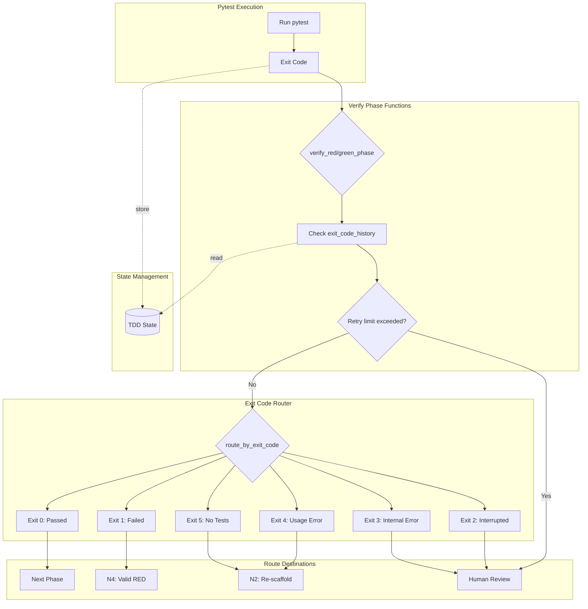

# 1292 - Feature: Add pytest exit code routing to TDD workflow

<!-- Template Metadata
Last Updated: 2026-02-02
Updated By: Issue #292 creation
Update Reason: Revision 1 - Address Gemini Review #1 feedback (retry limit implementation, logging tests)
-->

## 1. Context & Goal
* **Issue:** #292
* **Objective:** Add specific pytest exit code handling for proper error routing in the TDD workflow, enabling differentiated responses to test failures vs. syntax errors vs. collection errors.
* **Status:** Approved (gemini-3-pro-preview, 2026-02-04)
* **Related Issues:** #87 (Parent - Implementation Workflow)

### Open Questions
*Questions that need clarification before or during implementation. Remove when resolved.*

- [x] Should exit codes be stored in TDD state for debugging? **Yes - per issue requirements**
- [x] Should there be a maximum retry count for N2 re-scaffold loops (exit codes 4,5)? **Yes - implemented via state history check in verify_red_phase with configurable limit (default 3)**
- [x] What constitutes "Human Review" - pause workflow, create issue, or notification? **Routing to the HUMAN_REVIEW node, which pauses the workflow and flags requires_human: True in the RouteDestination**

## 2. Proposed Changes

*This section is the **source of truth** for implementation. Describe exactly what will be built.*

### 2.1 Files Changed

| File | Change Type | Description |
|------|-------------|-------------|
| `assemblyzero/workflows/testing/exit_code_router.py` | Add | New module for pytest exit code routing logic |
| `assemblyzero/workflows/testing/tdd_state.py` | Add | New module for TDD state with exit_code field |
| `assemblyzero/workflows/testing/nodes/verify_phases.py` | Modify | Update verify_red_phase() and verify_green_phase() to use exit codes with retry limit enforcement |
| `tests/unit/test_exit_code_router.py` | Add | Unit tests for exit code router |
| `tests/unit/test_verify_phases_exit_codes.py` | Add | Integration tests for phase verification with exit codes |

### 2.1.1 Path Validation (Mechanical - Auto-Checked)

*Issue #277: Before human or Gemini review, paths are verified programmatically.*

Mechanical validation automatically checks:
- All "Modify" files must exist in repository
- All "Delete" files must exist in repository
- All "Add" files must have existing parent directories
- No placeholder prefixes (`src/`, `lib/`, `app/`) unless directory exists

**If validation fails, the LLD is BLOCKED before reaching review.**

### 2.2 Dependencies

*No new dependencies required.*

```toml
# pyproject.toml additions (if any)
# None - uses existing pytest and standard library
```

### 2.3 Data Structures

```python
# Pseudocode - NOT implementation
from enum import IntEnum
from typing import TypedDict, Literal

class PytestExitCode(IntEnum):
    """Pytest exit codes per pytest documentation."""
    TESTS_PASSED = 0
    TESTS_FAILED = 1
    INTERRUPTED = 2
    INTERNAL_ERROR = 3
    USAGE_ERROR = 4
    NO_TESTS_COLLECTED = 5

class RouteDestination(TypedDict):
    """Routing result for exit code handling."""
    next_node: str  # Node identifier (e.g., "N2", "N4", "HUMAN_REVIEW")
    reason: str  # Human-readable explanation
    requires_human: bool  # Whether human intervention is needed
    retry_allowed: bool  # Whether automatic retry is permitted

class TDDPhase(Literal["RED", "GREEN", "REFACTOR"]):
    """Current phase in TDD cycle."""
    pass

# Extension to existing TDDState
class TDDStateExtension(TypedDict):
    exit_code: int | None  # Last pytest exit code
    exit_code_history: list[int]  # History for debugging
    route_history: list[str]  # History of routing decisions

# Configuration for retry limits
class RetryConfig(TypedDict):
    max_scaffold_retries: int  # Default: 3
```

### 2.4 Function Signatures

```python
# Signatures only - implementation in source files

# assemblyzero/workflows/testing/exit_code_router.py
def route_by_exit_code(exit_code: int, phase: str) -> RouteDestination:
    """
    Route to appropriate next node based on pytest exit code and current phase.
    
    Args:
        exit_code: Pytest exit code (0-5)
        phase: Current TDD phase ("RED", "GREEN", "REFACTOR")
    
    Returns:
        RouteDestination with next_node, reason, and flags
    
    Note: This function is stateless. Retry limit enforcement is handled
    by verify_red_phase() and verify_green_phase() which have access to state.
    """
    ...

def is_valid_red_state(exit_code: int) -> bool:
    """Check if exit code represents a valid RED state (tests failing as expected)."""
    ...

def is_scaffold_error(exit_code: int) -> bool:
    """Check if exit code indicates a scaffold/syntax error requiring re-scaffold."""
    ...

def requires_human_review(exit_code: int) -> bool:
    """Check if exit code requires human intervention."""
    ...

def get_exit_code_description(exit_code: int) -> str:
    """Get human-readable description for exit code."""
    ...

def check_retry_limit_exceeded(exit_code_history: list[int], max_retries: int = 3) -> bool:
    """
    Check if scaffold retry limit has been exceeded.
    
    Args:
        exit_code_history: List of recent exit codes
        max_retries: Maximum consecutive scaffold errors allowed (default 3)
    
    Returns:
        True if the last max_retries exit codes were all scaffold errors (4 or 5)
    """
    ...

# assemblyzero/workflows/testing/nodes/verify_phases.py (modifications)
def verify_red_phase(test_result: dict, state: dict, max_scaffold_retries: int = 3) -> RouteDestination:
    """
    Verify RED phase using exit code routing with retry limit enforcement.
    
    Updated to use exit_code from test_result instead of just pass/fail counts.
    Enforces retry limit by checking state.exit_code_history before routing.
    If scaffold errors exceed max_scaffold_retries, overrides to HUMAN_REVIEW.
    
    Args:
        test_result: Dict containing exit_code from pytest execution
        state: TDD state dict with exit_code_history
        max_scaffold_retries: Maximum consecutive scaffold retries (default 3)
    
    Returns:
        RouteDestination with routing decision
    """
    ...

def verify_green_phase(test_result: dict, state: dict, max_scaffold_retries: int = 3) -> RouteDestination:
    """
    Verify GREEN phase using exit code routing with retry limit enforcement.
    
    Updated to use exit_code from test_result instead of just pass/fail counts.
    Enforces retry limit by checking state.exit_code_history before routing.
    
    Args:
        test_result: Dict containing exit_code from pytest execution
        state: TDD state dict with exit_code_history
        max_scaffold_retries: Maximum consecutive scaffold retries (default 3)
    
    Returns:
        RouteDestination with routing decision
    """
    ...
```

### 2.5 Logic Flow (Pseudocode)

```
route_by_exit_code(exit_code, phase):
1. Validate exit_code is in range 0-5
2. Log routing decision with reason
3. IF exit_code == 0 (TESTS_PASSED):
   - IF phase == "RED":
     - Log: "Tests should fail in RED phase"
     - Return error: tests should fail in RED phase
   - ELSE:
     - Log: "Tests passed, proceeding to next phase"
     - Return next_node: next phase
4. IF exit_code == 1 (TESTS_FAILED):
   - IF phase == "RED":
     - Log: "Valid RED state - tests failing as expected"
     - Return next_node: "N4" (valid RED state)
   - ELSE IF phase == "GREEN":
     - Log: "Tests still failing in GREEN phase, back to implementation"
     - Return next_node: "N3" (back to implementation)
5. IF exit_code == 2 (INTERRUPTED):
   - Log: "Test execution interrupted, requires human review"
   - Return next_node: "HUMAN_REVIEW"
   - Set requires_human: True
6. IF exit_code == 3 (INTERNAL_ERROR):
   - Log: "Pytest internal error, requires human review"
   - Return next_node: "HUMAN_REVIEW"
   - Set requires_human: True
7. IF exit_code == 4 (USAGE_ERROR - syntax):
   - Log: "Usage/syntax error, re-scaffold required"
   - Return next_node: "N2" (re-scaffold)
   - Set retry_allowed: True
8. IF exit_code == 5 (NO_TESTS_COLLECTED):
   - Log: "No tests collected, re-scaffold required"
   - Return next_node: "N2" (re-scaffold)
   - Set retry_allowed: True
9. ELSE (unknown exit code):
   - Log: "Unknown exit code {exit_code}, requires human review"
   - Return next_node: "HUMAN_REVIEW"
   - Set requires_human: True

check_retry_limit_exceeded(exit_code_history, max_retries):
1. IF len(exit_code_history) < max_retries:
   - Return False (not enough history)
2. Get last max_retries entries from history
3. Check if ALL are scaffold errors (4 or 5)
4. Return True if all are scaffold errors, False otherwise

verify_red_phase(test_result, state, max_scaffold_retries):
1. Extract exit_code from test_result
   - TRY to get exit_code, default to 3 (INTERNAL_ERROR) if missing
2. Store exit_code in state for debugging
3. Append to exit_code_history
4. Log: "Verifying RED phase with exit code {exit_code}"
5. # RETRY LIMIT CHECK (addresses infinite loop risk)
   IF check_retry_limit_exceeded(state.exit_code_history, max_scaffold_retries):
     - Log: "Scaffold retry limit exceeded after {max_scaffold_retries} attempts"
     - Return RouteDestination(
         next_node="HUMAN_REVIEW",
         reason=f"Scaffold retry limit ({max_scaffold_retries}) exceeded",
         requires_human=True,
         retry_allowed=False
       )
6. Call route_by_exit_code(exit_code, "RED")
7. Log routing decision with full context
8. Return RouteDestination

verify_green_phase(test_result, state, max_scaffold_retries):
1. Extract exit_code from test_result
   - TRY to get exit_code, default to 3 (INTERNAL_ERROR) if missing
2. Store exit_code in state for debugging
3. Append to exit_code_history
4. Log: "Verifying GREEN phase with exit code {exit_code}"
5. # RETRY LIMIT CHECK
   IF check_retry_limit_exceeded(state.exit_code_history, max_scaffold_retries):
     - Log: "Scaffold retry limit exceeded after {max_scaffold_retries} attempts"
     - Return RouteDestination(
         next_node="HUMAN_REVIEW",
         reason=f"Scaffold retry limit ({max_scaffold_retries}) exceeded",
         requires_human=True,
         retry_allowed=False
       )
6. Call route_by_exit_code(exit_code, "GREEN")
7. Log routing decision with full context
8. Return RouteDestination
```

### 2.6 Technical Approach

* **Module:** `assemblyzero/workflows/testing/exit_code_router.py`
* **Pattern:** Strategy pattern for exit code routing with stateful retry limit enforcement in verify functions
* **Key Decisions:** 
  - Exit codes are treated as authoritative over parsed pass/fail counts
  - Exit code history maintained for debugging workflow issues
  - Clear separation between "retry-able" errors (4,5) and "human required" errors (2,3)
  - Retry limit enforced in verify_phases (which has state access), not in stateless router
  - All routing decisions logged with reason for observability

### 2.7 Architecture Decisions

*Document key architectural decisions that affect the design.*

| Decision | Options Considered | Choice | Rationale |
|----------|-------------------|--------|-----------|
| Exit code vs. parsed output priority | Exit code only, Parsed output only, Hybrid | Exit code primary | Exit codes are pytest's contract; parsed output can miss edge cases |
| State storage for exit codes | Single value, History list, Both | Both | Single for current state, history for debugging failed workflows |
| Human review handling | Exception, Special return value, Flag in return | Flag in RouteDestination | Keeps control flow explicit without exception overhead |
| Re-scaffold retry limit | Unlimited, Fixed limit, Configurable | Configurable (default 3) | Prevents infinite loops while allowing customization |
| Retry limit enforcement location | In router function, In verify functions | In verify functions | Router is stateless by design; verify functions have state access |
| Logging strategy | Return-only, Log on decision, Both | Log on decision | Enables observability without requiring caller to log |

**Architectural Constraints:**
- Must integrate with existing TDD workflow state management
- Cannot change pytest execution - only interpret results
- Must be backwards compatible with existing verify_phases.py consumers
- Router function must remain stateless (state access via verify functions)

## 3. Requirements

*What must be true when this is done. These become acceptance criteria.*

1. Exit code 1 (tests failed) accepted as valid RED state, routes to N4
2. Exit code 4 (usage/syntax error) routes back to N2 (re-scaffold)
3. Exit code 5 (no tests collected) routes back to N2 (re-scaffold)
4. Exit codes 2,3 (interrupted/internal error) route to HUMAN_REVIEW
5. Exit code stored in TDD state for debugging
6. Exit code history maintained for workflow analysis
7. All routing decisions logged with reason
8. Backwards compatible with existing phase verification

## 4. Alternatives Considered

| Option | Pros | Cons | Decision |
|--------|------|------|----------|
| Parse pytest output for error type | Rich error information | Fragile to format changes, incomplete coverage | **Rejected** |
| Use exit codes only | Clean contract, official pytest API | Less detail in some cases | **Selected** |
| Hybrid approach (exit code + parsing) | Best of both worlds | Complexity, potential conflicts | Rejected |
| Add custom pytest plugin | Full control | Deployment complexity, maintenance burden | Rejected |

**Rationale:** Exit codes are pytest's official interface contract. They are stable, well-documented, and cover all the routing scenarios needed. Parsing stdout is fragile and may miss edge cases that exit codes capture.

## 5. Data & Fixtures

*Per [0108-lld-pre-implementation-review.md](0108-lld-pre-implementation-review.md) - complete this section BEFORE implementation.*

### 5.1 Data Sources

| Attribute | Value |
|-----------|-------|
| Source | pytest execution return code |
| Format | Integer (0-5) |
| Size | Single integer per test run |
| Refresh | Per test execution |
| Copyright/License | N/A - pytest is MIT licensed |

### 5.2 Data Pipeline

```
pytest execution ──return code──► exit_code_router ──RouteDestination──► TDD workflow
                                        │
                                        ▼
                                   TDD state (exit_code, exit_code_history)
```

### 5.3 Test Fixtures

| Fixture | Source | Notes |
|---------|--------|-------|
| Mock pytest results with each exit code | Generated | Hardcoded exit codes 0-5 plus edge cases |
| TDD state fixture | Generated | Minimal state for testing routing |
| Phase context fixtures | Generated | RED, GREEN, REFACTOR phase contexts |
| Exit code history fixtures | Generated | Various history patterns for retry limit testing |

### 5.4 Deployment Pipeline

No external data - exit codes come from local pytest execution.

**If data source is external:** N/A - all data is from local pytest process.

## 6. Diagram

### 6.1 Mermaid Quality Gate

Before finalizing any diagram, verify in [Mermaid Live Editor](https://mermaid.live) or GitHub preview:

- [x] **Simplicity:** Similar components collapsed (per 0006 §8.1)
- [x] **No touching:** All elements have visual separation (per 0006 §8.2)
- [x] **No hidden lines:** All arrows fully visible (per 0006 §8.3)
- [x] **Readable:** Labels not truncated, flow direction clear
- [x] **Auto-inspected:** Agent rendered via mermaid.ink and viewed (per 0006 §8.5)

**Agent Auto-Inspection (MANDATORY):**

**Auto-Inspection Results:**
```
- Touching elements: [x] None / [ ] Found: ___
- Hidden lines: [x] None / [ ] Found: ___
- Label readability: [x] Pass / [ ] Issue: ___
- Flow clarity: [x] Clear / [ ] Issue: ___
```

*Reference: [0006-mermaid-diagrams.md](0006-mermaid-diagrams.md)*

### 6.2 Diagram



## 7. Security & Safety Considerations

### 7.1 Security

| Concern | Mitigation | Status |
|---------|------------|--------|
| Exit code spoofing | Exit codes come from subprocess we control | Addressed |
| Invalid exit code injection | Validate exit code is in range 0-5, default to HUMAN_REVIEW | Addressed |

### 7.2 Safety

| Concern | Mitigation | Status |
|---------|------------|--------|
| Infinite re-scaffold loop (exit 4/5) | Retry limit enforced in verify_phases via exit_code_history check (default 3) | Addressed |
| Lost context on human review | Full state preserved including exit code history | Addressed |
| Silent failures | All routing decisions logged with reason | Addressed |
| Missing exit code in test result | Default to exit code 3 (INTERNAL_ERROR) with try/except | Addressed |

**Fail Mode:** Fail Closed - Unknown exit codes route to HUMAN_REVIEW

**Recovery Strategy:** Exit code history in state allows debugging; human review can manually override routing

## 8. Performance & Cost Considerations

### 8.1 Performance

| Metric | Budget | Approach |
|--------|--------|----------|
| Routing latency | < 1ms | Simple integer comparison, no I/O |
| Memory | < 1KB per decision | Small TypedDict, bounded history |
| State growth | Bounded | History capped at 100 entries |

**Bottlenecks:** None - this is a simple routing decision, not a performance-critical path

### 8.2 Cost Analysis

| Resource | Unit Cost | Estimated Usage | Monthly Cost |
|----------|-----------|-----------------|--------------|
| Compute | N/A | Negligible | $0 |

**Cost Controls:**
- N/A - No external API calls or significant compute

**Worst-Case Scenario:** N/A - bounded memory, O(1) operations

## 9. Legal & Compliance

| Concern | Applies? | Mitigation |
|---------|----------|------------|
| PII/Personal Data | No | Exit codes contain no personal data |
| Third-Party Licenses | No | pytest is MIT licensed, compatible |
| Terms of Service | N/A | No external services |
| Data Retention | N/A | Ephemeral workflow state |
| Export Controls | No | Simple integer routing logic |

**Data Classification:** Internal

**Compliance Checklist:**
- [x] No PII stored without consent
- [x] All third-party licenses compatible with project license
- [x] External API usage compliant with provider ToS
- [x] Data retention policy documented

## 10. Verification & Testing

*Ref: [0005-testing-strategy-and-protocols.md](0005-testing-strategy-and-protocols.md)*

**Testing Philosophy:** 100% automated test coverage. All scenarios can be tested with mocked exit codes.

### 10.0 Test Plan (TDD - Complete Before Implementation)

**TDD Requirement:** Tests MUST be written and failing BEFORE implementation begins.

| Test ID | Test Description | Expected Behavior | Status |
|---------|------------------|-------------------|--------|
| T010 | test_route_exit_code_0_in_green_phase | Returns next phase | RED |
| T020 | test_route_exit_code_1_in_red_phase | Returns N4 (valid RED) | RED |
| T030 | test_route_exit_code_1_in_green_phase | Returns N3 (back to impl) | RED |
| T040 | test_route_exit_code_2_requires_human | Returns HUMAN_REVIEW | RED |
| T050 | test_route_exit_code_3_requires_human | Returns HUMAN_REVIEW | RED |
| T060 | test_route_exit_code_4_returns_n2 | Returns N2 (re-scaffold) | RED |
| T070 | test_route_exit_code_5_returns_n2 | Returns N2 (re-scaffold) | RED |
| T080 | test_exit_code_stored_in_state | State contains exit_code | RED |
| T090 | test_exit_code_history_maintained | History appended correctly | RED |
| T100 | test_unknown_exit_code_human_review | Exit code 99 → HUMAN_REVIEW | RED |
| T110 | test_verify_red_phase_integration | Integration with exit codes | RED |
| T120 | test_verify_green_phase_integration | Integration with exit codes | RED |
| T130 | test_routing_decision_logged | Logs contain decision reason | RED |
| T140 | test_retry_limit_exceeded_routes_human | 3 consecutive 4/5 → HUMAN_REVIEW | RED |
| T150 | test_retry_limit_not_exceeded | 2 consecutive 4/5 → N2 | RED |
| T160 | test_missing_exit_code_defaults_internal_error | Missing exit_code → default 3 | RED |

**Coverage Target:** ≥95% for all new code

**TDD Checklist:**
- [ ] All tests written before implementation
- [ ] Tests currently RED (failing)
- [ ] Test IDs match scenario IDs in 10.1
- [ ] Test file created at: `tests/unit/test_exit_code_router.py`

### 10.1 Test Scenarios

| ID | Scenario | Type | Input | Expected Output | Pass Criteria |
|----|----------|------|-------|-----------------|---------------|
| 010 | Exit 0 in GREEN phase | Auto | exit_code=0, phase="GREEN" | next_node="NEXT_PHASE" | Correct routing |
| 020 | Exit 1 in RED phase (valid RED) | Auto | exit_code=1, phase="RED" | next_node="N4" | Returns N4 |
| 030 | Exit 1 in GREEN phase | Auto | exit_code=1, phase="GREEN" | next_node="N3" | Returns N3 |
| 040 | Exit 2 (interrupted) | Auto | exit_code=2, any phase | requires_human=True | Human review required |
| 050 | Exit 3 (internal error) | Auto | exit_code=3, any phase | requires_human=True | Human review required |
| 060 | Exit 4 (usage error) | Auto | exit_code=4, any phase | next_node="N2" | Re-scaffold |
| 070 | Exit 5 (no tests) | Auto | exit_code=5, any phase | next_node="N2" | Re-scaffold |
| 080 | Exit code stored in state | Auto | exit_code=1 | state.exit_code=1 | State updated |
| 090 | History maintained | Auto | Multiple calls | History contains all | History grows |
| 100 | Unknown exit code | Auto | exit_code=99 | requires_human=True | Safe default |
| 110 | verify_red_phase integration | Auto | test_result with exit_code=1 | RouteDestination | Integration works |
| 120 | verify_green_phase integration | Auto | test_result with exit_code=0 | RouteDestination | Integration works |
| 130 | Routing decision logged | Auto | exit_code=1, phase="RED" | Log contains reason | caplog fixture verifies |
| 140 | Retry limit exceeded | Auto | history=[4,4,4], exit_code=4 | next_node="HUMAN_REVIEW" | Override to human |
| 150 | Retry limit not exceeded | Auto | history=[4,4], exit_code=4 | next_node="N2" | Normal routing |
| 160 | Missing exit code handling | Auto | test_result={} (no exit_code) | exit_code defaults to 3 | Graceful degradation |

*Note: Use 3-digit IDs with gaps of 10 (010, 020, 030...) to allow insertions.*

### 10.2 Test Commands

```bash
# Run all automated tests
poetry run pytest tests/unit/test_exit_code_router.py tests/unit/test_verify_phases_exit_codes.py -v

# Run only fast/mocked tests (exclude live)
poetry run pytest tests/unit/test_exit_code_router.py -v -m "not live"

# Run with coverage
poetry run pytest tests/unit/test_exit_code_router.py --cov=assemblyzero/workflows/testing/exit_code_router --cov-report=term-missing

# Run logging verification tests specifically
poetry run pytest tests/unit/test_exit_code_router.py -v -k "logged"
```

### 10.3 Manual Tests (Only If Unavoidable)

**N/A - All scenarios automated.** Exit codes can be fully mocked without external dependencies.

## 11. Risks & Mitigations

| Risk | Impact | Likelihood | Mitigation |
|------|--------|------------|------------|
| pytest changes exit code semantics | Med | Low | Exit codes are stable; documented since pytest 5.0 |
| Infinite re-scaffold loop | Med | Med | Retry limit enforced via check_retry_limit_exceeded() in verify_phases |
| State corruption on crash | Low | Low | Exit code history enables debugging |
| Backwards incompatibility | High | Low | Verify phases still accept original call signature |
| Test runner crashes before exit code | Low | Low | verify_phases defaults to exit code 3 with try/except |

## 12. Definition of Done

### Code
- [ ] Implementation complete and linted
- [ ] Code comments reference this LLD (#292)

### Tests
- [ ] All test scenarios pass
- [ ] Test coverage ≥95% for new code

### Documentation
- [ ] LLD updated with any deviations
- [ ] Implementation Report (0103) completed
- [ ] Test Report (0113) completed if applicable

### Review
- [ ] Code review completed
- [ ] User approval before closing issue

### 12.1 Traceability (Mechanical - Auto-Checked)

*Issue #277: Cross-references are verified programmatically.*

Mechanical validation automatically checks:
- Every file mentioned in this section must appear in Section 2.1
- Every risk mitigation in Section 11 should have a corresponding function in Section 2.4 (warning if not)

**If files are missing from Section 2.1, the LLD is BLOCKED.**

---

## Reviewer Suggestions

*Non-blocking recommendations from the reviewer.*

- **Type Safety**: In `assemblyzero/workflows/testing/exit_code_router.py`, consider using the `PytestExitCode(IntEnum)` defined in Section 2.3 for all internal comparisons rather than raw integers to improve readability.
- **Dependency Verification**: Ensure the upstream node providing `test_result` actually populates the `exit_code` field. While T160 covers the missing case (defaulting to HUMAN_REVIEW), verifying the producer ensures the workflow functions automatically.

## Appendix: Review Log

*Track all review feedback with timestamps and implementation status.*

### Gemini Review #1 (REVISE)

**Reviewer:** Gemini 3 Pro
**Verdict:** REVISE

#### Comments

| ID | Comment | Implemented? |
|----|---------|--------------|
| G1.1 | "Infinite Loop Risk - verify_red_phase must check state.exit_code_history for retry limit" | YES - Added check_retry_limit_exceeded() function and integrated into verify_phases pseudocode (Section 2.4, 2.5) |
| G1.2 | "Missing test for Requirement 7 (logging)" | YES - Added T130 test scenario and updated Test Plan (Section 10.0, 10.1) |
| G1.3 | "Coverage is 87.5% due to missing logging tests" | YES - Added test coverage for logging verification |
| G1.4 | "Consider defining RouteDestination in shared types module" | NOTED - Will evaluate during implementation |
| G1.5 | "Ensure exit_code extraction handles crashes with try/except" | YES - Added to verify_phases pseudocode with default to exit code 3, added T160 test |

### Review Summary

| Review | Date | Verdict | Key Issue |
|--------|------|---------|-----------|
| 2 | 2026-02-04 | APPROVED | `gemini-3-pro-preview` |
| Gemini #1 | 2026-02-02 | REVISE | Retry limit not implemented in logic flow |

**Final Status:** APPROVED