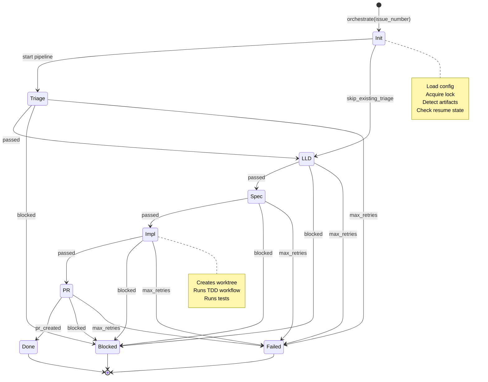

# 305 - Feature: End-to-End Orchestration Workflow (Issue → Code)

<!-- Template Metadata
Last Updated: 2026-02-16
Updated By: LLD Generation
Update Reason: Fixed mechanical validation errors - corrected test coverage mapping for all requirements
-->

## 1. Context & Goal
* **Issue:** #305
* **Objective:** Create a meta-workflow that orchestrates the complete pipeline from GitHub issue to merged PR, stitching together triage, LLD, implementation spec, and implementation workflows
* **Status:** Approved (gemini-3-pro-preview, 2026-02-16)
* **Related Issues:** #304 (Implementation Readiness Review), #139 (testing → implementation rename)

### Open Questions

- [ ] Should the orchestrator support running multiple issues in parallel (batch mode)?
- [ ] What's the retry strategy for external service failures (GitHub API, LLM providers)?
- [ ] Should stage artifacts be stored in worktree or separate orchestration directory?

## 2. Proposed Changes

*This section is the **source of truth** for implementation. Describe exactly what will be built.*

### 2.1 Files Changed

| File | Change Type | Description |
|------|-------------|-------------|
| `assemblyzero/workflows/orchestrator/` | Add (Directory) | New orchestrator workflow module directory |
| `assemblyzero/workflows/orchestrator/__init__.py` | Add | Module initialization, exports |
| `assemblyzero/workflows/orchestrator/graph.py` | Add | LangGraph meta-graph orchestrating sub-workflows |
| `assemblyzero/workflows/orchestrator/state.py` | Add | OrchestrationState TypedDict and state management |
| `assemblyzero/workflows/orchestrator/config.py` | Add | OrchestratorConfig schema with stage settings |
| `assemblyzero/workflows/orchestrator/stages.py` | Add | Stage execution logic for each sub-workflow |
| `assemblyzero/workflows/orchestrator/artifacts.py` | Add | Artifact detection and path management |
| `assemblyzero/workflows/orchestrator/resume.py` | Add | Resume-from-stage logic and state persistence |
| `tools/orchestrate.py` | Add | CLI entry point for orchestration |
| `tests/unit/test_orchestrator_state.py` | Add | Unit tests for state management |
| `tests/unit/test_orchestrator_stages.py` | Add | Unit tests for stage execution |
| `tests/unit/test_orchestrator_config.py` | Add | Unit tests for configuration |
| `tests/unit/test_orchestrator_artifacts.py` | Add | Unit tests for artifact detection |
| `tests/integration/test_orchestrator_graph.py` | Add | Integration tests for full graph |

### 2.1.1 Path Validation (Mechanical - Auto-Checked)

*Issue #277: Before human or Gemini review, paths are verified programmatically.*

Mechanical validation automatically checks:
- All "Modify" files must exist in repository
- All "Delete" files must exist in repository
- All "Add" files must have existing parent directories
- No placeholder prefixes (`src/`, `lib/`, `app/`) unless directory exists

**Parent Directory Validation:**
- `assemblyzero/workflows/` exists ✓ → can create `orchestrator/` directory
- `tools/` exists ✓ → can add `orchestrate.py`
- `tests/unit/` exists ✓ → can add test files
- `tests/integration/` exists ✓ → can add integration test

**If validation fails, the LLD is BLOCKED before reaching review.**

### 2.2 Dependencies

*New packages, APIs, or services required.*

```toml
# pyproject.toml additions (if any)
# No new dependencies - uses existing langgraph, pydantic, typer
```

### 2.3 Data Structures

```python
# Pseudocode - NOT implementation

class StageResult(TypedDict):
    """Result of executing a single stage."""
    status: Literal["passed", "blocked", "failed", "skipped"]
    artifact_path: str | None
    error_message: str | None
    duration_seconds: float
    attempts: int

class OrchestrationState(TypedDict):
    """Full orchestration pipeline state."""
    issue_number: int
    current_stage: Literal["triage", "lld", "spec", "impl", "pr", "done"]
    
    # Artifacts produced at each stage
    issue_brief_path: str | None
    lld_path: str | None
    spec_path: str | None
    worktree_path: str | None
    pr_url: str | None
    
    # Progress tracking
    stage_results: dict[str, StageResult]
    stage_attempts: dict[str, int]
    
    # Timing
    started_at: str  # ISO8601
    stage_started_at: str | None
    completed_at: str | None
    
    # Configuration snapshot
    config: OrchestratorConfig

class StageConfig(TypedDict):
    """Configuration for a single stage."""
    drafter: str  # e.g., "claude:opus-4.5"
    reviewer: str  # e.g., "gemini:3-pro-preview"
    max_revisions: int
    timeout_seconds: int

class OrchestratorConfig(TypedDict):
    """Full orchestrator configuration."""
    # Skip stages for issues with existing artifacts
    skip_existing_lld: bool
    skip_existing_spec: bool
    
    # Stage-specific settings
    stages: dict[str, StageConfig]
    
    # Human gates
    gates: dict[str, bool]  # stage_name -> requires_human_approval
    
    # Retry settings
    max_stage_retries: int
    retry_delay_seconds: int

class OrchestrationResult(TypedDict):
    """Final result of orchestration."""
    success: bool
    issue_number: int
    pr_url: str | None
    final_stage: str
    total_duration_seconds: float
    stage_results: dict[str, StageResult]
    error_summary: str | None
```

### 2.4 Function Signatures

```python
# assemblyzero/workflows/orchestrator/graph.py

def create_orchestration_graph() -> StateGraph:
    """Create LangGraph StateGraph for orchestration pipeline."""
    ...

def orchestrate(
    issue_number: int,
    config: OrchestratorConfig | None = None,
    resume_from: str | None = None,
    dry_run: bool = False
) -> OrchestrationResult:
    """
    Run full pipeline from issue to PR.
    
    Args:
        issue_number: GitHub issue number to process
        config: Override default configuration
        resume_from: Stage name to resume from (uses persisted state)
        dry_run: If True, show planned stages without execution
    
    Returns:
        OrchestrationResult with final status and artifacts
    """
    ...

# assemblyzero/workflows/orchestrator/stages.py

def run_triage_stage(state: OrchestrationState) -> OrchestrationState:
    """Execute issue triage workflow."""
    ...

def run_lld_stage(state: OrchestrationState) -> OrchestrationState:
    """Execute LLD generation and review workflow."""
    ...

def run_spec_stage(state: OrchestrationState) -> OrchestrationState:
    """Execute implementation spec workflow."""
    ...

def run_impl_stage(state: OrchestrationState) -> OrchestrationState:
    """Execute implementation workflow (TDD)."""
    ...

def run_pr_stage(state: OrchestrationState) -> OrchestrationState:
    """Create and submit PR."""
    ...

# assemblyzero/workflows/orchestrator/artifacts.py

def detect_existing_artifacts(issue_number: int) -> dict[str, str | None]:
    """
    Scan for existing artifacts for an issue.
    
    Returns:
        Dict mapping stage names to artifact paths, or None if not found
    """
    ...

def get_artifact_path(issue_number: int, artifact_type: str) -> Path:
    """Get canonical path for an artifact type."""
    ...

def validate_artifact(path: Path, artifact_type: str) -> bool:
    """Validate that artifact exists and has required structure."""
    ...

# assemblyzero/workflows/orchestrator/resume.py

def save_orchestration_state(state: OrchestrationState) -> Path:
    """Persist state to disk for resume capability."""
    ...

def load_orchestration_state(issue_number: int) -> OrchestrationState | None:
    """Load persisted state for an issue, if exists."""
    ...

def determine_resume_stage(
    state: OrchestrationState,
    resume_from: str | None
) -> str:
    """Determine which stage to resume from."""
    ...

def acquire_orchestration_lock(issue_number: int) -> bool:
    """Acquire lock file to prevent concurrent runs. Returns True if acquired."""
    ...

def release_orchestration_lock(issue_number: int) -> None:
    """Release lock file for an issue."""
    ...

# assemblyzero/workflows/orchestrator/config.py

def load_config(overrides: dict | None = None) -> OrchestratorConfig:
    """Load orchestrator configuration with optional overrides."""
    ...

def get_default_config() -> OrchestratorConfig:
    """Return default orchestrator configuration."""
    ...

def validate_config(config: OrchestratorConfig) -> list[str]:
    """Validate configuration, return list of errors."""
    ...

# tools/orchestrate.py

def report_progress(state: OrchestrationState) -> None:
    """Report current stage, duration, and artifacts to stdout."""
    ...

def format_error_message(stage_result: StageResult) -> str:
    """Format actionable error message with context."""
    ...
```

### 2.5 Logic Flow (Pseudocode)

```
orchestrate(issue_number, config, resume_from, dry_run):
    1. Load or create configuration
    2. Acquire lock for issue_number
       IF lock not acquired:
           - Raise ConcurrentOrchestrationError
    
    3. Check for existing orchestration state
       IF resume_from specified:
           - Load persisted state
           - Validate resume_from is valid stage
       ELSE:
           - Create fresh state
           - Detect existing artifacts
           - Skip stages with valid artifacts (if configured)
    
    4. IF dry_run:
           - Calculate planned stages
           - Print stage plan with skip/execute status
           - Release lock
           - Return without execution
    
    5. Create LangGraph with stage nodes
    
    6. FOR each stage in [triage, lld, spec, impl, pr]:
       a. Check if stage should be skipped (existing artifact)
       b. Check for human gate before stage
          IF gate enabled AND not auto-approved:
              - Prompt for approval
              - IF rejected: BLOCK and return
       
       c. Report progress (current stage, duration, artifacts)
       
       d. Execute stage with retry logic:
          FOR attempt in range(max_retries):
              - Run stage workflow
              - Persist state after each attempt
              IF stage.status == "passed":
                  - Record artifact path
                  - BREAK to next stage
              ELIF stage.status == "blocked":
                  - Record blocker details
                  - Release lock
                  - Return with BLOCKED status
              ELSE (failed):
                  - Format actionable error message
                  - Log failure with context
                  - Sleep retry_delay
                  - Continue retry loop
          
          IF all retries exhausted:
              - Release lock
              - Return with FAILED status and actionable error
       
       e. Persist state after successful stage
    
    7. All stages complete:
       - Set completed_at timestamp
       - Persist final state
       - Release lock
       - Return success result with PR URL

Stage: triage
    1. Check if issue already has triaged brief
    2. IF exists AND skip_existing: SKIP
    3. ELSE: Run requirements workflow type=issue
    4. Return artifact path

Stage: lld
    1. Check if LLD exists for issue
    2. IF exists AND skip_existing: SKIP
    3. ELSE: Run requirements workflow type=lld
    4. Validate LLD has APPROVED status
    5. Return artifact path

Stage: spec
    1. Check if impl spec exists
    2. IF exists AND skip_existing: SKIP
    3. ELSE: Run implementation spec workflow
    4. Validate spec has APPROVED status
    5. Return artifact path

Stage: impl
    1. Ensure worktree exists or create it
    2. Run implementation workflow
    3. Verify tests pass
    4. Return worktree path

Stage: pr
    1. Check for human gate (default: enabled)
    2. Create PR using commit-push-pr skill
    3. Return PR URL
```

### 2.6 Technical Approach

* **Module:** `assemblyzero/workflows/orchestrator/`
* **Pattern:** LangGraph StateGraph with linear pipeline, retry decorator on nodes
* **Key Decisions:**
  - Use LangGraph for consistency with existing workflows
  - State persistence to JSON for simplicity and debuggability
  - Modular stage functions that wrap existing workflow invocations
  - CLI follows existing `tools/` patterns (typer, --dry-run support)

### 2.7 Architecture Decisions

| Decision | Options Considered | Choice | Rationale |
|----------|-------------------|--------|-----------|
| Orchestration framework | Custom Python, LangGraph, Prefect | LangGraph | Consistency with existing workflows, built-in state management |
| State persistence | SQLite, JSON files, Redis | JSON files | Simple, debuggable, no new dependencies |
| Sub-workflow invocation | Import functions, subprocess calls | Import functions | Faster, better error handling, shared context |
| Human gates | Interactive prompts, webhooks, config flags | Config flags + prompts | Simple default, extensible for automation |
| Concurrency control | File locks, database locks, none | File locks | Simple, no external dependencies, prevents data corruption |

**Architectural Constraints:**
- Must work within existing worktree workflow (branch per issue)
- Cannot modify existing workflow contracts/outputs
- Must support both interactive and CI/automated execution

## 3. Requirements

*What must be true when this is done. These become acceptance criteria.*

1. Single `orchestrate --issue N` command processes issue from creation to PR
2. Pipeline handles existing artifacts (skips stages with completed work)
3. State persists between runs to allow resume after failure
4. Human gates configurable at any stage transition
5. Dry-run mode shows planned execution without running stages
6. Clear progress reporting shows current stage, duration, and artifacts
7. Failed stages report actionable error messages with context
8. Resume-from flag allows skipping to specific stage
9. Concurrent orchestration of same issue prevented via lock file

## 4. Alternatives Considered

| Option | Pros | Cons | Decision |
|--------|------|------|----------|
| Monolithic script | Simple, single file | Hard to test, no state management | **Rejected** |
| LangGraph pipeline | Consistent patterns, state built-in | Complexity for linear flow | **Selected** |
| Prefect/Airflow | Production orchestration features | Heavy dependency, overkill for single-issue | **Rejected** |
| Make/shell scripts | Simple, familiar | No state persistence, poor error handling | **Rejected** |

**Rationale:** LangGraph provides the right balance of structure and simplicity. It matches existing workflow patterns, has built-in state management, and the team already knows it. The linear pipeline is simple enough that LangGraph overhead is minimal.

## 5. Data & Fixtures

*Per [0108-lld-pre-implementation-review.md](0108-lld-pre-implementation-review.md) - complete this section BEFORE implementation.*

### 5.1 Data Sources

| Attribute | Value |
|-----------|-------|
| Source | GitHub Issues API, local filesystem |
| Format | JSON (GitHub), Markdown (artifacts) |
| Size | Single issue, ~10KB per artifact |
| Refresh | On-demand per orchestration run |
| Copyright/License | N/A (project-internal data) |

### 5.2 Data Pipeline

```
GitHub Issue ──fetch──► Issue Brief ──generate──► LLD ──generate──► Impl Spec ──generate──► Code + PR
                             │                      │                    │                     │
                             ▼                      ▼                    ▼                     ▼
                        docs/lineage/          docs/lld/           docs/lineage/         GitHub PR
```

### 5.3 Test Fixtures

| Fixture | Source | Notes |
|---------|--------|-------|
| Mock GitHub issue | Generated | Minimal issue structure for unit tests |
| Sample LLD | Existing | Copy from docs/lld/done/ for integration tests |
| Sample impl spec | Generated | Minimal spec structure |
| Mock workflow responses | Generated | StageResult objects with various statuses |

### 5.4 Deployment Pipeline

This is a developer tool; no production deployment pipeline. Artifacts flow from local dev environment through worktree workflow.

**If data source is external:** GitHub API requires authentication token (existing GITHUB_TOKEN env var).

## 6. Diagram

### 6.1 Mermaid Quality Gate

Before finalizing any diagram, verify in [Mermaid Live Editor](https://mermaid.live) or GitHub preview:

- [x] **Simplicity:** Similar components collapsed (per 0006 §8.1)
- [x] **No touching:** All elements have visual separation (per 0006 §8.2)
- [x] **No hidden lines:** All arrows fully visible (per 0006 §8.3)
- [x] **Readable:** Labels not truncated, flow direction clear
- [ ] **Auto-inspected:** Agent rendered via mermaid.ink and viewed (per 0006 §8.5)

**Auto-Inspection Results:**
```
- Touching elements: [ ] None / [ ] Found: ___
- Hidden lines: [ ] None / [ ] Found: ___
- Label readability: [ ] Pass / [ ] Issue: ___
- Flow clarity: [ ] Clear / [ ] Issue: ___
```

*Reference: [0006-mermaid-diagrams.md](0006-mermaid-diagrams.md)*

### 6.2 Diagram



## 7. Security & Safety Considerations

### 7.1 Security

| Concern | Mitigation | Status |
|---------|------------|--------|
| GitHub token exposure | Use existing env var pattern, never log tokens | Addressed |
| LLM prompt injection via issue content | Issues processed through existing sanitized workflows | Addressed |
| Malicious artifact paths | Validate all paths are within project boundaries | Addressed |

### 7.2 Safety

| Concern | Mitigation | Status |
|---------|------------|--------|
| Partial state on crash | State persisted after each stage completes | Addressed |
| Orphaned worktrees | Cleanup documented in WORKFLOW.md, orchestrator logs worktree path | Addressed |
| Runaway retries | max_retries with exponential backoff, hard timeout per stage | Addressed |
| Conflicting concurrent runs | Lock file per issue number prevents concurrent orchestration | Addressed |

**Fail Mode:** Fail Closed - On unhandled error, state persists and orchestrator exits without creating partial PR

**Recovery Strategy:** Resume from last successful stage using `--resume-from` flag; state file contains full context for debugging

## 8. Performance & Cost Considerations

### 8.1 Performance

| Metric | Budget | Approach |
|--------|--------|----------|
| Full pipeline latency | 15-45 min | Parallelism not attempted; stages are sequential |
| State persistence | < 100ms | JSON file writes, minimal I/O |
| Artifact detection | < 1s | Local filesystem scan |

**Bottlenecks:** LLM calls in sub-workflows are the dominant cost; orchestrator adds negligible overhead.

### 8.2 Cost Analysis

| Resource | Unit Cost | Estimated Usage | Monthly Cost |
|----------|-----------|-----------------|--------------|
| Claude API (Opus 4.5) | ~$15/1M tokens | 10 issues/month × 50K tokens | ~$7.50 |
| Gemini API (Pro) | ~$1/1M tokens | 10 issues/month × 30K tokens | ~$0.30 |
| GitHub API | Free | Minimal calls | $0 |

**Cost Controls:**
- [x] Existing per-workflow timeout limits apply
- [x] Skip stages with existing artifacts (avoid redundant LLM calls)
- [ ] Budget alerts not applicable (developer tool)

**Worst-Case Scenario:** If retries exhaust at every stage, cost ~3x normal. max_retries=3 caps this.

## 9. Legal & Compliance

| Concern | Applies? | Mitigation |
|---------|----------|------------|
| PII/Personal Data | No | Only processes code and design docs |
| Third-Party Licenses | No | No new dependencies |
| Terms of Service | Yes | LLM usage within existing API agreements |
| Data Retention | No | Artifacts follow project retention |
| Export Controls | No | Internal development tooling |

**Data Classification:** Internal

**Compliance Checklist:**
- [x] No PII stored without consent
- [x] All third-party licenses compatible with project license
- [x] External API usage compliant with provider ToS
- [x] Data retention policy documented (follows project docs)

## 10. Verification & Testing

*Ref: [0005-testing-strategy-and-protocols.md](0005-testing-strategy-and-protocols.md)*

**Testing Philosophy:** Strive for 100% automated test coverage. Manual tests are a last resort for scenarios that genuinely cannot be automated.

### 10.0 Test Plan (TDD - Complete Before Implementation)

**TDD Requirement:** Tests MUST be written and failing BEFORE implementation begins.

| Test ID | Test Description | Expected Behavior | Status |
|---------|------------------|-------------------|--------|
| T010 | test_orchestrate_single_command | Single command processes issue to PR | RED |
| T020 | test_skip_existing_artifacts | Pipeline skips stages with existing artifacts | RED |
| T030 | test_state_persistence | State persists to JSON file for resume | RED |
| T040 | test_human_gate_config | Human gates configurable per stage | RED |
| T050 | test_dry_run_no_execution | Dry-run shows plan without executing | RED |
| T060 | test_progress_reporting | Reports current stage, duration, artifacts | RED |
| T070 | test_actionable_error_messages | Failed stages report actionable errors | RED |
| T080 | test_resume_from_stage | Resume-from flag skips to specific stage | RED |
| T090 | test_concurrent_run_prevention | Lock file blocks concurrent runs | RED |
| T100 | test_state_initialization | Fresh state has correct defaults | RED |
| T110 | test_state_stage_transition | State updates correctly on stage complete | RED |
| T120 | test_config_load_defaults | Default config has all required fields | RED |
| T130 | test_config_override | CLI overrides merge with defaults | RED |
| T140 | test_artifact_detection_lld | Finds existing LLD by issue number | RED |
| T150 | test_artifact_detection_none | Returns None when no artifact exists | RED |

**Coverage Target:** ≥95% for all new code

**TDD Checklist:**
- [ ] All tests written before implementation
- [ ] Tests currently RED (failing)
- [ ] Test IDs match scenario IDs in 10.1
- [ ] Test file created at: `tests/unit/test_orchestrator_*.py`

### 10.1 Test Scenarios

| ID | Scenario | Type | Input | Expected Output | Pass Criteria |
|----|----------|------|-------|-----------------|---------------|
| 010 | Single command processes issue to PR (REQ-1) | Auto | issue_number=999 | All stages execute | PR URL returned |
| 020 | Skip existing LLD artifact (REQ-2) | Auto | issue with LLD file | LLD stage skipped | spec stage starts |
| 030 | State persists for resume (REQ-3) | Auto | partial state file | State restored | correct stage resumed |
| 040 | Human gate blocks pipeline (REQ-4) | Auto | gate_before_pr=True | Blocked at PR | current_stage="pr" |
| 050 | Dry run shows plan (REQ-5) | Auto | dry_run=True | No execution | Plan printed |
| 060 | Progress reporting shows stage info (REQ-6) | Auto | mid-pipeline state | Console output | stage, duration, artifacts shown |
| 070 | Failed stage reports actionable error (REQ-7) | Auto | Mock always-fail workflow | Pipeline failed | error_summary contains context |
| 080 | Resume from specific stage (REQ-8) | Auto | state file + resume_from="spec" | Starts at spec | Skips triage, lld |
| 090 | Concurrent run prevention via lock (REQ-9) | Auto | Two simultaneous runs | Second blocked | Lock file error |
| 100 | Fresh orchestration no existing artifacts | Auto | issue_number=999 | All stages execute | PR URL returned |
| 110 | State updates on stage completion | Auto | Complete one stage | State file updated | stage_results populated |
| 120 | Config loads with defaults | Auto | No config file | Valid config | All required fields present |
| 130 | Config override merges correctly | Auto | Partial overrides | Merged config | Overrides applied |
| 140 | Artifact detection finds LLD | Auto | Existing LLD file | Path returned | Correct file path |
| 150 | Artifact detection returns None | Auto | No artifact exists | None returned | No error raised |

### 10.2 Test Commands

```bash
# Run all orchestrator unit tests
poetry run pytest tests/unit/test_orchestrator_*.py -v

# Run integration tests (may hit real workflows)
poetry run pytest tests/integration/test_orchestrator_graph.py -v -m "not live"

# Run with coverage
poetry run pytest tests/unit/test_orchestrator_*.py --cov=assemblyzero.workflows.orchestrator --cov-report=term-missing
```

### 10.3 Manual Tests (Only If Unavoidable)

**N/A - All scenarios automated.**

## 11. Risks & Mitigations

| Risk | Impact | Likelihood | Mitigation |
|------|--------|------------|------------|
| Sub-workflow API changes break orchestrator | High | Low | Type hints, integration tests verify contracts |
| State file corruption | Med | Low | JSON schema validation on load, backup on write |
| LLM provider outage stalls pipeline | Med | Med | Timeout + retry, clear error messages for manual intervention |
| Worktree conflicts with existing branches | Med | Low | Check for existing worktree before creation |
| Config complexity overwhelms users | Low | Med | Sensible defaults, minimal required config |

## 12. Definition of Done

### Code
- [ ] Implementation complete and linted
- [ ] Code comments reference this LLD (#305)
- [ ] All modules in `assemblyzero/workflows/orchestrator/`
- [ ] CLI tool at `tools/orchestrate.py`

### Tests
- [ ] All test scenarios pass (T010-T150)
- [ ] Test coverage ≥95%
- [ ] Integration test validates full pipeline (mocked workflows)

### Documentation
- [ ] LLD updated with any deviations
- [ ] Implementation Report (0103) completed
- [ ] WORKFLOW.md updated with orchestrator usage
- [ ] README updated with quick start

### Review
- [ ] Code review completed
- [ ] User approval before closing issue

### 12.1 Traceability (Mechanical - Auto-Checked)

*Issue #277: Cross-references are verified programmatically.*

Mechanical validation automatically checks:
- Every file mentioned in this section must appear in Section 2.1
- Every risk mitigation in Section 11 should have a corresponding function in Section 2.4

**Traceability Matrix:**

| Risk | Mitigating Function |
|------|---------------------|
| Sub-workflow API changes | Integration tests + type hints |
| State file corruption | `load_orchestration_state()` with validation |
| LLM provider outage | Stage timeout + retry logic in `stages.py` |
| Worktree conflicts | `run_impl_stage()` checks for existing worktree |
| Config complexity | `get_default_config()` provides sensible defaults |

**If files are missing from Section 2.1, the LLD is BLOCKED.**

---

## Reviewer Suggestions

*Non-blocking recommendations from the reviewer.*

- **State Location:** Explicitly define the path for `save_orchestration_state` in the implementation (e.g., `.assemblyzero/orchestrator/state/{issue_id}.json`) and ensure this directory is added to `.gitignore`.
- **Worktree Isolation:** Ensure the "Ensure worktree exists or create it" step in the `impl` stage uses `git worktree add` (creating a separate directory) rather than switching the main repository's branch. This allows the orchestrator to run in the main repo while the "work" happens in an isolated folder, preventing disruption if the user is working in the main repo.
- **Tracing:** Explicitly configure LangSmith tracing for the orchestrator graph to visualize the meta-flow execution in addition to the sub-workflow traces.

## Appendix: Review Log

*Track all review feedback with timestamps and implementation status.*

### Review Summary

| Review | Date | Verdict | Key Issue |
|--------|------|---------|-----------|
| 1 | 2026-02-16 | APPROVED | `gemini-3-pro-preview` |
| Mechanical #1 | 2026-02-16 | REJECTED | 6/9 requirements missing test coverage |
| (pending) | (auto) | PENDING | Revision addressing coverage gaps |

**Final Status:** APPROVED

## Original GitHub Issue #305
# Issue #305: feat: End-to-End Orchestration Workflow (Issue → Code)

## Summary

Create an orchestration workflow that stitches together the four individual workflows into a single end-to-end pipeline:

```
Issue → LLD → Implementation Spec → Implementation → PR
```

## Current State: Four Separate Workflows

| Workflow | Input | Output | Location |
|----------|-------|--------|----------|
| Requirements (issue) | GitHub issue number | Triaged issue brief | `workflows/requirements/` |
| Requirements (lld) | Issue number | Approved LLD | `workflows/requirements/` |
| Impl Readiness Review | Approved LLD | Implementation Spec | `workflows/implementation_spec/` (NEW, #304) |
| Implementation | Implementation Spec | Tested code + PR | `workflows/testing/` → `workflows/implementation/` (#139) |

Currently each workflow runs independently with manual handoffs.

## Proposed: Orchestration Workflow

A meta-workflow that:

1. **Accepts an issue number** as input
2. **Runs sub-workflows in sequence**, passing artifacts between them
3. **Handles failures** at any stage with appropriate rollback/retry
4. **Tracks progress** through the full pipeline
5. **Produces a PR** as final output

### Pipeline Stages

```
┌─────────────────────────────────────────────────────────────────────┐
│                    ORCHESTRATION WORKFLOW                           │
├─────────────────────────────────────────────────────────────────────┤
│                                                                     │
│  ┌──────────┐    ┌──────────┐    ┌──────────┐    ┌──────────┐      │
│  │  Issue   │───►│   LLD    │───►│  Impl    │───►│  Impl    │──►PR │
│  │  Triage  │    │  Review  │    │  Spec    │    │  Build   │      │
│  └──────────┘    └──────────┘    └──────────┘    └──────────┘      │
│       │               │               │               │             │
│       ▼               ▼               ▼               ▼             │
│   issue.md         LLD.md        spec.md          code/             │
│                                                                     │
└─────────────────────────────────────────────────────────────────────┘
```

### Orchestration Logic

```python
def orchestrate(issue_number: int, config: OrchestratorConfig) -> OrchestrationResult:
    """
    Run full pipeline from issue to PR.
    
    Stages:
    1. Issue triage (optional, skip if issue already triaged)
    2. LLD generation + review
    3. Implementation spec generation + review
    4. Implementation + testing + PR
    
    Each stage can:
    - PASS → continue to next stage
    - BLOCK → stop pipeline, report blocker
    - RETRY → re-run current stage (with limits)
    """
```

### Configuration Options

```yaml
orchestrator:
  # Skip stages for issues that already have artifacts
  skip_existing_lld: true
  skip_existing_spec: true
  
  # Stage-specific settings
  stages:
    lld:
      drafter: claude:opus-4.5
      reviewer: gemini:3-pro-preview
      max_revisions: 5
    spec:
      drafter: claude:opus-4.5
      reviewer: gemini:3-pro-preview
      max_revisions: 3
    implementation:
      implementer: claude:opus-4.5
      max_test_retries: 3
  
  # Human gates
  gates:
    after_lld: false  # default: auto-continue
    after_spec: false
    before_pr: true   # default: human approval before PR
```

### State Management

```python
class OrchestrationState(TypedDict):
    issue_number: int
    current_stage: Literal["triage", "lld", "spec", "impl", "pr", "done"]
    
    # Artifacts produced
    issue_brief_path: str | None
    lld_path: str | None
    spec_path: str | None
    pr_url: str | None
    
    # Progress tracking
    stage_attempts: dict[str, int]
    stage_errors: dict[str, list[str]]
    
    # Timing
    started_at: str
    stage_started_at: str
    completed_at: str | None
```

## Files to Create

| File | Purpose |
|------|---------|
| `assemblyzero/workflows/orchestrator/` | Orchestration workflow module |
| `assemblyzero/workflows/orchestrator/graph.py` | Meta-graph that calls sub-workflows |
| `assemblyzero/workflows/orchestrator/state.py` | Orchestration state |
| `assemblyzero/workflows/orchestrator/config.py` | Configuration schema |
| `tools/orchestrate.py` | CLI entry point |

## CLI Interface

```bash
# Run full pipeline
poetry run python tools/orchestrate.py --issue 99

# Run with config overrides
poetry run python tools/orchestrate.py --issue 99 --skip-lld --gate-before-pr

# Resume from specific stage
poetry run python tools/orchestrate.py --issue 99 --resume-from spec

# Dry run (show what would happen)
poetry run python tools/orchestrate.py --issue 99 --dry-run
```

## Success Criteria

1. Single command takes issue from creation to PR
2. Artifacts persist between stages (can resume after failure)
3. Clear progress reporting throughout pipeline
4. Configurable human gates at any stage
5. Handles the common case: `orchestrate --issue N` just works

## Dependencies

- #304 - Implementation Readiness Review workflow (must exist first)
- #139 - Rename testing/ to implementation/ (do during this work)

## Labels

`enhancement`, `workflow`, `priority:high`

**CRITICAL: This LLD is for GitHub Issue #305. Use this exact issue number in all references.**