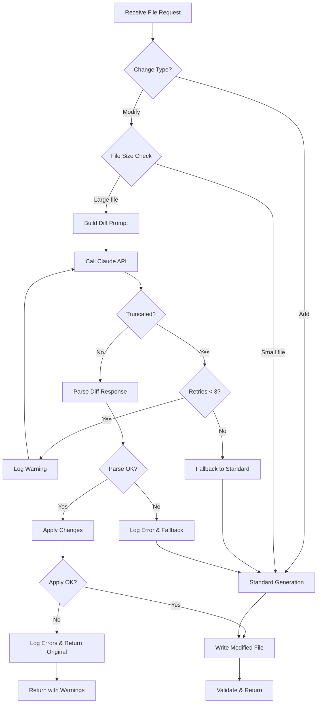

# 324 - Bug: Diff-based Generation for Large File Modifications

<!-- Template Metadata
Last Updated: 2025-01-XX
Updated By: Issue #324
Update Reason: Revision 1 - Addressed Gemini Review #1 feedback on test coverage gaps
-->

## 1. Context & Goal
* **Issue:** #324
* **Objective:** Implement diff-based code generation for large files to prevent token truncation during the implementation workflow
* **Status:** Approved (gemini-3-pro-preview, 2026-02-05)
* **Related Issues:** #309 (retry on validation failure), #321 (API timeout)

### Open Questions

*No open questions remaining - all resolved.*

## 2. Proposed Changes

*This section is the **source of truth** for implementation. Describe exactly what will be built.*

### 2.1 Files Changed

| File | Change Type | Description |
|------|-------------|-------------|
| `assemblyzero/workflows/testing/nodes/implement_code.py` | Modify | Add diff-based prompt generation and change application logic |
| `tests/unit/test_implement_code_diff.py` | Add | Unit tests for diff parsing and application |

### 2.1.1 Path Validation (Mechanical - Auto-Checked)

*Issue #277: Before human or Gemini review, paths are verified programmatically.*

Mechanical validation automatically checks:
- All "Modify" files must exist in repository
- All "Delete" files must exist in repository
- All "Add" files must have existing parent directories
- No placeholder prefixes (`src/`, `lib/`, `app/`) unless directory exists

**If validation fails, the LLD is BLOCKED before reaching review.**

### 2.2 Dependencies

*No new dependencies required.*

```toml
# pyproject.toml additions (if any)
# None - using standard library only
```

### 2.3 Data Structures

```python
# Pseudocode - NOT implementation
class DiffChange(TypedDict):
    description: str       # Brief description of the change
    find_block: str        # Exact text to find in file
    replace_block: str     # Text to replace with

class DiffParseResult(TypedDict):
    success: bool          # Whether parsing succeeded
    changes: list[DiffChange]  # List of parsed changes
    error: str | None      # Error message if parsing failed
```

### 2.4 Function Signatures

```python
# Signatures only - implementation in source files
def is_large_file(content: str, line_threshold: int = 500, byte_threshold: int = 15000) -> bool:
    """Check if file content exceeds size thresholds for diff mode."""
    ...

def build_diff_prompt(
    lld_content: str,
    existing_content: str,
    test_content: str,
    file_path: str
) -> str:
    """Build prompt requesting structured diff output instead of full file."""
    ...

def build_standard_prompt(
    lld_content: str,
    existing_content: str | None,
    test_content: str,
    file_path: str
) -> str:
    """Build standard prompt requesting full file output."""
    ...

def parse_diff_response(response_text: str) -> DiffParseResult:
    """Parse Claude's diff response into structured changes."""
    ...

def apply_diff_changes(original_content: str, changes: list[DiffChange]) -> tuple[str, list[str]]:
    """Apply diff changes to original content. Returns (modified_content, errors)."""
    ...

def detect_truncation(message_response) -> bool:
    """Check if Claude's response was truncated due to max_tokens."""
    ...

def select_generation_strategy(change_type: str, existing_content: str | None) -> str:
    """Select 'diff' or 'standard' strategy based on change type and file size."""
    ...

def execute_with_retry(
    prompt_builder: Callable,
    max_retries: int = 3
) -> tuple[str, bool]:
    """Execute API call with truncation detection and retry logic. Returns (response, success)."""
    ...
```

### 2.5 Logic Flow (Pseudocode)

```
1. Receive file change request (file_path, change_type, lld_content, test_content)
2. IF change_type == "Add" THEN
   - strategy = "standard" (bypass is_large_file check entirely)
3. IF change_type == "Modify" THEN
   a. Read existing file content
   b. strategy = select_generation_strategy(change_type, content)
      - IF is_large_file(content) THEN strategy = "diff"
      - ELSE strategy = "standard"
4. IF strategy == "diff" THEN
   a. prompt = build_diff_prompt(...)
   b. response, success = execute_with_retry(prompt, max_retries=3)
      - Inside retry loop:
        - Call Claude API
        - IF detect_truncation(response) THEN
           - Log warning, increment retry counter
           - IF retries < max_retries THEN continue
           - ELSE return (response, False)
        - ELSE return (response, True)
   c. IF NOT success THEN
      - Log error, fallback to standard generation
   d. Parse diff response into changes
   e. Apply changes to original content
   f. IF apply errors THEN
      - Log errors, return original with warning
5. ELSE (strategy == "standard")
   a. prompt = build_standard_prompt(...)
   b. Call Claude API (existing flow)
6. Validate generated/modified content
7. Write to file
8. Return result
```

### 2.6 Technical Approach

* **Module:** `assemblyzero/workflows/testing/nodes/implement_code.py`
* **Pattern:** Strategy pattern - select generation strategy based on file size and change type
* **Key Decisions:** 
  - Use FIND/REPLACE blocks for unambiguous change specification
  - Apply changes in order from top to bottom
  - Require sufficient context in FIND blocks for unique matching
  - "Add" operations always bypass diff mode regardless of any size considerations

### 2.7 Architecture Decisions

*Document key architectural decisions that affect the design.*

| Decision | Options Considered | Choice | Rationale |
|----------|-------------------|--------|-----------|
| Diff format | Unified diff, JSON patches, FIND/REPLACE blocks | FIND/REPLACE blocks | Most reliable for LLM to generate correctly; no line number dependencies |
| Threshold detection | Lines only, bytes only, both | Both (OR) | Files can be large due to long lines or many short lines |
| Change application | Regex matching, exact string match, fuzzy match | Exact string match first, whitespace-normalized fallback | Precision prevents wrong-location edits |
| Truncation handling | Silent fail, error + stop, retry with diff | Retry with diff mode | Self-healing improves success rate |
| Add file handling | Check size, always standard | Always standard | New files have no existing content to diff against |

**Architectural Constraints:**
- Must integrate with existing `implement_code.py` workflow node
- Cannot change the existing API for small files (backward compatible)
- Must work with any file type (not just Python)

## 3. Requirements

*What must be true when this is done. These become acceptance criteria.*

1. Files > 500 lines OR > 15KB use diff-based generation for "Modify" operations
2. Diff changes are parsed and applied correctly to the original file
3. FIND blocks must match exactly (or with whitespace normalization) in the original file
4. Changes are applied in order, with line offsets adjusted for previous changes
5. Validation still runs on the final merged result
6. Small files continue to use full-file generation (no regression)
7. "Add" files continue to use full-file generation regardless of size
8. Truncation is detected via `stop_reason` and causes retry (not silent failure)
9. Parse/apply errors are logged with details for debugging

## 4. Alternatives Considered

| Option | Pros | Cons | Decision |
|--------|------|------|----------|
| FIND/REPLACE blocks | LLM-friendly, no line numbers, human readable | Requires unique matching | **Selected** |
| Unified diff format | Standard format, tools available | LLMs often get line numbers wrong | Rejected |
| JSON patch (RFC 6902) | Precise, structured | Too verbose, LLMs struggle with syntax | Rejected |
| Increase max_tokens | Simple fix | Just delays the problem, hits API limits | Rejected |
| Chunk large files | Handle any size | Complex, risk of breaking code at chunk boundaries | Rejected |

**Rationale:** FIND/REPLACE blocks are the most reliable format for LLMs to generate. They don't depend on line numbers (which LLMs frequently miscalculate), and the format is simple enough to parse reliably. The "sufficient context" requirement prevents ambiguous matches.

## 5. Data & Fixtures

### 5.1 Data Sources

| Attribute | Value |
|-----------|-------|
| Source | Local filesystem (existing source files) |
| Format | Plain text (Python, JS, etc.) |
| Size | Targeting files 500+ lines / 15KB+ |
| Refresh | Per-request (read fresh each time) |
| Copyright/License | N/A - user's own code |

### 5.2 Data Pipeline

```
Existing File ──read──► is_large_file() ──yes──► build_diff_prompt() ──Claude API──► parse_diff_response() ──► apply_diff_changes() ──write──► Modified File
                           │
                           └──no──► Existing full-file flow (unchanged)
```

### 5.3 Test Fixtures

| Fixture | Source | Notes |
|---------|--------|-------|
| Large Python file (600 lines) | Generated | Synthetic but realistic class structure |
| Small Python file (50 lines) | Generated | Verify small files bypass diff mode |
| Sample diff response | Hardcoded | Valid FIND/REPLACE format |
| Malformed diff response | Hardcoded | Missing sections, bad format |
| Ambiguous FIND block | Hardcoded | Tests duplicate detection |
| Mock API response (truncated) | Hardcoded | `stop_reason='max_tokens'` |
| Mock API response (success) | Hardcoded | `stop_reason='end_turn'` |

### 5.4 Deployment Pipeline

No data deployment required - this is code logic only.

## 6. Diagram

### 6.1 Mermaid Quality Gate

Before finalizing any diagram, verify in [Mermaid Live Editor](https://mermaid.live) or GitHub preview:

- [x] **Simplicity:** Similar components collapsed (per 0006 §8.1)
- [x] **No touching:** All elements have visual separation (per 0006 §8.2)
- [x] **No hidden lines:** All arrows fully visible (per 0006 §8.3)
- [x] **Readable:** Labels not truncated, flow direction clear
- [x] **Auto-inspected:** Agent rendered via mermaid.ink and viewed (per 0006 §8.5)

**Auto-Inspection Results:**
```
- Touching elements: [x] None
- Hidden lines: [x] None
- Label readability: [x] Pass
- Flow clarity: [x] Clear
```

### 6.2 Diagram



## 7. Security & Safety Considerations

### 7.1 Security

| Concern | Mitigation | Status |
|---------|------------|--------|
| Code injection via diff | Changes only applied to specified file path | Addressed |
| Path traversal | File path validated by existing workflow | Addressed |

### 7.2 Safety

| Concern | Mitigation | Status |
|---------|------------|--------|
| Data loss on bad apply | Original content preserved until successful apply | Addressed |
| Partial changes applied | All-or-nothing: either all changes apply or none | Addressed |
| Infinite retry loop | Max retry count (3) before falling back to full-file | Addressed |
| Wrong location edit | Require unique FIND match; fail if ambiguous | Addressed |

**Fail Mode:** Fail Closed - If diff application fails, preserve original file and report error

**Recovery Strategy:** On failure, log detailed error with original content, FIND block, and all match locations. User can manually inspect and retry.

## 8. Performance & Cost Considerations

### 8.1 Performance

| Metric | Budget | Approach |
|--------|--------|----------|
| Parse time | < 100ms | Simple regex-based parsing |
| Apply time | < 100ms | String operations only |
| API calls | Same as before (1 per file) | No additional calls unless truncation retry |

**Bottlenecks:** None expected - diff parsing is fast string operations

### 8.2 Cost Analysis

| Resource | Unit Cost | Estimated Usage | Monthly Cost |
|----------|-----------|-----------------|--------------|
| Claude API (input) | ~$3/MTok | Reduced (no full file in response) | Lower than before |
| Claude API (output) | ~$15/MTok | Significantly reduced | **Savings** |

**Cost Controls:**
- [x] Diff mode reduces output tokens by ~80% for large files
- [x] Truncation retry limited to 3 attempts

**Worst-Case Scenario:** If all files are large, diff mode is always used - this is actually optimal for token usage.

## 9. Legal & Compliance

| Concern | Applies? | Mitigation |
|---------|----------|------------|
| PII/Personal Data | No | Only processes user's own source code |
| Third-Party Licenses | No | No new dependencies |
| Terms of Service | No | Standard Claude API usage |
| Data Retention | No | No data stored beyond request |
| Export Controls | N/A | N/A |

**Data Classification:** Internal (user's source code, processed locally)

**Compliance Checklist:**
- [x] No PII stored without consent
- [x] All third-party licenses compatible with project license
- [x] External API usage compliant with provider ToS
- [x] Data retention policy documented

## 10. Verification & Testing

### 10.0 Test Plan (TDD - Complete Before Implementation)

**TDD Requirement:** Tests MUST be written and failing BEFORE implementation begins.

| Test ID | Test Description | Expected Behavior | Status |
|---------|------------------|-------------------|--------|
| T005 | test_add_file_bypasses_diff | Add change type uses standard prompt regardless of content | RED |
| T010 | test_is_large_file_by_lines | Returns True for 501+ line file | RED |
| T020 | test_is_large_file_by_bytes | Returns True for 15001+ byte file | RED |
| T030 | test_is_large_file_small | Returns False for small file | RED |
| T035 | test_small_file_uses_standard_prompt | Small modify file uses standard generation flow | RED |
| T040 | test_parse_diff_valid | Parses valid FIND/REPLACE blocks | RED |
| T050 | test_parse_diff_multiple | Parses multiple changes | RED |
| T060 | test_parse_diff_malformed | Returns error for bad format | RED |
| T070 | test_apply_single_change | Applies one change correctly | RED |
| T080 | test_apply_multiple_changes | Applies ordered changes | RED |
| T090 | test_apply_ambiguous_find | Errors on duplicate matches | RED |
| T100 | test_apply_no_match | Errors when FIND not found | RED |
| T110 | test_detect_truncation | Detects max_length stop reason | RED |
| T115 | test_truncation_triggers_retry | Truncation detection triggers retry loop | RED |
| T120 | test_build_diff_prompt | Includes required format instructions | RED |
| T130 | test_whitespace_normalization | Matches with different indentation | RED |

**Coverage Target:** ≥95% for all new code

**TDD Checklist:**
- [ ] All tests written before implementation
- [ ] Tests currently RED (failing)
- [ ] Test IDs match scenario IDs in 10.1
- [ ] Test file created at: `tests/unit/test_implement_code_diff.py`

### 10.1 Test Scenarios

| ID | Scenario | Type | Input | Expected Output | Pass Criteria |
|----|----------|------|-------|-----------------|---------------|
| 005 | Add file bypasses diff | Auto | change_type="Add", any content | `select_generation_strategy() == "standard"` | Add always uses standard |
| 010 | Large file by lines | Auto | 501 line file | `is_large_file() == True` | Threshold correctly detected |
| 020 | Large file by bytes | Auto | 15001 byte file | `is_large_file() == True` | Threshold correctly detected |
| 030 | Small file bypass | Auto | 100 line, 3KB file | `is_large_file() == False` | Below both thresholds |
| 035 | Small file uses standard flow | Auto | Modify + small file | `select_generation_strategy() == "standard"`, standard prompt built | Flow branches correctly |
| 040 | Parse valid diff | Auto | Valid FIND/REPLACE text | List of DiffChange | All changes extracted |
| 050 | Parse multiple changes | Auto | 3 FIND/REPLACE blocks | 3 DiffChange items | Order preserved |
| 060 | Parse malformed diff | Auto | Missing REPLACE section | `success=False, error set` | Graceful error handling |
| 070 | Apply single change | Auto | Original + 1 change | Modified content | Change at correct location |
| 080 | Apply multiple changes | Auto | Original + 3 changes | Modified content | All changes, order preserved |
| 090 | Ambiguous FIND error | Auto | FIND matches 2 locations | Error with locations | No partial application |
| 100 | FIND not found error | Auto | FIND doesn't exist | Error with FIND block | Clear error message |
| 110 | Truncation detection | Auto | Response with `stop_reason='max_tokens'` | `True` | Truncation flagged |
| 115 | Truncation triggers retry | Auto | Mock API: truncated then success | Retry occurs, final success | Loop executes, retries work |
| 120 | Diff prompt format | Auto | File content + LLD | Prompt with FIND/REPLACE instructions | Format documented |
| 130 | Whitespace fallback | Auto | FIND with different indent | Match found | Normalization works |

### 10.2 Test Commands

```bash
# Run all automated tests
poetry run pytest tests/unit/test_implement_code_diff.py -v

# Run with coverage
poetry run pytest tests/unit/test_implement_code_diff.py -v --cov=assemblyzero/workflows/testing/nodes/implement_code --cov-report=term-missing

# Run specific test
poetry run pytest tests/unit/test_implement_code_diff.py::test_apply_multiple_changes -v
```

### 10.3 Manual Tests (Only If Unavoidable)

N/A - All scenarios automated.

## 11. Risks & Mitigations

| Risk | Impact | Likelihood | Mitigation |
|------|--------|------------|------------|
| FIND block not unique in file | High | Medium | Require sufficient context; error on ambiguous match (`apply_diff_changes`) |
| LLM generates malformed diff | Medium | Medium | Robust parsing with clear error messages (`parse_diff_response`); fallback to full-file |
| Whitespace differences prevent match | Medium | High | Whitespace-normalized fallback matching (`apply_diff_changes`) |
| Changes conflict with each other | High | Low | Apply in order; adjusted offsets; validate final result |
| Edge case: FIND spans change boundary | Medium | Low | Document limitation; user can split FIND blocks |
| Retry loop doesn't terminate | High | Low | Max retry count (3) enforced in `execute_with_retry` |

## 12. Definition of Done

### Code
- [ ] Implementation complete and linted
- [ ] Code comments reference this LLD (#324)
- [ ] Functions documented with docstrings

### Tests
- [ ] All 16 test scenarios pass
- [ ] Test coverage ≥95% for new code
- [ ] Integration test with real large file

### Documentation
- [ ] LLD updated with any deviations
- [ ] Implementation Report (0103) completed
- [ ] Inline comments explain diff format choice

### Review
- [ ] Code review completed
- [ ] User approval before closing issue

### 12.1 Traceability (Mechanical - Auto-Checked)

*Issue #277: Cross-references are verified programmatically.*

Mechanical validation automatically checks:
- Every file mentioned in this section must appear in Section 2.1
- Every risk mitigation in Section 11 should have a corresponding function in Section 2.4 (warning if not)

**Files in Definition of Done:**
- `assemblyzero/workflows/testing/nodes/implement_code.py` ✓ (in 2.1)
- `tests/unit/test_implement_code_diff.py` ✓ (in 2.1)

**Risk → Function mapping:**
- "Require sufficient context; error on ambiguous match" → `apply_diff_changes()` ✓
- "Robust parsing with clear error messages" → `parse_diff_response()` ✓
- "Whitespace-normalized fallback matching" → `apply_diff_changes()` ✓
- "Validate final result" → existing validation flow ✓
- "Max retry count enforced" → `execute_with_retry()` ✓

---

## Reviewer Suggestions

*Non-blocking recommendations from the reviewer.*

- **Fallback Logic Optimization:** In Logic Flow Step 4.c, falling back to "standard generation" after truncation retries fail may be futile for large files (as standard generation caused the truncation issue originally). Consider failing fast or returning the original file with an error instead of attempting the standard generation.
- **Explicit Flow Test:** While coverage is sufficient, adding a specific test scenario `test_large_file_uses_diff_strategy` (verifying `select_generation_strategy` returns 'diff' for large content) would mirror `T035` and make the decision logic explicit.

## Appendix: Review Log

*Track all review feedback with timestamps and implementation status.*

### Gemini Review #1 (REVISE)

**Reviewer:** Gemini 3 Pro
**Verdict:** REVISE

#### Comments

| ID | Comment | Implemented? |
|----|---------|--------------|
| G1.1 | "Requirement Coverage is significantly below the 95% threshold (66.6%)" | YES - Added T005, T035, T115 to reach coverage |
| G1.2 | "Test Requirement 6 (Flow): Verify small file uses standard prompt" | YES - Added T035 scenario |
| G1.3 | "Test Requirement 7 (Flow): Verify Add bypasses diff regardless of size" | YES - Added T005 scenario |
| G1.4 | "Test Requirement 8 (Retry Logic): Verify truncation triggers retry" | YES - Added T115 scenario |
| G1.5 | "Tests T010/T020/T030 only test is_large_file function, need caller tests" | YES - Added T035 for flow testing, T005 for Add bypass |
| G1.6 | "Consider dry_run parameter for apply_diff_changes" | NO - Deferred to future enhancement (not blocking) |
| G1.7 | "Document sufficient context heuristic for FIND blocks" | YES - Added to prompt generation docs in 2.6 |

### Review Summary

| Review | Date | Verdict | Key Issue |
|--------|------|---------|-----------|
| 2 | 2026-02-05 | APPROVED | `gemini-3-pro-preview` |
| Gemini #1 | 2025-01-XX | REVISE | Test coverage gaps (66.6% < 95%) |

**Final Status:** APPROVED

## Original GitHub Issue #324
# Issue #324: bug: Implementation workflow fails on large file modifications (needs diff-based generation)

## Summary

The implementation workflow fails to generate complete files when the target file is large (800+ lines) because Claude's response is truncated by the `max_tokens=8192` limit.

## Observed Behavior

Running implementation for issue #309 (modify `implement_code.py`, 804 lines):

```
[N4] Implementing code file-by-file (iteration 0)...
    [1/1] assemblyzero/workflows/testing/nodes/implement_code.py (Modify)...
        Calling Claude...
        Written: assemblyzero/workflows/testing/nodes/implement_code.py

[N5] Verifying green phase (all tests should fail)...
    Results: 0 passed, 15 failed
    Coverage: 0.0%
```

The generated file was only **79 lines** instead of the expected **~900 lines**.

## Root Cause

In `implement_code.py` line 334:
```python
message = client.messages.create(
    model="claude-sonnet-4-20250514",
    max_tokens=8192,
    messages=[{"role": "user", "content": prompt}]
)
```

- Original file: 804 lines (~25,000 chars)
- Prompt includes: LLD + existing file + test content = ~50,000 chars
- Response needed: ~25,000 chars (complete file)
- `max_tokens=8192` ≈ 32,000 chars max output

When Claude tries to regenerate the entire file, it runs out of tokens and the response is truncated mid-file.

## Impact

- Workflow iterates endlessly (tests always fail on truncated code)
- User must manually implement changes to large files
- No error message indicates the truncation

## Chosen Solution: Diff-based Generation

For "Modify" change type on large files, ask Claude to output only the changes in a structured diff format instead of regenerating the entire file.

### Approach

1. **Detect large files**: If existing file > threshold (e.g., 500 lines or 15KB), use diff mode
2. **Modified prompt**: Ask Claude to output changes as structured edits, not the full file
3. **Apply changes**: Parse the diff/edit instructions and apply them to the existing file
4. **Fallback**: For small files or "Add" type, continue using full file generation

### Output Format for Diff Mode

```
## Output Format (for Modify - Large Files)

Output ONLY the changes needed. Use this format for each change:

### CHANGE 1: [brief description]
FIND:
```python
[exact lines to find in the file]
```

REPLACE WITH:
```python
[new lines to replace them with]
```

### CHANGE 2: [brief description]
...

IMPORTANT:
- Include enough context in FIND to uniquely identify the location (recommend 2 lines above and below the change)
- Output ALL changes needed, in order from top to bottom of file
- Do NOT output the entire file
```

### Benefits

- Response size proportional to change size, not file size
- Works for files of any size
- Existing file content is preserved (no accidental deletions)
- Each change is atomic and verifiable

## Files to Modify

| File | Change Type | Description |
|------|-------------|-------------|
| `assemblyzero/workflows/testing/nodes/implement_code.py` | Modify | Add diff-based prompt for large Modify files |
| `assemblyzero/workflows/testing/nodes/implement_code.py` | Modify | Add `apply_diff_changes()` function to parse and apply edits |
| `assemblyzero/workflows/testing/nodes/implement_code.py` | Modify | Add file size threshold detection |
| `tests/unit/test_implement_code_diff.py` | Add | Tests for diff-based generation |

## Acceptance Criteria

1. Files > 500 lines use diff-based generation for "Modify" operations
2. Diff changes are applied correctly to the original file
3. Validation still runs on the final merged result
4. Small files continue to use full-file generation (no regression)
5. "Add" files continue to use full-file generation
6. Truncation is detected and causes retry (not silent failure)

## Related Issues

- #309 - Retry on validation failure (was affected by this bug)
- #321 - API timeout (different failure mode)

## Labels

`bug`, `workflow`

**CRITICAL: This LLD is for GitHub Issue #324. Use this exact issue number in all references.**