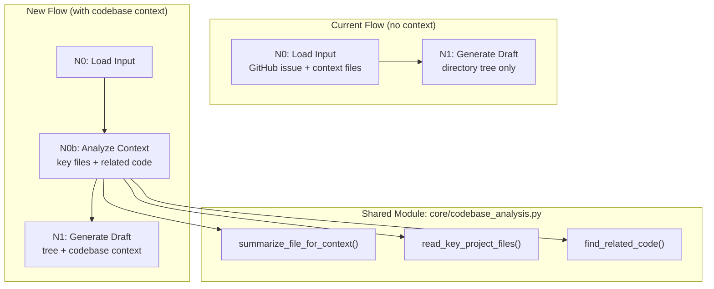

# 401 - Feature: Codebase Context Injection for Requirements Workflow

<!-- Template Metadata
Last Updated: 2026-02-18
Updated By: Manual LLD (workflow bootstrap — can't use the workflow to fix the workflow)
Update Reason: Initial draft
-->

## 1. Context & Goal
* **Issue:** #401
* **Objective:** Add a codebase analysis node to the requirements workflow so the LLD drafter receives real code context instead of hallucinating designs against a directory tree.
* **Status:** Draft
* **Related Issues:** #389 (directory listing — insufficient), #395 (AnthropicProvider — transport layer), #373 (file summarization — reusable), #288 (--context flag — manual, orthogonal), #88/#92 (RAG — future, overkill for now)

### Open Questions
*All questions resolved during investigation.*

- [x] ~~Should we build RAG/vector infrastructure first?~~ **RESOLVED: No.** Direct file reading + AST summarization is sufficient. RAG (#88, #92) is a future enhancement. The drafter needs ~5-15 key file excerpts, not semantic search over the entire corpus.
- [x] ~~Where should shared utilities live?~~ **RESOLVED:** Extract `summarize_file_for_context()` to `assemblyzero/core/codebase_analysis.py`. Currently buried in `workflows/testing/nodes/implement_code.py:231`. The implementation spec workflow's `analyze_codebase.py` has overlapping logic that should also use this shared module.
- [x] ~~Should this be a new graph node or inline in load_input?~~ **RESOLVED: New node (N0b).** Keeps load_input focused on I/O (GitHub fetch, file reads). Codebase analysis is a distinct concern with its own error handling and state updates.

## 2. Proposed Changes

*This section is the **source of truth** for implementation. Describe exactly what will be built.*

### 2.1 Files Changed

| File | Change Type | Description |
|------|-------------|-------------|
| `assemblyzero/core/codebase_analysis.py` | Add | Shared module: `summarize_file_for_context()`, `read_key_project_files()`, `find_related_patterns()` |
| `assemblyzero/workflows/requirements/nodes/analyze_context.py` | Add | New N0b node: codebase analysis for requirements workflow |
| `assemblyzero/workflows/requirements/nodes/__init__.py` | Modify | Export `analyze_context` |
| `assemblyzero/workflows/requirements/state.py` | Modify | Add `codebase_context` and `pattern_references` fields |
| `assemblyzero/workflows/requirements/graph.py` | Modify | Wire N0b between N0 and N1, add routing |
| `assemblyzero/workflows/requirements/nodes/generate_draft.py` | Modify | Inject `codebase_context` and `pattern_references` into drafter prompt |
| `tests/unit/test_codebase_analysis.py` | Add | Unit tests for shared codebase analysis module |
| `tests/unit/test_analyze_context.py` | Add | Unit tests for N0b node |

### 2.1.1 Path Validation (Mechanical - Auto-Checked)

*Issue #277: Before human or Gemini review, paths are verified programmatically.*

Mechanical validation automatically checks:
- All "Modify" files must exist in repository
- All "Delete" files must exist in repository
- All "Add" files must have existing parent directories
- No placeholder prefixes (`src/`, `lib/`, `app/`) unless directory exists

**If validation fails, the LLD is BLOCKED before reaching review.**

### 2.2 Dependencies

```toml
# pyproject.toml additions (if any)
# None — uses stdlib ast module and existing pathlib/os
```

### 2.3 Data Structures

```python
# Pseudocode - NOT implementation

class PatternRef(TypedDict):
    """A reference to a similar pattern in the codebase."""
    file_path: str           # Relative path from repo root
    pattern_type: str        # "node", "state", "graph", "test", "tool"
    description: str         # One-line description of what this pattern shows
    excerpt: str             # Summarized code excerpt

class CodebaseContext(TypedDict):
    """Assembled codebase context for the drafter."""
    key_files: dict[str, str]        # {relative_path: summarized_content}
    pattern_references: list[PatternRef]
    token_estimate: int              # Approximate token count for budget tracking
```

### 2.4 Function Signatures

```python
# === assemblyzero/core/codebase_analysis.py ===

def summarize_file_for_context(content: str) -> str:
    """Extract imports and signatures from a Python file for compact context.

    Extracted from workflows/testing/nodes/implement_code.py (Issue #373).
    AST-based: module docstring, imports, class/function signatures, docstrings
    (first 3 lines), module constants. ~85% token reduction.

    Falls back to first 50 lines on SyntaxError.
    """
    ...

def summarize_non_python_file(content: str, max_chars: int = 5000) -> str:
    """Summarize non-Python files (markdown, JSON, TOML, YAML).

    - Markdown: extract headings and first paragraph under each
    - JSON/TOML/YAML: truncate to max_chars with structure preserved
    """
    ...

def read_key_project_files(repo_root: Path) -> dict[str, str]:
    """Read and summarize key project files that any LLD drafter needs.

    Reads (if they exist): CLAUDE.md, README.md, pyproject.toml, package.json,
    wrangler.toml, docs/standards/*.md (first 3), existing architecture docs.

    Returns dict of {relative_path: summarized_content}.
    Each file is summarized via summarize_file_for_context() (Python)
    or summarize_non_python_file() (other).

    Total output budget: ~20,000 characters (~5K tokens).
    """
    ...

def find_related_code(
    repo_root: Path,
    issue_text: str,
    max_results: int = 10,
) -> list[PatternRef]:
    """Find code files related to the issue by keyword matching.

    Strategy:
    1. Extract technical nouns from issue text (CamelCase, snake_case terms)
    2. Grep the codebase for those terms
    3. Read and summarize matching files
    4. Return up to max_results PatternRef entries

    Budget: ~15,000 characters (~4K tokens).
    """
    ...

# === assemblyzero/workflows/requirements/nodes/analyze_context.py ===

def analyze_context(state: RequirementsWorkflowState) -> dict[str, Any]:
    """N0b: Analyze target codebase for context injection.

    Runs after N0 (load_input), before N1 (generate_draft).
    Only runs for LLD workflow (issue workflow skips — no target repo to analyze).

    1. Read key project files (CLAUDE.md, README, configs)
    2. Find code related to the issue text
    3. Assemble into codebase_context string
    4. Save context to audit trail

    Returns state updates:
        codebase_context: str  — formatted markdown for prompt injection
        pattern_references: list[PatternRef]  — for audit/transparency
    """
    ...
```

### 2.5 Logic Flow (Pseudocode)

```
# N0b: analyze_context

1. IF workflow_type != "lld" THEN
   - Return empty (issue workflow has no target codebase)

2. Get target_repo from state
3. GUARD: target_repo must exist and be a directory (FAIL CLOSED if not)

4. Read key project files
   a. Check for CLAUDE.md, README.md, pyproject.toml, package.json, etc.
   b. For each file that exists:
      - Read content
      - Summarize (AST for .py, truncate for others)
      - Add to key_files dict
   c. Track cumulative character count

5. Find related code
   a. Extract keywords from issue_title + issue_body
      - Split CamelCase: "GovernanceAuditLog" → ["Governance", "Audit", "Log"]
      - Split snake_case: "audit_logging" → ["audit", "logging"]
      - Filter stopwords
      - Take top 10 keywords
   b. For each keyword:
      - Search repo for files containing the keyword
      - Skip test files, __pycache__, .git, done/
   c. For each matching file (up to max_results):
      - Read and summarize
      - Create PatternRef entry
   d. Deduplicate by file path

6. Assemble codebase_context string:
   ```
   ## Codebase Context (auto-generated)

   ### Key Project Files

   #### CLAUDE.md
   ```markdown
   {summarized content}
   ```

   ### Related Code

   #### assemblyzero/core/audit.py
   ```python
   {summarized content}
   ```
   ```

7. Token budget check
   a. Estimate tokens (~4 chars per token)
   b. IF > 10K tokens THEN
      - Drop lowest-relevance pattern_references
      - Re-assemble until within budget

8. Save codebase_context to audit trail (for transparency)

9. Return {codebase_context, pattern_references}
```

```
# generate_draft._build_prompt() changes

BEFORE (current):
  repo_context = get_repo_structure(target_repo)  # directory tree only

AFTER:
  repo_context = get_repo_structure(target_repo)   # still include tree
  codebase_context = state.get("codebase_context", "")

  IF codebase_context THEN
    repo_context += "\n\n" + codebase_context
```

### 2.6 Technical Approach

* **Module:** `assemblyzero/core/codebase_analysis.py` (shared), `assemblyzero/workflows/requirements/nodes/analyze_context.py` (node)
* **Pattern:** Reuse existing infrastructure — `summarize_file_for_context()` from testing workflow, `find_pattern_references()` strategy from implementation_spec workflow
* **Key Decisions:**
  - No RAG/vector store — direct file reading + AST summarization is sufficient for 5-15 files
  - Shared module avoids duplication across 3 workflows that need the same utilities
  - Token budget enforced to prevent prompt bloat (Issue #373 lesson)
  - Keyword extraction uses simple regex, not NLP — lightweight and deterministic

### 2.7 Architecture Decisions

| Decision | Options Considered | Choice | Rationale |
|----------|-------------------|--------|-----------|
| Context strategy | RAG (ChromaDB + embeddings), Direct file reading | Direct file reading | RAG requires 100MB+ dependencies, setup ceremony, and cold-boot latency. Direct reading handles the 5-15 file scale perfectly. RAG deferred to #88/#92 |
| Where to put shared code | Leave in testing workflow, New shared module | New shared module (`core/codebase_analysis.py`) | Three workflows need these utilities (requirements, testing, implementation_spec). DRY principle |
| Keyword extraction | TF-IDF (scikit-learn), Counter-based, Regex | Regex | Zero dependencies, deterministic, sufficient for extracting CamelCase/snake_case terms from issue text |
| New node vs inline | Inline in load_input, Inline in generate_draft, New N0b node | New N0b node | Separation of concerns. load_input handles I/O, analyze_context handles analysis. Each has independent error handling and can be skipped cleanly |
| Token budget | No limit, Hard limit with truncation, Budget with whole-file drops | Budget with whole-file drops | Lesson from Issue #373 — never truncate mid-file, drop lowest-relevance files entirely |

**Architectural Constraints:**
- Must work cross-repo (the `--repo` flag points to any target repository, not just AssemblyZero)
- No new external dependencies (stdlib ast, pathlib, re only)
- Must not break existing issue workflow (N0b is LLD-only)
- Total injected context must stay under ~10K tokens to leave room for template + issue text

## 3. Requirements

1. Requirements workflow reads key project files (CLAUDE.md, README, configs) before drafting
2. Requirements workflow finds code related to the issue and injects summarized excerpts
3. Codebase context is injected into the drafter prompt between repo structure and template
4. LLDs for unfamiliar projects reference real file paths and real patterns
5. Token budget prevents context from exceeding ~10K tokens
6. Issue workflow (non-LLD) is unaffected — N0b skips gracefully
7. Works cross-repo — the `--repo` flag targets any repository
8. Audit trail includes the codebase context (transparency for review)
9. `summarize_file_for_context()` is extracted to shared module, not duplicated

## 4. Alternatives Considered

| Option | Pros | Cons | Decision |
|--------|------|------|----------|
| RAG with ChromaDB (#88) | Semantic search, scales to large codebases | 100MB+ deps, setup ceremony, cold-boot latency, overkill for 5-15 files | Rejected (deferred to #88/#92) |
| Manual `--context` only (#288) | Simple, user controls what drafter sees | User must know what to pass, defeats automation purpose | Rejected (orthogonal — keep as complement) |
| Inline in generate_draft | No new node, simpler graph | Mixes I/O (file reading) with prompt construction, harder to test | Rejected |
| Inline in load_input | One fewer node | load_input already does GitHub fetch + context files + audit dir creation; adding codebase analysis makes it too complex | Rejected |
| **New N0b node + shared module** | **Clean separation, testable, reusable across workflows** | **One more node in graph** | **Selected** |

**Rationale:** The N0b approach keeps each node focused on one concern. The shared module pays dividends immediately — three workflows need file summarization and pattern discovery.

## 5. Data & Fixtures

### 5.1 Data Sources

| Attribute | Value |
|-----------|-------|
| Source | Local filesystem (target repository files) |
| Format | Python (.py), Markdown (.md), JSON, TOML, YAML |
| Size | 5-15 files, ~50KB raw → ~8KB summarized |
| Refresh | Read fresh each workflow run |
| Copyright/License | Same as target project |

### 5.2 Data Pipeline

```
Target repo files ──read_key_project_files()──► summarized excerpts ──find_related_code()──► pattern refs ──assemble──► codebase_context string ──inject──► drafter prompt
```

### 5.3 Test Fixtures

| Fixture | Source | Notes |
|---------|--------|-------|
| Sample Python file | Generated | Class with methods, imports, docstrings for AST summarization |
| Sample CLAUDE.md | Generated | Minimal project instructions |
| Sample pyproject.toml | Generated | Basic poetry config |
| Mock repo directory | tempfile.mkdtemp() | Ephemeral directory tree with sample files |
| Issue text with keywords | Hardcoded | "Add audit logging to the dashboard using GovernanceAuditLog" |

### 5.4 Deployment Pipeline

No deployment — local file operations only.

## 6. Diagram

### 6.1 Mermaid Quality Gate

- [ ] **Simplicity:** Similar components collapsed (per 0006 §8.1)
- [ ] **No touching:** All elements have visual separation (per 0006 §8.2)
- [ ] **No hidden lines:** All arrows fully visible (per 0006 §8.3)
- [ ] **Readable:** Labels not truncated, flow direction clear
- [ ] **Auto-inspected:** Agent rendered via mermaid.ink and viewed (per 0006 §8.5)

**Auto-Inspection Results:**
```
- Touching elements: [ ] None / [ ] Found: ___
- Hidden lines: [ ] None / [ ] Found: ___
- Label readability: [ ] Pass / [ ] Issue: ___
- Flow clarity: [ ] Clear / [ ] Issue: ___
```

### 6.2 Diagram



## 7. Security & Safety Considerations

### 7.1 Security

| Concern | Mitigation | Status |
|---------|------------|--------|
| Path traversal in keyword search results | All file reads constrained to target_repo root via `Path.resolve()` check | Addressed |
| Reading sensitive files (.env, credentials) | Exclude .env, .git/, node_modules/, __pycache__/ from file scanning | Addressed |

### 7.2 Safety

| Concern | Mitigation | Status |
|---------|------------|--------|
| Codebase analysis failure blocks LLD generation | N0b fails closed — stops the workflow with a clear error message. Proceeding without context produces hallucinated LLDs, which is worse than stopping. The user can fix the issue and re-run. | Addressed |
| Token budget overflow | Hard cap at ~10K tokens for codebase context; drop lowest-relevance files if exceeded | Addressed |
| Large binary files | Skip files > 1MB, skip non-text extensions (.png, .whl, .lock) | Addressed |

**Fail Mode:** Fail Closed — if codebase analysis fails, the workflow stops with a clear error. A drafter without codebase context produces hallucinated LLDs that waste review cycles and poison the downstream pipeline. Stopping early is cheaper than fixing a bad LLD after three Gemini reviews.

**Recovery Strategy:** Fix the underlying issue (missing repo, unreadable files, etc.) and re-run. The error message will identify exactly what failed.

## 8. Performance & Cost Considerations

### 8.1 Performance

| Metric | Budget | Approach |
|--------|--------|----------|
| N0b execution time | < 5 seconds | Direct file reads + AST parsing, no network calls |
| Token overhead | ~5-10K tokens added to prompt | Summarization reduces 50KB raw → 8KB; budget enforced |
| Memory | < 50MB | Read files sequentially, summarize in-place |

**Bottlenecks:** AST parsing of large Python files (>5K lines) — mitigated by skipping files > 1MB and using the proven `summarize_file_for_context()` approach.

### 8.2 Cost Analysis

| Resource | Unit Cost | Estimated Usage | Monthly Cost |
|----------|-----------|-----------------|--------------|
| Additional LLM tokens per LLD | ~$0.01-0.05 (5-10K tokens) | ~20 LLDs/month | ~$0.50 |

**Cost Controls:**
- Token budget cap prevents runaway context growth
- Summarization provides 85% reduction vs raw file injection

**Worst-Case Scenario:** If every file in a 1000-file repo matches keywords, the `max_results=10` cap and token budget prevent more than ~10K tokens of context regardless.

## 9. Legal & Compliance

| Concern | Applies? | Mitigation |
|---------|----------|------------|
| PII/Personal Data | No | Reading source code files only, no user data |
| Third-Party Licenses | No | No new dependencies |
| Terms of Service | No | No external API calls in N0b |
| Data Retention | N/A | Context saved to audit trail (same policy as existing workflow artifacts) |
| Export Controls | No | No restricted algorithms |

**Data Classification:** Internal (source code context for LLD generation)

**Compliance Checklist:**
- [x] No PII stored without consent
- [x] All third-party licenses compatible with project license
- [x] External API usage compliant with provider ToS
- [x] Data retention policy documented

## 10. Verification & Testing

*Ref: [0005-testing-strategy-and-protocols.md](0005-testing-strategy-and-protocols.md)*

**Testing Philosophy:** Strive for 100% automated test coverage. Manual tests are a last resort.

### 10.0 Test Plan (TDD - Complete Before Implementation)

**TDD Requirement:** Tests MUST be written and failing BEFORE implementation begins.

| Test ID | Test Description | Expected Behavior | Status |
|---------|------------------|-------------------|--------|
| T010 | test_summarize_python_file_extracts_signatures | Returns imports + class/function signatures | RED |
| T020 | test_summarize_python_file_fallback_on_syntax_error | Returns first 50 lines on bad syntax | RED |
| T030 | test_summarize_non_python_markdown | Extracts headings + first paragraph | RED |
| T040 | test_summarize_non_python_json_truncation | Truncates large JSON to max_chars | RED |
| T050 | test_read_key_project_files_finds_claude_md | Returns CLAUDE.md content when present | RED |
| T060 | test_read_key_project_files_missing_files_ok | Skips missing files gracefully | RED |
| T070 | test_read_key_project_files_budget_cap | Stays under 20K character budget | RED |
| T080 | test_find_related_code_camelcase_keywords | Extracts CamelCase terms from issue text | RED |
| T090 | test_find_related_code_snake_case_keywords | Extracts snake_case terms from issue text | RED |
| T100 | test_find_related_code_returns_pattern_refs | Returns PatternRef list with excerpts | RED |
| T110 | test_find_related_code_deduplicates | No duplicate file paths in results | RED |
| T120 | test_find_related_code_respects_max_results | Returns at most max_results entries | RED |
| T130 | test_find_related_code_skips_excluded_dirs | Does not search .git, __pycache__, done/ | RED |
| T140 | test_analyze_context_lld_workflow | Populates codebase_context in state | RED |
| T150 | test_analyze_context_issue_workflow_skips | Returns empty for issue workflow type | RED |
| T160 | test_analyze_context_missing_repo_fails_closed | Raises error on missing/invalid repo | RED |
| T170 | test_analyze_context_saves_to_audit_trail | Writes context file to audit_dir | RED |
| T180 | test_analyze_context_token_budget | Codebase context stays under 10K tokens | RED |
| T190 | test_generate_draft_includes_codebase_context | Drafter prompt contains "Codebase Context" section | RED |
| T200 | test_generate_draft_works_without_codebase_context | Drafter still works if codebase_context is empty (backward compat) | RED |

**Coverage Target:** ≥95% for all new code

**TDD Checklist:**
- [ ] All tests written before implementation
- [ ] Tests currently RED (failing)
- [ ] Test IDs match scenario IDs in 10.1
- [ ] Test file created at: `tests/unit/test_codebase_analysis.py`, `tests/unit/test_analyze_context.py`

### 10.1 Test Scenarios

| ID | Scenario | Type | Input | Expected Output | Pass Criteria |
|----|----------|------|-------|-----------------|---------------|
| 010 | Summarize Python file (Req 9) | Auto | Python file with classes, functions, imports | String with imports + signatures only | No function bodies, has all signatures |
| 020 | Summarize Python fallback (Req 9) | Auto | Invalid Python syntax | First 50 lines + truncation marker | No exception raised |
| 030 | Summarize markdown (Req 1) | Auto | Markdown with headings | Heading + first paragraph per heading | Headings preserved |
| 040 | Summarize JSON truncation (Req 5) | Auto | 50KB JSON file | Truncated to max_chars | Output ≤ max_chars |
| 050 | Read key files — CLAUDE.md (Req 1) | Auto | Repo with CLAUDE.md | Dict containing CLAUDE.md entry | Key exists, content summarized |
| 060 | Read key files — missing files (Req 7) | Auto | Empty repo directory | Empty dict | No exceptions |
| 070 | Read key files — budget cap (Req 5) | Auto | Repo with many large files | Total chars ≤ 20,000 | Character count within budget |
| 080 | Keyword extraction — CamelCase (Req 2) | Auto | "Add GovernanceAuditLog support" | ["Governance", "Audit", "Log"] among keywords | CamelCase terms split |
| 090 | Keyword extraction — snake_case (Req 2) | Auto | "Update audit_logging module" | ["audit", "logging"] among keywords | snake_case terms split |
| 100 | Find related code (Req 2) | Auto | Issue text + repo with matching files | List of PatternRef | Non-empty, has file_path and excerpt |
| 110 | Find related — dedup (Req 2) | Auto | Multiple keyword matches in same file | Single PatternRef per file | No duplicate paths |
| 120 | Find related — max results (Req 5) | Auto | Issue matching 50+ files | At most 10 PatternRef | len(results) ≤ 10 |
| 130 | Find related — excluded dirs (Req 7) | Auto | Keywords matching .git or __pycache__ files | No results from excluded dirs | Excluded paths not in results |
| 140 | N0b — LLD workflow (Req 1, 2, 3) | Auto | State with workflow_type="lld", target_repo | State update with codebase_context | Non-empty codebase_context string |
| 150 | N0b — issue workflow skip (Req 6) | Auto | State with workflow_type="issue" | Empty codebase_context | codebase_context is "" |
| 160 | N0b — missing repo fails closed (Req 6) | Auto | State with non-existent target_repo | Workflow stops with error message | Exception raised with clear message identifying missing repo |
| 170 | N0b — audit trail (Req 8) | Auto | State with valid audit_dir | File written to audit_dir | File exists at expected path |
| 180 | N0b — token budget (Req 5) | Auto | Large repo with many files | codebase_context ≤ 40,000 chars | Character count within budget |
| 190 | Drafter includes context (Req 3) | Auto | State with codebase_context populated | Prompt contains "Codebase Context" | Substring check passes |
| 200 | Drafter backward compat (Req 6) | Auto | State with empty codebase_context | Prompt still valid, no errors | Draft generated successfully |

### 10.2 Test Commands

```bash
# Run shared module tests
poetry run pytest tests/unit/test_codebase_analysis.py -v

# Run N0b node tests
poetry run pytest tests/unit/test_analyze_context.py -v

# Run all affected tests (including existing generate_draft tests)
poetry run pytest tests/unit/test_codebase_analysis.py tests/unit/test_analyze_context.py tests/unit/test_requirements_config.py -v

# Run with coverage
poetry run pytest tests/unit/test_codebase_analysis.py tests/unit/test_analyze_context.py -v --cov=assemblyzero.core.codebase_analysis --cov=assemblyzero.workflows.requirements.nodes.analyze_context --cov-report=term-missing
```

### 10.3 Manual Tests (Only If Unavoidable)

**N/A - All scenarios automated.**

## 11. Risks & Mitigations

| Risk | Impact | Likelihood | Mitigation |
|------|--------|------------|------------|
| Keyword extraction matches too many files (noise) | Med | Med | max_results cap (10), token budget, skip test/done dirs |
| AST parsing fails on complex Python files | Low | Low | Proven fallback to first 50 lines (Issue #373) |
| Large repos slow down N0b | Low | Low | File size cap (1MB), directory exclusions, sequential reads |
| Codebase context confuses drafter (too much info) | Med | Low | Token budget cap, clear section headers, "use these patterns" instruction |
| Cross-repo repos with no Python (JS, Go, etc.) | Med | Med | `summarize_non_python_file()` handles markdown/JSON/TOML; Python AST is best-effort |

## 12. Definition of Done

### Code
- [ ] Implementation complete and linted
- [ ] `summarize_file_for_context()` extracted to shared module
- [ ] N0b node wired into graph between N0 and N1
- [ ] Drafter prompt includes codebase context

### Tests
- [ ] All 20 test scenarios pass
- [ ] Test coverage ≥ 95% for new code

### Documentation
- [ ] LLD updated with any deviations
- [ ] Implementation Report (0103) completed

### Review
- [ ] Code review completed
- [ ] User approval before closing issue

### 12.1 Traceability (Mechanical - Auto-Checked)

*Issue #277: Cross-references are verified programmatically.*

Mechanical validation automatically checks:
- Every file mentioned in this section must appear in Section 2.1
- Every risk mitigation in Section 11 should have a corresponding function in Section 2.4 (warning if not)

**If files are missing from Section 2.1, the LLD is BLOCKED.**

---

## Appendix: Review Log

*Track all review feedback with timestamps and implementation status.*

### Review Summary

| Review | Date | Verdict | Key Issue |
|--------|------|---------|-----------|
| (pending) | | | |

**Final Status:** PENDING
