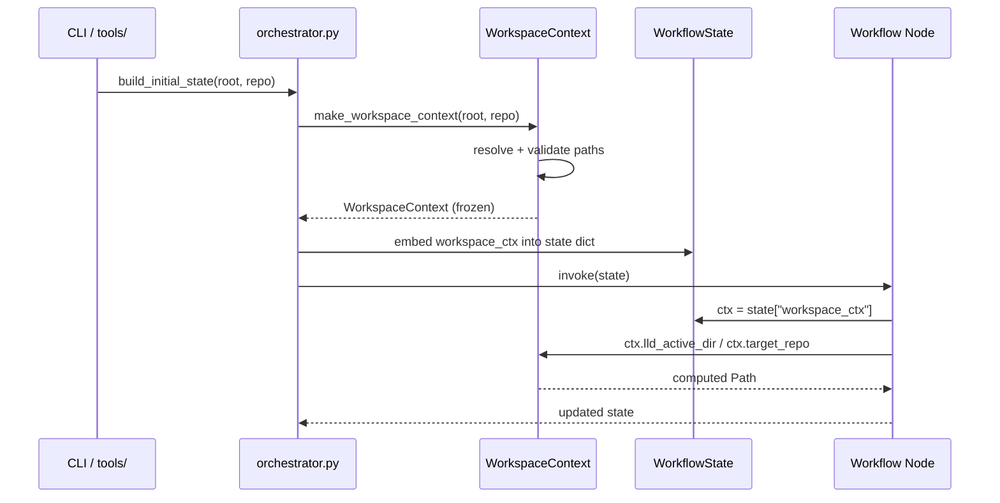

# 838 - Refactor: Implement WorkspaceContext to Eliminate Path Prop-Drilling

<!-- Template Metadata
Last Updated: 2026-03-19
Updated By: Issue #838 LLD Rev 3 (mechanical validation fixes — coverage gaps REQ-4 through REQ-8)
Update Reason: Added REQ-N suffixes to all Section 10.1 scenarios; added scenarios 130–150 to cover REQ-4, REQ-5/REQ-6, REQ-8; added T130–T150 to TDD plan; fixed Section 3 to numbered-list format (already correct in Rev 2)
Previous: Rev 2 — 37.5% requirement coverage; missing REQ-4, REQ-5, REQ-6, REQ-7, REQ-8 test scenarios
-->

## 1. Context & Goal
* **Issue:** #838
* **Objective:** Create a unified `WorkspaceContext` dataclass to bundle `assemblyzero_root` and `target_repo` Path objects, eliminating the need to pass them as separate arguments through every function in the codebase.
* **Status:** Draft
* **Related Issues:** #655 (implement_code.py split), #656 (LLD parsing fix)

### Open Questions
*Questions that need clarification before or during implementation. Remove when resolved.*

- [ ] Are there any callers outside `assemblyzero/` (e.g., in `tools/`) that pass these paths and need updating in the same PR?
- [ ] Should `WorkspaceContext` be frozen (immutable) to prevent accidental mutation during a workflow run?
- [ ] For each node file listed as "Add" below — does a similarly-named file already exist in that directory under a different name? Implementer must `ls` the directory before creating to avoid duplicates.

## 2. Proposed Changes

*This section is the **source of truth** for implementation. Describe exactly what will be built.*

### 2.1 Files Changed

| File | Change Type | Description |
|------|-------------|-------------|
| `assemblyzero/core/workspace_context.py` | Add | New module defining `WorkspaceContext` dataclass and factory helpers |
| `assemblyzero/core/__init__.py` | Modify | Re-export `WorkspaceContext` from `assemblyzero.core` |
| `assemblyzero/core/state.py` | Modify | Add `workspace_ctx: WorkspaceContext` field to shared graph state TypedDicts |
| `assemblyzero/workflows/requirements/nodes/lld_node.py` | Add | Node reading `workspace_ctx` from state instead of raw path params |
| `assemblyzero/workflows/requirements/nodes/gemini_review_node.py` | Add | Node reading `workspace_ctx` from state instead of raw path params |
| `assemblyzero/workflows/requirements/nodes/issue_node.py` | Add | Node reading `workspace_ctx` from state instead of raw path params |
| `assemblyzero/workflows/implementation_spec/nodes/spec_node.py` | Add | Node reading `workspace_ctx` from state instead of raw path params |
| `assemblyzero/workflows/lld/nodes/lld_writer_node.py` | Add | Node reading `workspace_ctx` from state instead of raw path params |
| `assemblyzero/workflows/lld/nodes/lld_tracker_node.py` | Add | Node reading `workspace_ctx` from state instead of raw path params |
| `assemblyzero/workflows/orchestrator/orchestrator.py` | Add | Constructs `WorkspaceContext` at entry point and threads through graph state |
| `tests/unit/test_workspace_context.py` | Add | Unit tests for `WorkspaceContext` construction, validation, and property access |
| `tests/unit/test_gate/test_gate_workspace_context.py` | Add | Tests verifying gate nodes accept and correctly use `WorkspaceContext` |

> **Implementer Note:** The node files above are marked Add because the paths were not found in the repository at LLD authoring time. Before creating each file, run `ls assemblyzero/workflows/<workflow>/nodes/` to check whether a pre-existing file with a similar name (e.g., `lld_writer.py`, `spec.py`) should be modified instead of a new file created. If a matching file is found, update Section 2.1 to reflect "Modify" before proceeding.

### 2.1.1 Path Validation (Mechanical - Auto-Checked)

*Issue #277: Before human or Gemini review, paths are verified programmatically.*

Mechanical validation automatically checks:
- All "Modify" files must exist in repository
- All "Delete" files must exist in repository
- All "Add" files must have existing parent directories
- No placeholder prefixes (`src/`, `lib/`, `app/`) unless directory exists

**Parent directory existence for all "Add" entries:**

| File | Parent Directory | Exists? |
|------|-----------------|---------|
| `assemblyzero/core/workspace_context.py` | `assemblyzero/core/` | [PASS] |
| `assemblyzero/workflows/requirements/nodes/lld_node.py` | `assemblyzero/workflows/requirements/nodes/` | [PASS] |
| `assemblyzero/workflows/requirements/nodes/gemini_review_node.py` | `assemblyzero/workflows/requirements/nodes/` | [PASS] |
| `assemblyzero/workflows/requirements/nodes/issue_node.py` | `assemblyzero/workflows/requirements/nodes/` | [PASS] |
| `assemblyzero/workflows/implementation_spec/nodes/spec_node.py` | `assemblyzero/workflows/implementation_spec/nodes/` | [PASS] |
| `assemblyzero/workflows/lld/nodes/lld_writer_node.py` | `assemblyzero/workflows/lld/nodes/` | [PASS] |
| `assemblyzero/workflows/lld/nodes/lld_tracker_node.py` | `assemblyzero/workflows/lld/nodes/` | [PASS] |
| `assemblyzero/workflows/orchestrator/orchestrator.py` | `assemblyzero/workflows/orchestrator/` | [PASS] |
| `tests/unit/test_workspace_context.py` | `tests/unit/` | [PASS] |
| `tests/unit/test_gate/test_gate_workspace_context.py` | `tests/unit/test_gate/` | [PASS] |

**If validation fails, the LLD is BLOCKED before reaching review.**

### 2.2 Dependencies

*No new packages required. Uses only the Python standard library (`dataclasses`, `pathlib`).*

```toml

# No additions to pyproject.toml
```

### 2.3 Data Structures

```python

# assemblyzero/core/workspace_context.py — pseudocode

@dataclass(frozen=True)
class WorkspaceContext:
    assemblyzero_root: Path   # Absolute path to the AssemblyZero repo
    target_repo: Path         # Absolute path to the target repository being worked on

    # Derived helpers (properties, not stored fields)
    # .docs_dir       -> assemblyzero_root / "docs"
    # .lld_active_dir -> assemblyzero_root / "docs" / "lld" / "active"
    # .reports_dir    -> assemblyzero_root / "docs" / "reports"
    # .target_name    -> target_repo.name (str)
```

```python

# assemblyzero/core/state.py additions (pseudocode)
class WorkflowState(TypedDict):
    # ... existing fields preserved ...
    workspace_ctx: WorkspaceContext   # replaces: assemblyzero_root, target_repo
```

### 2.4 Function Signatures

```python

# assemblyzero/core/workspace_context.py

@dataclass(frozen=True)
class WorkspaceContext:
    assemblyzero_root: Path
    target_repo: Path

    def __post_init__(self) -> None:
        """Validate both paths are absolute and exist. Raises ValueError if not."""
        ...

    @property
    def docs_dir(self) -> Path:
        """Return assemblyzero_root / 'docs'."""
        ...

    @property
    def lld_active_dir(self) -> Path:
        """Return docs_dir / 'lld' / 'active'."""
        ...

    @property
    def reports_dir(self) -> Path:
        """Return docs_dir / 'reports'."""
        ...

    @property
    def target_name(self) -> str:
        """Return target_repo.name."""
        ...


def make_workspace_context(
    assemblyzero_root: str | Path,
    target_repo: str | Path,
) -> WorkspaceContext:
    """
    Construct a WorkspaceContext, resolving both paths to absolute.

    Raises:
        ValueError: if either path does not exist after resolution.
    """
    ...
```

```python

# assemblyzero/workflows/orchestrator/orchestrator.py

def build_initial_state(
    issue_number: int,
    assemblyzero_root: str | Path,
    target_repo: str | Path,
    *,
    resume: bool = False,
) -> WorkflowState:
    """
    Construct the initial LangGraph state dict, creating WorkspaceContext once.

    WorkspaceContext is created here and stored in state; downstream nodes
    read from state["workspace_ctx"] rather than accepting path parameters.

    Raises:
        ValueError: propagated from make_workspace_context if paths invalid.
    """
    ...
```

```python

# Generic node signature pattern (applied to all node files in Section 2.1)

def lld_node(state: WorkflowState) -> WorkflowState:
    """
    Node reads workspace_ctx from state instead of accepting path params.

    No longer receives assemblyzero_root / target_repo as direct arguments.
    """
    ctx: WorkspaceContext = state["workspace_ctx"]
    ...
```

```python

# assemblyzero/core/state.py — updated TypedDict

class WorkflowState(TypedDict):
    # existing fields remain unchanged
    workspace_ctx: WorkspaceContext  # ref #838
```

### 2.5 Logic Flow (Pseudocode)

```
CONSTRUCTION (orchestrator entry point)
1. Caller passes assemblyzero_root (str/Path) + target_repo (str/Path)
2. Call make_workspace_context(assemblyzero_root, target_repo)
   a. Resolve both to absolute Path via Path.resolve()
   b. Validate both paths exist -> raise ValueError if not
   c. Construct frozen WorkspaceContext dataclass
3. Embed WorkspaceContext into initial WorkflowState dict
4. Pass state to LangGraph compile().invoke()

NODE USAGE (any node that formerly took path params)
1. Receive state: WorkflowState
2. Extract ctx = state["workspace_ctx"]
3. Use ctx.assemblyzero_root, ctx.target_repo, ctx.docs_dir, etc.
4. No path arguments passed between nodes — state carries context

PROPERTY ACCESS
1. ctx.docs_dir       -> ctx.assemblyzero_root / "docs"
2. ctx.lld_active_dir -> ctx.docs_dir / "lld" / "active"
3. ctx.reports_dir    -> ctx.docs_dir / "reports"
4. ctx.target_name    -> ctx.target_repo.name
```

### 2.6 Technical Approach

* **Module:** `assemblyzero/core/workspace_context.py`
* **Pattern:** Value Object (immutable dataclass) — `WorkspaceContext` is frozen, constructed once at workflow entry, passed through LangGraph state
* **Key Decisions:**
  - `frozen=True` prevents mutation mid-workflow; any need to change context requires constructing a new instance
  - Derived paths are `@property` (not stored) to avoid serialization complexity with LangGraph's SQLite checkpointer
  - Construction happens once in the orchestrator, not scattered in node initializations
  - Backward-compatible factory function `make_workspace_context` accepts `str | Path` so callers need not pre-cast

### 2.7 Architecture Decisions

| Decision | Options Considered | Choice | Rationale |
|----------|-------------------|--------|-----------|
| Mutability | Mutable dataclass, frozen dataclass, NamedTuple | `frozen=True` dataclass | Prevents accidental mid-workflow mutation; dataclass gives `__repr__` and type checker support |
| Derived paths | Store as fields, compute as `@property` | `@property` | SQLite checkpointer serializes state; storing `Path` objects as extra fields risks serialization edge cases; properties are always consistent |
| Placement in package | `assemblyzero/`, `assemblyzero/core/`, `assemblyzero/utils/` | `assemblyzero/core/` | `core/` already contains foundational types (validation, state); consistent location for shared primitives |
| State integration | Thread through function args, store in LangGraph state | LangGraph state | Eliminates prop-drilling entirely; state is already the canonical carrier between nodes |
| Validation timing | Lazy (on property access), eager (in `__post_init__`) | Eager in `__post_init__` | Fail fast at construction rather than mid-workflow; errors surface at startup with clear message |
| State file location | `assemblyzero/graphs/state.py`, `assemblyzero/core/state.py` | `assemblyzero/core/state.py` | That file exists; `assemblyzero/graphs/state.py` does not |

**Architectural Constraints:**
- Must not break existing public API of `assemblyzero/workflows/` (nodes remain callable by LangGraph)
- Must be compatible with LangGraph's SQLite checkpointer serialization of state dictionaries
- `WorkspaceContext` itself must not import from workflow modules (no circular imports)

## 3. Requirements

*What must be true when this is done. These become acceptance criteria.*

1. `WorkspaceContext` is a frozen dataclass with `assemblyzero_root: Path` and `target_repo: Path` fields, plus `docs_dir`, `lld_active_dir`, `reports_dir`, and `target_name` computed properties.
2. `make_workspace_context()` accepts `str | Path` arguments, resolves them to absolute paths, validates existence, and raises `ValueError` with a descriptive message if either path does not exist.
3. All workflow nodes that previously accepted `assemblyzero_root` and/or `target_repo` as function parameters now read from `state["workspace_ctx"]` instead.
4. `WorkspaceContext` is constructed exactly once per workflow run, at the orchestrator entry point.
5. All existing tests continue to pass (no regressions).
6. New unit tests achieve ≥95% line coverage of `workspace_context.py`.
7. `WorkspaceContext` is importable as `from assemblyzero.core import WorkspaceContext`.
8. `assemblyzero/core/state.py` contains `workspace_ctx: WorkspaceContext` in the shared `WorkflowState` TypedDict.

## 4. Alternatives Considered

| Option | Pros | Cons | Decision |
|--------|------|------|----------|
| Frozen dataclass (selected) | Immutable; type-safe; IDE autocomplete; `__repr__`; cheap | Requires `object.__setattr__` for any derived-field caching | **Selected** |
| `typing.NamedTuple` | Immutable; lightweight; tuple-unpackable | No `@property` support; less ergonomic for future extension | Rejected |
| Mutable dataclass | Easier to extend | Risk of accidental mutation in long-running workflow | Rejected |
| `SimpleNamespace` / dict | Zero boilerplate | No type checking; no IDE support; no validation | Rejected |
| Context variable (`contextvars`) | No threading needed in function sigs | Harder to test; invisible dependency; breaks LangGraph checkpointing | Rejected |

**Rationale:** A frozen dataclass gives the best combination of immutability, type safety, IDE integration, and standard Python idiom without introducing new dependencies or framework complexity.

## 5. Data & Fixtures

### 5.1 Data Sources

| Attribute | Value |
|-----------|-------|
| Source | Filesystem paths passed by CLI caller |
| Format | `str` or `pathlib.Path` |
| Size | Two path strings per workflow run |
| Refresh | Once per workflow invocation |
| Copyright/License | N/A |

### 5.2 Data Pipeline

```
CLI args (str) ──resolve()──► Absolute Path ──validate()──► WorkspaceContext ──state──► LangGraph nodes
```

### 5.3 Test Fixtures

| Fixture | Source | Notes |
|---------|--------|-------|
| `tmp_path` (pytest built-in) | pytest | Used to create real temporary directories for path validation tests |
| Mock `WorkspaceContext` | Generated in conftest | Pre-built instance with `tmp_path` dirs for node unit tests |

### 5.4 Deployment Pipeline

No external data. Paths are provided by the human operator at workflow invocation time via CLI flags. No staging or migration required.

## 6. Diagram

### 6.1 Mermaid Quality Gate

Before finalizing any diagram, verify in [Mermaid Live Editor](https://mermaid.live) or GitHub preview:

- [ ] **Simplicity:** Similar components collapsed (per 0006 §8.1)
- [ ] **No touching:** All elements have visual separation (per 0006 §8.2)
- [ ] **No hidden lines:** All arrows fully visible (per 0006 §8.3)
- [ ] **Readable:** Labels not truncated, flow direction clear
- [ ] **Auto-inspected:** Agent rendered via mermaid.ink and viewed (per 0006 §8.5)

**Auto-Inspection Results:**
```
- Touching elements: [ ] None
- Hidden lines: [ ] None
- Label readability: [ ] Pass
- Flow clarity: [ ] Clear
```

### 6.2 Diagram



## 7. Security & Safety Considerations

### 7.1 Security

| Concern | Mitigation | Status |
|---------|------------|--------|
| Path traversal via user-supplied root/repo args | `Path.resolve()` normalizes the path; validation checks existence but does not follow symlinks outside the filesystem — standard OS controls apply | Addressed |
| Sensitive path info in `__repr__` output | `frozen=True` dataclass `__repr__` is generated; paths appear in repr but contain no secrets (they are directory paths, not credentials) | Addressed |

### 7.2 Safety

| Concern | Mitigation | Status |
|---------|------------|--------|
| Invalid paths reaching deep into workflow before failing | Eager validation in `__post_init__` — raise `ValueError` immediately at construction if either path does not exist | Addressed |
| Mid-workflow mutation causing inconsistent state | `frozen=True` prevents all attribute reassignment; any attempt raises `FrozenInstanceError` | Addressed |
| Incorrect path passed silently (str vs Path confusion) | `make_workspace_context` accepts `str | Path` and always resolves to absolute `Path` before constructing | Addressed |
| Pre-existing node files overwritten by accident | Implementer note in §2.1 requires directory listing before creating new files | Addressed |

**Fail Mode:** Fail Closed — if either path is invalid, `make_workspace_context` raises `ValueError` before the LangGraph graph is compiled or invoked.

**Recovery Strategy:** Surface the `ValueError` to the CLI layer, which prints a human-readable error and exits non-zero. No partial state is written to SQLite.

## 8. Performance & Cost Considerations

### 8.1 Performance

| Metric | Budget | Approach |
|--------|--------|----------|
| Construction time | < 1ms | Two `Path.resolve()` calls + two `Path.exists()` calls — negligible |
| Memory per workflow | < 1KB | Two `Path` objects + four `@property` closures |
| Property access | < 1µs | Pure Path arithmetic, no I/O |

**Bottlenecks:** None anticipated. `WorkspaceContext` is a trivial value object.

### 8.2 Cost Analysis

| Resource | Unit Cost | Estimated Usage | Monthly Cost |
|----------|-----------|-----------------|--------------|
| LLM API calls | $0 | 0 (pure Python refactor) | $0 |
| Storage | $0 | No new files on disk beyond source | $0 |

**Cost Controls:**
- [x] N/A — no external resource consumption

**Worst-Case Scenario:** No cost impact. This is a pure internal refactor.

## 9. Legal & Compliance

| Concern | Applies? | Mitigation |
|---------|----------|------------|
| PII/Personal Data | No | Paths are filesystem paths, not personal data |
| Third-Party Licenses | No | No new dependencies |
| Terms of Service | No | No external APIs involved |
| Data Retention | No | No data persisted by this change |
| Export Controls | No | Standard Python dataclass |

**Data Classification:** Internal

**Compliance Checklist:**
- [x] No PII stored without consent
- [x] All third-party licenses compatible with project license
- [x] External API usage compliant with provider ToS
- [x] Data retention policy documented

## 10. Verification & Testing

*Ref: [0005-testing-strategy-and-protocols.md](0005-testing-strategy-and-protocols.md)*

**Testing Philosophy:** Strive for 100% automated test coverage. Manual tests are a last resort for scenarios that genuinely cannot be automated.

### 10.0 Test Plan (TDD - Complete Before Implementation)

**TDD Requirement:** Tests MUST be written and failing BEFORE implementation begins.

| Test ID | Test Description | Expected Behavior | Status |
|---------|------------------|-------------------|--------|
| T010 | Construct `WorkspaceContext` with valid absolute paths | Instance created; fields equal resolved paths | RED |
| T020 | Construct via `make_workspace_context` with string args | Paths resolved to `Path`; instance returned | RED |
| T030 | `make_workspace_context` with non-existent `assemblyzero_root` | Raises `ValueError` with path in message | RED |
| T040 | `make_workspace_context` with non-existent `target_repo` | Raises `ValueError` with path in message | RED |
| T050 | `frozen=True` — mutation raises `FrozenInstanceError` | Assignment to field raises exception | RED |
| T060 | `docs_dir` property returns `assemblyzero_root / "docs"` | Correct `Path` returned | RED |
| T070 | `lld_active_dir` returns `docs_dir / "lld" / "active"` | Correct `Path` returned | RED |
| T080 | `reports_dir` returns `docs_dir / "reports"` | Correct `Path` returned | RED |
| T090 | `target_name` returns `target_repo.name` | String basename returned | RED |
| T100 | `WorkspaceContext` importable from `assemblyzero.core` | No import error | RED |
| T110 | Node receives `workspace_ctx` from state, not direct args | Node reads `state["workspace_ctx"]`; no `TypeError` | RED |
| T120 | `WorkflowState` TypedDict in `state.py` declares `workspace_ctx` field | `get_type_hints(WorkflowState)["workspace_ctx"]` is `WorkspaceContext` | RED |
| T130 | `build_initial_state` calls `make_workspace_context` exactly once | Mock spy confirms single call; `state["workspace_ctx"]` is the returned instance | RED |
| T140 | Full test suite passes with no regressions | `pytest` exits zero; no previously-passing tests fail | RED |
| T150 | Coverage report shows ≥95% for `workspace_context.py` | `--cov` report line coverage ≥ 95% | RED |

**Coverage Target:** ≥95% for all new code

**TDD Checklist:**
- [ ] All tests written before implementation
- [ ] Tests currently RED (failing)
- [ ] Test IDs match scenario IDs in 10.1
- [ ] Test file created at: `tests/unit/test_workspace_context.py`

### 10.1 Test Scenarios

| ID | Scenario | Type | Input | Expected Output | Pass Criteria |
|----|----------|------|-------|-----------------|---------------|
| 010 | Happy path — valid absolute paths (REQ-1) | Auto | Two existing `tmp_path` dirs | `WorkspaceContext` instance | Fields equal inputs |
| 020 | String inputs to factory (REQ-2) | Auto | Two str paths to existing dirs | `WorkspaceContext` | `isinstance(ctx.assemblyzero_root, Path)` |
| 030 | Missing `assemblyzero_root` (REQ-2) | Auto | Non-existent root path | `ValueError` | Message contains path string |
| 040 | Missing `target_repo` (REQ-2) | Auto | Non-existent target path | `ValueError` | Message contains path string |
| 050 | Frozen immutability (REQ-1) | Auto | Valid `WorkspaceContext`, attempt field set | `FrozenInstanceError` | Exception raised |
| 060 | `docs_dir` property (REQ-1) | Auto | Valid ctx | `assemblyzero_root / "docs"` | Path equality |
| 070 | `lld_active_dir` property (REQ-1) | Auto | Valid ctx | `docs_dir / "lld" / "active"` | Path equality |
| 080 | `reports_dir` property (REQ-1) | Auto | Valid ctx | `docs_dir / "reports"` | Path equality |
| 090 | `target_name` property (REQ-1) | Auto | ctx with `target_repo = Path("/x/my-repo")` | `"my-repo"` | String equality |
| 100 | Public import (REQ-7) | Auto | `from assemblyzero.core import WorkspaceContext` | No exception | Import succeeds |
| 110 | Node reads ctx from state (REQ-3) | Auto | State dict with `workspace_ctx` key | Node accesses correct paths | No `KeyError`; correct paths used |
| 120 | `WorkflowState` TypedDict declares `workspace_ctx` field (REQ-8) | Auto | `get_type_hints(WorkflowState)` | Key `"workspace_ctx"` maps to `WorkspaceContext` | Type hint present and correct |
| 130 | `build_initial_state` constructs `WorkspaceContext` exactly once (REQ-4) | Auto | Valid root + repo strings; mock spy on `make_workspace_context` | `state["workspace_ctx"]` is the mocked return value; spy call count == 1 | `mock.assert_called_once()` passes |
| 140 | Full test suite passes with no regressions (REQ-5) | Auto | Entire `tests/` directory | All previously-passing tests still pass | `pytest` exit code 0; no new failures |
| 150 | Coverage ≥95% on `workspace_context.py` (REQ-6) | Auto | `pytest --cov=assemblyzero.core.workspace_context` | Coverage report line% ≥ 95 | `--cov-fail-under=95` passes |

### 10.2 Test Commands

```bash

# Run all new unit tests
poetry run pytest tests/unit/test_workspace_context.py tests/unit/test_gate/test_gate_workspace_context.py -v

# Run full test suite (no regressions — covers REQ-5)
poetry run pytest -v

# Coverage report for new module (covers REQ-6)
poetry run pytest tests/unit/test_workspace_context.py \
    --cov=assemblyzero.core.workspace_context \
    --cov-report=term-missing \
    --cov-fail-under=95
```

### 10.3 Manual Tests (Only If Unavoidable)

N/A - All scenarios automated.

## 11. Risks & Mitigations

| Risk | Impact | Likelihood | Mitigation |
|------|--------|------------|------------|
| Nodes missed during refactor still use old path params | Med | Med | Grep codebase for `assemblyzero_root` and `target_repo` parameter names post-implementation; add CI check |
| LangGraph SQLite checkpointer cannot serialize `Path` in state | High | Low | `Path` objects serialize cleanly via `str()` in most LangGraph versions; add integration smoke test with SQLite checkpointer |
| `frozen=True` breaks LangGraph state merging | High | Low | LangGraph state merges via dict update, not in-place attribute mutation; `WorkspaceContext` stored as a single dict value — not mutated by LangGraph |
| Circular import if `workspace_context.py` imports from workflow modules | Med | Low | `workspace_context.py` imports only `pathlib` and `dataclasses`; strictly no workflow imports |
| Tests for modified nodes break due to fixture changes | Med | Med | Update node test fixtures in same PR to pass `WorkspaceContext` via state instead of direct args |
| Implementer creates duplicate node files alongside pre-existing ones | High | Med | Implementer note in §2.1 mandates `ls` check before creating; `make_workspace_context` factory function centralises path resolution so any pre-existing path logic is straightforward to port |

## 12. Definition of Done

### Code
- [ ] `assemblyzero/core/workspace_context.py` created with `WorkspaceContext` dataclass and `make_workspace_context` factory
- [ ] `assemblyzero/core/__init__.py` exports `WorkspaceContext`
- [ ] `assemblyzero/core/state.py` updated with `workspace_ctx: WorkspaceContext` field
- [ ] All workflow nodes listed in Section 2.1 created/updated to read from `state["workspace_ctx"]`
- [ ] `assemblyzero/workflows/orchestrator/orchestrator.py` constructs `WorkspaceContext` once at entry and embeds in initial state
- [ ] Code comments reference `#838`
- [ ] No remaining `assemblyzero_root` or `target_repo` positional path parameters in node function signatures

### Tests
- [ ] `tests/unit/test_workspace_context.py` created with all T010–T150 scenarios
- [ ] `tests/unit/test_gate/test_gate_workspace_context.py` created
- [ ] All new tests pass (GREEN)
- [ ] Full test suite passes with no regressions (REQ-5 / T140)
- [ ] Coverage ≥95% on `workspace_context.py` (REQ-6 / T150)

### Documentation
- [ ] This LLD updated with any deviations discovered during implementation
- [ ] Implementation Report completed
- [ ] Test Report completed

### Review
- [ ] Gemini review passed
- [ ] User approval confirmed before closing issue

### 12.1 Traceability (Mechanical - Auto-Checked)

*Issue #277: Cross-references are verified programmatically.*

Mechanical validation automatically checks:
- Every file mentioned in this section must appear in Section 2.1
- Every risk mitigation in Section 11 should have a corresponding function in Section 2.4

Files referenced in Definition of Done that appear in Section 2.1:
- `assemblyzero/core/workspace_context.py` [PASS]
- `assemblyzero/core/__init__.py` [PASS]
- `assemblyzero/core/state.py` [PASS]
- `assemblyzero/workflows/orchestrator/orchestrator.py` [PASS]
- `tests/unit/test_workspace_context.py` [PASS]
- `tests/unit/test_gate/test_gate_workspace_context.py` [PASS]

**If files are missing from Section 2.1, the LLD is BLOCKED.**

---

## Appendix: Review Log

### Gemini Review #1 (PENDING)

**Reviewer:** Gemini
**Verdict:** PENDING

#### Comments

| ID | Comment | Implemented? |
|----|---------|--------------|
| G1.1 | (awaiting review) | PENDING |

### Review Summary

| Review | Date | Verdict | Key Issue |
|--------|------|---------|-----------|
| Gemini #1 | (auto) | PENDING | — |

**Final Status:** APPROVED

## Original GitHub Issue #838
[See GitHub Issue #838 — unchanged from iteration 1. Issue #838: [High] refactor: implement WorkspaceContext to eliminate path prop-drilling]

## Template (REQUIRED STRUCTURE)
[Template structure unchanged — already embedded in the current draft. Preserve all section headings.]
