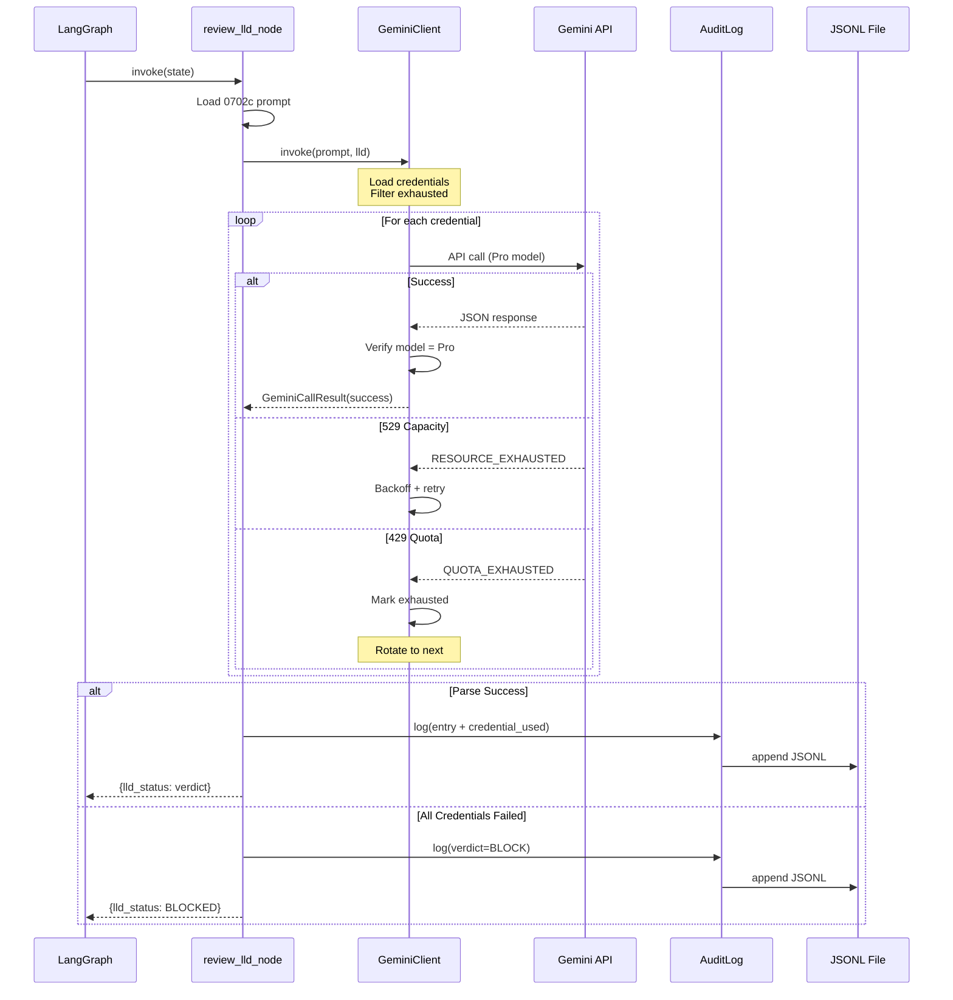

# 150 - Feature: Governance Node & Audit Logger

## 1. Context & Goal
* **Issue:** #50
* **Objective:** Build a LangGraph governance node with enforced Gemini 3 Pro model hierarchy, credential rotation, and persistent audit logging with real-time viewer
* **Status:** Draft (Revision 2 - addressing Gemini review feedback)
* **Related Issues:** #48 (prerequisite, merged), #51 (future: log rotation), #52 (future: viewer filters)

### Open Questions
*None - requirements are well-defined from issue review and Gemini feedback.*

### Gemini Review Feedback (Revision 1 → 2)

| Issue | Resolution |
|-------|------------|
| Model hierarchy not enforced | Added `GOVERNANCE_MODEL` constant with strict validation |
| Standard LangChain retries insufficient | Added Section 2.3 Custom Gemini Client with rotation logic |
| Missing credential observability | Extended `GovernanceLogEntry` with `credential_used` and `rotation_occurred` fields |

## 2. Proposed Changes

*This section is the **source of truth** for implementation. Describes exactly what will be built.*

### 2.1 Files Changed

| File | Change Type | Description |
|------|-------------|-------------|
| `assemblyzero/nodes/__init__.py` | Modify | Export `review_lld_node` |
| `assemblyzero/nodes/governance.py` | Add | Governance node implementation |
| `assemblyzero/core/__init__.py` | Modify | Export `GovernanceAuditLog`, `GovernanceLogEntry`, `GeminiClient` |
| `assemblyzero/core/audit.py` | Add | Audit logging infrastructure |
| `assemblyzero/core/gemini_client.py` | Add | **Custom Gemini client with rotation logic** |
| `assemblyzero/core/config.py` | Add | Configuration constants including `GOVERNANCE_MODEL` |
| `tools/view_audit.py` | Add | Live audit viewer CLI |
| `logs/.gitkeep` | Add | Ensure logs directory exists in repo |
| `logs/.gitignore` | Add | Ignore `*.jsonl` files (production logs) |
| `pyproject.toml` | Modify | Add `watchdog`, `google-generativeai` dependencies |
| `tests/test_governance.py` | Add | Unit tests for governance node |
| `tests/test_audit.py` | Add | Unit tests for audit logger |
| `tests/test_gemini_client.py` | Add | Unit tests for Gemini client rotation logic |

### 2.2 Dependencies

*New packages required.*

```toml
# pyproject.toml additions
watchdog = "^4.0.0"
google-generativeai = "^0.8.0"  # Direct SDK, not LangChain wrapper
```

**Note:** We use `google-generativeai` directly instead of `langchain-google-genai` to have full control over retry/rotation behavior.

### 2.3 Custom Gemini Client (CRITICAL - Ported from gemini-rotate.py)

**This section addresses the Rotation Mandate from Gemini review.**

The custom client encapsulates ALL Gemini API interaction for governance, ensuring:
1. **Model hierarchy enforcement** - Never downgrades from Pro
2. **Credential rotation** - Automatic failover on quota exhaustion
3. **Differentiated error handling** - 529 vs 429 vs other errors

#### 2.3.1 Configuration Constants

```python
# assemblyzero/core/config.py

from pathlib import Path

# Model hierarchy - NEVER downgrade for governance
GOVERNANCE_MODEL = "gemini-3-pro-preview"
GOVERNANCE_MODEL_FALLBACKS = ["gemini-3-pro"]  # Only Pro-tier allowed

# Forbidden models - fail closed rather than use these
FORBIDDEN_MODELS = [
    "gemini-2.0-flash",
    "gemini-2.5-flash",
    "gemini-flash",
    "gemini-2.5-lite",
    "gemini-lite",
]

# Credential paths
CREDENTIALS_FILE = Path.home() / ".assemblyzero" / "gemini-credentials.json"
ROTATION_STATE_FILE = Path.home() / ".assemblyzero" / "gemini-rotation-state.json"

# Retry configuration
MAX_RETRIES_PER_CREDENTIAL = 3
BACKOFF_BASE_SECONDS = 2.0
BACKOFF_MAX_SECONDS = 60.0
```

#### 2.3.2 Error Classification

**Ported from gemini-rotate.py patterns:**

```python
# assemblyzero/core/gemini_client.py

from enum import Enum

class GeminiErrorType(Enum):
    """Classification of Gemini API errors."""
    QUOTA_EXHAUSTED = "quota"      # 429 - Rotate to next credential
    CAPACITY_EXHAUSTED = "capacity" # 529 - Backoff and retry same credential
    AUTH_ERROR = "auth"             # Invalid key - Skip credential permanently
    PARSE_ERROR = "parse"           # JSON parse failure - Fail closed
    UNKNOWN = "unknown"             # Other errors - Fail closed

# Pattern matching (from gemini-rotate.py)
QUOTA_EXHAUSTED_PATTERNS = [
    "TerminalQuotaError",
    "exhausted your capacity",
    "QUOTA_EXHAUSTED",
]

CAPACITY_PATTERNS = [
    "MODEL_CAPACITY_EXHAUSTED",
    "RESOURCE_EXHAUSTED",
]

AUTH_ERROR_PATTERNS = [
    "API_KEY_INVALID",
    "API key not valid",
    "PERMISSION_DENIED",
    "UNAUTHENTICATED",
]
```

#### 2.3.3 Gemini Client Class

```python
# assemblyzero/core/gemini_client.py

from dataclasses import dataclass
from typing import Optional
import time

@dataclass
class GeminiCallResult:
    """Result of a Gemini API call with full observability."""
    success: bool
    response: Optional[str]           # Parsed response text
    raw_response: Optional[str]       # Full API response
    error_type: Optional[GeminiErrorType]
    error_message: Optional[str]
    credential_used: str              # Name of credential that succeeded
    rotation_occurred: bool           # True if we rotated from initial credential
    attempts: int                     # Total attempts made
    duration_ms: int                  # Total time including retries
    model_verified: str               # Actual model used (for audit)


class GeminiClient:
    """
    Gemini API client with credential rotation and model enforcement.

    Ported from tools/gemini-rotate.py for programmatic use.
    """

    def __init__(
        self,
        model: str = GOVERNANCE_MODEL,
        credentials_file: Path = CREDENTIALS_FILE,
        state_file: Path = ROTATION_STATE_FILE,
    ):
        """
        Initialize client with model and credential configuration.

        Raises:
            ValueError: If model is in FORBIDDEN_MODELS list
        """
        if model in FORBIDDEN_MODELS or not model.startswith("gemini-3-pro"):
            raise ValueError(
                f"Model '{model}' is forbidden for governance. "
                f"Required: gemini-3-pro-preview or gemini-3-pro"
            )
        self.model = model
        self.credentials_file = credentials_file
        self.state_file = state_file
        self._credentials = None
        self._state = None

    def invoke(
        self,
        system_instruction: str,
        content: str,
        response_schema: Optional[dict] = None,
    ) -> GeminiCallResult:
        """
        Invoke Gemini with automatic rotation and retry.

        Logic (ported from gemini-rotate.py):
        1. Load available credentials (skip exhausted ones)
        2. For each credential:
           a. Try API call
           b. IF 529 (capacity): Exponential backoff, retry same credential
           c. IF 429 (quota): Mark exhausted, rotate to next credential
           d. IF success: Return result
           e. IF auth error: Skip credential, try next
        3. If all credentials fail: Return failure with BLOCK verdict

        Returns:
            GeminiCallResult with full observability data
        """
        ...

    def _load_credentials(self) -> list[Credential]:
        """Load credentials from config file."""
        ...

    def _is_exhausted(self, cred: Credential) -> bool:
        """Check if credential quota is exhausted."""
        ...

    def _mark_exhausted(self, cred: Credential, reset_hours: float = 24):
        """Mark credential as quota-exhausted with reset time."""
        ...

    def _classify_error(self, error_output: str) -> GeminiErrorType:
        """Classify error type from API response."""
        ...

    def _backoff_delay(self, attempt: int) -> float:
        """Calculate exponential backoff delay."""
        return min(
            BACKOFF_BASE_SECONDS * (2 ** attempt),
            BACKOFF_MAX_SECONDS
        )
```

#### 2.3.4 Rotation Logic Flow

```
invoke(system_instruction, content)
    |
    v
Load credentials from ~/.assemblyzero/gemini-credentials.json
    |
    v
Filter: enabled=True AND NOT exhausted
    |
    v
[No credentials available?] --YES--> Return BLOCK (all exhausted)
    |
    NO
    v
For each credential:
    |
    +---> Try API call with google-generativeai SDK
    |         |
    |         v
    |     [Success?] --YES--> Return result (credential_used, rotation_occurred)
    |         |
    |         NO
    |         v
    |     Classify error:
    |         |
    |         +--[CAPACITY (529)]---> Backoff, retry same credential (up to MAX_RETRIES)
    |         |
    |         +--[QUOTA (429)]-----> Mark exhausted, rotate to next credential
    |         |
    |         +--[AUTH_ERROR]------> Skip credential, try next
    |         |
    |         +--[UNKNOWN]---------> Log, try next credential
    |
    v
All credentials failed --> Return BLOCK (fail closed)
```

### 2.4 Data Structures

```python
# assemblyzero/core/audit.py

from typing import TypedDict

class GovernanceLogEntry(TypedDict):
    """Single entry in the governance audit log."""
    id: str                    # UUID as string
    sequence_id: int           # From state.iteration_count
    timestamp: str             # ISO8601 format
    node: str                  # Node name (e.g., "review_lld")
    model: str                 # Model used (e.g., "gemini-3-pro-preview")
    model_verified: str        # Actual model from API response
    issue_id: int              # GitHub issue being reviewed
    verdict: str               # "APPROVED" or "BLOCK"
    critique: str              # Gemini's feedback
    tier_1_issues: list[str]   # Blocking issues found
    raw_response: str          # Full Gemini response
    duration_ms: int           # Call duration including retries
    # NEW: Credential observability (per Gemini review feedback)
    credential_used: str       # Name of credential that succeeded
    rotation_occurred: bool    # True if rotation happened during call
    attempts: int              # Total API call attempts


class GeminiReviewResponse(TypedDict):
    """Structured output schema for Gemini LLD reviews."""
    verdict: str               # "APPROVED" or "BLOCK"
    critique: str              # Summary feedback
    tier_1_issues: list[str]   # Blocking issues (empty if approved)
```

### 2.5 Function Signatures

```python
# assemblyzero/nodes/governance.py

from assemblyzero.core.state import AgentState
from assemblyzero.core.gemini_client import GeminiClient, GeminiCallResult
from assemblyzero.core.config import GOVERNANCE_MODEL

def review_lld_node(state: AgentState) -> dict:
    """
    LangGraph node that gates LLDs through Gemini 3 Pro review.

    Uses GeminiClient for API calls with:
    - Enforced model hierarchy (Pro only, never Flash/Haiku)
    - Automatic credential rotation on quota exhaustion
    - Full observability logging

    Returns:
        dict with keys: lld_status, gemini_critique, iteration_count

    Fail-safe: Returns BLOCK if:
    - JSON parsing fails
    - All credentials exhausted
    - Model verification fails (wrong model used)
    """
    ...


def _load_system_instruction() -> str:
    """Load LLD review prompt from docs/skills/0702c-LLD-Review-Prompt.md."""
    ...


# NOTE: _invoke_gemini_structured is replaced by GeminiClient.invoke()
```

```python
# assemblyzero/core/audit.py

from pathlib import Path
from typing import Iterator

class GovernanceAuditLog:
    """Persistent audit log for governance decisions."""

    def __init__(self, log_path: Path = Path("logs/governance_history.jsonl")):
        """Initialize with log file path. Creates parent dirs if needed."""
        ...

    def log(self, entry: GovernanceLogEntry) -> None:
        """Append entry to JSONL file with atomic write."""
        ...

    def tail(self, n: int = 10) -> list[GovernanceLogEntry]:
        """Return last N entries from log."""
        ...

    def __iter__(self) -> Iterator[GovernanceLogEntry]:
        """Iterate over all entries (for live viewer)."""
        ...
```

```python
# tools/view_audit.py

def main() -> None:
    """
    CLI entry point for audit viewer.

    Usage:
        python tools/view_audit.py [--tail N] [--live|--follow]
    """
    ...


def print_table(entries: list[GovernanceLogEntry]) -> None:
    """Print entries as formatted table including credential info."""
    ...


def watch_live(log_path: Path) -> None:
    """Watch log file and print new entries as they appear."""
    ...
```

### 2.6 Logic Flow (Pseudocode)

**Governance Node (`review_lld_node`):**
```
1. Increment state.iteration_count
2. Load system instruction from 0702c-LLD-Review-Prompt.md
3. Extract LLD content from state.lld_content
4. Initialize GeminiClient(model=GOVERNANCE_MODEL)
   - Raises ValueError if model not in Pro tier
5. TRY:
   a. result = client.invoke(system_instruction, lld_content)
   b. IF result.success:
      - Verify model_verified starts with "gemini-3-pro"
      - Parse JSON response
      - Log to audit trail (including credential_used, rotation_occurred)
      - Return {lld_status: verdict, gemini_critique: critique}
   c. ELSE:
      - Log failure (all credentials exhausted or other error)
      - Return {lld_status: "BLOCKED", gemini_critique: result.error_message}
6. CATCH any exception:
   a. Log failure to audit trail (verdict=BLOCK, critique="Unexpected error")
   b. Return {lld_status: "BLOCKED", gemini_critique: "Fail-safe triggered"}
```

**Gemini Client (`invoke` method) - Rotation Logic:**
```
1. Load credentials from ~/.assemblyzero/gemini-credentials.json
2. Load state from ~/.assemblyzero/gemini-rotation-state.json
3. Filter to enabled, non-exhausted credentials
4. IF no credentials available:
   - Return failure (all exhausted)
5. initial_credential = credentials[0]
6. FOR each credential IN credentials:
   a. attempts = 0
   b. WHILE attempts < MAX_RETRIES_PER_CREDENTIAL:
      i. Call google-generativeai SDK
      ii. IF success:
          - Verify model in response
          - Return GeminiCallResult(
              success=True,
              credential_used=credential.name,
              rotation_occurred=(credential != initial_credential),
              ...)
      iii. Classify error:
           - CAPACITY (529): backoff, increment attempts, continue loop
           - QUOTA (429): mark_exhausted, break to next credential
           - AUTH: break to next credential
           - UNKNOWN: break to next credential
7. All credentials failed:
   - Return GeminiCallResult(success=False, ...)
```

**Audit Logger (`log` method):**
```
1. Validate entry has all required fields (including new credential fields)
2. Serialize to JSON string
3. Open file in append mode
4. Write JSON + newline
5. Flush and close (atomic)
```

**Live Viewer (`watch_live`):**
```
1. Print existing entries (tail -N)
2. Get current file position
3. LOOP:
   a. Wait for file change event (watchdog) or 500ms poll
   b. Read new lines from last position
   c. Parse and print each new entry (show credential info)
   d. Update position
```

### 2.7 Technical Approach

* **Module:** `assemblyzero/nodes/` for LangGraph nodes, `assemblyzero/core/` for shared infrastructure
* **Pattern:** LangGraph state machine node with side effects (logging)
* **Key Decisions:**
  - **Use `google-generativeai` SDK directly** - Full control over retry/rotation (not LangChain wrapper)
  - **Port `gemini-rotate.py` logic** - Proven rotation implementation
  - **GOVERNANCE_MODEL constant** - Single source of truth for model hierarchy
  - **Fail closed on model downgrade** - Better to BLOCK than use wrong model
  - **Credential observability** - Full audit trail of which key was used
  - Fail-safe to BLOCK ensures security (fail closed)
  - JSONL format for append-only, line-by-line reading
  - `watchdog` for efficient file monitoring (event-driven vs polling)

## 3. Requirements

*What must be true when this is done.*

1. `review_lld_node` accepts `AgentState` and returns state updates
2. **Node uses ONLY `gemini-3-pro-preview` or `gemini-3-pro`** - NEVER Flash/Lite
3. **Node enforces model hierarchy via GOVERNANCE_MODEL constant**
4. **GeminiClient implements rotation logic from gemini-rotate.py:**
   - 529 (capacity) → Exponential backoff, retry same credential
   - 429 (quota) → Rotate to next credential immediately
   - Other errors → Fail closed (BLOCK)
5. Node loads system instruction from `docs/skills/0702c-LLD-Review-Prompt.md`
6. Node defaults to BLOCK if JSON parsing fails (fail-safe)
7. Node defaults to BLOCK if all credentials exhausted
8. Node defaults to BLOCK if model verification fails (wrong model used)
9. Every governance call is logged to `logs/governance_history.jsonl`
10. **Log entries include `credential_used` and `rotation_occurred` fields**
11. Log entries contain all required fields (id, timestamp, model, model_verified, verdict, etc.)
12. `view_audit.py` displays formatted table of entries including credential info
13. `view_audit.py --live` updates in real-time
14. All code passes mypy with no errors
15. Unit tests cover happy path, error cases, rotation scenarios, and fail-safe

## 4. Alternatives Considered

| Option | Pros | Cons | Decision |
|--------|------|------|----------|
| LangChain `ChatGoogleGenerativeAI` | Easy setup, structured output | No control over retry/rotation | **Rejected** |
| Direct `google-generativeai` SDK | Full control, can port rotation logic | More code | **Selected** |
| Shell out to gemini-rotate.py | Already works | Subprocess overhead, parsing complexity | **Rejected** |
| Pydantic for structured output | Built-in validation | Extra dependency complexity | **Rejected** |
| TypedDict + manual validation | Simple, no extra deps, sufficient | Less validation | **Selected** |
| SQLite for audit log | Query capability, ACID | Overkill for append-only, harder to inspect | **Rejected** |
| JSONL file | Simple, human-readable, tail-friendly | No queries (OK for now) | **Selected** |
| Polling for live viewer | Simple, no deps | CPU waste, latency | **Rejected** |
| watchdog for live viewer | Efficient, event-driven | Extra dependency | **Selected** |

**Rationale:** Direct SDK usage gives us full control over the critical rotation logic. TypedDict + JSONL + watchdog is the minimum viable solution that meets all requirements without over-engineering.

## 5. Data & Fixtures

### 5.1 Data Sources

| Attribute | Value |
|-----------|-------|
| Source | Gemini API (via google-generativeai SDK) |
| Credentials | `~/.assemblyzero/gemini-credentials.json` |
| Rotation State | `~/.assemblyzero/gemini-rotation-state.json` |
| Format | JSON structured output |
| Size | ~1-5KB per response |
| Refresh | On-demand (per governance call) |
| Copyright/License | N/A - API responses |

### 5.2 Data Pipeline

```
LLD Content (state)
        |
        v
+-------------------+
| GeminiClient      |
| - Load creds from |
|   ~/.assemblyzero/     |
| - Rotation logic  |
+-------------------+
        |
        v
Gemini API (gemini-3-pro-preview)
        |
        v
+-------------------+
| Parse JSON        |
| Verify model      |
+-------------------+
        |
        +--------> GovernanceLogEntry
        |               |
        |               v
        |          JSONL file (logs/)
        v
State update {lld_status, gemini_critique}
```

### 5.3 Test Fixtures

| Fixture | Source | Notes |
|---------|--------|-------|
| Valid LLD content | Hardcoded | Minimal LLD that passes review |
| Invalid LLD content | Hardcoded | LLD missing required sections |
| Mock Gemini response (approved) | Hardcoded | `{"verdict": "APPROVED", "critique": "...", "tier_1_issues": []}` |
| Mock Gemini response (blocked) | Hardcoded | `{"verdict": "BLOCK", "critique": "...", "tier_1_issues": ["..."]}` |
| Malformed response | Hardcoded | `{invalid json` for fail-safe test |
| Mock 429 quota error | Hardcoded | Triggers rotation to next credential |
| Mock 529 capacity error | Hardcoded | Triggers backoff retry |
| Mock auth error | Hardcoded | Triggers skip to next credential |
| Test credentials file | Hardcoded | Multiple test API keys for rotation tests |

### 5.4 Deployment Pipeline

Development only - logs stay local. Production deployment is out of scope.

## 6. Diagram

### 6.1 Mermaid Quality Gate

- [x] **Simplicity:** Components collapsed appropriately
- [x] **No touching:** All elements have visual separation
- [x] **No hidden lines:** All arrows visible
- [x] **Readable:** Labels clear
- [ ] **Auto-inspected:** Will verify after rendering

**Auto-Inspection Results:**
```
- Touching elements: [ ] None / [ ] Found: ___
- Hidden lines: [ ] None / [ ] Found: ___
- Label readability: [ ] Pass / [ ] Issue: ___
- Flow clarity: [ ] Clear / [ ] Issue: ___
```

### 6.2 Diagram



## 7. Security Considerations

| Concern | Mitigation | Status |
|---------|------------|--------|
| API key exposure in logs | Only log credential NAME, never actual key | Addressed |
| Prompt injection | System instruction from trusted file, not user input | Addressed |
| Log file tampering | Append-only, no delete API exposed | Addressed |
| Sensitive data in LLD | LLD content logged - acceptable for internal audit | Accepted |
| Model downgrade attack | Strict model verification, fail closed on wrong model | Addressed |
| Credential file security | Uses existing ~/.assemblyzero/ with user-only permissions | Addressed |

**Fail Mode:** Fail Closed - The node defaults to BLOCK if:
- JSON parsing fails
- Model verification fails (response used non-Pro model)
- All credentials exhausted
- Any unexpected error

This ensures governance cannot be bypassed by API failures or malformed responses.

## 8. Performance Considerations

| Metric | Budget | Approach |
|--------|--------|----------|
| Gemini latency | < 60s | Includes rotation attempts; single successful call ~10-30s |
| Backoff delays | < 120s total | Exponential 2^n seconds, max 60s per delay |
| Rotation overhead | < 5s | Credential switching is in-memory |
| Log write | < 10ms | Append-only, no fsync per write |
| Viewer startup | < 1s | Read last N lines only, not full file |
| Live viewer latency | < 500ms | watchdog event-driven |

**Bottlenecks:** Gemini API latency dominates. Rotation adds latency only on failures. Log operations are negligible.

## 9. Risks & Mitigations

| Risk | Impact | Likelihood | Mitigation |
|------|--------|------------|------------|
| Gemini returns non-JSON | Med | Low | Fail-safe to BLOCK |
| All credentials exhausted | High | Med | Clear error message with reset times; user can add more keys |
| Model downgrade by API | High | Low | Verify model in response, BLOCK if wrong |
| Log file corruption | Low | Low | JSONL is line-independent; one bad line doesn't affect others |
| watchdog not available | Low | Low | Fallback to polling if import fails |
| 0702c prompt file missing | High | Low | Fail with clear error at startup |
| Credential file missing | High | Low | Clear error directing user to ~/.assemblyzero/ setup |

## 10. Verification & Testing

### 10.1 Test Scenarios

| ID | Scenario | Type | Input | Expected Output | Pass Criteria |
|----|----------|------|-------|-----------------|---------------|
| 010 | Valid LLD approved | Auto | Complete LLD content + mock APPROVED response | `lld_status: APPROVED` | State updated correctly |
| 020 | Invalid LLD blocked | Auto | Incomplete LLD + mock BLOCK response | `lld_status: BLOCKED` | State updated, tier_1_issues populated |
| 030 | JSON parse failure | Auto | Malformed Gemini response | `lld_status: BLOCKED` | Fail-safe triggered, logged |
| 040 | Audit entry written | Auto | Any governance call | Entry in JSONL | All 14 required fields present |
| 050 | Audit tail reads correctly | Auto | 5 entries written | `tail(3)` returns last 3 | Correct order, complete data |
| 060 | Viewer formats table | Auto | Sample entries | Formatted output | Columns aligned, credential visible |
| 070 | Live viewer detects new entry | Auto | Write entry while watching | Entry printed | < 1s latency |
| 080 | Missing prompt file | Auto | Delete 0702c file | Clear error | Descriptive exception |
| **090** | **429 triggers rotation** | Auto | Mock quota error on cred 1 | Uses cred 2 | `rotation_occurred=True` in log |
| **100** | **529 triggers backoff** | Auto | Mock capacity error | Retry same cred | Same credential used, multiple attempts |
| **110** | **All credentials exhausted** | Auto | All creds return 429 | `lld_status: BLOCKED` | Error mentions "all credentials exhausted" |
| **120** | **Model verification** | Auto | Response with wrong model | `lld_status: BLOCKED` | Error mentions model mismatch |
| **130** | **Forbidden model rejected** | Auto | Init client with Flash model | ValueError raised | Cannot even start with wrong model |
| **140** | **Credential logged** | Auto | Successful call | Entry in JSONL | `credential_used` field populated |

### 10.2 Test Commands

```bash
# Run all automated tests
poetry run pytest tests/test_governance.py tests/test_audit.py tests/test_gemini_client.py -v

# Run with coverage
poetry run pytest tests/test_governance.py tests/test_audit.py tests/test_gemini_client.py -v --cov=assemblyzero

# Type check
poetry run mypy assemblyzero/
```

### 10.3 Manual Tests (Only If Unavoidable)

| ID | Scenario | Why Not Automated | Steps |
|----|----------|-------------------|-------|
| 050 | Live viewer real-time update | Requires two terminals | 1. Run `python tools/view_audit.py --live` 2. In another terminal, trigger governance node 3. Verify entry appears in < 1s |
| 150 | Real credential rotation | Requires actual API keys | 1. Configure two valid API keys 2. Exhaust quota on first (run many calls) 3. Verify rotation to second key |

*Justification: Testing real-time file watching across processes and actual API quota exhaustion is complex to automate reliably. Manual verification confirms the user experience.*

## 11. Definition of Done

### Code
- [ ] `assemblyzero/core/config.py` implemented with `GOVERNANCE_MODEL` constant
- [ ] `assemblyzero/core/gemini_client.py` implemented with rotation logic
- [ ] `assemblyzero/nodes/governance.py` implemented with `review_lld_node`
- [ ] `assemblyzero/core/audit.py` implemented with `GovernanceAuditLog`
- [ ] `tools/view_audit.py` implemented with `--live` support
- [ ] `watchdog` and `google-generativeai` added to `pyproject.toml`
- [ ] `logs/.gitkeep` and `logs/.gitignore` created

### Tests
- [ ] All 14 test scenarios pass
- [ ] mypy passes with no errors
- [ ] Test coverage > 80% for new code

### Documentation
- [ ] LLD approved by Gemini review
- [ ] Implementation Report completed
- [ ] Test Report completed

### Review
- [ ] Implementation review passed (Gemini)
- [ ] PR approved and merged to main
- [ ] LLD and reports moved to `done/` directories

---

## Appendix: Review Log

*Track all review feedback with timestamps and implementation status.*

### Gemini Review #1 (REJECTED)

**Timestamp:** 2026-01-23
**Reviewer:** Gemini 3 Pro
**Verdict:** REJECTED (Nuclear Winter Protocol)

#### Comments

| ID | Comment | Implemented? |
|----|---------|--------------|
| G1.1 | "Model hierarchy not enforced - hardcoded mid-tier model" | YES - Added GOVERNANCE_MODEL constant in Section 2.3.1 |
| G1.2 | "Standard LangChain retries insufficient - port gemini-rotate.py" | YES - Added Section 2.3 Custom Gemini Client with full rotation logic |
| G1.3 | "Missing credential observability in audit log" | YES - Extended GovernanceLogEntry with credential_used, rotation_occurred, attempts |

### Review Summary

| Review | Date | Verdict | Key Issue |
|--------|------|---------|-----------|
| Gemini #1 | 2026-01-23 | REJECTED | Model hierarchy, rotation logic, observability |

**Final Status:** REVISION 2 - PENDING RE-REVIEW
