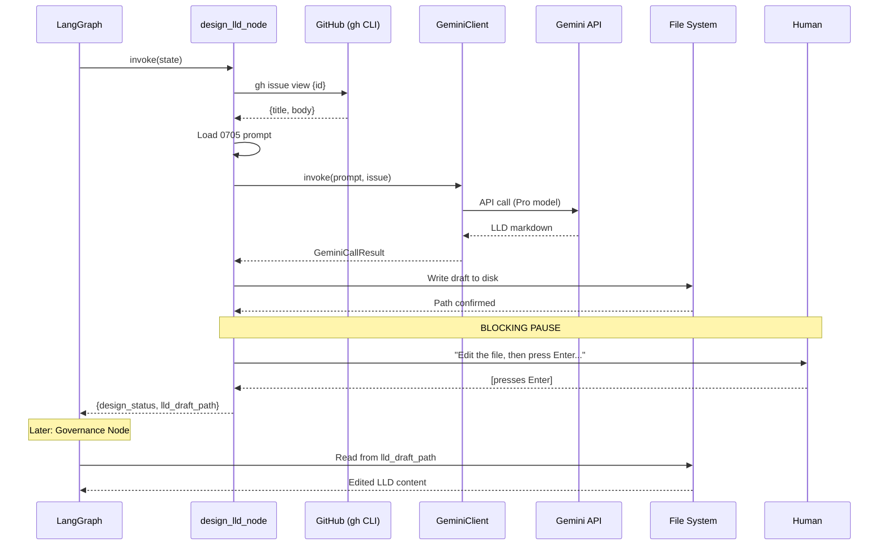

# 156 - Feature: Designer Node with Human Edit Loop

## 1. Context & Goal
* **Issue:** #56
* **Objective:** Build a LangGraph Designer Node that drafts LLDs from GitHub Issues and pauses for human editing before Governance review
* **Status:** Draft
* **Related Issues:** #50 (Governance Node - prerequisite, merged)

### Open Questions
*None - requirements are well-defined from issue.*

## 2. Proposed Changes

*This section is the **source of truth** for implementation. Describes exactly what will be built.*

### 2.1 Files Changed

| File | Change Type | Description |
|------|-------------|-------------|
| `assemblyzero/nodes/designer.py` | Add | Designer Node implementation |
| `assemblyzero/nodes/__init__.py` | Modify | Export `design_lld_node` |
| `assemblyzero/core/state.py` | Modify | Add `lld_draft_path` and `design_status` fields |
| `assemblyzero/core/config.py` | Modify | Add `LLD_GENERATOR_PROMPT_PATH` constant |
| `docs/skills/0705-lld-generator.md` | Add | System instruction for LLD generation |
| `docs/llds/drafts/.gitkeep` | Add | Ensure drafts directory exists |
| `tests/test_designer.py` | Add | Unit tests for designer node |

### 2.2 Dependencies

*No new packages required. Uses existing dependencies.*

```toml
# pyproject.toml - no additions needed
# Uses: google-generativeai (already installed via #50)
```

### 2.3 Data Structures

```python
# assemblyzero/core/state.py - MODIFICATIONS

class AgentState(TypedDict):
    """Core state shared across all AssemblyZero LangGraph nodes."""

    # ... existing fields ...

    # NEW: Designer Node fields
    lld_draft_path: str  # Path to the LLD draft file on disk
    design_status: Literal["PENDING", "DRAFTED", "FAILED"]  # Designer Node outcome
```

```python
# assemblyzero/core/audit.py - NEW TypedDict for Designer logs

class DesignerLogEntry(TypedDict):
    """Single entry in the governance audit log for Designer Node."""
    id: str                    # UUID as string
    sequence_id: int           # From state.iteration_count
    timestamp: str             # ISO8601 format
    node: str                  # "design_lld"
    model: str                 # Model requested (from GOVERNANCE_MODEL)
    model_verified: str        # Actual model from API response
    issue_id: int              # GitHub issue being designed
    status: str                # "DRAFTED" or "FAILED"
    draft_path: str            # Path to output file (if successful)
    error: str                 # Error message (if failed)
    duration_ms: int           # Call duration including retries
    credential_used: str       # Name of credential that succeeded
    rotation_occurred: bool    # True if rotation happened during call
    attempts: int              # Total API call attempts
```

### 2.4 Function Signatures

```python
# assemblyzero/nodes/designer.py

from assemblyzero.core.state import AgentState

def design_lld_node(state: AgentState) -> dict[str, Any]:
    """
    LangGraph node that drafts an LLD from a GitHub Issue.

    Process:
    1. Fetch issue content from GitHub via `gh issue view`
    2. Load system instruction from 0705-lld-generator.md
    3. Invoke Gemini via GeminiClient (uses GOVERNANCE_MODEL)
    4. Write draft to docs/llds/drafts/{issue_id}-LLD.md
    5. Print plain text prompt and block on input()
    6. Return state updates with draft path

    Args:
        state: The current AgentState containing issue_id.

    Returns:
        dict with keys: design_status, lld_draft_path, lld_content, iteration_count

    Fail-safe: Returns FAILED if:
    - Issue not found (404)
    - Model configuration invalid
    - All credentials exhausted
    - File write fails
    """
    ...


def _fetch_github_issue(issue_id: int) -> tuple[str, str]:
    """
    Fetch issue content from GitHub.

    Args:
        issue_id: The GitHub issue number.

    Returns:
        Tuple of (title, body).

    Raises:
        ValueError: If issue not found or fetch fails.
    """
    ...


def _load_generator_instruction() -> str:
    """
    Load LLD generator prompt from docs/skills/0705-lld-generator.md.

    Returns:
        The system instruction text.

    Raises:
        FileNotFoundError: If the prompt file doesn't exist.
    """
    ...


def _write_draft(issue_id: int, content: str) -> Path:
    """
    Write LLD draft to disk.

    Args:
        issue_id: The GitHub issue number.
        content: The generated LLD content.

    Returns:
        Path to the written file.

    Creates docs/llds/drafts/ directory if it doesn't exist.
    """
    ...


def _human_edit_pause(draft_path: Path) -> None:
    """
    Print prompt and block until user presses Enter.

    Args:
        draft_path: Path to the draft file (shown in prompt).

    Output:
        Draft saved: docs/llds/drafts/56-LLD.md
        Edit the file, then press Enter to continue...
    """
    ...
```

```python
# assemblyzero/core/config.py - ADDITIONS

# Prompt path for LLD generator
LLD_GENERATOR_PROMPT_PATH = Path("docs/skills/0705-lld-generator.md")

# Draft output directory
LLD_DRAFTS_DIR = Path("docs/llds/drafts")
```

### 2.5 Logic Flow (Pseudocode)

**Designer Node (`design_lld_node`):**
```
1. Increment state.iteration_count
2. Get issue_id from state
3. TRY:
   a. Fetch issue from GitHub:
      - Run: gh issue view {issue_id} --repo martymcenroe/AssemblyZero --json title,body
      - Parse JSON response
      - IF exit code != 0 OR issue not found:
         - Log failure to audit trail
         - Return {design_status: "FAILED", error: "Issue not found"}

   b. Load system instruction from 0705-lld-generator.md
      - IF file not found:
         - Log failure to audit trail
         - Return {design_status: "FAILED", error: "Generator prompt not found"}

   c. Initialize GeminiClient(model=GOVERNANCE_MODEL)
      - RAISES ValueError if model forbidden (fail closed)

   d. Build prompt:
      - System: LLD generator instruction
      - Content: Issue title + body

   e. result = client.invoke(system_instruction, content)
      - IF result.success:
         - lld_content = result.response
      - ELSE:
         - Log failure to audit trail
         - Return {design_status: "FAILED", error: result.error_message}

   f. Write draft to disk:
      - Create docs/llds/drafts/ if needed
      - Write to docs/llds/drafts/{issue_id}-LLD.md
      - draft_path = written path

   g. Log success to audit trail (node="design_lld", status="DRAFTED")

   h. Print and block:
      - print(f"Draft saved: {draft_path}")
      - input("Edit the file, then press Enter to continue...")

   i. Return {
        design_status: "DRAFTED",
        lld_draft_path: str(draft_path),
        lld_content: "",  # Empty - governance will read from disk
        iteration_count: iteration_count
      }

4. CATCH ValueError (model config error):
   - Log failure to audit trail
   - Return {design_status: "FAILED", error: str(e)}

5. CATCH FileNotFoundError:
   - Log failure to audit trail
   - Return {design_status: "FAILED", error: str(e)}

6. CATCH Exception:
   - Log failure to audit trail
   - Return {design_status: "FAILED", error: "Unexpected error"}
```

**Governance Node Integration (modification to existing `review_lld_node`):**
```
BEFORE (current behavior):
  lld_content = state.get("lld_content", "")

AFTER (with Designer integration):
  # Check if we should read from disk (Designer Node flow)
  lld_draft_path = state.get("lld_draft_path", "")
  IF lld_draft_path AND Path(lld_draft_path).exists():
      lld_content = Path(lld_draft_path).read_text(encoding="utf-8")
  ELSE:
      lld_content = state.get("lld_content", "")
```

### 2.6 Technical Approach

* **Module:** `assemblyzero/nodes/designer.py`
* **Pattern:** LangGraph state machine node with side effects (file I/O, subprocess)
* **Key Decisions:**
  - **Reuse GeminiClient** - Same rotation/model enforcement as Governance Node
  - **Subprocess for GitHub** - Use `gh issue view` via subprocess (simpler than API client)
  - **Simple `input()` blocking** - No checkpoint persistence, no fancy graphics
  - **Empty `lld_content` on return** - Forces Governance Node to read from disk
  - **Audit logging** - Reuse existing GovernanceAuditLog with new entry type

## 3. Requirements

*What must be true when this is done.*

1. `design_lld_node` accepts `AgentState` and returns state updates
2. **Node uses ONLY `GOVERNANCE_MODEL` from config** - ZERO hardcoded strings
3. Node raises `ValueError` if model is forbidden (fail closed)
4. Node fetches issue content via `gh issue view` subprocess
5. Node loads system instruction from `docs/skills/0705-lld-generator.md`
6. Node writes draft to `docs/llds/drafts/{issue_id}-LLD.md`
7. Node prints plain text prompt: `Edit the file, then press Enter to continue...`
8. Node blocks on `input()` until user presses Enter
9. Node returns `lld_content: ""` to force Governance to read from disk
10. Governance Node reads from `lld_draft_path` if present
11. Every Designer call is logged to `logs/governance_history.jsonl`
12. Log entries include: model, credential_used, issue_id, draft_path, status
13. All code passes mypy with no errors
14. Unit tests cover happy path, error cases, and model enforcement

## 4. Alternatives Considered

| Option | Pros | Cons | Decision |
|--------|------|------|----------|
| LangGraph `interrupt_before` | "Official" way to pause | Requires checkpoint persistence, thread IDs | **Rejected** |
| Simple `input()` blocking | Dead simple, no dependencies | Ties up terminal | **Selected** |
| File-based sentinel (`*.ready`) | Doesn't block terminal | Hacky, polling overhead | **Rejected** |
| Two-phase CLI commands | Stateless, simple | Not a "graph" anymore | **Rejected** |
| PyGithub for issue fetch | Native Python | Extra dependency, auth complexity | **Rejected** |
| `gh` CLI subprocess | Simple, auth handled | Subprocess overhead (negligible) | **Selected** |
| Pass LLD content in state | Simpler data flow | Human edits lost after pause | **Rejected** |
| Read from disk after pause | Human edits preserved | Requires path in state | **Selected** |

**Rationale:** Maximum simplicity. `input()` is a Python builtin. `gh` CLI handles GitHub auth. Reading from disk ensures human edits are captured.

## 5. Data & Fixtures

### 5.1 Data Sources

| Attribute | Value |
|-----------|-------|
| Source | GitHub Issues API (via `gh` CLI) |
| Format | JSON (title, body) |
| Size | ~1-10KB per issue |
| Refresh | On-demand (per invocation) |
| Copyright/License | N/A - project issues |

| Attribute | Value |
|-----------|-------|
| Source | Gemini API (via GeminiClient) |
| Format | Markdown (generated LLD) |
| Size | ~5-20KB per response |
| Refresh | On-demand |
| Copyright/License | N/A - generated content |

### 5.2 Data Pipeline

```
GitHub Issue (via gh CLI)
        |
        v
+-------------------+
| design_lld_node   |
| - Fetch issue     |
| - Load prompt     |
+-------------------+
        |
        v
GeminiClient.invoke()
        |
        v
+-------------------+
| Write to disk     |
| docs/llds/drafts/ |
+-------------------+
        |
        v
input() BLOCKS HERE <--- User edits file in VS Code
        |
        v
Return state with lld_draft_path
        |
        v
+-------------------+
| review_lld_node   |
| - Read from disk  |
| - Review content  |
+-------------------+
```

### 5.3 Test Fixtures

| Fixture | Source | Notes |
|---------|--------|-------|
| Valid issue JSON | Hardcoded | `{"title": "Test Issue", "body": "..."}` |
| Mock Gemini response (LLD) | Hardcoded | Valid markdown following template |
| Missing issue response | Hardcoded | Exit code 1, "not found" error |
| Mock forbidden model | Hardcoded | `GOVERNANCE_MODEL = "gemini-2.5-flash"` |
| Mock credentials exhausted | Hardcoded | GeminiClient returns failure |

### 5.4 Deployment Pipeline

Development only - drafts stay local. Production deployment is out of scope.

## 6. Diagram

### 6.1 Mermaid Quality Gate

- [x] **Simplicity:** Components collapsed appropriately
- [x] **No touching:** All elements have visual separation
- [x] **No hidden lines:** All arrows visible
- [x] **Readable:** Labels clear
- [ ] **Auto-inspected:** Will verify after rendering

**Auto-Inspection Results:**
```
- Touching elements: [ ] None / [ ] Found: ___
- Hidden lines: [ ] None / [ ] Found: ___
- Label readability: [ ] Pass / [ ] Issue: ___
- Flow clarity: [ ] Clear / [ ] Issue: ___
```

### 6.2 Diagram



## 7. Security Considerations

| Concern | Mitigation | Status |
|---------|------------|--------|
| API key exposure | Reuse existing GeminiClient (logs name, not key) | Addressed |
| Command injection in issue_id | Validate issue_id is integer before subprocess | Addressed |
| Untrusted issue content | Issue content is input to Gemini, not executed | Addressed |
| Draft file path traversal | Use Path.resolve() and validate within repo | Addressed |
| Model downgrade | Inherit GeminiClient model enforcement | Addressed |

**Fail Mode:** Fail Closed - The node returns FAILED if:
- Issue not found
- Model configuration invalid
- All credentials exhausted
- File write fails
- Any unexpected error

## 8. Performance Considerations

| Metric | Budget | Approach |
|--------|--------|----------|
| GitHub fetch | < 2s | Single `gh` CLI call |
| Gemini call | < 60s | Same as Governance Node (includes rotation) |
| File write | < 10ms | Single write, small file |
| Total (excl. human) | < 65s | Dominated by Gemini latency |
| Human edit time | Unbounded | Intentional - user controls pace |

**Bottlenecks:** Gemini API latency dominates. Human edit time is intentionally unbounded.

## 9. Risks & Mitigations

| Risk | Impact | Likelihood | Mitigation |
|------|--------|------------|------------|
| `gh` CLI not installed | High | Low | Clear error message directing to install |
| `gh` not authenticated | High | Low | Error message includes `gh auth login` hint |
| Issue has no body | Low | Med | Use title-only prompt, generate minimal LLD |
| User never presses Enter | Low | Low | Ctrl+C exits cleanly, draft preserved |
| Draft directory not writable | Med | Low | Create with parents, clear error if fails |
| Gemini generates invalid LLD | Med | Med | Human reviews before Governance - catches issues |

## 10. Verification & Testing

### 10.1 Test Scenarios

| ID | Scenario | Type | Input | Expected Output | Pass Criteria |
|----|----------|------|-------|-----------------|---------------|
| 010 | Happy path - LLD generated | Auto | Valid issue ID, mock Gemini success | `design_status: DRAFTED`, file exists | State updated, file written |
| 020 | Issue not found | Auto | Non-existent issue ID | `design_status: FAILED` | Error message includes "not found" |
| 030 | Forbidden model | Auto | `GOVERNANCE_MODEL = "gemini-2.5-flash"` | `ValueError` raised | Node fails at init |
| 040 | Credentials exhausted | Auto | All credentials return 429 | `design_status: FAILED` | Error mentions credentials |
| 050 | Generator prompt missing | Auto | Delete 0705 file | `design_status: FAILED` | Error mentions prompt file |
| 060 | Draft written correctly | Auto | Any successful generation | File at expected path | Content is valid markdown |
| 070 | Audit entry written | Auto | Any design call | Entry in JSONL | All required fields present |
| 080 | Empty issue body | Auto | Issue with title only | LLD generated from title | Minimal LLD structure |
| 090 | Governance reads from disk | Auto | Designer then Governance | Governance uses file content | Content matches file, not state |
| 100 | Model logged correctly | Auto | Successful call | Audit entry | `model` field = GOVERNANCE_MODEL |

### 10.2 Test Commands

```bash
# Run all automated tests
poetry run pytest tests/test_designer.py -v

# Run with coverage
poetry run pytest tests/test_designer.py -v --cov=assemblyzero

# Type check
poetry run mypy assemblyzero/
```

### 10.3 Manual Tests (Only If Unavoidable)

| ID | Scenario | Why Not Automated | Steps |
|----|----------|-------------------|-------|
| 110 | Human edit loop end-to-end | Requires actual terminal interaction | 1. Run design node with real issue 2. Verify prompt appears 3. Edit file in VS Code 4. Press Enter 5. Verify Governance reviews edited content |

*Justification: Testing actual `input()` blocking and VS Code editing is inherently interactive. Automated tests mock the `input()` call.*

## 11. Definition of Done

### Code
- [ ] `assemblyzero/nodes/designer.py` implemented with `design_lld_node`
- [ ] `assemblyzero/core/state.py` extended with `lld_draft_path`, `design_status`
- [ ] `assemblyzero/core/config.py` extended with `LLD_GENERATOR_PROMPT_PATH`
- [ ] `assemblyzero/nodes/governance.py` reads from disk if `lld_draft_path` present
- [ ] `docs/skills/0705-lld-generator.md` created
- [ ] `docs/llds/drafts/.gitkeep` created

### Tests
- [ ] All 10 test scenarios pass
- [ ] mypy passes with no errors
- [ ] Test coverage > 80% for new code

### Documentation
- [ ] LLD approved by Gemini review
- [ ] Implementation Report completed
- [ ] Test Report completed

### Review
- [ ] Implementation review passed (Gemini)
- [ ] PR approved and merged to main
- [ ] LLD and reports moved to `done/` directories

---

## Appendix: Review Log

*Track all review feedback with timestamps and implementation status.*

### Review Summary

| Review | Date | Verdict | Key Issue |
|--------|------|---------|-----------|
| - | - | - | - |

**Final Status:** DRAFT - PENDING REVIEW
