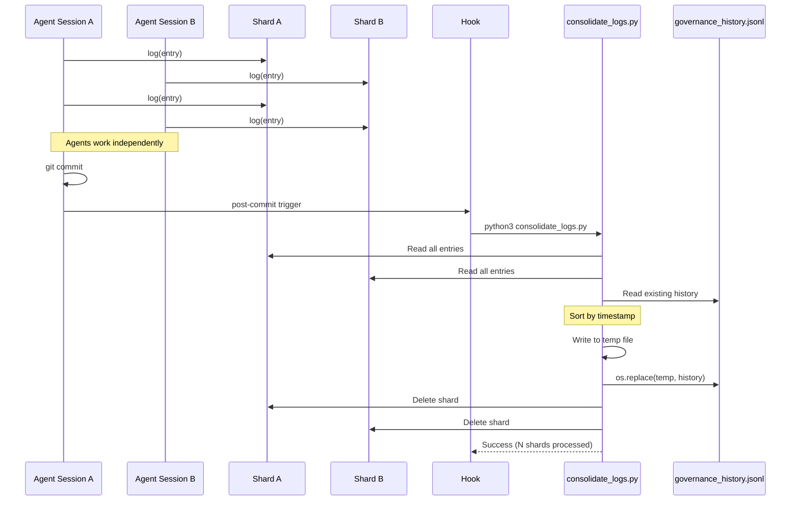

# 157 - Feature: Distributed Session-Sharded Logging Architecture

## 1. Context & Goal
* **Issue:** #57
* **Objective:** Replace centralized audit logging with session-sharded architecture to eliminate write collisions and support worktree isolation
* **Status:** Draft
* **Related Issues:** #50 (Governance Node - provides base audit.py), #56 (Designer Node - uses audit logging)

### Open Questions
*None - requirements are well-defined from issue.*

## 2. Proposed Changes

*This section is the **source of truth** for implementation. Describes exactly what will be built.*

### 2.1 Files Changed

| File | Change Type | Description |
|------|-------------|-------------|
| `assemblyzero/core/config.py` | Modify | Add `LOGS_ACTIVE_DIR` constant |
| `assemblyzero/core/audit.py` | Modify | Refactor for session sharding and unified reads |
| `.gitignore` | Modify | Add `logs/active/` pattern |
| `tools/consolidate_logs.py` | Add | Atomic merge script for post-commit hook |
| `.claude/hooks/post-commit` | Add | Git hook to trigger consolidation |
| `logs/active/.gitkeep` | Add | Placeholder for active shards directory |
| `tests/test_audit_sharding.py` | Add | Unit and integration tests for sharding |

### 2.2 Dependencies

*No new packages required. Uses Python stdlib only.*

```toml
# pyproject.toml - no additions needed
# Uses: pathlib, tempfile, os, subprocess, uuid, json (all stdlib)
```

### 2.3 Data Structures

```python
# assemblyzero/core/audit.py - MODIFICATIONS

class GovernanceAuditLog:
    """Refactored for session sharding."""

    # NEW instance attributes
    repo_root: Path          # Detected via git rev-parse
    session_id: str          # uuid.uuid4().hex[:8]
    active_dir: Path         # {repo_root}/logs/active/
    history_file: Path       # {repo_root}/logs/governance_history.jsonl
    shard_file: Path         # {active_dir}/{timestamp}_{session_id}.jsonl
```

```python
# tools/consolidate_logs.py - NEW

# No new data structures - operates on existing GovernanceLogEntry TypedDict
```

### 2.4 Function Signatures

```python
# assemblyzero/core/audit.py - MODIFICATIONS

class GovernanceAuditLog:
    def __init__(
        self,
        repo_root: Optional[Path] = None,
        session_id: Optional[str] = None,
    ) -> None:
        """
        Initialize with auto-detected repo root and unique session ID.

        Args:
            repo_root: Repository root path. Auto-detected if None.
            session_id: Session identifier. Generated if None.

        Raises:
            RuntimeError: If not in a git repository and repo_root not provided.
        """
        ...

    def _detect_repo_root(self) -> Path:
        """
        Detect repository root via git rev-parse --show-toplevel.

        Returns:
            Path to repository root.

        Raises:
            RuntimeError: If not in a git repository.
        """
        ...

    def _generate_shard_filename(self) -> str:
        """
        Generate unique shard filename: {YYYYMMDDTHHMMSS}_{session_id}.jsonl

        Returns:
            Shard filename string.
        """
        ...

    def log(self, entry: GovernanceLogEntry) -> None:
        """
        Append entry to session shard (not history).

        Args:
            entry: The governance log entry to write.

        Raises:
            OSError: If shard directory is not writable (fail-closed).
        """
        ...

    def tail(self, n: int = 10) -> list[GovernanceLogEntry]:
        """
        Read from history + active shards, merged by timestamp.

        Gracefully skips locked or inaccessible shards.

        Args:
            n: Number of entries to return.

        Returns:
            List of the last N entries across all sources.
        """
        ...

    def _read_jsonl_safe(self, path: Path) -> list[GovernanceLogEntry]:
        """
        Read JSONL file, gracefully handling errors.

        Args:
            path: Path to JSONL file.

        Returns:
            List of entries, or empty list if file inaccessible.
        """
        ...
```

```python
# tools/consolidate_logs.py - NEW

def read_jsonl(path: Path) -> list[dict]:
    """Read all entries from a JSONL file."""
    ...

def consolidate(repo_root: Path) -> int:
    """
    Merge all shards into history using atomic write pattern.

    Pattern: Read history + shards -> Write to temp -> os.replace()

    Args:
        repo_root: Repository root path.

    Returns:
        Number of shards processed.

    Raises:
        OSError: If atomic write fails.
    """
    ...

def main() -> None:
    """Entry point for hook invocation."""
    ...
```

### 2.5 Logic Flow (Pseudocode)

**GovernanceAuditLog.__init__:**
```
1. IF repo_root not provided:
   a. Run: git rev-parse --show-toplevel
   b. IF exit code != 0: RAISE RuntimeError("Not in a git repository")
   c. repo_root = Path(stdout.strip())

2. IF session_id not provided:
   a. session_id = uuid.uuid4().hex[:8]

3. Set paths:
   a. active_dir = repo_root / "logs" / "active"
   b. history_file = repo_root / "logs" / "governance_history.jsonl"
   c. shard_file = active_dir / f"{timestamp}_{session_id}.jsonl"

4. Create active_dir if not exists (mkdir parents=True)
```

**GovernanceAuditLog.log:**
```
1. Serialize entry to JSON
2. TRY:
   a. Open shard_file in append mode
   b. Write JSON + newline
   c. Flush
3. CATCH OSError:
   a. RAISE (fail-closed, do not silently drop entries)
```

**GovernanceAuditLog.tail:**
```
1. entries = []

2. Read history file:
   a. IF history_file.exists():
      - entries.extend(_read_jsonl_safe(history_file))

3. Read all active shards:
   a. FOR shard IN active_dir.glob("*.jsonl"):
      - TRY: entries.extend(_read_jsonl_safe(shard))
      - CATCH (OSError, IOError): continue  # Skip locked shards

4. Sort entries by timestamp

5. RETURN entries[-n:]
```

**consolidate_logs.py - consolidate:**
```
1. active_dir = repo_root / "logs" / "active"
2. history_file = repo_root / "logs" / "governance_history.jsonl"

3. shards = sorted(active_dir.glob("*.jsonl"))
4. IF len(shards) == 0: RETURN 0

5. Read existing history:
   a. existing_entries = read_jsonl(history_file)

6. Read all shards:
   a. new_entries = []
   b. FOR shard IN shards:
      - new_entries.extend(read_jsonl(shard))

7. Merge and sort:
   a. all_entries = existing_entries + new_entries
   b. all_entries.sort(key=timestamp)

8. Atomic write:
   a. fd, temp_path = tempfile.mkstemp(dir=history_file.parent, prefix=".history_", suffix=".tmp")
   b. TRY:
      - Write all entries to temp file
      - os.replace(temp_path, history_file)  # Atomic rename
   c. CATCH:
      - Delete temp file if exists
      - RAISE

9. Delete processed shards:
   a. FOR shard IN shards:
      - shard.unlink()

10. RETURN len(shards)
```

### 2.6 Technical Approach

* **Module:** `assemblyzero/core/audit.py` (primary), `tools/consolidate_logs.py` (new)
* **Pattern:** Session-Sharded Append with Lazy Consolidation
* **Key Decisions:**
  - **Auto-detect repo root** via `git rev-parse` - Works in worktrees
  - **8-char session ID** from UUID - Sufficient uniqueness, short filenames
  - **Timestamp prefix** in filename - Natural chronological sorting
  - **Atomic write via os.replace()** - Cross-platform, crash-safe
  - **Skip locked shards in tail()** - Graceful degradation for concurrent reads
  - **Fail-closed in log()** - Never silently drop entries

## 3. Requirements

*What must be true when this is done.*

1. `GovernanceAuditLog` auto-detects repo root via `git rev-parse --show-toplevel`
2. Each session writes to a unique shard: `logs/active/{timestamp}_{session_id}.jsonl`
3. Session ID is 8-char truncated UUID, generated at init
4. Timestamp format is `YYYYMMDDTHHMMSS` (ISO8601 compact)
5. `log()` raises `OSError` if shard directory not writable (fail-closed)
6. `tail()` merges history + active shards, sorted by timestamp
7. `tail()` skips locked/inaccessible shards without crashing
8. `consolidate_logs.py` uses atomic write pattern (temp file + `os.replace()`)
9. Shards are deleted ONLY after successful atomic rename
10. Post-commit hook triggers consolidation automatically
11. `logs/active/` is gitignored; `logs/governance_history.jsonl` is tracked
12. All file operations use `pathlib.Path` for Windows compatibility
13. All code passes mypy with no errors
14. Unit tests cover sharding, merging, atomic write, and concurrent access

## 4. Alternatives Considered

| Option | Pros | Cons | Decision |
|--------|------|------|----------|
| Single file with flock | Simple, no consolidation needed | Windows flock unreliable, contention | **Rejected** |
| Session sharding | No collisions, worktree isolation | Requires consolidation step | **Selected** |
| SQLite database | ACID, concurrent writes handled | Overkill, binary file, merge conflicts | **Rejected** |
| External log service | Scalable, centralized | Network dependency, complexity | **Rejected** |
| Real-time consolidation | Always up-to-date history | Lock contention, performance | **Rejected** |
| Lazy consolidation (hook) | Batch processing, no contention | Slight delay in history | **Selected** |
| Direct append to history | Simpler consolidation | Risk of corruption on crash | **Rejected** |
| Atomic write (temp + replace) | Crash-safe, consistent | Slightly more complex | **Selected** |

**Rationale:** Session sharding eliminates all write contention. Lazy consolidation via post-commit hook batches work efficiently. Atomic write pattern ensures crash-safety.

## 5. Data & Fixtures

### 5.1 Data Sources

| Attribute | Value |
|-----------|-------|
| Source | Agent runtime (GovernanceLogEntry from nodes) |
| Format | JSONL (newline-delimited JSON) |
| Size | ~1KB per entry, ~100 entries per session |
| Refresh | Real-time during agent execution |
| Copyright/License | N/A - internally generated |

| Attribute | Value |
|-----------|-------|
| Source | Git repository root detection |
| Format | Path string from `git rev-parse` |
| Size | Single path |
| Refresh | Once at init |
| Copyright/License | N/A |

### 5.2 Data Pipeline

```
Agent Session A                    Agent Session B
     |                                   |
     v                                   v
logs/active/                        logs/active/
  20260124T153045_a1b2c3.jsonl        20260124T153046_d4e5f6.jsonl
     |                                   |
     +---------------+-------------------+
                     |
                     v
            [git commit triggers hook]
                     |
                     v
            consolidate_logs.py
                     |
                     v
            logs/governance_history.jsonl
                     |
                     v
            [shards deleted]
```

### 5.3 Test Fixtures

| Fixture | Source | Notes |
|---------|--------|-------|
| Mock GovernanceLogEntry | Hardcoded | Standard entry with all fields |
| Multiple concurrent entries | Hardcoded | 3+ entries with different timestamps |
| Corrupted shard (malformed JSON) | Hardcoded | Test graceful skip |
| Locked shard (simulated) | pytest fixture | Test concurrent access |
| Empty shards directory | pytest fixture | Test no-op consolidation |

### 5.4 Deployment Pipeline

Development only - logs stay local to repo. No deployment pipeline required.

## 6. Diagram

### 6.1 Mermaid Quality Gate

- [x] **Simplicity:** Components collapsed appropriately
- [x] **No touching:** All elements have visual separation
- [x] **No hidden lines:** All arrows visible
- [x] **Readable:** Labels clear
- [ ] **Auto-inspected:** Will verify after rendering

**Auto-Inspection Results:**
```
- Touching elements: [ ] None / [ ] Found: ___
- Hidden lines: [ ] None / [ ] Found: ___
- Label readability: [ ] Pass / [ ] Issue: ___
- Flow clarity: [ ] Clear / [ ] Issue: ___
```

### 6.2 Diagram



## 7. Security Considerations

| Concern | Mitigation | Status |
|---------|------------|--------|
| Path traversal outside repo | Use `git rev-parse` for repo root, validate paths | Addressed |
| Log injection | Entries are serialized JSON, not executed | Addressed |
| Cross-worktree pollution | Each worktree has isolated `logs/` directory | Addressed |
| Temp file left on crash | Cleanup in finally block, unique prefix for detection | Addressed |
| Shard filename injection | Session ID from UUID, timestamp from datetime | Addressed |

**Fail Mode:** Fail Closed
- `log()` raises `OSError` if directory not writable (never silently drop entries)
- `consolidate()` raises if atomic write fails (shards preserved for retry)

## 8. Performance Considerations

| Metric | Budget | Approach |
|--------|--------|----------|
| `log()` latency | < 5ms | Direct append, no locking |
| `tail(10)` latency | < 100ms | Glob + read, skip locked files |
| `consolidate()` latency | < 1s | Batch read/write, single atomic rename |
| Shard file size | < 1MB | Bounded by session length (~100 entries) |
| Memory during consolidate | < 50MB | All entries fit in memory for typical usage |

**Bottlenecks:**
- `tail()` with many active shards may be slower (glob + multiple reads)
- Large history file slows consolidation (full rewrite)
- Future: Consider incremental append for very large histories

## 9. Risks & Mitigations

| Risk | Impact | Likelihood | Mitigation |
|------|--------|------------|------------|
| Consolidation crashes mid-write | Med | Low | Atomic write: temp file + `os.replace()` |
| Shard locked by running agent | Low | Med | `tail()` skips locked, consolidate on next commit |
| `python3` not found | Low | Low | Hook fails silently (`|| true`), no harm |
| Windows path issues | Med | Med | Use `pathlib.Path` everywhere |
| Many concurrent agents | Low | Low | Each gets unique shard, no contention |
| Very long session | Low | Low | Shard grows but bounded; manual consolidation available |
| Hook not executable | Med | Low | Test hook permissions in CI |

## 10. Verification & Testing

### 10.1 Test Scenarios

| ID | Scenario | Type | Input | Expected Output | Pass Criteria |
|----|----------|------|-------|-----------------|---------------|
| 010 | Shard filename format | Auto | New session | `{YYYYMMDDTHHMMSS}_{8chars}.jsonl` | Regex match |
| 020 | Session ID uniqueness | Auto | 100 sessions | 100 unique IDs | No duplicates |
| 030 | Repo root detection | Auto | Run in git repo | Valid Path | Path exists, is git root |
| 040 | Repo root detection failure | Auto | Run outside git | RuntimeError | Exception raised |
| 050 | Log to shard | Auto | Entry | Entry in shard file | JSON parseable |
| 060 | Fail-closed on unwritable | Auto | Read-only dir | OSError | Exception raised |
| 070 | Tail merges history + shards | Auto | 5 history + 3 shard entries | 8 entries sorted | Correct order |
| 080 | Tail skips locked shards | Auto | 1 locked shard | No crash, partial results | Graceful degradation |
| 090 | Consolidation atomic write | Auto | 3 shards | history.jsonl updated | Temp file not left |
| 100 | Consolidation deletes shards | Auto | 3 shards | Shards deleted | active/ empty |
| 110 | Consolidation idempotent | Auto | Run twice, no shards | No change, returns 0 | history unchanged |
| 120 | Concurrent writers | Auto | 3 threads, 10 entries each | 3 shards, 30 entries | No data loss |
| 130 | Windows path handling | Auto | Paths with backslashes | Correct file I/O | No path errors |

### 10.2 Test Commands

```bash
# Run all sharding tests
poetry run pytest tests/test_audit_sharding.py -v

# Run with coverage
poetry run pytest tests/test_audit_sharding.py -v --cov=assemblyzero.core.audit

# Run concurrent test only
poetry run pytest tests/test_audit_sharding.py::test_120_concurrent_writers -v

# Type check
poetry run mypy assemblyzero/
```

### 10.3 Manual Tests (Only If Unavoidable)

| ID | Scenario | Why Not Automated | Steps |
|----|----------|-------------------|-------|
| 140 | Post-commit hook fires | Hook execution environment varies | 1. Make code change 2. `git commit` 3. Verify shards consolidated |

*Justification: Git hooks run in a subshell with different environment. Automated test would require spawning git subprocess.*

## 11. Definition of Done

### Code
- [ ] `GovernanceAuditLog` refactored with `__init__` auto-detection
- [ ] `log()` writes to session shard
- [ ] `tail()` merges history + shards
- [ ] `consolidate_logs.py` implemented with atomic write
- [ ] `.claude/hooks/post-commit` created
- [ ] `.gitignore` updated for `logs/active/`
- [ ] `logs/active/.gitkeep` added

### Tests
- [ ] All 13 automated test scenarios pass
- [ ] Concurrent writer test verifies no data loss
- [ ] mypy passes with no errors
- [ ] Test coverage > 80% for modified code

### Documentation
- [ ] LLD approved by Gemini review
- [ ] Implementation Report completed
- [ ] Test Report completed
- [ ] README or docs updated to explain logging structure

### Review
- [ ] Implementation review passed (Gemini)
- [ ] PR approved and merged to main
- [ ] LLD and reports moved to `done/` directories

---

## Appendix: Review Log

*Track all review feedback with timestamps and implementation status.*

### Gemini Review #1 (APPROVED)

**Timestamp:** 2026-01-24
**Reviewer:** Gemini 3 Pro
**Verdict:** APPROVED

#### Comments

| ID | Comment | Implemented? |
|----|---------|--------------|
| G1.1 | "Scalability Risk: Read-Sort-Rewrite loads entire history into memory. Add TODO for log rotation when >50MB" | PENDING - will add TODO in code |
| G1.2 | "Windows Path Length: Ensure shard filenames don't exceed MAX_PATH" | PENDING - pathlib handles this |

### Review Summary

| Review | Date | Verdict | Key Issue |
|--------|------|---------|-----------|
| Gemini #1 | 2026-01-24 | APPROVED | Scalability TODO for large files |

**Final Status:** APPROVED - READY FOR IMPLEMENTATION
