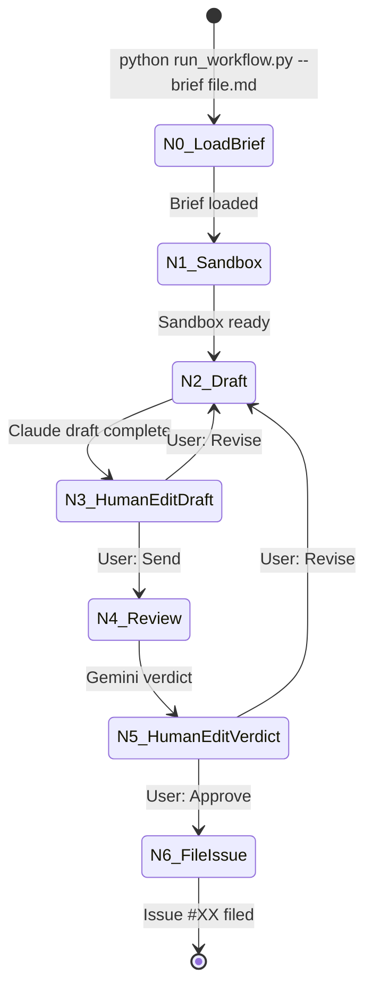
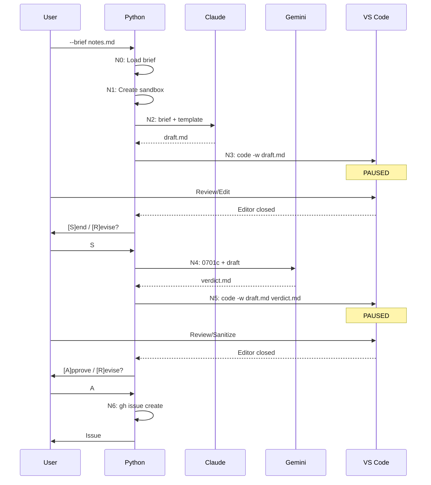

# 62 - Feature: Governance Workflow StateGraph

## 1. Context & Goal
* **Issue:** #62
* **Objective:** Implement a LangGraph state machine that enforces issue lifecycle via Inversion of Control, ensuring no LLM output reaches another LLM without human review
* **Status:** Approved (Gemini Review #1)
* **Related Issues:** None

### Open Questions

- [x] ~~Should `--editor` flag support multiple files syntax?~~ Future work if productized.
- [ ] What default color should be assigned to newly created labels?

### Design Notes

**Editor Support:** MVP uses VS Code (`code -w`) only. VS Code renders Mermaid diagrams in preview, which is essential for reviewing issue drafts. If this becomes a product, add `--editor` flag support for other editors (Sublime Text doesn't render Mermaid without plugins).

## 2. Proposed Changes

### 2.1 Files Changed

| File | Change Type | Description |
|------|-------------|-------------|
| `assemblyzero/graphs/governance.py` | Add | StateGraph definition with N0-N6 nodes and conditional edges |
| `assemblyzero/graphs/state.py` | Add | TypedDict for workflow state |
| `assemblyzero/nodes/load_brief.py` | Add | N0: Load user's ideation notes, create audit dir |
| `assemblyzero/nodes/sandbox.py` | Add | N1: Worktree creation, permission stripping, pre-flight checks |
| `assemblyzero/nodes/draft.py` | Add | N2: Claude drafting node |
| `assemblyzero/nodes/human_edit_draft.py` | Add | N3: VS Code interrupt post-Claude |
| `assemblyzero/nodes/review.py` | Add | N4: Gemini review with hard-coded 0701c |
| `assemblyzero/nodes/human_edit_verdict.py` | Add | N5: VS Code interrupt post-Gemini |
| `assemblyzero/nodes/file_issue.py` | Add | N6: gh execution, label handling, audit finalization |
| `assemblyzero/audit.py` | Add | Audit trail utilities |
| `tools/run_workflow.py` | Add | CLI runner with `--brief` and `--resume` flags |
| `docs/audit/active/.gitkeep` | Add | Directory structure |
| `docs/audit/done/.gitkeep` | Add | Directory structure |

### 2.2 Dependencies

```toml
# pyproject.toml additions
langgraph = "^0.2"
langgraph-checkpoint-sqlite = "^1.0"
```

### 2.3 Data Structures

```python
# Pseudocode - NOT implementation
class GovernanceState(TypedDict):
    # Input
    brief_file: str              # Path to user's ideation notes
    brief_content: str           # Loaded brief text

    # Workflow tracking
    audit_dir: str               # docs/audit/active/{slug}/
    file_counter: int            # Sequential number for audit files (001, 002, ...)
    iteration_count: int         # Total loop iterations
    draft_count: int             # Number of drafts generated
    verdict_count: int           # Number of verdicts received

    # Current state
    current_draft: str           # Latest draft content
    current_verdict: str         # Latest Gemini verdict
    user_feedback: str | None    # Feedback when user selects Revise

    # Routing
    next_node: str               # Routing decision from human nodes

    # Output
    issue_number: int | None     # Assigned at N6
    issue_url: str | None        # GitHub URL

class HumanDecision(Enum):
    SEND = "S"      # Send to Gemini (N3)
    APPROVE = "A"   # Approve and file (N5)
    REVISE = "R"    # Revise draft (N3 or N5)
    MANUAL = "M"    # Exit for manual handling

class ErrorRecovery(Enum):
    RETRY = "R"     # Retry gh issue create
    EDIT = "E"      # Reopen VS Code, return to N5
    ABORT = "A"     # Exit with error
```

### 2.4 Function Signatures

```python
# assemblyzero/nodes/load_brief.py
def load_brief(state: GovernanceState) -> GovernanceState:
    """N0: Load user's brief file, create audit directory, save 001-brief.md.

    On slug collision: prompts user [R]esume / [N]ew name / [A]bort
    """
    ...

# assemblyzero/nodes/sandbox.py
def create_sandbox(state: GovernanceState) -> GovernanceState:
    """N1: Create worktree, strip permissions, run pre-flight checks."""
    ...

def check_vscode_available() -> bool:
    """Verify 'code' binary exists in PATH (VS Code CLI)."""
    # Note: If productized, expand to check_editor_available(cmd: str)
    # supporting --editor flag for other editors.
    ...

def check_gh_authenticated() -> bool:
    """Verify gh CLI is authenticated."""
    ...

# assemblyzero/nodes/draft.py
def generate_draft(state: GovernanceState) -> GovernanceState:
    """N2: Call Claude with brief + template, save NNN-draft.md."""
    ...

# assemblyzero/nodes/human_edit_draft.py
def human_edit_draft(state: GovernanceState) -> GovernanceState:
    """N3: Open VS Code, wait for close, prompt S/R/M."""
    ...

# assemblyzero/nodes/review.py
def gemini_review(state: GovernanceState) -> GovernanceState:
    """N4: Load 0701c + draft, call Gemini, save NNN-verdict.md."""
    ...

# assemblyzero/nodes/human_edit_verdict.py
def human_edit_verdict(state: GovernanceState) -> GovernanceState:
    """N5: Open VS Code with draft + verdict, wait, prompt A/R/M."""
    ...

# assemblyzero/nodes/file_issue.py
def file_issue(state: GovernanceState) -> GovernanceState:
    """N6: Parse labels, create missing, gh issue create, handle errors."""
    ...

def parse_labels(draft_content: str) -> list[str]:
    """Extract labels from **Labels:** line in draft."""
    ...

def ensure_labels_exist(labels: list[str], repo: str) -> None:
    """Check/create labels via gh CLI."""
    ...

# assemblyzero/audit.py
def next_file_number(audit_dir: str) -> int:
    """Return next sequential file number (001, 002, ...)."""
    ...

def save_audit_file(audit_dir: str, number: int, suffix: str, content: str) -> str:
    """Save file as NNN-{suffix}, return path."""
    ...

def move_to_done(audit_dir: str, issue_number: int, slug: str) -> str:
    """Move from active/ to done/{issue#}-{slug}/, return new path."""
    ...

def batch_commit(audit_dir: str, issue_number: int) -> None:
    """Commit all audit files in single commit."""
    ...

# assemblyzero/graphs/governance.py
def build_governance_graph() -> StateGraph:
    """Construct the governance workflow StateGraph."""
    ...

def route_after_draft_edit(state: GovernanceState) -> str:
    """Conditional: N3 -> N2 (revise) or N4 (send)."""
    ...

def route_after_verdict_edit(state: GovernanceState) -> str:
    """Conditional: N5 -> N2 (revise) or N6 (approve)."""
    ...

# tools/run_workflow.py
def main(brief: str | None, resume: str | None, editor: str) -> int:
    """CLI entry point."""
    ...
```

### 2.5 Logic Flow (Pseudocode)

```
N0: LOAD BRIEF
1. Read brief file from --brief argument
2. Generate slug from filename (e.g., "governance-notes.md" -> "governance-notes")
3. Check if docs/audit/active/{slug}/ already exists
   - IF exists:
     - Display: "Slug '{slug}' already exists in active/"
     - Prompt: "[R]esume existing / [N]ew name / [A]bort?"
     - IF R: Load state from checkpoint, continue from last node
     - IF N: Prompt "Enter new slug:", validate unique, use new slug
     - IF A: EXIT with code 0
4. Create docs/audit/active/{slug}/ directory
5. Copy brief to 001-brief.md
6. Initialize file_counter = 1, iteration_count = 0

N1: SANDBOX (Pre-Flight)
1. Check 'code' (VS Code CLI) exists in PATH
   - IF not found: FAIL with "VS Code CLI not found. Install VS Code and ensure 'code' is in PATH."
2. Check gh CLI is authenticated
   - IF not authenticated: FAIL with clear error
3. Create worktree sandbox
4. Strip agent permissions (remove gh from allowed)

N2: DRAFT
1. file_counter++
2. Load issue template (0101)
3. IF user_feedback exists:
   - Combine: feedback + current_draft + template
   ELSE:
   - Combine: brief_content + template
4. Call Claude API
5. Save response to {file_counter:03d}-draft.md
6. draft_count++
7. Clear user_feedback

N3: HUMAN EDIT DRAFT
1. iteration_count++
2. Execute: {editor} draft-issue.md
3. WAIT for editor to close
4. Read (potentially edited) draft
5. Display: "Iteration {iteration_count} | Draft #{draft_count}"
6. Prompt: "[S]end to Gemini / [R]evise / [M]anual?"
7. IF S: next_node = "N4_review"
8. IF R:
   - Prompt: "Enter feedback for Claude:"
   - file_counter++
   - Save feedback to {file_counter:03d}-feedback.txt
   - next_node = "N2_draft"
9. IF M: EXIT with manual mode message

N4: REVIEW
1. file_counter++
2. Load docs/skills/0701c-Issue-Review-Prompt.md (HARD-CODED)
3. Combine: 0701c + current_draft
4. Call Gemini API via gemini-retry.py
5. Save raw response to {file_counter:03d}-verdict.md
6. verdict_count++

N5: HUMAN EDIT VERDICT
1. Execute: {editor} draft.md verdict.md (split view)
2. WAIT for editor to close
3. Read (potentially sanitized) verdict
4. Display: "Iteration {iteration_count} | Draft #{draft_count} | Verdict #{verdict_count}"
5. Prompt: "[A]pprove / [R]evise / [M]anual?"
6. IF A: next_node = "N6_file"
7. IF R:
   - Prompt: "Enter feedback for Claude:"
   - file_counter++
   - Save feedback to {file_counter:03d}-feedback.txt
   - next_node = "N2_draft"
8. IF M: EXIT with manual mode message

N6: FILE ISSUE
1. Parse labels from draft (**Labels:** line)
2. FOR each label:
   - Check if exists: gh label list --repo {repo} --json name
   - IF not exists: gh label create {label}
3. Execute: gh issue create --repo {repo} --title {title} --body-file {draft} --label {labels}
4. IF error:
   - Display error message
   - Prompt: "[R]etry / [E]dit draft / [A]bort?"
   - IF R: RETRY step 3
   - IF E: next_node = "N5_human_edit_verdict", RETURN
   - IF A: EXIT with error code (files stay in active/)
5. Parse issue number and URL from output
6. file_counter++
7. Create {file_counter:03d}-filed.json with metadata
8. Move directory from active/{slug}/ to done/{issue#}-{slug}/
9. Batch git commit all files
```

### 2.6 Technical Approach

* **Module:** `assemblyzero/graphs/`, `assemblyzero/nodes/`, `tools/`
* **Pattern:** LangGraph StateGraph with interrupt_before for human nodes
* **Key Decisions:**
  - Sequential file numbering preserves exact event order across loops
  - Brief filename as checkpoint key enables parallel workflows
  - Two separate human gates (N3, N5) prevent any LLM-to-LLM communication
  - Hard-coded 0701c path prevents agent from substituting prompts

## 3. Requirements

1. StateGraph compiles without errors with N0-N6 nodes
2. N0 loads brief file and creates audit directory with 001-brief.md
3. N1 verifies editor and gh CLI before any work starts
4. N2 combines brief + template when calling Claude
5. N3 provides human gate between Claude output and Gemini input
6. N4 always loads 0701c (hard-coded, cannot be skipped)
7. N5 provides human gate between Gemini output and filing/revision
8. N6 handles label creation and GitHub errors gracefully
9. State persists to SQLite keyed by brief filename
10. Audit trail uses sequential numbering (001, 002, 003...)
11. Agent never has access to `gh` command

## 4. Alternatives Considered

| Option | Pros | Cons | Decision |
|--------|------|------|----------|
| Single human gate (post-Gemini only) | Simpler flow | Claude output goes directly to Gemini without review | **Rejected** |
| Two human gates (N3 + N5) | Full isolation between LLMs | More user interaction | **Selected** |
| Issue number at start | Can reference issue early | Creates empty issues, wastes numbers | **Rejected** |
| Issue number at end | Clean, only valid issues get numbers | Can't reference issue in draft | **Selected** |
| Hardcode 0701c path | Cannot be bypassed | Less flexible | **Selected** |
| Configurable review prompt | Flexible | Agent could substitute weaker prompt | **Rejected** |

**Rationale:** The two-gate design ensures complete LLM isolation. No LLM output ever reaches another LLM without human review. Issue numbers at end prevents wasted GitHub issues.

## 5. Data & Fixtures

### 5.1 Data Sources

| Attribute | Value |
|-----------|-------|
| Source | User-provided brief file |
| Format | Markdown |
| Size | Typically 1-10 KB |
| Refresh | Per-workflow (user creates new brief) |
| Copyright/License | User-owned |

### 5.2 Data Pipeline

```
User Brief ──read──► N0 ──copy──► 001-brief.md
                         └──► Claude ──save──► NNN-draft.md
                                      └──► Gemini ──save──► NNN-verdict.md
                                                  └──► filed.json ──move──► done/
```

### 5.3 Test Fixtures

| Fixture | Source | Notes |
|---------|--------|-------|
| Sample brief file | Generated | For happy path tests |
| Mock Claude response | Hardcoded | Deterministic draft output |
| Mock Gemini APPROVE | Hardcoded | Test approve flow |
| Mock Gemini BLOCK | Hardcoded | Test revision loop |
| Mock GitHub rejection | Hardcoded | Test error handling |

### 5.4 Deployment Pipeline

N/A - Local CLI tool, no deployment pipeline.

## 6. Diagram

### 6.1 Mermaid Quality Gate

- [ ] **Simplicity:** Similar components collapsed
- [ ] **No touching:** All elements have visual separation
- [ ] **No hidden lines:** All arrows fully visible
- [ ] **Readable:** Labels not truncated, flow direction clear
- [ ] **Auto-inspected:** Will be validated during implementation

**Auto-Inspection Results:**
```
- Touching elements: [ ] None / [ ] Found: ___
- Hidden lines: [ ] None / [ ] Found: ___
- Label readability: [ ] Pass / [ ] Issue: ___
- Flow clarity: [ ] Clear / [ ] Issue: ___
```

### 6.2 State Machine Diagram



### 6.3 Sequence Diagram



## 7. Security Considerations

| Concern | Mitigation | Status |
|---------|------------|--------|
| Agent filing issues | Agent has NO `gh` access; only Python N6 can file | Addressed |
| LLM injection | Human reviews ALL LLM output before propagation | Addressed |
| Prompt substitution | 0701c path is hard-coded, cannot be changed | Addressed |
| Unauthorized labels | Labels parsed from human-approved draft only | Addressed |
| Brief file injection | Brief is user-provided; user trusts their own input | Addressed |

**Fail Mode:** Fail Closed - Any error in N6 leaves files in `active/`, does not file issue

## 8. Performance Considerations

| Metric | Budget | Approach |
|--------|--------|----------|
| Latency | User-paced | Human gates dominate; API calls < 30s each |
| Memory | < 100MB | Only state dict in memory |
| API Calls | 1 Claude + 1 Gemini per loop | Minimize by getting drafts right |

**Bottlenecks:** VS Code startup time (~1-2s), API response time (~5-20s)

## 9. Risks & Mitigations

| Risk | Impact | Likelihood | Mitigation |
|------|--------|------------|------------|
| User closes terminal mid-workflow | Med | Med | SQLite checkpoint, --resume flag |
| Gemini quota exhausted | High | Low | gemini-retry.py with credential rotation |
| GitHub rate limit | Med | Low | Retry/Edit/Abort prompt at N6 |
| VS Code not installed | High | Low | Pre-flight check in N1 with clear error |
| gh not authenticated | High | Low | Pre-flight check in N1 with clear error |

## 10. Verification & Testing

### 10.1 Test Scenarios

| ID | Scenario | Type | Input | Expected Output | Pass Criteria |
|----|----------|------|-------|-----------------|---------------|
| 010 | Happy path - approve first try | Auto | Valid brief | Issue filed | Issue URL returned |
| 020 | N0 - brief file not found | Auto | Non-existent path | Clear error | Exit code 1, message |
| 025 | N0 - slug collision prompt | Auto | Duplicate slug | R/N/A prompt | Prompt appears, no crash |
| 026 | N0 - slug collision Resume | Auto | Select R | Load checkpoint | Continues from last node |
| 027 | N0 - slug collision New name | Auto | Select N + "foo" | New slug used | active/foo/ created |
| 028 | N0 - slug collision Abort | Auto | Select A | Clean exit | Exit code 0 |
| 030 | N1 - editor not in PATH | Auto | Invalid editor | Clear error | Exit code 1, message |
| 040 | N1 - gh not authenticated | Auto | Invalid gh | Clear error | Exit code 1, message |
| 050 | N3 - user selects Revise | Auto | Mock input "R" | Loop to N2 | Claude called again |
| 060 | N3 - revision prevents Gemini | Auto | Revise at N3 | No Gemini call | verdict_count = 0 |
| 070 | N5 - user selects Revise | Auto | Mock input "R" | Loop to N2 | New draft generated |
| 080 | N5 - sanitize Gemini output | Auto | Edit verdict file | Sanitized in state | feedback contains clean text |
| 090 | N4 - BLOCK verdict | Auto | Draft missing AC | Gemini BLOCK | Verdict contains BLOCK |
| 100 | N6 - label creation | Auto | New label | Label created | gh label list shows label |
| 110 | N6 - GitHub rejection | Auto | Mock gh failure | Retry/Edit/Abort | No crash, files in active/ |
| 120 | N6 - Retry after error | Auto | Mock retry | Retry attempted | gh called twice |
| 130 | N6 - Edit after error | Auto | Mock edit | Return to N5 | VS Code reopened |
| 140 | N6 - Abort after error | Auto | Mock abort | Exit with error | Files in active/ |
| 150 | Resume after terminal close | Auto | Kill + resume | Continue from checkpoint | State preserved |
| 160 | Parallel workflows | Auto | Two briefs | Separate state | Both complete independently |
| 170 | Sequential file numbering | Auto | 10 loops | Files 001-030+ | Correct order |
| 180 | Audit directory move | Auto | Successful file | done/{issue#}-{slug}/ | Directory moved |
| 190 | Batch commit | Auto | Complete workflow | Single commit | All files in one commit |

### 10.2 Test Commands

```bash
# Run all automated tests
poetry run pytest tests/test_governance_workflow.py -v

# Run only unit tests (mocked)
poetry run pytest tests/test_governance_workflow.py -v -m "not integration"

# Run integration tests
poetry run pytest tests/test_governance_workflow.py -v -m integration
```

### 10.3 Manual Tests (Only If Unavoidable)

| ID | Scenario | Why Not Automated | Steps |
|----|----------|-------------------|-------|
| M01 | VS Code split view | Requires visual verification of layout | 1. Run workflow to N5 2. Verify two-pane layout |

## 11. Definition of Done

### Code
- [ ] `assemblyzero/graphs/governance.py` - StateGraph with N0-N6
- [ ] `assemblyzero/graphs/state.py` - TypedDict state
- [ ] `assemblyzero/audit.py` - Audit trail utilities
- [ ] `assemblyzero/nodes/load_brief.py` - N0 implementation
- [ ] `assemblyzero/nodes/sandbox.py` - N1 implementation
- [ ] `assemblyzero/nodes/draft.py` - N2 implementation
- [ ] `assemblyzero/nodes/human_edit_draft.py` - N3 implementation
- [ ] `assemblyzero/nodes/review.py` - N4 implementation
- [ ] `assemblyzero/nodes/human_edit_verdict.py` - N5 implementation
- [ ] `assemblyzero/nodes/file_issue.py` - N6 implementation
- [ ] `tools/run_workflow.py` - CLI runner
- [ ] Code comments reference this LLD

### Tests
- [ ] All 23 test scenarios pass
- [ ] Test coverage > 80%

### Documentation
- [ ] LLD updated with any deviations
- [ ] Implementation Report completed
- [ ] Test Report completed
- [ ] ADR: Inversion of Control
- [ ] ADR: LLM Isolation

### Review
- [ ] Gemini LLD review: APPROVED
- [ ] Code review completed
- [ ] User approval before closing issue

---

## Appendix: Review Log

*Track all review feedback with timestamps and implementation status.*

### Gemini Review #1 (APPROVED)

**Timestamp:** 2026-01-26
**Reviewer:** Gemini 3 Pro
**Verdict:** APPROVED

#### Tier 2 Comments

| ID | Comment | Implemented? |
|----|---------|--------------|
| G1.1 | "Slug Collision Risk: The logic 'Generate slug from filename' (N0) is risky if multiple files have the same name" | YES - N0 prompts "[R]esume / [N]ew name / [A]bort?" on collision |

#### Tier 3 Comments

| ID | Comment | Implemented? |
|----|---------|--------------|
| G1.2 | "Loop Circuit Breaker: Adding MAX_ITERATIONS = 20 would prevent infinite revision loop" | PARTIAL - Added iteration display at N3/N5 prompts. User can see iteration count and decide to abort. Hard limit deferred. |
| G1.3 | "Editor path handling: Ensure check_editor_available handles complex commands like 'code -w'" | YES - Renamed to check_vscode_available(), MVP uses VS Code only. Note added for future --editor flag. |

### Review Summary

| Review | Date | Verdict | Key Issue |
|--------|------|---------|-----------|
| Gemini #1 | 2026-01-26 | APPROVED | Slug collision risk (addressed) |

**Final Status:** APPROVED
