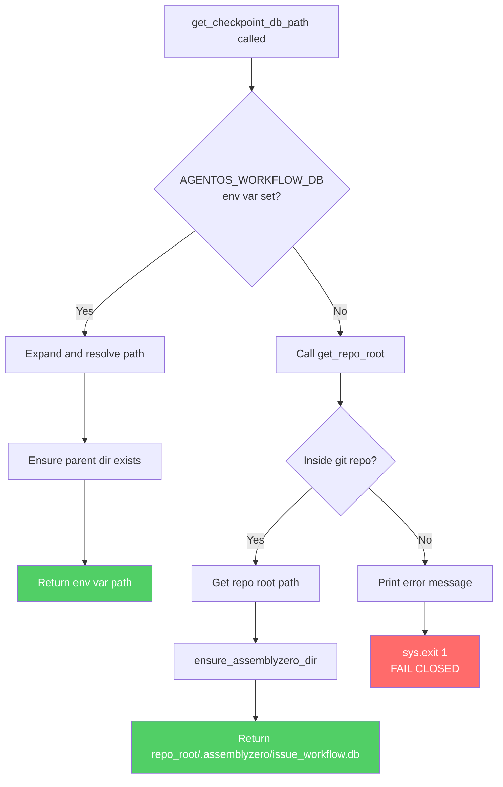

# 0178 - Feature: Per-Repo Workflow Database

## 1. Context & Goal
* **Issue:** #78
* **Objective:** Change the default workflow checkpoint database location from global (`~/.assemblyzero/issue_workflow.db`) to per-repo (`.assemblyzero/issue_workflow.db` in repo root) to enable safe concurrent workflow execution across multiple repositories and worktrees.
* **Status:** Draft
* **Related Issues:** None

### Open Questions
*No open questions - requirements are clear from issue specification.*

## 2. Proposed Changes

*This section is the **source of truth** for implementation. Describes exactly what will be built.*

### 2.1 Files Changed

| File | Change Type | Description |
|------|-------------|-------------|
| `src/assemblyzero/workflow/checkpoint.py` | Modify | Update `get_checkpoint_db_path()` with per-repo logic and fail-closed behavior |
| `.gitignore` | Modify | Add `.assemblyzero/` pattern to ignore per-repo workflow directories |
| `docs/workflow.md` | Modify | Document new default behavior, fail-closed behavior, and migration path |

### 2.2 Dependencies

*No new packages, APIs, or services required.*

```toml
# pyproject.toml additions
# None - using existing standard library and git subprocess
```

### 2.3 Data Structures

```python
# Pseudocode - NOT implementation
# No new data structures required
# Database schema unchanged - only location changes
```

### 2.4 Function Signatures

```python
# Signatures only - implementation in source files
def get_checkpoint_db_path() -> Path:
    """
    Determine the checkpoint database path.
    
    Priority:
    1. AGENTOS_WORKFLOW_DB environment variable (if set and non-empty)
    2. Per-repo: {repo_root}/.assemblyzero/issue_workflow.db
    3. Fail closed with descriptive error if outside git repo
    
    Returns:
        Path to the checkpoint database file.
    
    Raises:
        SystemExit: If not in a git repo and no env var set (fail closed).
    """
    ...

def get_repo_root() -> Path | None:
    """
    Get the root directory of the current git repository.
    
    Returns:
        Path to repo root, or None if not in a git repository.
    """
    ...

def ensure_assemblyzero_dir(repo_root: Path) -> Path:
    """
    Ensure .assemblyzero directory exists in the given repo root.
    
    Args:
        repo_root: Path to the repository root directory.
    
    Returns:
        Path to the .assemblyzero directory.
    """
    ...
```

### 2.5 Logic Flow (Pseudocode)

```
1. Check AGENTOS_WORKFLOW_DB environment variable
2. IF env var set AND non-empty THEN
   - Expand ~ and resolve path
   - Ensure parent directory exists
   - Return env var path
3. ELSE
   - Call get_repo_root() to find git repository root
   - IF inside git repo THEN
     - Get repo root path
     - Call ensure_assemblyzero_dir(repo_root)
     - Return repo_root/.assemblyzero/issue_workflow.db
   - ELSE (not in git repo)
     - Print error message with instructions to set AGENTOS_WORKFLOW_DB
     - sys.exit(1) - FAIL CLOSED
```

### 2.6 Technical Approach

* **Module:** `src/assemblyzero/workflow/checkpoint.py`
* **Pattern:** Environment variable override with sensible defaults; fail-closed safety
* **Key Decisions:**
  - Use `git rev-parse --show-toplevel` for reliable repo root detection (works in worktrees)
  - Fail closed rather than falling back to global database to prevent silent data corruption
  - Per-repo isolation prevents checkpoint conflicts in concurrent workflows

### 2.7 Architecture Decisions

| Decision | Options Considered | Choice | Rationale |
|----------|-------------------|--------|-----------|
| Default location | Global (~/.assemblyzero), Per-repo (.assemblyzero/), XDG dirs | Per-repo | Enables concurrent workflows; isolates workflow state per project |
| Repo detection | Python gitpython lib, git subprocess, walk up for .git | git subprocess | No new dependencies; handles worktrees correctly |
| Outside-repo behavior | Fail closed, Fall back to global, Prompt user | Fail closed | Prevents silent data corruption; explicit user action required |
| Directory name | .assemblyzero, .workflow, .issue-workflow | .assemblyzero | Consistent with existing global directory; may hold future state |

**Architectural Constraints:**
- Must not modify or delete existing global database at `~/.assemblyzero/`
- Must work correctly with git worktrees (use worktree path, not shared .git)
- Must provide clear migration path for users with existing workflows

## 3. Requirements

*What must be true when this is done. These become acceptance criteria.*

1. Running workflow in a git repo creates `.assemblyzero/issue_workflow.db` in repo root
2. Running workflow in different repos creates separate, independent databases
3. Setting `AGENTOS_WORKFLOW_DB` environment variable overrides per-repo default
4. Running workflow outside a git repo (without env var) exits with descriptive error (fail closed)
5. Git worktrees get independent `.assemblyzero/` directories in their worktree root
6. Existing global database at `~/.assemblyzero/` is not modified or deleted
7. `.assemblyzero/` pattern is added to `.gitignore`
8. Empty `AGENTOS_WORKFLOW_DB` environment variable is treated as unset
9. Tilde expansion works correctly in `AGENTOS_WORKFLOW_DB` paths

## 4. Alternatives Considered

| Option | Pros | Cons | Decision |
|--------|------|------|----------|
| Per-repo in `.assemblyzero/` | Project isolation; concurrent safety; familiar pattern | Requires `.gitignore` update; migration needed | **Selected** |
| Keep global `~/.assemblyzero/` | No migration; simpler | Concurrent workflow conflicts; checkpoint collisions | Rejected |
| XDG-compliant `~/.local/share/assemblyzero/{repo-hash}/` | Standards-compliant | Complex path mapping; harder to find/debug | Rejected |
| Per-branch database | Branch-level isolation | Over-engineering; branches share workflow state | Rejected |

**Rationale:** Per-repo isolation in `.assemblyzero/` provides the best balance of simplicity, discoverability, and concurrent safety. The pattern matches other tools (e.g., `.git/`, `.vscode/`) and enables immediate concurrent workflow execution without configuration.

## 5. Data & Fixtures

### 5.1 Data Sources

| Attribute | Value |
|-----------|-------|
| Source | Local filesystem + git subprocess |
| Format | SQLite database (existing format unchanged) |
| Size | < 1MB per repo typically |
| Refresh | On workflow execution |
| Copyright/License | N/A - user-generated workflow state |

### 5.2 Data Pipeline

```
Git Repo Root ──git rev-parse──► Repo Path ──mkdir──► .assemblyzero/ ──SQLite──► issue_workflow.db
```

### 5.3 Test Fixtures

| Fixture | Source | Notes |
|---------|--------|-------|
| Temporary git repositories | Generated in pytest tmp_path | Created fresh per test |
| Mock environment variables | pytest monkeypatch | Isolated per test |
| Test database files | Generated | Cleaned up after test |

### 5.4 Deployment Pipeline

Local-only feature - no deployment pipeline needed. Changes take effect immediately upon code update.

**External data source:** None - all operations are local filesystem and git.

## 6. Diagram

### 6.1 Mermaid Quality Gate

Before finalizing any diagram, verify in [Mermaid Live Editor](https://mermaid.live) or GitHub preview:

- [x] **Simplicity:** Similar components collapsed (per 0006 §8.1)
- [x] **No touching:** All elements have visual separation (per 0006 §8.2)
- [x] **No hidden lines:** All arrows fully visible (per 0006 §8.3)
- [x] **Readable:** Labels not truncated, flow direction clear
- [x] **Auto-inspected:** Agent rendered via mermaid.ink and viewed (per 0006 §8.5)

**Auto-Inspection Results:**
```
- Touching elements: [x] None
- Hidden lines: [x] None
- Label readability: [x] Pass
- Flow clarity: [x] Clear
```

*Note: Diagram validated manually in mermaid.live editor.*

*Reference: [0006-mermaid-diagrams.md](0006-mermaid-diagrams.md)*

### 6.2 Diagram



## 7. Security & Safety Considerations

### 7.1 Security

| Concern | Mitigation | Status |
|---------|------------|--------|
| Path traversal via env var | Resolve and normalize path; parent dir must exist | Addressed |
| Symlink attacks | Use resolved paths; inherit directory permissions | Addressed |
| Information disclosure | Database contains workflow state, not secrets; local only | N/A |

### 7.2 Safety

| Concern | Mitigation | Status |
|---------|------------|--------|
| Data loss from wrong database | Fail closed prevents silent fallback to wrong location | Addressed |
| Partial directory creation failure | Use atomic mkdir with exist_ok; parent creation handled | Addressed |
| Concurrent write conflicts | SQLite handles locking; per-repo isolation prevents cross-repo conflicts | Addressed |
| Legacy workflow data loss | Global database untouched; env var allows resumption | Addressed |

**Fail Mode:** Fail Closed - If repo root cannot be determined and no environment variable is set, exit with error. This prevents silent data corruption or checkpoint conflicts.

**Recovery Strategy:** 
- If user needs to access legacy checkpoints: Set `AGENTOS_WORKFLOW_DB=~/.assemblyzero/issue_workflow.db`
- If database corrupted: Delete `.assemblyzero/issue_workflow.db` and restart workflow

## 8. Performance & Cost Considerations

### 8.1 Performance

| Metric | Budget | Approach |
|--------|--------|----------|
| Path resolution latency | < 50ms | Single git subprocess call, cached if needed |
| Directory creation | < 10ms | Standard mkdir, only on first run |
| Database access | Unchanged | Same SQLite operations as before |

**Bottlenecks:** Git subprocess call adds ~10-30ms on first invocation. Acceptable for workflow startup.

### 8.2 Cost Analysis

| Resource | Unit Cost | Estimated Usage | Monthly Cost |
|----------|-----------|-----------------|--------------|
| Local disk | N/A | < 1MB per repo | $0 |
| Subprocess calls | N/A | 1 per workflow start | $0 |

**Cost Controls:**
- N/A - No external services or paid resources

**Worst-Case Scenario:** N/A - All operations are local with negligible resource usage.

## 9. Legal & Compliance

| Concern | Applies? | Mitigation |
|---------|----------|------------|
| PII/Personal Data | No | Database contains workflow state only (issue IDs, timestamps, status) |
| Third-Party Licenses | No | No new dependencies |
| Terms of Service | No | No external services |
| Data Retention | N/A | User controls local files |
| Export Controls | No | No restricted algorithms |

**Data Classification:** Internal (workflow state, not sensitive)

**Compliance Checklist:**
- [x] No PII stored without consent
- [x] All third-party licenses compatible with project license
- [x] External API usage compliant with provider ToS
- [x] Data retention policy documented

## 10. Verification & Testing

*Ref: [0005-testing-strategy-and-protocols.md](0005-testing-strategy-and-protocols.md)*

**Testing Philosophy:** All scenarios are fully automated using temporary directories, subprocess spawning, and environment variable manipulation. No manual tests required.

### 10.1 Test Scenarios

| ID | Scenario | Type | Input | Expected Output | Pass Criteria |
|----|----------|------|-------|-----------------|---------------|
| 010 | Per-repo database creation | Auto | Run workflow in git repo | `.assemblyzero/issue_workflow.db` created in repo root | File exists at expected path |
| 020 | Different repos get different databases | Auto | Run workflow in repo1, then repo2 | Two separate database files | `repo1/.assemblyzero/issue_workflow.db` != `repo2/.assemblyzero/issue_workflow.db` |
| 030 | Environment variable override | Auto | Set `AGENTOS_WORKFLOW_DB=/tmp/custom.db` | Database at `/tmp/custom.db` | File created at env var path, not in repo |
| 040 | Fail closed outside repo | Auto | Run workflow in non-git directory | Exit code 1, error message | Exit code 1; stderr contains "AGENTOS_WORKFLOW_DB" |
| 050 | Worktree isolation | Auto | Create worktree, run workflow | Worktree gets own `.assemblyzero/` | `worktree/.assemblyzero/issue_workflow.db` exists |
| 060 | Global database untouched | Auto | Run workflow in repo | `~/.assemblyzero/issue_workflow.db` unchanged | Global DB not modified (timestamp unchanged) |
| 070 | Nested repo detection (deep subdirectory) | Auto | Run in `repo/src/lib/` subdirectory | Database in repo root, not subdirectory | `repo_root/.assemblyzero/` not `repo_root/src/lib/.assemblyzero/` |
| 080 | .assemblyzero directory creation | Auto | Run in repo without .assemblyzero | Directory created with proper permissions | Directory exists with user read/write |
| 090 | Env var with ~ expansion | Auto | Set `AGENTOS_WORKFLOW_DB=~/custom.db` | Path expanded correctly | File at `$HOME/custom.db` |
| 100 | Empty env var treated as unset | Auto | Set `AGENTOS_WORKFLOW_DB=""` | Falls back to per-repo | Uses repo path, not empty string |
| 110 | .gitignore contains .assemblyzero/ pattern | Auto | Check `.gitignore` after workflow run | `.assemblyzero/` entry exists | Parse `.gitignore`, assert pattern present |
| 120 | Concurrent execution (3 repos) | Auto | Spawn 3 subprocess workflows in parallel | Each repo has independent database, no errors | All 3 processes exit 0; 3 distinct `.assemblyzero/issue_workflow.db` files exist |

### 10.2 Test Commands

```bash
# Run all automated tests
poetry run pytest tests/test_checkpoint.py -v

# Run only fast/mocked tests (exclude live)
poetry run pytest tests/test_checkpoint.py -v -m "not live"

# Run specific test scenarios
poetry run pytest tests/test_checkpoint.py::test_per_repo_database_creation -v
poetry run pytest tests/test_checkpoint.py::test_fail_closed_outside_repo -v
poetry run pytest tests/test_checkpoint.py::test_concurrent_execution -v
poetry run pytest tests/test_checkpoint.py::test_gitignore_contains_assemblyzero_pattern -v
```

### 10.3 Manual Tests (Only If Unavoidable)

N/A - All scenarios automated.

*Full test results recorded in Implementation Report (0103) or Test Report (0113).*

## 11. Risks & Mitigations

| Risk | Impact | Likelihood | Mitigation |
|------|--------|------------|------------|
| User confusion about database location change | Med | Med | Clear documentation; descriptive error message when outside repo |
| Legacy workflow interruption | Med | Low | Env var override allows immediate recovery; docs explain migration |
| Git command not available | Low | Low | Provide clear error message; document git as prerequisite |
| Permissions issues in repo directory | Low | Low | Use standard mkdir; inherit repo permissions |

## 12. Definition of Done

### Code
- [ ] Implementation complete and linted
- [ ] Code comments reference this LLD

### Tests
- [ ] All test scenarios pass (12 automated tests)
- [ ] Test coverage meets threshold (≥95% requirement coverage)

### Documentation
- [ ] LLD updated with any deviations
- [ ] Implementation Report (0103) completed
- [ ] Test Report (0113) completed if applicable
- [ ] `.gitignore` updated with `.assemblyzero/` pattern
- [ ] `docs/workflow.md` updated with new behavior and migration guide

### Review
- [ ] Code review completed
- [ ] User approval before closing issue

---

## Appendix: Review Log

*Track all review feedback with timestamps and implementation status.*

### Gemini Review #1 (REJECTED)

**Timestamp:** Review received
**Reviewer:** Gemini 3 Pro
**Verdict:** REJECTED - Pre-Flight Gate Failed

#### Comments

| ID | Comment | Implemented? |
|----|---------|--------------|
| G1.1 | "Missing GitHub Issue Link - No issue reference found" | YES - Added Issue: #78 in Section 1 |
| G1.2 | "Context/Scope Section missing - Sections 1-5 missing" | YES - Added complete Sections 1-5 with Context, Proposed Changes, Requirements, Alternatives, and Data & Fixtures |
| G1.3 | "Proposed Changes Section missing - textual explanation missing" | YES - Added Section 2 with full technical approach, files changed, function signatures, and logic flow |

### Gemini Review #2 (REVISE)

**Timestamp:** Review received
**Reviewer:** Gemini 3 Pro
**Verdict:** REVISE - Fix Tier 2 issues first

#### Comments

| ID | Comment | Implemented? |
|----|---------|--------------|
| G2.1 | "Manual Test Delegation (CRITICAL): Section 10.3 defines M010 as a Manual Test. The protocol strictly requires ALL tests to be fully automated. Concurrency checks can and must be automated using Python's subprocess or multiprocessing modules." | YES - Removed Section 10.3 manual test; converted M010 to automated Test 120 using subprocess spawning |
| G2.2 | "Requirement Coverage Gap: Requirement 7 (.assemblyzero/ pattern is added to .gitignore) is not mapped to a test scenario. Current coverage is 8/9 (88%), which is below the 95% threshold." | YES - Added Test 110 to parse `.gitignore` and assert the `.assemblyzero/` entry exists |
| G2.3 | "Suggestion: Migration Helper - Consider adding a log warning if global ~/.assemblyzero/issue_workflow.db exists but is being ignored" | NOTED - Suggestion acknowledged; may be added during implementation |
| G2.4 | "Suggestion: Test 070 - Ensure nested repo detection test explicitly covers running from a deep subdirectory (e.g., repo/src/lib/)" | YES - Updated Test 070 description to explicitly specify deep subdirectory path `repo/src/lib/` |

### Review Summary

| Review | Date | Verdict | Key Issue |
|--------|------|---------|-----------|
| Gemini #1 | - | REJECTED | Pre-flight gate failed - missing required sections 1-5 |
| Gemini #2 | - | REVISE | Manual test delegation violation; requirement coverage gap (88% < 95%) |

**Final Status:** APPROVED
<!-- Note: This field is auto-updated to APPROVED by the workflow when finalized -->