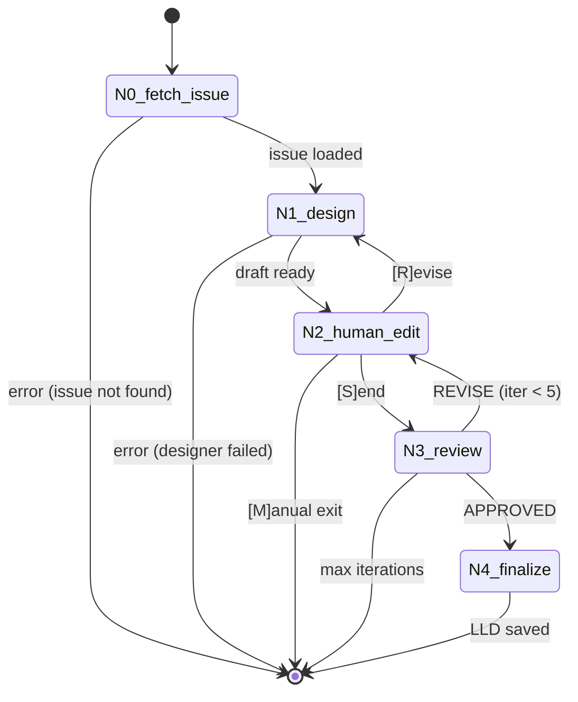

# 186 - Feature: LLD Creation & Governance Review Workflow

## 1. Context & Goal

* **Issue:** #86
* **Objective:** Implement a LangGraph workflow that orchestrates LLD creation from GitHub issues, enforces human review gates, and loops until Gemini governance approval.
* **Status:** Draft
* **Related Issues:** #62 (Issue Creation Workflow - pattern reference), DN-001 (Context Injection design note), #54 (LangSmith tracing - see dependency analysis below)

### Open Questions

- [x] Should `--context` flag be included in MVP? **YES** - per DN-001, simple flag approach
- [x] Should we reuse designer.py or create LLD-specific designer? **REUSE** - per issue requirements
- [ ] Token limit handling when context files are large - truncate or error?

### Dependency Analysis: Issue #54 (LangSmith Tracing)

**Issue #54 Scope:** Add LangSmith tracing to governance nodes, propagate trace IDs, correlate local audit logs with LangSmith dashboard.

**Relationship to #86:**

| Aspect | Without #54 | With #54 |
|--------|-------------|----------|
| **Debugging** | Local audit trail files (comprehensive) | Local + LangSmith dashboard |
| **Distributed observability** | None | Full trace visibility |
| **Functionality** | Fully functional | Fully functional |
| **Implementation effort** | N/A | Automatic benefit when #54 done |

**Assessment:** Issue #86 does **NOT depend on #54**. The local audit trail pattern (inherited from issue workflow) provides sufficient debugging capability for MVP:
- All drafts saved: `{N}-draft.md`
- All verdicts saved: `{N}-verdict.md`
- Full state reconstruction possible from audit files

**Recommendation:** Proceed with #86. When #54 is later implemented on `governance.py`, the LLD workflow will automatically benefit since it imports (not copies) the governance node.

**Impact of deferring #54:**
- No visibility in LangSmith dashboard during governance review failures
- Must debug via local audit files only (acceptable for single-developer workflow)
- No trace ID correlation (minor impact - audit files are self-contained)

**Deferral of #54: Approved by Orchestrator** (2026-01-29)

## 2. Proposed Changes

*This section is the **source of truth** for implementation. Describes exactly what will be built.*

### 2.1 Files Changed

| File | Change Type | Description |
|------|-------------|-------------|
| `assemblyzero/workflows/lld/__init__.py` | Add | Package init, exports |
| `assemblyzero/workflows/lld/state.py` | Add | LLDWorkflowState TypedDict |
| `assemblyzero/workflows/lld/graph.py` | Add | LangGraph StateGraph definition |
| `assemblyzero/workflows/lld/nodes.py` | Add | Node wrapper functions (design, human_edit, review) |
| `assemblyzero/workflows/lld/audit.py` | Add | Audit trail management (pattern from issue workflow) |
| `assemblyzero/workflows/lld/mock.py` | Add | Mock implementations for offline testing |
| `tools/run_lld_workflow.py` | Add | CLI entry point |
| `tests/test_lld_workflow.py` | Add | Unit and integration tests |
| `tests/fixtures/lld_workflow/issue_42.json` | Add | Mock issue fixture |
| `tests/fixtures/lld_workflow/designer_output.md` | Add | Mock LLD draft |
| `tests/fixtures/lld_workflow/governance_approved.json` | Add | Mock approval response |
| `tests/fixtures/lld_workflow/governance_rejected.json` | Add | Mock rejection response |
| `docs/LLDs/active/.gitkeep` | Add | Ensure output directory exists |

### 2.2 Dependencies

*No new packages required. Uses existing dependencies.*

```toml
# Already in pyproject.toml - no additions needed
langgraph = "^0.2"  # StateGraph, SqliteSaver
```

**Existing modules reused (NOT modified):**
- `assemblyzero/nodes/designer.py` - LLD generation
- `assemblyzero/nodes/governance.py` - Gemini review

### 2.3 Data Structures

```python
# assemblyzero/workflows/lld/state.py
from enum import Enum
from typing import TypedDict

class HumanDecision(str, Enum):
    """User choices at human edit node."""
    SEND = "S"      # Send to Gemini review
    REVISE = "R"    # Return to designer with feedback
    MANUAL = "M"    # Exit for manual handling

class LLDWorkflowState(TypedDict, total=False):
    # Input
    issue_number: int           # GitHub issue number
    issue_title: str            # Issue title for LLD naming
    issue_body: str             # Full issue content
    context_files: list[str]    # Paths to additional context (--context flag)
    context_content: str        # Assembled context for prompt

    # Workflow tracking
    audit_dir: str              # Path to docs/audit/active/{issue-id}-lld/
    file_counter: int           # Sequential number for audit files
    iteration_count: int        # Total loop iterations (max 5)

    # Current artifacts
    lld_draft_path: str         # Path to current draft file
    lld_content: str            # Current LLD content
    verdict_path: str           # Path to current verdict file
    verdict_content: str        # Current Gemini verdict
    user_feedback: str          # Feedback when user selects Revise

    # Routing
    next_node: str              # Routing decision from human node

    # Output
    final_lld_path: str         # Path to approved LLD in docs/LLDs/active/

    # Error handling
    error_message: str          # Last error message if any
```

### 2.4 Function Signatures

```python
# assemblyzero/workflows/lld/nodes.py

def fetch_issue(state: LLDWorkflowState) -> dict:
    """N0: Fetch issue from GitHub and assemble context.

    - Validates issue_number exists
    - Fetches issue title and body via gh CLI
    - Reads context_files and assembles context_content
    - Creates audit directory
    - Returns updated state with issue content
    """
    ...

def design(state: LLDWorkflowState) -> dict:
    """N1: Generate LLD draft using designer node.

    - Builds prompt from issue + context + LLD template
    - Calls existing designer.py
    - Saves draft to audit trail
    - Opens in VS Code (unless --auto mode)
    - Returns updated state with lld_content
    """
    ...

def human_edit(state: LLDWorkflowState) -> dict:
    """N2: Human review gate - wait for user decision.

    - Displays current iteration count
    - Shows governance critique if available
    - Prompts: [S]end to review, [R]evise with feedback, [M]anual exit
    - Reads updated LLD from disk
    - Returns updated state with next_node routing
    """
    ...

def review(state: LLDWorkflowState) -> dict:
    """N3: Submit LLD to Gemini governance review.

    - Calls existing governance.py with LLD content
    - Parses verdict: APPROVED, REVISE, or DISCUSS
    - Saves verdict to audit trail
    - Returns updated state with verdict_content
    """
    ...

def finalize(state: LLDWorkflowState) -> dict:
    """N4: Save approved LLD to final location.

    - Copies LLD to docs/LLDs/active/LLD-{issue_number}.md
    - Logs success message
    - Returns updated state with final_lld_path
    """
    ...

# assemblyzero/workflows/lld/graph.py

def route_after_human_edit(state: LLDWorkflowState) -> str:
    """Route based on human decision: review, design, or end."""
    ...

def route_after_review(state: LLDWorkflowState) -> str:
    """Route based on verdict: finalize, human_edit, or end (max iterations)."""
    ...

def check_error(state: LLDWorkflowState) -> str:
    """Check if workflow should continue or end due to error."""
    ...

def build_lld_workflow() -> StateGraph:
    """Build the LLD workflow StateGraph."""
    ...
```

### 2.5 Logic Flow (Pseudocode)

```
1. CLI parses arguments: --issue, --context, --auto, --mock, --resume
2. IF --resume THEN
   - Load checkpoint from SQLite
   - Resume from last node
3. ELSE
   - Initialize state with issue_number, context_files

4. N0_fetch_issue:
   - Validate issue exists (gh issue view)
   - Load issue title and body
   - FOR EACH context_file:
     - IF file exists: read and append to context_content
     - ELSE: warn and skip
   - Create audit_dir: docs/audit/active/{issue_number}-lld/
   - Save 001-issue.md to audit trail

5. N1_design:
   - Build prompt: issue + context + LLD template
   - Call designer.py (or mock in --mock mode)
   - Save draft to audit trail: {N}-draft.md
   - IF NOT --auto:
     - Open in VS Code: code --wait {draft_path}

6. N2_human_edit:
   - Display: "Iteration {N} of 5"
   - IF verdict exists: display critique
   - IF --auto:
     - Auto-select [S]end
   - ELSE:
     - Prompt user: [S]end / [R]evise / [M]anual
   - Read LLD content from disk (user may have edited)
   - Route based on choice

7. N3_review:
   - Call governance.py with LLD content (or mock)
   - Parse verdict from response
   - Save verdict to audit trail: {N}-verdict.md
   - IF APPROVED: route to N4_finalize
   - ELIF iteration_count >= 5:
     - Set error_message: "Max iterations reached"
     - Route to END
   - ELSE: route to N2_human_edit

8. N4_finalize:
   - Copy LLD to docs/LLDs/active/LLD-{issue_number}.md
   - Print success message
   - Route to END
```

### 2.6 Technical Approach

* **Module:** `assemblyzero/workflows/lld/`
* **Pattern:** LangGraph StateGraph with SqliteSaver checkpointer (same as issue workflow)
* **Key Decisions:**
  1. **Reuse existing nodes** - designer.py and governance.py are imported, not copied, per issue requirements
  2. **Context injection via CLI** - `--context` flag per DN-001 design note
  3. **Mock mode** - Complete workflow execution without API calls using fixtures
  4. **Audit trail** - All artifacts saved with sequential numbering for debugging
  5. **Thread ID** - Uses `lld-{issue_number}` for checkpoint keying

## 3. Requirements

*From issue #86 acceptance criteria:*

1. `python tools/run_lld_workflow.py --issue 42` executes full workflow
2. Workflow pauses at human edit step until user closes VS Code
3. Governance rejection routes back to human edit with critique displayed
4. Workflow refuses to complete until `[x] **APPROVED**` received
5. Final LLD saved to `docs/LLDs/active/LLD-{issue_id}.md`
6. `--resume` flag successfully continues interrupted workflow
7. `--mock` flag executes full workflow using local fixtures without API calls
8. Existing `designer.py` and `governance.py` are imported, not copied/rewritten
9. Maximum 5 iterations enforced before workflow exits with guidance
10. `--context` flag allows additional files to be included in prompt (per DN-001)

## 4. Alternatives Considered

| Option | Pros | Cons | Decision |
|--------|------|------|----------|
| LangGraph StateGraph | Checkpointing, conditional routing, proven pattern from issue workflow | Learning curve for new contributors | **Selected** |
| Simple Python script | Easier to understand, no dependencies | No checkpointing, complex control flow | Rejected |
| Copy designer.py for LLD-specific version | Could optimize prompts | Violates issue requirement, creates maintenance burden | Rejected |

**Rationale:** LangGraph was selected because:
1. Issue workflow already uses it successfully - proven pattern
2. SqliteSaver enables resume after interruption - critical for long workflows
3. Conditional edges handle the approval loop cleanly
4. Consistent architecture across governance workflows

## 5. Data & Fixtures

### 5.1 Data Sources

| Attribute | Value |
|-----------|-------|
| Source | GitHub API (via `gh` CLI), local context files |
| Format | JSON (issue), Markdown (context files, LLD) |
| Size | ~2-10KB per issue, variable for context files |
| Refresh | On-demand per workflow run |
| Copyright/License | User's own content, N/A |

### 5.2 Data Pipeline

```
GitHub Issue ──gh CLI──► fetch_issue ──prompt──► designer.py ──LLD──► governance.py
                              │                                            │
                     context_files                                    verdict
                              │                                            │
                              └──────────► human_edit ◄────────────────────┘
                                               │
                                               ▼
                                    docs/LLDs/active/LLD-{N}.md
```

### 5.3 Test Fixtures

| Fixture | Source | Notes |
|---------|--------|-------|
| `issue_42.json` | Generated | Mock issue with typical LLD requirements |
| `designer_output.md` | Generated | Valid LLD following template |
| `governance_approved.json` | Generated | `[x] **APPROVED**` verdict |
| `governance_rejected.json` | Generated | `[x] **REVISE**` with critique |

**Data hygiene:** All fixtures use synthetic data. No real issue content, no PII.

### 5.4 Deployment Pipeline

Local development only. No cloud deployment for this workflow.

## 6. Diagram

### 6.1 Mermaid Quality Gate

- [ ] **Simplicity:** Similar components collapsed
- [ ] **No touching:** All elements have visual separation
- [ ] **No hidden lines:** All arrows fully visible
- [ ] **Readable:** Labels not truncated, flow direction clear
- [ ] **Auto-inspected:** Agent will render and verify before commit

### 6.2 Diagram



## 7. Security Considerations

| Concern | Mitigation | Status |
|---------|------------|--------|
| GitHub token exposure | Uses `GITHUB_TOKEN` env var, never logged | Addressed |
| Gemini API key exposure | Uses `GEMINI_API_KEY` env var, never logged | Addressed |
| Path traversal in --context | `Path(ctx).resolve()` must start with `get_repo_root()`; reject with error if outside project | Addressed |
| Arbitrary code in issue body | Issue content passed to LLM, not executed | Addressed |

**Fail Mode:** Fail Closed - On any error, workflow halts and preserves checkpoint. No partial LLDs are saved to active/.

## 8. Performance Considerations

| Metric | Budget | Approach |
|--------|--------|----------|
| Latency | < 60s per node | Designer and governance are LLM calls, inherently slow |
| Memory | < 256MB | State is small, context files read on-demand |
| API Calls | Max 6 per run | 1 designer + up to 5 governance reviews |
| Token Budget | ~40K input, ~10K output worst case | Per issue budget estimate |

**Bottlenecks:** LLM API latency dominates. No optimization possible without caching (out of scope).

### Observability & Debugging

| Mechanism | Implementation | Status |
|-----------|----------------|--------|
| **Local Audit Trail** | All artifacts saved to `docs/audit/active/{issue}-lld/` with sequential numbering | Implemented in this LLD |
| **Console Logging** | State transitions, node entry/exit, iteration counts | Implemented in this LLD |
| **LangSmith Tracing** | Trace IDs, distributed observability, dashboard visibility | **Deferred to #54** |

**Debugging without LangSmith (#54):**
- Audit trail provides complete reconstruction: `001-issue.md`, `002-draft.md`, `003-verdict.md`, etc.
- State at each step is recoverable from checkpoint database
- Console output shows workflow progression in real-time

**When #54 is implemented:** The LLD workflow will automatically benefit because it imports `governance.py` rather than copying it. No changes to #86 code required.

## 9. Risks & Mitigations

| Risk | Impact | Likelihood | Mitigation |
|------|--------|------------|------------|
| Designer produces low-quality LLD | Med | Med | Human edit gate ensures review before governance |
| Governance stuck in rejection loop | Med | Low | Hard cap at 5 iterations with guidance message |
| Checkpoint corruption | High | Low | SQLite is robust; worst case: restart workflow |
| Context files exceed token limit | Med | Med | Warn and truncate, document in Open Questions |
| VS Code not installed | Low | Low | Pre-flight check, clear error message |

## 10. Verification & Testing

### 10.1 Test Scenarios

| ID | Scenario | Type | Input | Expected Output | Pass Criteria |
|----|----------|------|-------|-----------------|---------------|
| 010 | Happy path - first approval | Auto | Mock issue, mock APPROVED | LLD in active/ | File exists, workflow exits 0 |
| 020 | Single rejection loop | Auto | Mock issue, REJECT then APPROVE | LLD after 2 iterations | iteration_count == 2 |
| 030 | Max iterations reached | Auto | Mock issue, always REJECT | Exit with guidance | error_message contains "max" |
| 040 | Issue not found | Auto | Non-existent issue number | Clean exit | Exit code 1, error logged |
| 050 | Resume from checkpoint | Auto | Interrupt at N2, resume | Continues from N2 | No duplicate N0/N1 execution |
| 060 | Mock mode full run | Auto | --mock flag | Complete without API | No network calls made |
| 070 | Context file loading | Auto | --context with valid file | Context in prompt | context_content not empty |
| 080 | Context file missing | Auto | --context with invalid path | Warning, continues | Warning logged, workflow proceeds |

### 10.2 Test Commands

```bash
# Run all automated tests
poetry run pytest tests/test_lld_workflow.py -v

# Run only mock/fast tests
poetry run pytest tests/test_lld_workflow.py -v -m "not live"

# Run with coverage
poetry run pytest tests/test_lld_workflow.py -v --cov=assemblyzero/workflows/lld
```

### 10.3 Manual Tests (Only If Unavoidable)

| ID | Scenario | Why Not Automated | Steps |
|----|----------|-------------------|-------|
| M01 | VS Code integration | Requires GUI interaction | 1. Run workflow, 2. Edit in VS Code, 3. Save and close |

*All other scenarios are fully automated using mock mode.*

## 11. Definition of Done

### Code
- [ ] Implementation complete and linted
- [ ] Code comments reference this LLD
- [ ] All files from Section 2.1 created

### Tests
- [ ] All test scenarios (010-080) pass
- [ ] Test coverage > 80% for new code
- [ ] Willison protocol verified (tests fail on revert)

### Documentation
- [ ] LLD updated with any deviations
- [ ] Implementation Report completed
- [ ] Test Report completed
- [ ] `tools/README.md` updated with new tool

### Review
- [ ] Gemini governance approval received
- [ ] Code review completed
- [ ] User approval before closing issue

---

## Appendix: Review Log

*Track all review feedback with timestamps and implementation status.*

### Review Summary

| Review | Date | Verdict | Key Issue |
|--------|------|---------|-----------|
| (pending) | - | - | - |

**Final Status:** PENDING REVIEW
