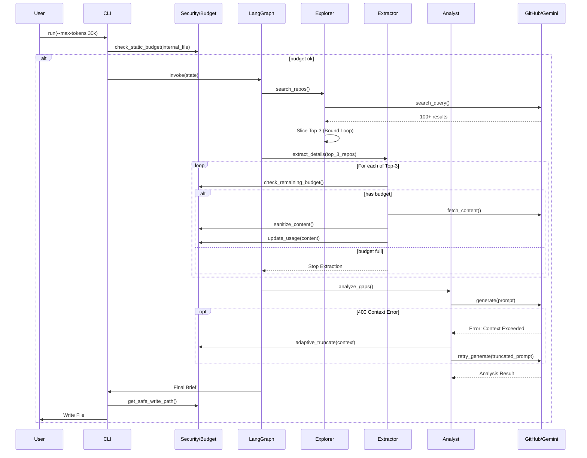

# 93 - Feature: The Scout: External Intelligence Gathering Workflow

## 1. Context & Goal
* **Issue:** #93
* **Objective:** Create a proactive research workflow that searches GitHub for best practices, analyzes top implementations, compares them against internal code, and produces an "Innovation Brief" to identify gaps.
* **Status:** Approved (gemini-3-pro-preview, 2026-01-31)
* **Related Issues:** None - Foundational Feature.

### Open Questions
* **Tokenizer Mismatch Risk:** `tiktoken` (OpenAI) is used for estimation, but Gemini (Google) is the execution model. Vocabulary differences can lead to underestimation and API failures.
    * *Decision:* Implement a **"Pessimistic Estimation + Adaptive Fallback"** strategy. We apply a 1.2x safety buffer to `tiktoken` counts. Crucially, we wrap the LLM invocation in a retry handler that catches `400 INVALID_ARGUMENT` (Context Length Exceeded), truncates the external context by 50%, and retries once automatically.
* **Search Bounding:** How do we prevent the workflow from processing too many repositories or incurring runaway API costs?
    * *Decision:* Implement a hard **Top-N Limit** (default 3) in the `Explorer` node *immediately* after the metadata search. The extraction node will never receive more than 3 targets, ensuring the heavy "fetch content" API calls are strictly bounded.

## 2. Proposed Changes

### 2.1 Files Changed
| File Path | Description |
|-----------|-------------|
| `assemblyzero/workflows/scout/__init__.py` | Package initialization. |
| `assemblyzero/workflows/scout/graph.py` | Defines LangGraph nodes, edges, and compilation logic. |
| `assemblyzero/workflows/scout/nodes.py` | Implementation of Explorer, Extractor, Analyst, and Scribe logic. |
| `assemblyzero/workflows/scout/budget.py` | Token estimation (with buffer), budget tracking, and adaptive truncation logic. |
| `assemblyzero/workflows/scout/security.py` | Path validation, overwrite protection, and content sanitization. |
| `assemblyzero/workflows/scout/instrumentation.py` | Tracing configuration (LangSmith/File logging) setup helper. |
| `assemblyzero/workflows/scout/prompts.py` | Prompts for Gemini analysis with XML fencing injection safeguards. |
| `assemblyzero/workflows/scout/templates.py` | Markdown templates for Innovation Briefs. |
| `tools/run_scout_workflow.py` | CLI entry point with argument parsing, offline mode, and confirmation flows. |
| `assemblyzero/workflows/__init__.py` | Registration of the scout workflow. |
| `docs/0003-file-inventory.md` | Inventory update. |

### 2.2 Dependencies
* **PyGithub**: For GitHub Search and Content API interactions.
* **tiktoken**: For local, offline token estimation.
* **google-generativeai**: Existing dependency for LLM interactions.
* **langgraph**: Existing dependency for workflow orchestration.
* **langsmith**: For optional trace observability.
* **tenacity**: For robust retry logic on API calls.

### 2.3 Data Structures

**`assemblyzero/workflows/scout/graph.py`**

```python
from typing import TypedDict, List, Optional

class ExternalRepo(TypedDict):
    name: str           # "owner/repo"
    url: str            # html_url
    stars: int
    description: str
    license_type: str   # e.g., "MIT", "Apache-2.0", "Unknown"
    readme_summary: str # Summarized content (truncated)
    code_snippets: str  # Relevant code content (truncated) - Optional

class ScoutState(TypedDict):
    topic: str
    internal_file_path: Optional[str]
    internal_code_content: Optional[str]
    min_stars: int
    max_tokens: int     # Budget limit
    current_token_usage: int # Running total
    found_repos: List[ExternalRepo]
    repo_limit: int     # Hard limit on number of repos to analyze (default 3)
    gap_analysis: Optional[str]
    final_brief: str
    errors: List[str]
    offline_mode: bool  # Flag for dev/testing
```

### 2.4 Function Signatures

**`assemblyzero/workflows/scout/budget.py`**

```python
def check_and_update_budget(current_usage: int, new_text: str, limit: int) -> tuple[int, bool]:
    """
    Calculates token count of new_text using tiktoken.
    Applies 1.2x safety buffer factor internally to account for tokenizer mismatch.
    Returns (new_usage, is_within_limit).
    """
    pass

def adaptive_truncate(text: str, reduction_factor: float = 0.5) -> str:
    """
    Aggressively truncates text by reduction_factor (default 50%) to recover 
    from Context Window errors. Prioritizes retaining the beginning of the text.
    """
    pass
```

**`assemblyzero/workflows/scout/security.py`**

```python
def validate_read_path(path: str, base_dir: str = ".") -> str:
    """Ensures path is within base_dir and exists. Raises ValueError if unsafe."""
    pass

def get_safe_write_path(filename: str, directory: str, overwrite: bool = False) -> str:
    """
    Returns path. If file exists and overwrite=False, returns filename with timestamp.
    Ensures path is within intended directory.
    """
    pass

def sanitize_external_content(content: str) -> str:
    """Removes potential prompt injection vectors (fake XML tags) from external text."""
    pass
```

### 2.5 Logic Flow (Pseudocode)

**Explorer Node (Strict Bounding Logic)**

```python
def explorer_node(state):
    """
    Searches for repositories and applies a HARD LIMIT before passing data downstream.
    This prevents downstream nodes from iterating over potentially hundreds of results.
    """
    query = f"{state['topic']} stars:>{state['min_stars']}"
    
    if state['offline_mode']:
        raw_repos = load_fixture("search_results.json")
    else:
        # Search API call (metadata only, cheap)
        raw_repos = github_api.search_repositories(query)
    
    # CRITICAL: Bound the results *immediately*
    # Sort by stars descending and take top N (default 3)
    # This ensures Extractor node never processes > N repos
    limit = state.get('repo_limit', 3)
    top_repos = sorted(raw_repos, key=lambda x: x.stars, reverse=True)[:limit]
    
    return {"found_repos": top_repos}
```

**Extractor Node (Budget Aware)**

```python
def extractor_node(state):
    updated_repos = []
    current_usage = state['current_token_usage']
    
    for repo in state['found_repos']:
        # 1. Pre-fetch Budget Check
        if current_usage >= state['max_tokens']:
            break # Stop extracting if budget full
            
        # 2. Fetch Content (Expensive API Call)
        if state['offline_mode']:
            content = load_fixture(f"{repo['name']}_content.json")
        else:
            content = github_api.fetch_content(repo['name'])
            
        # 3. Sanitize
        clean_readme = security.sanitize_external_content(content.readme)
        clean_license = content.license.spdx_id
        
        # 4. Update Budget (with 1.2x buffer)
        new_usage, ok = budget.check_and_update_budget(current_usage, clean_readme, state['max_tokens'])
        
        if ok:
            repo['readme_summary'] = clean_readme
            repo['license_type'] = clean_license
            updated_repos.append(repo)
            current_usage = new_usage
        else:
            # We hit limit during this repo, stop here
            break
            
    return {"found_repos": updated_repos, "current_token_usage": current_usage}
```

**Gap Analyst Node (Adaptive Retry)**

```python
def gap_analyst_node(state):
    prompt = build_prompt(state['internal_code_content'], state['found_repos'])
    
    try:
        # Attempt 1
        analysis = llm.generate(prompt)
    except GoogleAPICallError as e:
        if "400" in str(e) or "INVALID_ARGUMENT" in str(e):
            logger.warning("Context limit exceeded. Retrying with truncation.")
            
            # Adaptive Fallback: Slash external context by 50%
            for repo in state['found_repos']:
                repo['readme_summary'] = budget.adaptive_truncate(repo['readme_summary'], 0.5)
                
            prompt = build_prompt(state['internal_code_content'], state['found_repos'])
            analysis = llm.generate(prompt) # Retry once, then fail hard
        else:
            raise e

    return {"gap_analysis": analysis}
```

### 2.6 Technical Approach
*   **Module Location:** `assemblyzero/workflows/scout/`
*   **Design Pattern:** Chain of Responsibility (LangGraph).
*   **Bounding Strategy:**
    *   **Volume Bound:** `Explorer` node enforces a strict `repo_limit` (Top 3) *before* returning state. This guarantees `O(N)` complexity where N=3, mitigating Tier 1 Cost risks.
    *   **Budget Bound:** `Extractor` node checks `budget.check_and_update_budget` inside its loop.
*   **Observability:** `instrumentation.py` encapsulates callback setup (e.g., LangSmith), keeping the graph logic clean while ensuring visibility.
*   **Safety:**
    *   **File Isolation:** `security.py` manages all I/O.
    *   **Overwrite Protection:** `get_safe_write_path` automatically versions output files to prevent data loss.

## 3. Requirements
1.  **Strict Search Bounding:** The Explorer node MUST slice search results to the Top-N (default 3) *before* passing them to the Extractor node.
2.  **License Capture:** Extract license SPDX identifier (e.g., "MIT") for every external repository.
3.  **Strict Path Validation:** Reject paths containing `..` or pointing outside the project root.
4.  **Overwrite Protection:** Do not overwrite existing briefs unless `--force` is used; otherwise append timestamp (e.g., `innovation-topic-20231027.md`).
5.  **Offline Capability:** Support `--offline` flag to run workflow using local JSON fixtures.
6.  **Dynamic Budget Enforcement:** Extractor node must stop extracting new repositories if the token budget is exceeded.
7.  **Adaptive Error Handling:** Automatically retry LLM calls with truncated context if a Context Window error (400) occurs.
8.  **Data Privacy:** Require interactive confirmation (or `--yes`) before sending internal code to LLM.

## 4. Alternatives Considered

| Alternative | Pros | Cons | Decision |
|-------------|------|------|----------|
| **Gemini Tokenizer API** | Exact token counts. | Latency/Cost per check. | **Tiktoken + 1.2x Buffer** - Faster, handled via adaptive retry. |
| **Global Tracing Config** | Cleaner code. | Harder to debug isolated tool. | **Local Instrumentation** - Setup in `instrumentation.py` specifically for this workflow runner. |
| **Lazy Iteration** | Potentially saves memory. | High risk of iterating too far. | **Immediate Slicing** - `Explorer` node truncates list immediately to prevent runaway API calls. |
| **JSON Output Only** | Easier for machines. | Bad UX for humans. | **Dual Format** - Markdown default, JSON via flag. |

## 5. Data & Fixtures

### 5.1 Data Sources
| Source | Type | Attributes |
|--------|------|------------|
| **Internal Code** | File | Content, Path |
| **GitHub Search** | API | Repo Name, Stars, URL |
| **GitHub Content** | API | README.md (Truncated), LICENSE |

### 5.2 Data Pipeline
```ascii
[CLI Input] -> [Path Validator] -> [Static Token Check] -> [Confirmer]
                                         |
                                         v
[LangGraph] -> [Explorer] -> [Strict Slicing (Top-3)] -> [Extractor Node]
                                                               |
                                                       (Budget Check Loop)
                                                               |
                                                               v
[Gap Analyst Node] <-> [Adaptive Retry Loop] <-> [LLM]
      |
      v
[Scribe Node] -> [Overwrite Protector] -> [File System]
```

### 5.3 Test Fixtures
| Fixture | Description |
|---------|-------------|
| `tests/fixtures/scout/github_search_response.json` | Mocked search results (list of 20 repos) for offline mode. |
| `tests/fixtures/scout/github_content_response.json` | Mocked README/License for offline mode. |
| `tests/fixtures/scout/malicious_readme.md` | README containing fake instructions (Prompt Injection test). |
| `tests/fixtures/golden-brief-summary.md` | Expected summary for similarity testing. |

### 5.4 Deployment Pipeline
*   **Development:** Use `--offline` for logic changes.
*   **Environment:** Requires `GITHUB_TOKEN`, `GOOGLE_API_KEY`.

## 6. Diagram

### 6.1 Mermaid Quality Gate
- [x] Diagram exists
- [x] Flows clearly defined
- [x] Includes Repo Limit (Search Bounding)
- [x] Includes Adaptive Retry

### 6.2 Diagram


## 7. Security Considerations

| Concern | Mitigation |
|---------|------------|
| **Search Loop Explosion** | **Top-N Hard Limit:** `Explorer` node explicitly slices the list of repositories to `repo_limit` (default 3) immediately after search, ensuring downstream nodes never process unbounded lists. |
| **Path Traversal** | `security.validate_read_path` and `get_safe_write_path` ensure operations are confined to project root and `ideas/active/`. |
| **Indirect Prompt Injection** | `security.sanitize_external_content` removes fake tags; XML fencing used in prompts. |
| **Tokenizer Mismatch** | **Pessimistic + Adaptive:** 1.2x buffer on counts + Truncation retry on API error. |
| **Data Loss (Overwrite)** | `get_safe_write_path` appends timestamp if file exists (unless `--force`). |

## 8. Performance Considerations

| Metric | Budget | Strategy |
|--------|--------|----------|
| **Analysis Latency** | < 60s | Use Gemini 1.5 Flash. Hard limit on Repo count (3). |
| **Token Usage** | < 30k/run | Dynamic tracking halts data collection when limit is hit. |
| **API Rate Limits** | 5000/hr | Exponential backoff via `tenacity`. |

## 9. Risks & Mitigations

| Risk | Impact | Likelihood | Mitigation |
|------|--------|------------|------------|
| **Tokenizer Mismatch** | LLM API rejects request (400 Error). | High | **Strong:** 20% Estimation Buffer + Adaptive Retry logic that automatically cuts context by 50% and retries. |
| **Offline Drift** | Fixtures diverge from API. | Medium | Periodic fixture refresh required. |
| **Runaway API Costs** | Massive search results processed via expensive calls. | Low | **Top-N Slicing:** The `Explorer` node logic slices the array immediately, physically preventing more than 3 fetch operations. |

## 10. Verification & Testing

### 10.1 Test Scenarios
| ID | Scenario | Type | Input | Output | Criteria |
|----|----------|------|-------|--------|----------|
| T1 | Happy Path (Live) | Integ | `topic="async", internal="assemblyzero/core.py"` | `.md` file | File created, contains License info. |
| T2 | Offline Mode | Unit | `--offline --topic "test"` | `.md` file | Uses fixture data, no API calls. |
| T3 | Search Bounding | Unit | Mock API returns 100 repos | State has 3 repos | Explorer node correctly slices results *before* extraction. |
| T4 | Overwrite Protect | Unit | Run twice on same topic | `file.md`, `file-{ts}.md` | Second run does not delete first file. |
| T5 | Adaptive Retry | Integ | Mock LLM throwing 400 Error | Analysis Result | System retries with smaller context and succeeds. |

### 10.2 Test Commands
```bash
# Security & Budget Unit Tests
pytest tests/workflows/scout/test_security.py
pytest tests/workflows/scout/test_budget.py

# Search Bounding Test (CRITICAL)
pytest tests/workflows/scout/test_nodes.py -k "test_explorer_limits_results"

# Offline Workflow Test
python tools/run_scout_workflow.py --topic "offline test" --offline --yes

# Overwrite Protection Test
touch "ideas/active/innovation-test.md"
python tools/run_scout_workflow.py --topic "test" --offline --yes
ls -l ideas/active/innovation-test*
```

### 10.3 Manual Tests (Only If Unavoidable)
| ID | Description |
|----|-------------|
| M1 | Run without `--yes` and manually decline confirmation. |
| M2 | Run with invalid `--internal` path to verify error message. |

## 11. Definition of Done

### Code
- [ ] `assemblyzero/workflows/scout/` package implemented.
- [ ] `budget.py` implemented with pessimistic estimation (1.2x) and adaptive truncation.
- [ ] `security.py` implemented with path validation, sanitization, and overwrite protection.
- [ ] `instrumentation.py` implemented for callback configuration.
- [ ] `Explorer` node implements **immediate slicing** of search results to Top-N.
- [ ] `GapAnalyst` node includes try/catch/retry logic for Context Errors.
- [ ] CLI supports `--offline`, `--force`, and `--verbose`.

### Tests
- [ ] Unit tests for `Explorer` verify result slicing (bounding) prevents processing 4th item.
- [ ] Unit tests for `budget.py` cover limits and truncation.
- [ ] Unit tests for `security.py` cover overwrite scenarios.
- [ ] Test scenario T5 (Adaptive Retry) passed with mocked API.

### Documentation
- [ ] `docs/0003-file-inventory.md` updated.
- [ ] Wiki updated with Scout usage, Offline mode, and Troubleshooting (Logs).

### Review
- [ ] Security Review passed.
- [ ] Code Review passed.

---

## Appendix: Review Log

### Review Summary

| Review | Date | Verdict | Key Issue |
|--------|------|---------|-----------|
| 1 | 2026-01-31 | APPROVED | `gemini-3-pro-preview` |
| - | - | - | - |

**Final Status:** APPROVED - PENDING REVIEW