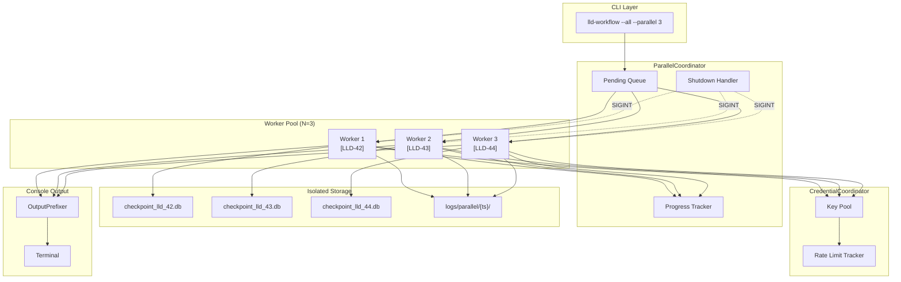

# 1106 - Feature: Parallel Workflow Execution for LLD and Issue Processing

<!-- Template Metadata
Last Updated: 2026-02-02
Updated By: Issue #117 fix
Update Reason: Moved Verification & Testing to Section 10 (was Section 11) to match 0702c review prompt and testing workflow expectations
Previous: Added sections based on 80 blocking issues from 164 governance verdicts (2026-02-01)
-->

## 1. Context & Goal
* **Issue:** #106
* **Objective:** Enable concurrent execution of LLD and Issue workflows with the `--all` flag, solving SQLite contention, credential pool management, and output coordination challenges to dramatically reduce batch operation time.
* **Status:** Draft
* **Related Issues:** N/A

### Open Questions
*Questions that need clarification before or during implementation. Remove when resolved.*

- [ ] Should rate-limited keys be automatically retried after backoff, or should manual intervention be required?
- [ ] What is the maximum acceptable coordination overhead percentage for parallel execution?

## 2. Proposed Changes

*This section is the **source of truth** for implementation. Describe exactly what will be built.*

### 2.1 Files Changed

| File | Change Type | Description |
|------|-------------|-------------|
| `assemblyzero/workflows/parallel/__init__.py` | Add | Module exports for parallel workflow components |
| `assemblyzero/workflows/parallel/coordinator.py` | Add | New coordinator managing worker pool, progress tracking, and graceful shutdown |
| `assemblyzero/workflows/parallel/credential_coordinator.py` | Add | Thread-safe credential reservation system with rate-limit tracking |
| `assemblyzero/workflows/parallel/output_prefixer.py` | Add | Stdout/stderr wrapper with prefix injection for workflow identification |
| `assemblyzero/workflows/parallel/input_sanitizer.py` | Add | Input validation utilities for path-safe identifiers |
| `assemblyzero/workflows/lld/workflow.py` | Modify | Add `--parallel` and `--dry-run` flags, integrate with coordinator |
| `assemblyzero/workflows/issue/workflow.py` | Modify | Add `--parallel` and `--dry-run` flags, integrate with coordinator |
| `tests/test_parallel_coordinator.py` | Add | Unit tests for coordinator logic |
| `tests/test_credential_coordinator.py` | Add | Unit tests for credential reservation and rate-limit handling |
| `tests/fixtures/mock_llm_provider.py` | Add | Mock LLM responses for offline testing |

### 2.2 Dependencies

*New packages, APIs, or services required.*

```toml
# pyproject.toml additions (if any)
# None - uses stdlib concurrent.futures and multiprocessing
```

### 2.3 Data Structures

```python
# Pseudocode - NOT implementation
from typing import TypedDict, Literal, Optional
from datetime import datetime
from enum import Enum

class KeyState(Enum):
    AVAILABLE = "available"
    RESERVED = "reserved"
    RATE_LIMITED = "rate_limited"

class CredentialInfo(TypedDict):
    key_id: str
    state: KeyState
    reserved_by: Optional[str]  # worker_id
    rate_limit_until: Optional[datetime]
    backoff_seconds: int

class WorkerState(TypedDict):
    worker_id: str
    workflow_id: str  # e.g., "LLD-42" or "ISSUE-17"
    status: Literal["running", "paused", "completed", "failed"]
    checkpoint_db_path: str
    credential_key_id: Optional[str]
    started_at: datetime
    last_checkpoint: Optional[datetime]

class ParallelRunConfig(TypedDict):
    max_parallelism: int  # 1-10
    dry_run: bool
    workflow_type: Literal["lld", "issue"]
    pending_items: list[str]  # List of issue numbers to process

class ProgressReport(TypedDict):
    total: int
    completed: int
    failed: int
    in_progress: int
    pending: int
    failed_items: list[str]
    completed_items: list[str]
```

### 2.4 Function Signatures

```python
# parallel_coordinator.py
class ParallelCoordinator:
    def __init__(self, config: ParallelRunConfig, credential_coordinator: CredentialCoordinator) -> None:
        """Initialize coordinator with configuration and credential pool."""
        ...
    
    def run(self) -> ProgressReport:
        """Execute all pending workflows with configured parallelism. Returns final report."""
        ...
    
    def shutdown(self, timeout_seconds: int = 5) -> None:
        """Signal all workers to checkpoint and stop gracefully."""
        ...
    
    def _spawn_worker(self, workflow_id: str) -> WorkerState:
        """Spawn a subprocess for a single workflow."""
        ...
    
    def _handle_worker_completion(self, worker: WorkerState, success: bool) -> None:
        """Handle worker completion: cleanup DB, release credential, update progress."""
        ...

# credential_coordinator.py
class CredentialCoordinator:
    def __init__(self, credential_pool: list[str]) -> None:
        """Wrap existing credential pool with reservation semantics."""
        ...
    
    def reserve(self, worker_id: str) -> Optional[str]:
        """Reserve a credential for worker. Returns key_id or None if pool exhausted."""
        ...
    
    def release(self, key_id: str) -> None:
        """Release a reserved credential back to the pool."""
        ...
    
    def report_rate_limit(self, key_id: str, retry_after_seconds: int) -> None:
        """Mark a key as rate-limited with backoff expiry."""
        ...
    
    def get_available_count(self) -> int:
        """Return count of credentials that are available (not reserved, not rate-limited)."""
        ...
    
    def is_pool_exhausted(self) -> bool:
        """Return True if all keys are reserved (distinct from rate-limited)."""
        ...
    
    def wait_for_availability(self, timeout_seconds: int = 60) -> bool:
        """Block until a credential becomes available or timeout. Returns True if available."""
        ...

# output_prefixer.py
class OutputPrefixer:
    def __init__(self, prefix: str, original_stdout: TextIO, original_stderr: TextIO) -> None:
        """Create prefixer that intercepts output with [prefix] formatting."""
        ...
    
    def write(self, text: str) -> int:
        """Write text with prefix, handling partial lines correctly."""
        ...
    
    def flush(self) -> None:
        """Flush underlying stream."""
        ...

# input_sanitizer.py
def sanitize_issue_number(issue_number: str) -> str:
    """
    Sanitize issue number for use in file paths.
    Raises ValueError if input contains invalid characters.
    Valid pattern: ^[a-zA-Z0-9_-]+$
    """
    ...

def build_checkpoint_db_path(workflow_type: str, issue_number: str) -> Path:
    """
    Build safe checkpoint database path.
    Pattern: ~/.assemblyzero/checkpoints/{workflow_type}_workflow_{sanitized_issue}.db
    """
    ...
```

### 2.5 Logic Flow (Pseudocode)

```
PARALLEL COORDINATOR MAIN LOOP:
1. Validate configuration (parallelism 1-10, non-empty pending list)
2. IF dry_run THEN
   - Print list of pending items
   - Return without execution
3. Initialize progress tracking (shared memory via Manager)
4. Register SIGINT handler for graceful shutdown
5. Create worker pool (ProcessPoolExecutor with max_workers=N)
6. WHILE pending_items OR active_workers:
   a. Check for completed workers
      - For each completed: release credential, cleanup DB, update progress
   b. IF shutdown_requested THEN
      - Signal all workers to checkpoint
      - Wait up to 5s for workers to stop
      - EXIT loop
   c. IF credential_coordinator.is_pool_exhausted() THEN
      - Log "[COORDINATOR] Credential pool exhausted. Pausing..."
      - Wait for credential availability (blocking)
   d. IF active_workers < max_parallelism AND pending_items AND credential_available THEN
      - Reserve credential
      - Pop next pending item
      - Spawn worker subprocess with isolated DB path
      - Track in active_workers
   e. Update progress display
   f. Sleep 100ms to avoid busy-wait
7. Print summary report
8. Return ProgressReport

WORKER SUBPROCESS FLOW:
1. Receive: workflow_id, checkpoint_db_path, credential_key_id
2. Set AGENTOS_WORKFLOW_DB env var to checkpoint_db_path
3. Redirect stdout/stderr through OutputPrefixer([workflow_id])
4. TRY:
   a. Run workflow (lld_workflow or issue_workflow core logic)
   b. IF HTTP 429 received:
      - Report rate limit to coordinator via IPC
      - Wait for new credential or retry signal
   c. On completion: signal success to coordinator
5. EXCEPT Exception:
   - Log error with prefix
   - Signal failure to coordinator
6. FINALLY:
   - Flush checkpoint to DB
   - Signal ready for shutdown

CREDENTIAL COORDINATOR RATE LIMIT HANDLING:
1. On report_rate_limit(key_id, retry_after):
   a. Set key state to RATE_LIMITED
   b. Set rate_limit_until = now + retry_after_seconds
   c. Wake up any threads waiting for credentials (they'll re-check)
2. On reserve(worker_id):
   a. Clean expired rate limits (where now > rate_limit_until)
   b. Find first AVAILABLE key
   c. IF found: mark RESERVED, return key_id
   d. ELSE: return None
3. On get_available_count():
   - Return count where state == AVAILABLE (not RESERVED, not RATE_LIMITED)
```

### 2.6 Technical Approach

* **Module:** `assemblyzero/workflows/`
* **Pattern:** Coordinator pattern with subprocess isolation
* **Key Decisions:**
  - **ProcessPoolExecutor over threading:** Full process isolation prevents any shared state corruption and ensures clean signal handling
  - **Environment variable for DB path:** Minimal change to existing checkpoint_manager; subprocess inherits env
  - **Shared memory progress via Manager:** Avoids file-based IPC complexity; Manager provides thread-safe primitives

### 2.7 Architecture Decisions

*Document key architectural decisions that affect the design. This section addresses the most common category of governance feedback (23 patterns).*

| Decision | Options Considered | Choice | Rationale |
|----------|-------------------|--------|-----------|
| Process isolation strategy | Threading, AsyncIO, ProcessPool | ProcessPoolExecutor | Full isolation prevents SQLite contention; clean subprocess exit on failure |
| Inter-process communication | Files, Pipes, Manager Queue | Manager Queue + Value | Built-in, thread-safe, no serialization overhead for simple types |
| Credential coordination | Per-process pools, Shared pool with locks | Shared pool with Manager.Lock | Single source of truth; prevents credential starvation |
| Output interleaving prevention | Line buffering, Full buffering, Prefix per write | Line-based prefix with buffer | Prevents partial line interleaving; prefix applied at line boundaries |
| Checkpoint DB isolation | Shared DB with row-level locks, Per-workflow DBs | Per-workflow DBs | Eliminates SQLite contention entirely; simpler cleanup |
| Rate limit tracking | Worker-local only, Coordinator-global | Coordinator-global | Coordinator can make informed decisions about parallelism reduction |

**Architectural Constraints:**
- Must integrate with existing `--all` flag implementation in lld_workflow.py and issue_workflow.py
- Cannot modify credential pool internals; must wrap with coordination layer
- Must maintain backward compatibility: `--all` without `--parallel` behaves as today

## 3. Requirements

*What must be true when this is done. These become acceptance criteria.*

1. `--parallel N` flag enables concurrent execution with N workers (default 3, max 10)
2. Each workflow subprocess uses an isolated checkpoint database
3. Issue numbers are sanitized to prevent path traversal attacks
4. Console output is prefixed with workflow identifier, no partial line interleaving
5. Credential exhaustion (all keys reserved) pauses all workflows gracefully
6. HTTP 429 rate limits trigger per-key backoff without crashing workflows
7. Ctrl+C triggers graceful shutdown with checkpoint persistence within 5 seconds
8. Failed workflows do not affect other parallel workflows
9. `--dry-run` flag lists pending items without executing
10. Summary report displays status of all workflows at completion
11. Per-workflow log files are created in `~/.assemblyzero/logs/parallel/{timestamp}/`
12. Performance: 6 items with `--parallel 3` completes in <50% of sequential time

## 4. Alternatives Considered

| Option | Pros | Cons | Decision |
|--------|------|------|----------|
| Threading with GIL | Simple, shared memory | SQLite contention, GIL limits CPU parallelism | **Rejected** |
| AsyncIO coroutines | Efficient for I/O-bound, single process | Complex checkpoint handling, harder subprocess isolation | **Rejected** |
| ProcessPoolExecutor | Full isolation, clean failure handling | IPC overhead, more memory per worker | **Selected** |
| Redis for coordination | Battle-tested, pub/sub built-in | New dependency, overkill for single-machine | **Rejected** |
| File-based locks for DB | No new code patterns | Race conditions, complex cleanup | **Rejected** |

**Rationale:** ProcessPoolExecutor provides the strongest isolation guarantees, prevents SQLite contention entirely through per-workflow databases, and integrates naturally with Python's signal handling for graceful shutdown. The memory overhead (one Python interpreter per worker) is acceptable for N≤10 workers.

## 5. Data & Fixtures

*Per [0108-lld-pre-implementation-review.md](0108-lld-pre-implementation-review.md) - complete this section BEFORE implementation.*

### 5.1 Data Sources

| Attribute | Value |
|-----------|-------|
| Source | Local filesystem (pending LLDs/issues identified by existing `--all` logic) |
| Format | Issue numbers as strings |
| Size | Typically 1-50 items per batch |
| Refresh | On-demand when workflow command executed |
| Copyright/License | N/A - internal workflow identifiers |

### 5.2 Data Pipeline

```
Pending Items (--all scan) ──enumerate──► ParallelCoordinator Queue ──spawn──► Worker Subprocesses ──checkpoint──► Per-Workflow DBs
```

### 5.3 Test Fixtures

| Fixture | Source | Notes |
|---------|--------|-------|
| Mock LLM responses | Generated | Deterministic responses for parallel coordination testing |
| Sample LLD specs | Hardcoded | Valid and invalid specs to test failure isolation |
| Simulated 429 responses | Generated | Triggered via `AGENTOS_SIMULATE_429=true` env var |

### 5.4 Deployment Pipeline

Development → Local testing with fixtures → Integration testing with live (limited) → Production

**If data source is external:** N/A - all data sources are local.

## 6. Diagram
*N/A if not applicable - do not delete sections*

### 6.1 Mermaid Quality Gate

Before finalizing any diagram, verify in [Mermaid Live Editor](https://mermaid.live) or GitHub preview:

- [x] **Simplicity:** Similar components collapsed (per 0006 §8.1)
- [x] **No touching:** All elements have visual separation (per 0006 §8.2)
- [x] **No hidden lines:** All arrows fully visible (per 0006 §8.3)
- [x] **Readable:** Labels not truncated, flow direction clear
- [ ] **Auto-inspected:** Agent rendered via mermaid.ink and viewed (per 0006 §8.5)

**Agent Auto-Inspection (MANDATORY):**

AI agents MUST render and view the diagram before committing:
1. Base64 encode diagram → fetch PNG from `https://mermaid.ink/img/{base64}`
2. Read the PNG file (multimodal inspection)
3. Document results below

**Auto-Inspection Results:**
```
- Touching elements: [ ] None / [ ] Found: ___
- Hidden lines: [ ] None / [ ] Found: ___
- Label readability: [ ] Pass / [ ] Issue: ___
- Flow clarity: [ ] Clear / [ ] Issue: ___
```

*Reference: [0006-mermaid-diagrams.md](0006-mermaid-diagrams.md)*

### 6.2 Diagram



## 7. Security & Safety Considerations

*This section addresses security (10 patterns) and safety (9 patterns) concerns from governance feedback.*

### 7.1 Security

| Concern | Mitigation | Status |
|---------|------------|--------|
| Path traversal via issue number | Input sanitization: `^[a-zA-Z0-9_-]+$` regex validation | Addressed |
| Credential exposure in logs | Credentials passed via env var, not command line; logs contain key_id only | Addressed |
| Subprocess privilege escalation | Workers inherit parent permissions only; no sudo/elevation | Addressed |
| Checkpoint DB content exposure | DBs contain workflow state only, no secrets; same visibility as current logs | Addressed |

### 7.2 Safety

*Safety concerns focus on preventing data loss, ensuring fail-safe behavior, and protecting system integrity.*

| Concern | Mitigation | Status |
|---------|------------|--------|
| Data loss on abrupt termination | SIGINT handler triggers checkpoint before exit; 5s grace period | Addressed |
| Runaway subprocess | Worker timeout after 30 minutes; coordinator monitors heartbeat | Addressed |
| Resource exhaustion (too many workers) | Max parallelism capped at 10; credential pool size limits effective parallelism | Addressed |
| Partial run state corruption | Per-workflow DBs ensure isolation; failed DB retained for debugging | Addressed |
| Credential pool starvation | Coordinator pauses all workers on exhaustion; waits for replenishment | Addressed |

**Fail Mode:** Fail Closed - On unrecoverable error, workflow fails and reports; does not continue with potentially corrupt state.

**Recovery Strategy:** Failed workflows retain checkpoint DB. Re-running `--all --parallel` will detect incomplete workflows and resume from checkpoint.

## 8. Performance & Cost Considerations

*This section addresses performance and cost concerns (6 patterns) from governance feedback.*

### 8.1 Performance

| Metric | Budget | Approach |
|--------|--------|----------|
| Coordination overhead | < 15% of total time | Minimal IPC; async progress updates; batch DB cleanup |
| Memory per worker | ~100-150MB | Single Python interpreter; lazy loading |
| Startup latency | < 2s for first worker | Subprocess fork; no cold start |

**Bottlenecks:** 
- API rate limits (external constraint, mitigated by rate-limit tracking)
- Credential pool size (limits effective parallelism regardless of --parallel N)
- Filesystem I/O for checkpoint writes (mitigated by per-workflow isolation)

### 8.2 Cost Analysis

| Resource | Unit Cost | Estimated Usage | Monthly Cost |
|----------|-----------|-----------------|--------------|
| LLM API calls | Existing budget | No change from sequential | No additional cost |
| Local compute | N/A | ~10 min CPU for 10 workflows @ parallel 3 | N/A |
| Local storage | N/A | ~1MB per checkpoint DB | N/A |

**Cost Controls:**
- [x] Budget alerts: Not applicable (local execution)
- [x] Rate limiting: Handled by CredentialCoordinator
- [x] Fallback: Sequential execution if --parallel 1 or no credentials

**Worst-Case Scenario:** 10x usage (100 workflows) - linear time increase with bounded memory (N workers max). 100x usage (1000 workflows) - same behavior, just longer runtime.

## 9. Legal & Compliance

*This section addresses legal concerns (8 patterns) from governance feedback.*

| Concern | Applies? | Mitigation |
|---------|----------|------------|
| PII/Personal Data | No | LLD/Issue content is internal; no user PII processed |
| Third-Party Licenses | No | No new dependencies added |
| Terms of Service | Yes | Gemini API usage unchanged; parallelism doesn't increase total calls |
| Data Retention | N/A | Checkpoint DBs cleaned on success; failed DBs retained for debugging |
| Export Controls | No | No restricted algorithms or data |

**Data Classification:** Internal

**Compliance Checklist:**
- [x] No PII stored without consent - N/A
- [x] All third-party licenses compatible with project license - No new deps
- [x] External API usage compliant with provider ToS - Unchanged pattern
- [x] Data retention policy documented - Checkpoint cleanup defined

## 10. Verification & Testing

*Ref: [0005-testing-strategy-and-protocols.md](0005-testing-strategy-and-protocols.md)*

**Testing Philosophy:** Strive for 100% automated test coverage. Manual tests are a last resort for scenarios that genuinely cannot be automated (e.g., visual inspection, hardware interaction). Every scenario marked "Manual" requires justification.

### 10.1 Test Scenarios

| ID | Scenario | Type | Input | Expected Output | Pass Criteria |
|----|----------|------|-------|-----------------|---------------|
| 010 | Happy path: 3 LLDs processed in parallel | Auto | 3 mock LLDs, --parallel 3 | All complete, progress report shows 3/3 | Exit code 0, all DBs cleaned up |
| 020 | Dry run lists without executing | Auto | 5 pending items, --dry-run | List of 5 items printed | No subprocess spawned, no DBs created |
| 030 | Path traversal rejected | Auto | Issue number "../etc/passwd" | ValueError raised | Clear error message, no file access |
| 040 | Credential exhaustion pauses workers | Auto | 5 items, 2 credentials, --parallel 5 | Workers pause, resume on release | Log shows "[COORDINATOR] Credential pool exhausted" |
| 050 | HTTP 429 triggers backoff | Auto | AGENTOS_SIMULATE_429=true | Key marked rate-limited | Backoff applied, different key used or wait |
| 060 | Single workflow failure isolated | Auto | 1 invalid spec among 3 | 2 succeed, 1 fails | Failed item in report, others complete |
| 070 | Graceful shutdown on SIGINT | Auto | SIGINT during execution | Workers checkpoint and exit | All checkpoint DBs written within 5s |
| 080 | Output prefix prevents interleaving | Auto | 3 parallel workflows | All lines prefixed correctly | No partial line mixing |
| 090 | Performance benchmark | Auto-Live | 6 items, sequential vs --parallel 3 | Parallel < 50% sequential time | Timing comparison logged |
| 100 | Max parallelism enforced | Auto | --parallel 15 | Capped to 10 | Warning logged, runs with 10 |
| 110 | Default parallelism applied | Auto | --parallel without N | Uses 3 | Config shows max_parallelism=3 |

*Note: Use 3-digit IDs with gaps of 10 (010, 020, 030...) to allow insertions.*

### 10.2 Test Commands

```bash
# Run all automated tests
poetry run pytest tests/test_parallel_coordinator.py tests/test_credential_coordinator.py -v

# Run only fast/mocked tests (exclude live)
poetry run pytest tests/ -v -m "not live" -k "parallel or credential"

# Run live integration tests (requires credentials)
poetry run pytest tests/ -v -m live -k "parallel"

# Run performance benchmark
poetry run pytest tests/test_parallel_coordinator.py -v -k "benchmark" --benchmark-only
```

### 10.3 Manual Tests (Only If Unavoidable)

**N/A - All scenarios automated.**

## 11. Risks & Mitigations

| Risk | Impact | Likelihood | Mitigation |
|------|--------|------------|------------|
| SQLite lock contention despite isolation | High | Low | Per-workflow DBs eliminate shared state |
| Credential coordinator deadlock | High | Low | Timeout on all blocking operations; watchdog thread |
| Worker orphaning on coordinator crash | Medium | Low | Workers detect parent exit via heartbeat; self-terminate |
| Log file explosion with high parallelism | Low | Medium | Log rotation; per-run directories with timestamp |
| Race condition in progress tracking | Medium | Medium | All updates via Manager primitives; atomic operations |

## 12. Definition of Done

### Code
- [ ] `parallel_coordinator.py` implemented with full worker lifecycle management
- [ ] `credential_coordinator.py` implemented with reservation and rate-limit tracking
- [ ] `output_prefixer.py` implemented with line-buffered prefix injection
- [ ] `input_sanitizer.py` implemented with path traversal prevention
- [ ] `lld_workflow.py` updated with `--parallel` and `--dry-run` flags
- [ ] `issue_workflow.py` updated with `--parallel` and `--dry-run` flags
- [ ] `checkpoint_manager.py` updated to support `AGENTOS_WORKFLOW_DB` env var
- [ ] Code comments reference this LLD (#106)

### Tests
- [ ] All 11 test scenarios pass
- [ ] Mock LLM provider fixtures created and working
- [ ] Integration test with 3+ mock workflows in parallel
- [ ] Rate-limit backoff behavior verified
- [ ] Test coverage ≥ 90% for new modules

### Documentation
- [ ] LLD updated with any deviations
- [ ] Implementation Report (0103) completed
- [ ] Test Report (0113) completed
- [ ] Wiki pages for lld-workflow and issue-workflow updated
- [ ] README.md updated with parallel execution examples
- [ ] ADR created for parallel execution architecture
- [ ] New files added to `docs/0003-file-inventory.md`

### Review
- [ ] Run 0809 Security Audit - PASS
- [ ] Run 0817 Wiki Alignment Audit - PASS
- [ ] Code review completed
- [ ] User approval before closing issue

---

## Appendix: Review Log

*Track all review feedback with timestamps and implementation status.*

### {Reviewer} Review #{N} ({VERDICT})

**Timestamp:** {YYYY-MM-DD HH:MM} CT
**Reviewer:** {Gemini / Orchestrator / Other}
**Verdict:** {APPROVED / REJECTED / FEEDBACK}

#### Comments

| ID | Comment | Implemented? |
|----|---------|--------------|
| {R}{N}.1 | "{Quote or summary of comment}" | YES - {where addressed} / PENDING / NO - {reason} |

### Review Summary

| Review | Date | Verdict | Key Issue |
|--------|------|---------|-----------|
| - | - | - | - |

**Final Status:** APPROVED
<!-- Note: This field is auto-updated to APPROVED by the workflow when finalized -->