# 172 - Feature: Add smoke test that actually runs the workflow after TDD completion

<!-- Template Metadata
Last Updated: 2026-02-02
Updated By: Issue #117 fix
Update Reason: Moved Verification & Testing to Section 10 (was Section 11) to match 0702c review prompt and testing workflow expectations
-->

## 1. Context & Goal
* **Issue:** #172
* **Objective:** Add a LangGraph workflow node that runs actual program smoke tests after the TDD green phase to catch integration breaks that unit tests with mocks miss.
* **Status:** Approved (gemini-3-pro-preview, 2026-02-04)
* **Related Issues:** #168 (bug that would have been caught), PR #165 (the breaking change)

### Open Questions

- [x] ~~Which entry points need smoke tests?~~ **Resolved:** All `tools/run_*.py` files
- [x] ~~Should smoke test run `--help` or minimal invocation?~~ **Resolved:** `--help` sufficient to catch import errors
- [x] ~~Should smoke tests run in parallel or sequentially?~~ **Resolved:** Sequentially. For the MVP, sequential execution reduces complexity (avoiding race conditions on stdout/stderr capture) and resource contention. Given the budget of 30s timeout and expected 5-20 entry points running `--help` (which should be sub-second), the total duration will be negligible. Parallelization can be added later if latency becomes a bottleneck.

## 2. Proposed Changes

*This section is the **source of truth** for implementation. Describe exactly what will be built.*

### 2.1 Files Changed

| File | Change Type | Description |
|------|-------------|-------------|
| `agentos/nodes/smoke_test_node.py` | Add | New LangGraph node for smoke testing |
| `agentos/nodes/__init__.py` | Modify | Export smoke test node |
| `tests/unit/test_smoke_test_node.py` | Add | Unit tests for smoke test functionality |
| `tests/integration/test_smoke_test_integration.py` | Add | Integration tests for smoke test node |

### 2.1.1 Path Validation (Mechanical - Auto-Checked)

*Issue #277: Before human or Gemini review, paths are verified programmatically.*

Mechanical validation automatically checks:
- All "Modify" files must exist in repository
- All "Delete" files must exist in repository
- All "Add" files must have existing parent directories
- No placeholder prefixes (`src/`, `lib/`, `app/`) unless directory exists

**If validation fails, the LLD is BLOCKED before reaching review.**

### 2.2 Dependencies

*No new dependencies required.*

```toml
# pyproject.toml additions (if any)
# None - uses existing subprocess module from standard library
```

### 2.3 Data Structures

```python
# Pseudocode - NOT implementation
class SmokeTestResult(TypedDict):
    success: bool                    # Whether smoke test passed
    entry_point: str                 # Path to entry point tested
    error_type: Optional[str]        # ImportError, ModuleNotFoundError, etc.
    error_message: Optional[str]     # Full error message if failed
    execution_time_ms: int           # Time taken to run smoke test

class SmokeTestState(TypedDict):
    smoke_test_enabled: bool                    # Whether to run smoke test
    smoke_test_results: list[SmokeTestResult]   # Results from all smoke tests
    smoke_test_passed: bool                     # Overall pass/fail
    project_root: Path                          # Root directory for entry point discovery
```

### 2.4 Function Signatures

```python
# Signatures only - implementation in source files
def discover_entry_points(project_root: Path) -> list[Path]:
    """Find all tools/run_*.py entry points in the project.
    
    Excludes __pycache__ and hidden directories (.*) from discovery.
    """
    ...

def run_smoke_test(entry_point: Path, timeout_seconds: int = 30) -> SmokeTestResult:
    """Execute a single entry point with --help and capture results.
    
    Uses subprocess.run with shell=False to prevent shell injection.
    """
    ...

def integration_smoke_test(state: SmokeTestState) -> dict:
    """LangGraph node: Run smoke tests on all entry points after green phase."""
    ...

def parse_import_error(stderr: str) -> tuple[Optional[str], Optional[str]]:
    """Extract error type and module from import error output."""
    ...

def should_run_smoke_test(state: SmokeTestState) -> bool:
    """Conditional edge: Determine if smoke test should run based on smoke_test_enabled flag."""
    ...
```

### 2.5 Logic Flow (Pseudocode)

```
1. GREEN phase completes successfully
2. Check should_run_smoke_test(state)
   - IF smoke_test_enabled is False THEN skip to REFACTOR (bypass smoke test)
3. Call integration_smoke_test(state)
   a. discover_entry_points(project_root)
      - Glob for tools/run_*.py
      - Exclude __pycache__ and hidden directories
   b. FOR each entry_point:
      - run_smoke_test(entry_point) with shell=False
      - Capture stdout, stderr, return code
      - IF return_code != 0 THEN
        - parse_import_error(stderr)
        - Record failure with error details
      - ELSE
        - Record success
   c. Aggregate results
4. IF any smoke test failed THEN
   - Set smoke_test_passed = False
   - Transition to ERROR state with clear message
   ELSE
   - Set smoke_test_passed = True
   - Continue to REFACTOR phase
5. Return updated state
```

### 2.6 Technical Approach

* **Module:** `agentos/nodes/smoke_test_node.py`
* **Pattern:** LangGraph Node pattern (consistent with existing nodes in `agentos/nodes/`)
* **Key Decisions:** 
  - Use subprocess with `shell=False` to run entry points (isolation and security)
  - Use `--help` flag for minimal invocation (no side effects)
  - Capture both ImportError and ModuleNotFoundError specifically
  - Timeout after 30 seconds to prevent hanging
  - Exclude `__pycache__` and hidden directories from discovery

### 2.7 Architecture Decisions

*Document key architectural decisions that affect the design.*

| Decision | Options Considered | Choice | Rationale |
|----------|-------------------|--------|-----------|
| Execution method | Direct import vs subprocess | Subprocess | Isolation prevents polluting current process state |
| Test invocation | `--help` vs `--mock` vs custom flag | `--help` | Universal, no side effects, catches import errors |
| Node placement | After green vs after refactor | After green | Catch breaks earliest, before spending time on refactor |
| Failure handling | Warning vs hard fail | Hard fail | Per issue requirements - workflow must fail on import errors |
| Shell mode | shell=True vs shell=False | shell=False | Security - prevents shell injection attacks |

**Architectural Constraints:**
- Must integrate with existing LangGraph node patterns in `agentos/nodes/`
- Cannot require changes to entry point scripts
- Must not make external API calls (hence --help not --mock with actual execution)

## 3. Requirements

*What must be true when this is done. These become acceptance criteria.*

1. TDD workflow runs smoke test after green phase passes
2. Smoke test imports and runs the actual entry point (via subprocess)
3. ImportError/ModuleNotFoundError fails the workflow with clear error message
4. Smoke test results are recorded in workflow state for reporting
5. Smoke test can be disabled via configuration for faster iteration

## 4. Alternatives Considered

| Option | Pros | Cons | Decision |
|--------|------|------|----------|
| Subprocess with --help | Universal, no side effects, catches imports | Doesn't test runtime behavior | **Selected** |
| Direct Python import | Faster, simpler | Pollutes process, can't catch all errors | Rejected |
| Mock mode execution | Tests more code paths | Requires all tools support --mock, side effects | Rejected |
| Separate CI step | Simpler implementation | Doesn't integrate with TDD workflow | Rejected |

**Rationale:** Subprocess with --help provides the best balance of catching import errors (the primary goal per issue) without side effects or requiring tool modifications.

## 5. Data & Fixtures

*Per [0108-lld-pre-implementation-review.md](0108-lld-pre-implementation-review.md) - complete this section BEFORE implementation.*

### 5.1 Data Sources

| Attribute | Value |
|-----------|-------|
| Source | Local filesystem (tools/run_*.py files) |
| Format | Python scripts |
| Size | Typically 5-20 entry points per project |
| Refresh | Static (discovered at runtime) |
| Copyright/License | N/A - project-internal files |

### 5.2 Data Pipeline

```
tools/run_*.py ──glob──► entry_points list ──subprocess──► stdout/stderr ──parse──► SmokeTestResult
```

### 5.3 Test Fixtures

| Fixture | Source | Notes |
|---------|--------|-------|
| Valid entry point script | Generated | Simple script that exits 0 |
| Broken import script | Generated | Script with `import nonexistent_module` |
| Syntax error script | Generated | Script with syntax error |
| Slow script | Generated | Script that sleeps (for timeout testing) |

### 5.4 Deployment Pipeline

No special deployment requirements. Tests run locally and in CI.

**If data source is external:** N/A - all data is local.

## 6. Diagram

### 6.1 Mermaid Quality Gate

Before finalizing any diagram, verify in [Mermaid Live Editor](https://mermaid.live) or GitHub preview:

- [x] **Simplicity:** Similar components collapsed (per 0006 §8.1)
- [x] **No touching:** All elements have visual separation (per 0006 §8.2)
- [x] **No hidden lines:** All arrows fully visible (per 0006 §8.3)
- [x] **Readable:** Labels not truncated, flow direction clear
- [ ] **Auto-inspected:** Agent rendered via mermaid.ink and viewed (per 0006 §8.5)

**Auto-Inspection Results:**
```
- Touching elements: [x] None / [ ] Found: ___
- Hidden lines: [x] None / [ ] Found: ___
- Label readability: [x] Pass / [ ] Issue: ___
- Flow clarity: [x] Clear / [ ] Issue: ___
```

*Reference: [0006-mermaid-diagrams.md](0006-mermaid-diagrams.md)*

### 6.2 Diagram

```mermaid
flowchart TD
    subgraph TDD["TDD Workflow"]
        RED["🔴 Red Phase"]
        GREEN["🟢 Green Phase"]
        SMOKE["🔥 Smoke Test Node"]
        REFACTOR["🔵 Refactor Phase"]
        DONE["✅ Complete"]
        ERR["❌ Workflow Failed"]
    end

    RED --> GREEN
    GREEN --> SMOKE
    SMOKE -->|All Pass| REFACTOR
    SMOKE -->|Import Error| ERR
    SMOKE -->|Disabled| REFACTOR
    REFACTOR --> DONE

    subgraph Smoke["Smoke Test Details"]
        DISCOVER["Discover Entry Points"]
        RUN["Run with --help"]
        PARSE["Parse Output"]
        CHECK["Check for Errors"]
    end

    SMOKE -.-> DISCOVER
    DISCOVER --> RUN
    RUN --> PARSE
    PARSE --> CHECK
```



## 7. Security & Safety Considerations

### 7.1 Security

| Concern | Mitigation | Status |
|---------|------------|--------|
| Command injection | Entry points discovered via glob, not user input; subprocess uses shell=False | Addressed |
| Arbitrary code execution | Only runs --help flag, minimal execution | Addressed |
| Path traversal | Paths validated to be under project root | Addressed |
| Shell injection | subprocess.run called with shell=False | Addressed |

### 7.2 Safety

| Concern | Mitigation | Status |
|---------|------------|--------|
| Runaway process | 30-second timeout on subprocess | Addressed |
| Resource exhaustion | Run entry points sequentially, not parallel | Addressed |
| Data loss on failure | Smoke test is read-only, no modifications | Addressed |
| Non-source file execution | Explicitly exclude __pycache__ and hidden directories from discovery | Addressed |

**Fail Mode:** Fail Closed - Any import error fails the workflow immediately

**Recovery Strategy:** Fix the import error and re-run the TDD workflow

## 8. Performance & Cost Considerations

### 8.1 Performance

| Metric | Budget | Approach |
|--------|--------|----------|
| Latency per entry point | < 5s | --help returns quickly, 30s timeout |
| Total smoke test time | < 60s | Sequential execution, typically 5-20 entry points |
| Memory | < 50MB | Subprocess isolation, one at a time |

**Bottlenecks:** Sequential execution could be slow with many entry points. Future optimization: parallel execution with resource limits.

### 8.2 Cost Analysis

| Resource | Unit Cost | Estimated Usage | Monthly Cost |
|----------|-----------|-----------------|--------------|
| Compute (local) | $0 | N/A | $0 |
| CI minutes | ~$0.008/min | ~1 min per workflow | < $1 |

**Cost Controls:**
- [x] No external API calls
- [x] Timeout prevents runaway execution
- [x] Can be disabled for faster iteration

**Worst-Case Scenario:** 100 entry points × 30s timeout = 50 minutes. Mitigation: timeout would kill the process, and this scenario is unrealistic.

## 9. Legal & Compliance

| Concern | Applies? | Mitigation |
|---------|----------|------------|
| PII/Personal Data | No | Smoke test only runs --help |
| Third-Party Licenses | No | No new dependencies |
| Terms of Service | No | No external APIs |
| Data Retention | No | No data persisted |
| Export Controls | No | Standard Python tooling |

**Data Classification:** Internal

**Compliance Checklist:**
- [x] No PII stored without consent
- [x] All third-party licenses compatible with project license
- [x] External API usage compliant with provider ToS
- [x] Data retention policy documented

## 10. Verification & Testing

*Ref: [0005-testing-strategy-and-protocols.md](0005-testing-strategy-and-protocols.md)*

**Testing Philosophy:** 100% automated test coverage for all new code.

### 10.0 Test Plan (TDD - Complete Before Implementation)

**TDD Requirement:** Tests MUST be written and failing BEFORE implementation begins.

| Test ID | Test Description | Expected Behavior | Status |
|---------|------------------|-------------------|--------|
| T010 | test_discover_entry_points_finds_run_scripts | Returns list of tools/run_*.py paths | RED |
| T020 | test_run_smoke_test_success | Returns success=True for valid script | RED |
| T030 | test_run_smoke_test_import_error | Returns success=False with error details for ImportError | RED |
| T040 | test_run_smoke_test_module_not_found | Returns success=False with error details for ModuleNotFoundError | RED |
| T050 | test_run_smoke_test_timeout | Returns failure after timeout | RED |
| T060 | test_integration_smoke_test_all_pass | Updates state with passed=True | RED |
| T070 | test_integration_smoke_test_one_fails | Updates state with passed=False | RED |
| T080 | test_workflow_integration_smoke_after_green | Smoke test runs after green phase | RED |
| T090 | test_parse_import_error_extracts_module | Parses ModuleNotFoundError correctly | RED |
| T100 | test_smoke_test_skipped_when_disabled | Smoke test skipped when smoke_test_enabled=False | RED |

**Coverage Target:** ≥95% for all new code

**TDD Checklist:**
- [ ] All tests written before implementation
- [ ] Tests currently RED (failing)
- [ ] Test IDs match scenario IDs in 10.1
- [ ] Test file created at: `tests/unit/test_smoke_test_node.py`

### 10.1 Test Scenarios

| ID | Scenario | Type | Input | Expected Output | Pass Criteria |
|----|----------|------|-------|-----------------|---------------|
| 010 | Discover valid entry points | Auto | Project with tools/run_*.py | List of paths | All paths returned |
| 020 | Smoke test passes for valid script | Auto | Script that exits 0 | SmokeTestResult(success=True) | No errors |
| 030 | Smoke test catches ImportError | Auto | Script with bad import | SmokeTestResult(success=False, error_type="ImportError") | Error captured |
| 040 | Smoke test catches ModuleNotFoundError | Auto | Script with missing module | SmokeTestResult(success=False, error_type="ModuleNotFoundError") | Error captured |
| 050 | Smoke test times out | Auto | Script that sleeps 60s | SmokeTestResult(success=False) | Timeout after 30s |
| 060 | Workflow continues on all pass | Auto | State with passing results | smoke_test_passed=True | Workflow proceeds |
| 070 | Workflow fails on any failure | Auto | State with one failure | smoke_test_passed=False | Workflow errors |
| 080 | Workflow integration: smoke runs after green | Auto | Green phase completes | Smoke test node is called next | Graph transition verified |
| 090 | Parse import error extracts module | Auto | stderr with ModuleNotFoundError | Tuple of (error_type, module_name) | Correct extraction |
| 100 | Smoke test skipped when disabled | Auto | State with smoke_test_enabled=False | Workflow proceeds without running smoke tests | No smoke test execution, state unchanged |

### 10.2 Test Commands

```bash
# Run all automated tests for smoke test module
poetry run pytest tests/unit/test_smoke_test_node.py -v

# Run integration tests
poetry run pytest tests/integration/test_smoke_test_integration.py -v

# Run with coverage
poetry run pytest tests/unit/test_smoke_test_node.py --cov=agentos/nodes/smoke_test_node --cov-report=term-missing
```

### 10.3 Manual Tests (Only If Unavoidable)

N/A - All scenarios automated.

## 11. Risks & Mitigations

| Risk | Impact | Likelihood | Mitigation |
|------|--------|------------|------------|
| Entry points have side effects with --help | Med | Low | Review entry points, ensure --help is idempotent |
| False positives from unrelated errors | Med | Low | Only catch ImportError/ModuleNotFoundError specifically |
| Slow smoke tests delay TDD cycle | Low | Med | Add skip flag (smoke_test_enabled), optimize later with parallel execution |
| Missing entry points in discovery | Med | Low | Use consistent naming convention, document requirements |

## 12. Definition of Done

### Code
- [ ] Implementation complete and linted
- [ ] Code comments reference this LLD

### Tests
- [ ] All test scenarios pass (T010-T100)
- [ ] Test coverage ≥95%

### Documentation
- [ ] LLD updated with any deviations
- [ ] Implementation Report (0103) completed
- [ ] Test Report (0113) completed if applicable

### Review
- [ ] Code review completed
- [ ] User approval before closing issue

### 12.1 Traceability (Mechanical - Auto-Checked)

*Issue #277: Cross-references are verified programmatically.*

Mechanical validation automatically checks:
- Every file mentioned in this section must appear in Section 2.1
- Every risk mitigation in Section 11 should have a corresponding function in Section 2.4 (warning if not)

**If files are missing from Section 2.1, the LLD is BLOCKED.**

---

## Reviewer Suggestions

*Non-blocking recommendations from the reviewer.*

- **Performance:** While 30s is a safe upper bound, consider logging a warning if any single `--help` invocation takes longer than 2s, as this might indicate unintended module initialization logic that should be refactored.

## Appendix: Review Log

*Track all review feedback with timestamps and implementation status.*

### Gemini Review #1 (REVISE)

**Reviewer:** Gemini 3 Pro
**Verdict:** REVISE

#### Comments

| ID | Comment | Implemented? |
|----|---------|--------------|
| G1.1 | "Open question about parallel vs sequential should be resolved" | YES - Resolved in Section 1 Open Questions as Sequential |
| G1.2 | "Requirement 5 (configuration/disablement) missing from Test Plan" | YES - Added T100 test case in Section 10.0 and Scenario 100 in Section 10.1 |
| G1.3 | "Subprocess Safety: ensure subprocess.run is called with shell=False" | YES - Added to Section 2.4 docstrings, Section 2.5 pseudocode, Section 2.6 Key Decisions, and Section 7.1 Security |
| G1.4 | "Discovery Safety: exclude __pycache__ or hidden directories" | YES - Added to Section 2.4 docstrings, Section 2.5 pseudocode, and Section 7.2 Safety |

### Gemini Review #2 (REVISE)

**Reviewer:** Gemini 3 Pro
**Verdict:** REVISE

#### Comments

| ID | Comment | Implemented? |
|----|---------|--------------|
| G2.1 | "T080 Description Mismatch: Section 10.0 defines T080 as workflow integration test, but Section 10.1 Scenario 080 defines it as error message test" | YES - Realigned all Test IDs and Scenarios to match exactly |

### Gemini Review #3 (REVISE)

**Reviewer:** Gemini 3 Pro
**Verdict:** REVISE

#### Comments

| ID | Comment | Implemented? |
|----|---------|--------------|
| G3.1 | "Critical Test ID Misalignment: Complete disconnect between Test Plan (10.0) and Test Scenarios (10.1) - T040 vs 040, T050 vs 050, T070 vs 070 have different meanings" | YES - Completely realigned Section 10.0 and 10.1 with new IDs T010-T100 and matching Scenarios 010-100 |
| G3.2 | "Path Confirmation: Ensure agentos/nodes/ is the correct semantic path" | YES - Confirmed correct path per existing project structure |

### Gemini Review #4 (REVISE)

**Reviewer:** Gemini 3 Pro
**Verdict:** REVISE

#### Comments

| ID | Comment | Implemented? |
|----|---------|--------------|
| G4.1 | "Test Plan vs Scenario Mismatch: Section 10.0 and Section 10.1 have conflicting IDs and definitions starting at ID 040" | YES - Completely rebuilt Test Plan (10.0) and Test Scenarios (10.1) with strict alignment: T010/010 through T100/100 |
| G4.2 | "Performance suggestion: Consider lowering default timeout to 5s or 10s since --help should be instant" | NOTED - Keeping 30s for safety margin, documented as acceptable per Performance section |

### Review Summary

| Review | Date | Verdict | Key Issue |
|--------|------|---------|-----------|
| 5 | 2026-02-04 | APPROVED | `gemini-3-pro-preview` |
| Gemini #1 | - | REVISE | Missing test for Requirement 5 (disable config) |
| Gemini #2 | - | REVISE | Test ID T080/080 description mismatch between 10.0 and 10.1 |
| Gemini #3 | - | REVISE | Complete Test ID misalignment between 10.0 and 10.1 |
| Gemini #4 | - | REVISE | Test Plan vs Scenario Mismatch at IDs 040+ |

**Final Status:** APPROVED