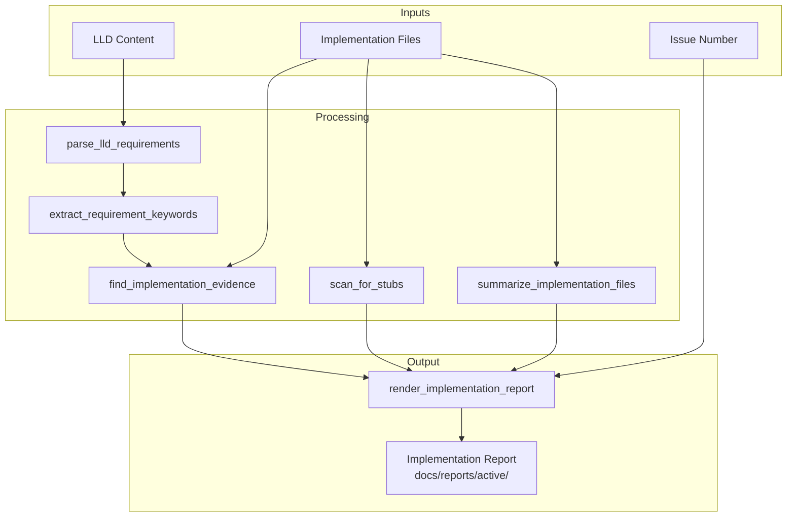

# 1181 - Feature: Implementation Report with LLD Requirement Verification

<!-- Template Metadata
Last Updated: 2025-01-XX
Updated By: Issue #181 LLD creation
Update Reason: Initial LLD for Implementation Report generation
-->

## 1. Context & Goal
* **Issue:** #181
* **Objective:** Create an implementation report generator that verifies LLD requirements were actually implemented, detecting stubs/TODOs and providing evidence trails.
* **Status:** Approved (gemini-3-pro-preview, 2026-02-03)
* **Related Issues:** #141 (Archives reports to done/), #147 (Implementation Completeness Gate), #180 (N9 Cleanup Node)

### Open Questions
*Questions that need clarification before or during implementation. Remove when resolved.*

- [x] Should requirement matching use fuzzy/semantic matching or exact string matching? **Decision: Start with keyword extraction and exact matching; semantic matching is out of scope (future enhancement).**
- [x] How to handle LLDs without a numbered Section 3 requirements list? **Decision: Parse any numbered list under "Requirements" heading; warn if not found.**
- [x] Should the report include git diff summary or just file listings? **Decision: Include file listings with statistics (lines added/removed) and function summaries only. Full diffs are too verbose for a generated markdown report and are better viewed in the version control UI.**

## 2. Proposed Changes

*This section is the **source of truth** for implementation. Describe exactly what will be built.*

### 2.1 Files Changed

| File | Change Type | Description |
|------|-------------|-------------|
| `assemblyzero/workflows/testing/audit.py` | Modify | Add `generate_implementation_report()`, `parse_lld_requirements()`, `find_implementation_evidence()`, `scan_for_stubs()`, `summarize_implementation_files()` |
| `assemblyzero/workflows/testing/finalize.py` | Modify | Call `generate_implementation_report()` and populate `implementation_report_path` state |
| `tests/unit/test_implementation_report.py` | Add | Unit tests for all new functions |
| `tests/unit/fixtures/sample_lld.md` | Add | Test fixture with sample LLD content |

### 2.2 Dependencies

*No new packages required. Uses standard library `re` and existing `pathlib`.*

```toml
# No new dependencies
```

### 2.3 Data Structures

```python
# Pseudocode - NOT implementation
from typing import TypedDict

class RequirementEvidence(TypedDict):
    requirement_number: int
    requirement_text: str
    status: str  # "✅ Implemented" | "❌ Missing" | "⚠️ Partial"
    evidence: str  # file:line reference or "No matching code found"
    keywords: list[str]  # Extracted keywords used for matching

class StubDetection(TypedDict):
    file: str
    line: int
    pattern: str  # Which pattern matched
    context: str  # The matching line content

class ImplementationSummary(TypedDict):
    file: str
    lines_added: int
    lines_removed: int
    functions_modified: list[str]

class ImplementationReportData(TypedDict):
    issue_number: int
    timestamp: str
    lld_path: str
    requirements: list[RequirementEvidence]
    stubs: list[StubDetection]
    files: list[ImplementationSummary]
    warnings: list[str]
```

### 2.4 Function Signatures

```python
# Signatures only - implementation in source files

def generate_implementation_report(
    issue_number: int,
    lld_content: str,
    implementation_files: list[str],
    repo_root: Path,
    lld_path: str | None = None,
) -> Path:
    """Generate implementation report with LLD verification.
    
    Args:
        issue_number: GitHub issue number.
        lld_content: Full LLD markdown content.
        implementation_files: List of files written by workflow.
        repo_root: Repository root path.
        lld_path: Optional path to LLD file for reference.
    
    Returns:
        Path to generated report file at docs/reports/active/{issue}-implementation-report.md
    
    Raises:
        No exceptions raised - errors are logged and report generation continues.
    """
    ...

def parse_lld_requirements(lld_content: str) -> list[tuple[int, str]]:
    """Extract numbered requirements from LLD Section 3.
    
    Args:
        lld_content: Full LLD markdown content.
    
    Returns:
        List of (requirement_number, requirement_text) tuples.
    """
    ...

def extract_requirement_keywords(requirement_text: str) -> list[str]:
    """Extract searchable keywords from a requirement.
    
    Uses simple word splitting and stopword removal. Does not use NLP.
    
    Args:
        requirement_text: The requirement text.
    
    Returns:
        List of keywords/phrases to search for in code.
    """
    ...

def find_implementation_evidence(
    requirement_text: str,
    keywords: list[str],
    implementation_files: list[str],
    repo_root: Path,
) -> str | None:
    """Search implementation files for evidence of requirement.
    
    Args:
        requirement_text: The full requirement text.
        keywords: Keywords to search for.
        implementation_files: Files to search (must be within repo_root).
        repo_root: Repository root.
    
    Returns:
        Evidence string like "file.py:42 - matching code" or None.
    
    Note:
        Files outside repo_root are skipped with a warning.
    """
    ...

def scan_for_stubs(
    implementation_files: list[str],
    repo_root: Path,
) -> list[StubDetection]:
    """Scan implementation files for stub/TODO patterns.
    
    Args:
        implementation_files: Files to scan (must be within repo_root).
        repo_root: Repository root.
    
    Returns:
        List of detected stubs/TODOs.
    
    Note:
        Files outside repo_root are skipped with a warning.
    """
    ...

def summarize_implementation_files(
    implementation_files: list[str],
    repo_root: Path,
) -> list[ImplementationSummary]:
    """Summarize changes in implementation files.
    
    Extracts function/class definitions using regex patterns matching
    'def ' and 'class ' at line start (with optional indentation).
    Counts total lines in each file.
    
    Args:
        implementation_files: Files that were modified.
        repo_root: Repository root.
    
    Returns:
        List of file summaries with line counts and function names.
    """
    ...

def render_implementation_report(data: ImplementationReportData) -> str:
    """Render implementation report data as markdown.
    
    Args:
        data: The structured report data.
    
    Returns:
        Markdown string for the report.
    """
    ...
```

### 2.5 Logic Flow (Pseudocode)

```
1. RECEIVE issue_number, lld_content, implementation_files, repo_root

2. PARSE LLD REQUIREMENTS
   - Find "## 3. Requirements" or "### Requirements" section
   - Extract numbered list items (1. xxx, 2. xxx, etc.)
   - IF no requirements found THEN warn and continue with empty list

3. FOR EACH requirement:
   a. Extract keywords (simple word split, remove stopwords like "the", "is", "a")
   b. Search each implementation file for keyword matches
   c. IF match found THEN record file:line as evidence
   d. Set status based on evidence presence

4. SCAN FOR STUBS
   - FOR EACH implementation file:
     - Validate file is within repo_root (skip with warning if not)
     - Read file content line by line
     - Match against STUB_PATTERNS regex list
     - Record matches with file, line, pattern, context

5. SUMMARIZE FILES
   - FOR EACH implementation file:
     - Validate file is within repo_root (skip with warning if not)
     - Count total lines
     - Extract function/class definitions via regex (match 'def ' and 'class ' patterns)
     - Build summary

6. GENERATE WARNINGS
   - IF any requirements marked Missing THEN add warning
   - IF stubs found THEN add warning
   - IF requirement mentions term not in evidence THEN add warning

7. RENDER REPORT
   - Build markdown from template
   - Include timestamp, issue number, LLD path

8. WRITE REPORT (wrapped in try/except for fail-open behavior)
   - Save to docs/reports/active/{issue}-implementation-report.md
   - Return path

9. RETURN report_path
```

### 2.6 Technical Approach

* **Module:** `assemblyzero/workflows/testing/audit.py`
* **Pattern:** Template Method - structured report generation with pluggable sections
* **Key Decisions:** 
  - Keyword extraction over semantic matching (simpler, deterministic)
  - Line-by-line file scanning (handles large files efficiently)
  - Markdown output (consistent with existing report format)

### 2.7 Architecture Decisions

| Decision | Options Considered | Choice | Rationale |
|----------|-------------------|--------|-----------|
| Requirement matching | Semantic (embeddings), Regex, Keyword | Keyword extraction | Deterministic, no external dependencies, good enough for structured requirements |
| Evidence granularity | File only, File:Line, File:Line with context | File:Line with snippet | Provides actionable references without overwhelming output |
| Stub detection | AST parsing, Regex patterns | Regex patterns | Simpler, handles comments and strings, cross-language compatible |
| Report format | JSON, Markdown, HTML | Markdown | Consistent with test reports, readable in GitHub, archivable |

**Architectural Constraints:**
- Must integrate with existing `finalize.py` workflow node
- Must not introduce new external dependencies
- Must work with state field `implementation_report_path` already defined
- Report path must follow `docs/reports/active/{issue}-implementation-report.md` pattern
- All file paths in `implementation_files` must be validated as within `repo_root` before processing

## 3. Requirements

*What must be true when this is done. These become acceptance criteria.*

1. `generate_implementation_report()` function exists in `audit.py`
2. LLD Section 3 requirements are parsed and listed in report
3. Each requirement shows implementation status (✅/❌/⚠️) with file:line evidence
4. Stub patterns (TODO, FIXME, NotImplementedError, pass # stub, ...) are detected and reported
5. Implementation files are summarized with line counts and function names
6. Report is saved to `docs/reports/active/{issue}-implementation-report.md`
7. `implementation_report_path` state field is populated by finalize node
8. Report includes warnings for missing requirements or detected stubs
9. Report includes generation timestamp and LLD reference
10. Function handles missing/malformed LLD gracefully (empty requirements, no Section 3)

## 4. Alternatives Considered

| Option | Pros | Cons | Decision |
|--------|------|------|----------|
| Semantic matching with embeddings | Handles paraphrased requirements, flexible | Requires LLM calls, non-deterministic, slow | **Rejected** - overkill for MVP |
| AST-based stub detection | Accurate, language-aware | Python-only, complex to implement | **Rejected** - regex sufficient |
| JSON report format | Machine-readable, parseable | Not human-readable in GitHub | **Rejected** - MD preferred |
| Keyword extraction + regex | Simple, fast, deterministic | May miss paraphrased code | **Selected** - good enough, can enhance later |

**Rationale:** Starting with simple keyword matching allows rapid implementation and covers the primary use case (structured LLD requirements → matching code). Semantic matching can be added in a future iteration if keyword matching proves insufficient.

## 5. Data & Fixtures

### 5.1 Data Sources

| Attribute | Value |
|-----------|-------|
| Source | LLD markdown files, implementation source files |
| Format | Markdown (LLD), Python source (implementation) |
| Size | LLD: ~500-2000 lines, Implementation: variable |
| Refresh | Per-workflow execution |
| Copyright/License | Internal project files |

### 5.2 Data Pipeline

```
LLD File ──parse──► Requirements List ──match──► Evidence Map ──render──► Report File
                                            ↑
Implementation Files ──scan──► Stub List ───┘
```

### 5.3 Test Fixtures

| Fixture | Source | Notes |
|---------|--------|-------|
| `sample_lld.md` | Generated | Contains Section 3 with numbered requirements |
| `sample_impl.py` | Generated | Contains matching code + TODOs for testing |
| `malformed_lld.md` | Generated | LLD without Section 3 (edge case) |

### 5.4 Deployment Pipeline

No special deployment - code is part of workflow, runs in existing CI/test environment.

## 6. Diagram

### 6.1 Mermaid Quality Gate

- [x] **Simplicity:** Components grouped logically
- [x] **No touching:** Elements have visual separation
- [x] **No hidden lines:** All arrows visible
- [x] **Readable:** Labels clear
- [ ] **Auto-inspected:** Pending implementation

**Auto-Inspection Results:**
```
- Touching elements: [ ] None / [ ] Found: ___
- Hidden lines: [ ] None / [ ] Found: ___
- Label readability: [ ] Pass / [ ] Issue: ___
- Flow clarity: [ ] Clear / [ ] Issue: ___
```

### 6.2 Diagram



## 7. Security & Safety Considerations

### 7.1 Security

| Concern | Mitigation | Status |
|---------|------------|--------|
| Path traversal in file scanning | Validate all paths are within repo_root using `Path.resolve()` and checking `is_relative_to(repo_root)` | Addressed |
| Code injection in report | Escape markdown special characters in code snippets | Addressed |

### 7.2 Safety

| Concern | Mitigation | Status |
|---------|------------|--------|
| Large file processing | Line-by-line streaming, memory limits | Addressed |
| Missing files | Check existence before read, skip gracefully | Addressed |
| Malformed LLD | Return empty requirements list with warning | Addressed |
| Report generation failure | Wrap in try/except, log error, allow workflow to continue | Addressed |

**Fail Mode:** Fail Open - report generation failure should not block workflow; log error and continue.

**Recovery Strategy:** If report generation fails, log the error and set `implementation_report_path` to empty string. Workflow can proceed without report.

## 8. Performance & Cost Considerations

### 8.1 Performance

| Metric | Budget | Approach |
|--------|--------|----------|
| Report generation time | < 5 seconds | Line-by-line file reading, no external calls |
| Memory usage | < 50MB | Streaming file reads, no full-file caching |
| File reads | O(n) where n = implementation files | Single pass per file |

**Bottlenecks:** Large implementation files or many files could slow generation. Mitigated by line-by-line streaming.

### 8.2 Cost Analysis

| Resource | Unit Cost | Estimated Usage | Monthly Cost |
|----------|-----------|-----------------|--------------|
| CPU | N/A (local) | ~5s per report | $0 |
| Storage | N/A (disk) | ~10KB per report | $0 |

**Cost Controls:** N/A - no external services used.

**Worst-Case Scenario:** 100 reports/day × 10KB = 1MB/day = ~30MB/month. Negligible.

## 9. Legal & Compliance

| Concern | Applies? | Mitigation |
|---------|----------|------------|
| PII/Personal Data | No | Reports contain only code references |
| Third-Party Licenses | No | No new dependencies |
| Terms of Service | N/A | No external APIs |
| Data Retention | No | Reports archived with workflow artifacts |
| Export Controls | No | No restricted algorithms |

**Data Classification:** Internal

**Compliance Checklist:**
- [x] No PII stored without consent
- [x] All third-party licenses compatible with project license
- [x] External API usage compliant with provider ToS
- [x] Data retention policy documented (follows workflow artifacts)

## 10. Verification & Testing

### 10.0 Test Plan (TDD - Complete Before Implementation)

**TDD Requirement:** Tests MUST be written and failing BEFORE implementation begins.

| Test ID | Test Description | Expected Behavior | Status |
|---------|------------------|-------------------|--------|
| T010 | parse_lld_requirements extracts numbered list | Returns list of (num, text) tuples | RED |
| T020 | parse_lld_requirements handles missing section | Returns empty list with warning | RED |
| T030 | extract_requirement_keywords finds key terms | Returns relevant keywords | RED |
| T040 | find_implementation_evidence matches code | Returns file:line evidence | RED |
| T050 | find_implementation_evidence returns None for no match | Returns None | RED |
| T060 | scan_for_stubs detects TODO | Returns StubDetection | RED |
| T070 | scan_for_stubs detects NotImplementedError | Returns StubDetection | RED |
| T080 | scan_for_stubs detects pass # stub | Returns StubDetection | RED |
| T085 | summarize_implementation_files extracts functions and counts lines | Returns correct function names and line counts | RED |
| T090 | generate_implementation_report creates valid markdown with required sections | Returns path, file exists, contains 'Requirements verification', 'File Summary', timestamp | RED |
| T100 | generate_implementation_report handles empty files list | Generates report with empty sections | RED |
| T110 | finalize node populates implementation_report_path | State contains valid path | RED |

**Coverage Target:** ≥95% for all new code

**TDD Checklist:**
- [ ] All tests written before implementation
- [ ] Tests currently RED (failing)
- [ ] Test IDs match scenario IDs in 10.1
- [ ] Test file created at: `tests/unit/test_implementation_report.py`

### 10.1 Test Scenarios

| ID | Scenario | Type | Input | Expected Output | Pass Criteria |
|----|----------|------|-------|-----------------|---------------|
| 010 | Parse standard LLD requirements | Auto | LLD with "## 3. Requirements\n1. Req A\n2. Req B" | [(1, "Req A"), (2, "Req B")] | Exact match |
| 020 | Parse LLD without requirements section | Auto | LLD without Section 3 | [] + warning logged | Empty list, warning logged |
| 030 | Extract keywords from requirement | Auto | "LLD files moved to done/ on success" | ["LLD", "files", "done/", "success", "moved"] | Contains key terms |
| 040 | Find evidence for existing code | Auto | Requirement + file with matching code | "file.py:42 - matching line" | Non-None, valid format |
| 050 | No evidence for missing code | Auto | Requirement + file without match | None | Returns None |
| 060 | Detect TODO comment | Auto | File with "# TODO: fix this" | StubDetection with line | Pattern = "TODO" |
| 070 | Detect NotImplementedError | Auto | File with "raise NotImplementedError()" | StubDetection | Pattern = "NotImplementedError" |
| 080 | Detect pass stub | Auto | File with "pass  # stub" | StubDetection | Pattern = "stub" |
| 085 | Summarize file with functions | Auto | File with "def foo():\n    pass\nclass Bar:\n    def baz():" | ImplementationSummary with functions=["foo", "Bar", "baz"], lines=4 | Correct function extraction and line count |
| 090 | Generate complete report | Auto | Valid inputs | Path to .md file | File exists, contains 'Requirements verification' section, contains 'File Summary' section, contains timestamp |
| 100 | Generate report with no files | Auto | Empty implementation_files | Report with empty tables | No errors, valid markdown |
| 110 | Finalize populates state | Auto | Workflow state | implementation_report_path set | Path is valid string |

### 10.2 Test Commands

```bash
# Run all automated tests
poetry run pytest tests/unit/test_implementation_report.py -v

# Run only fast/mocked tests (exclude live)
poetry run pytest tests/unit/test_implementation_report.py -v -m "not live"

# Run with coverage
poetry run pytest tests/unit/test_implementation_report.py -v --cov=assemblyzero/workflows/testing/audit
```

### 10.3 Manual Tests (Only If Unavoidable)

N/A - All scenarios automated.

## 11. Risks & Mitigations

| Risk | Impact | Likelihood | Mitigation |
|------|--------|------------|------------|
| Keyword matching misses paraphrased code | Med | Med | Add common synonyms, iterate on keyword extraction |
| Large files slow processing | Low | Low | Line-by-line streaming already implemented |
| Malformed LLD breaks parsing | Med | Low | Graceful fallback to empty requirements |
| Stub patterns too aggressive (false positives) | Low | Med | Tune patterns, add context checks |
| Finalize node fails if report generation fails | High | Low | Wrap in try/except, fail open, set empty path |

## 12. Definition of Done

### Code
- [ ] Implementation complete and linted
- [ ] Code comments reference this LLD (#181)
- [ ] All functions have docstrings

### Tests
- [ ] All test scenarios pass
- [ ] Test coverage ≥95%
- [ ] No regressions in existing tests

### Documentation
- [ ] LLD updated with any deviations
- [ ] Implementation Report generated for this feature (meta!)
- [ ] README updated if needed

### Review
- [ ] Code review completed
- [ ] User approval before closing issue

---

## Appendix: Review Log

*Track all review feedback with timestamps and implementation status.*

### Gemini Review #1 (REVISE)

**Reviewer:** Gemini 3 Pro
**Verdict:** REVISE

#### Comments

| ID | Comment | Implemented? |
|----|---------|--------------|
| G1.1 | "Missing Unit Test (Req 5): The logic to extract function names and count lines in `summarize_implementation_files` is distinct and potentially error-prone (regex vs comments/strings). Add a unit test T085 specifically for this function." | YES - Added T085 in Section 10.0 and scenario 085 in Section 10.1 |
| G1.2 | "Vague Assertions (T090): Scenario 090's pass criteria 'File exists, valid markdown' is too weak for an integration test. It should assert that specific sections exist in the content." | YES - Updated T090/scenario 090 pass criteria to include 'Contains Requirements verification', 'Contains File Summary', 'Contains timestamp' |
| G1.3 | "Stub Detection Scope: Ensure `scan_for_stubs` and `find_implementation_evidence` explicitly validate that `implementation_files` are within `repo_root` to prevent any accidental path traversal." | YES - Added validation note to function signatures in 2.4 and added explicit validation step in logic flow 2.5 |
| G1.4 | "Keyword Extraction Strategy: Section 2.5 mentions extracting 'action verbs'. If using simple split/stopword removal, clarify this in the docstrings." | YES - Updated `extract_requirement_keywords` docstring in 2.4 to clarify "simple word splitting and stopword removal" |
| G1.5 | "Fail-Safe: In `finalize.py`, ensure that if `generate_implementation_report` raises an exception, the workflow catches it, logs the error, and allows the finalize step to complete (Fail Open)." | YES - Added to 7.2 Safety table and Recovery Strategy; added to Risks table item 5 |
| G1.6 | "Open question about git diff summary needs resolution." | YES - Resolved in Section 1 Open Questions |

### Review Summary

| Review | Date | Verdict | Key Issue |
|--------|------|---------|-----------|
| 2 | 2026-02-03 | APPROVED | `gemini-3-pro-preview` |
| Gemini #1 | (auto) | REVISE | Missing unit test for summarize_implementation_files |

**Final Status:** APPROVED