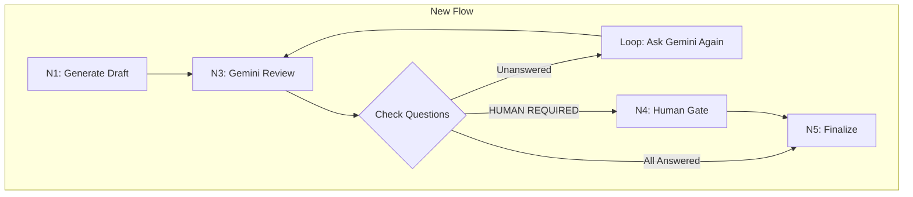

# 248 - Feature: Gemini Answers Open Questions Before Human Escalation

## 1. Context & Goal
* **Issue:** #248
* **Objective:** Move validation gate AFTER Gemini review so Gemini can answer open questions, with loop-back until resolved
* **Status:** Approved (Gemini 3 Pro, 2026-02-03)
* **Related Issues:** #245 (validation counted DoD checkboxes), #236 (original validation gate)

### Open Questions
*Questions that need clarification before or during implementation. Remove when resolved.*

- [x] ~~Should we add a max retry count for the Gemini question-answering loop, or reuse the existing max_iterations budget?~~ **RESOLVED: Reuse the existing `max_iterations` budget.** Adding a separate counter introduces unnecessary state complexity. The global budget suffices to prevent infinite loops.
- [x] ~~What should happen if Gemini marks ALL questions as HUMAN REQUIRED - terminate workflow or force human gate?~~ **RESOLVED: Force Human Gate (N4).** Terminating the workflow defeats the purpose of "Human Required". The workflow must escalate to the human for resolution.
- [x] ~~Should the prompt changes be in the template file (0702c) or hardcoded in review.py?~~ **RESOLVED: Template file (0702c).** Prompts must be treated as versioned assets/data, not hardcoded strings in logic files.

## 2. Proposed Changes

*This section is the **source of truth** for implementation. Describe exactly what will be built.*

### 2.1 Files Changed

| File | Change Type | Description |
|------|-------------|-------------|
| `assemblyzero/workflows/requirements/nodes/generate_draft.py` | Modify | Remove pre-review validation gate (lines ~245-280) |
| `assemblyzero/workflows/requirements/nodes/review.py` | Modify | Add post-review open questions check |
| `assemblyzero/workflows/requirements/graph.py` | Modify | Add conditional edge for question-loop after review |
| `docs/skills/0702c-LLD-Review-Prompt.md` | Modify | Add Open Questions answering instructions |
| `tests/unit/test_open_questions_loop.py` | Add | Unit tests for new loop behavior |

### 2.2 Dependencies

*No new packages required.*

### 2.3 Data Structures

```python
# No new state fields needed - reuse existing:
# - lld_status: "APPROVED" | "BLOCKED" | "QUESTIONS_PENDING"
# - iteration_count: int (shared budget for revisions + question loops)
# - current_verdict: str (contains Gemini's response including answered questions)
```

### 2.4 Function Signatures

```python
# assemblyzero/workflows/requirements/nodes/review.py

def check_unanswered_questions(draft_content: str, verdict_content: str) -> tuple[list[str], list[str]]:
    """Check for unanswered open questions after Gemini review.

    Returns:
        Tuple of (unanswered_questions, human_required_questions)
    """
    ...

def build_question_followup_prompt(unanswered: list[str]) -> str:
    """Build prompt asking Gemini to answer the unanswered questions."""
    ...
```

### 2.5 Logic Flow (Pseudocode)

```
Current Flow (Broken):
1. N1: Generate draft
2. Validate open questions
3. BLOCKED if unchecked questions → Workflow terminates (never reaches Gemini!)

New Flow:
1. N1: Generate draft (no validation here)
2. N3: Gemini review (WITH instructions to answer questions)
3. Post-review check:
   a. Extract unchecked questions from Section 1 "Open Questions"
   b. Check if Gemini's verdict answered them
   c. IF unanswered AND not "HUMAN REQUIRED":
      - Build followup prompt: "You approved but didn't answer: [list]"
      - Loop back to N3 with followup context
   d. IF all answered OR only "HUMAN REQUIRED":
      - Proceed based on verdict
4. IF verdict=APPROVED AND no unanswered → N5: Finalize
5. IF verdict=BLOCKED → N1: Revise draft (existing loop)
6. IF only HUMAN REQUIRED questions → N4: Human gate
```

### 2.6 Technical Approach

* **Module:** `assemblyzero/workflows/requirements/`
* **Pattern:** Post-condition check with loop-back
* **Key Decisions:**
  - Remove pre-review validation entirely (was blocking valid drafts)
  - Add Open Questions instructions to Gemini's review prompt
  - Reuse existing iteration budget (no separate loop counter)
  - "HUMAN REQUIRED" is an explicit escape hatch for Gemini

### 2.7 Architecture Decisions

| Decision | Options Considered | Choice | Rationale |
|----------|-------------------|--------|-----------|
| Validation timing | Pre-review, Post-review, Both | Post-review only | Pre-review blocks before Gemini can help |
| Loop mechanism | New node, Reuse N3 | Reuse N3 | Simpler graph, N3 already handles multiple calls |
| Human escalation | Always ask, Only HUMAN REQUIRED, Never | Only HUMAN REQUIRED | Balance autonomy with human control |
| Prompt location | Hardcoded, Template file | Template file (0702c) | Maintainable, auditable, consistent |

**Architectural Constraints:**
- Must work with existing LangGraph structure
- Must not break existing --gates behavior
- Must share iteration budget (no infinite loops)

## 3. Requirements

1. Drafts with open questions proceed to Gemini review (not blocked pre-review)
2. Gemini review prompt includes instructions to answer open questions
3. Post-review check detects unanswered questions (not marked HUMAN REQUIRED)
4. Unanswered questions trigger loop back to Gemini with followup prompt
5. Only questions marked "HUMAN REQUIRED" escalate to human gate
6. Workflow respects max_iterations for combined revision+question loops
7. Final validation only blocks if HUMAN REQUIRED questions remain unanswered by human

## 4. Alternatives Considered

| Option | Pros | Cons | Decision |
|--------|------|------|----------|
| Keep pre-review validation, fix drafter prompt | Simple | Drafter can't always know answers | **Rejected** |
| Let Gemini revise draft directly | Fewer steps | Role confusion | **Rejected** |
| Post-review validation with loop | Gemini can answer; clear roles | More complex routing | **Selected** |
| Remove validation entirely | Simplest | Open questions slip through | **Rejected** |

## 5. Data & Fixtures

### 5.1 Data Sources

| Attribute | Value |
|-----------|-------|
| Source | LLD draft content, Gemini verdict |
| Format | Markdown text |
| Size | ~500-1000 lines |

### 5.3 Test Fixtures

| Fixture | Source | Notes |
|---------|--------|-------|
| `draft_with_open_questions.md` | Generated | 3 unchecked questions in Section 1 |
| `verdict_questions_answered.md` | Generated | Gemini marks all [x] with recommendations |
| `verdict_questions_unanswered.md` | Generated | Gemini approves but leaves questions unchecked |
| `verdict_human_required.md` | Generated | Gemini marks questions as HUMAN REQUIRED |

## 6. Diagram



## 7. Security & Safety Considerations

### 7.1 Security

| Concern | Mitigation | Status |
|---------|------------|--------|
| Prompt injection via questions | Questions extracted from trusted LLD only | Addressed |

### 7.2 Safety

| Concern | Mitigation | Status |
|---------|------------|--------|
| Infinite loop | Shared iteration budget (max_iterations) | Addressed |
| Gemini always says HUMAN REQUIRED | Human can override or answer | Addressed |

**Fail Mode:** Fail Closed - If max iterations reached, workflow terminates with current state

## 8. Performance & Cost Considerations

| Metric | Budget | Approach |
|--------|--------|----------|
| Additional API calls | 0-2 per workflow | Only loops if Gemini fails to answer |
| Latency | +30s per loop | Acceptable for improved outcomes |

## 9. Legal & Compliance

| Concern | Applies? | Mitigation |
|---------|----------|------------|
| PII/Personal Data | No | No PII in LLD content |
| Third-Party Licenses | No | No new dependencies |

## 10. Verification & Testing

### 10.0 Test Plan (TDD)

| Test ID | Test Description | Expected Behavior | Status |
|---------|------------------|-------------------|--------|
| T010 | test_draft_with_questions_proceeds_to_review | Draft not blocked pre-review | RED |
| T020 | test_gemini_answers_questions | Questions resolved in verdict | RED |
| T030 | test_unanswered_triggers_loop | Loop back to N3 with followup | RED |
| T040 | test_human_required_escalates | Goes to human gate | RED |
| T050 | test_max_iterations_respected | Terminates after limit | RED |
| T060 | test_all_answered_proceeds_to_finalize | N5 reached when resolved | RED |
| T070 | test_prompt_includes_question_instructions | 0702c has new section | RED |

**Coverage Target:** ≥95%

### 10.1 Test Scenarios

| ID | Scenario | Type | Input | Expected Output | Pass Criteria |
|----|----------|------|-------|-----------------|---------------|
| 010 | Draft with open questions proceeds | Auto | Draft with 3 unchecked questions | Reaches N3_review | No BLOCKED status pre-review |
| 020 | Gemini answers questions | Auto | Review with question instructions | All questions [x] | Verdict contains resolutions |
| 030 | Unanswered triggers loop | Auto | Verdict approves but questions unchecked | Loop to N3 | Followup prompt sent |
| 040 | HUMAN REQUIRED escalates | Auto | Verdict with HUMAN REQUIRED | Goes to N4 | Human gate invoked |
| 050 | Max iterations respected | Auto | 20 loops without resolution | Terminates | Exit with current state |
| 060 | Resolved proceeds to finalize | Auto | All questions answered | Reaches N5 | APPROVED status |
| 070 | Prompt updated | Auto | Load 0702c | Contains question instructions | Regex match |

## 11. Risks & Mitigations

| Risk | Impact | Likelihood | Mitigation |
|------|--------|------------|------------|
| Gemini ignores question instructions | Med | Low | Clear prompt, followup loop |
| Infinite loop | High | Low | Shared iteration budget |
| Regression in existing behavior | High | Med | Comprehensive test coverage |

## 12. Definition of Done

### Code
- [ ] Implementation complete and linted
- [ ] Code comments reference this LLD (#248)

### Tests
- [ ] All test scenarios pass
- [ ] Test coverage ≥95%

### Documentation
- [ ] LLD updated with any deviations
- [ ] Implementation Report completed

### Review
- [ ] Code review completed
- [ ] User approval before closing issue

---

## Appendix: Review Log

### Review Summary

| Review | Date | Verdict | Reviewer |
|--------|------|---------|----------|
| 1 | 2026-02-03 | APPROVED | `Gemini 3 Pro` |

### Gemini Recommendations (from review)

**Observability (non-blocking):**
- Ensure the loop transition event is logged at INFO level for debugging

**Suggestions:**
- Sync 0702c template changes with test fixtures to prevent drift
- Consider adding `question_loop_triggered_count` metric

**Final Status:** APPROVED
