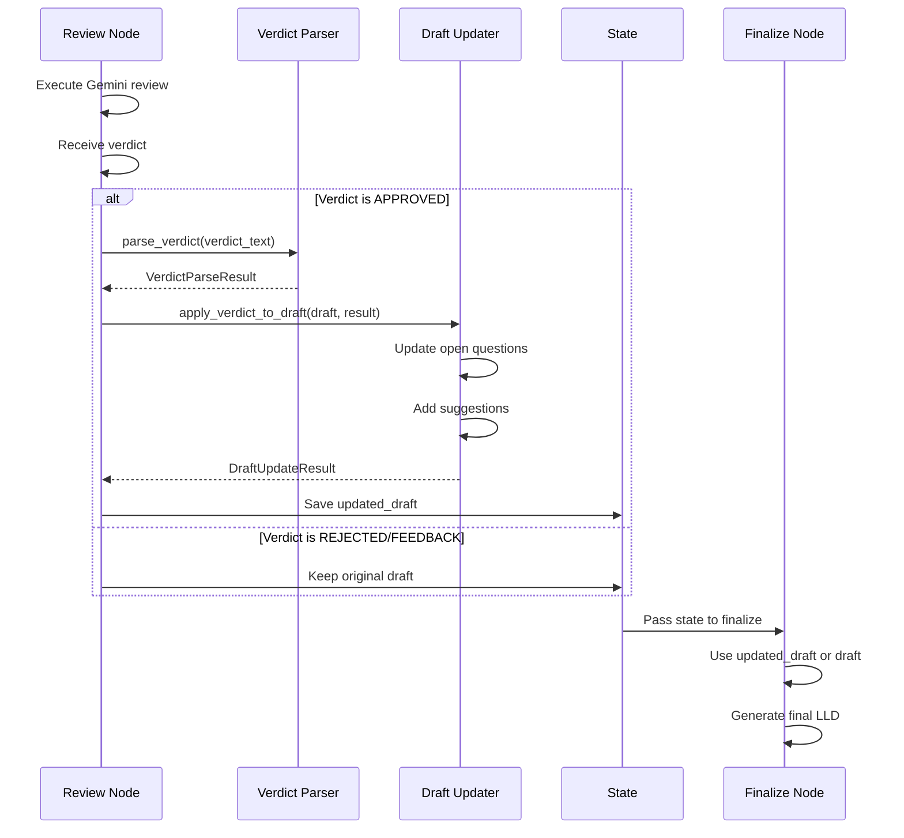

# 1257 - Feature: Review Node Should Update Draft with Resolved Open Questions

<!-- Template Metadata
Last Updated: 2026-02-02
Updated By: Issue #117 fix
Update Reason: Moved Verification & Testing to Section 10 (was Section 11) to match 0702c review prompt and testing workflow expectations
Previous: Added sections based on 80 blocking issues from 164 governance verdicts (2026-02-01)
-->

## 1. Context & Goal
* **Issue:** #257
* **Objective:** Ensure the review node updates the draft LLD with resolved open questions and Tier 3 suggestions from approved verdicts, eliminating validation blocks caused by stale draft content.
* **Status:** Approved (gemini-3-pro-preview, 2026-02-04)
* **Related Issues:** #180 (example of the problem)

### Open Questions
*Questions that need clarification before or during implementation. Remove when resolved.*

- [ ] Should the original open questions text be preserved with strikethrough, or replaced entirely with resolution text?
- [ ] Should Tier 3 suggestions be added inline to relevant sections or consolidated in a new "Reviewer Suggestions" section?
- [ ] Should we create a backup of the draft before modification for audit/rollback purposes?

## 2. Proposed Changes

*This section is the **source of truth** for implementation. Describe exactly what will be built.*

### 2.1 Files Changed

| File | Change Type | Description |
|------|-------------|-------------|
| `assemblyzero/workflows/requirements/nodes/review.py` | Modify | Add draft update logic after APPROVED verdict |
| `assemblyzero/workflows/requirements/nodes/finalize.py` | Modify | Use updated draft for final LLD generation |
| `assemblyzero/workflows/requirements/parsers/__init__.py` | Add | New module for verdict parsing utilities |
| `assemblyzero/workflows/requirements/parsers/verdict_parser.py` | Add | Parse resolutions and suggestions from verdict |
| `assemblyzero/workflows/requirements/parsers/draft_updater.py` | Add | Update draft with parsed verdict content |

### 2.2 Dependencies

*New packages, APIs, or services required.*

```toml
# pyproject.toml additions (if any)
# No new dependencies required - uses existing regex and markdown handling
```

### 2.3 Data Structures

```python
# Pseudocode - NOT implementation
class ResolvedQuestion(TypedDict):
    original_text: str          # The original question text
    resolution_text: str        # How it was resolved
    resolved_by: str            # "Gemini" or reviewer identifier

class Tier3Suggestion(TypedDict):
    section: str | None         # Target section (None = append to end)
    suggestion_text: str        # The suggestion content
    category: str               # "improvement", "clarification", etc.

class VerdictParseResult(TypedDict):
    verdict: str                # "APPROVED", "REJECTED", "FEEDBACK"
    resolved_questions: list[ResolvedQuestion]
    tier3_suggestions: list[Tier3Suggestion]
    raw_verdict: str            # Original verdict text for reference

class DraftUpdateResult(TypedDict):
    success: bool
    updated_draft: str          # The modified draft content
    changes_made: list[str]     # Summary of changes for logging
    errors: list[str]           # Any errors encountered
```

### 2.4 Function Signatures

```python
# Signatures only - implementation in source files

# assemblyzero/workflows/requirements/parsers/verdict_parser.py
def parse_verdict(verdict_text: str) -> VerdictParseResult:
    """Parse a Gemini verdict to extract resolutions and suggestions."""
    ...

def extract_resolved_questions(verdict_text: str) -> list[ResolvedQuestion]:
    """Extract resolved open questions from verdict text."""
    ...

def extract_tier3_suggestions(verdict_text: str) -> list[Tier3Suggestion]:
    """Extract Tier 3 suggestions from verdict text."""
    ...

# assemblyzero/workflows/requirements/parsers/draft_updater.py
def update_draft_with_resolutions(
    draft_content: str, 
    resolutions: list[ResolvedQuestion]
) -> str:
    """Update draft open questions with resolution markers."""
    ...

def update_draft_with_suggestions(
    draft_content: str, 
    suggestions: list[Tier3Suggestion]
) -> str:
    """Incorporate Tier 3 suggestions into draft."""
    ...

def apply_verdict_to_draft(
    draft_content: str, 
    verdict_result: VerdictParseResult
) -> DraftUpdateResult:
    """Main entry point: apply all verdict changes to draft."""
    ...

# assemblyzero/workflows/requirements/nodes/review.py (additions)
async def update_draft_after_approval(
    state: RequirementsState
) -> RequirementsState:
    """Post-approval hook to update draft with verdict content."""
    ...
```

### 2.5 Logic Flow (Pseudocode)

```
REVIEW NODE FLOW (after existing review logic):

1. Receive verdict from Gemini reviewer
2. IF verdict == "APPROVED":
   a. Parse verdict text:
      - Extract "Open Questions: RESOLVED" section
      - Extract each resolution with original question mapping
      - Extract Tier 3 suggestions with section hints
   
   b. Update draft Open Questions section:
      - FOR EACH resolved question:
        - Find matching `- [ ]` checkbox line
        - Transform to: `- [x] ~~{original}~~ **RESOLVED:** {resolution}`
      - IF question not found in draft:
        - Log warning but continue
   
   c. Add Tier 3 suggestions to draft:
      - IF suggestion has section hint:
        - Append to that section
      - ELSE:
        - Append to new "## Reviewer Suggestions" section at end
   
   d. Save updated draft to state
   
3. ELSE (REJECTED or FEEDBACK):
   - Do NOT modify draft (keep original for revision)
   
4. Continue to finalize node with updated state

FINALIZE NODE FLOW:

1. Check state.draft_updated flag
2. IF draft was updated by review:
   - Use state.updated_draft as final LLD content
3. ELSE:
   - Use state.draft as final LLD content
4. Proceed with existing finalization logic
```

### 2.6 Technical Approach

* **Module:** `assemblyzero/workflows/requirements/`
* **Pattern:** Parser/Transformer pattern - separate parsing from transformation
* **Key Decisions:** 
  - Regex-based parsing for deterministic verdict extraction
  - In-place draft modification rather than regeneration (preserves author intent)
  - Fail-soft: if parsing fails, log error but don't block workflow

### 2.7 Architecture Decisions

*Document key architectural decisions that affect the design. This section addresses the most common category of governance feedback (23 patterns).*

| Decision | Options Considered | Choice | Rationale |
|----------|-------------------|--------|-----------|
| Parsing approach | LLM re-parsing, Regex, Structured output | Regex | Verdicts follow consistent format; regex is deterministic and fast |
| Update location | Review node, Finalize node, Separate node | Review node | Keeps verdict handling colocated; finalize just consumes result |
| Suggestion placement | Inline to sections, New section, Both | Configurable (default: new section) | Inline is risky if section matching fails; new section is safe default |
| Draft modification | In-place modify, Full regeneration | In-place modify | Preserves original author structure and content |
| Error handling | Fail workflow, Warn and continue | Warn and continue | Draft update is enhancement, not critical path |

**Architectural Constraints:**
- Must integrate with existing LangGraph state management
- Cannot introduce additional LLM calls (cost constraint)
- Must preserve backward compatibility with existing workflows
- Updates must be idempotent (re-running review on same verdict = same result)

## 3. Requirements

*What must be true when this is done. These become acceptance criteria.*

1. When Gemini returns APPROVED verdict with resolved questions, the draft's Open Questions section is updated with checked boxes and resolution text
2. Tier 3 suggestions from approved verdicts are incorporated into the draft (either inline or in a Reviewer Suggestions section)
3. The final LLD document contains all resolved questions marked with `- [x]` and strikethrough
4. Mechanical validation passes after draft update (no "unresolved open questions" blocks)
5. Original draft content is preserved except for the specific updates (no loss of author content)
6. Failed parsing logs a warning but does not block the workflow
7. The workflow requires no manual intervention after Gemini approves

## 4. Alternatives Considered

| Option | Pros | Cons | Decision |
|--------|------|------|----------|
| Parse verdict with regex | Fast, deterministic, no API cost | Brittle if format changes | **Selected** |
| Use LLM to parse verdict | Flexible, handles variations | Extra API cost, latency, non-deterministic | Rejected |
| Modify finalize node only | Simpler change | Finalize lacks verdict context | Rejected |
| Create new "update-draft" node | Clean separation | More nodes = more complexity | Rejected |
| Store resolutions separately | Clean data model | Validation still sees old draft | Rejected |

**Rationale:** Regex parsing in the review node is the most direct solution. Verdicts follow a consistent format from the Gemini review prompt, making regex reliable. Adding a separate node adds unnecessary complexity since the review node already has verdict context.

## 5. Data & Fixtures

*Per [0108-lld-pre-implementation-review.md](0108-lld-pre-implementation-review.md) - complete this section BEFORE implementation.*

### 5.1 Data Sources

| Attribute | Value |
|-----------|-------|
| Source | Gemini verdict text from review node output |
| Format | Markdown text with structured sections |
| Size | ~500-2000 characters per verdict |
| Refresh | Generated per review cycle |
| Copyright/License | N/A - internal workflow data |

### 5.2 Data Pipeline

```
Gemini Verdict ──parse──► VerdictParseResult ──transform──► Updated Draft ──save──► State
```

### 5.3 Test Fixtures

| Fixture | Source | Notes |
|---------|--------|-------|
| `verdict_approved_with_resolutions.md` | Generated from #180 example | Contains resolved questions format |
| `verdict_approved_with_suggestions.md` | Generated | Contains Tier 3 suggestions |
| `verdict_rejected.md` | Generated | Control case - should not trigger updates |
| `draft_with_open_questions.md` | Generated | Draft with `- [ ]` unchecked questions |
| `draft_no_open_questions.md` | Generated | Draft with N/A in Open Questions |

### 5.4 Deployment Pipeline

Fixtures are committed to `tests/fixtures/requirements/` and used directly in tests. No external deployment needed.

**If data source is external:** N/A - all data is internal workflow state.

## 6. Diagram
*{Write "N/A" if not applicable - do not delete sections}*

### 6.1 Mermaid Quality Gate

Before finalizing any diagram, verify in [Mermaid Live Editor](https://mermaid.live) or GitHub preview:

- [x] **Simplicity:** Similar components collapsed (per 0006 §8.1)
- [x] **No touching:** All elements have visual separation (per 0006 §8.2)
- [x] **No hidden lines:** All arrows fully visible (per 0006 §8.3)
- [x] **Readable:** Labels not truncated, flow direction clear
- [ ] **Auto-inspected:** Agent rendered via mermaid.ink and viewed (per 0006 §8.5)

**Agent Auto-Inspection (MANDATORY):**

*Reference: [0006-mermaid-diagrams.md](0006-mermaid-diagrams.md)*

**Auto-Inspection Results:**
```
- Touching elements: [ ] None / [ ] Found: ___
- Hidden lines: [ ] None / [ ] Found: ___
- Label readability: [ ] Pass / [ ] Issue: ___
- Flow clarity: [ ] Clear / [ ] Issue: ___
```

### 6.2 Diagram



## 7. Security & Safety Considerations

*This section addresses security (10 patterns) and safety (9 patterns) concerns from governance feedback.*

### 7.1 Security

| Concern | Mitigation | Status |
|---------|------------|--------|
| Malicious verdict content | Verdicts come from trusted Gemini API, not user input | Addressed |
| Injection via verdict text | Draft update uses string replacement, not eval/exec | Addressed |

### 7.2 Safety

*Safety concerns focus on preventing data loss, ensuring fail-safe behavior, and protecting system integrity.*

| Concern | Mitigation | Status |
|---------|------------|--------|
| Data loss on failed update | Keep original draft in state; only add updated_draft | Addressed |
| Partial update corruption | Atomic update: build full new draft before saving | Addressed |
| Infinite loop on re-review | Idempotent updates (re-applying same verdict = same result) | Addressed |

**Fail Mode:** Fail Open - if parsing fails, original draft is used unchanged and workflow continues

**Recovery Strategy:** Log parsing errors; operator can manually update draft if needed; workflow still completes with original draft

## 8. Performance & Cost Considerations

*This section addresses performance and cost concerns (6 patterns) from governance feedback.*

### 8.1 Performance

| Metric | Budget | Approach |
|--------|--------|----------|
| Latency | < 50ms for parsing + update | Regex operations are O(n) on verdict/draft length |
| Memory | < 10MB additional | Only stores one additional draft copy |
| API Calls | 0 additional | All processing is local text manipulation |

**Bottlenecks:** None expected - text processing is negligible compared to LLM review time

### 8.2 Cost Analysis

| Resource | Unit Cost | Estimated Usage | Monthly Cost |
|----------|-----------|-----------------|--------------|
| LLM API calls | N/A | 0 additional | $0 |
| Compute | Negligible | < 50ms per review | $0 |
| Storage | Negligible | ~2KB additional per draft | $0 |

**Cost Controls:**
- [x] No additional API calls required
- [x] No external services introduced

**Worst-Case Scenario:** Even with 1000 reviews/day, total added compute time would be < 1 minute/day

## 9. Legal & Compliance

*This section addresses legal concerns (8 patterns) from governance feedback.*

| Concern | Applies? | Mitigation |
|---------|----------|------------|
| PII/Personal Data | No | Draft content is technical documentation only |
| Third-Party Licenses | No | No new dependencies |
| Terms of Service | No | Using existing Gemini API within established patterns |
| Data Retention | N/A | Follows existing draft/state retention policy |
| Export Controls | No | No cryptography or controlled content |

**Data Classification:** Internal

**Compliance Checklist:**
- [x] No PII stored without consent
- [x] All third-party licenses compatible with project license
- [x] External API usage compliant with provider ToS
- [x] Data retention policy documented

## 10. Verification & Testing

*Ref: [0005-testing-strategy-and-protocols.md](0005-testing-strategy-and-protocols.md)*

**Testing Philosophy:** Strive for 100% automated test coverage. Manual tests are a last resort for scenarios that genuinely cannot be automated (e.g., visual inspection, hardware interaction). Every scenario marked "Manual" requires justification.

### 10.0 Test Plan (TDD - Complete Before Implementation)

**TDD Requirement:** Tests MUST be written and failing BEFORE implementation begins.

| Test ID | Test Description | Expected Behavior | Status |
|---------|------------------|-------------------|--------|
| T010 | Parse APPROVED verdict with resolved questions | Returns VerdictParseResult with resolutions | RED |
| T020 | Parse APPROVED verdict with Tier 3 suggestions | Returns VerdictParseResult with suggestions | RED |
| T030 | Parse REJECTED verdict | Returns VerdictParseResult with empty resolutions | RED |
| T040 | Update draft open questions with resolutions | Checkboxes changed to `- [x]` with resolution text | RED |
| T050 | Update draft with suggestions (new section) | Reviewer Suggestions section appended | RED |
| T060 | Handle missing open question in draft | Log warning, continue processing | RED |
| T070 | End-to-end: review node updates draft on approval | State contains updated_draft after approval | RED |
| T080 | End-to-end: finalize uses updated draft | Final LLD contains resolved questions | RED |
| T090 | Idempotency: same verdict applied twice | Same result both times | RED |

**Coverage Target:** ≥95% for all new code

**TDD Checklist:**
- [ ] All tests written before implementation
- [ ] Tests currently RED (failing)
- [ ] Test IDs match scenario IDs in 10.1
- [ ] Test file created at: `tests/unit/test_verdict_parser.py`, `tests/unit/test_draft_updater.py`

*Note: Update Status from RED to GREEN as implementation progresses. All tests should be RED at LLD review time.*

### 10.1 Test Scenarios

| ID | Scenario | Type | Input | Expected Output | Pass Criteria |
|----|----------|------|-------|-----------------|---------------|
| 010 | Parse approved verdict with resolutions | Auto | Verdict with "Open Questions: RESOLVED" | List of ResolvedQuestion | Correct questions and resolution text extracted |
| 020 | Parse approved verdict with suggestions | Auto | Verdict with "Tier 3" section | List of Tier3Suggestion | All suggestions captured |
| 030 | Parse rejected verdict | Auto | REJECTED verdict | Empty resolutions list | No resolutions extracted |
| 040 | Update draft checkboxes | Auto | Draft + resolutions | Updated draft | `- [ ]` → `- [x] ~~orig~~ **RESOLVED:**` |
| 050 | Add suggestions section | Auto | Draft + suggestions | Updated draft | New section at end |
| 060 | Missing question in draft | Auto | Resolution for non-existent question | Warning logged, draft unchanged | No error thrown |
| 070 | Review node integration | Auto | State with APPROVED verdict | State with updated_draft | Draft contains resolutions |
| 080 | Finalize node integration | Auto | State with updated_draft | Final LLD | LLD contains `- [x]` |
| 090 | Idempotent update | Auto | Apply same verdict twice | Same draft | No duplicate markers |
| 100 | Empty Open Questions section | Auto | Verdict resolves nothing | Unchanged draft | No modifications |
| 110 | Malformed verdict | Auto | Verdict missing expected sections | Warning, original draft | Graceful degradation |

*Note: Use 3-digit IDs with gaps of 10 (010, 020, 030...) to allow insertions.*

**Type values:**
- `Auto` - Fully automated, runs in CI (pytest, playwright, etc.)

### 10.2 Test Commands

```bash
# Run all automated tests
poetry run pytest tests/unit/test_verdict_parser.py tests/unit/test_draft_updater.py tests/integration/test_review_node_update.py -v

# Run only parser tests
poetry run pytest tests/unit/test_verdict_parser.py -v

# Run only updater tests
poetry run pytest tests/unit/test_draft_updater.py -v

# Run integration tests
poetry run pytest tests/integration/test_review_node_update.py -v
```

### 10.3 Manual Tests (Only If Unavoidable)

N/A - All scenarios automated.

## 11. Risks & Mitigations

| Risk | Impact | Likelihood | Mitigation |
|------|--------|------------|------------|
| Verdict format changes break parsing | Med | Low | Add format detection; log unparseable verdicts for review |
| Question matching fails (text mismatch) | Low | Med | Fuzzy matching fallback; log unmatched questions |
| Suggestions placed in wrong section | Low | Low | Default to new section; allow manual adjustment |
| State management race condition | High | Low | Atomic state updates; review node owns draft update |
| Backward compatibility with existing workflows | Med | Low | Feature flag for gradual rollout |

## 12. Definition of Done

### Code
- [ ] Implementation complete and linted
- [ ] Code comments reference this LLD

### Tests
- [ ] All test scenarios pass
- [ ] Test coverage meets threshold (≥95%)

### Documentation
- [ ] LLD updated with any deviations
- [ ] Implementation Report (0103) completed
- [ ] Test Report (0113) completed if applicable

### Review
- [ ] Code review completed
- [ ] User approval before closing issue

---

## Appendix: Review Log

*Track all review feedback with timestamps and implementation status.*

<!-- Note: Timestamps are auto-generated by the workflow. Do not fill in manually. -->

### Review Summary

<!-- Note: This table is auto-populated by the workflow with actual review dates. -->

| Review | Date | Verdict | Key Issue |
|--------|------|---------|-----------|
| - | - | - | - |

**Final Status:** APPROVED
<!-- Note: This field is auto-updated to APPROVED by the workflow when finalized -->