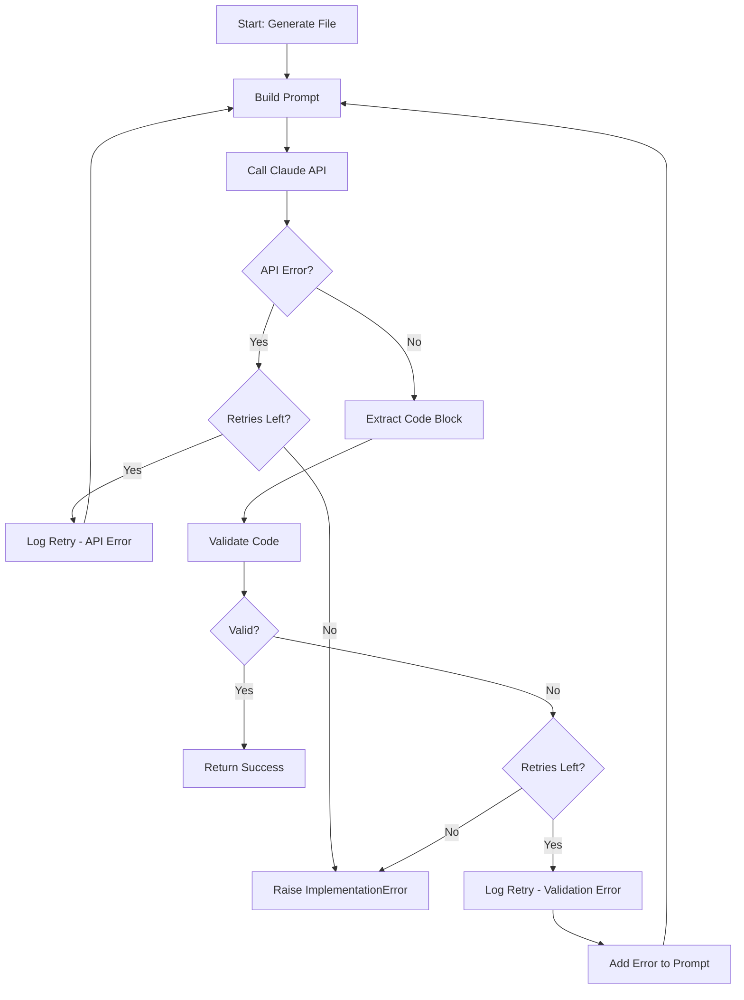

# 1309 - Bug: Implementation Workflow Retry on Validation Failure

<!-- Template Metadata
Last Updated: 2025-01-XX
Updated By: LLD generation for Issue #309
Update Reason: Initial LLD creation for retry mechanism on validation failure
-->

## 1. Context & Goal
* **Issue:** #309
* **Objective:** Add retry logic to the implementation workflow when Claude generates invalid code, instead of hard-failing immediately.
* **Status:** Approved (gemini-3-pro-preview, 2026-02-04)
* **Related Issues:** None identified

### Open Questions
*Questions that need clarification before or during implementation. Remove when resolved.*

- [x] What is the appropriate number of retries? **Resolved: 3 attempts (MAX_FILE_RETRIES = 3)**
- [x] Should retry count be configurable? **Resolved: Hardcoded constant for now, can be made configurable later**
- [ ] Should there be exponential backoff between retries for API errors?

## 2. Proposed Changes

*This section is the **source of truth** for implementation. Describe exactly what will be built.*

### 2.1 Files Changed

| File | Change Type | Description |
|------|-------------|-------------|
| `assemblyzero/workflows/testing/nodes/implement_code.py` | Modify | Add retry loop around single-file code generation with validation error feedback |

### 2.1.1 Path Validation (Mechanical - Auto-Checked)

*Issue #277: Before human or Gemini review, paths are verified programmatically.*

Mechanical validation automatically checks:
- All "Modify" files must exist in repository ✓
- All "Delete" files must exist in repository (N/A)
- All "Add" files must have existing parent directories (N/A)
- No placeholder prefixes (`src/`, `lib/`, `app/`) unless directory exists ✓

**If validation fails, the LLD is BLOCKED before reaching review.**

### 2.2 Dependencies

*No new packages required.*

```toml
# pyproject.toml additions (if any)
# None
```

### 2.3 Data Structures

```python
# Pseudocode - NOT implementation
class RetryContext(TypedDict):
    attempt: int              # Current attempt number (0-indexed)
    max_attempts: int         # Maximum retry attempts
    previous_error: str | None  # Error message from previous attempt
    prompt_history: list[str]   # Accumulated prompt modifications
```

### 2.4 Function Signatures

```python
# Signatures only - implementation in source files
MAX_FILE_RETRIES: int = 3

def generate_file_with_retry(
    filepath: str,
    base_prompt: str,
    max_retries: int = MAX_FILE_RETRIES
) -> tuple[str, bool]:
    """
    Generate code for a single file with retry on validation failure.
    
    Returns tuple of (generated_code, success_flag).
    Raises ImplementationError only after exhausting all retries.
    """
    ...

def build_retry_prompt(
    base_prompt: str,
    validation_error: str,
    attempt: int
) -> str:
    """
    Augment the base prompt with error context from previous attempt.
    
    Returns modified prompt with error feedback for Claude.
    """
    ...
```

### 2.5 Logic Flow (Pseudocode)

```
1. Enter generate_file_with_retry(filepath, base_prompt, max_retries=3)
2. FOR attempt IN range(max_retries):
   a. Build prompt (include error context if attempt > 0)
   b. Call Claude API for file generation
   c. IF API error THEN
      - Log "[RETRY {attempt+1}] API error: {error}"
      - CONTINUE to next attempt
   d. Extract code block from response
   e. Validate code (syntax, structure)
   f. IF validation fails THEN
      - Log "[RETRY {attempt+1}] Validation: {error}"
      - Store error for next attempt's prompt
      - CONTINUE to next attempt
   g. IF valid THEN
      - BREAK loop and return success
3. IF all retries exhausted THEN
   - Raise ImplementationError with final error details
4. Return (validated_code, True)
```

### 2.6 Technical Approach

* **Module:** `assemblyzero/workflows/testing/nodes/implement_code.py`
* **Pattern:** Retry with Feedback Loop
* **Key Decisions:** 
  - Include validation error in subsequent prompts to help Claude self-correct
  - Log each retry attempt for debugging/observability
  - Maintain backward compatibility - no changes to function signatures called externally

### 2.7 Architecture Decisions

*Document key architectural decisions that affect the design.*

| Decision | Options Considered | Choice | Rationale |
|----------|-------------------|--------|-----------|
| Retry scope | Per-workflow vs Per-file | Per-file | Isolates failures, allows partial progress |
| Error feedback | None vs Include in prompt | Include in prompt | Helps LLM learn from mistakes, higher success rate |
| Retry count | 1, 3, 5 | 3 | Balance between recovery chance and time cost |
| Backoff strategy | None, Fixed delay, Exponential | None (for validation), Fixed (for API) | Validation retries are fast; API errors may need brief pause |

**Architectural Constraints:**
- Must integrate with existing `call_claude_for_file()` function
- Cannot change the external interface of `implement_code` node
- Must preserve existing logging format for consistency

## 3. Requirements

*What must be true when this is done. These become acceptance criteria.*

1. **Retry on validation failure:** When `validate_code_response()` fails, the system retries up to 2 additional times (3 total attempts)
2. **Error context in retry:** Each retry prompt includes the previous validation error to guide correction
3. **Retry on API error:** Transient API errors also trigger retry with the same limits
4. **Logging:** Each retry attempt is logged with attempt number and error reason
5. **Hard-fail after exhaustion:** Only raise `ImplementationError` after all retry attempts fail
6. **Success on any attempt:** If any attempt succeeds, proceed normally without error

## 4. Alternatives Considered

| Option | Pros | Cons | Decision |
|--------|------|------|----------|
| Per-file retry with error feedback | Targeted fix, helps LLM correct mistakes, fast | Requires prompt modification | **Selected** |
| Per-file retry without feedback | Simpler implementation | LLM likely to repeat same mistake | Rejected |
| Workflow-level retry | Catches all errors | Expensive (restarts entire workflow), loses progress | Rejected |
| No retry (status quo) | No code change | Single bad response kills workflow | Rejected |

**Rationale:** Per-file retry with error feedback provides the best balance of recovery capability and efficiency. Including the error in the prompt helps Claude understand what went wrong and generate correct code on retry.

## 5. Data & Fixtures

*Per [0108-lld-pre-implementation-review.md](0108-lld-pre-implementation-review.md) - complete this section BEFORE implementation.*

### 5.1 Data Sources

| Attribute | Value |
|-----------|-------|
| Source | Claude API responses |
| Format | Text with code blocks |
| Size | Varies (typically 100-5000 tokens) |
| Refresh | Per-request |
| Copyright/License | N/A - generated content |

### 5.2 Data Pipeline

```
Prompt ──API call──► Claude Response ──extract──► Code Block ──validate──► File or Retry
```

### 5.3 Test Fixtures

| Fixture | Source | Notes |
|---------|--------|-------|
| Invalid Python code sample | Hardcoded | Unterminated string literal |
| Valid Python code sample | Hardcoded | Syntactically correct code |
| Mock API error response | Generated | Simulates transient failure |

### 5.4 Deployment Pipeline

No special deployment considerations. Standard code deployment process.

**If data source is external:** N/A - no external data sources.

## 6. Diagram

### 6.1 Mermaid Quality Gate

Before finalizing any diagram, verify in [Mermaid Live Editor](https://mermaid.live) or GitHub preview:

- [x] **Simplicity:** Similar components collapsed (per 0006 §8.1)
- [x] **No touching:** All elements have visual separation (per 0006 §8.2)
- [x] **No hidden lines:** All arrows fully visible (per 0006 §8.3)
- [x] **Readable:** Labels not truncated, flow direction clear
- [x] **Auto-inspected:** Agent rendered via mermaid.ink and viewed (per 0006 §8.5)

**Agent Auto-Inspection (MANDATORY):**

**Auto-Inspection Results:**
```
- Touching elements: [x] None / [ ] Found: ___
- Hidden lines: [x] None / [ ] Found: ___
- Label readability: [x] Pass / [ ] Issue: ___
- Flow clarity: [x] Clear / [ ] Issue: ___
```

*Reference: [0006-mermaid-diagrams.md](0006-mermaid-diagrams.md)*

### 6.2 Diagram



## 7. Security & Safety Considerations

### 7.1 Security

| Concern | Mitigation | Status |
|---------|------------|--------|
| Prompt injection via error message | Error messages are sanitized, not user-controlled | Addressed |
| API key exposure in logs | Existing logging does not include API credentials | Addressed |

### 7.2 Safety

| Concern | Mitigation | Status |
|---------|------------|--------|
| Infinite retry loop | Hard cap at MAX_FILE_RETRIES (3) | Addressed |
| Resource exhaustion from retries | Limited retries, no exponential growth | Addressed |
| Partial file writes on failure | Existing atomic write behavior preserved | Addressed |

**Fail Mode:** Fail Closed - After exhausting retries, the workflow fails with clear error message rather than proceeding with invalid code.

**Recovery Strategy:** User can re-run the workflow after reviewing the error. Error context helps identify if the issue is with the prompt, the file, or the validation logic.

## 8. Performance & Cost Considerations

### 8.1 Performance

| Metric | Budget | Approach |
|--------|--------|----------|
| Latency per file | < 30s (success) to < 90s (3 retries) | Retries add ~20s each |
| Memory | No change | No additional state stored |
| API Calls | 1-3 per file | Only retry on failure |

**Bottlenecks:** Claude API response time is the primary bottleneck. Retries increase this but only on failures.

### 8.2 Cost Analysis

| Resource | Unit Cost | Estimated Usage | Monthly Cost |
|----------|-----------|-----------------|--------------|
| Claude API calls | ~$0.01 per call | +5-10% extra calls from retries | ~$5-10 additional |

**Cost Controls:**
- [x] Retry limit prevents runaway API calls
- [x] Only retry on actual failures, not preemptively
- [x] Retry count is low (3 max)

**Worst-Case Scenario:** If every file requires 3 attempts, API costs triple. However, this indicates a deeper issue requiring investigation, not just cost control.

## 9. Legal & Compliance

| Concern | Applies? | Mitigation |
|---------|----------|------------|
| PII/Personal Data | No | No personal data involved |
| Third-Party Licenses | No | Using existing Claude API |
| Terms of Service | Yes | Retries are normal API usage, within ToS |
| Data Retention | No | No additional data retained |
| Export Controls | No | No restricted algorithms |

**Data Classification:** Internal (code generation workflow)

**Compliance Checklist:**
- [x] No PII stored without consent
- [x] All third-party licenses compatible with project license
- [x] External API usage compliant with provider ToS
- [x] Data retention policy documented

## 10. Verification & Testing

*Ref: [0005-testing-strategy-and-protocols.md](0005-testing-strategy-and-protocols.md)*

**Testing Philosophy:** Strive for 100% automated test coverage. All scenarios below can be automated with mocks.

### 10.0 Test Plan (TDD - Complete Before Implementation)

**TDD Requirement:** Tests MUST be written and failing BEFORE implementation begins.

| Test ID | Test Description | Expected Behavior | Status |
|---------|------------------|-------------------|--------|
| T010 | test_success_first_attempt | Code generates and validates on first try | RED |
| T020 | test_retry_on_validation_error | Retries when validation fails, succeeds on retry | RED |
| T030 | test_retry_on_api_error | Retries when API call fails, succeeds on retry | RED |
| T040 | test_exhaust_retries_validation | Raises ImplementationError after 3 failed validations | RED |
| T050 | test_exhaust_retries_api | Raises ImplementationError after 3 API failures | RED |
| T060 | test_error_included_in_retry_prompt | Validation error appears in retry prompt | RED |
| T070 | test_logging_on_retry | Retry attempts are logged with attempt number | RED |

**Coverage Target:** ≥95% for all new code

**TDD Checklist:**
- [ ] All tests written before implementation
- [ ] Tests currently RED (failing)
- [ ] Test IDs match scenario IDs in 10.1
- [ ] Test file created at: `tests/unit/test_implement_code_retry.py`

### 10.1 Test Scenarios

| ID | Scenario | Type | Input | Expected Output | Pass Criteria |
|----|----------|------|-------|-----------------|---------------|
| 010 | Success on first attempt | Auto | Valid code from Claude | File written, no retries | Exactly 1 API call |
| 020 | Success on second attempt after validation error | Auto | Invalid then valid code | File written after retry | Exactly 2 API calls, retry logged |
| 030 | Success on second attempt after API error | Auto | API error then valid code | File written after retry | Exactly 2 API calls |
| 040 | Failure after 3 validation errors | Auto | Always invalid code | ImplementationError raised | Exactly 3 API calls |
| 050 | Failure after 3 API errors | Auto | Always API error | ImplementationError raised | Exactly 3 API calls |
| 060 | Error context in retry prompt | Auto | Invalid code first | Prompt contains error message | Error string in prompt |
| 070 | Retry logging format | Auto | Invalid code first | Correct log format | "[RETRY N]" in log output |

### 10.2 Test Commands

```bash
# Run all automated tests
poetry run pytest tests/unit/test_implement_code_retry.py -v

# Run only fast/mocked tests (exclude live)
poetry run pytest tests/unit/test_implement_code_retry.py -v -m "not live"

# Run with coverage
poetry run pytest tests/unit/test_implement_code_retry.py -v --cov=assemblyzero.workflows.testing.nodes.implement_code
```

### 10.3 Manual Tests (Only If Unavoidable)

**N/A - All scenarios automated.** All tests use mocked Claude API responses to simulate various failure modes.

## 11. Risks & Mitigations

| Risk | Impact | Likelihood | Mitigation |
|------|--------|------------|------------|
| Claude repeats same error on retry | Med | Med | Include specific error in retry prompt |
| Retry delay slows overall workflow | Low | High | Acceptable tradeoff for recovery capability |
| Retry masks deeper prompt issues | Med | Low | Log all retry attempts for debugging |
| Test mocks don't match real API behavior | Low | Low | Use realistic mock responses |

## 12. Definition of Done

### Code
- [ ] Implementation complete and linted
- [ ] Code comments reference this LLD (#309)
- [ ] MAX_FILE_RETRIES constant documented

### Tests
- [ ] All 7 test scenarios pass
- [ ] Test coverage ≥95% for modified function

### Documentation
- [ ] LLD updated with any deviations
- [ ] Implementation Report (0103) completed
- [ ] Retry behavior documented in workflow README (if applicable)

### Review
- [ ] Code review completed
- [ ] User approval before closing issue

### 12.1 Traceability (Mechanical - Auto-Checked)

*Issue #277: Cross-references are verified programmatically.*

Files in Definition of Done:
- `assemblyzero/workflows/testing/nodes/implement_code.py` ✓ (appears in Section 2.1)
- `tests/unit/test_implement_code_retry.py` ✓ (referenced in Section 10)

**If files are missing from Section 2.1, the LLD is BLOCKED.**

---

## Reviewer Suggestions

*Non-blocking recommendations from the reviewer.*

- **Implementation Detail:** Ensure the fixed delay for API errors (e.g., `time.sleep(1)`) is mocked in unit tests to keep the test suite fast.
- **Observability:** Consider adding a metric or specific log event for "Retry Success Rate" (e.g., how often does the 2nd attempt fix the issue?) to evaluate the effectiveness of the error feedback loop in the future.

## Appendix: Review Log

*Track all review feedback with timestamps and implementation status.*

<!-- Note: Timestamps are auto-generated by the workflow. Do not fill in manually. -->

### Review Summary

<!-- Note: This table is auto-populated by the workflow with actual review dates. -->

| Review | Date | Verdict | Key Issue |
|--------|------|---------|-----------|
| - | - | - | Awaiting review |

**Final Status:** APPROVED
<!-- Note: This field is auto-updated to APPROVED by the workflow when finalized -->