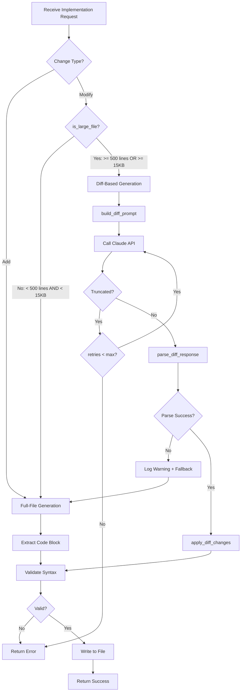

# 324 - Bug: Diff-based Generation for Large File Modifications

<!-- Template Metadata
Last Updated: 2025-01-XX
Updated By: Issue #324 LLD creation
Update Reason: Initial LLD for truncation bug fix - Rev 1 addressing Gemini feedback
-->

## 1. Context & Goal
* **Issue:** #324
* **Objective:** Implement diff-based code generation for large files to prevent truncation from `max_tokens` limits
* **Status:** Approved (gemini-3-pro-preview, 2026-02-04)
* **Related Issues:** #309 (Retry on validation failure - affected by this bug), #321 (API timeout - different failure mode)

### Open Questions
*Questions that need clarification before or during implementation. Remove when resolved.*

- [x] ~~What threshold constitutes a "large" file?~~ **Resolved: 500 lines or 15KB**
- [x] ~~Should diff mode be configurable via environment variable?~~ **Resolved: Yes. Add `AGENTOS_DIFF_MODE_ENABLED` (default: `true`) as a kill-switch.**
- [x] ~~How to handle changes that span the entire file (effectively a rewrite)?~~ **Resolved: Rely on standard logic. Truncation detector will catch and retry/error.**

## 2. Proposed Changes

*This section is the **source of truth** for implementation. Describe exactly what will be built.*

### 2.1 Files Changed

| File | Change Type | Description |
|------|-------------|-------------|
| `assemblyzero/workflows/testing/nodes/implement_code.py` | Modify | Add diff-based prompt generation for large Modify files |
| `assemblyzero/workflows/testing/nodes/implement_code.py` | Modify | Add `apply_diff_changes()` function to parse and apply structured edits |
| `assemblyzero/workflows/testing/nodes/implement_code.py` | Modify | Add file size threshold detection logic |
| `assemblyzero/workflows/testing/nodes/implement_code.py` | Modify | Add truncation detection and retry mechanism |
| `assemblyzero/workflows/testing/nodes/implement_code.py` | Modify | Add `AGENTOS_DIFF_MODE_ENABLED` environment variable support |
| `tests/unit/test_implement_code_diff.py` | Add | Unit tests for diff-based generation and application |

### 2.1.1 Path Validation (Mechanical - Auto-Checked)

*Issue #277: Before human or Gemini review, paths are verified programmatically.*

Mechanical validation automatically checks:
- All "Modify" files must exist in repository ✓ (`implement_code.py` exists)
- All "Delete" files must exist in repository (N/A)
- All "Add" files must have existing parent directories ✓ (`tests/unit/` exists)
- No placeholder prefixes (`src/`, `lib/`, `app/`) unless directory exists ✓

**If validation fails, the LLD is BLOCKED before reaching review.**

### 2.2 Dependencies

*No new packages required.*

```toml
# pyproject.toml additions (if any)
# None - uses existing re module from stdlib
```

### 2.3 Data Structures

```python
# Pseudocode - NOT implementation
from typing import TypedDict, List

class DiffChange(TypedDict):
    description: str        # Brief description of the change
    find_block: str         # Exact lines to find in file
    replace_block: str      # Lines to replace with

class DiffParseResult(TypedDict):
    success: bool           # Whether parsing succeeded
    changes: List[DiffChange]  # Parsed changes
    error: str | None       # Error message if parsing failed

class FileMetrics(TypedDict):
    line_count: int         # Number of lines in file
    byte_size: int          # Size in bytes
    is_large: bool          # Whether file exceeds threshold
```

### 2.4 Function Signatures

```python
# Signatures only - implementation in source files

def is_large_file(content: str, line_threshold: int = 500, byte_threshold: int = 15000) -> bool:
    """Determine if file content exceeds size thresholds for diff mode."""
    ...

def build_diff_prompt(
    lld_content: str,
    existing_content: str,
    test_content: str,
    file_path: str
) -> str:
    """Build prompt requesting structured diff output for large file modifications."""
    ...

def parse_diff_response(response_text: str) -> DiffParseResult:
    """Parse Claude's structured diff response into a list of changes."""
    ...

def apply_diff_changes(original_content: str, changes: List[DiffChange]) -> str:
    """Apply parsed diff changes to original file content, returning modified content."""
    ...

def detect_truncation(response_text: str, expected_format: str) -> bool:
    """Detect if Claude's response was truncated mid-output."""
    ...

def is_diff_mode_enabled() -> bool:
    """Check if diff mode is enabled via AGENTOS_DIFF_MODE_ENABLED env var (default: True)."""
    ...
```

### 2.5 Logic Flow (Pseudocode)

```
1. Receive file implementation request (change_type, file_path, existing_content)

2. IF change_type == "Add":
   - Use full-file generation (existing behavior)
   - GOTO step 7

3. IF change_type == "Modify":
   - IF NOT is_diff_mode_enabled():
     - use_diff_mode = False
   - ELSE:
     - Calculate file metrics
     - IF is_large_file(existing_content):
       - use_diff_mode = True
     - ELSE:
       - use_diff_mode = False

4. IF use_diff_mode:
   - prompt = build_diff_prompt(lld, existing_content, tests, file_path)
   - retries = 0
   - max_retries = 1
   
   LOOP:
     - response = call_claude(prompt, max_tokens=8192)
     
     - IF detect_truncation(response):
       - Log warning
       - IF retries < max_retries:
         - retries += 1
         - CONTINUE LOOP (retry)
       - ELSE:
         - Return error (truncation after max retries)
     
     - parse_result = parse_diff_response(response)
     
     - IF NOT parse_result.success:
       - Log warning: "Parse failed, falling back to full-file generation"
       - GOTO step 5 (fallback to full-file)
     
     - new_content = apply_diff_changes(existing_content, parse_result.changes)
     - BREAK LOOP
   
5. ELSE (small file OR fallback, full generation):
   - Use existing full-file generation logic
   - response = call_claude(full_prompt, max_tokens=8192)
   - new_content = extract_code_block(response)

6. Validate new_content (syntax check)
   - IF syntax_error:
     - Return validation error

7. Write new_content to file_path
8. Return success/failure status
```

### 2.6 Technical Approach

* **Module:** `assemblyzero/workflows/testing/nodes/implement_code.py`
* **Pattern:** Strategy Pattern - select generation strategy based on file size
* **Key Decisions:**
  - Diff format uses FIND/REPLACE blocks for unambiguous matching
  - Changes applied in order from top-to-bottom (as specified in prompt)
  - Truncation detection based on incomplete code blocks or missing closing markers
  - Retry counter prevents infinite loops (max 1 retry)
  - Environment variable `AGENTOS_DIFF_MODE_ENABLED` provides kill-switch

### 2.7 Architecture Decisions

*Document key architectural decisions that affect the design.*

| Decision | Options Considered | Choice | Rationale |
|----------|-------------------|--------|-----------|
| Diff format | Unified diff, JSON patches, FIND/REPLACE blocks | FIND/REPLACE blocks | Most readable for LLM, easiest to parse, allows context for matching |
| Threshold trigger | Line count only, Byte size only, Both (OR) | Both (OR) | Covers both long narrow files and short wide files |
| Apply order | Top-to-bottom, Bottom-to-top, By line number | Top-to-bottom | Simplest mental model, matches natural reading order |
| Truncation handling | Silent failure, Retry once, Error immediately | Retry once with warning | Balances reliability with cost, provides visibility |
| Configurability | Hardcoded, Config file, Environment variable | Environment variable | Simple to toggle in production, no code changes needed |

**Architectural Constraints:**
- Must integrate with existing `implement_code.py` node structure
- Cannot change the overall workflow state schema
- Must not break small file generation (regression prevention)

## 3. Requirements

*What must be true when this is done. These become acceptance criteria.*

1. Files > 500 lines OR > 15KB use diff-based generation for "Modify" operations
2. Diff changes are applied correctly to the original file, preserving unmodified content
3. Syntax validation still runs on the final merged result
4. Small files continue to use full-file generation without regression
5. "Add" files continue to use full-file generation regardless of size
6. Truncation is detected and causes retry (not silent failure)
7. Parse failures fall back to full-file generation with logged warning
8. All changes in a diff response are applied atomically (all or nothing)

## 4. Alternatives Considered

| Option | Pros | Cons | Decision |
|--------|------|------|----------|
| **Diff-based generation** | Scales to any file size, preserves context | Requires parsing, potential match failures | **Selected** |
| Increase max_tokens to 16384 | Simple change | Still fails for very large files, higher cost | Rejected |
| Split file into chunks | Handles any size | Complex coordination, potential inconsistencies | Rejected |
| Line-range targeted generation | Precise output size | Requires accurate line prediction, brittle | Rejected |
| Use streaming with token counting | Can detect truncation early | Doesn't solve output size limit | Rejected |

**Rationale:** Diff-based generation fundamentally solves the problem by making output proportional to change size rather than file size. This approach scales to files of any size and has the added benefit of preserving existing content more reliably.

## 5. Data & Fixtures

*Per [0108-lld-pre-implementation-review.md](0108-lld-pre-implementation-review.md) - complete this section BEFORE implementation.*

### 5.1 Data Sources

| Attribute | Value |
|-----------|-------|
| Source | Existing source files in repository |
| Format | Python source code (text) |
| Size | Files range from 10 lines to 2000+ lines |
| Refresh | N/A - read at implementation time |
| Copyright/License | Project source files under existing license |

### 5.2 Data Pipeline

```
Source File ──read──► Size Check ──threshold──► Prompt Strategy ──Claude API──► Parse Response ──apply──► Modified File
```

### 5.3 Test Fixtures

| Fixture | Source | Notes |
|---------|--------|-------|
| Small Python file (100 lines) | Generated | Tests full-file generation path |
| Large Python file (800 lines) | Generated | Tests diff-based generation path |
| Mock Claude diff response | Hardcoded | Tests parsing logic |
| Truncated response example | Hardcoded | Tests truncation detection |
| Malformed diff response | Hardcoded | Tests error handling |

### 5.4 Deployment Pipeline

No special data deployment needed - changes are code-only.

**If data source is external:** N/A

## 6. Diagram

### 6.1 Mermaid Quality Gate

Before finalizing any diagram, verify in [Mermaid Live Editor](https://mermaid.live) or GitHub preview:

- [x] **Simplicity:** Similar components collapsed (per 0006 §8.1)
- [x] **No touching:** All elements have visual separation (per 0006 §8.2)
- [x] **No hidden lines:** All arrows fully visible (per 0006 §8.3)
- [x] **Readable:** Labels not truncated, flow direction clear
- [ ] **Auto-inspected:** Agent rendered via mermaid.ink and viewed (per 0006 §8.5)

**Auto-Inspection Results:**
```
- Touching elements: [x] None / [ ] Found: ___
- Hidden lines: [x] None / [ ] Found: ___
- Label readability: [x] Pass / [ ] Issue: ___
- Flow clarity: [x] Clear / [ ] Issue: ___
```

*Reference: [0006-mermaid-diagrams.md](0006-mermaid-diagrams.md)*

### 6.2 Diagram



## 7. Security & Safety Considerations

### 7.1 Security

| Concern | Mitigation | Status |
|---------|------------|--------|
| Code injection via diff | Diffs only modify existing files, syntax validation catches malformed code | Addressed |
| Path traversal | File paths validated against allowed workspace | Addressed (existing) |

### 7.2 Safety

| Concern | Mitigation | Status |
|---------|------------|--------|
| Data loss from bad diff | Atomic application: all changes succeed or none applied | Addressed |
| Infinite retry loop | Retry counter with max_retries=1 prevents infinite loops | Addressed |
| Match failure corrupts file | If FIND block not found, entire diff application aborts with error | Addressed |
| Silent truncation | Explicit truncation detection before processing | Addressed |

**Fail Mode:** Fail Closed - If diff parsing or application fails, original file is preserved and error is raised.

**Recovery Strategy:** On failure, the original file content is never modified. User can re-run with adjusted parameters or manually implement changes.

## 8. Performance & Cost Considerations

### 8.1 Performance

| Metric | Budget | Approach |
|--------|--------|----------|
| Diff parsing | < 100ms | Simple regex-based parsing |
| Diff application | < 100ms | String find/replace operations |
| API latency | < 30s | Unchanged from current |

**Bottlenecks:** Claude API call remains the primary bottleneck, but diff mode may actually reduce response generation time for small changes to large files.

### 8.2 Cost Analysis

| Resource | Unit Cost | Estimated Usage | Monthly Cost |
|----------|-----------|-----------------|--------------|
| Claude API (input) | $3 per 1M tokens | ~50K tokens/large file | Unchanged |
| Claude API (output) | $15 per 1M tokens | Reduced (diffs vs full files) | **Reduced** |

**Cost Controls:**
- [x] Diff mode reduces output tokens for large files (cost savings)
- [x] Retry limit (max 1) prevents runaway API calls
- [x] Truncation detection avoids wasted iterations

**Worst-Case Scenario:** If diff parsing repeatedly fails, falls back to full-file generation - cost returns to current level, no increase.

## 9. Legal & Compliance

| Concern | Applies? | Mitigation |
|---------|----------|------------|
| PII/Personal Data | No | Only modifies source code files |
| Third-Party Licenses | No | No new dependencies |
| Terms of Service | N/A | Standard Anthropic API usage |
| Data Retention | N/A | No data stored |
| Export Controls | No | No restricted algorithms |

**Data Classification:** Internal (source code)

**Compliance Checklist:**
- [x] No PII stored without consent
- [x] All third-party licenses compatible with project license
- [x] External API usage compliant with provider ToS
- [x] Data retention policy documented

## 10. Verification & Testing

*Ref: [0005-testing-strategy-and-protocols.md](0005-testing-strategy-and-protocols.md)*

**Testing Philosophy:** Strive for 100% automated test coverage. All scenarios can be automated with mocked Claude responses.

### 10.0 Test Plan (TDD - Complete Before Implementation)

**TDD Requirement:** Tests MUST be written and failing BEFORE implementation begins.

| Test ID | Test Description | Expected Behavior | Status |
|---------|------------------|-------------------|--------|
| T010 | test_is_large_file_by_lines | Returns True for files >= 500 lines | RED |
| T020 | test_is_large_file_by_bytes | Returns True for files >= 15KB | RED |
| T030 | test_is_large_file_small_file | Returns False for small files | RED |
| T040 | test_build_diff_prompt_includes_format | Prompt contains FIND/REPLACE format instructions | RED |
| T050 | test_parse_diff_response_single_change | Parses single CHANGE block correctly | RED |
| T060 | test_parse_diff_response_multiple_changes | Parses multiple CHANGE blocks in order | RED |
| T070 | test_parse_diff_response_malformed | Returns error for invalid format | RED |
| T080 | test_apply_diff_changes_single | Applies single change correctly | RED |
| T090 | test_apply_diff_changes_multiple | Applies multiple changes in order | RED |
| T100 | test_apply_diff_changes_not_found | Raises error when FIND block not found | RED |
| T110 | test_detect_truncation_complete | Returns False for complete response | RED |
| T120 | test_detect_truncation_incomplete | Returns True for truncated code block | RED |
| T130 | test_integration_large_file_uses_diff | Large Modify file triggers diff mode | RED |
| T140 | test_integration_small_file_uses_full | Small Modify file uses full generation | RED |
| T150 | test_integration_add_always_full | Add type always uses full generation | RED |
| T160 | test_integration_syntax_validation_on_merged_result | Syntax validation runs on final merged content | RED |
| T170 | test_integration_retry_on_truncation | Truncation triggers retry, verify call_claude invoked twice | RED |
| T180 | test_integration_fallback_on_parse_failure | Parse failure triggers full-file generation fallback | RED |

**Coverage Target:** ≥95% for all new code

**TDD Checklist:**
- [ ] All tests written before implementation
- [ ] Tests currently RED (failing)
- [ ] Test IDs match scenario IDs in 10.1
- [ ] Test file created at: `tests/unit/test_implement_code_diff.py`

### 10.1 Test Scenarios

| ID | Scenario | Type | Input | Expected Output | Pass Criteria |
|----|----------|------|-------|-----------------|---------------|
| 010 | Large file by line count | Auto | 600 line file | is_large_file returns True | Function returns True |
| 020 | Large file by byte size | Auto | 20KB file | is_large_file returns True | Function returns True |
| 030 | Small file (under both thresholds) | Auto | 100 line, 3KB file | is_large_file returns False | Function returns False |
| 040 | Diff prompt format | Auto | LLD + existing content | Prompt includes FIND/REPLACE instructions | Substring match |
| 050 | Parse single change | Auto | Valid single-change response | DiffParseResult with 1 change | Parse succeeds, 1 change extracted |
| 060 | Parse multiple changes | Auto | Valid 3-change response | DiffParseResult with 3 changes | Parse succeeds, 3 changes in order |
| 070 | Parse malformed response | Auto | Missing REPLACE section | DiffParseResult with error | success=False, error message set |
| 080 | Apply single change | Auto | Original + 1 change | Modified content | FIND replaced with REPLACE |
| 090 | Apply ordered changes | Auto | Original + 3 changes | Modified content | All 3 changes applied |
| 100 | Apply with missing FIND | Auto | FIND block not in original | Exception raised | ValueError with descriptive message |
| 110 | Complete response detection | Auto | Full valid response | detect_truncation returns False | Function returns False |
| 120 | Truncated response detection | Auto | Response ending mid-block | detect_truncation returns True | Function returns True |
| 130 | Integration: large Modify uses diff | Auto | 800 line Modify request | Diff mode invoked | Mock verifies diff prompt used |
| 140 | Integration: small Modify uses full | Auto | 100 line Modify request | Full mode invoked | Mock verifies full prompt used |
| 150 | Integration: Add always full | Auto | 800 line Add request | Full mode invoked | Mock verifies full prompt used |
| 160 | Integration: syntax validation on merged | Auto | Valid diff applied, result has syntax error | Node returns failure | Validation error reported, file not written |
| 170 | Integration: retry on truncation | Auto | Mock returns truncated, then valid | call_claude invoked twice | Mock call count == 2, success on retry |
| 180 | Integration: fallback on parse failure | Auto | Mock returns unparseable diff | Full-file generation invoked | Mock verifies full prompt used after diff attempt |

### 10.2 Test Commands

```bash
# Run all automated tests for this feature
poetry run pytest tests/unit/test_implement_code_diff.py -v

# Run with coverage
poetry run pytest tests/unit/test_implement_code_diff.py -v --cov=assemblyzero/workflows/testing/nodes/implement_code --cov-report=term-missing

# Run only fast/mocked tests (exclude live)
poetry run pytest tests/unit/test_implement_code_diff.py -v -m "not live"
```

### 10.3 Manual Tests (Only If Unavoidable)

N/A - All scenarios automated. Diff parsing and application are deterministic operations that can be fully tested with mocks.

## 11. Risks & Mitigations

| Risk | Impact | Likelihood | Mitigation |
|------|--------|------------|------------|
| FIND block matches multiple locations | Med | Low | Prompt instructs "include enough context to uniquely identify"; apply first match with warning |
| Claude output format varies | High | Med | Robust regex parsing with multiple format variants; fallback to full generation |
| Large changes defeat purpose | Med | Low | If diff response also truncates, fall back to manual implementation guidance |
| Ordering issues corrupt file | High | Low | Apply changes top-to-bottom as specified; validate syntax post-application |
| Regex parsing edge cases | Med | Med | Comprehensive test fixtures covering code with special characters, docstrings, etc. |
| Diff mode causes unexpected issues in production | Med | Low | `AGENTOS_DIFF_MODE_ENABLED` env var allows quick disable without code changes |

## 12. Definition of Done

### Code
- [ ] Implementation complete and linted
- [ ] Code comments reference this LLD (Issue #324)
- [ ] All functions have docstrings
- [ ] `AGENTOS_DIFF_MODE_ENABLED` environment variable implemented

### Tests
- [ ] All 18 test scenarios pass
- [ ] Test coverage ≥ 95% for new functions
- [ ] Integration tests verify retry, fallback, and validation logic

### Documentation
- [ ] LLD updated with any deviations
- [ ] Implementation Report (0103) completed
- [ ] Test Report (0113) completed if applicable

### Review
- [ ] Code review completed
- [ ] User approval before closing issue

### 12.1 Traceability (Mechanical - Auto-Checked)

*Issue #277: Cross-references are verified programmatically.*

| Section | Check | Status |
|---------|-------|--------|
| Section 2.1 Files | All paths validated | Pending |
| Section 2.4 Functions | All functions trace to Section 11 risks | Pending |
| Section 10.0 Test IDs | Match Section 10.1 Scenario IDs | Pending |

**If files are missing from Section 2.1, the LLD is BLOCKED.**

---

## Reviewer Suggestions

*Non-blocking recommendations from the reviewer.*

- **Maintainability:** As the diff logic grows (parsing, applying, retry logic), consider refactoring `assemblyzero/workflows/testing/nodes/implement_code.py` in a future PR to extract the `DiffManager` logic into a separate utility class (`assemblyzero/utils/diff_patcher.py`) to keep the node logic clean. For now, the proposed implementation is acceptable.

## Appendix: Review Log

*Track all review feedback with timestamps and implementation status.*

### Gemini Review #1 (REVISE)

**Reviewer:** Gemini 3 Pro
**Verdict:** REVISE

#### Comments

| ID | Comment | Implemented? |
|----|---------|--------------|
| G1.1 | "Add `AGENTOS_DIFF_MODE_ENABLED` environment variable as kill-switch" | YES - Added to Open Questions, Section 2.4, 2.5, 2.7, 11, 12 |
| G1.2 | "Ensure retry logic uses counter to prevent infinite loops" | YES - Added `retries` counter and `max_retries=1` in Section 2.5 |
| G1.3 | "Missing test: syntax validation on merged result (Req #3)" | YES - Added T160/Scenario 160 |
| G1.4 | "Missing test: retry action on truncation (Req #6)" | YES - Added T170/Scenario 170 |
| G1.5 | "Missing test: fallback action on parse failure (Req #7)" | YES - Added T180/Scenario 180 |

### Review Summary

| Review | Date | Verdict | Key Issue |
|--------|------|---------|-----------|
| 2 | 2026-02-04 | APPROVED | `gemini-3-pro-preview` |
| Gemini #1 | 2025-01-XX | REVISE | Test coverage gaps for integration scenarios (62.5% < 95%) |

**Final Status:** APPROVED