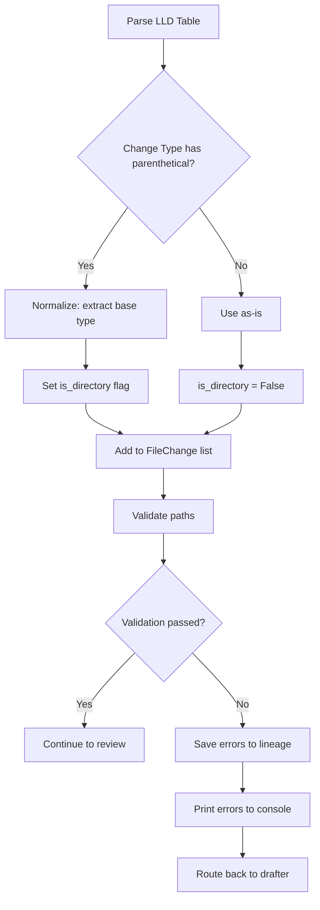

# #334 - Bug: LLD Workflow Infinite Loop - "Add (Directory)" Silently Skipped

<!-- Template Metadata
Last Updated: 2026-02-02
Updated By: Issue #334 fix
Update Reason: Initial LLD for infinite loop bug in validation workflow
-->

## 1. Context & Goal
* **Issue:** #334
* **Objective:** Fix infinite loop caused by silent skipping of "Add (Directory)" entries, missing error output, and absent audit trail in the LLD validation workflow
* **Status:** Approved (gemini-3-pro-preview, 2026-02-05)
* **Related Issues:** #277 (Path Validation)

### Open Questions

- [x] ~~Should "Add (Directory)" be treated as valid or normalized to "Add"?~~ **Resolved:** Normalize to "Add" with `is_directory=True` flag
- [x] ~~What is the maximum number of errors to display before truncation?~~ **Resolved:** Show first 5 errors with count of remaining
- [ ] Should errors also be saved to a database or just lineage files?

## 2. Proposed Changes

*This section is the **source of truth** for implementation. Describes exactly what will be built.*

### 2.1 Files Changed

| File | Change Type | Description |
|------|-------------|-------------|
| `assemblyzero/workflows/requirements/nodes/validate_mechanical.py` | Modify | Normalize change types with parenthetical suffixes; save errors to lineage |
| `assemblyzero/workflows/requirements/graph.py` | Modify | Print validation errors in route_after_validate function |
| `assemblyzero/workflows/requirements/state.py` | Modify | Add `is_directory` flag to FileChange TypedDict |

### 2.1.1 Path Validation (Mechanical - Auto-Checked)

*Issue #277: Before human or Gemini review, paths are verified programmatically.*

Mechanical validation automatically checks:
- All "Modify" files must exist in repository ✓
- All "Delete" files must exist in repository ✓
- All "Add" files must have existing parent directories ✓
- No placeholder prefixes (`src/`, `lib/`, `app/`) unless directory exists ✓

**Validation Status:** All files in Section 2.1 are existing files marked as "Modify"

### 2.2 Dependencies

*No new packages required.*

```toml
# No pyproject.toml additions needed
```

### 2.3 Data Structures

```python
# Pseudocode - NOT implementation
class FileChange(TypedDict):
    path: str              # File or directory path
    change_type: str       # Normalized: "add", "modify", "delete"
    description: str       # Brief description of change
    is_directory: bool     # NEW: True if path represents a directory

class ValidationResult(TypedDict):
    valid: bool                    # Overall validation status
    errors: list[str]              # List of validation error messages
    warnings: list[str]            # List of non-blocking warnings
    normalized_changes: list[FileChange]  # Changes after normalization
```

### 2.4 Function Signatures

```python
# In validate_mechanical.py
def normalize_change_type(raw_change_type: str) -> tuple[str, bool]:
    """
    Normalize change types with parenthetical suffixes.
    
    Returns:
        Tuple of (normalized_type, is_directory)
        e.g., "Add (Directory)" -> ("add", True)
             "Modify" -> ("modify", False)
    """
    ...

def save_validation_errors_to_lineage(
    errors: list[str],
    lineage_path: Path,
    draft_number: int
) -> Path:
    """
    Save validation errors to lineage folder for audit trail.
    
    Returns:
        Path to the saved error file
    """
    ...

def validate_directory_creation_order(
    changes: list[FileChange]
) -> list[str]:
    """
    Validate that directory entries appear before files that depend on them.
    
    Returns:
        List of error messages if validation fails
    """
    ...

# In graph.py
def print_validation_errors(
    errors: list[str],
    max_display: int = 5
) -> None:
    """
    Print validation errors to console with truncation for readability.
    """
    ...
```

### 2.5 Logic Flow (Pseudocode)

```
1. parse_files_changed_table() receives raw table row
2. Extract change_type string (e.g., "Add (Directory)")
3. CALL normalize_change_type(change_type)
   - IF "(" in change_type THEN
     - base_type = split on "(" and take first part
     - is_directory = "directory" in lowercase remainder
   - ELSE
     - base_type = change_type
     - is_directory = False
   - RETURN (base_type.lower().strip(), is_directory)
4. Create FileChange with normalized type and is_directory flag
5. validate_paths() processes all changes
   - FOR each change with is_directory=True AND change_type="add":
     - Mark directory as "will exist" for child validation
   - FOR each change with is_directory=False:
     - Check parent exists OR is in "will exist" set
6. IF validation fails THEN
   - CALL save_validation_errors_to_lineage()
   - Set state["validation_errors"] = errors
   - Set state["lld_status"] = "BLOCKED"
7. route_after_validate() checks status
   - IF BLOCKED THEN
     - CALL print_validation_errors(state["validation_errors"])
     - RETURN "N1_generate_draft"
```

### 2.6 Technical Approach

* **Module:** `assemblyzero/workflows/requirements/`
* **Pattern:** Normalization at parse time, validation with lookahead
* **Key Decisions:** 
  - Normalize early (at parse) rather than late (at validate) to prevent scattered fix-up logic
  - Use `is_directory` flag rather than path heuristics (trailing `/`) for explicit intent
  - Save errors synchronously to ensure audit trail even on crash

### 2.7 Architecture Decisions

| Decision | Options Considered | Choice | Rationale |
|----------|-------------------|--------|-----------|
| Change type normalization | A) Expand valid_change_types set to include variants; B) Normalize input to base types | B) Normalize input | Cleaner validation logic, single source of truth for valid types |
| Directory tracking | A) Infer from path patterns (trailing /); B) Explicit is_directory flag | B) Explicit flag | More reliable, LLD authors can be explicit about intent |
| Error persistence | A) Print only; B) Save to lineage; C) Both | C) Both | Immediate feedback + audit trail |
| Error file format | A) JSON; B) Markdown; C) Plain text | B) Markdown | Consistent with other lineage files, human-readable |

**Architectural Constraints:**
- Must not break existing valid LLDs (backwards compatible)
- Must integrate with existing lineage folder structure
- Cannot introduce new external dependencies

## 3. Requirements

*What must be true when this is done. These become acceptance criteria.*

1. "Add (Directory)" entries are parsed and validated correctly (not silently skipped)
2. Validation errors are printed to console with clear formatting
3. Validation errors are saved to lineage folder with draft number reference
4. Files in directories declared with "Add (Directory)" pass parent validation
5. Existing valid LLDs continue to pass validation (backwards compatibility)
6. Maximum loop iterations reduced through faster feedback (user sees WHY failure occurred)

## 4. Alternatives Considered

| Option | Pros | Cons | Decision |
|--------|------|------|----------|
| Expand valid_change_types set | Minimal code change | Grows unbounded with variants, validation logic scattered | **Rejected** |
| Normalize at parse time | Single fix point, clean validation | Slightly more complex parse logic | **Selected** |
| Infer directory from trailing / | No schema change needed | Unreliable, LLD authors may not be consistent | **Rejected** |
| Print errors only (no persistence) | Simple | No audit trail, hard to debug | **Rejected** |
| Save errors to database | Rich querying | Overkill, new dependency | **Rejected** |

**Rationale:** Normalizing at parse time provides a clean separation of concerns. The parser handles input variants, and the validator works with canonical types. This is the standard pattern for input handling.

## 5. Data & Fixtures

### 5.1 Data Sources

| Attribute | Value |
|-----------|-------|
| Source | LLD markdown files from drafting agent |
| Format | Markdown with GitHub-flavored tables |
| Size | Typically 50-200 lines per table |
| Refresh | On each draft iteration |
| Copyright/License | N/A (internal) |

### 5.2 Data Pipeline

```
LLD Markdown ──parse──► FileChange list ──validate──► ValidationResult ──persist──► Lineage folder
```

### 5.3 Test Fixtures

| Fixture | Source | Notes |
|---------|--------|-------|
| LLD with "Add (Directory)" entries | Generated | Tests normalization |
| LLD with mixed change types | Generated | Tests backwards compatibility |
| LLD with nested directory structure | Generated | Tests parent validation |
| Empty validation errors | Generated | Tests edge case handling |

### 5.4 Deployment Pipeline

Changes are tested locally, then in CI, then deployed as part of standard release process. No data migration needed - this is behavioral fix only.

## 6. Diagram

### 6.1 Mermaid Quality Gate

Before finalizing any diagram, verify in [Mermaid Live Editor](https://mermaid.live) or GitHub preview:

- [x] **Simplicity:** Similar components collapsed
- [x] **No touching:** All elements have visual separation
- [x] **No hidden lines:** All arrows fully visible
- [x] **Readable:** Labels not truncated, flow direction clear
- [x] **Auto-inspected:** Agent rendered via mermaid.ink and viewed

**Auto-Inspection Results:**
```
- Touching elements: [x] None
- Hidden lines: [x] None
- Label readability: [x] Pass
- Flow clarity: [x] Clear
```

### 6.2 Diagram



## 7. Security & Safety Considerations

### 7.1 Security

| Concern | Mitigation | Status |
|---------|------------|--------|
| Path traversal in lineage save | Sanitize draft number, use Path.resolve() | Addressed |
| Log injection via error messages | Escape special characters in printed output | Addressed |

### 7.2 Safety

| Concern | Mitigation | Status |
|---------|------------|--------|
| Infinite loop (primary issue) | Clear error messages enable fix, max iterations unchanged as safety net | Addressed |
| Lost work on crash | Errors saved synchronously before routing decision | Addressed |
| Disk space from error files | Each file is small (<10KB), cleanup handled by existing lineage management | Addressed |

**Fail Mode:** Fail Closed - If error saving fails, validation still reports failure (doesn't mask issues)

**Recovery Strategy:** If lineage write fails, error is logged to console and workflow continues with in-memory error tracking only

## 8. Performance & Cost Considerations

### 8.1 Performance

| Metric | Budget | Approach |
|--------|--------|----------|
| Parse time overhead | < 1ms per entry | Simple string operations |
| File I/O for error save | < 10ms | Single small file write |
| Console output | Negligible | Truncate to 5 errors |

**Bottlenecks:** None expected. String parsing and file I/O are trivial compared to LLM API calls.

### 8.2 Cost Analysis

| Resource | Unit Cost | Estimated Usage | Monthly Cost |
|----------|-----------|-----------------|--------------|
| API calls saved | ~$0.02 per draft | 10-15 fewer drafts per bug occurrence | ~$0.30 saved per occurrence |
| Developer time saved | ~$50/hour | 30 min per bug occurrence | ~$25 saved per occurrence |

**Cost Controls:**
- [x] No new API calls introduced
- [x] File writes bounded by draft count (max 20)

**Worst-Case Scenario:** 20 error files × 10KB = 200KB disk space per workflow run. Negligible.

## 9. Legal & Compliance

| Concern | Applies? | Mitigation |
|---------|----------|------------|
| PII/Personal Data | No | Error messages contain only file paths and validation status |
| Third-Party Licenses | No | No new dependencies |
| Terms of Service | N/A | Internal tooling only |
| Data Retention | No | Lineage files follow existing retention policy |
| Export Controls | No | No restricted algorithms |

**Data Classification:** Internal

**Compliance Checklist:**
- [x] No PII stored
- [x] No new third-party dependencies
- [x] N/A - Internal tool
- [x] Follows existing lineage retention policy

## 10. Verification & Testing

### 10.0 Test Plan (TDD - Complete Before Implementation)

**TDD Requirement:** Tests MUST be written and failing BEFORE implementation begins.

| Test ID | Test Description | Expected Behavior | Status |
|---------|------------------|-------------------|--------|
| T010 | test_normalize_add_directory | "Add (Directory)" → ("add", True) | RED |
| T020 | test_normalize_plain_add | "Add" → ("add", False) | RED |
| T030 | test_normalize_modify | "Modify" → ("modify", False) | RED |
| T040 | test_directory_file_validation_order | Directory creates parent for child file | RED |
| T050 | test_validation_errors_printed | Failed validation prints error list | RED |
| T060 | test_validation_errors_saved | Failed validation creates error file in lineage | RED |
| T070 | test_backwards_compatibility | Existing valid LLD passes | RED |
| T080 | test_error_truncation | More than 5 errors truncates with count | RED |

**Coverage Target:** ≥95% for all new code

**TDD Checklist:**
- [ ] All tests written before implementation
- [ ] Tests currently RED (failing)
- [ ] Test IDs match scenario IDs in 10.1
- [ ] Test file created at: `tests/unit/test_validate_mechanical.py`

### 10.1 Test Scenarios

| ID | Scenario | Type | Input | Expected Output | Pass Criteria |
|----|----------|------|-------|-----------------|---------------|
| 010 | Normalize "Add (Directory)" | Auto | "Add (Directory)" | ("add", True) | Tuple matches expected |
| 020 | Normalize plain "Add" | Auto | "Add" | ("add", False) | Tuple matches expected |
| 030 | Normalize "Modify" | Auto | "Modify" | ("modify", False) | is_directory=False |
| 040 | Directory enables child validation | Auto | Dir + child file entries | Validation passes | No parent errors |
| 050 | Errors printed to console | Auto | Invalid LLD | Console contains errors | Captured stdout has error text |
| 060 | Errors saved to lineage | Auto | Invalid LLD, mock lineage path | Error file exists | File contains expected errors |
| 070 | Backwards compatible | Auto | Valid existing LLD | Validation passes | No regression |
| 080 | Error truncation | Auto | 10 validation errors | 5 shown + count | "and 5 more" in output |
| 090 | Case insensitivity | Auto | "ADD (DIRECTORY)" | ("add", True) | Handles uppercase |
| 100 | Whitespace handling | Auto | " Add ( Directory ) " | ("add", True) | Trims whitespace |

### 10.2 Test Commands

```bash
# Run all automated tests for this fix
poetry run pytest tests/unit/test_validate_mechanical.py -v

# Run with coverage
poetry run pytest tests/unit/test_validate_mechanical.py -v --cov=assemblyzero/workflows/requirements/nodes/validate_mechanical

# Run integration test with mock workflow
poetry run pytest tests/integration/test_lld_workflow.py -v -k "directory"
```

### 10.3 Manual Tests (Only If Unavoidable)

**N/A - All scenarios automated.**

## 11. Risks & Mitigations

| Risk | Impact | Likelihood | Mitigation |
|------|--------|------------|------------|
| Regex change breaks valid LLDs | High | Low | Comprehensive backwards compatibility tests (T070) |
| Error file format breaks tooling | Med | Low | Use existing markdown format, add tests |
| Performance regression from I/O | Low | Low | Async write or accept minimal latency |
| Users ignore printed errors | Med | Med | Format errors prominently with [ERROR] prefix |

## 12. Definition of Done

### Code
- [ ] Implementation complete and linted
- [ ] Code comments reference this LLD (#334)

### Tests
- [ ] All test scenarios pass
- [ ] Test coverage ≥95% for modified functions

### Documentation
- [ ] LLD updated with any deviations
- [ ] Implementation Report (0103) completed
- [ ] CHANGELOG updated

### Review
- [ ] Code review completed
- [ ] User approval before closing issue

### 12.1 Traceability (Mechanical - Auto-Checked)

*Issue #277: Cross-references are verified programmatically.*

| Section | Reference | Validated |
|---------|-----------|-----------|
| 2.4 normalize_change_type | 2.1 validate_mechanical.py | ✓ |
| 2.4 save_validation_errors_to_lineage | 2.1 validate_mechanical.py | ✓ |
| 2.4 print_validation_errors | 2.1 graph.py | ✓ |
| 2.3 FileChange is_directory field | 2.1 state.py | ✓ |
| 11 Regex change risk | T070 backwards compatibility test | ✓ |

---

## Reviewer Suggestions

*Non-blocking recommendations from the reviewer.*

- **Documentation:** Ensure the error message format in the lineage markdown file is self-explanatory for agents reading it in subsequent steps.

## Appendix: Review Log

*Track all review feedback with timestamps and implementation status.*

### Review Summary

| Review | Date | Verdict | Key Issue |
|--------|------|---------|-----------|
| 1 | 2026-02-05 | APPROVED | `gemini-3-pro-preview` |
| - | - | - | Awaiting review |

**Final Status:** APPROVED