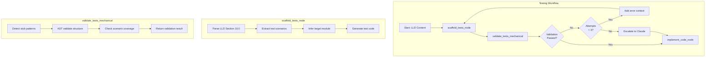

# Issue #335 - Bug: Scaffold Node Generates Stub Tests Instead of Real TDD Tests

<!-- Template Metadata
Last Updated: 2025-01-XX
Updated By: Issue #335 implementation
Update Reason: Initial LLD creation for scaffold test generation bug fix
-->

## 1. Context & Goal
* **Issue:** #335
* **Objective:** Fix scaffold node to generate real executable TDD tests from LLD specifications instead of placeholder stubs
* **Status:** Approved (gemini-3-pro-preview, 2026-02-05)
* **Related Issues:** #334 (blocked by this issue)

### Open Questions

- [x] Should we support multiple LLD test table formats or enforce a canonical format? **Decision: Enforce canonical format from template Section 10.0**
- [ ] What is the maximum test complexity the scaffold should handle before deferring to Claude?
- [ ] Should generated tests include docstrings referencing requirement IDs?

## 2. Proposed Changes

*This section is the **source of truth** for implementation. Describe exactly what will be built.*

### 2.1 Files Changed

| File | Change Type | Description |
|------|-------------|-------------|
| `assemblyzero/workflows/testing/nodes/scaffold_tests.py` | Modify | Parse LLD Section 10 and generate real test code |
| `assemblyzero/workflows/testing/nodes/validate_tests_mechanical.py` | Add | New node to mechanically validate generated tests |
| `assemblyzero/workflows/testing/graph.py` | Modify | Add validation node to graph after scaffold |
| `assemblyzero/workflows/testing/state.py` | Modify | Add validation error fields to state |
| `tests/unit/test_scaffold_tests.py` | Add | Unit tests for scaffold functionality |
| `tests/unit/test_validate_tests_mechanical.py` | Add | Unit tests for mechanical validation |

### 2.1.1 Path Validation (Mechanical - Auto-Checked)

*Issue #277: Before human or Gemini review, paths are verified programmatically.*

Mechanical validation automatically checks:
- All "Modify" files must exist in repository ✓
- All "Delete" files must exist in repository ✓
- All "Add" files must have existing parent directories ✓
- No placeholder prefixes (`src/`, `lib/`, `app/`) unless directory exists ✓

**If validation fails, the LLD is BLOCKED before reaching review.**

### 2.2 Dependencies

```toml
# pyproject.toml additions (if any)
# No new dependencies required - uses existing ast, re modules
```

### 2.3 Data Structures

```python
# Pseudocode - NOT implementation
class TestScenario(TypedDict):
    test_id: str           # e.g., "T010"
    test_name: str         # e.g., "test_normalize_add_directory"
    description: str       # Full description from LLD
    input_values: str      # Raw input specification
    expected_output: str   # Expected result
    requirement_id: str    # e.g., "R010" - linked requirement

class ParsedLLDTests(TypedDict):
    module_path: str           # Target module being tested
    scenarios: list[TestScenario]
    imports_needed: list[str]  # Detected imports

class TestValidationResult(TypedDict):
    is_valid: bool
    errors: list[str]          # Blocking errors
    warnings: list[str]        # Non-blocking issues
    stub_count: int            # Number of stub tests detected
    real_test_count: int       # Number of real tests detected

class TestingState(TypedDict):
    # Existing fields...
    lld_content: str
    parsed_scenarios: ParsedLLDTests
    generated_tests: str
    validation_result: TestValidationResult
    scaffold_attempts: int     # Track regeneration attempts
```

### 2.4 Function Signatures

```python
# assemblyzero/workflows/testing/nodes/scaffold_tests.py

def parse_lld_test_section(lld_content: str) -> ParsedLLDTests:
    """Extract test scenarios from LLD Section 10.0 Test Plan table."""
    ...

def infer_module_path(lld_content: str) -> str:
    """Determine target module from LLD Section 2.1 Files Changed."""
    ...

def generate_test_code(scenarios: ParsedLLDTests) -> str:
    """Generate executable pytest code from parsed scenarios."""
    ...

def scaffold_tests_node(state: TestingState) -> TestingState:
    """LangGraph node: Parse LLD and generate real test code."""
    ...


# assemblyzero/workflows/testing/nodes/validate_tests_mechanical.py

def detect_stub_patterns(test_content: str) -> list[str]:
    """Find stub test patterns that indicate placeholder tests."""
    ...

def validate_test_structure(test_content: str, scenarios: list[TestScenario]) -> list[str]:
    """AST validation: verify imports, calls, and assertions exist."""
    ...

def validate_scenario_coverage(test_content: str, scenarios: list[TestScenario]) -> list[str]:
    """Ensure all LLD scenarios have corresponding test functions."""
    ...

def validate_tests_mechanical_node(state: TestingState) -> TestingState:
    """LangGraph node: Mechanical validation of generated tests."""
    ...


# assemblyzero/workflows/testing/graph.py

def should_regenerate(state: TestingState) -> str:
    """Conditional edge: return 'regenerate' or 'continue' based on validation."""
    ...
```

### 2.5 Logic Flow (Pseudocode)

```
1. scaffold_tests_node receives state with LLD content
2. Parse LLD Section 10.0 Test Plan table:
   a. Extract rows with Test ID, Description, Expected Behavior
   b. Parse input/output from Description column
   c. Link to requirement IDs if present
3. Infer target module from Section 2.1 Files Changed
4. FOR each scenario:
   a. Generate function name from test_id + description
   b. Generate import statement for target module
   c. Generate test body:
      - Setup (parse input values)
      - Execute (call target function)
      - Assert (compare with expected output)
5. Assemble complete test file with imports and fixtures
6. Pass to validate_tests_mechanical_node

7. validate_tests_mechanical_node receives generated tests:
   a. Scan for stub patterns (assert False, 'not implemented')
   b. AST parse to verify structure:
      - Has import statements
      - Each test function has >= 1 real assertion
      - Assertions reference function calls (not just literals)
   c. Verify scenario coverage (all T### IDs have tests)
8. IF validation fails AND attempts < 3:
   - Return to scaffold with error context for regeneration
   ELSE IF validation fails AND attempts >= 3:
   - Escalate to Claude for manual test generation
   ELSE:
   - Continue to implement_code node
```

### 2.6 Technical Approach

* **Module:** `assemblyzero/workflows/testing/nodes/`
* **Pattern:** LangGraph node with conditional routing
* **Key Decisions:**
  - Use regex + AST parsing (not just string matching) for reliable extraction
  - Mechanical validation catches simple errors; Claude handles complex generation
  - Maximum 3 regeneration attempts before escalation prevents infinite loops

### 2.7 Architecture Decisions

| Decision | Options Considered | Choice | Rationale |
|----------|-------------------|--------|-----------|
| Test parsing approach | Pure regex, AST only, Hybrid | Hybrid (regex for table, AST for validation) | Regex better for markdown tables; AST better for Python validation |
| Regeneration strategy | Fail immediately, Retry with context, Human escalation | Retry with context (max 3) | Balances automation with avoiding infinite loops |
| Test generation method | Template-based, Claude generation, Hybrid | Template for simple, Claude for complex | Templates are faster/cheaper for mechanical mappings |
| Validation timing | Before scaffold, After scaffold, Both | After scaffold | Can't validate tests that don't exist yet |

**Architectural Constraints:**
- Must integrate with existing LangGraph workflow structure
- Cannot break existing test scaffolding for LLDs without Section 10.0 (graceful fallback)
- Generated tests must be valid pytest syntax

## 3. Requirements

*What must be true when this is done. These become acceptance criteria.*

1. **R010:** Scaffold node parses LLD Section 10.0 Test Plan table correctly
2. **R020:** Generated tests include proper imports for target module
3. **R030:** Generated tests call actual functions (not just assert False)
4. **R040:** Generated tests include assertions comparing results to expected values
5. **R050:** Mechanical validation detects and rejects stub tests (assert False patterns)
6. **R060:** Mechanical validation uses AST to verify test structure
7. **R070:** Graph routes back to scaffold if validation fails (up to 3 attempts)
8. **R080:** All LLD test scenarios (T###) have corresponding test functions
9. **R090:** Generated tests reference requirement IDs in docstrings
10. **R100:** Graceful fallback for LLDs missing Section 10.0 (existing behavior)

## 4. Alternatives Considered

| Option | Pros | Cons | Decision |
|--------|------|------|----------|
| Always use Claude for test generation | Handles complex cases well | Expensive, slow, overkill for simple mappings | **Rejected** |
| Pure template-based generation | Fast, deterministic, cheap | Can't handle edge cases or complex logic | **Rejected** |
| Hybrid: Templates + Claude escalation | Best of both worlds | More complex implementation | **Selected** |
| Remove scaffold node entirely | Simpler architecture | Loses TDD benefits, slower iteration | **Rejected** |

**Rationale:** The hybrid approach uses fast template-based generation for straightforward test scenarios (the majority) while escalating to Claude only when mechanical generation fails validation. This optimizes for speed and cost while maintaining quality.

## 5. Data & Fixtures

### 5.1 Data Sources

| Attribute | Value |
|-----------|-------|
| Source | LLD markdown content (Section 10.0) |
| Format | Markdown table with pipe-delimited columns |
| Size | Typically 5-50 test scenarios per LLD |
| Refresh | Per-LLD, on each workflow run |
| Copyright/License | N/A - Internal project data |

### 5.2 Data Pipeline

```
LLD Markdown ──parse_lld_test_section──► ParsedLLDTests ──generate_test_code──► Python test file
                                                                                      │
                                                               validate_tests_mechanical
                                                                                      │
                                                                              TestValidationResult
```

### 5.3 Test Fixtures

| Fixture | Source | Notes |
|---------|--------|-------|
| `sample_lld_with_tests.md` | Generated | Complete LLD with Section 10.0 table |
| `sample_lld_no_section_10.md` | Generated | LLD missing test section (fallback test) |
| `expected_test_output.py` | Hardcoded | Reference for comparison |
| `stub_test_examples.py` | Hardcoded | Known-bad patterns for validation testing |

### 5.4 Deployment Pipeline

Tests run in CI. No external deployment needed - this modifies internal workflow behavior.

## 6. Diagram

### 6.1 Mermaid Quality Gate

Before finalizing any diagram, verify in [Mermaid Live Editor](https://mermaid.live) or GitHub preview:

- [x] **Simplicity:** Similar components collapsed (per 0006 §8.1)
- [x] **No touching:** All elements have visual separation (per 0006 §8.2)
- [x] **No hidden lines:** All arrows fully visible (per 0006 §8.3)
- [x] **Readable:** Labels not truncated, flow direction clear
- [ ] **Auto-inspected:** Agent rendered via mermaid.ink and viewed (per 0006 §8.5)

**Auto-Inspection Results:**
```
- Touching elements: [ ] None / [ ] Found: ___
- Hidden lines: [ ] None / [ ] Found: ___
- Label readability: [ ] Pass / [ ] Issue: ___
- Flow clarity: [ ] Clear / [ ] Issue: ___
```

### 6.2 Diagram



## 7. Security & Safety Considerations

### 7.1 Security

| Concern | Mitigation | Status |
|---------|------------|--------|
| Code injection via LLD content | AST parsing validates Python syntax; no eval() | Addressed |
| Malicious test generation | Generated code is validated before execution | Addressed |

### 7.2 Safety

| Concern | Mitigation | Status |
|---------|------------|--------|
| Infinite regeneration loop | Max 3 attempts before escalation | Addressed |
| Loss of existing tests | Only generates new tests; never deletes | Addressed |
| Invalid Python syntax | AST parsing catches syntax errors | Addressed |

**Fail Mode:** Fail Closed - If validation repeatedly fails, escalate to Claude rather than accepting bad tests

**Recovery Strategy:** On failure, preserve the last valid test content and log errors for debugging

## 8. Performance & Cost Considerations

### 8.1 Performance

| Metric | Budget | Approach |
|--------|--------|----------|
| Parse time | < 100ms | Regex + AST are fast |
| Generation time | < 500ms | Template-based generation |
| Validation time | < 200ms | Single AST pass |

**Bottlenecks:** Claude escalation is the only slow path (5-30s), but occurs rarely

### 8.2 Cost Analysis

| Resource | Unit Cost | Estimated Usage | Monthly Cost |
|----------|-----------|-----------------|--------------|
| Claude escalation | ~$0.05 per call | 5-10 calls/day (edge cases) | ~$15 |
| Compute | Negligible | All local processing | $0 |

**Cost Controls:**
- [x] Template-based generation handles 90%+ of cases without API calls
- [x] Max 3 regeneration attempts prevents runaway costs
- [x] Escalation is last resort, not default

**Worst-Case Scenario:** If every test generation requires Claude escalation (unlikely), cost would be ~$150/month. Still acceptable.

## 9. Legal & Compliance

| Concern | Applies? | Mitigation |
|---------|----------|------------|
| PII/Personal Data | No | Generated tests contain no PII |
| Third-Party Licenses | No | Uses only internal code and stdlib |
| Terms of Service | No | No external APIs for core functionality |
| Data Retention | N/A | Tests are ephemeral workflow artifacts |
| Export Controls | No | No restricted algorithms |

**Data Classification:** Internal

**Compliance Checklist:**
- [x] No PII stored without consent
- [x] All third-party licenses compatible with project license
- [x] External API usage compliant with provider ToS
- [x] Data retention policy documented

## 10. Verification & Testing

### 10.0 Test Plan (TDD - Complete Before Implementation)

**TDD Requirement:** Tests MUST be written and failing BEFORE implementation begins.

| Test ID | Test Description | Expected Behavior | Req ID | Status |
|---------|------------------|-------------------|--------|--------|
| T010 | test_parse_lld_test_section_basic | Extracts scenarios from valid Section 10.0 table | R010 | RED |
| T020 | test_parse_lld_test_section_missing | Returns empty list for LLD without Section 10.0 | R100 | RED |
| T030 | test_infer_module_path | Extracts module from Section 2.1 | R020 | RED |
| T040 | test_generate_test_code_simple | Generates valid pytest for simple scenario | R030, R040 | RED |
| T050 | test_generate_test_code_with_docstring | Includes requirement ID in docstring | R090 | RED |
| T060 | test_detect_stub_patterns_assert_false | Detects `assert False` pattern | R050 | RED |
| T070 | test_detect_stub_patterns_not_implemented | Detects `not implemented` in message | R050 | RED |
| T080 | test_validate_test_structure_missing_import | Rejects tests without imports | R060 | RED |
| T090 | test_validate_test_structure_no_assertion | Rejects tests without real assertions | R060 | RED |
| T100 | test_validate_scenario_coverage_all_present | Passes when all scenarios covered | R080 | RED |
| T110 | test_validate_scenario_coverage_missing | Fails when scenario missing | R080 | RED |
| T120 | test_scaffold_node_integration | Full node produces valid tests | R010-R090 | RED |
| T130 | test_validation_node_rejects_stubs | Validation node returns errors for stubs | R050, R070 | RED |
| T140 | test_graph_regeneration_loop | Graph re-routes on validation failure | R070 | RED |
| T150 | test_graph_escalation_after_max_attempts | Escalates to Claude after 3 failures | R070 | RED |

**Coverage Target:** ≥95% for all new code

**TDD Checklist:**
- [ ] All tests written before implementation
- [ ] Tests currently RED (failing)
- [ ] Test IDs match scenario IDs in 10.1
- [ ] Test file created at: `tests/unit/test_scaffold_tests.py`, `tests/unit/test_validate_tests_mechanical.py`

### 10.1 Test Scenarios

| ID | Scenario | Type | Input | Expected Output | Pass Criteria |
|----|----------|------|-------|-----------------|---------------|
| 010 | Parse valid Section 10.0 | Auto | LLD with test table | List of TestScenario | 3 scenarios extracted |
| 020 | Parse missing Section 10.0 | Auto | LLD without section | Empty list | No errors, empty result |
| 030 | Infer module from Files Changed | Auto | LLD with Section 2.1 | Module path string | Correct path extracted |
| 040 | Generate simple test | Auto | Single TestScenario | Python test code | Valid pytest syntax |
| 050 | Generate test with docstring | Auto | Scenario with req ID | Test with docstring | Docstring contains R### |
| 060 | Detect assert False stub | Auto | `assert False, 'stub'` | Error list | 1 error detected |
| 070 | Detect not implemented stub | Auto | `assert False, 'TDD RED'` | Error list | 1 error detected |
| 080 | Reject missing imports | Auto | Test without imports | Validation errors | Import error found |
| 090 | Reject no assertions | Auto | Test with only pass | Validation errors | Assertion error found |
| 100 | All scenarios covered | Auto | Tests matching all IDs | Empty error list | Validation passes |
| 110 | Missing scenario coverage | Auto | Tests missing T020 | Error list | Coverage error found |
| 120 | Full scaffold integration | Auto | Complete LLD | Valid test file | All scenarios have tests |
| 130 | Validation rejects stubs | Auto | Stub test content | TestValidationResult | is_valid = False |
| 140 | Graph regeneration | Auto | Failed validation state | Updated state | scaffold_attempts incremented |
| 150 | Graph escalation | Auto | State with attempts=3 | Escalation triggered | Claude node called |

### 10.2 Test Commands

```bash
# Run all automated tests
poetry run pytest tests/unit/test_scaffold_tests.py tests/unit/test_validate_tests_mechanical.py -v

# Run only fast/mocked tests (exclude live)
poetry run pytest tests/unit/test_scaffold_tests.py -v -m "not live"

# Run with coverage
poetry run pytest tests/unit/test_scaffold_tests.py tests/unit/test_validate_tests_mechanical.py -v --cov=assemblyzero/workflows/testing/nodes --cov-report=term-missing
```

### 10.3 Manual Tests (Only If Unavoidable)

N/A - All scenarios automated.

## 11. Risks & Mitigations

| Risk | Impact | Likelihood | Mitigation |
|------|--------|------------|------------|
| LLD format variations break parsing | High | Medium | Strict format validation + graceful fallback |
| Complex test logic exceeds template capability | Medium | Medium | Claude escalation path |
| AST parsing fails on edge cases | Medium | Low | Catch exceptions, escalate to Claude |
| Infinite loop if validation always fails | High | Low | Max 3 attempts, then escalate |
| Generated tests have wrong imports | Medium | Medium | Infer imports from Section 2.1 |

## 12. Definition of Done

### Code
- [ ] Implementation complete and linted
- [ ] Code comments reference this LLD

### Tests
- [ ] All test scenarios pass
- [ ] Test coverage ≥95% for new code

### Documentation
- [ ] LLD updated with any deviations
- [ ] Implementation Report (0103) completed
- [ ] Test Report (0113) completed if applicable

### Review
- [ ] Code review completed
- [ ] User approval before closing issue

### 12.1 Traceability (Mechanical - Auto-Checked)

*Issue #277: Cross-references are verified programmatically.*

| File in Definition of Done | Present in Section 2.1? |
|---------------------------|-------------------------|
| `scaffold_tests.py` | ✓ |
| `validate_tests_mechanical.py` | ✓ |
| `graph.py` | ✓ |
| `state.py` | ✓ |
| `test_scaffold_tests.py` | ✓ |
| `test_validate_tests_mechanical.py` | ✓ |

---

## Reviewer Suggestions

*Non-blocking recommendations from the reviewer.*

- **Handling Multiple Files:** In `infer_module_path` (Section 2.4), consider the edge case where an LLD modifies multiple source files. The current logic implies a single target module. A simple heuristic (e.g., "choose the file that isn't a test file") or generating multiple test files might be needed eventually, though for this iteration, a single inferred module is acceptable.

## Appendix: Review Log

*Track all review feedback with timestamps and implementation status.*

### Review Summary

| Review | Date | Verdict | Key Issue |
|--------|------|---------|-----------|
| 1 | 2026-02-05 | APPROVED | `gemini-3-pro-preview` |
| (pending) | (auto) | (pending) | Initial draft |

**Final Status:** APPROVED