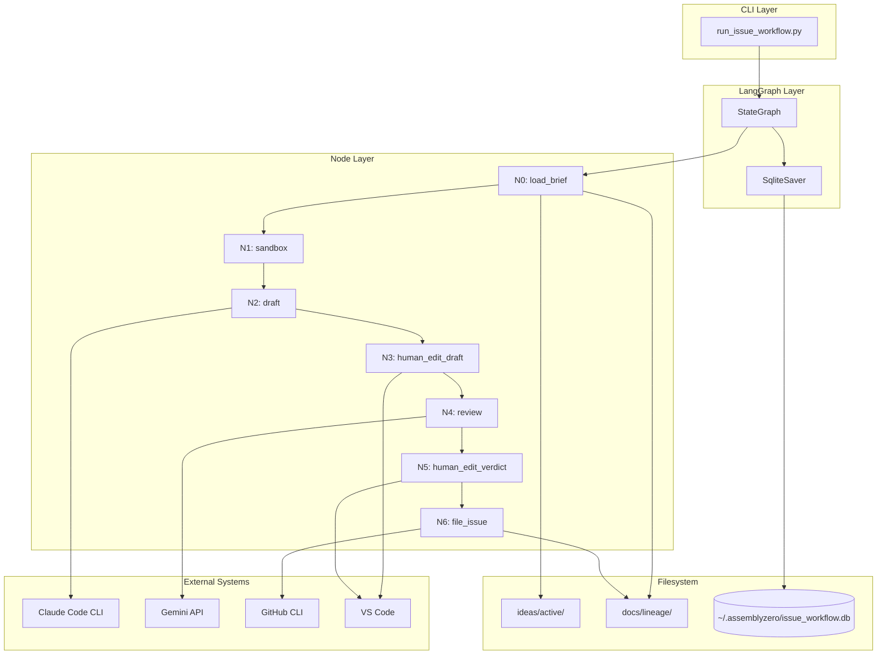
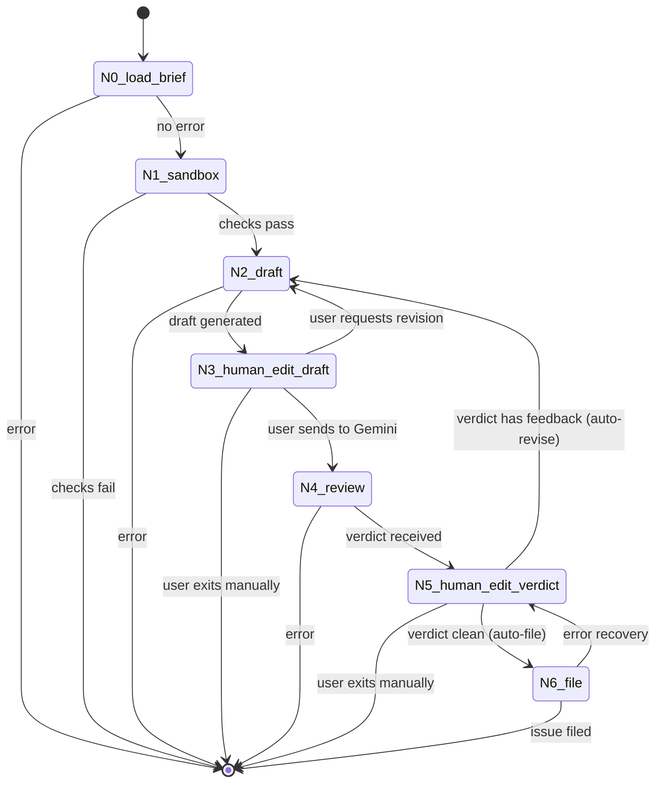
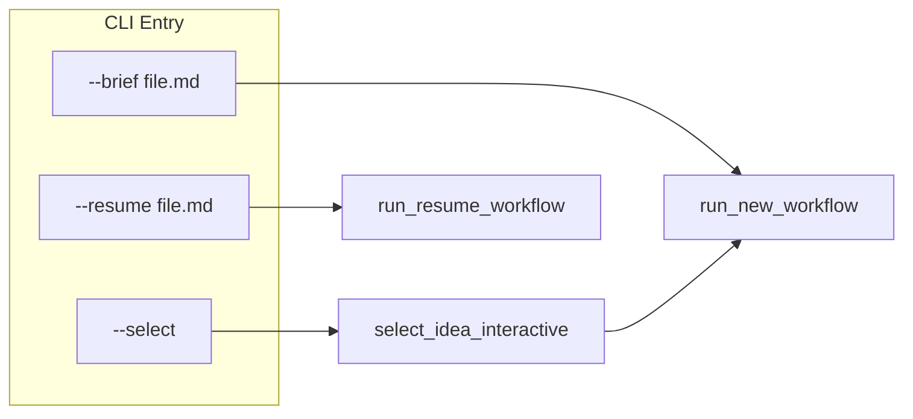
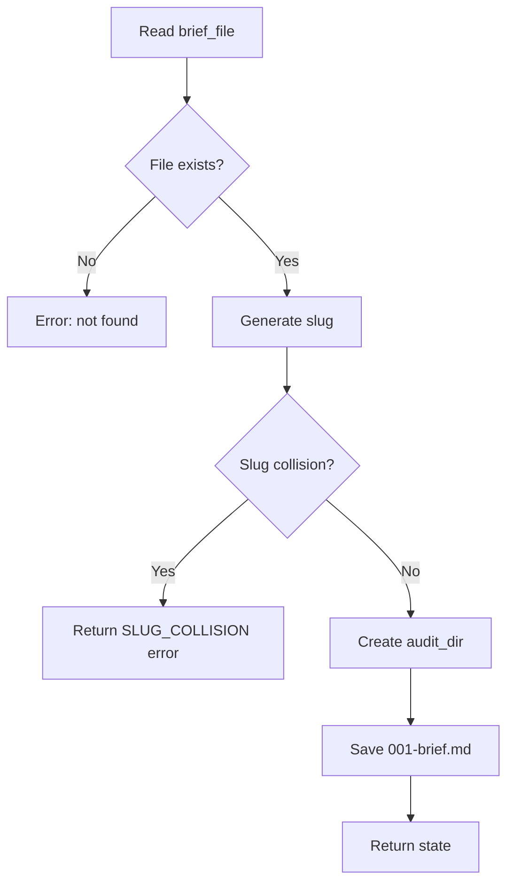
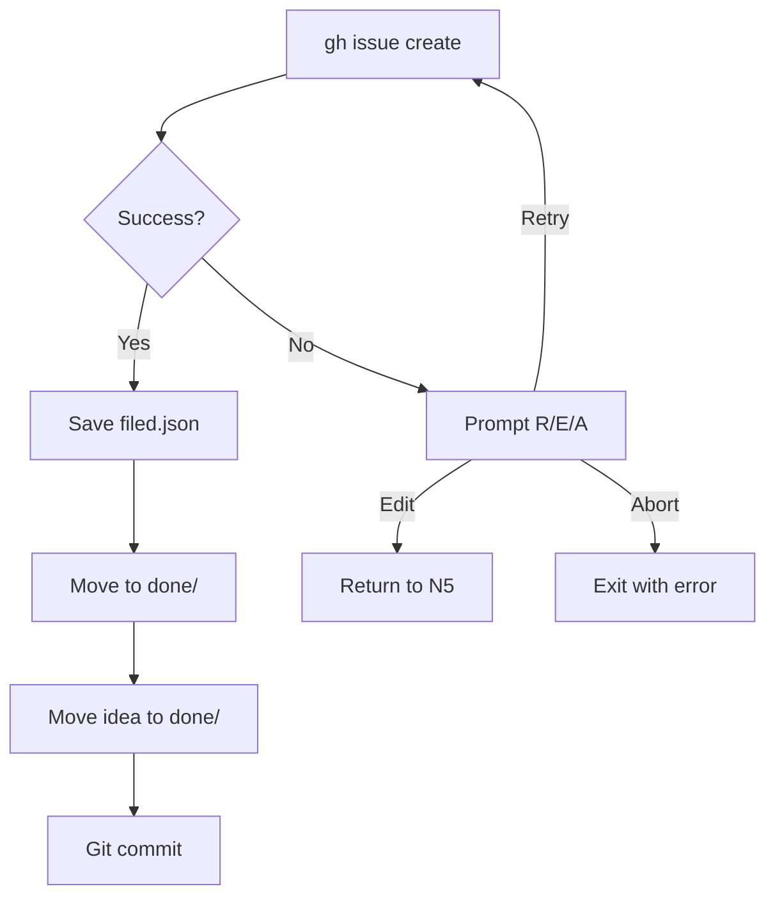

# Issue Workflow Reverse Engineering

**Created:** 2026-01-30
**Purpose:** Complete technical documentation of `run_issue_workflow.py` for adaptation to LLD workflow

---

## Table of Contents

1. [Executive Summary](#executive-summary)
2. [Architecture Overview](#architecture-overview)
3. [State Machine](#state-machine)
4. [User Experience Flow](#user-experience-flow)
5. [Node-by-Node Analysis](#node-by-node-analysis)
6. [State Schema](#state-schema)
7. [File Artifacts](#file-artifacts)
8. [External Dependencies](#external-dependencies)
9. [Key Design Decisions](#key-design-decisions)
10. [Adaptation Guide for LLD Workflow](#adaptation-guide-for-lld-workflow)

---

## Executive Summary

The Issue Workflow is a LangGraph-based state machine that transforms user ideation notes ("briefs") into filed GitHub issues through a human-in-the-loop review process. The workflow enforces governance by:

1. **Never letting raw LLM output reach GitHub** - Every draft passes through human review
2. **Using Gemini as an independent reviewer** - Claude generates, Gemini critiques
3. **Maintaining a complete audit trail** - Every artifact is saved with sequential numbering

### Core Flow (Happy Path)

```
Brief -> Claude Draft -> Human Review -> Gemini Review -> Auto-route -> File Issue
```

### Key Numbers

- **7 nodes** (N0-N6)
- **2 human gates** (N3: post-draft, N5: post-verdict)
- **2 LLM calls** (N2: Claude, N4: Gemini)
- **1 external system** (N6: GitHub via `gh`)

---

## Architecture Overview

### Component Diagram



### File Structure

```
assemblyzero/workflows/issue/
├── __init__.py
├── graph.py              # StateGraph definition with routing
├── state.py              # IssueWorkflowState TypedDict
├── audit.py              # File utilities (save, move, commit)
└── nodes/
    ├── __init__.py
    ├── load_brief.py     # N0
    ├── sandbox.py        # N1
    ├── draft.py          # N2
    ├── human_edit_draft.py   # N3
    ├── review.py         # N4
    ├── human_edit_verdict.py # N5
    └── file_issue.py     # N6
```

---

## State Machine

### Graph Definition



### Routing Functions

| Function | Source Node | Conditions | Targets |
|----------|-------------|------------|---------|
| `check_error` | N0, N1, N2, N4 | `error_message` present | END or continue |
| `route_after_draft_edit` | N3 | `next_node` value | N4, N2, or END |
| `route_after_verdict_edit` | N5 | `is_verdict_clean()` | N6, N2, or END |
| `route_after_file` | N6 | `next_node` value | N5 or END |

### Conditional Edge Definitions (from graph.py)

```python
# N3 routing: Human chooses where to go
workflow.add_conditional_edges(
    "N3_human_edit_draft",
    route_after_draft_edit,
    {
        "N4_review": "N4_review",      # Send to Gemini
        "N2_draft": "N2_draft",         # Revise with Claude
        "end": END,                     # Manual exit
    },
)

# N5 routing: Auto-route based on verdict
workflow.add_conditional_edges(
    "N5_human_edit_verdict",
    route_after_verdict_edit,
    {
        "N6_file": "N6_file",           # Clean verdict -> file
        "N2_draft": "N2_draft",         # Has feedback -> revise
        "end": END,                     # Error or manual
    },
)
```

---

## User Experience Flow

### Entry Points



### Interactive Session (Normal Mode)

```
$ python tools/run_issue_workflow.py --select

============================================================
Select Idea from ideas/active/
============================================================
  [1] my-feature-idea.md
      Implement user authentication
  [2] another-idea.md
      Add dark mode support

  [q] Quit

Select idea [1-2, q]: 1

============================================================
Issue Creation Workflow
============================================================
Brief: ideas/active/my-feature-idea.md
Slug: my-feature-idea
============================================================

>>> Executing: N0_load_brief
>>> Executing: N1_sandbox
>>> Executing: N2_draft

[14:32:15] Calling Claude to generate draft...
[14:32:45] Draft received (30s)
Draft saved to: docs/lineage/active/my-feature-idea/002-draft.md

>>> Executing: N3_human_edit_draft

>>> Iteration 1 | Draft #1
>>> Opening: docs/lineage/active/my-feature-idea/002-draft.md

[VS Code opens with --wait, user reviews and closes]

============================================================
Draft review complete.
============================================================

[G]emini - send to Gemini for review
[R]evise - send back to Claude with feedback
[S]ave and exit - pause workflow for later

Your choice [G/R/S]: G

>>> Proceeding to Gemini review (N4)...

>>> Executing: N4_review

[14:33:00] Calling Gemini for review...
[14:33:15] Gemini response received (15s)

============================================================
Gemini Verdict
============================================================
[Preview of verdict content...]
============================================================
Full verdict saved to: docs/lineage/active/my-feature-idea/003-verdict.md
============================================================

>>> Executing: N5_human_edit_verdict

>>> Iteration 1 | Draft #1 | Verdict #1
>>> Opening verdict in VS Code (non-blocking):
    docs/lineage/active/my-feature-idea/002-draft.md
    docs/lineage/active/my-feature-idea/003-verdict.md

============================================================
VERDICT PASSED with no suggestions
============================================================
>>> Auto-filing issue to GitHub (N6)...

>>> Executing: N6_file

[14:33:20] Filing issue to GitHub...
>>> Title: Implement User Authentication
>>> Labels: enhancement, security
>>> Repo: owner/repo

>>> Issue created: https://github.com/owner/repo/issues/42
>>> Audit trail moved to: docs/lineage/done/42-my-feature-idea/
>>> Idea moved to: ideas/done/42-my-feature-idea.md
>>> Committed audit trail for #42

============================================================
SUCCESS!
Issue: https://github.com/owner/repo/issues/42
============================================================
```

### Auto Mode (--auto flag)

When `--auto` is passed:
- VS Code is NOT opened during workflow (skips human review pauses)
- Automatically sends to Gemini (no G/R/S prompt at N3)
- Automatically routes based on verdict (no A/R/W/M prompt at N5)
- Opens the `done/` folder in VS Code at the END for post-hoc review

```
AGENTOS_AUTO_MODE=1
```

### Test Mode

When `AGENTOS_TEST_MODE=1`:
- Auto-selects first idea
- Auto-sends to Gemini
- Auto-approves verdicts
- Skips VS Code entirely

---

## Node-by-Node Analysis

### N0: load_brief

**Purpose:** Initialize workflow from user's ideation notes

**Inputs:**
- `state.brief_file` - Path to markdown file

**Outputs:**
- `brief_content` - File contents
- `slug` - Derived from filename (e.g., "my-feature-idea")
- `audit_dir` - Created at `docs/lineage/active/{slug}/`
- `file_counter` - Set to 1
- Counters initialized to 0

**Side Effects:**
- Creates `docs/lineage/active/{slug}/` directory
- Saves `001-brief.md` (copy of original brief)

**Error Conditions:**
- File not found
- Invalid slug
- Slug collision (handled by CLI, not node)



---

### N1: sandbox

**Purpose:** Pre-flight checks before expensive operations

**Checks:**
1. `code` (VS Code CLI) is in PATH
2. `gh` (GitHub CLI) is authenticated

**Outputs:**
- `error_message` - Empty if all checks pass

**Why This Exists:**
- Fail fast before wasting Claude API calls
- Clear error messages guide user to fix environment

---

### N2: draft

**Purpose:** Generate structured GitHub issue using Claude

**Inputs:**
- `brief_content` - Original user notes
- `current_draft` - Previous draft (if revising)
- `verdict_history` - ALL previous Gemini verdicts (cumulative)
- `user_feedback` - Human feedback (if any)

**Process:**
1. Load issue template from `docs/templates/0101-issue-template.md`
2. Build prompt with brief + template (+ feedback if revising)
3. Call Claude via `claude -p` (headless mode)
4. Strip any preamble before first `#` heading
5. Save to `NNN-draft.md`

**Key Implementation Detail - Cumulative Verdicts:**
```python
# ALL verdicts from history are included
if verdict_history:
    revision_context += "## ALL Gemini Review Feedback (CUMULATIVE)\n\n"
    for i, verdict in enumerate(verdict_history, 1):
        revision_context += f"### Gemini Review #{i}\n\n{verdict}\n\n"
```

**Claude CLI Usage:**
```python
cmd = [
    claude_path,
    "-p",                           # Headless/print mode
    "--output-format", "json",      # JSON response
    "--setting-sources", "user",    # Skip project CLAUDE.md
    "--tools", "",                  # Disable all tools
]
```

---

### N3: human_edit_draft

**Purpose:** Human gate between Claude output and Gemini input

**UX Flow:**
1. Increment `iteration_count`
2. Open VS Code with `--wait` flag (blocks until closed)
3. Display prompt: G/R/S
4. Route based on choice

**Options:**
| Key | Action | Next Node |
|-----|--------|-----------|
| G | Send to Gemini | N4_review |
| R | Revise with feedback | N2_draft (saves feedback to audit) |
| S | Save and exit | END (raises KeyboardInterrupt) |

**Critical: KeyboardInterrupt for Save:**
```python
if decision == HumanDecision.MANUAL:
    # Raise to pause workflow WITHOUT completing this node
    # Ensures resume re-runs this node
    raise KeyboardInterrupt("User chose manual handling")
```

---

### N4: review

**Purpose:** Independent Gemini review of Claude's draft

**Inputs:**
- `current_draft` - The draft to review

**Process:**
1. Load review prompt from `docs/skills/0701c-Issue-Review-Prompt.md` (HARD-CODED)
2. Combine prompt + draft
3. Call Gemini API via `GeminiClient`
4. Save verdict to `NNN-verdict.md`
5. Append to `verdict_history` (cumulative)

**Model Verification:**
```python
if result.model_verified and "pro" not in result.model_verified.lower():
    verdict_content = (
        f"WARNING: Model verification failed - {result.model_verified}\n\n"
        + verdict_content
    )
```

---

### N5: human_edit_verdict

**Purpose:** Auto-route based on verdict, with human visibility

**Auto-Routing Logic:**
```python
def is_verdict_clean(verdict_content: str) -> bool:
    """Check if Gemini verdict approves the issue."""
    # Check for explicit approval
    if "[x] **APPROVED**" not in verdict_content:
        return False
    # Check for NO revision request
    if "[x] **REVISE**" in verdict_content:
        return False
    return True
```

**Routing:**
| Verdict | Action | Next Node |
|---------|--------|-----------|
| Clean (`[x] **APPROVED**`) | Auto-file | N6_file |
| Has feedback | Auto-revise | N2_draft |

**VS Code Behavior:**
- Opens non-blocking (user can inspect but doesn't block workflow)
- In auto mode: skipped entirely

---

### N6: file_issue

**Purpose:** Create GitHub issue and finalize audit trail

**Process:**
1. Parse labels from `**Labels:**` line in draft
2. Parse title from first `#` heading
3. Ensure labels exist (create if missing)
4. Call `gh issue create`
5. Save `NNN-filed.json` metadata
6. Move `docs/lineage/active/{slug}/` to `docs/lineage/done/{issue#}-{slug}/`
7. Move `ideas/active/{slug}.md` to `ideas/done/{issue#}-{slug}.md`
8. Git commit the audit trail

**Error Recovery:**


---

## State Schema

```typescript
interface IssueWorkflowState {
    // Input
    brief_file: string;          // Path to user's ideation notes
    brief_content: string;       // Loaded brief text
    slug: string;                // Derived from filename
    source_idea: string;         // Original path in ideas/active/
    repo_root: string;           // Target repo (for cross-repo)

    // Workflow tracking
    audit_dir: string;           // docs/lineage/active/{slug}/
    file_counter: number;        // Sequential file number (001, 002...)
    iteration_count: number;     // Total loop iterations
    draft_count: number;         // Number of drafts generated
    verdict_count: number;       // Number of verdicts received

    // Current artifacts
    current_draft_path: string;  // Path to latest draft
    current_draft: string;       // Draft content
    current_verdict_path: string; // Path to latest verdict
    current_verdict: string;     // Verdict content
    verdict_history: string[];   // ALL verdicts (cumulative)
    user_feedback: string;       // Human feedback for revision

    // Routing
    next_node: string;           // Routing decision from human nodes

    // Output
    issue_number: number;        // GitHub issue number
    issue_url: string;           // GitHub issue URL

    // Error handling
    error_message: string;       // Last error
}
```

---

## File Artifacts

### Lineage Folder Structure

```
docs/lineage/active/{slug}/
├── 001-brief.md          # Copy of original ideation notes
├── 002-draft.md          # First Claude draft
├── 003-verdict.md        # First Gemini verdict
├── 004-feedback.txt      # Human feedback (if R at N3)
├── 005-draft.md          # Revised draft
├── 006-verdict.md        # Second verdict
├── 007-draft.md          # Third draft
├── 008-verdict.md        # Third verdict (approved)
└── 009-filed.json        # Filing metadata

# After filing, moved to:
docs/lineage/done/{issue#}-{slug}/
```

### filed.json Schema

```json
{
    "issue_number": 42,
    "issue_url": "https://github.com/owner/repo/issues/42",
    "title": "Implement User Authentication",
    "filed_at": "2026-01-30T14:33:20+00:00",
    "brief_file": "ideas/active/my-feature-idea.md",
    "total_iterations": 3,
    "draft_count": 3,
    "verdict_count": 3
}
```

---

## External Dependencies

### Claude Code CLI

```bash
claude -p \
    --output-format json \
    --setting-sources user \
    --tools "" \
    [--system-prompt "..."]
```

- Input via stdin (handles long prompts)
- 5 minute timeout
- Uses Max subscription (no API credits)

### Gemini API

```python
from assemblyzero.core.gemini_client import GeminiClient
from assemblyzero.core.config import GOVERNANCE_MODEL

client = GeminiClient(model=GOVERNANCE_MODEL)
result = client.invoke(
    system_instruction="...",
    content="...",
)
```

### GitHub CLI

```bash
# Check auth
gh auth status

# Get repo name
gh repo view --json nameWithOwner -q ".nameWithOwner"

# Check/create labels
gh label list --repo owner/repo
gh label create "enhancement" --repo owner/repo

# Create issue
gh issue create \
    --repo owner/repo \
    --title "Title" \
    --body-file path/to/draft.md \
    --label enhancement \
    --label security
```

### VS Code CLI

```bash
# Open with wait (blocking)
code --wait path/to/file.md

# Open multiple files
code --wait file1.md file2.md

# Open folder
code path/to/folder/

# Open with markdown preview
code file.md --command markdown.showPreviewToSide
```

---

## Key Design Decisions

### 1. Cumulative Verdict History

**Decision:** All Gemini verdicts are accumulated and sent to Claude on each revision.

**Rationale:** Prevents Claude from "forgetting" earlier feedback. Forces addressing all issues, not just the most recent.

**Implementation:**
```python
verdict_history = verdict_history + [verdict_content]  # Append, don't replace
```

### 2. Auto-Routing at N5

**Decision:** N5 automatically routes based on verdict content, no human prompt.

**Rationale:** Reduces friction in happy path. Human can still intervene by editing files.

**Trade-off:** Less control, but faster iteration.

### 3. Hard-Coded Prompt Paths

**Decision:** Review prompt path (`0701c`) is hard-coded, cannot be overridden.

**Rationale:** Security - prevents agent from substituting a permissive prompt.

### 4. KeyboardInterrupt for Save & Exit

**Decision:** "Save and exit" raises `KeyboardInterrupt` to pause without completing node.

**Rationale:** Ensures checkpoint is saved BEFORE the node, so resume re-runs the human prompt.

### 5. Separate Audit Directory per Workflow

**Decision:** Each workflow gets `docs/lineage/active/{slug}/` with sequential numbering.

**Rationale:** Complete isolation, easy to review, natural git history.

---

## Adaptation Guide for LLD Workflow

### What Changes

| Aspect | Issue Workflow | LLD Workflow |
|--------|---------------|--------------|
| Input | Brief (ideation notes) | GitHub issue |
| Output | GitHub issue | LLD file + approved status |
| Template | `0101-issue-template.md` | `0102-feature-lld-template.md` |
| Review prompt | `0701c-Issue-Review-Prompt.md` | `0702c-LLD-Review-Prompt.md` |
| Final artifact | `filed.json` | `approved.json` |
| Destination | `docs/lineage/done/{issue#}-{slug}/` | `docs/lld/active/LLD-{issue#}.md` |

### What Stays the Same

1. **Graph structure** - 7 nodes, same routing
2. **State machine** - Same transitions
3. **Checkpoint mechanism** - SQLite persistence
4. **Cumulative verdict history** - Same pattern
5. **Auto-routing at N5** - Same logic
6. **VS Code integration** - Same patterns
7. **Lineage folder** - Same numbering scheme

### Key Questions to Answer

1. **What is the "brief" equivalent?**
   - The GitHub issue body

2. **What generates the slug?**
   - Issue number: `{issue#}-lld`

3. **What template does Claude use?**
   - `docs/templates/0102-feature-lld-template.md`

4. **What prompt does Gemini use?**
   - `docs/skills/0702c-LLD-Review-Prompt.md`

5. **Where does the final LLD go?**
   - `docs/lld/active/LLD-{issue#}.md`

6. **What metadata is saved?**
   - `approved.json` with issue reference, approval timestamp

### Minimal Changes Needed

```
assemblyzero/workflows/lld/
├── __init__.py
├── graph.py              # SAME structure as issue
├── state.py              # LLDWorkflowState (minor changes)
├── audit.py              # Already exists (paths updated)
└── nodes/
    ├── __init__.py
    ├── load_issue.py     # NEW: Load from GitHub issue
    ├── sandbox.py        # SAME
    ├── draft.py          # CHANGED: Use LLD template
    ├── human_edit_draft.py   # SAME
    ├── review.py         # CHANGED: Use LLD review prompt
    ├── human_edit_verdict.py # SAME
    └── save_lld.py       # NEW: Save to docs/lld/active/
```

---

## Appendix: Complete Code Cross-Reference

| File | Lines | Description |
|------|-------|-------------|
| `run_issue_workflow.py` | 667 | CLI runner |
| `graph.py` | 250 | StateGraph definition |
| `state.py` | 108 | State TypedDict |
| `audit.py` | 421 | File utilities |
| `load_brief.py` | 163 | N0 node |
| `sandbox.py` | 105 | N1 node |
| `draft.py` | 302 | N2 node |
| `human_edit_draft.py` | 258 | N3 node |
| `review.py` | 171 | N4 node |
| `human_edit_verdict.py` | 286 | N5 node |
| `file_issue.py` | 417 | N6 node |
| **Total** | ~3148 | |
