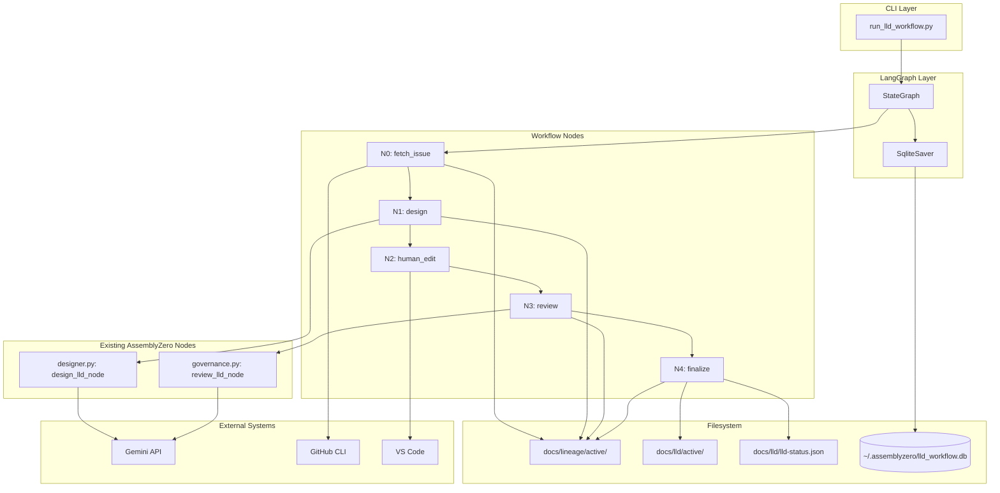
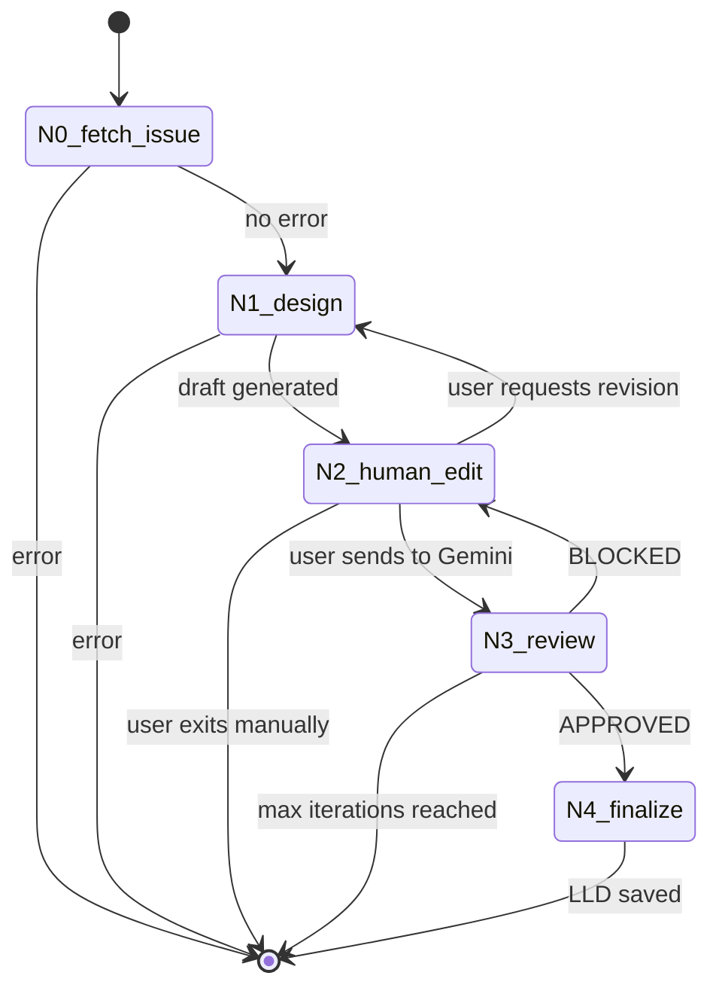
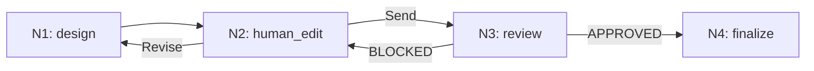
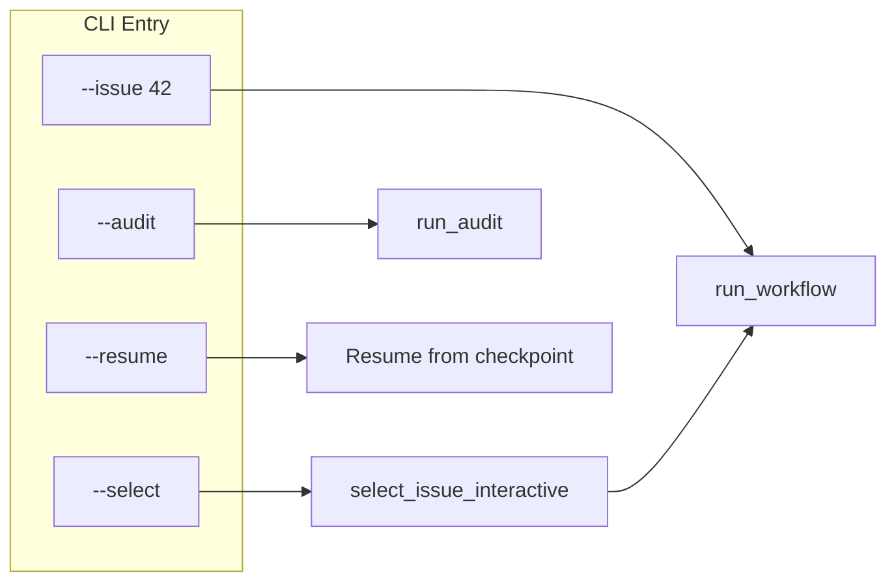
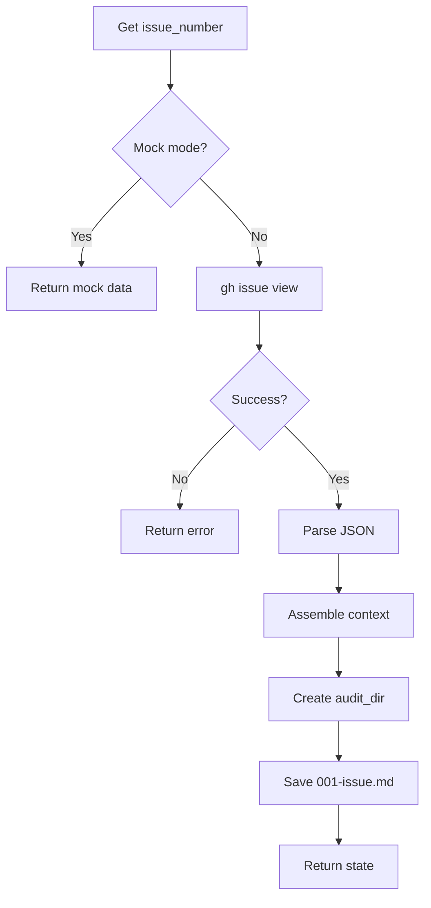

# LLD Workflow Reverse Engineering

**Created:** 2026-01-30
**Purpose:** Complete technical documentation of `run_lld_workflow.py` for understanding and maintenance

---

## Table of Contents

1. [Executive Summary](#executive-summary)
2. [Architecture Overview](#architecture-overview)
3. [State Machine](#state-machine)
4. [User Experience Flow](#user-experience-flow)
5. [Node-by-Node Analysis](#node-by-node-analysis)
6. [State Schema](#state-schema)
7. [File Artifacts](#file-artifacts)
8. [External Dependencies](#external-dependencies)
9. [Key Design Decisions](#key-design-decisions)
10. [Comparison with Issue Workflow](#comparison-with-issue-workflow)

---

## Executive Summary

The LLD Workflow is a LangGraph-based state machine that transforms GitHub issues into approved Low-Level Design documents through a human-in-the-loop review process. The workflow enforces governance by:

1. **Delegating to external nodes** - Uses existing `designer.py` and `governance.py` nodes
2. **Using Gemini as an independent reviewer** - Gemini critiques Claude-generated LLDs
3. **Maintaining a complete audit trail** - Every artifact is saved with sequential numbering
4. **Tracking LLD status** - A cache (`lld-status.json`) tracks review state across issues

### Core Flow (Happy Path)

```
GitHub Issue -> Claude Draft -> Human Review -> Gemini Review -> Save Approved LLD
```

### Key Numbers

- **5 nodes** (N0-N4)
- **1 human gate** (N2: human_edit)
- **2 LLM calls** (N1: Claude via designer.py, N3: Gemini via governance.py)
- **2 external systems** (GitHub for issue fetch, filesystem for LLD storage)

### Key Differences from Issue Workflow

| Aspect | Issue Workflow | LLD Workflow |
|--------|----------------|--------------|
| Nodes | 7 (N0-N6) | 5 (N0-N4) |
| Human gates | 2 (N3, N5) | 1 (N2) |
| Input | Brief file | GitHub issue |
| Output | GitHub issue | LLD file |
| Node architecture | Custom nodes | Delegates to existing nodes |

---

## Architecture Overview

### Component Diagram



### File Structure

```
assemblyzero/workflows/lld/
├── __init__.py
├── graph.py              # StateGraph definition with routing
├── state.py              # LLDWorkflowState TypedDict
├── audit.py              # File utilities, LLD status tracking
└── nodes.py              # All 5 node implementations + mock versions

tools/
└── run_lld_workflow.py   # CLI entry point (587 lines)

assemblyzero/nodes/
├── designer.py           # External: Claude LLD generation
└── governance.py         # External: Gemini LLD review
```

---

## State Machine

### Graph Definition



### Routing Functions

| Function | Source Node | Conditions | Targets |
|----------|-------------|------------|---------|
| `route_after_fetch` | N0 | `error_message` present | END or N1 |
| `route_after_design` | N1 | `design_status` or error | END or N2 |
| `route_after_human_edit` | N2 | `next_node` value | N3, N1, or END |
| `route_after_review` | N3 | `lld_status` (APPROVED/BLOCKED) | N4, N2, or END |

### Conditional Edge Definitions (from graph.py)

```python
# N2 routing: Human chooses where to go
workflow.add_conditional_edges(
    "N2_human_edit",
    route_after_human_edit,
    {
        "N3_review": "N3_review",      # Send to Gemini
        "N1_design": "N1_design",       # Revise with feedback
        "end": END,                     # Manual exit
    },
)

# N3 routing: Auto-route based on verdict
workflow.add_conditional_edges(
    "N3_review",
    route_after_review,
    {
        "N4_finalize": "N4_finalize",   # Approved -> save
        "N2_human_edit": "N2_human_edit", # Blocked -> revise
        "end": END,                      # Error or max iterations
    },
)
```

### The Revision Loop



Key insight: Unlike the Issue Workflow where human feedback loops back to draft, the LLD Workflow uses **auto mode revision** - when blocked, Gemini critique is automatically fed back to the designer as `user_feedback`.

---

## User Experience Flow

### Entry Points



### Interactive Session (Normal Mode)

```
$ python tools/run_lld_workflow.py --select

Fetching open GitHub issues...

============================================================
Select Issue for LLD Creation
(3 issues with approved LLDs hidden)
============================================================

  [1] #42 Implement user authentication
       [NEW]
  [2] #45 Add dark mode support
       [DRAFT - has unreviewed LLD]
  [3] #48 Refactor database layer
       [BLOCKED - needs revision]

  [q] Quit

Select issue [1-3, q]: 1

============================================================
LLD Governance Workflow - Issue #42
============================================================
Mode: INTERACTIVE
Checkpoint DB: ~/.assemblyzero/lld_workflow.db
Max iterations: 20 (recursion_limit: 200)
============================================================

[N0] Fetching issue #42...
    Title: Implement user authentication
    Loading 2 context file(s)...
    Audit dir: docs/lineage/active/42-lld

[N1] Generating LLD draft...
    Revision mode: incorporating reviewer feedback...
    Design status: DRAFTED
    Draft path: docs/llds/drafts/42-LLD.md
    Draft saved to audit: 002-draft.md

[N2] Human Edit Gate (Iteration 1/20)

    Draft location: docs/llds/drafts/42-LLD.md

    [S] Send to Gemini review
    [R] Revise (return to designer with feedback)
    [M] Manual exit

    Choice: S

[N3] Submitting to Gemini governance review...
    Verdict saved to audit: 003-verdict.md
    Status: APPROVED

[N4] Finalizing approved LLD...
    Embedded review evidence (Gemini #1, 2026-01-30)
    Saved to: docs/lld/active/LLD-042.md
    Updated lld-status.json tracking
    Metadata saved: 004-approved.json

    LLD #42 APPROVED and saved!

============================================================
SUCCESS: LLD approved and saved!
  Path: docs/lld/active/LLD-042.md
  Iterations: 1
  Drafts: 1
  Verdicts: 1
============================================================
```

### Auto Mode (--auto flag)

When `--auto` is passed:
- Skips VS Code entirely at N2
- Automatically sends to Gemini on first pass
- On BLOCKED verdict, automatically feeds Gemini critique back to designer
- Continues loop until APPROVED or max iterations

```
$ python tools/run_lld_workflow.py --issue 42 --auto

============================================================
LLD Governance Workflow - Issue #42
============================================================
Mode: AUTO (unattended)
...

[N2] Human Edit Gate (Iteration 1/20)
    Auto mode: sending to review...

[N3] Submitting to Gemini governance review...
    Status: BLOCKED

[N2] Human Edit Gate (Iteration 2/20)
    Auto mode: revision needed, returning to designer...

[N1] Generating LLD draft...
    Revision mode: incorporating reviewer feedback...
```

### Mock Mode (--mock flag)

For testing without API calls:
- Uses mock issue data
- Mock designer generates template LLD
- Mock reviewer rejects first iteration, approves second
- Tests the full state machine without external dependencies

### Max Iterations Handling

When `max_iterations` is reached:

```
============================================================
WARNING: MAXIMUM ITERATIONS REACHED (20)
============================================================

Options:
[N] Add more iterations (enter any number, e.g., 10 or 50)
[S]ave and exit - workflow state preserved for resume
[M]anual - exit for manual handling

Your choice: 10

>>> Extending limit to 30 iterations, resuming...
```

---

## Node-by-Node Analysis

### N0: fetch_issue

**Purpose:** Initialize workflow from GitHub issue

**Inputs:**
- `state.issue_number` - GitHub issue number
- `state.context_files` - Optional paths to additional context
- `state.repo_root` - Target repo (for cross-repo workflows)

**Process:**
1. Fetch issue via `gh issue view --json title,body`
2. Assemble context from `context_files` (with security validation)
3. Create audit directory at `docs/lineage/active/{issue#}-lld/`
4. Save `001-issue.md` to audit trail

**Outputs:**
- `issue_id` - Alias of issue_number (for node compatibility)
- `issue_title`, `issue_body` - Issue content
- `context_content` - Assembled context files
- `audit_dir` - Path to lineage folder
- `file_counter` - Set to 1

**Error Conditions:**
- Issue not found (404)
- Timeout fetching issue
- Invalid JSON response

**Mock Mode:**
Returns hardcoded mock issue with placeholder content.



---

### N1: design

**Purpose:** Generate LLD draft using existing designer node

**Key Design:** Delegates to `assemblyzero.nodes.designer.design_lld_node()` rather than implementing its own LLM call.

**Inputs:**
- Issue content from N0
- `user_feedback` - Gemini critique (for revision mode)
- `lld_content` - Previous draft (for revision mode)

**Process:**
1. Check mock mode -> use mock implementation
2. Build designer state with issue content + feedback
3. Call `design_lld_node(designer_state)`
4. Save draft to audit trail

**Revision Mode:**
When `user_feedback` contains previous Gemini critique:
```python
designer_state = {
    "issue_id": ...,
    "issue_title": ...,
    "issue_body": ...,
    "user_feedback": state.get("user_feedback", ""),  # Gemini critique
    "lld_content": state.get("lld_content", ""),      # Previous draft
}
```

**Outputs:**
- `design_status` - "DRAFTED" or "FAILED"
- `lld_content` - Generated LLD content
- `lld_draft_path` - Path to draft file
- `draft_count` - Incremented
- Clears `gemini_critique` and `user_feedback` after use

**Mock Mode:**
Returns template LLD with placeholder content.

---

### N2: human_edit

**Purpose:** Human gate for draft review

**Key Difference from Issue Workflow:**
- **Single human gate** (vs two in Issue Workflow)
- Handles BOTH post-draft and post-verdict review

**UX Flow:**
1. Increment `iteration_count`
2. Display critique if available (from previous BLOCKED verdict)
3. Show draft location
4. Prompt: S/R/M
5. Route based on choice

**Options:**
| Key | Action | State Update | Next Node |
|-----|--------|--------------|-----------|
| S | Send to Gemini | `next_node = "N3_review"` | N3_review |
| R | Revise with feedback | `next_node = "N1_design"`, saves feedback | N1_design |
| M | Manual exit | `error_message = "MANUAL:..."` | END |

**Auto Mode Behavior:**
```python
if state.get("auto_mode"):
    gemini_critique = state.get("gemini_critique", "")

    if gemini_critique:
        # Previous review was BLOCKED - auto-revise
        return {
            "next_node": "N1_design",
            "user_feedback": f"Gemini review feedback:\n{gemini_critique}",
        }
    else:
        # First iteration - auto-send to review
        return {
            "next_node": "N3_review",
        }
```

**Reading Updated Content:**
Before sending to review, reads LLD from disk to capture any human edits:
```python
if lld_draft_path and Path(lld_draft_path).exists():
    lld_content = Path(lld_draft_path).read_text(encoding="utf-8")
```

---

### N3: review

**Purpose:** Gemini governance review of LLD

**Key Design:** Delegates to `assemblyzero.nodes.governance.review_lld_node()`.

**Process:**
1. Check mock mode -> use mock implementation
2. Call `review_lld_node(governance_state)`
3. Save verdict to audit trail
4. Check max iterations
5. Route based on verdict

**Outputs:**
- `lld_status` - "APPROVED" or "BLOCKED"
- `gemini_critique` - Gemini's feedback
- `verdict_count` - Incremented
- `next_node` - Routing decision

**Max Iterations Check:**
```python
if lld_status != "APPROVED" and iteration >= max_iterations:
    return {
        "error_message": f"MAX_ITERATIONS_REACHED:{max_iterations}",
        "next_node": "END",
    }
```

**Mock Mode Behavior:**
- Iteration 1: Returns BLOCKED with mock feedback
- Iteration 2+: Returns APPROVED
- At max iterations: Returns BLOCKED with error

---

### N4: finalize

**Purpose:** Save approved LLD and update tracking

**Process:**
1. Read LLD content (from state or disk fallback)
2. Embed review evidence in LLD content:
   - Update `* **Status:**` field
   - Add Review Summary table
   - Add `**Final Status:**` marker
3. Save to `docs/lld/active/LLD-{issue#:03d}.md`
4. Update `lld-status.json` cache
5. Save `NNN-approved.json` metadata

**Review Evidence Embedding:**
```markdown
* **Status:** Approved (Gemini Review, 2026-01-30)

### Review Summary

| Review | Date | Verdict |
|--------|------|---------|
| Gemini #1 | 2026-01-30 | APPROVED |

**Final Status:** APPROVED
```

**Outputs:**
- `final_lld_path` - Path to approved LLD

---

## State Schema

```typescript
interface LLDWorkflowState {
    // Input
    issue_number: number;        // GitHub issue number
    context_files: string[];     // Additional context file paths
    repo_root: string;           // Target repo (for cross-repo)

    // Issue content (populated by N0)
    issue_id: number;            // Alias for compatibility
    issue_title: string;         // From GitHub
    issue_body: string;          // From GitHub
    context_content: string;     // Assembled context

    // Workflow tracking
    audit_dir: string;           // docs/lineage/active/{issue#}-lld/
    file_counter: number;        // Sequential file number (001, 002...)
    iteration_count: number;     // Total loop iterations
    max_iterations: number;      // Limit (default 20, extendable)

    // Current artifacts
    lld_draft_path: string;      // Path to current draft
    lld_content: string;         // Current LLD content
    design_status: "PENDING" | "DRAFTED" | "FAILED";
    lld_status: "PENDING" | "APPROVED" | "BLOCKED";
    gemini_critique: string;     // Feedback from Gemini
    user_feedback: string;       // Feedback for revision

    // Routing
    next_node: string;           // Routing decision

    // Output
    final_lld_path: string;      // Path to approved LLD

    // Error handling
    error_message: string;       // Last error

    // Mode flags
    auto_mode: boolean;          // Skip VS Code, auto-send
    mock_mode: boolean;          // Use fixtures

    // Counters
    draft_count: number;
    verdict_count: number;
}
```

---

## File Artifacts

### Lineage Folder Structure

```
docs/lineage/active/{issue#}-lld/
├── 001-issue.md          # Issue content + context
├── 002-draft.md          # First LLD draft
├── 003-verdict.md        # First Gemini verdict (BLOCKED)
├── 004-draft.md          # Revised draft
├── 005-verdict.md        # Second verdict (APPROVED)
└── 006-approved.json     # Approval metadata
```

### LLD Output Location

```
docs/lld/active/LLD-042.md    # Approved LLD with review evidence
```

### approved.json Schema

```json
{
    "issue_number": 42,
    "issue_title": "Implement user authentication",
    "approved_at": "2026-01-30T14:33:20+00:00",
    "final_lld_path": "docs/lld/active/LLD-042.md",
    "total_iterations": 2,
    "draft_count": 2,
    "verdict_count": 2
}
```

### lld-status.json Schema

```json
{
    "version": "1.0",
    "last_updated": "2026-01-30T14:33:20+00:00",
    "issues": {
        "42": {
            "lld_path": "docs/lld/active/LLD-042.md",
            "status": "approved",
            "has_gemini_review": true,
            "final_verdict": "APPROVED",
            "last_review_date": "2026-01-30",
            "review_count": 2
        },
        "45": {
            "lld_path": "docs/lld/active/LLD-045.md",
            "status": "draft",
            "has_gemini_review": false,
            "final_verdict": null,
            "last_review_date": null,
            "review_count": 0
        }
    }
}
```

---

## External Dependencies

### GitHub CLI

```bash
# Fetch issue
gh issue view 42 --json title,body

# List issues (for --select)
gh issue list --state open --json number,title --limit 50
```

### Designer Node (assemblyzero.nodes.designer)

```python
from assemblyzero.nodes.designer import design_lld_node

result = design_lld_node({
    "issue_id": 42,
    "issue_title": "...",
    "issue_body": "...",
    "repo_root": "/path/to/repo",
    "auto_mode": True,
    "user_feedback": "...",      # For revision
    "lld_content": "...",        # Previous draft for revision
})

# Returns: design_status, lld_draft_path, lld_content, iteration_count
```

### Governance Node (assemblyzero.nodes.governance)

```python
from assemblyzero.nodes.governance import review_lld_node

result = review_lld_node({
    "issue_id": 42,
    "lld_content": "...",
    "lld_draft_path": "...",
    "iteration_count": 1,
})

# Returns: lld_status, gemini_critique, iteration_count
```

### Gemini API (via GeminiClient)

```python
from assemblyzero.core.gemini_client import GeminiClient
from assemblyzero.core.config import GOVERNANCE_MODEL

client = GeminiClient(model=GOVERNANCE_MODEL)
result = client.invoke(
    system_instruction="...",
    content="...",
)
```

### LangGraph

```python
from langgraph.graph import END, StateGraph
from langgraph.checkpoint.sqlite import SqliteSaver

# Build graph
workflow = StateGraph(LLDWorkflowState)
workflow.add_node("N0_fetch_issue", fetch_issue)
# ... add other nodes and edges

# Compile with checkpointer
with SqliteSaver.from_conn_string(str(db_path)) as memory:
    app = workflow.compile(checkpointer=memory)

    # Run with streaming
    for event in app.stream(initial_state, config):
        # Process events...
```

---

## Key Design Decisions

### 1. Delegation to Existing Nodes

**Decision:** N1 and N3 delegate to `designer.py` and `governance.py` instead of implementing their own LLM calls.

**Rationale:**
- Reuses battle-tested code
- Single source of truth for LLM interaction
- Credential rotation, error handling already implemented

**Trade-off:** Coupling to existing node interfaces.

### 2. Single Human Gate

**Decision:** One human gate (N2) instead of two (Issue Workflow has N3 and N5).

**Rationale:**
- Simpler flow for LLD review
- Auto mode handles most revision decisions
- Human intervenes only when needed

**Implementation:** N2 checks for `gemini_critique` to determine if this is post-draft or post-verdict.

### 3. LLD Status Tracking Cache

**Decision:** Maintain `lld-status.json` as a persistent cache.

**Rationale:**
- Fast lookup for `--select` filtering
- Avoids re-parsing LLD files on every query
- Rebuilt on-demand via `--audit`

**Cache Invalidation:**
- Updated after each finalization
- Rebuilt when `--audit` is run
- Falls back to file scan if cache miss

### 4. Review Evidence Embedding

**Decision:** Embed review evidence directly in LLD content.

**Rationale:**
- LLD is self-documenting
- Review history visible in git
- Detection patterns for status tracking

**Embedded Fields:**
- `* **Status:** Approved (Gemini Review, date)`
- Review Summary table
- `**Final Status:** APPROVED`

### 5. Max Iterations with Extension

**Decision:** Default 20 iterations, but allow runtime extension.

**Rationale:**
- Prevents runaway loops
- User can add more if making progress
- Preserve state for later resume

**Implementation:**
```python
if choice.isdigit():
    new_max = current_max + int(choice)
    app.update_state(config, {
        "max_iterations": new_max,
        "error_message": "",
        "next_node": "N2_human_edit",
    })
```

### 6. Cross-Repo Support

**Decision:** Accept `--repo` parameter for cross-repo LLD generation.

**Rationale:**
- AssemblyZero can generate LLDs for other projects
- Uses target repo's git context for `gh` commands
- Writes LLD to target repo's docs/

**Implementation:** Pass `repo_root` through state, use `cwd=` in subprocess calls.

---

## Comparison with Issue Workflow

### Structural Differences

| Aspect | Issue Workflow | LLD Workflow |
|--------|----------------|--------------|
| Total nodes | 7 (N0-N6) | 5 (N0-N4) |
| Human gates | 2 (N3, N5) | 1 (N2) |
| External node deps | None (self-contained) | designer.py, governance.py |
| LLM implementation | Custom Claude CLI call | Delegates to designer node |
| Gemini implementation | Custom GeminiClient call | Delegates to governance node |

### Flow Differences

| Aspect | Issue Workflow | LLD Workflow |
|--------|----------------|--------------|
| Input source | Brief file (ideas/active/) | GitHub issue |
| Output destination | GitHub issue (via gh) | LLD file (docs/lld/active/) |
| Post-verdict routing | Human gate (N5) | Automatic or human (N2) |
| Verdict history | Cumulative (all verdicts) | Single (latest critique) |
| Finalization | Move to done/, commit | Update status cache |

### Simplifications

The LLD Workflow is simpler because:

1. **Single input type** - Always a GitHub issue (vs arbitrary brief files)
2. **No external filing** - Just saves a file (vs GitHub API call)
3. **Delegates LLM calls** - Reuses existing nodes
4. **Single human gate** - Auto mode handles revision loop
5. **No slug collision** - Issue number is unique

### What Was Removed

From Issue Workflow:
- N1 (sandbox): Pre-flight checks not needed (no VS Code/gh CLI required at start)
- N3/N5 split: Merged into single N2 gate
- N6 (file_issue): Replaced with N4 (finalize) - no GitHub filing needed

### What Was Added

LLD-specific features:
- `lld-status.json` tracking cache
- Review evidence embedding
- `--audit` command for cache rebuild
- Cross-repo support via `--repo`

---

## Appendix: Complete Code Cross-Reference

| File | Lines | Description |
|------|-------|-------------|
| `run_lld_workflow.py` | 587 | CLI runner |
| `graph.py` | 196 | StateGraph definition |
| `state.py` | 102 | State TypedDict |
| `nodes.py` | 692 | All node implementations + mocks |
| `audit.py` | 784 | File utilities, status tracking |
| `designer.py` | 489 | External: Claude LLD generation |
| `governance.py` | 324 | External: Gemini LLD review |
| **Total** | ~3174 | |

---

## Appendix: CLI Reference

```
python tools/run_lld_workflow.py [options]

Entry Points:
  --issue <number>      GitHub issue number
  --select              Interactive picker for open issues
  --audit               Rebuild lld-status.json from all LLD files

Execution Modes:
  --auto                Skip VS Code, auto-send to Gemini
  --mock                Use fixtures instead of real APIs
  --resume              Resume from checkpoint

Configuration:
  --context <path>      Additional context files (can specify multiple)
  --max-iterations <n>  Maximum review iterations (default: 20)
  --repo <path>         Target repository root (default: auto-detect)

Examples:
  # Interactive picker
  python tools/run_lld_workflow.py --select

  # Direct issue
  python tools/run_lld_workflow.py --issue 42

  # Auto mode for CI
  python tools/run_lld_workflow.py --issue 42 --auto

  # With context files
  python tools/run_lld_workflow.py --issue 42 --context src/main.py

  # Cross-repo usage
  python tools/run_lld_workflow.py --repo /path/to/other-project --select

  # Rebuild status cache
  python tools/run_lld_workflow.py --audit
```
