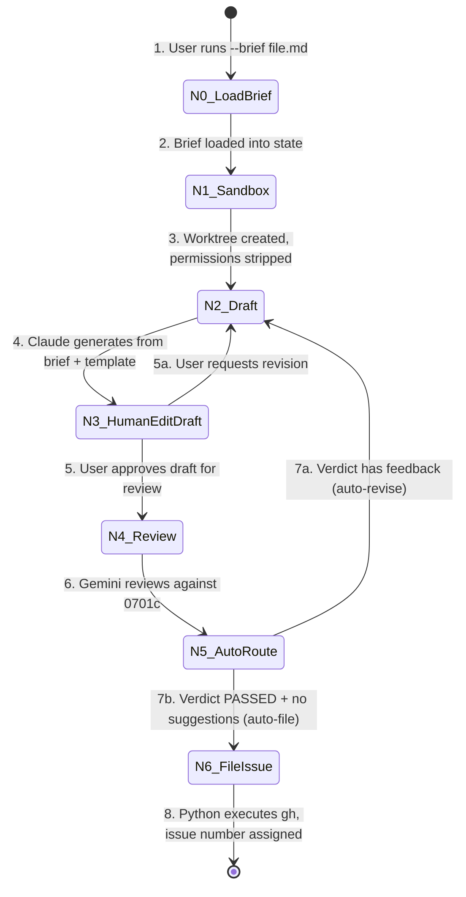

# 0904 - Issue Governance Workflow

**Category:** Runbook / Operational Procedure
**Version:** 2.2
**Last Updated:** 2026-01-29

---

## Purpose

Create GitHub issues through a governed workflow that ensures human review at every step. The workflow uses a LangGraph StateGraph to enforce Inversion of Control - Claude drafts, Gemini reviews, but humans approve at every gate.

**Use this when:** You want to create a well-structured GitHub issue with AI assistance but full human oversight.

---

## Prerequisites

| Requirement | Check |
|-------------|-------|
| VS Code CLI | `which code` (should return path) |
| GitHub CLI authenticated | `gh auth status` (should show logged in) |
| Poetry environment | `poetry run python --version` |
| Brief file exists | Your idea written in markdown (or use `--select` to pick from `ideas/active/`) |

---

## Architecture Overview

### State Machine



**Node Reference:**
| Node | Name | Description |
|------|------|-------------|
| N0 | LoadBrief | Load user's ideation notes from `--brief <file>` |
| N1 | Sandbox | Create worktree, strip agent permissions |
| N2 | Draft | Claude generates structured issue from brief + template + ALL prior Gemini verdicts |
| N3 | HumanEditDraft | User reviews/edits Claude output in VS Code |
| N4 | Review | Gemini reviews human-approved draft against 0701c |
| N5 | AutoRoute | Opens verdict in VSCode (non-blocking), auto-routes based on cleanliness |
| N6 | FileIssue | Python executes `gh issue create`, issue number assigned here |

### Sequence Flow

```mermaid
sequenceDiagram
    participant User
    participant Python as run_workflow.py
    participant Claude
    participant Gemini
    participant VSCode

    User->>Python: 1. python run_workflow.py --brief my-notes.md

    rect rgb(80, 80, 80)
        Note over Python: N0: LOAD BRIEF
        Python->>Python: 2. Load user's ideation notes
        Python->>Python: 3. Store brief content in state
    end

    rect rgb(139, 69, 69)
        Note over Python: N1: THE JAIL
        Python->>Python: 4. Create worktree sandbox
        Python->>Python: 5. Strip agent permissions (no gh)
    end

    rect rgb(69, 139, 69)
        Note over Python,Claude: N2: THE DRAFT
        Python->>Claude: 6. brief + template + ALL verdicts → generate structured issue
        Note over Claude: MUST comply with EVERY Gemini item
        Note over Claude: OR ask orchestrator for clarification
        Claude-->>Python: 7. draft-issue.md
    end

    rect rgb(139, 139, 69)
        Note over Python,User: N3: HUMAN EDIT DRAFT
        Python->>VSCode: 8. code --wait draft-issue.md
        Note over VSCode: SCRIPT PAUSES
        User->>VSCode: 9. Review/edit Claude draft
        User->>VSCode: 10. Close editor
        VSCode-->>Python: 11. Editor closed
        Python->>User: 12. [G]emini / [R]evise / [S]ave?
        alt User selects Revise
            User->>Python: R + feedback
            Note over Python: Loop to N2
        else User selects Send
            User->>Python: S
            Note over Python: Proceed to N4
        end
    end

    rect rgb(69, 69, 139)
        Note over Python,Gemini: N4: THE GATE
        Python->>Python: 13. Load 0701c review prompt (HARD-CODED)
        Python->>Gemini: 14. 0701c + draft-issue.md
        Gemini-->>Python: 15. review-verdict.md (raw)
        Python->>Python: 16. Append verdict to verdict_history
    end

    rect rgb(139, 100, 69)
        Note over Python,User: N5: AUTO-ROUTE (NON-BLOCKING VSCODE)
        Python->>Python: 17. Parse verdict: PASSED + no suggestions?
        Python->>VSCode: 18. code draft.md verdict.md (non-blocking)
        Note over VSCode: User can inspect, workflow continues
        alt Verdict has feedback (suggestions/architecture)
            Python->>Python: 19a. Auto-revise → N2
            Note over Python: Claude gets ALL verdicts from history
        else Verdict clean (PASSED + no suggestions)
            Python->>Python: 19b. Auto-file → N6
        end
    end

    rect rgb(100, 69, 139)
        Note over Python: N6: FILE ISSUE
        Python->>Python: 20. gh issue create
        Note over Python: Python executes gh, NOT agent
        Note over Python: Issue number assigned HERE
    end
```



---

## Procedure

### Step 1: Write Your Brief

Create a markdown file with your issue idea. This is YOUR input - write whatever you want Claude to expand into a proper issue.

**Location:** `ideas/active/` (recommended) or anywhere

**Example brief:**
```markdown
# Add rate limiting to API

I want to add rate limiting to prevent abuse. Should use Redis for distributed counting. Need to handle:
- Per-user limits
- Per-endpoint limits
- Graceful degradation when Redis unavailable

Labels: enhancement, security
```

### Step 2: Run the Workflow

**Option A: Interactive picker (recommended)**

Pick from ideas already in `ideas/active/`:

```bash
poetry run --directory /c/Users/mcwiz/Projects/AssemblyZero python /c/Users/mcwiz/Projects/AssemblyZero/tools/run_issue_workflow.py --select
```

You'll see a numbered list of available ideas:
```
============================================================
Select Idea from ideas/active/
============================================================
  [1] add-rate-limiting.md
      Add rate limiting to API
  [2] improve-logging.md
      Improve structured logging

  [q] Quit

Select idea [1-2, q]: _
```

After the issue is filed, the idea file is automatically moved to `ideas/done/{issue#}-name.md`.

**Option B: Cross-repo usage**

Run the workflow from AssemblyZero against a different repository:

```bash
poetry run --directory /c/Users/mcwiz/Projects/AssemblyZero python \
  /c/Users/mcwiz/Projects/AssemblyZero/tools/run_issue_workflow.py \
  --repo /c/Users/mcwiz/Projects/YourProject --select
```

The `--repo` flag specifies the target repository. This is required when running from a different working directory because `poetry run --directory` changes the working directory to AssemblyZero.

**Option C: Direct path**

Specify any brief file directly:

```bash
poetry run --directory /c/Users/mcwiz/Projects/AssemblyZero python /c/Users/mcwiz/Projects/AssemblyZero/tools/run_issue_workflow.py --brief /path/to/your-brief.md
```

The workflow creates an audit directory at `docs/audit/active/{slug}/` where all artifacts are saved.

### Step 3: N0-N1 (Automatic)

The workflow automatically:
- **N0:** Loads your brief, generates a slug, creates audit directory
- **N1:** Verifies VS Code and gh CLI are available

If the slug already exists, you'll be prompted:
- **[R]esume** - Continue existing workflow from checkpoint
- **[N]ew name** - Enter a different slug
- **[C]lean** - Delete checkpoint and audit dir, start fresh
- **[A]bort** - Exit cleanly

### Step 4: N2 - Claude Drafts

Claude expands your brief into a full GitHub issue with:
- Clear title and description
- Acceptance criteria
- Technical approach
- Mermaid diagrams (if applicable)
- Labels

**Revision mode:** If Claude is revising based on Gemini feedback, it receives:
- **ALL prior Gemini verdicts** (cumulative history)
- The current draft
- The original brief
- The issue template

**Claude MUST:**
1. Implement EVERY change Gemini requested (including suggestions)
2. OR explicitly ask orchestrator for clarification using: `"ORCHESTRATOR CLARIFICATION NEEDED: [describe conflict]"`

**You don't interact here** - the draft is saved to the audit trail.

### Step 5: N3 - Human Gate (Post-Claude)

VS Code opens with the draft. This is your chance to:
1. **Review** Claude's expansion of your idea
2. **Check** if Claude asked for orchestrator clarification
3. **Edit** anything - title, description, approach, labels
4. **Save and close** VS Code when done

**Prompt:** `Iteration {n} | Draft #{n}`

Choose:
- **[G]emini** - Send to Gemini for review
- **[R]evise** - Send back to Claude with feedback
- **[S]ave and exit** - Pause workflow for later (resume with `--resume`)

**If Claude asked for clarification:** Provide feedback via [R]evise option.

### Step 6: N4 - Gemini Reviews

Gemini (as adversarial reviewer) checks the draft for:
- Clarity and completeness
- Technical feasibility
- Security considerations
- Missing acceptance criteria
- Architecture suggestions

**You don't interact here** - the verdict is saved to the audit trail and appended to cumulative verdict history.

### Step 7: N5 - Auto-Route (Non-Blocking VSCode)

**This step is AUTOMATIC. No human gate unless Claude asked for clarification.**

The workflow:
1. **Parses verdict** for cleanliness (PASSED + no suggestions/architecture)
2. **Opens VSCode (non-blocking)** - you can inspect files, workflow continues
3. **Auto-routes:**
   - **Clean verdict** → Auto-files to GitHub (N6)
   - **Verdict has feedback** → Auto-sends to Claude (N2) with ALL verdict history

**Terminal output:**
```
✓ Verdict PASSED with no suggestions
>>> Auto-filing issue to GitHub (N6)...
```

OR

```
⚠ Verdict has feedback (suggestions/architecture)
>>> Auto-sending to Claude for revision (N2)...
```

### Step 8: N6 - Issue Filed

The workflow runs `gh issue create` with your approved draft.

**Output:**
- Issue URL printed to console
- `filed.json` saved to audit trail with issue number and metadata
- Audit directory moved to `docs/audit/done/{slug}/`

---

## Turn Limit Handling

If the workflow hits the maximum turns limit (default 25 iterations), you'll see:

```
============================================================
WARNING: MAXIMUM TURNS REACHED (25 iterations)
============================================================

Options:
[N] Add more turns (enter any number, e.g., 10 or 50)
[S]ave and exit - workflow state preserved for resume
[C]lean and exit - delete checkpoint and audit directory

Your choice:
```

**Recommendations:**
- **If making progress:** Enter any number (e.g., `10`, `25`, `100`) to add more turns
- **If stuck in loop:** Use `[S]` to save and debug, or `[C]` to clean and restart
- **Typical cause:** Gemini and Claude disagreeing on structure vs. content

---

## Resuming an Interrupted Workflow

If VS Code crashes, terminal closes, or you need to continue later:

```bash
poetry run --directory /c/Users/mcwiz/Projects/AssemblyZero python /c/Users/mcwiz/Projects/AssemblyZero/tools/run_issue_workflow.py --resume /path/to/your-brief.md
```

Or just run with the same `--brief` and choose **[R]esume** when prompted about the existing slug.

---

## Audit Trail

All artifacts are saved to `docs/audit/active/{slug}/`:

| File | Description |
|------|-------------|
| `001-brief.md` | Your original input |
| `002-draft.md` | Claude's first draft |
| `003-verdict.md` | Gemini's first review |
| `004-draft.md` | Claude's revision (if looped) |
| `005-verdict.md` | Gemini's second review (if looped) |
| `NNN-filed.json` | Final metadata with issue URL |

**Verdict history:** Each verdict is appended to `state.verdict_history` and sent back to Claude on revision.

After the issue is filed:
- Audit folder is moved to `docs/audit/done/{issue#}-{slug}/`
- If using `--select`, the source idea is moved to `ideas/done/{issue#}-name.md`

### Ideas Folder Structure

```
ideas/
├── active/     # Ideas ready to work on (inbox)
├── done/       # Ideas filed as issues (auto-moved after filing)
└── someday/    # "Maybe never" concepts
```

---

## Verification Checklist

| Check | Command | Expected |
|-------|---------|----------|
| Issue created | `gh issue view {number}` | Shows your issue |
| Audit complete | `ls docs/audit/done/{slug}/` | Has `*-filed.json` |
| Labels applied | `gh issue view {number} --json labels` | Labels from draft |

---

## Troubleshooting

### "VS Code CLI not found"

Install VS Code and ensure `code` is in your PATH:
- Windows: VS Code installer adds it automatically
- Verify: `which code` or `where code`

### "gh not authenticated"

Run:
```bash
gh auth login
```

### "Slug collision" but I want to start fresh

Choose **[C]lean** when prompted, or delete the existing audit directory:
```bash
rm -rf docs/audit/active/{slug}
```

Then re-run the workflow.

### "Gemini quota exhausted"

The workflow will pause. Wait for quota reset (~24h) or the orchestrator will rotate credentials automatically.

### "Workflow stuck in revision loop"

**Symptoms:** Claude and Gemini keep disagreeing, hitting turn limit.

**Causes:**
1. Gemini wants structural changes, Claude preserves correct structure
2. Conflicting feedback between multiple verdicts

**Solutions:**
1. Review verdict history in audit trail - identify the conflict
2. Use `[R]evise` at N3 to provide orchestrator guidance
3. If truly stuck, use `[S]ave and exit` to pause, then file manually via `gh issue create`

---

## Related Documents

- [Issue #62](https://github.com/martymcenroe/AssemblyZero/issues/62) - Governance Workflow StateGraph
- [0701c-Issue-Review-Prompt.md](../skills/0701c-Issue-Review-Prompt.md) - Gemini's review prompt
- [CLAUDE.md](../../CLAUDE.md) - Core rules including Gemini orchestrator protocol
- [workflow-lessons-learned-1.md](../workflow-lessons-learned-1.md) - Testing lessons from initial implementation

---

## Revision History

| Version | Date | Changes |
|---------|------|---------|
| 1.0 | 2026-01-26 | Initial version |
| 2.0 | 2026-01-28 | Auto-routing at N5, cumulative verdict history, recursion limit handling, stronger Claude instructions |
| 2.1 | 2026-01-28 | Add `--select` flag for interactive idea picker, document ideas/ folder as staging area |
| 2.2 | 2026-01-29 | Add `--repo` flag for cross-repo workflow usage |
