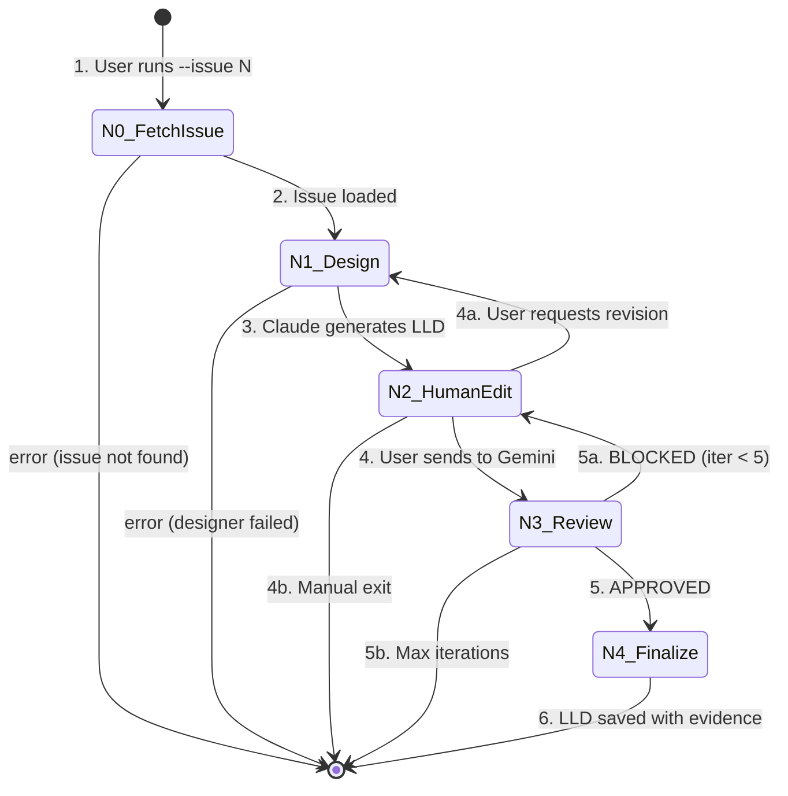

# 0906 - LLD Governance Workflow

**Category:** Runbook / Operational Procedure
**Version:** 1.2
**Last Updated:** 2026-01-31

---

## Purpose

Create Low-Level Design (LLD) documents for GitHub issues through a governed workflow with human review gates and Gemini approval. The workflow uses a LangGraph StateGraph to enforce Inversion of Control - Claude designs, Gemini reviews, but humans approve at every gate.

**Use this when:** You need to create an LLD for an issue before implementation, with AI assistance and full governance oversight.

---

## Prerequisites

| Requirement | Check |
|-------------|-------|
| VS Code CLI | `which code` (should return path) |
| GitHub CLI authenticated | `gh auth status` (should show logged in) |
| Poetry environment | `poetry run python --version` |
| Issue exists in GitHub | `gh issue view {number}` |

---

## Architecture Overview

### State Machine



**Node Reference:**
| Node | Name | Description |
|------|------|-------------|
| N0 | FetchIssue | Fetch issue from GitHub, assemble context |
| N1 | Design | Claude generates LLD from issue + template |
| N2 | HumanEdit | User reviews/edits draft in VS Code |
| N3 | Review | Gemini reviews against 0702c evaluation |
| N4 | Finalize | Embed review evidence, save to docs/lld/active/ |

---

## Procedure

### Step 1: Choose Your Issue

**Option A: Interactive picker (recommended)**

Browse open issues and filter by LLD status:

```bash
poetry run python tools/run_lld_workflow.py --select
```

You'll see a list with status indicators:
```
============================================================
Select Issue for LLD Creation
============================================================

  [1] #97 Add caching layer
       [NEW]
  [2] #95 Add --select flag
       [SKIP - approved]
  [3] #92 Refactor auth
       [DRAFT - has unreviewed LLD]

  [q] Quit

Select issue [1-3, q]: _
```

- **[NEW]** - No LLD exists
- **[DRAFT]** - LLD exists but not Gemini-approved (will inject as context)
- **[SKIP]** - Already has approved LLD (can override)
- **[BLOCKED]** - Has LLD that was blocked (needs revision)

**Option B: Direct issue number**

```bash
poetry run python tools/run_lld_workflow.py --issue 42
```

**Option C: Cross-repo usage**

Run the workflow from AssemblyZero against a different repository:

```bash
poetry run --directory /c/Users/mcwiz/Projects/AssemblyZero python \
  /c/Users/mcwiz/Projects/AssemblyZero/tools/run_lld_workflow.py \
  --repo /c/Users/mcwiz/Projects/YourProject --select
```

The `--repo` flag specifies the target repository. This is required when running from a different working directory because `poetry run --directory` changes the working directory to AssemblyZero.

### Step 2: Add Context (Optional)

Include additional files for Claude to reference:

```bash
poetry run python tools/run_lld_workflow.py --issue 42 --context src/main.py --context docs/architecture.md
```

### Step 3: N0-N1 (Automatic)

The workflow automatically:
- **N0:** Fetches issue title and body from GitHub, creates audit directory
- **N1:** Claude generates LLD using the issue + template + context

### Step 4: N2 - Human Gate

VS Code opens with the draft LLD. Review and edit:
1. Check structure matches LLD template
2. Verify technical approach is correct
3. Add missing details or context
4. Save and close VS Code

**Prompt:** `Iteration {n}/20`

Choose:
- **[S]end** - Submit to Gemini review
- **[R]evise** - Send back to Claude with feedback
- **[M]anual** - Exit for manual handling

### Step 5: N3 - Gemini Reviews

Gemini (as Senior Software Architect) evaluates the LLD against:
- Pre-flight gate (issue link, context, proposed changes)
- Tier 1 (Cost, Safety, Security, Legal)
- Tier 2 (Architecture, Observability, Quality)

**Verdicts:**
- **APPROVED** - Proceed to finalize
- **BLOCKED** - Returns to human edit with critique

**Maximum 20 iterations** (configurable via `--max-iterations`) before forced exit with guidance.

### Step 6: N4 - Finalize

On approval, the workflow:
1. Embeds review evidence in LLD (Status field, Review Summary table, Final Status marker)
2. Saves to `docs/lld/active/LLD-{issue_number}.md`
3. Updates `docs/lld/lld-status.json` tracking cache
4. Saves metadata to audit trail

---

## Special Modes

### Mock Mode (Testing)

Run full workflow without API calls:

```bash
poetry run python tools/run_lld_workflow.py --issue 42 --mock
```

Uses fixtures: first review returns BLOCKED, second returns APPROVED.

### Auto Mode (Unattended)

Skip VS Code editing, auto-send to review:

```bash
poetry run python tools/run_lld_workflow.py --issue 42 --auto
```

### Resume Mode

Continue interrupted workflow:

```bash
poetry run python tools/run_lld_workflow.py --issue 42 --resume
```

### Custom Iteration Limit

Override the default 20-iteration limit:

```bash
poetry run python tools/run_lld_workflow.py --issue 42 --max-iterations 50
```

### Audit Mode

Rebuild LLD status cache from all LLD files:

```bash
poetry run python tools/run_lld_workflow.py --audit
```

For cross-repo audit:

```bash
poetry run --directory /c/Users/mcwiz/Projects/AssemblyZero python \
  /c/Users/mcwiz/Projects/AssemblyZero/tools/run_lld_workflow.py \
  --repo /c/Users/mcwiz/Projects/YourProject --audit
```

Output:
```
============================================================
LLD Status Audit
============================================================

Scanning LLD files...

LLD Status Cache Rebuilt:
  Total LLDs: 15
  Approved: 12
  Draft: 2
  Blocked: 1

Saved to: docs/lld/lld-status.json
```

---

## Audit Trail

All artifacts are saved to `docs/lineage/active/{issue_number}-lld/`:

| File | Description |
|------|-------------|
| `001-issue.md` | Issue content + context |
| `002-draft.md` | Claude's first LLD draft |
| `003-verdict.md` | Gemini's first review |
| `004-draft.md` | Claude's revision (if looped) |
| `NNN-approved.json` | Final metadata |

---

## LLD Status Tracking

The workflow maintains `docs/lld/lld-status.json`:

```json
{
  "version": "1.0",
  "last_updated": "2026-01-29T12:00:00Z",
  "issues": {
    "86": {
      "lld_path": "docs/lld/done/LLD-086-lld-governance-workflow.md",
      "status": "approved",
      "has_gemini_review": true,
      "final_verdict": "APPROVED",
      "last_review_date": "2026-01-29",
      "review_count": 2
    }
  }
}
```

**Detection patterns** (embedded in approved LLDs):
1. `**Final Status:** APPROVED`
2. Review Summary table with Gemini entries
3. `### Gemini Review #N (APPROVED)` headings
4. `* **Status:** Approved (Gemini Review, date)`

---

## Verification Checklist

| Check | Command | Expected |
|-------|---------|----------|
| LLD created | `ls docs/lld/active/LLD-{N}.md` | File exists |
| Evidence embedded | `grep "Final Status" docs/lld/active/LLD-{N}.md` | Shows APPROVED |
| Cache updated | `cat docs/lld/lld-status.json` | Issue entry present |
| Audit complete | `ls docs/lineage/active/{N}-lld/` | Has `*-approved.json` |

---

## Troubleshooting

### "Issue not found"

Verify the issue exists and you're authenticated:
```bash
gh issue view {number}
gh auth status
```

### "Max iterations reached"

Gemini and Claude can't agree. Options:
1. Review the verdicts in audit trail to understand the conflict
2. Manually edit the LLD to address Gemini's concerns
3. File the LLD manually without governance approval (document why)

### "Designer node failed"

Check that the designer prompt exists:
```bash
ls .claude/templates/gemini-prompts/lld-*.txt
```

### "Context file outside project"

All `--context` paths must be within the repository root. Use relative paths:
```bash
# Good
--context docs/architecture.md

# Bad
--context /c/Users/mcwiz/other-project/file.md
```

---

## Related Documents

- [Issue #86](https://github.com/martymcenroe/AssemblyZero/issues/86) - LLD Governance Workflow
- [Issue #95](https://github.com/martymcenroe/AssemblyZero/issues/95) - --select and status tracking
- [LLD-086](../lld/done/LLD-086-lld-governance-workflow.md) - Design document
- [0702c-LLD-Review-Prompt](../.claude/templates/gemini-prompts/lld-review.txt) - Gemini's review prompt
- [0904-issue-governance-workflow](0904-issue-governance-workflow.md) - Related issue workflow

---

## Revision History

| Version | Date | Changes |
|---------|------|---------|
| 1.0 | 2026-01-29 | Initial version with --select, --audit, and status tracking |
| 1.1 | 2026-01-29 | Add `--repo` flag for cross-repo workflow usage |
| 1.2 | 2026-01-31 | Update max iterations to 20, fix audit path to docs/lineage/ |
