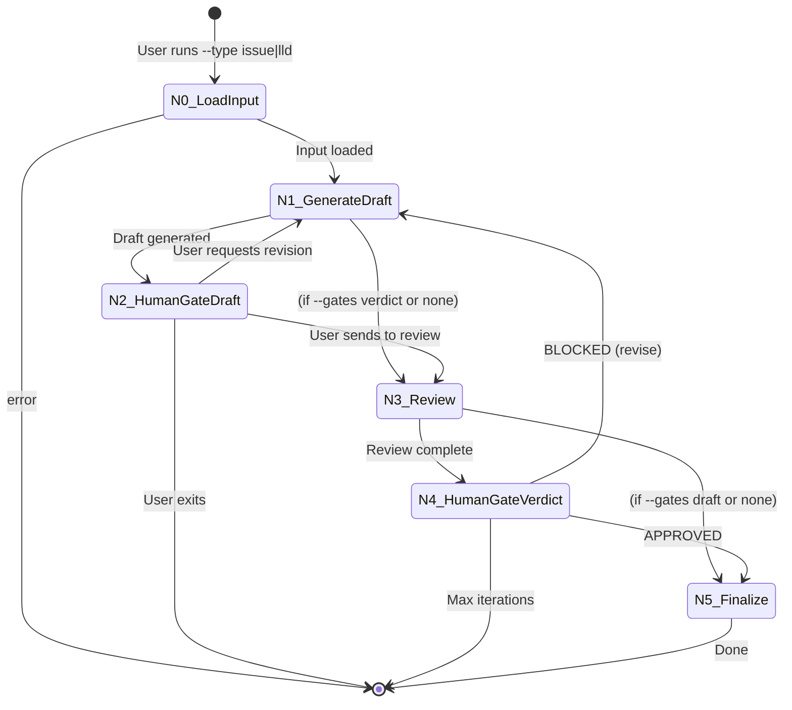

# 0907 - Unified Requirements Workflow

**Category:** Runbook / Operational Procedure
**Version:** 1.0
**Last Updated:** 2026-02-01

---

## Purpose

Create GitHub Issues or LLDs through a single unified workflow with pluggable LLM providers and configurable human gates. This replaces the need to use separate `run_issue_workflow.py` and `run_lld_workflow.py` tools.

**Use this when:** You want a single tool for both Issue and LLD creation, or need to swap between different LLM providers (Claude, Gemini, future: OpenAI, Ollama).

---

## Prerequisites

| Requirement | Check |
|-------------|-------|
| VS Code CLI | `which code` (should return path) |
| GitHub CLI authenticated | `gh auth status` (should show logged in) |
| Poetry environment | `poetry run python --version` |
| For Issue workflow | Brief file exists |
| For LLD workflow | Issue exists in GitHub |

---

## Architecture Overview

### Unified State Machine



### Node Reference

| Node | Name | Description |
|------|------|-------------|
| N0 | LoadInput | Load brief (issue) or fetch GitHub issue (lld) |
| N1 | GenerateDraft | Drafter LLM generates issue/LLD from input |
| N2 | HumanGateDraft | User reviews/edits draft in VS Code (optional) |
| N3 | Review | Reviewer LLM evaluates draft |
| N4 | HumanGateVerdict | User reviews verdict in VS Code (optional) |
| N5 | Finalize | Save output, file issue, or save LLD |

---

## Quick Start

### Issue Workflow (Brief → GitHub Issue)

```bash
# Interactive picker from ideas/active/
poetry run python tools/run_requirements_workflow.py --type issue --select

# Direct path to brief
poetry run python tools/run_requirements_workflow.py --type issue --brief ideas/active/my-feature.md
```

### LLD Workflow (GitHub Issue → LLD)

```bash
# Interactive picker from open issues
poetry run python tools/run_requirements_workflow.py --type lld --select

# Direct issue number
poetry run python tools/run_requirements_workflow.py --type lld --issue 42
```

### Cross-Repo Usage

```bash
# Run from AgentOS against a different repository
poetry run --directory /c/Users/mcwiz/Projects/AgentOS python \
  /c/Users/mcwiz/Projects/AgentOS/tools/run_requirements_workflow.py \
  --type lld --repo /c/Users/mcwiz/Projects/OtherProject --issue 42
```

---

## CLI Reference

### Required Arguments

| Argument | Values | Description |
|----------|--------|-------------|
| `--type` | `issue`, `lld` | Workflow type |

### Input Arguments (one required)

| Argument | Description |
|----------|-------------|
| `--brief PATH` | Path to brief file (for `--type issue`) |
| `--issue N` | GitHub issue number (for `--type lld`) |
| `--select` | Interactive picker |

### LLM Configuration

| Argument | Default | Description |
|----------|---------|-------------|
| `--drafter SPEC` | `claude:opus-4.5` | Drafter LLM provider:model |
| `--reviewer SPEC` | `gemini:3-pro-preview` | Reviewer LLM provider:model |

**Provider specs:**
- `claude:opus-4.5`, `claude:sonnet`, `claude:haiku`
- `gemini:3-pro-preview`, `gemini:2.5-flash`, `gemini:2.5-pro`

### Gate Configuration

| Argument | Default | Description |
|----------|---------|-------------|
| `--gates GATES` | `draft,verdict` | Human gates to enable |

**Gate values:**
- `draft,verdict` - Both gates enabled (default)
- `draft` - Only draft gate (auto-accept verdicts)
- `verdict` - Only verdict gate (auto-send drafts)
- `none` - Fully automated

### Mode Flags

| Argument | Description |
|----------|-------------|
| `--mock` | Use mock providers for testing |
| `--resume` | Resume from previous checkpoint |
| `--dry-run` | Show what would happen without changes |
| `--debug` | Enable debug logging |

### Other Arguments

| Argument | Default | Description |
|----------|---------|-------------|
| `--repo PATH` | Auto-detect | Target repository path |
| `--context PATH` | None | Additional context files (repeatable, LLD only) |
| `--max-iterations N` | 20 | Maximum revision iterations |

---

## Common Workflows

### 1. Standard Issue Creation

```bash
poetry run python tools/run_requirements_workflow.py \
  --type issue \
  --brief ideas/active/my-feature.md
```

Flow:
1. Claude drafts issue from brief
2. You edit in VS Code
3. Gemini reviews
4. You review verdict
5. Issue filed to GitHub

### 2. Fully Automated LLD Creation

```bash
poetry run python tools/run_requirements_workflow.py \
  --type lld \
  --issue 42 \
  --gates none
```

Flow:
1. Fetch issue from GitHub
2. Claude drafts LLD
3. Gemini reviews (auto-revise if BLOCKED)
4. LLD saved when APPROVED

### 3. Custom LLM Providers

```bash
# Use Gemini for drafting, Claude for reviewing
poetry run python tools/run_requirements_workflow.py \
  --type lld \
  --issue 42 \
  --drafter gemini:2.5-flash \
  --reviewer claude:sonnet
```

### 4. LLD with Context Files

```bash
poetry run python tools/run_requirements_workflow.py \
  --type lld \
  --issue 42 \
  --context src/auth/login.py \
  --context docs/architecture.md
```

### 5. Testing with Mock Mode

```bash
poetry run python tools/run_requirements_workflow.py \
  --type lld \
  --issue 42 \
  --mock
```

Uses fixtures instead of real LLM calls. First review returns BLOCKED, second returns APPROVED.

---

## Output Locations

### Issue Workflow

| Output | Location |
|--------|----------|
| Filed issue | GitHub (URL printed) |
| Audit trail | `docs/lineage/active/{slug}/` |
| Source brief | Moved to `ideas/done/{issue#}-{name}.md` |

### LLD Workflow

| Output | Location |
|--------|----------|
| Approved LLD | `docs/lld/active/LLD-{issue#}.md` |
| Audit trail | `docs/lineage/active/{issue#}-lld/` |
| Status cache | `docs/lld/lld-status.json` |

---

## Human Gate Interactions

### Draft Gate (N2)

VS Code opens with the draft. Review and edit, then:

```
Iteration 1/20 | Draft #1

[S]end to reviewer
[R]evise with feedback
[E]xit (save for later)

Choice: _
```

### Verdict Gate (N4)

VS Code opens with draft and verdict. Review, then:

```
Iteration 1/20 | Verdict: BLOCKED

[A]ccept verdict (revise draft)
[O]verride (proceed anyway)
[E]xit (save for later)

Choice: _
```

---

## Troubleshooting

### "Provider not found"

Check your `--drafter` or `--reviewer` spec format:
```
provider:model
```

Valid providers: `claude`, `gemini`

### "Brief file not found"

Ensure the path is correct and the file exists:
```bash
ls -la ideas/active/
```

### "Issue not found"

Verify the issue exists and gh is authenticated:
```bash
gh issue view 42
gh auth status
```

### "Max iterations reached"

The drafter and reviewer can't agree. Options:
1. Review verdicts in audit trail
2. Use `[O]verride` to force accept
3. Exit and file manually

### "Checkpoint database locked"

Another workflow is running. Either:
1. Wait for it to finish
2. Delete the checkpoint: `rm ~/.agentos/governance_workflow.db`

---

## Comparison with Legacy Workflows

| Feature | Legacy (0904/0906) | Unified (0907) |
|---------|-------------------|----------------|
| Single tool | No | Yes |
| Pluggable LLMs | No | Yes |
| Configurable gates | Limited | Full |
| Cross-repo | Via `--repo` | Via `--repo` |
| Mock mode | Yes | Yes |
| Resume | Yes | Yes |

**When to use legacy workflows:**
- If unified workflow has bugs not yet fixed
- For specific features not yet ported

**When to use unified workflow:**
- All new work
- When you need different LLM providers
- When you want single-tool simplicity

---

## Related Documents

- [Issue #101](https://github.com/martymcenroe/AgentOS/issues/101) - Unified Requirements Workflow
- [LLD-101](../lld/active/LLD-101.md) - Design document
- [0904-issue-governance-workflow](0904-issue-governance-workflow.md) - Legacy issue workflow
- [0906-lld-governance-workflow](0906-lld-governance-workflow.md) - Legacy LLD workflow

---

## Revision History

| Version | Date | Changes |
|---------|------|---------|
| 1.0 | 2026-02-01 | Initial version after code recovery from dangling commit |
