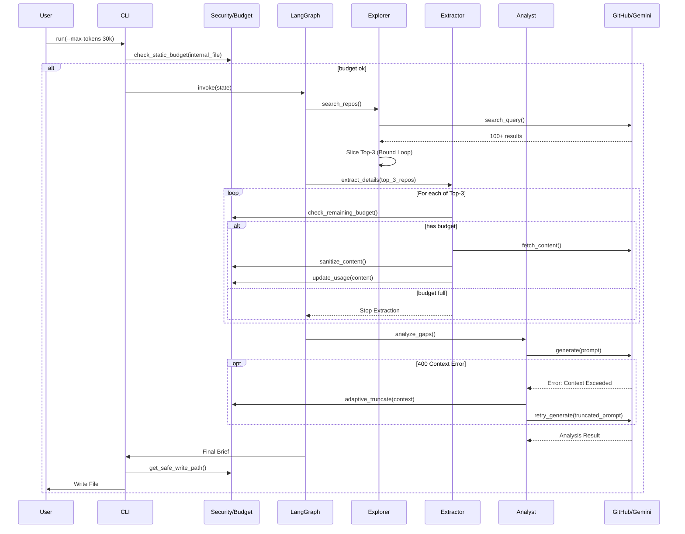

# 0908 - The Scout: External Intelligence Gathering Workflow

**Category:** Runbook / Operational Procedure
**Version:** 1.0
**Last Updated:** 2026-02-01

---

## Purpose

Operational runbook for The Scout: External Intelligence Gathering Workflow (Issue #93).

---

## Prerequisites

| Requirement | Check |
|-------------|-------|
| Require interactive confirmation (or `--yes`) before sending internal code to LLM. | `verify` |

---

## Architecture

---

## Procedure

*Procedure steps to be documented.*

---

## Verification

| Check | Command | Expected |
|-------|---------|----------|
| Feature works | `run feature` | Success |

---

## Troubleshooting

### Common Issues

*Document common issues and resolutions here.*

---

## Related Documents

- [Issue #93](https://github.com/issues/93)
- [LLD-093](../lld/active/LLD-093.md)

## Implementation Files

- `agentos/workflows/testing/nodes/document.py`
- `agentos/workflows/testing/templates/__init__.py`
- `agentos/workflows/testing/templates/wiki_page.py`
- `agentos/workflows/testing/templates/runbook.py`
- `agentos/workflows/testing/templates/lessons.py`
- `agentos/workflows/testing/templates/cp_docs.py`
- `agentos/workflows/testing/graph.py`
- `agentos/workflows/testing/state.py`
- `agentos/workflows/testing/nodes/__init__.py`

---

## Revision History

| Version | Date | Changes |
|---------|------|---------|
| 1.0 | 2026-02-01 | Initial version (auto-generated) |
