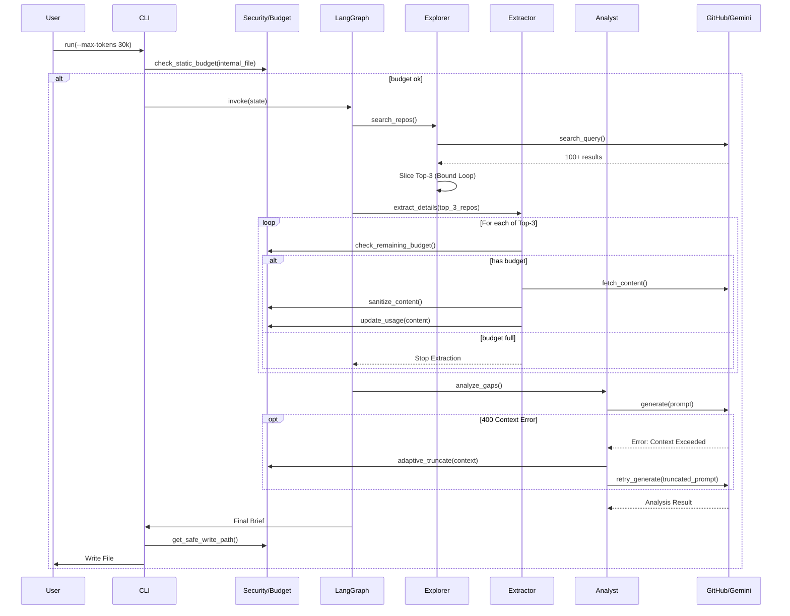

# 0908 - The Scout: External Intelligence Gathering Workflow

**Category:** Runbook / Operational Procedure
**Version:** 1.0
**Last Updated:** 2026-02-01

---

## Purpose

Operational runbook for The Scout: External Intelligence Gathering Workflow (Issue #93).

---

## Prerequisites

| Requirement | Check |
|-------------|-------|
| Require interactive confirmation (or `--yes`) before sending internal code to LLM. | `verify` |

---

## Architecture



---

## Procedure

### Basic Usage

```bash
# Search for repositories on a topic (outputs to ideas/active/)
python tools/run_scout_workflow.py --topic "langgraph workflow" --yes

# With verbose output
python tools/run_scout_workflow.py --topic "async patterns" --yes --verbose

# JSON output format
python tools/run_scout_workflow.py --topic "testing" --format json --yes
```

### Compare with Internal Code

```bash
# Compare external repos against your implementation
python tools/run_scout_workflow.py --topic "state machines" \
    --internal src/core/state.py --yes
```

**Note:** The `--yes` flag confirms data privacy consent. Without it, you'll be prompted interactively when using `--internal`.

### Advanced Options

```bash
# Full options
python tools/run_scout_workflow.py \
    --topic "langgraph"          # Required: search topic
    --internal src/file.py       # Optional: internal code to compare
    --output ideas/active        # Output directory (default)
    --min-stars 100              # Minimum stars filter (default: 100)
    --max-repos 3                # Max repos to analyze (default: 3)
    --max-tokens 30000           # Token budget (default: 30000)
    --format markdown            # Output format: markdown|json
    --offline                    # Use fixtures instead of live API
    --yes                        # Skip confirmation prompts
    --force                      # Overwrite existing output
    --verbose                    # Show detailed progress
```

### Offline Mode (Testing)

```bash
# Use fixtures instead of live GitHub/Gemini APIs
python tools/run_scout_workflow.py --topic "test" --offline --yes
```

Offline mode uses fixtures in `tests/fixtures/scout/`:
- `github_search_response.json` - Mock search results
- `github_content_response.json` - Mock README/license content

---

## Verification

| Check | Command | Expected |
|-------|---------|----------|
| CLI help | `python tools/run_scout_workflow.py --help` | Shows all options |
| Offline test | `python tools/run_scout_workflow.py --topic test --offline --yes` | Creates `ideas/active/innovation-test.md` |
| GitHub auth | `gh auth token` | Returns valid token |
| Gemini creds | Check `~/.assemblyzero/gemini_credentials.json` | At least one valid key |
| Unit tests | `poetry run pytest tests/unit/test_scout*.py -v` | All pass |

---

## Troubleshooting

### Common Issues

#### Unicode Encoding Error (Windows)

**Error:**
```
UnicodeEncodeError: 'charmap' codec can't encode character '\u2713'
```

**Cause:** Windows console doesn't support Unicode characters like ✓, ✗, ⭐, ⚠️.

**Fix:** The CLI uses ASCII alternatives: `[OK]`, `[ERROR]`, `*`, `[WARNING]`. If you see this error, update `tools/run_scout_workflow.py` to use ASCII.

---

#### Empty Search Results

**Symptom:** "Found 0 repositories"

**Causes:**
1. GitHub API rate limiting (unauthenticated: 10 requests/min)
2. `--min-stars` threshold too high
3. Topic too specific

**Fixes:**
1. Ensure `gh auth token` returns a valid token
2. Lower `--min-stars` (default is 100)
3. Broaden the search topic

---

#### Gemini API Key Expired

**Error:**
```
400 API key expired. Please renew the API key
```

**Fix:** The Scout uses `GeminiClient` with credential rotation. Add fresh keys to:
```
~/.assemblyzero/gemini_credentials.json
```

Format:
```json
{
  "credentials": [
    {"api_key": "AIza...key1...", "name": "primary"},
    {"api_key": "AIza...key2...", "name": "backup"}
  ]
}
```

---

#### Context Window Exceeded

**Error:**
```
400 Request payload size exceeds the limit
```

**Cause:** Too much README content sent to Gemini.

**Mitigation:**
- The workflow automatically truncates READMEs to 3000 chars
- Reduce `--max-repos` to analyze fewer repositories
- Reduce `--max-tokens` budget

---

#### Permission Denied on Output

**Error:**
```
PermissionError: [Errno 13] Permission denied: 'ideas/active/...'
```

**Fixes:**
1. Ensure output directory exists: `mkdir -p ideas/active`
2. Use `--force` to overwrite existing files
3. Check file isn't open in another program

---

## Related Documents

- [Issue #93](https://github.com/mcwizard/AssemblyZero/issues/93) - The Scout: External Intelligence Gathering Workflow
- [LLD-093](../lld/active/LLD-093.md) - Low-Level Design document
- [Innovation Brief Example](../../ideas/active/innovation-langgraph-workflow.md) - Sample output

## Implementation Files

### Core Workflow
- `assemblyzero/workflows/scout/graph.py` - StateGraph definition, ExternalRepo TypedDict
- `assemblyzero/workflows/scout/nodes.py` - Node implementations (Explorer, Extractor, Analyst, Scribe)
- `assemblyzero/workflows/scout/budget.py` - Token budget management
- `assemblyzero/workflows/scout/security.py` - Content sanitization, path validation
- `assemblyzero/workflows/scout/templates.py` - Output formatting (markdown, JSON)

### CLI Entry Point
- `tools/run_scout_workflow.py` - Command-line interface

### Test Fixtures
- `tests/fixtures/scout/github_search_response.json` - Mock GitHub search results
- `tests/fixtures/scout/github_content_response.json` - Mock README/license content

### Dependencies
- `PyGithub` - GitHub API client
- `google-generativeai` - Gemini API client (via GeminiClient wrapper)
- `gh` CLI - For authentication token

---

## Revision History

| Version | Date | Changes |
|---------|------|---------|
| 1.0 | 2026-02-01 | Initial version (auto-generated) |
| 1.1 | 2026-02-01 | Added procedure, troubleshooting, correct implementation files |
