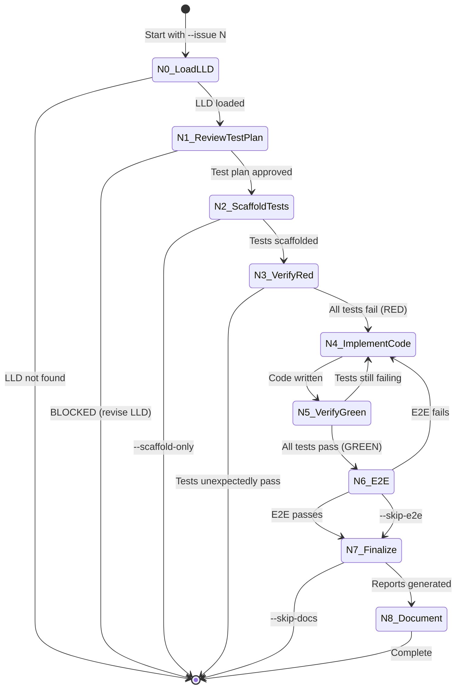

# 0909 - TDD Implementation Workflow

**Category:** Runbook / Operational Procedure
**Version:** 1.1
**Last Updated:** 2026-02-04

---

## Purpose

Implement an approved LLD using Test-Driven Development (TDD). This workflow takes an approved LLD and produces working, tested code with documentation.

**Use this when:** You have an approved LLD (from 0907 Governance Workflow) and need to implement it.

---

## Prerequisites

| Requirement | Check |
|-------------|-------|
| Approved LLD exists | `ls docs/lld/active/LLD-{issue}.md` |
| Poetry environment | `poetry run python --version` |
| GitHub CLI authenticated | `gh auth status` |

---

## Architecture Overview

### TDD State Machine



### Node Reference

| Node | Name | Description |
|------|------|-------------|
| N0 | LoadLLD | Load approved LLD from `docs/lld/active/` |
| N1 | ReviewTestPlan | Gemini reviews test scenarios from LLD Section 10 |
| N2 | ScaffoldTests | Create test files with failing tests |
| N3 | VerifyRed | Confirm all tests fail (TDD red phase) |
| N4 | ImplementCode | Claude writes code to make tests pass |
| N5 | VerifyGreen | Run tests, loop back if failures remain |
| N6 | E2E | Run end-to-end validation (optional) |
| N7 | Finalize | Generate test report, archive LLD to `done/` |
| N8 | Document | Create/update runbook, c/p docs |

---

## Quick Start

### Standard Implementation

```bash
poetry run python tools/run_implement_from_lld.py --issue 104
```

### Fully Automated (No Human Gates)

```bash
poetry run python tools/run_implement_from_lld.py --issue 104 --gates none
```

### Fast Mode (Skip E2E)

```bash
poetry run python tools/run_implement_from_lld.py --issue 104 --skip-e2e
```

### Scaffold Tests Only

```bash
poetry run python tools/run_implement_from_lld.py --issue 104 --scaffold-only
```

---

## CLI Reference

### Required Arguments

| Argument | Description |
|----------|-------------|
| `--issue N` | GitHub issue number (must have approved LLD) |

### Mode Flags

| Argument | Description |
|----------|-------------|
| `--gates LEVEL` | Which gates to enable: `none`, `draft`, `verdict`, `all` (default: `all`) |
| `--mock` | Use fixtures instead of real APIs |
| `--skip-e2e` | Skip E2E validation phase |
| `--scaffold-only` | Stop after scaffolding tests (red phase) |
| `--resume` | Resume from checkpoint |
| `--no-worktree` | Skip worktree creation (use current directory) |

**Note:** `--auto` is deprecated. Use `--gates none` instead.

### Configuration

| Argument | Default | Description |
|----------|---------|-------------|
| `--repo PATH` | Current repo | Target repository path |
| `--lld PATH` | Auto-detect | Override LLD path |
| `--max-iterations N` | 10 | Max implementation attempts |
| `--coverage-target N` | From LLD or 90 | Required coverage % |
| `--sandbox-repo OWNER/REPO` | None | Sandbox for E2E tests |

---

## TDD Phases Explained

### Phase 1: Red (Tests Fail)

The workflow creates test files based on LLD Section 10 (Test Scenarios). All tests must fail initially - this confirms we're testing the right thing.

**If tests unexpectedly pass:** The workflow stops. This means either:
- The feature already exists
- The tests aren't actually testing the new code

### Phase 2: Green (Tests Pass)

Claude implements code to make tests pass. The workflow loops:
1. Write/modify code
2. Run tests
3. If failures remain, loop back (up to `--max-iterations`)

### Phase 3: Refactor (Optional)

Not automated. After workflow completes, you may manually refactor while keeping tests green.

---

## Output Locations

| Output | Location |
|--------|----------|
| Test files | `tests/test_{feature}.py` |
| Implementation | As specified in LLD Section 2.1 |
| Test report | `docs/reports/active/{issue}-test-report.md` |
| Audit trail | `docs/lineage/active/{issue}-impl/` |

### N8 Auto-Generated Documentation

The N8 documentation node automatically generates docs for the implemented feature:

| Doc Type | Generated When | Location |
|----------|----------------|----------|
| **Runbook** | CLI tool or workflow | `docs/runbooks/09XX-{feature}.md` |
| **c/p docs** | CLI tool | `docs/skills/{num}c-*.md`, `{num}p-*.md` |
| **Wiki page** | Major feature | `wiki/{feature}.md` |
| **Lessons learned** | Always | `docs/lineage/active/{issue}-impl/lessons.md` |
| **README update** | Breaking change | `README.md` |

Detection logic:
- **Runbook**: LLD mentions "workflow", "langgraph", or files in `tools/`
- **c/p docs**: Files in `tools/` or "cli" in filename
- **Wiki**: LLD mentions "new feature", "workflow", or "architecture"

So when you run this workflow for a CLI tool like Verdict Analyzer, N8 will auto-create:
1. A runbook for using the tool
2. CLI doc (copy-paste commands)
3. Prompt doc (natural language examples)
4. Lessons learned

### LLD Archival (N7)

When the workflow completes successfully, N7 automatically moves:
- `docs/lld/active/LLD-{issue}.md` → `docs/lld/done/LLD-{issue}.md`
- `docs/reports/active/{issue}-*.md` → `docs/reports/done/{issue}-*.md`

**Known Limitation (Issue #276):** Archival only happens when you complete the full TDD workflow. If you:
- Merge a PR manually (without running this workflow)
- Close an issue without implementation
- Implement via hotfix outside the workflow

...the LLD remains in `active/`. A GitHub Action to archive on issue close is planned.

---

## Common Workflows

### 1. Standard TDD Implementation

```bash
# After LLD is approved via governance workflow
poetry run python tools/run_implement_from_lld.py --issue 104
```

Flow:
1. Load LLD-104
2. Gemini reviews test plan
3. Scaffold tests (all fail)
4. Claude implements code
5. Tests pass
6. E2E validation
7. Generate reports

### 2. Iterate on Failing Tests

If tests keep failing after max iterations:

```bash
# Resume where you left off
poetry run python tools/run_implement_from_lld.py --issue 104 --resume

# Or reset and try again
rm ~/.assemblyzero/testing_workflow.db
poetry run python tools/run_implement_from_lld.py --issue 104
```

### 3. Cross-Repo Implementation

```bash
poetry run --directory /c/Users/mcwiz/Projects/AssemblyZero python \
  /c/Users/mcwiz/Projects/AssemblyZero/tools/run_implement_from_lld.py \
  --issue 42 --repo /c/Users/mcwiz/Projects/OtherProject
```

---

## Troubleshooting

### "LLD not found"

Ensure the LLD exists and is approved:
```bash
ls docs/lld/active/LLD-*.md
```

If missing, run the governance workflow first:
```bash
poetry run python tools/run_governance_workflow.py --type lld --issue 104
```

### "Test plan BLOCKED"

The test scenarios in LLD Section 10 failed review. Return to the LLD and revise the test section.

### "Tests unexpectedly pass in red phase"

Either:
1. Feature already exists - check if this is a duplicate
2. Tests are wrong - review and fix test assertions

### "Max iterations reached"

The implementation couldn't make all tests pass. Options:
1. Review test failures in audit trail
2. Manually fix and resume
3. Simplify the LLD scope

### "Checkpoint database locked"

Another workflow is running:
```bash
# Wait or force remove
rm ~/.assemblyzero/testing_workflow.db
```

---

## Integration with Governance Workflow

The full development cycle:

```
Brief → Issue (0907) → LLD (0907) → Code (0909) → PR → Merge
```

1. **0907 Issue Workflow:** Brief → GitHub Issue
2. **0907 LLD Workflow:** Issue → Approved LLD
3. **0909 TDD Workflow:** LLD → Working Code (this runbook)
4. **Manual:** Code → PR → Review → Merge

---

## Related Documents

- [0907-unified-governance-workflow](0907-unified-governance-workflow.md) - Creates the LLD
- [Issue #101](https://github.com/martymcenroe/AssemblyZero/issues/101) - Unified Governance Workflow
- [Issue #102](https://github.com/martymcenroe/AssemblyZero/issues/102) - TDD Initialization

---

## Revision History

| Version | Date | Changes |
|---------|------|---------|
| 1.1 | 2026-02-04 | Add `--no-worktree` flag, document LLD archival and limitations (#276), fix N7 description |
| 1.0 | 2026-02-01 | Initial version documenting recovered TDD workflow |
