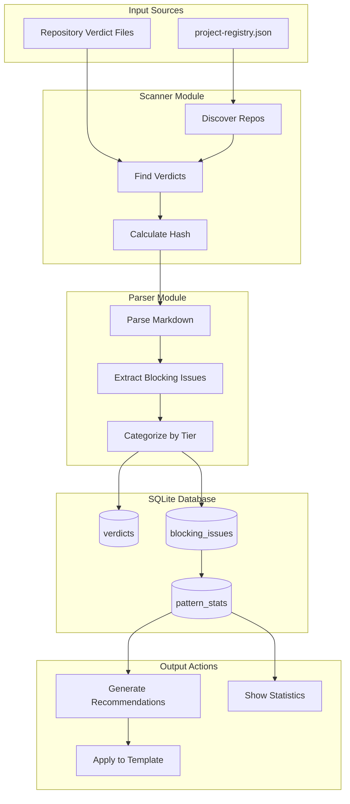

# 0910 - Verdict Analyzer

**Category:** Runbook / Operational Procedure
**Version:** 1.2
**Last Updated:** 2026-02-01

---

## Purpose

Analyze Gemini governance verdicts across repositories to identify recurring blocking patterns. Use these patterns to improve LLD and issue templates, reducing future review cycles.

**Use this when:**
- Gemini keeps blocking the same types of issues
- You want to proactively add checklist items to templates
- You need visibility into governance patterns across projects

---

## Prerequisites

| Requirement | Check |
|-------------|-------|
| Poetry environment | `poetry run python --version` |
| AssemblyZero installed | `ls tools/verdict-analyzer.py` |
| Verdicts exist | `ls docs/lineage/active/*/verdict.md` |

---

## Architecture



---

## Quick Start

### 1. Scan for verdicts

```bash
# Scan all repos in project registry
poetry run python tools/verdict-analyzer.py scan

# Scan specific repos
poetry run python tools/verdict-analyzer.py scan --repos /path/to/repo1 /path/to/repo2

# Force re-scan (ignore hash cache)
poetry run python tools/verdict-analyzer.py scan --force
```

### 2. View statistics

```bash
poetry run python tools/verdict-analyzer.py stats
```

Example output (from 2026-02-01 run):
```
Total Verdicts: 164
Total Blocking Issues: 80

Decisions:
  APPROVED: 36
  BLOCKED: 128

By Tier:
  Tier 1: 33
  Tier 2: 47

By Category:
  architecture: 23
  quality: 23
  security: 10
  safety: 9
  legal: 8
  cost: 6
  observability: 1
```

### 3. Get template recommendations

```bash
# Preview recommendations for LLD template
poetry run python tools/verdict-analyzer.py recommend docs/templates/0102-feature-lld-template.md

# Apply recommendations (dry-run first)
poetry run python tools/verdict-analyzer.py recommend docs/templates/0102-feature-lld-template.md --apply

# Actually apply (no dry-run)
poetry run python tools/verdict-analyzer.py recommend docs/templates/0102-feature-lld-template.md --apply --no-dry-run
```

---

## CLI Reference

### Global Options

| Option | Description |
|--------|-------------|
| `-v` | Verbose mode (INFO level) |
| `-vv` | Debug mode |
| `--db PATH` | Database path (default: `.assemblyzero/verdicts.db`) |

### Commands

| Command | Description |
|---------|-------------|
| `scan` | Scan repositories and parse verdicts into database |
| `stats` | Display blocking pattern statistics |
| `recommend` | Generate template improvement recommendations |
| `clear` | Clear the database |

### scan options

| Option | Description |
|--------|-------------|
| `--registry PATH` | Path to project-registry.json |
| `--repos PATH...` | Explicit repository paths to scan |
| `--force` | Re-parse all verdicts (ignore hash) |

### recommend options

| Option | Description |
|--------|-------------|
| `TEMPLATE` | Path to template file (required) |
| `--min-count N` | Minimum pattern occurrences (default: 3) |
| `--apply` | Apply recommendations to template |
| `--no-dry-run` | Actually modify files (with --apply) |

---

## Common Workflows

### Weekly Template Improvement

```bash
# 1. Scan all projects
poetry run python tools/verdict-analyzer.py scan

# 2. Check what patterns are blocking
poetry run python tools/verdict-analyzer.py stats

# 3. Generate recommendations for LLD template
poetry run python tools/verdict-analyzer.py recommend \
  docs/templates/0102-feature-lld-template.md --min-count 5

# 4. Review and apply (if appropriate)
poetry run python tools/verdict-analyzer.py recommend \
  docs/templates/0102-feature-lld-template.md --apply --no-dry-run
```

### After Major Governance Changes

```bash
# Clear old data
poetry run python tools/verdict-analyzer.py clear

# Re-scan everything
poetry run python tools/verdict-analyzer.py scan --force

# Check new patterns
poetry run python tools/verdict-analyzer.py stats
```

---

## Database Schema

The SQLite database (`.assemblyzero/verdicts.db`) contains:

| Table | Purpose |
|-------|---------|
| `verdicts` | Parsed verdict records (filepath, decision, content_hash, parser_version) |
| `blocking_issues` | Individual issues with tier, category, description |
| `schema_version` | Database migration tracking |

**Incremental Updates:** The scanner uses content hashes to skip unchanged files. Only new or modified verdicts are re-parsed. Use `--force` to override.

---

## Troubleshooting

### "No verdicts found"

Verdicts must be in the expected location:
```
docs/lineage/active/{issue}-lld/NNN-verdict.md
```

Check that your governance workflow is generating verdicts correctly.

### "Template not found"

Provide the full path to the template file:
```bash
poetry run python tools/verdict-analyzer.py recommend \
  C:\Users\mcwiz\Projects\AssemblyZero\docs\templates\lld-template.md
```

### Stale patterns

Clear and re-scan:
```bash
poetry run python tools/verdict-analyzer.py clear
poetry run python tools/verdict-analyzer.py scan --force
```

---

## Related Documents

- [Issue #104](https://github.com/martymcenroe/AssemblyZero/issues/104)
- [LLD-104](../lld/active/LLD-104.md)
- [0907-unified-governance-workflow](0907-unified-governance-workflow.md)

---

## Implementation Files

| File | Purpose |
|------|---------|
| `tools/verdict-analyzer.py` | CLI entry point |
| `tools/verdict_analyzer/parser.py` | Verdict markdown parsing |
| `tools/verdict_analyzer/database.py` | SQLite persistence |
| `tools/verdict_analyzer/patterns.py` | Pattern normalization |
| `tools/verdict_analyzer/template_updater.py` | Template modification |
| `tools/verdict_analyzer/scanner.py` | Repository discovery |

---

## Revision History

| Version | Date | Changes |
|---------|------|---------|
| 1.2 | 2026-02-01 | Updated examples with real output, fixed template paths |
| 1.1 | 2026-02-01 | Enhanced with CLI examples, workflows, troubleshooting |
| 1.0 | 2026-02-01 | Initial version (auto-generated) |
