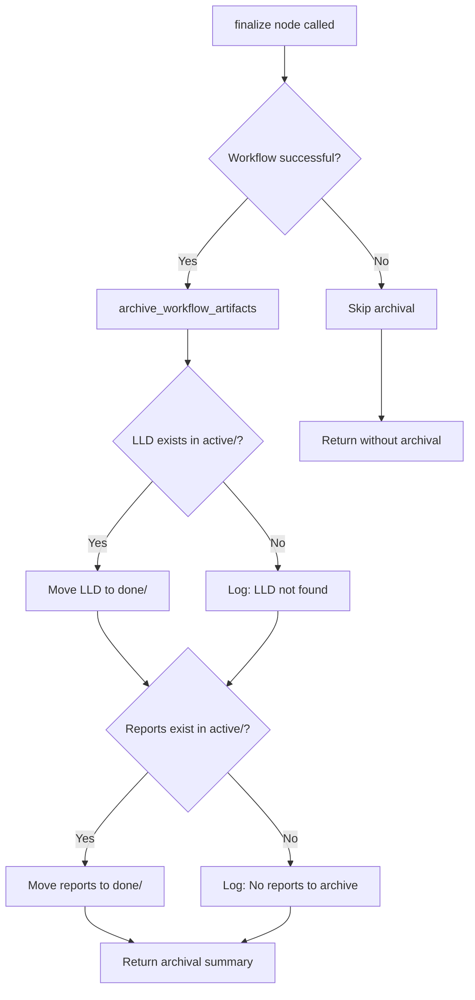

# 0914 - Fix: Implementation Workflow Should Archive LLD and Reports to done/ on Completion

**Category:** Runbook / Operational Procedure
**Version:** 1.0
**Last Updated:** 2026-02-02

---

## Purpose

Operational runbook for Fix: Implementation Workflow Should Archive LLD and Reports to done/ on Completion (Issue #141).

---

## Prerequisites

- Standard AssemblyZero environment
- GitHub CLI authenticated (`gh auth status`)
- Poetry environment active

---

## Architecture

---

## Procedure

*Procedure steps to be documented.*

---

## Verification

| Check | Command | Expected |
|-------|---------|----------|
| Feature works | `run feature` | Success |

---

## Troubleshooting

### Common Issues

*Document common issues and resolutions here.*

---

## Related Documents

- [Issue #141](https://github.com/issues/141)
- [LLD-141](../lld/active/LLD-141.md)

## Implementation Files

- `C:\Users\mcwiz\Projects\AssemblyZero\assemblyzero\workflows\testing\nodes\finalize.py`

---

## Revision History

| Version | Date | Changes |
|---------|------|---------|
| 1.0 | 2026-02-02 | Initial version (auto-generated) |
