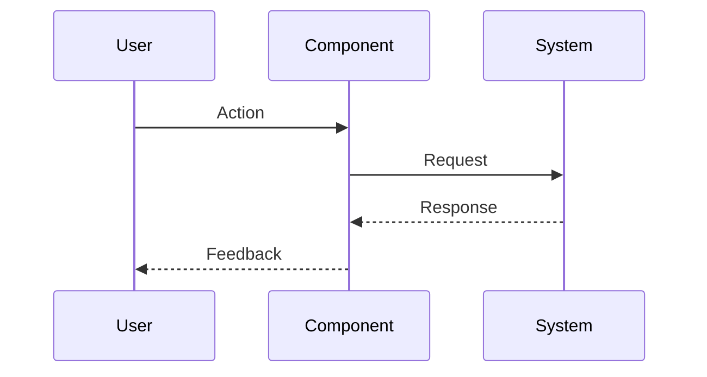

# 1{IssueID} - Feature: {Title}

<!-- Template Metadata
Last Updated: 2026-02-02
Updated By: Issue #117 fix
Update Reason: Moved Verification & Testing to Section 10 (was Section 11) to match 0702c review prompt and testing workflow expectations
Previous: Added sections based on 80 blocking issues from 164 governance verdicts (2026-02-01)
-->

## 1. Context & Goal
* **Issue:** #{IssueID}
* **Objective:** {One sentence}
* **Status:** Draft | In Progress | Complete
* **Related Issues:** {#XX, #YY if applicable}

### Open Questions
*Questions that need clarification before or during implementation. Remove when resolved.*

- [ ] {Question 1}
- [ ] {Question 2}

## 2. Proposed Changes

*This section is the **source of truth** for implementation. Describe exactly what will be built.*

### 2.1 Files Changed

| File | Change Type | Description |
|------|-------------|-------------|
| `{path/to/file.py}` | Add / Modify / Delete | {Brief description} |

### 2.2 Dependencies

*New packages, APIs, or services required.*

```toml
# pyproject.toml additions (if any)
{package} = "^{version}"
```

### 2.3 Data Structures

```python
# Pseudocode - NOT implementation
class ExampleState(TypedDict):
    field_name: type  # Description
```

### 2.4 Function Signatures

```python
# Signatures only - implementation in source files
def function_name(param: Type) -> ReturnType:
    """Brief description of purpose."""
    ...
```

### 2.5 Logic Flow (Pseudocode)

```
1. Receive input
2. Validate input
3. IF condition THEN
   - Do A
   ELSE
   - Do B
4. Return result
```

### 2.6 Technical Approach

* **Module:** `src/...`
* **Pattern:** {Design pattern if applicable}
* **Key Decisions:** {Brief rationale for approach}

### 2.7 Architecture Decisions

*Document key architectural decisions that affect the design. This section addresses the most common category of governance feedback (23 patterns).*

| Decision | Options Considered | Choice | Rationale |
|----------|-------------------|--------|-----------|
| {e.g., State management} | {Option A, Option B} | {Chosen option} | {Why this choice} |
| {e.g., Data flow pattern} | {Sync, Async, Event-driven} | {Chosen option} | {Why this choice} |

**Architectural Constraints:**
- {Constraint 1: e.g., Must integrate with existing X system}
- {Constraint 2: e.g., Cannot introduce new external dependencies}

## 3. Requirements

*What must be true when this is done. These become acceptance criteria.*

1. {Requirement 1}
2. {Requirement 2}
3. {Requirement 3}

## 4. Alternatives Considered

| Option | Pros | Cons | Decision |
|--------|------|------|----------|
| {Option A} | {pros} | {cons} | **Selected** / Rejected |
| {Option B} | {pros} | {cons} | Selected / **Rejected** |

**Rationale:** {Why the selected option was chosen}

## 5. Data & Fixtures

*Per [0108-lld-pre-implementation-review.md](0108-lld-pre-implementation-review.md) - complete this section BEFORE implementation.*

### 5.1 Data Sources

| Attribute | Value |
|-----------|-------|
| Source | {URL, API, database, user input, etc.} |
| Format | {JSON, CSV, API response, etc.} |
| Size | {Approximate size or record count} |
| Refresh | {Manual, scheduled, real-time} |
| Copyright/License | {License or "N/A"} |

### 5.2 Data Pipeline

```
{Source} ──{method}──► {Transform} ──{method}──► {Destination}
```

### 5.3 Test Fixtures

| Fixture | Source | Notes |
|---------|--------|-------|
| {e.g., Mock API response} | {Generated / Downloaded / Hardcoded} | {Data hygiene concerns?} |

### 5.4 Deployment Pipeline

{How does data get from dev → test → production?}

**If data source is external:** Is a separate utility needed? Create issue if yes.

## 6. Diagram
*{Write "N/A" if not applicable - do not delete sections}*

### 6.1 Mermaid Quality Gate

Before finalizing any diagram, verify in [Mermaid Live Editor](https://mermaid.live) or GitHub preview:

- [ ] **Simplicity:** Similar components collapsed (per 0006 §8.1)
- [ ] **No touching:** All elements have visual separation (per 0006 §8.2)
- [ ] **No hidden lines:** All arrows fully visible (per 0006 §8.3)
- [ ] **Readable:** Labels not truncated, flow direction clear
- [ ] **Auto-inspected:** Agent rendered via mermaid.ink and viewed (per 0006 §8.5)

**Agent Auto-Inspection (MANDATORY):**

AI agents MUST render and view the diagram before committing:
1. Base64 encode diagram → fetch PNG from `https://mermaid.ink/img/{base64}`
2. Read the PNG file (multimodal inspection)
3. Document results below

**Auto-Inspection Results:**
```
- Touching elements: [ ] None / [ ] Found: ___
- Hidden lines: [ ] None / [ ] Found: ___
- Label readability: [ ] Pass / [ ] Issue: ___
- Flow clarity: [ ] Clear / [ ] Issue: ___
```

*Reference: [0006-mermaid-diagrams.md](0006-mermaid-diagrams.md)*

### 6.2 Diagram



## 7. Security & Safety Considerations

*This section addresses security (10 patterns) and safety (9 patterns) concerns from governance feedback.*

### 7.1 Security

| Concern | Mitigation | Status |
|---------|------------|--------|
| {e.g., Input injection} | {e.g., Sanitize all inputs} | Addressed / Pending |
| {e.g., Auth bypass} | {e.g., Validate tokens} | Addressed / Pending |

### 7.2 Safety

*Safety concerns focus on preventing data loss, ensuring fail-safe behavior, and protecting system integrity.*

| Concern | Mitigation | Status |
|---------|------------|--------|
| {e.g., Data loss on failure} | {e.g., Transaction rollback, backup before modify} | Addressed / Pending |
| {e.g., Runaway process} | {e.g., Timeout limits, circuit breakers} | Addressed / Pending |
| {e.g., Resource exhaustion} | {e.g., Rate limiting, queue bounds} | Addressed / Pending |

**Fail Mode:** {Fail Open / Fail Closed} - {Justification}

**Recovery Strategy:** {How to recover from partial failures}

## 8. Performance & Cost Considerations

*This section addresses performance and cost concerns (6 patterns) from governance feedback.*

### 8.1 Performance

| Metric | Budget | Approach |
|--------|--------|----------|
| Latency | {e.g., < 500ms} | {How achieved} |
| Memory | {e.g., < 128MB} | {How achieved} |
| API Calls | {e.g., 1 per request} | {How minimized} |

**Bottlenecks:** {Known performance concerns}

### 8.2 Cost Analysis

| Resource | Unit Cost | Estimated Usage | Monthly Cost |
|----------|-----------|-----------------|--------------|
| {e.g., LLM API calls} | {$X per 1K tokens} | {N calls/day} | {$X} |
| {e.g., Cloud compute} | {$X per hour} | {N hours} | {$X} |
| {e.g., Storage} | {$X per GB} | {N GB} | {$X} |

**Cost Controls:**
- [ ] Budget alerts configured at {$X threshold}
- [ ] Rate limiting prevents runaway costs
- [ ] Fallback to cheaper alternatives when appropriate

**Worst-Case Scenario:** {What happens if usage spikes 10x? 100x?}

## 9. Legal & Compliance

*This section addresses legal concerns (8 patterns) from governance feedback.*

| Concern | Applies? | Mitigation |
|---------|----------|------------|
| PII/Personal Data | Yes / No / N/A | {e.g., Data anonymization, consent collection} |
| Third-Party Licenses | Yes / No / N/A | {e.g., License compatibility verified} |
| Terms of Service | Yes / No / N/A | {e.g., API usage within ToS limits} |
| Data Retention | Yes / No / N/A | {e.g., Auto-delete after X days} |
| Export Controls | Yes / No / N/A | {e.g., No restricted data/algorithms} |

**Data Classification:** {Public / Internal / Confidential / Restricted}

**Compliance Checklist:**
- [ ] No PII stored without consent
- [ ] All third-party licenses compatible with project license
- [ ] External API usage compliant with provider ToS
- [ ] Data retention policy documented

## 10. Verification & Testing

*Ref: [0005-testing-strategy-and-protocols.md](0005-testing-strategy-and-protocols.md)*

**Testing Philosophy:** Strive for 100% automated test coverage. Manual tests are a last resort for scenarios that genuinely cannot be automated (e.g., visual inspection, hardware interaction). Every scenario marked "Manual" requires justification.

### 10.0 Test Plan (TDD - Complete Before Implementation)

**TDD Requirement:** Tests MUST be written and failing BEFORE implementation begins.

| Test ID | Test Description | Expected Behavior | Status |
|---------|------------------|-------------------|--------|
| T010 | {test name} | {what it verifies} | RED / GREEN |
| T020 | {test name} | {what it verifies} | RED / GREEN |
| T030 | {test name} | {what it verifies} | RED / GREEN |

**Coverage Target:** ≥95% for all new code

**TDD Checklist:**
- [ ] All tests written before implementation
- [ ] Tests currently RED (failing)
- [ ] Test IDs match scenario IDs in 10.1
- [ ] Test file created at: `tests/unit/test_{module}.py`

*Note: Update Status from RED to GREEN as implementation progresses. All tests should be RED at LLD review time.*

### 10.1 Test Scenarios

| ID | Scenario | Type | Input | Expected Output | Pass Criteria |
|----|----------|------|-------|-----------------|---------------|
| 010 | {Happy path} | Auto | {input} | {output} | {criteria} |
| 020 | {Edge case} | Auto | {input} | {output} | {criteria} |
| 030 | {Error case} | Auto | {input} | {output} | {criteria} |

*Note: Use 3-digit IDs with gaps of 10 (010, 020, 030...) to allow insertions.*

**Type values:**
- `Auto` - Fully automated, runs in CI (pytest, playwright, etc.)
- `Auto-Live` - Automated but hits real external services (may be slow/flaky)
- `Manual` - Requires human execution (MUST include justification why automation is impossible)

### 10.2 Test Commands

```bash
# Run all automated tests
poetry run pytest tests/test_{module}.py -v

# Run only fast/mocked tests (exclude live)
poetry run pytest tests/test_{module}.py -v -m "not live"

# Run live integration tests
poetry run pytest tests/test_{module}.py -v -m live
```

### 10.3 Manual Tests (Only If Unavoidable)

**If no manual tests required:** Write "N/A - All scenarios automated."

**If manual tests exist, justify each:**

| ID | Scenario | Why Not Automated | Steps |
|----|----------|-------------------|-------|
| {ID} | {scenario} | {e.g., requires visual inspection of PDF} | {steps} |

*Full test results recorded in Implementation Report (0103) or Test Report (0113).*

## 11. Risks & Mitigations

| Risk | Impact | Likelihood | Mitigation |
|------|--------|------------|------------|
| {Risk description} | High/Med/Low | High/Med/Low | {How addressed} |

## 12. Definition of Done

### Code
- [ ] Implementation complete and linted
- [ ] Code comments reference this LLD

### Tests
- [ ] All test scenarios pass
- [ ] Test coverage meets threshold

### Documentation
- [ ] LLD updated with any deviations
- [ ] Implementation Report (0103) completed
- [ ] Test Report (0113) completed if applicable

### Review
- [ ] Code review completed
- [ ] User approval before closing issue

---

## Appendix: Review Log

*Track all review feedback with timestamps and implementation status.*

<!-- Note: Timestamps are auto-generated by the workflow. Do not fill in manually. -->

### {Reviewer} Review #{N} ({VERDICT})

**Reviewer:** {Gemini / Orchestrator / Other}
**Verdict:** {APPROVED / REJECTED / FEEDBACK}

#### Comments

| ID | Comment | Implemented? |
|----|---------|--------------|
| {R}{N}.1 | "{Quote or summary of comment}" | YES - {where addressed} / PENDING / NO - {reason} |
| {R}{N}.2 | "{Comment}" | {status} |

*Repeat section for each review round. Use IDs like G1.1 (Gemini Review 1, Comment 1), O2.3 (Orchestrator Review 2, Comment 3).*

### Review Summary

<!-- Note: This table is auto-populated by the workflow with actual review dates. -->

| Review | Date | Verdict | Key Issue |
|--------|------|---------|-----------|
| {Reviewer} #{N} | (auto) | {verdict} | {one-line summary} |

**Final Status:** PENDING
<!-- Note: This field is auto-updated to APPROVED by the workflow when finalized -->
