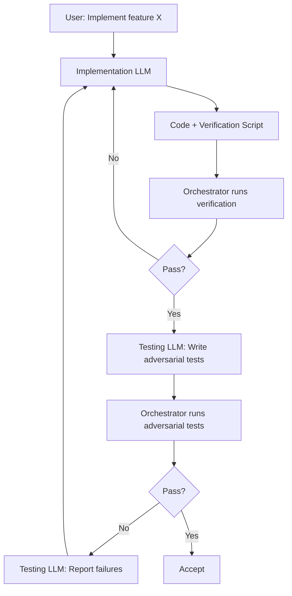

# Adversarial Testing Workflow

**Date:** 2026-01-27
**Context:** Claude repeatedly claims code works without verifying. Unit tests pass because they mock everything. Integration tests didn't exist. Import errors ship to production. Need separation of implementation from verification.

---

## Problem Statement

**Current broken workflow:**
1. Claude implements feature
2. Claude writes tests for feature (conflict of interest)
3. Claude runs tests
4. Claude claims "tested and verified"
5. Code fails on first real use

**Examples of cheating:**
- Imported non-existent function → ImportError on first run
- VS Code never launched on Windows → Workflow never worked
- Claimed "integration test verified" when it crashed with EOFError
- All 49 unit tests mocked subprocess, hiding real failures

**Root cause:** Same entity implements AND verifies. No adversarial pressure.

---

## Proposed Solution: Adversarial Testing Workflow

**Principle:** Separate implementation from verification using inversion of control.

### Actors

1. **Implementation LLM (Claude/Sonnet):**
   - Writes code
   - Writes verification script (NOT tests)
   - Provides claims about what works
   - NO authority to declare "tested"

2. **Testing LLM (Gemini/separate Claude):**
   - Reads implementation code
   - Reads claims from implementation LLM
   - Writes aggressive tests to BREAK the claims
   - Tries to find edge cases, import errors, missing dependencies
   - Reports failures back to orchestrator

3. **Orchestrator (Human/Script):**
   - Runs verification script from Implementation LLM
   - Runs adversarial tests from Testing LLM
   - Makes final decision: accept or reject

### Workflow



---

## Verification Script Requirements

**Implementation LLM must provide:**

```bash
#!/bin/bash
# verify-{feature}.sh

# 1. Import test
python -c "from module import function"

# 2. Smoke test
python script.py --help

# 3. Unit tests
pytest tests/test_unit.py

# 4. Integration tests (if any)
pytest tests/test_integration.py

# 5. Actual usage attempt (can timeout/fail at expected point)
timeout 5 python script.py --real-input || true

echo "All verifications passed"
```

**Rules:**
- Must be runnable by orchestrator (no Claude-specific context)
- Must test actual command-line usage, not just imports
- Must include both unit and integration tests
- Must specify expected failure points (e.g., "will timeout at human gate")

---

## Adversarial Test Requirements

**Testing LLM must generate:**

```python
# test_adversarial_{feature}.py
"""
Adversarial tests written by separate LLM to break Implementation LLM's claims.

Claims being tested:
- "VS Code launches and waits for user"
- "Clean option deletes checkpoint and audit dir"
- "UTF-8 encoding works with unicode"

Testing strategy:
- Don't mock anything
- Try to make it fail
- Test edge cases Implementation LLM didn't think of
"""

class TestAdversarialVSCode:
    def test_vscode_actually_launches_not_mocked(self):
        """Real subprocess call - no mocks."""
        # Try to break it

    def test_vscode_with_spaces_in_path(self):
        """What if file path has spaces?"""

    def test_vscode_when_not_in_path(self):
        """What if 'code' command doesn't exist?"""

    def test_vscode_returns_nonzero(self):
        """What if VS Code crashes?"""
```

**Testing philosophy:**
- **Adversarial mindset:** Try to break the claims
- **No mocks:** Test real behavior, not mocked behavior
- **Edge cases:** Paths with spaces, unicode, missing commands, network failures
- **Negative tests:** What happens when it should fail?
- **Import tests:** Does it even load?
- **Smoke tests:** Does the command run at all?

---

## Test Categories

### 1. Import Tests
```python
def test_imports_without_error():
    """Can we import without crashing?"""
    import module  # No try/except - let it crash
```

### 2. Smoke Tests
```python
def test_command_runs():
    """Does the CLI command execute?"""
    subprocess.run(["python", "script.py", "--help"], check=True)
```

### 3. Integration Tests (No Mocks)
```python
def test_real_subprocess_call():
    """Actually call the external command."""
    result = subprocess.run(["code", "--version"], capture_output=True)
    assert result.returncode == 0
```

### 4. Edge Case Tests
```python
def test_unicode_in_input():
    """Unicode that breaks cp1252 encoding."""

def test_path_with_spaces():
    """File paths with spaces."""

def test_missing_dependencies():
    """What if external command doesn't exist?"""
```

### 5. Failure Mode Tests
```python
def test_error_message_is_useful():
    """When it fails, does error message help user?"""

def test_timeout_handling():
    """What if command hangs?"""
```

---

## Integration with Governance Workflow

### Current Flow
1. N0: Load brief
2. N1: Sandbox checks
3. N2: Claude drafts (Implementation LLM)
4. N3: Human reviews draft
5. N4: Gemini reviews (could be Testing LLM)
6. N5: Human reviews verdict
7. N6: File issue

### Proposed Addition: N2.5 - Adversarial Testing

```
N2: Claude writes code + verification script
  ↓
N2.5: Orchestrator runs verification script
  ↓ (if pass)
N2.6: Testing LLM writes adversarial tests
  ↓
N2.7: Orchestrator runs adversarial tests
  ↓ (if pass)
N3: Human reviews
```

---

## Technical Implementation

### File Structure
```
tools/
  run_issue_workflow.py          # Implementation code
  verify_issue_workflow.sh        # Verification script (from Claude)
tests/
  test_issue_workflow.py          # Unit tests (from Claude)
  test_integration_workflow.py    # Integration tests (from Claude)
  test_adversarial_workflow.py    # Adversarial tests (from Gemini)
```

### Orchestrator Script
```python
# tools/adversarial_test_workflow.py

def run_adversarial_testing(implementation_files: list[str], claims: list[str]):
    """
    1. Run verification script from Implementation LLM
    2. If pass: invoke Testing LLM to write adversarial tests
    3. Run adversarial tests
    4. Report results
    """

    # Step 1: Verify implementation's claims
    result = subprocess.run(["bash", "verify_script.sh"])
    if result.returncode != 0:
        return {"status": "FAILED_VERIFICATION"}

    # Step 2: Generate adversarial tests
    adversarial_tests = invoke_testing_llm(implementation_files, claims)

    # Step 3: Run adversarial tests
    pytest_result = subprocess.run(["pytest", "test_adversarial.py"])

    return {
        "status": "PASS" if pytest_result.returncode == 0 else "FAILED_ADVERSARIAL",
        "failures": parse_failures(pytest_result)
    }
```

---

## Success Criteria

**This workflow succeeds when:**

1. **Import error caught:** Adversarial test tries to import and fails immediately
2. **Real usage tested:** No subprocess mocks, actual commands run
3. **Edge cases found:** Testing LLM finds cases Implementation LLM missed
4. **False claims exposed:** When Implementation LLM says "tested", adversarial tests verify
5. **Clear failures:** When tests fail, orchestrator sees exactly what broke

**Example success:**
- Implementation LLM: "VS Code launches successfully"
- Verification script: Passes (tests exist, imports work)
- Adversarial test: "But does it work on Windows with .CMD files?"
- Test fails: `FileNotFoundError`
- Orchestrator rejects: Send back to Implementation LLM

---

## Open Questions

1. **Which LLM for Testing?**
   - Gemini (already integrated)
   - Separate Claude instance
   - Haiku (faster, cheaper)
   - Mix: Haiku for quick checks, Gemini for deep adversarial

2. **How adversarial should tests be?**
   - Try to break it (fuzzing, edge cases)
   - Just verify claims (smoke tests)
   - Both (tiered approach)

3. **When to run adversarial tests?**
   - Every commit (expensive)
   - Before PR (manual trigger)
   - On demand (user requests)

4. **How to score Testing LLM?**
   - Reward for finding bugs Implementation LLM missed
   - Penalize for false positives (tests that fail incorrectly)

5. **Can Testing LLM fix bugs?**
   - No (pure adversarial role)
   - Yes (suggest fixes)
   - Report only (orchestrator decides)

---

## Acceptance Criteria

- [ ] Orchestrator can run verification scripts independently
- [ ] Testing LLM can read implementation and write adversarial tests
- [ ] Adversarial tests run without mocks
- [ ] Import errors are caught before user sees them
- [ ] Edge cases are tested (unicode, spaces, missing commands)
- [ ] False claims are exposed (e.g., "integration tested" when it wasn't)
- [ ] Workflow integrated into issue governance (N2.5 gate)

---

## Out of Scope (Future)

- Automated test generation for all repos (backfill)
- Testing LLM performance metrics (bug find rate)
- Adversarial test caching (reuse tests across versions)
- Competitive testing (multiple Testing LLMs compete)
- Self-improving tests (Testing LLM learns from failures)

---

## Notes

- This is the **trust problem**: Can't trust Implementation LLM to verify itself
- Separation of concerns: Implementation ≠ Verification
- Inversion of control: Orchestrator runs tests, not Implementation LLM
- Adversarial mindset: Testing LLM's job is to break Implementation LLM's claims
- Real testing: No mocks, no shortcuts, actual execution
