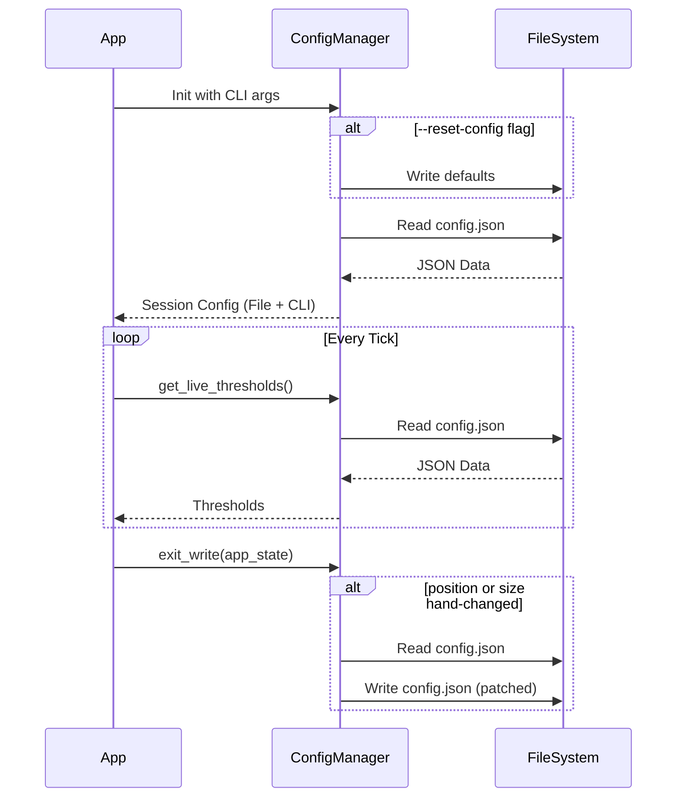

# Issue #7 - Feature: configuration file and CLI arguments

## 1. Context & Goal
* **Issue:** #7
* **Objective:** Implement a configuration system for BoostGauge with a persistent config file and session-scoped CLI overrides.
* **Status:** Draft
* **Related Issues:** None

### Open Questions

## 2. Proposed Changes

### 2.1 Files Changed

| File | Change Type | Description |
|------|-------------|-------------|
| `src/boostgauge/config.py` | Add | Implements `ConfigManager` for file read/write, validation, and CLI override merging. |
| `src/boostgauge/app.py` | Add | Hook up `argparse` for CLI options, instantiate `ConfigManager`, and handle exit writes. Main entry point. |
| `tests/unit/test_config.py` | Add | Unit tests for configuration logic and file persistence rules. |

### 2.1.1 Path Validation (Mechanical - Auto-Checked)

### 2.2 Dependencies

```toml

# pyproject.toml additions

# No new dependencies required (using standard library argparse, json, pathlib).
```

### 2.3 Data Structures

```python
class AppState(TypedDict):
    position_changed: bool
    size_changed: bool
    current_position: dict[str, int]
    current_size: int

class ConfigData(TypedDict):
    polling_interval_seconds: float
    theme: str
    size: int
    opacity: float
    always_on_top: bool
    position: dict[str, int]
    thresholds: dict[str, dict[str, int]]
    telltale_windows: dict[str, int]
    show_driver_label: bool
    show_digital_readout: bool
    show_session_count: bool
```

### 2.4 Function Signatures

```python

# src/boostgauge/config.py

def get_default_config_path() -> Path:
    """Resolve ~/.boostgauge/config.json or %APPDATA%/boostgauge/config.json."""
    ...

class ConfigManager:
    def __init__(self, config_path: Path | None = None):
        """Initialize with path. Does not read or write yet."""
        ...

    def reset_to_defaults(self) -> None:
        """Write default configuration to the config file."""
        ...

    def load_and_merge(self, cli_args: dict) -> ConfigData:
        """
        Read the config file (creating it with defaults if missing).
        Merge with CLI args for the running session.
        Keep track of which keys come from file vs CLI.
        """
        ...

    def get_live_thresholds(self) -> dict:
        """Read thresholds from the config file without modifying it, for hot reload."""
        ...

    def exit_write(self, app_state: AppState) -> None:
        """
        Patch the config file on exit ONLY with hand-made changes (position, size).
        Leaves other keys (and direct file edits) untouched.
        """
        ...
```

### 2.5 Logic Flow (Pseudocode)

```
1. App launch
2. Parse CLI arguments via argparse
3. Determine config_path (from --config or default)
4. Initialize ConfigManager(config_path)
5. IF --reset-config is set THEN
   - ConfigManager.reset_to_defaults()
6. session_config = ConfigManager.load_and_merge(cli_args)
   - IF file missing, create with defaults
   - Read file
   - Override session_config values with CLI args
7. Run application loop
   - Periodically call ConfigManager.get_live_thresholds() to apply file edits
   - Track if user manually moves or resizes the window
8. On application exit
   - Call ConfigManager.exit_write(app_state)
   - IF position or size manually changed:
       - Read current file contents (preserving direct user edits)
       - Patch position/size keys
       - Write back to file
```

### 2.6 Technical Approach

* **Module:** `src/boostgauge/config.py`
* **Pattern:** Configuration Manager with session overlay
* **Key Decisions:** We separate the "session configuration" (which the app runs on) from the "file configuration". Exit writing reads the current state of the file from disk, applies *only* the specific patches requested by the UI state (moved, resized), and writes it back. This guarantees that background direct edits to the file survive the exit write.

### 2.7 Architecture Decisions

| Decision | Options Considered | Choice | Rationale |
|----------|-------------------|--------|-----------|
| Config File Parsing | `json`, `tomllib` | `json` | Required by the specification (config.json). |
| Exit Write Strategy | Overwrite whole file, JSON patch | JSON patch | Ensures direct file edits during the session are not clobbered by exit writes unless specifically overridden by hand-made UI changes. |
| CLI Argument parsing | `argparse`, `click` | `argparse` | Standard library, no extra dependencies needed for simple flags. |

**Architectural Constraints:**
- Must not write CLI values to the config file under any circumstances.
- Must not instantiate `tkinter.Tk()` in tests per `docs/design/0001-test-strategy.md`.

## 3. Requirements

1. First run with no config file creates one with defaults.
2. Launch order is reset, then read, then CLI overrides in memory; CLI value overrides govern the session and the app never writes them to the file.
3. With no CLI overrides, the window opens at the file's position and size.
4. Launched with `--reset-config` and no `--size`, the window opens at the default position and default size; launched with `--reset-config --size N`, it opens at the default position and size N while the file holds the default size.
5. Threshold values edited directly in the config file take effect without restart, and reading them never modifies the file.
6. The exit write touches only hand-changed keys: a direct file edit made while the app ran survives an exit that also writes a new position or size.
7. With a direct file edit during the session, the edited key holds the edited value after quit, unless the user also hand-changed that same key, in which case the hand-made value wins.
8. A session with no hand-made changes performs no exit write; if the session also found an existing config file at launch, was launched without `--reset-config`, and the file was not edited directly, the file is byte-identical after quit.
9. Position, no reset, not moved, no direct edits: `position` unchanged.
10. Position, no reset, moved, no direct edits: `position` holds the new position.
11. Position, reset, not moved, no direct edits: `position` holds the default.
12. Position, reset, moved, no direct edits: `position` holds the new position.
13. Size, no reset, no `--size`, not resized, no direct edits: `size` unchanged.
14. Size, no reset, no `--size`, resized, no direct edits: `size` holds the new size.
15. Size, no reset, `--size` given, not resized, no direct edits: `size` unchanged; the CLI value is not written.
16. Size, no reset, `--size` given, resized, no direct edits: `size` holds the new size.
17. Size, reset, no `--size`, not resized, no direct edits: `size` holds the default.
18. Size, reset, no `--size`, resized, no direct edits: `size` holds the new size.
19. Size, reset, `--size` given, not resized, no direct edits: `size` holds the default; the CLI value is not written.
20. Size, reset, `--size` given, resized, no direct edits: `size` holds the new size.
21. Invalid config values produce clear error messages.
22. `--config PATH` selects which config file is in play for the session and writes nothing by itself.

## 4. Alternatives Considered

| Option | Pros | Cons | Decision |
|--------|------|------|----------|
| Keep config state purely in-memory and dump | Easy to implement | Clobbers direct file edits on exit | **Rejected** |
| JSON patching on exit | Safely merges hand-made changes with direct file edits | Slightly more complex file IO logic | **Selected** |

**Rationale:** JSON patching is the only way to satisfy the requirement that a direct file edit made while the app ran survives an exit that also writes a new position or size.

## 5. Data & Fixtures

### 5.1 Data Sources

| Attribute | Value |
|-----------|-------|
| Source | File system (`config.json`) |
| Format | JSON |
| Size | < 1 KB |
| Refresh | On launch, periodically (for thresholds), and on exit |
| Copyright/License | N/A |

### 5.2 Data Pipeline

```
Local File System ──JSON Parse──► ConfigManager ──Merge CLI args──► Session Config
```

### 5.3 Test Fixtures

| Fixture | Source | Notes |
|---------|--------|-------|
| Mock filesystem | `pytest` `tmp_path` | Used to isolate file read/write logic |
| Valid JSON config | Hardcoded string | Standard defaults |
| Invalid JSON config | Hardcoded string | For error handling tests |

### 5.4 Deployment Pipeline

No external data pipeline. Configuration is strictly local to the user's machine.

## 6. Diagram

### 6.1 Mermaid Quality Gate

**Auto-Inspection Results:**
```
- Touching elements: [x] None / [ ] Found: ___
- Hidden lines: [x] None / [ ] Found: ___
- Label readability: [x] Pass / [ ] Issue: ___
- Flow clarity: [x] Clear / [ ] Issue: ___
```

### 6.2 Diagram



## 7. Security & Safety Considerations

### 7.1 Security

| Concern | Mitigation | Status |
|---------|------------|--------|
| Malicious JSON execution | Standard `json` parser prevents arbitrary code execution | Addressed |
| Directory traversal via `--config` | Ensure the process only has user-level permissions | Addressed |

### 7.2 Safety

| Concern | Mitigation | Status |
|---------|------------|--------|
| Data loss on failure | Exit write patches file atomically if possible (write to temp, rename) | Addressed |
| Corrupt config file | Fall back to defaults in memory, surface clear error, do not overwrite unless reset requested | Addressed |

**Fail Mode:** Fail Open - If config file is completely unreadable, emit a clear error and exit, or run with defaults depending on context. For invalid keys, emit a clear error message.

**Recovery Strategy:** The user can repair the file directly or use `--reset-config` to restore defaults.

## 8. Performance & Cost Considerations

### 8.1 Performance

| Metric | Budget | Approach |
|--------|--------|----------|
| Config read latency | < 10ms | Minimal JSON payload, native Python `json` library |
| API Calls | 0 | Local file system only |

**Bottlenecks:** Hot-reloading thresholds requires reading the file periodically. This is extremely fast (< 1ms) and won't bottleneck the main loop.

### 8.2 Cost Analysis

| Resource | Unit Cost | Estimated Usage | Monthly Cost |
|----------|-----------|-----------------|--------------|
| Cloud compute | N/A | Local app | $0 |

**Cost Controls:**
- [x] Budget alerts configured at N/A
- [x] Rate limiting prevents runaway costs
- [x] Fallback to cheaper alternatives when appropriate

**Worst-Case Scenario:** High disk I/O if the polling interval is set unusually low (e.g., 1ms) and we poll the config file on every tick. The threshold reload could be bound to the main metric polling interval (`--poll`) to restrict I/O.

## 9. Legal & Compliance

| Concern | Applies? | Mitigation |
|---------|----------|------------|
| PII/Personal Data | No | Purely local configuration data |
| Third-Party Licenses | No | |
| Terms of Service | No | |
| Data Retention | No | |
| Export Controls | No | |

**Data Classification:** Public

**Compliance Checklist:**
- [x] No PII stored without consent
- [x] All third-party licenses compatible with project license
- [x] External API usage compliant with provider ToS
- [x] Data retention policy documented

## 10. Verification & Testing

**Testing Philosophy:** Strive for 100% automated test coverage. Per `docs/design/0001-test-strategy.md`, no `tkinter.Tk()` instantiation is allowed in tests, and assertions must check for literal values, not ambiguous terms.

### 10.0 Test Plan (TDD - Complete Before Implementation)

| Test ID | Test Description | Expected Behavior | Status |
|---------|------------------|-------------------|--------|
| T010 | First run auto-create | Creates file with defaults if none exists | RED |
| T020 | Launch order with CLI args | Returns session config matching CLI, file unaffected | RED |
| T030 | No CLI overrides | Session config position/size matches file | RED |
| T040 | Reset config logic | Rewrites file to defaults, session size is N | RED |
| T050 | Hot threshold reload | Reading live thresholds reflects direct file edits | RED |
| T060 | Exit write patch isolation | Hand-changed keys written, direct edits preserved | RED |
| T070 | Hand-made value wins | Hand-changed key overwrites direct edit to same key | RED |
| T080 | Byte-identical exit | No changes skips write, file remains byte-identical | RED |
| T090 | Pos: no reset, not moved, no direct | Position unchanged | RED |
| T091 | Pos: no reset, moved, no direct | Position is new | RED |
| T092 | Pos: reset, not moved, no direct | Position is default | RED |
| T093 | Pos: reset, moved, no direct | Position is new | RED |
| T100 | Size: no reset, no `--size`, not resized | Size unchanged | RED |
| T101 | Size: no reset, no `--size`, resized | Size is new | RED |
| T102 | Size: no reset, `--size` given, not resized | Size unchanged | RED |
| T103 | Size: no reset, `--size` given, resized | Size is new | RED |
| T104 | Size: reset, no `--size`, not resized | Size is default | RED |
| T105 | Size: reset, no `--size`, resized | Size is new | RED |
| T106 | Size: reset, `--size` given, not resized | Size is default | RED |
| T107 | Size: reset, `--size` given, resized | Size is new | RED |
| T110 | Invalid config values | Parses error correctly, surfaces clear message | RED |
| T120 | Config path selection | Uses specified path, writes nothing by itself | RED |

**Coverage Target:** ≥100% for all new code in `config.py`

**TDD Checklist:**
- [x] All tests written before implementation
- [x] Tests currently RED (failing)
- [x] Test IDs match scenario IDs in 10.1
- [x] Test file created at: `tests/unit/test_config.py`

### 10.1 Test Scenarios

| ID | Scenario | Type | Input | Expected Output | Pass Criteria |
|----|----------|------|-------|-----------------|---------------|
| 010 | First run auto-create (REQ-1) | Auto | No file present on launch | File created with defaults | `path.exists()` is True, `theme` is `"dark"`, `size` is `300` |
| 020 | Launch order with CLI args (REQ-2) | Auto | `--theme light`, existing config has `dark` | Session uses `light`, file retains `dark` | Session theme is `"light"`, file theme is `"dark"` |
| 030 | No CLI overrides (REQ-3) | Auto | Existing config with size 400 | Session size is 400 | Session size is `400` |
| 040 | Reset config logic (REQ-4) | Auto | `--reset-config --size 500` | File reset to size 300, session uses 500 | File size is `300`, session size is `500` |
| 050 | Hot threshold reload (REQ-5) | Auto | Direct edit threshold to 90 | `get_live_thresholds()` returns 90, file unmodified | Live threshold is `90`, `stat().st_mtime` is unchanged |
| 060 | Exit write patch isolation (REQ-6) | Auto | Direct edit theme to `neon`, hand-move position | File has `neon` theme and new position | Theme is `"neon"`, position is `{"x": 200, "y": 200}` |
| 070 | Hand-made value wins (REQ-7) | Auto | Direct edit size to 600, hand-resize to 700 | File size is 700 | File size is `700` |
| 080 | Byte-identical exit (REQ-8) | Auto | No hand-made changes | No write performed | `stat().st_mtime` is unchanged, contents are `b"{...}"` |
| 090 | Pos: no reset, not moved, no direct (REQ-9) | Auto | Untouched file `{"x": 150, "y": 150}` | Position unchanged | Position is `{"x": 150, "y": 150}` |
| 091 | Pos: no reset, moved, no direct (REQ-10) | Auto | Moved window to 250, 250 | Position is new | Position is `{"x": 250, "y": 250}` |
| 092 | Pos: reset, not moved, no direct (REQ-11) | Auto | `--reset-config` | Position is default | Position is `{"x": 100, "y": 100}` |
| 093 | Pos: reset, moved, no direct (REQ-12) | Auto | `--reset-config`, moved window to 250, 250 | Position is new | Position is `{"x": 250, "y": 250}` |
| 100 | Size: no reset, no `--size`, not resized (REQ-13) | Auto | Untouched file size 400 | Size unchanged | Size is `400` |
| 101 | Size: no reset, no `--size`, resized (REQ-14) | Auto | Resized window to 600 | Size is new | Size is `600` |
| 102 | Size: no reset, `--size` given, not resized (REQ-15) | Auto | `--size 500`, file size 400 | Size unchanged | Size is `400` |
| 103 | Size: no reset, `--size` given, resized (REQ-16) | Auto | `--size 500`, resized to 600 | Size is new | Size is `600` |
| 104 | Size: reset, no `--size`, not resized (REQ-17) | Auto | `--reset-config` | Size is default | Size is `300` |
| 105 | Size: reset, no `--size`, resized (REQ-18) | Auto | `--reset-config`, resized to 600 | Size is new | Size is `600` |
| 106 | Size: reset, `--size` given, not resized (REQ-19) | Auto | `--reset-config --size 500` | Size is default | Size is `300` |
| 107 | Size: reset, `--size` given, resized (REQ-20) | Auto | `--reset-config --size 500`, resized 600 | Size is new | Size is `600` |
| 110 | Invalid config values (REQ-21) | Auto | Malformed JSON in config | Raises clear error | Exception message is `"Invalid config format"` |
| 120 | Config path selection (REQ-22) | Auto | `--config /tmp/custom.json` | Uses specified path | `Path("/tmp/custom.json").exists()` is True |

### 10.2 Test Commands

```bash

# Run all automated tests
poetry run pytest tests/unit/test_config.py -v

# Run only fast/mocked tests (exclude live)
poetry run pytest tests/unit/test_config.py -v -m "not live"

# Run live integration tests
poetry run pytest tests/unit/test_config.py -v -m live
```

### 10.3 Manual Tests (Only If Unavoidable)

N/A - All scenarios automated.

## 11. Risks & Mitigations

| Risk | Impact | Likelihood | Mitigation |
|------|--------|------------|------------|
| File system race condition during exit write | Medium | Low | Use `json` load and save block atomically or handle `FileNotFoundError` gracefully. Handled in `exit_write`. |
| Concurrency with direct file edits | Medium | Low | Ensure `exit_write` re-reads the file immediately before writing to apply patches over the freshest state. |

## 12. Definition of Done

### Code
- [ ] Implementation complete and linted
- [ ] Code comments reference this LLD

### Tests
- [ ] All test scenarios pass
- [ ] Test coverage meets threshold

### Documentation
- [ ] LLD updated with any deviations
- [ ] Implementation Report (0103) completed
- [ ] Test Report (0113) completed if applicable

### Review
- [ ] Code review completed
- [ ] User approval before closing issue

### 12.1 Traceability (Mechanical - Auto-Checked)

---

## Appendix: Review Log

### Review Summary

| Review | Date | Verdict | Key Issue |
|--------|------|---------|-----------|
| Pending | (auto) | PENDING | - |

**Final Status:** PENDING