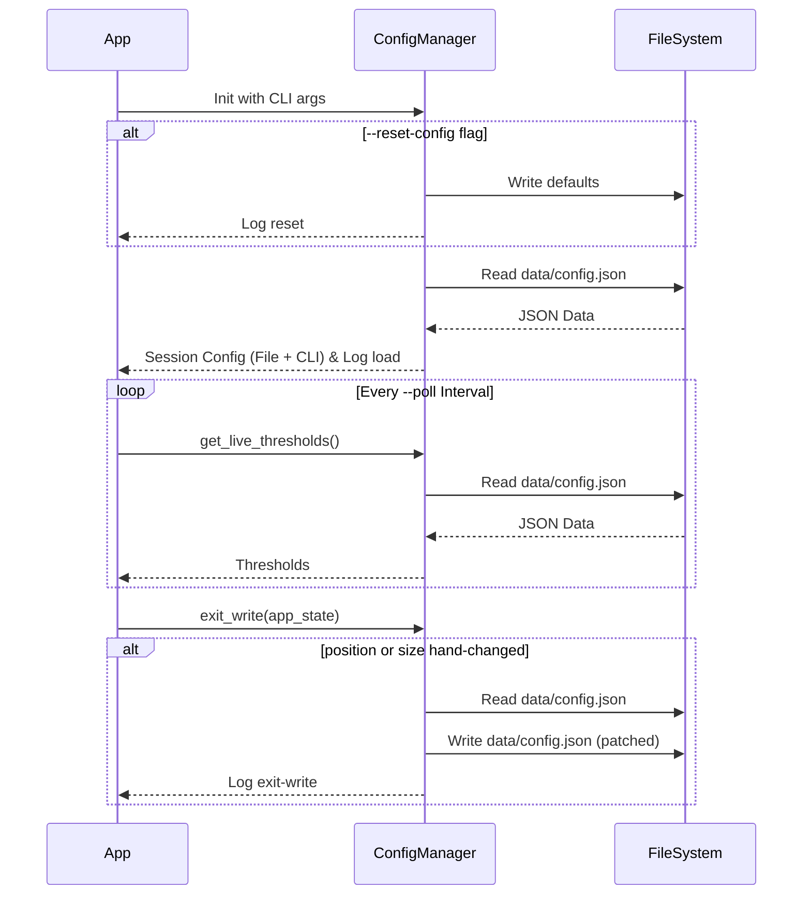

# Issue #7 - Feature: configuration file and CLI arguments

## 1. Context & Goal
* **Issue:** #7
* **Objective:** Implement a configuration system for BoostGauge with a persistent config file strictly scoped to the project worktree (`data/config.json`), and session-scoped CLI overrides.
* **Status:** Draft
* **Related Issues:** None

### Open Questions

## 2. Proposed Changes

*This section is the **source of truth** for implementation. Describe exactly what will be built.*

### 2.1 Files Changed

| File | Change Type | Description |
|------|-------------|-------------|
| `src/boostgauge/config.py` | Add | Implements `ConfigManager` for file read/write, validation, CLI override merging, and logging. |
| `src/boostgauge/app.py` | Add | Hook up `argparse` for CLI options, instantiate `ConfigManager`, enforce polling interval for config reloads, and handle exit writes. Main entry point. |
| `tests/unit/test_config.py` | Add | Unit tests for configuration logic and file persistence rules. |

### [UNCHANGED] 2.1.1 Path Validation (Mechanical - Auto-Checked)

### [UNCHANGED] 2.2 Dependencies

### [UNCHANGED] 2.3 Data Structures

### 2.4 Function Signatures

```python

# src/boostgauge/config.py

def get_default_config_path() -> Path:
    """Resolve data/config.json within the project worktree."""
    ...

class ConfigManager:
    def __init__(self, config_path: Path | None = None):
        """Initialize with path. Does not read or write yet."""
        ...

    def reset_to_defaults(self) -> None:
        """Write default configuration to the config file. Logs the action."""
        ...

    def load_and_merge(self, cli_args: dict) -> ConfigData:
        """
        Read the config file (creating it with defaults if missing, and logging it).
        Merge with CLI args for the running session.
        Keep track of which keys come from file vs CLI.
        Logs configuration loading and any fallback scenarios.
        """
        ...

    def get_live_thresholds(self) -> dict:
        """Read thresholds from the config file without modifying it, for hot reload."""
        ...

    def exit_write(self, app_state: AppState) -> None:
        """
        Patch the config file on exit ONLY with hand-made changes (position, size).
        Leaves other keys (and direct file edits) untouched.
        Logs the exit-write patching process.
        """
        ...
```

### 2.5 Logic Flow (Pseudocode)

```
1. App launch
2. Parse CLI arguments via argparse
3. Determine config_path (from --config or default `data/config.json`)
4. Initialize ConfigManager(config_path)
5. Initialize logger for configuration events
6. IF --reset-config is set THEN
   - ConfigManager.reset_to_defaults()
   - Log reset action
7. session_config = ConfigManager.load_and_merge(cli_args)
   - IF file missing, create with defaults and log creation
   - Read file
   - Override session_config values with CLI args
   - Log configuration load success or fallback to defaults on error
8. Run application loop
   - IF current tick matches the main metric polling interval (--poll):
       - Call ConfigManager.get_live_thresholds() to apply file edits
   - Track if user manually moves or resizes the window
9. On application exit
   - Call ConfigManager.exit_write(app_state)
   - IF position or size manually changed:
       - Read current file contents (preserving direct user edits)
       - Patch position/size keys
       - Write back to file atomically
       - Log exit-write patching
```

### 2.6 Technical Approach

* **Module:** `src/boostgauge/config.py`
* **Pattern:** Configuration Manager with session overlay
* **Key Decisions:** We separate the "session configuration" (which the app runs on) from the "file configuration". Exit writing reads the current state of the file from disk, applies *only* the specific patches requested by the UI state (moved, resized), and writes it back. This guarantees that background direct edits to the file survive the exit write. Configuration operations (load, create, reset, exit-write, fallback) will output structured logs for observability. The hot-reload for thresholds is bound to the main metric polling interval (`--poll`) to explicitly control I/O frequency and prevent excessive reads on every tick. All file operations are strictly scoped to the `data/config.json` path within the project worktree to prevent scope violations.

### [UNCHANGED] 2.7 Architecture Decisions

## [UNCHANGED] 3. Requirements

## 4. Alternatives Considered

| Option | Pros | Cons | Decision |
|--------|------|------|----------|
| Keep config state purely in-memory and dump | Easy to implement | Clobbers direct file edits on exit | **Rejected** |
| JSON patching on exit | Safely merges hand-made changes with direct file edits | Slightly more complex file IO logic | **Selected** |
| Read config file on every UI tick | Simplifies hot-reload logic | Causes excessive, uncontrolled I/O | **Rejected** |
| Poll config file at `--poll` interval | Controls disk I/O, aligns with existing data collection | Very slight delay in threshold updates | **Selected** |

**Rationale:** JSON patching is the only way to satisfy the requirement that a direct file edit made while the app ran survives an exit that also writes a new position or size. Binding the hot-reload to the `--poll` interval ensures we enforce I/O control and avoid the worst-case scenario of unbounded disk reads.

## 5. Data & Fixtures

### 5.1 Data Sources

| Attribute | Value |
|-----------|-------|
| Source | File system (`data/config.json`) |
| Format | JSON |
| Size | < 1 KB |
| Refresh | On launch, periodically (bound to `--poll` interval), and on exit |
| Copyright/License | N/A |

### [UNCHANGED] 5.2 Data Pipeline

### [UNCHANGED] 5.3 Test Fixtures

### 5.4 Deployment Pipeline

No external data pipeline. Configuration is strictly local to the user's project worktree.

## 6. Diagram

### 6.1 Mermaid Quality Gate

**Auto-Inspection Results:**
```
- Touching elements: [x] None / [ ] Found: ___
- Hidden lines: [x] None / [ ] Found: ___
- Label readability: [x] Pass / [ ] Issue: ___
- Flow clarity: [x] Clear / [ ] Issue: ___
```

### 6.2 Diagram



## 7. Security & Safety Considerations

### [UNCHANGED] 7.1 Security

### 7.2 Safety

| Concern | Mitigation | Status |
|---------|------------|--------|
| Data loss on failure | Exit write patches file atomically if possible (write to temp, rename) | Addressed |
| Corrupt config file | Fall back to defaults in memory, surface clear error via logs and stderr, do not overwrite unless reset requested | Addressed |
| Worktree violation | Hardcode/resolve all paths strictly relative to the project worktree (`data/config.json`) | Addressed |

**Fail Mode:** Fail Open - If config file is completely unreadable, emit a clear error, log the fallback scenario, and run with defaults depending on context. For invalid keys, emit a clear error message and log it.

**Recovery Strategy:** The user can repair the file directly or use `--reset-config` to restore defaults.

## 8. Performance & Cost Considerations

### 8.1 Performance

| Metric | Budget | Approach |
|--------|--------|----------|
| Config read latency | < 10ms | Minimal JSON payload, native Python `json` library |
| API Calls | 0 | Local file system only |

**Bottlenecks:** Hot-reloading thresholds requires reading the file periodically. This is mitigated by explicitly binding the reload to the main metric polling interval (`--poll`), ensuring it won't bottleneck the main loop or cause excessive I/O.

### 8.2 Cost Analysis

| Resource | Unit Cost | Estimated Usage | Monthly Cost |
|----------|-----------|-----------------|--------------|
| Cloud compute | N/A | Local app | $0 |

**Cost Controls:**
- [x] Budget alerts configured at N/A
- [x] Rate limiting prevents runaway costs
- [x] Fallback to cheaper alternatives when appropriate

**Worst-Case Scenario:** High disk I/O if the polling interval is set unusually low (e.g., 1ms). To mitigate this, the config reload is strictly bound to the main metric polling interval (`--poll`) instead of every application tick, providing an explicit, user-controlled upper bound on disk I/O.

## 9. Legal & Compliance

| Concern | Applies? | Mitigation |
|---------|----------|------------|
| PII/Personal Data | No | Purely local configuration data |
| Third-Party Licenses | No | |
| Terms of Service | No | |
| Data Retention | No | |
| Export Controls | No | |

**Data Classification:** Public

**Compliance Checklist:**
- [x] No PII stored without consent
- [x] All third-party licenses compatible with project license
- [x] External API usage compliant with provider ToS
- [x] Data retention policy documented

## [UNCHANGED] 10. Verification & Testing

### [UNCHANGED] 10.0 Test Plan (TDD - Complete Before Implementation)

### [UNCHANGED] 10.1 Test Scenarios

### [UNCHANGED] 10.2 Test Commands

### [UNCHANGED] 10.3 Manual Tests (Only If Unavoidable)

## [UNCHANGED] 11. Risks & Mitigations

## [UNCHANGED] 12. Definition of Done

### [UNCHANGED] Code

### [UNCHANGED] Tests

### [UNCHANGED] Documentation

### [UNCHANGED] Review

### [UNCHANGED] 12.1 Traceability (Mechanical - Auto-Checked)

## [UNCHANGED] Appendix: Review Log

### [UNCHANGED] Review Summary