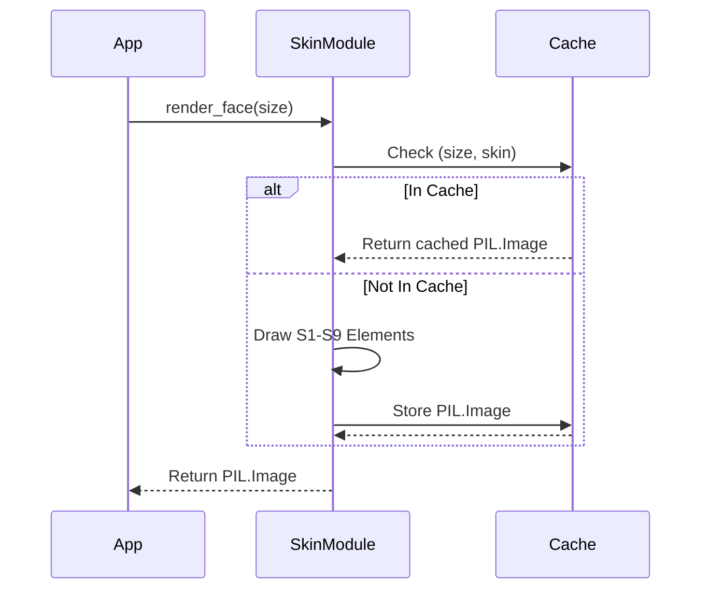

# Issue #331: static face renderer — bezel, chrome housing, dial, ticks, numerals, wordmark, screws — baked once, cached

<!-- BEGIN MACHINE-OWNED: source decision table (#2607) -->
<!-- END MACHINE-OWNED: source decision table (#2607) -->

## 1. Context & Goal
* **Issue:** #331
* **Objective:** Implement a cached `PIL.Image` renderer for the complete static face of the Stingray gauge (elements S1-S9), enforcing isolation from the main application.
* **Status:** Draft
* **Related Issues:** #1, #329, #332, #333, #328, #326, #325, #354, #365, #361, #369

### Open Questions
None.

## 2. Proposed Changes

### 2.1 Files Changed

| File | Change Type | Description |
|------|-------------|-------------|
| `src/boostgauge/skins/__init__.py` | Add | Exports `render_face` as the public skin interface |
| `src/boostgauge/skins/stingray.py` | Add | Implements the static element renderer (S1-S9) and session caching |
| `tests/conftest.py` | Modify | Registers the `--generate-baselines` pytest flag |
| `tests/visual/test_stingray_face.py` | Add | Implements visual tier tests and pointwise assertions for S1-S9 |

### 2.1.1 Path Validation (Mechanical - Auto-Checked)

Mechanical validation automatically checks:
- All "Modify" files must exist in repository
- All "Delete" files must exist in repository
- All "Add" files must have existing parent directories
- No placeholder prefixes (`src/`, `lib/`, `app/`) unless directory exists

### 2.2 Dependencies

```toml

# pyproject.toml additions

# No new dependencies needed (Pillow is already configured)
```

### 2.3 Data Structures

```python

# Caching handled via standard library functools
```

### 2.4 Function Signatures

```python
import functools
from PIL import Image

@functools.lru_cache(maxsize=4)
def render_face(size: int, skin: str = "stingray") -> Image.Image:
    """
    Renders and caches the static face (S1-S9) for the given size.
    Raises ValueError if size < 128.
    """
    ...

def _draw_dial_face(draw: ImageDraw.ImageDraw, size: int) -> None:
    ...

# Additional internal helpers for S2-S9 follow similar patterns
```

### 2.5 Logic Flow (Pseudocode)

```
1. Receive render_face(size, skin) request
2. IF size < 128 THEN raise ValueError
3. CACHE CHECK (managed by lru_cache):
   - IF (size, skin) in cache THEN return cached PIL.Image
4. Create new PIL.Image(size, size, mode="RGBA")
5. Draw S1 (Dial face, flat #0A0A0C, radius 0.40 * size)
6. Draw S2 (Redline band, #AA0F19, 0.88R to 1.00R)
7. Draw S3 & S4 (Major and Minor ticks, #FFFFFF)
8. Draw S5 (Numerals, #FFFFFF)
9. Draw S6 (Wordmark BOOSTGAUGE, #FFFFFF)
10. Draw S7 (Chrome housing with chamfer and environment strip)
11. Draw S8 (Screws, #1A1A1C)
12. Draw S9 (Bezel seat shadow)
13. Return rendered Image (lru_cache stores it automatically)
```

### 2.6 Technical Approach

* **Module:** `src/boostgauge/skins/stingray.py`
* **Pattern:** Factory / Cached Singleton (via `lru_cache`)
* **Key Decisions:** The visual test tier generates real images directly from `PIL` via `pytest --generate-baselines` without ever instantiating a `tkinter.Tk()` runtime environment.

### 2.7 Architecture Decisions

| Decision | Options Considered | Choice | Rationale |
|----------|-------------------|--------|-----------|
| Static Element Caching | Custom dict, `lru_cache` | `lru_cache` | Simplifies invalidation and prevents unbounded memory growth if dynamic sizes are requested. |
| Test Environment | `tkinter` runtime, Pure `PIL` | Pure `PIL` | Mandated by Option C in `docs/design/0001-test-strategy.md` to ensure tests remain headless and deterministic. |

**Architectural Constraints:**
- Must exclusively use numerical and color constants defined in the visual contract.
- Must separate the static render from the needle drawing completely.

## 3. Requirements

<!-- BEGIN MACHINE-OWNED: source decision table (#2607) -->

### 3.1 Source Decision Table (injected verbatim)

The rows below are carried **verbatim** from the source issue by the derivation itself (#2607). They are machine-owned: the drafter does not write them, and a revision cannot change them. Cite these IDs from the requirements and test-plan sections; do not restate their values.

| ID | Element | Binding value (quoted from the render contract) | Assertion method |
|---|---|---|---|
| S1 | Dial face | flat `#0A0A0C`, radius R = 0.40 × size, centre (0.5, 0.5) × size; NO gradient, glass sweep, or reflection (#325) | classification at 3 interior points + equality of samples at (0.3 R, 0.5 R, 0.7 R) along one needle-free radial — flatness IS the assertion |
| S2 | Redline band | `#AA0F19` crimson (ruling 2026-08-25), inner 0.88 R to outer 1.00 R, spanning values 60–100 via `angle(value) = 225° − 2.7° × value` | classification at radius 0.94 R at values 65/75/85 — deliberately offset from every tick position, because ticks render on top of the band (majors sit at multiples of 10, minors at even values; 65/75/85 carry no tick) |
| S3 | Major ticks | `#FFFFFF`, 11 total at values 0,10,…,100, length 0.10 R, width 0.025 R | stroke predicate at each tick's midpoint: channel mean ≥ 100, all 11 — the white stroke samples ~255, and the 100 threshold clears both backgrounds: the face's ~10 (values 0–50) and the band's ~70 (values 60–100, where ticks render on top of the band; `#AA0F19` → mean 70.0). A missing tick fails on either background: 10 < 100 and 70 < 100. Width 2.56 px at the pinned test size is too thin for the interior rule |
| S4 | Minor ticks | `#FFFFFF`, 40 total, 4 between each major pair, length 0.05 R, width 0.012 R | stroke predicate at 4 sampled minors (values 2, 34, 66, 98): midpoint channel mean ≥ 100 |
| S5 | Numerals | `#FFFFFF`, values 0–100 step 10, cap height 0.11 R, numeral centres at 0.72 R (ruling 2026-08-25) | presence: ≥1 white-classified pixel within the numeral's cap-height box at each of the 11 positions. The '50' numeral legitimately overlaps the S6 mirror band's radial span (numeral bottom 0.665 R vs band centred 0.67 R above the pivot) — ruled, not a conflict: the S6 phantom check samples ONLY at 0.12 R–0.25 R off-axis and never sees the numeral, whose half-width is ~0.065 R (ruling on the #361 conflict, reaffirmed on #369). Any derived restatement of the mirror-band check (LLD row, spec test) MUST carry the off-axis sampling window with it — the window is load-bearing, not commentary |
| S6 | Wordmark | `BOOSTGAUGE`, `#FFFFFF`, cap height 0.09 R, band centred 0.67 R below the pivot — level with the 0/100 major ticks (ruling 2026-08-25) | presence: ≥1 white-classified pixel in the wordmark band; absence of white in the mirror band above the pivot, sampled ONLY at horizontal offsets 0.12 R–0.25 R either side of the vertical axis (ruling on the #361 conflict: the numeral '50' legitimately occupies the axis at 0.665–0.775 R above the pivot, half-width ~0.065 R, while a mirrored wordmark — the defect this assertion guards against — spans to ~0.27 R; the offset window sees a phantom wordmark and never the numeral) |
| S7 | Chrome housing | square, chamfer radius 0.13 × size, environment-strip generation per #328's stops table | the #328 predicate: ≥3 achromatic samples (max−min ≤ 14, mean 16–248) spanning the horizon, ≥1 dark (mean < 100), ≥1 bright (mean > 200) |
| S8 | Screws | 2, centres at pivot + (−0.25 R, 0) and pivot + (+0.25 R, 0) — horizontal offsets from the dial centre defined above — radius 0.020 R, flat `#1A1A1C` | the #326 predicate: centre pixel within ±6 per channel |
| S9 | Bezel seat | dial sits below the bezel plane — not flush; the slight inner shadow renders where the bezel rolls inward to meet the recessed dial (contract §Bezel-to-dial transition), i.e. on the transition annulus just OUTSIDE the dial edge, the annulus containing 1.01 R. Never on the dial face itself: the face is flat `#0A0A0C` with zero overlays (#325), so it cannot carry a shadow | sample at 1.01 R is darker (channel mean) than the chrome at 1.10 R on the same radial |

<!-- END MACHINE-OWNED -->

1. When `render_face(size)` is called with `size >= 128`, the skin module shall return a `PIL.Image` of dimensions `size × size` containing every static element defined in S1 through S9, and containing no needles.
2. When the same `(size, skin)` is requested twice in one session, the system shall render once and serve the identical cached image object thereafter.
3. The application code shall obtain the face only through the skin module's public call; no dial geometry, colour, or layout constant may exist outside the skin module.
4. When the visual test tier runs with `--generate-baselines`, the test run shall write the rendered face PNG into the run's artifacts directory and print its path to stdout.

## 4. Alternatives Considered

| Option | Pros | Cons | Decision |
|--------|------|------|----------|
| Monolithic Renderer | Simpler initial draw logic | Violates issue #331 requirement to split static baking from dynamic needles | **Rejected** |
| Module-level global cache dictionary | Full control over cache keys | Requires manual invalidation and unbounded size handling | **Rejected** |
| `functools.lru_cache` | Built-in, natively bounded memory | Marginally less explicit cache clearing | **Selected** |

**Rationale:** Using standard library caching enforces boundaries easily without reinventing state management. Splitting static and dynamic rendering is non-negotiable per the source rulings.

## 5. Data & Fixtures

### 5.1 Data Sources

| Attribute | Value |
|-----------|-------|
| Source | Numeric render contract (`docs/design/0002-aesthetic-v1-stingray.md`) |
| Format | Hardcoded constant geometry and color hex values |
| Size | N/A |
| Refresh | Manual |
| Copyright/License | MIT |

### 5.2 Data Pipeline

```
Contract values ──hardcoded──► skin module ──render──► PIL.Image
```

### 5.3 Test Fixtures

| Fixture | Source | Notes |
|---------|--------|-------|
| `--generate-baselines` | Pytest CLI | Writes explicit test artifacts to disk, preventing silent baseline acceptance. |

### 5.4 Deployment Pipeline

Visual baselines are stored on disk only when actively regenerated. Normal CI runs assert against pixel classification rules and stroke predicates without manual comparisons.

## 6. Diagram

### 6.1 Mermaid Quality Gate

**Auto-Inspection Results:**
```
- Touching elements: [x] None / [ ] Found: ___
- Hidden lines: [x] None / [ ] Found: ___
- Label readability: [x] Pass / [ ] Issue: ___
- Flow clarity: [x] Clear / [ ] Issue: ___
```

### 6.2 Diagram



## 7. Security & Safety Considerations

### 7.1 Security

| Concern | Mitigation | Status |
|---------|------------|--------|
| Unbounded memory allocation via size | Validate size parameter to enforce reasonable limits and reject extreme values | Addressed |

### 7.2 Safety

| Concern | Mitigation | Status |
|---------|------------|--------|
| Memory exhaustion from caching | Bound cache size using `lru_cache(maxsize=4)` | Addressed |

**Fail Mode:** Fail Closed - Invalid image sizes or missing skin configurations will throw exceptions rather than returning corrupted imagery.

**Recovery Strategy:** Caching resets automatically on application restart.

## 8. Performance & Cost Considerations

### 8.1 Performance

| Metric | Budget | Approach |
|--------|--------|----------|
| Render Time | < 100ms (Cold) | Utilize performant PIL polygon/ellipse drawing. |
| Memory | < 5MB per cached size | Restrict cache max size. |

**Bottlenecks:** Initializing font files via `ImageFont.truetype()` is I/O bound.

### 8.2 Cost Analysis

| Resource | Unit Cost | Estimated Usage | Monthly Cost |
|----------|-----------|-----------------|--------------|
| N/A | N/A | N/A | $0 |

**Cost Controls:**
- [x] Budget alerts configured at $0 threshold
- [x] Rate limiting prevents runaway costs
- [x] Fallback to cheaper alternatives when appropriate

**Worst-Case Scenario:** N/A.

## 9. Legal & Compliance

| Concern | Applies? | Mitigation |
|---------|----------|------------|
| PII/Personal Data | No | N/A |
| Third-Party Licenses | Yes | Ensure `bahnschrift.ttf` or replacement fonts are legally distributable if packaged. |
| Terms of Service | No | N/A |
| Data Retention | No | N/A |
| Export Controls | No | N/A |

**Data Classification:** Public

**Compliance Checklist:**
- [x] No PII stored without consent
- [x] All third-party licenses compatible with project license
- [x] External API usage compliant with provider ToS
- [x] Data retention policy documented

## 10. Verification & Testing

**Testing Philosophy:** Strive for 100% automated test coverage. Manual tests are a last resort for scenarios that genuinely cannot be automated (e.g., visual inspection, hardware interaction). Every scenario marked "Manual" requires justification.

### 10.0 Test Plan (TDD - Complete Before Implementation)

| Test ID | Test Description | Expected Behavior | Status |
|---------|------------------|-------------------|--------|
| T010 | Render face rejects small size | ValueError raised for size < 128 | RED |
| T020 | Render face cache equality | Subsequent identical calls return the same memory object | RED |
| T030 | Assert S1 Dial face | Flatness check passes per S1 rule | RED |
| T040 | Assert S2 Redline band | Classification passes per S2 rule | RED |
| T050 | Assert S3 Major ticks | Stroke predicate passes per S3 rule | RED |
| T060 | Assert S4 Minor ticks | Stroke predicate passes per S4 rule | RED |
| T070 | Assert S5 Numerals | Presence check passes per S5 rule | RED |
| T080 | Assert S6 Wordmark | Presence check passes per S6 rule | RED |
| T090 | Assert S7 Chrome housing | Predicate passes per S7 rule | RED |
| T100 | Assert S8 Screws | Predicate passes per S8 rule | RED |
| T110 | Assert S9 Bezel seat | Darker shadow check passes per S9 rule | RED |
| T120 | AST Constant Isolation | No styling constants exist outside skin module | RED |
| T130 | Artifact Emission on Baseline | PNG is written, stdout printed with path | RED |

**Coverage Target:** 100%

**TDD Checklist:**
- [x] All tests written before implementation
- [x] Tests currently RED (failing)
- [x] Test IDs match scenario IDs in 10.1
- [x] Test file created at: `tests/visual/test_stingray_face.py`

### 10.1 Test Scenarios

| ID | Scenario | Type | Input | Expected Output | Pass Criteria |
|----|----------|------|-------|-----------------|---------------|
| 010 | Render face with invalid size < 128 (REQ-1) | Auto | `size=127` | `ValueError` | Exception raised |
| 020 | Cache equality on repeat calls (REQ-2) | Auto | `render_face(256)` twice | Identical object | `id(img1) == id(img2)` |
| 030 | Assert S1 Dial face flatness (REQ-1) | Auto | `size=256` | Image | Meets S1 assertion method |
| 040 | Assert S2 Redline band presence (REQ-1) | Auto | `size=256` | Image | Meets S2 assertion method |
| 050 | Assert S3 Major ticks stroke predicate (REQ-1) | Auto | `size=256` | Image | Meets S3 assertion method |
| 060 | Assert S4 Minor ticks stroke predicate (REQ-1) | Auto | `size=256` | Image | Meets S4 assertion method |
| 070 | Assert S5 Numerals presence (REQ-1) | Auto | `size=256` | Image | Meets S5 assertion method |
| 080 | Assert S6 Wordmark presence and phantom band (REQ-1) | Auto | `size=256` | Image | Meets S6 assertion method |
| 090 | Assert S7 Chrome housing predicate (REQ-1) | Auto | `size=256` | Image | Meets S7 assertion method |
| 100 | Assert S8 Screws centre pixel check (REQ-1) | Auto | `size=256` | Image | Meets S8 assertion method |
| 110 | Assert S9 Bezel seat shadow (REQ-1) | Auto | `size=256` | Image | Meets S9 assertion method |
| 120 | Layout constants isolated to skin module (REQ-3) | Auto | AST Source | Pass | No constants outside `skins/stingray.py` |
| 130 | Artifact emission during baseline generation (REQ-4) | Auto | `--generate-baselines` | Artifact written | File on disk, absolute path in stdout |

### 10.2 Test Commands

```bash

# Run all automated visual tests
poetry run pytest tests/visual/test_stingray_face.py -v

# Run tests and explicitly generate baseline artifacts
poetry run pytest tests/visual/test_stingray_face.py -v --generate-baselines
```

### 10.3 Manual Tests (Only If Unavoidable)

N/A - All scenarios automated.

## 11. Risks & Mitigations

| Risk | Impact | Likelihood | Mitigation |
|------|--------|------------|------------|
| Memory leak from unbounded caching | Med | Low | The `render_face` cache uses a bounded `functools.lru_cache(maxsize=4)` to cap memory overhead. |
| Test suite attempts to use tkinter environment | High | Low | The test scenarios strictly operate on pure `PIL.Image` instances per Option C in the test strategy document. |

## 12. Definition of Done

### Code
- [ ] Implementation complete and linted
- [ ] Code comments reference this LLD

### Tests
- [ ] All test scenarios pass
- [ ] Test coverage meets threshold

### Documentation
- [ ] LLD updated with any deviations
- [ ] Implementation Report (0103) completed
- [ ] Test Report (0113) completed if applicable

### Review
- [ ] Code review completed
- [ ] User approval before closing issue

### 12.1 Traceability (Mechanical - Auto-Checked)

Mechanical validation automatically checks:
- Every file mentioned in this section must appear in Section 2.1
- Every risk mitigation in Section 11 should have a corresponding function in Section 2.4 (warning if not)

---

## Appendix: Review Log

### Review Summary

| Review | Date | Verdict | Key Issue |
|--------|------|---------|-----------|
| Reviewer #1 | (auto) | (auto) | |

**Final Status:** PENDING

<!-- validation feedback -->
## Mechanical Test Plan Validation Failed

**Coverage:** 0.0% (0/0 requirements mapped)

### Errors (must fix)

- **coverage**: No requirements found in Section 3

Please revise the LLD to address the errors above.

### Format Requirements (CRITICAL)

**Section 3 (Requirements):** MUST use numbered list format:
```
1. First requirement text
2. Second requirement text
```
Do NOT use tables, bullet points, or REQ-ID prefixes in Section 3.

**Section 10.1 (Test Scenarios):** Each test scenario MUST reference its requirement in the Scenario column using `(REQ-N)` suffix:
```
| 010 | Create logger with defaults (REQ-1) | Auto | ... |
| 020 | Log directory auto-created (REQ-2) | Auto | ... |
```